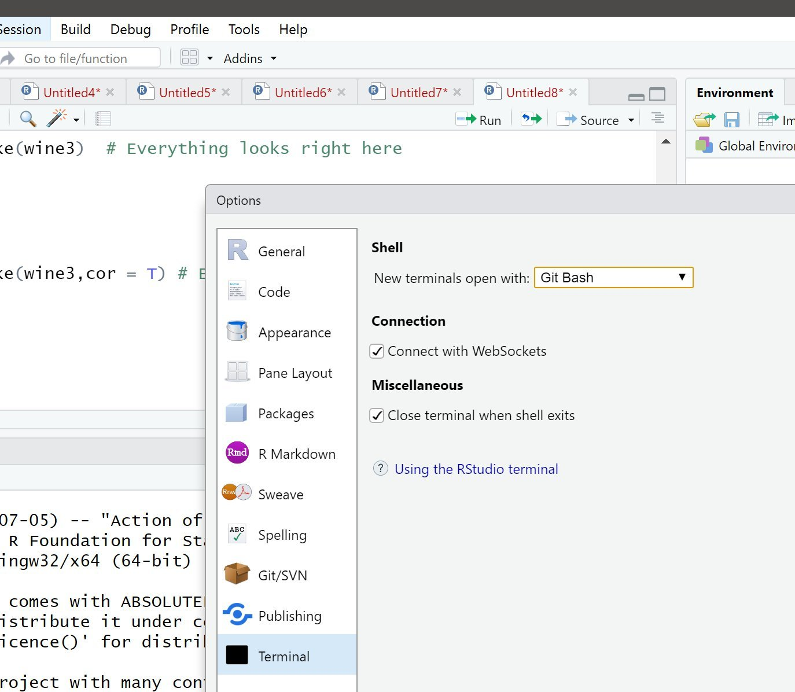

# System setup {#setup}

## Installing and updating Python {#python-setup}

In order to start off on a good footing, we recommend you follow these system set-up instructions so you will run into fewer technical issues (compared to not using the same system this book was designed for).

We recommend installing Python **3.7** via the Anaconda distribution, following the instructions here: <https://docs.anaconda.com/anaconda/install/>. If you already have installed this distribution, ensure Python, and the `conda` package manager is up to date by running the following commands:

```
$ conda update --all
```

Next, use conda to install [Python poetry](https://python-poetry.org/) - a python package that will help us more efficiently build our Python packages:

```
$ conda install -c conda-forge poetry
```

Finally, we install `cookiecutter` - a python package that will create Python projects from project templates

```
$ conda install -c conda-forge cookiecutter
```

## Register for a PyPI account

To publish a Python package on PyPI to share with others, you will need to register for a PyPI account. You can do so freely by clicking here: <https://pypi.org/account/register/>

Before we are ready to publish our packages on PyPI, it is advisable that we test drive them on TestPyPI first. To do so, you need to also register for a TestPyPI account. You can do so freely by clicking here: <https://test.pypi.org/account/register/>

## Setting up the RStudio IDE with Python {#rstudio-python-setup}

This book will use the RStudio integrated development environment (IDE) to develop Python packages *- we use RStudio because in the [UBC Master of Data Science program](https://ubc-mds.github.io/about/) we teach both the R and Python programming languages and prefer to use an IDE that works well with both.* However, any other Python IDE should work and we briefly describe some in [Alternative Python IDEs]. If you would like to use the RStudio IDE we recommend installing the most recent version of the IDE from the preview site: <https://rstudio.com/products/rstudio/download/preview/> and then [installing R from CRAN](https://cran.r-project.org/), and the `reticulate` R package via `install.packages("reticulate")` from the R console inside RStudio. When installing reticulate, you will be prompted to install miniconda, if you have already installed the Anaconda distribution of Python, answer "no" to installing miniconda at this prompt. 

### Find where Anaconda is installed on your machine

#### Mac OS & Linux
In terminal, type: `which Python`

#### Windows
In the Anaconda Prompt type: `where python`.

### Configuring `reticulate` for to use the Python REPL inside RStudio

Create a file named `.Rprofile` in your `$HOME` directory that contains the following:

```
Sys.setenv(RETICULATE_PYTHON = "path_to_the_folder_containing_anaconda's_python")
```

For me the `"path_to_the_folder_containing_anaconda's_python"` was `'Users/user1/anaconda3/bin/Python'` on a Mac OS.

Restart RStudio for this to take effect.

### Configuring the RStudio terminal

#### Mac OS & Linux

Open (or create) the file called `.bash_profile` in your `$HOME` directory and add the following to the last line of that file:

```
export PATH="path_to_the_folder_containing_anaconda's_python:$PATH"
```

For me that line is `export PATH="//anaconda3/bin:$PATH"`.

Restart RStudio for this to take effect.

#### Windows

The default terminal in RStudio on Windows is PowerShell. This causes some unexpected problems as its not a true bash shell. You **should** change this using the following menu selections inside RStudio: Global Options -> Terminal -> Shell -> Git Bash



## Alternative Python IDEs

Commonly used free Python IDEs include [Visual Studio Code](https://code.visualstudio.com/), [Atom](https://atom.io/), and [PyCharm Community Edition](https://www.jetbrains.com/pycharm/). Visual Studio Code and Atom are text editors that can be customised with extensions to act as Python (or any other language) IDEs. In contrast, PyCharm is specifically a Python IDE and will work right out of the box - we describe setting up PyCharm briefly below.

### PyCharm

PyCharm offers a paid *Professional* version and free *Community* version. You can download either from <https://www.jetbrains.com/pycharm/download/>. Once downloaded, PyCharm will guide you through initial setup. We recommended using all default settings throughout the setup, with the exception of installing the *Markdown Plugin* when prompted to install "Featured Plugins".

Once setup is complete you should see something like the following screenshot:


We now need to link Anaconda with PyCharm.

1. Click *Configure* at the bottom right of the screen and then *Preferences*.
2. Select *Project Interpreter* from the tab-menu and then click the gear icon to the right of the drop-down menu that appears and select *Add...*.
3. In the pop-up menu that appears, click *System Interpreter* from the tab-menu and click the three dots *...* to the right of the drop-down menu.
4. You now need to provide the path to Anaconda's installation of Python, something like "/Users/user/anaconda3/bin/python". You can determine the path using the following:

- **Mac OS & Linux:** In terminal, type: `which Python`
- **Windows:** In the Anaconda Prompt type: `where python`.

5. Copy and paste the path into the PyCharm pop-up. At this point, your window will probably look something like the one below. Click *OK*.


6. Click *OK* again to get back to the *Preferences* menu, at which point PyCharm will show Anaconda's installation of Python in the *Project Interpreter* drop-down menu and will populate the screen with the packages available to that interpreter (these will be all the packages installed in your base Anaconda environment)
7. Click *OK* to return to the main menu.
8. To start a new project you will click *Create New Project*. In the subsequent screen, an example of which is shown below, you may choose a location for your new project and you can also select an interpreter. Choose the *Existing Interpreter* radio button and then from the drop-down menu select Anaconda's Python interpreter that we just set-up (this will likely be the only option in the drop-down menu). Click *Create* to get started.


Note that PyCharm has excellent integration with Conda environments. If you wish to use a custom Conda environment for a project, you can easily create or select an existing environment to use as a project's interpreter. To do this, in Step 3 above, simply click *Conda Environment* rather than *System Interpreter* and create or select an existing Conda environment. This environment will then be available to select as a project interpreter for new or existing projects. 

This was a brief, practical guide to getting started with PyCharm Community Edition. We recommend checking out the [documentation](https://www.jetbrains.com/pycharm/documentation/) for more guidance on setting up and using PyCharm.