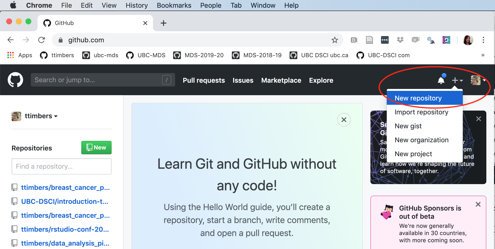
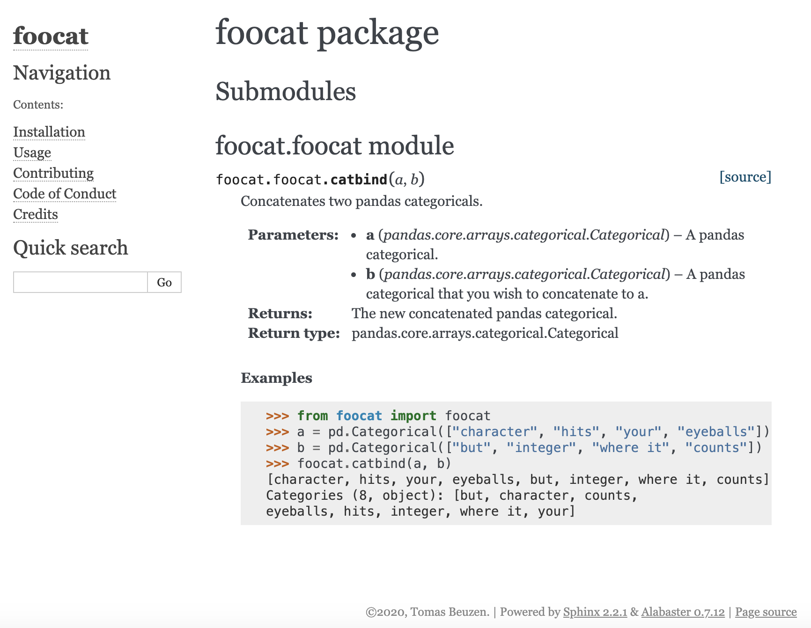

# The Whole Game {#whole-game}

```{r setup-whole-game, include = FALSE}
options(prompt = '>>> ')
options(continue = '>>> ')
```

To start this book, we will first develop an entire small toy Python package from beginning to end, with the aim of giving a high level overview of the key steps in developing a Python package. Later chapters will then explore each of these key steps in more detail. This chapter is a Pythonified version of [The Whole Game chapter](https://r-pkgs.org/whole-game.html) written by Jenny Bryan that can be found in the [R packages book](https://r-pkgs.org/).

## Use Cookiecutter & Poetry to create a Python project {#poetry-to-create-project}

The first thing to do is create a directory structure for our Python package. So that we don't have to create this structure from scratch, we will use Cookiecutter & Poetry to do this for us (both of which you installed back in [1.1 Installing and updating Python](#python-setup).

First, we'll use Cookiecutter to create the file and directory structure for our Python package. We have developed our own template which is heavily based off the template by the [PyOpenSci](https://www.pyopensci.org/) organization designed specifically for creating Python packages (PyOpenSci is a not-for-profit organization that promotes open and reproducible research through peer-review of scientific Python packages). To use our Cookiecutter template to set up the structure of your Python package, open up a terminal session, change into the directory where you want your package to live and run the line of code below :

```{python create-file-dir-structure, eval = FALSE}
$ cookiecutter https://github.com/UBC-MDS/cookiecutter-ubc-mds.git
```

You will be prompted to provide information that will help customize the project.

> In this tutorial we will be calling our package `foocat`. However, we will eventually be publishing our package to [testPyPI](https://test.pypi.org/) which is a testing version of Python's main package index [PyPI](https://pypi.org/). Package names on testPyPI and PyPI must be globally unique. As a result, you will need to choose a **unique name for your package** while following this tutorial. Something like `foocat_[your intials]` might be appropriate, but you can always check if your chosen name is already taken by visiting testPyPI and searching for that name.

Below is an example of how to respond to the Cookiecutter prompts (default values for each attribute are shown in square brackets, hitting enter will accept the default attribute value):

```
full_name [Monty Python]: Tiffany Timbers
email [monty.python@example.com]: tiffany.timbers@gmail.com
github_username [mpython]: ttimbers
project_name [My Python package]: foocat
project_slug [foocat]: foocat
project_short_description [This cookiecutter creates a boilerplate for a Python project.]: Python package that eases the pain of concatenating Pandas categoricals!
pypi_username [ttimbers]: 
version ['0.1.0']: 
Select open_source_license:
1 - MIT license
2 - BSD license
3 - ISC license
4 - Apache Software License 2.0
5 - GNU General Public License v3
Choose from 1, 2, 3, 4, 5 [1]: 1
```

We now have a new directory called `foocat` (of course, your package may have a different name but for the rest of the book, we'll keep referring to it as `foocat`). Next, we need to navigate into the `foocat` directory and initialize the project as a Poetry project so that we can take advantage of the package management and building tools of Poetry:

```{python create-project-fake, eval = FALSE}
$ cd foocat
$ poetry init
```

Again we are prompted for more information related to our package. Once again, default values are shown in square brackets and have been populated where possible from the Cookiecutter template. Here is an example of how to respond to the prompts:

```
This command will guide you through creating your pyproject.toml config.

Package name [foocat]:  
Version [0.1.0]:  
Description []:  Python package that eases the pain concatenating Pandas categoricals!
Author [ttimbers <tiffany.timbers@gmail.com>, n to skip]:  
License []:  MIT
Compatible Python versions [^3.7]:  

Would you like to define your main dependencies interactively? (yes/no) [yes] no
Would you like to define your dev dependencies (require-dev) interactively (yes/no) [yes] no
Generated file

[tool.poetry]
name = "foocat"
version = "0.1.0"
description = "Python package that eases the pain concatenating Pandas categoricals!"
authors = ["ttimbers <tiffany.timbers@gmail.com>"]
license = "MIT"

[tool.poetry.dependencies]
python = "^3.7"

[tool.poetry.dev-dependencies]

[build-system]
requires = ["poetry>=0.12"]
build-backend = "poetry.masonry.api"


Do you confirm generation? (yes/no) [yes]
```

> Note that we said "no" to defining our dependencies interactively because it is more efficient to define them using `poetry add` which we will explore a bit later on.

After using Cookiecutter and Poetry, we end up with the following directory structure:

```
foocat
├── CONDUCT.rst
├── CONTRIBUTING.rst
├── CONTRIBUTORS.rst
├── docs
│   └── conduct.rst
│   └── conf.py
│   └── contributing.rst
│   └── contributors.rst
│   └── index.rst
│   └── installation.rst
│   └── make.bat
│   └── Makefile
│   └── usage.rst
├── foocat
│   └── __init__.py
│   └── foocat.py
├── .github
│   └── workflows
│       └── build.yml
│       └── release.yml
├── .gitignore
├── LICENSE
├── pyproject.toml
├── .readthedocs.yml
├── README.md
└── tests
    ├── __init__.py
    └── test_foocat.py
```

These two simple steps (Cookiecutter + Poetry) have given us a boilerplate file and directory structure suitable for building our Python package. While there are quite a few files in our boilerplate, at this point we only need to worry about a few of these to get a working package together. Specifically, we'll be working on:

- the file where we will write the Python functions that our package will distribute (`foocat/foocat.py`);
- the file where we will write tests to ensure that our package's functions work as we expect (`tests/test_foocat.py`); and,
- the `pyproject.toml` file that defines our project's metadata and dependencies and how it will eventually be built and distributed.

Later chapters will focus on the other components of the boilerplate, which can be used to refine your package and packaging process with, for example, quality documentation, continuous integration testing, version bumping, etc.

> **Optional for RStudio IDE users**
> 
> Users of the RStudio IDE may also want to make this Python project directory an RStudio project. Why - you might ask? Well, once you have an `*.Rproj` file, you can use that file to quickly open the RStudio IDE (which has a terminal and an interactive Python REPL, assuming you have set this up with `reticulate`) to the project's root directory.

## Put your project under version control {#version-control}

Before we start developing our package it is generally good practice to put your data science projects under local and remote version control. The tools we recommend using for this are Git & GitHub. For this book, we assume readers have [Git](https://git-scm.com/) installed on their machine, have novice Git skills, and have a [GitHub.com](https://github.com/) account.

### Set up local version control

From the terminal and in the root `foocat` directory, we will initialize the repository to be tracked by Git using:

```
$ git init

Initialized empty Git repository in /Users/tiffany/Documents/ubc-mds/foocat/.git/
```

Next, we need to tell Git which files to track (which will be all of them at this point) and commit these changes locally:

```
$ git add .
$ git commit -m "initial project set-up"
```

```
[master (root-commit) ca03932] initial project set-up
 23 files changed, 827 insertions(+)
 create mode 100644 .github/workflows/build.yml
 create mode 100644 .github/workflows/release.yml
 create mode 100644 .gitignore
 create mode 100644 .readthedocs.yml
 create mode 100755 CONDUCT.rst
 create mode 100755 CONTRIBUTING.rst
 create mode 100755 CONTRIBUTORS.rst
 create mode 100755 LICENSE
 create mode 100644 README.md
 create mode 100755 docs/Makefile
 create mode 100755 docs/conduct.rst
 create mode 100755 docs/conf.py
 create mode 100755 docs/contributing.rst
 create mode 100755 docs/contributors.rst
 create mode 100755 docs/index.rst
 create mode 100755 docs/installation.rst
 create mode 100755 docs/make.bat
 create mode 100755 docs/usage.rst
 create mode 100644 foocat/__init__.py
 create mode 100644 foocat/foocat.py
 create mode 100644 pyproject.toml
 create mode 100644 tests/__init__.py
 create mode 100644 tests/test_foocat.py
```

### Set-up remote version control

Now that we have set up our local version control, let's create a repository on [GitHub.com](https://github.com/) and set that as the remote version control home for this project:



The options we recommend for setting up a repository for a Python package using the workflow we present in this book include: 

- give the GitHub.com repository the same name as your Python Poetry project's name;
- make the GitHub.com repository public; and,
- **do not** initialize the GitHub.com repository with a README file.


Next, we set-up the remote address locally, and push our project to GitHub.com:

```
$ git remote add origin git@github.com:ttimbers/foocat.git
$ git push -u origin master
```

> Note 1: the example above uses SSH authentication with GitHub, HTTPS authentication works as well and would use this url in place of the one shown above to set the remote: `https://github.com/ttimbers/foocat.git`.

> Note 2: continuous integration (automated building and testing of your package) using GitHub Actions has been set up in the MDS Cookiecutter template. Every time you push changes to the remote repository the automated building and testing will be triggered, but at this point, the builds will fail because we haven't fully set up our package yet. We'll be looking at continuous integration in a later chapter but for now, you may receive email notifications from GitHub alerting you that your builds failed. We recommend turning these notifications off for now by following [these instructions](https://help.github.com/en/github/managing-subscriptions-and-notifications-on-github/configuring-notifications#choosing-your-notification-settings).

## Writing our first function {#first-function}

[Pandas categoricals](https://pandas.pydata.org/pandas-docs/stable/reference/api/pandas.Categorical.html) are a very useful data type for modeling (and were inspired by "factors" in R), but certain manipulations of this data type can be tricky during data wrangling. One such manipulation is the concatenation (joining) of two Pandas categoricals. Let's observe the result of trying to concatenate two Pandas categorical objects:

```{python cat-pandas-cat-error, error = TRUE, prompt=TRUE}
import pandas as pd
a = pd.Categorical(["character", "hits", "your", "eyeballs"])
b = pd.Categorical(["but", "integer", "where it", "counts"])
pd.concat([a, b])
```

This error occurs because the categoricals are represented as integers in memory, and in the variable `a`, the integer 0 corresponds to the word "character" while in `b`, the integer 0 corresponds to the word "but". Thus, when we ask Python to concatenate these two Pandas categorical options it doesn't know what to do with these integer mappings to different categories, and so it throws an error. We can get around this several ways, one way is to convert the Pandas categoricals to a `str` type, then do the concatenation, and finally convert the concatenated Pandas obeject back to a categorical again. We demonstrate that approach below:

```{python cat-pandas-cat, prompt=TRUE}
concatenated = pd.concat([pd.Series(a.astype("str")), pd.Series(b.astype("str"))])
pd.Categorical(concatenated)
```

That seems to work 🎉, but it's quite a bit of typing every time we want to do this... So let's turn this code into a function called `catbind`!

```{python cat-pandas-cat-function}
def catbind(a, b):
  concatenated = pd.concat([pd.Series(a.astype("str")),
                            pd.Series(b.astype("str"))])
  return pd.Categorical(concatenated)

catbind(a, b)
```

> Note that this book assumes you know how to write, document and test functions in Python. To learn more about this see [Think Python, Chapter 3: Functions](http://greenteapress.com/thinkpython/html/thinkpython004.html) by Allen Downey.

So where do we save this function if we want it to be a part of our `foocat` Python package? Let's review the landscape of our Python project so far:

```
foocat
├── CONDUCT.rst
├── CONTRIBUTING.rst
├── CONTRIBUTORS.rst
├── docs
│   └── conduct.rst
│   └── conf.py
│   └── contributing.rst
│   └── contributors.rst
│   └── index.rst
│   └── installation.rst
│   └── make.bat
│   └── Makefile
│   └── usage.rst
├── foocat
│   └── __init__.py
│   └── foocat.py
├── .github
│   └── workflows
│       └── build.yml
│       └── release.yml
├── .gitignore
├── LICENSE
├── pyproject.toml
├── .readthedocs.yml
├── README.md
└── tests
    ├── __init__.py
    └── test_foocat.py
```

All the code that we would like the user to run as part of our package should live inside the `foocat` directory. Typically, for a relatively small package with just a few functions, we would house them inside a single python module (i.e., a `.py` file). Our template project directory structure already created and named such a module for us: `foocat/foocat.py`. Let's save our function there. Additionally, given that our package depends on the Pandas Python package, we should import Pandas at the top of the `foocat.py` file. Here's what `foocat.py` should now look like:

```
import pandas as pd


def catbind(a, b):
    concatenated = pd.concat([pd.Series(a.astype("str")),
                              pd.Series(b.astype("str"))])
    return pd.Categorical(concatenated)

```

## Test drive your package code

To test drive the function we just wrote we first install our package locally using Python poetry. We choose to do this with Python Poetry as opposed to using Python's native package manager `pip` because Poetry automatically creates a virtual environment for us and will perform tricky tasks like package solving that can sometimes trip us up when we use `pip` alone. We can install our packge locally by ensuring we are in our root package directory and running:

```
$ poetry install
```

```
Creating virtualenv foocat-z0_J6H1I-py3.7 in /Users/tiffany/Library/Caches/pypoetry/virtualenvs

Installing dependencies from lock file

No dependencies to install or update

  - Installing foocat (0.1.0)
```

Now, inside the root project directory we can open an interactive Python session (using `python` at the command line) and import our `foocat` module which contains our `catbind` function as shown:

```{python import-catbind, eval = FALSE}
>>> from foocat import foocat
```

The `foocat` module has now been mapped to the current session's namespace and we can access the `catbind` function in our Python session using dot notation: `foocat.catbind` (note that if you wanted to import a specific function, rather than the whole module, you could do `from foocat.foocat import catbind`, in which case "dot notation" would not be required to use the function). Let's try to use the function to concatenate two Pandas categoricals:

```{python test-drive-catbind, eval = FALSE}
import pandas as pd
a = pd.Categorical(["character", "hits", "your", "eyeballs"])
b = pd.Categorical(["but", "integer", "where it", "counts"])
foocat.catbind(a, b)
```

```
[character, hits, your, eyeballs, but, integer, where it, counts]
Categories (8, object): [but, character, counts, eyeballs, hits, integer, where it, your]
```

Hurray again! This seems to work as expected! Now that we have something working, let's commit this to version control:

```
$ git add .
$ git commit -m "First working version of catbind function"
```
 
## Add package function dependencies {#pkg-func-deps}

Our function depends on the Pandas package, and without it, it would fail to work. Thus we need to record this dependency in a useful place so that when we publish our packaged code this important information (and the mechanism for making it work) will be shipped along with it. We again use `poetry` to do this, using the `add` command. This command will update the `[tool.poetry.dependencies]` section of the `pyproject.toml` file which currently looks like this and lists only Python as a project dependency:

```
[tool.poetry]
name = "foocat"
version = "0.1.0"
description = "Python package that eases the pain concatenating Pandas categoricals!"
authors = ["ttimbers <tiffany.timbers@stat.ubc.ca>"]
license = "MIT"

[tool.poetry.dependencies]
python = "^3.7"

[tool.poetry.dev-dependencies]

[build-system]
requires = ["poetry>=0.12"]
build-backend = "poetry.masonry.api"
```

Let's add our Pandas dependency now:

```
$ poetry add pandas
```

```
Using version ^1.0.1 for pandas

Updating dependencies
Resolving dependencies... (0.1s)

Writing lock file


Package operations: 4 installs, 1 update, 0 removals

  - Updating six (1.14.0 /usr/local/Cellar/poetry/1.0.3/libexec/vendor/lib/python3.7/site-packages -> 1.14.0)
  - Installing numpy (1.18.1)
  - Installing python-dateutil (2.8.1)
  - Installing pytz (2019.3)
  - Installing pandas (1.0.1)
```

Now if we view our `pyproject.toml` file we see that `pandas` is listed as a dependency:

```
[tool.poetry]
name = "foocat"
version = "0.1.0"
description = "Python package that eases the pain concatenating Pandas categoricals!"
authors = ["ttimbers <tiffany.timbers@stat.ubc.ca>"]
license = "MIT"

[tool.poetry.dependencies]
python = "^3.7"
pandas = "^1.0.1"

[tool.poetry.dev-dependencies]

[build-system]
requires = ["poetry>=0.12"]
build-backend = "poetry.masonry.api"
```

This changed two files, `pyproject.toml` (which we printed above) and `poetry.lock` (a record of all the packages and exact versions of them that poetry downloaded for this project). These changes are important for our package, so let's commit them to version control as well:

```
$ git add .
$ git commit -m "added pandas as a dependency"
```

> For those of you who have used `requirements.txt` before with `pip`, you can think of `poetry.lock` as the `poetry` equivalent of that file. You can even generate a `requirements.txt` from poetry via `poetry export -f requirements.txt > requirements.txt` if needed.

## Package documentation {#pkg-docs}

### Reading and rendering the docs locally {#local-docs}

For the users of your code (including your future self) we need to have readable and accessible documentation expressing how to install your package, and how to use the user-facing functions within it. We'll discuss documentation in detail in [Chapter 5](#documentation), but for now, will demonstrate the basic steps required to get your documentation up-and-running quickly.

The Python packaging ecosystem has a tool to help you easily make documentation - [Sphinx](https://docs.readthedocs.io/en/stable/intro/getting-started-with-sphinx.html). In the Cookiecutter template we used to define our package's directory structure, there is a basic docs template that the Cookiecutter progam filled in with the information you entered interactively when you ran `cookiecutter https://github.com/UBC-MDS/cookiecutter-ubc-mds.git`. These files live in the `docs` directory and are `.rst` (reStructuredText markup language) filetype. This is a lightweight markup language that works similar to Markdown but uses different syntax. The templates provided to you here are fairly well formatted already, so you do not have to change the `.rst` formatting, however if you are interested in doing so, you can see the [Sphinx documentation](https://www.sphinx-doc.org/en/master/usage/restructuredtext/index.html) to get started.

First, we need to install `sphinx` as a development dependency using `poetry`. 

```
$ poetry add --dev sphinx
```

> Note the use of `--dev` to specify a development, rather than a package function dependency, i.e., a package that is not required by a user to use your package, but is required for development purposes. If you look in `pyproject.toml` you will see that `sphinx` gets added under the `[tool.poetry.dev-dependencies]` section as opposed to the `[tool.poetry.dependencies]` section (where package function dependencies get installed, such as pandas in this example).

Next, to render the help documents locally from `.rst` to `.html` we need to navigate into the `docs` directory and then run the `Makefile` there, directing it to run the `.html` target:

```
$ cd docs
$ poetry run make html
```

> Note 1: we append `poetry run` in front of most of our commands in this Python package workflowto ensure that we are using only the software tools we have specifically installed in the `poetry` virtual environment for our package.

> Note 2: you may see many red warnings while the docs are rendering, but these can be ignored and are meerely suggestions on how to improve your docs if you wish.

If we now look inside our `docs` directory we see that it has expanded, and the rendered `.html` files live in `_build/html`. We can open `_build/html/index.html` to view our docs locally on our laptop, they should look something like this:


If we click on the "Module Index" link under the heading "Indices and tables" at the bottom of the page we get a "Your file was not found message":


This is because we haven't written any documentation for our package function. Let's do that now by adding a `numpy`-style docstring to the `catbind` function in `foocat/foocat.py` as shown below:

```
import pandas as pd


def catbind(a, b):
    """
    Concatenates two pandas categoricals.

    Parameters
    ----------
    a : pandas.core.arrays.categorical.Categorical
      A pandas categorical.
    b : pandas.core.arrays.categorical.Categorical
      A pandas categorical that you wish to concatenate to a.

    Returns
    -------
    pandas.core.arrays.categorical.Categorical
      The new concatenated pandas categorical.

    Examples
    --------
    >>> from foocat import foocat
    >>> a = pd.Categorical(["character", "hits", "your", "eyeballs"])
    >>> b = pd.Categorical(["but", "integer", "where it", "counts"])
    >>> foocat.catbind(a, b)
    [character, hits, your, eyeballs, but, integer, where it, counts]
    Categories (8, object): [but, character, counts,
    eyeballs, hits, integer, where it, your]
    """
    concatenated = pd.concat([pd.Series(a.astype("str")),
                              pd.Series(b.astype("str"))])
    return pd.Categorical(concatenated)

```

Now we can use a `sphinx` extension (`napolean`) in combination with `autodoc` to render our `numpy`-styled docstring into a modules page on our docs. To do this we need to install another dev dependency:

```
$ poetry add --dev sphinxcontrib-napoleon
```

> Note that normally to use this extension, we would also have to add `extensions = ['sphinx.ext.napoleon']` in the `conf.py` file in the `docs` directory, but we have taken care of this for you already with our Cookiecutter template.

Then we can change back to our root `foocat` directory, and use `sphinx-apidoc` and `poetry` to re-render our docs:

```
$ cd ..
$ poetry run sphinx-apidoc -f -o docs/source foocat
$ cd docs
$ poetry run make html
```

Now when we click on the "Module Index" link under the heading "Indices and tables" we see a webpage that has a link to our module, `foocat.foocat`:


And we can click on that to see the docs for `foocat.foocat.catbind`. Which should look roughly like this:



Another hurray! 🎉🎉🎉 Let's commit this to version control and push to our remote:

```
$ cd ..
$ git add .
$ git commit -m "generated and render docs for local viewing"
$ git push
```

### Reading and rendering the docs remotely {#remote-docs}

To share these docs online, we need to link our GitHub repository to [Read the Docs](https://readthedocs.org/) (where we will build and host our docs remotely). To do this:

1. Visit <https://readthedocs.org/> and click on "Sign up";
2. Select "Sign up with GitHub";
3. Click "Import a Project";
4. Click "Import Manually";
5. Fill in the project details by providing a package name (this must be a unique name, we've already taken "foocat" so perhaps try "foocat[your initials]"), the repository URL, and leave the rest as is. Click "Next"; and,
6. Click "Build version".

After following the steps above, your docs should get successfully built on [Read the Docs](https://readthedocs.org/) and you should be able to access them via the "View Docs" button on the build page, or from the link that Cookiecutter created for you on your repositories `README.md` file.

> Note that for [Read the Docs](https://readthedocs.org/) to work with the `poetry` package workflow you need to have a `.readthedocs.yml` in the root of your Python package. We have created this for you using Cookiecutter and you can view it [here](https://github.com/UBC-MDS/cookiecutter-ubc-mds/blob/master/%7B%7Bcookiecutter.project_slug%7D%7D/.readthedocs.yml).

## Testing {#poetry-testing}

We have interactively taken `catbind` for a test drive, but to prove to our future self and others that our code does in fact do what it is supposed to do, let's write some formal unit tests. We'll discuss testing in detail in [Chapter 4](#testing), but will go over the key steps here. In Python packages, our tests live inside the `test` directory, typically in a file called `test_<module_name>.py`, thus for this package this is `tests/test_foocat.py`. Let's add a unit test (as a function named `test_catbind`) for our `catbind` function there now:

```{python foocat-test, eval = FALSE}
from foocat import foocat
import pandas as pd


def test_catbind():
    a = pd.Categorical(["character", "hits", "your", "eyeballs"])
    b = pd.Categorical(["but", "integer", "where it", "counts"])
    assert ((foocat.catbind(a, b)).codes == [1, 4, 7, 3, 0, 5, 6, 2]).all()
    assert ((foocat.catbind(a, b)).categories == ["but", "character",
            "counts", "eyeballs", "hits", "integer", "where it", "your"]).all()

```

> Given that we use `pd.Categorical` to create objects to test on, we have to import the `pandas` package at the top of our test file.

We only have a single function to test for this package, and so we could run this file by opening up an interactive Python session, importing the file, and then calling the `test_catbind` function. But as our packages have more and more functions, and more and more modules, it is more efficient to automate this workflow. In the Python package ecosystem one way we can do this is to use `pytest`. A single call to `pytest` from the root of a project will look for all files in the `tests` directory, import all files prefixed with `test*` and then call all functions prefixed with `test*`. Pretty great! 

To do this, we first add `pytest` as a dev dependency via `poetry`:

```
$ poetry add --dev pytest
```

Then to run the tests, we use `poetry` to run `pytest` in our virtual environment (make sure you're in the root `foocat` directory):

```
$ poetry run pytest
```

We get no error returned to us, indicating that our tests passed, Hurray! This suggests that the code we wrote is correct (at least to our test specifications)! Now we can share this with the world by putting these under local and remote version control:

```
$ git add .
$ git commit -m "added unit tests for catbind"
$ git push
```
> Note: It is very possible that your tests are correct and your function passes the tests yet the continuous integrations builds by GitHub Actions triggered when you push changes to the remote repository are still failing. This is because the continuous integration build has more checks than just whether the tests pass, for example, it also checks code style using a tool called `flake8`. This and the other build checks are the subject of later chapters in this book.

## Building your package and publishing to testPyPI {#build-and-publish}

Python packages are generally shared via the [PyPI package index](https://pypi.org/). However, when we are just starting to develop packages, and/or at the development stage of our package, we typically first check that everything works by submitting to [testPyPi](https://test.pypi.org/). `poetry` has a command called `publish` which we can use to do this, however the default behaviour is to publish to PyPI. So we need to add testPyPI to the list of repositories `poetry` knows about via:

```
$ poetry config repositories.test-pypi https://test.pypi.org/legacy/
```

Before we send our package, we first need to build it to source and wheel distributions (the format that PyPI distributes and something you'll learn more about in the [Chapter 3](#package-structure)) using `poetry build`:

```
$ poetry build
```

Finally, to publish to testPyPI we can use `poetry publish` (you will be prompted for your testPyPI username and password, sign up for one if you have not already done so):

```
$ poetry publish -r test-pypi
```

Now you should be able to visit your package on testPyPI (e.g., <https://test.pypi.org/project/foocat/>) and download it from there using `pip` via:

```
pip install --index-url https://test.pypi.org/simple/ --extra-index-url https://pypi.org/simple foocat
```

> By default `pip install` will search PyPI for the named package. However, we want to search testPyPI because that is where we uploaded our package. The argument `--index-url` points `pip` to the testPyPI index. However, our package `foocat` depends on `pandas` which can't be found on testPyPI (it is hosted on PyPI). So, we need to use the `--extra-index-url` argument to also point `pip` to PyPI so that it can pull any necessary dependencies of `foocat` from there.
