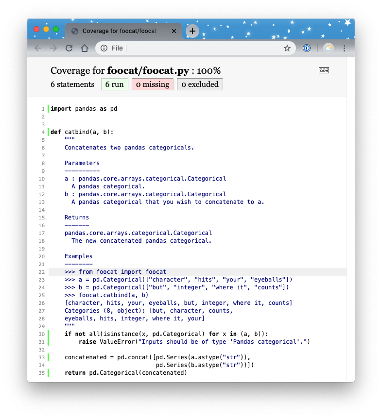

# Testing {#testing}

```{r setup-testing, include = FALSE}
options(prompt = '>>> ')
options(continue = '>>> ')
```

Testing is an important part of package development but one that is often neglected due to the perceived additional workload. However, the reality is quite the opposite! Introducing formal, automated testing into your workflow can have several benefits:

1. **Fewer bugs**: you’re explicitly constructing and testing your code from the viewpoint of a developer and a user;
2. **Better code structure**: writing tests forces you to structure and compartmentalise your code so that it's easier to test and understand;
3. **Easier development**: formal tests will help others (and your future self) add features to your code without breaking the tried-and-tested base functionality.

Section [2.7 Testing](#poetry-testing) in [The Whole Game chapter](#whole-game), briefly introduced unit testing in Python package development. This chapter now describes in more detail how to implement formal and automated testing into a Python workflow. This chapter is inspired by [the Testing chapter](https://r-pkgs.org/tests.html) of the [R packages book](https://r-pkgs.org/) written by Jenny Bryan and the [`pytest` package documentation](https://docs.pytest.org/en/latest/).

## Testing in Python {#python-pytest}

A unit test is a test written to verify that a chunk of code is working as expected. You probably already conduct informal unit tests of your code in your current workflow. In a typical workflow, we write code and then run it a few times in a Python session to see if it's working as we expect. This is informal testing, sometimes called "manual testing" or "exploratory testing". The whole idea behind automated testing is to define a formal, efficient and reproducible unit testing procedure to test your code.

There are a few testing frameworks available in Python. The two most common are:

1. [`unittest`](https://docs.python.org/3/library/unittest.html)
2. [`pytest`](https://docs.pytest.org/en/latest/)

The `unittest` framework is part of the standard Python library and has been around for a while so is still used by many open-source Python projects. However, we will be using `pytest` as our testing framework in this chapter. `pytest` is not part of the standard Python library but is the preferred testing framework of choice at the moment. It is fully-featured, simple and intuitive to use (especially for beginners), and is supported and extendable by a large ecosystem of plugins.

## Testing workflow

The basic testing workflow comprises three key parts:

1. Create the test file and directory structure.
2. Write and run tests.
3. Determine test code coverage.

We'll describe each step in a little more detail below, but be aware that the whole testing workflow is an iterative procedure. As you develop your code, add features, and find bugs, you'll be writing additional tests, checking the code coverage, writing more tests, etc. In the rest of this chapter we'll be revisiting and building on the toy Python package you created in [The Whole Game chapter](#whole-game).

## Test Structure

`pytest` will run all files of the form `test_*.py` or `*_test.py` in the current directory and its subdirectories. Standard practice for Python packages is to place test modules in a `test` subdirectory within the root package directory. The MDS Cookiecutter template that we downloaded and used in [The Whole Game chapter](#whole-game) to build our `foocat` package automatically created this directory structure for us:

```
foocat
├── CONDUCT.md
├── CONTRIBUTING.md
├── CONTRIBUTORS.md
├── docs
├── foocat
├── .github
├── .gitignore
├── LICENSE
├── pyproject.toml
└── tests
    ├── __init__.py
    └── test_foocat.py
```

Large libraries often split tests up into multiple `test_*.py` or `*_test.py` files within the `tests` directory to better organise tests. However, for most Python packages a single file will suffice, which by default is named `test_yourpackagename.py`. Recall that in [The Whole Game chapter](#whole-game) we added the following test of our `catbind()` function in the file `test_foocat.py`:

```{python, eval = FALSE}
from foocat import foocat
import pandas as pd


def test_catbind():
    a = pd.Categorical(["character", "hits", "your", "eyeballs"])
    b = pd.Categorical(["but", "integer", "where it", "counts"])
    assert ((foocat.catbind(a, b)).codes == [1, 4, 7, 3, 0, 5, 6, 2]).all()
    assert ((foocat.catbind(a, b)).categories == ["but", "character",
            "counts", "eyeballs", "hits", "integer", "where it", "your"]).all()

```

We can run that test by simply typing `poetry run pytest` at the command line.

> Note 1: Recall that we have already installed `pytest` as a development dependency in our package. If you skipped this step previously, use the following command: `poetry add --dev pytest`.

> Note 2: We will continue to prefix our commands with `poetry run` to ensure we are using the software tools installed in our poetry virtual environment.

```
$ poetry run pytest

======================== test session starts =========================
platform darwin -- Python 3.7.4, pytest-5.3.5, py-1.8.1, pluggy-0.13.1
rootdir: /Users/tbeuzen/foocat
collected 1 item                                                      

tests/test_foocat.py .                                          [100%]

========================= 1 passed in 0.66s ==========================
```
The output of `pytest` provides some basic system information, along with how many tests were run and what percentage passed. If a test fails, it will output the trace-back of the error, so you can see exactly what line of your test failed. That's really all there is to the basics of automated testing! In the next section, we'll discuss how to write tests using `pytest` in more detail.

## Writing tests {#pytest-tests}

### The basics

We define tests for `pytest` to run in our `test_foocat.py` module as functions that are prefixed with `test_`. The `test_catbind()` function we defined above shows an example of this syntax. Within the test function, the test code will be written. There are three common types of tests you might want to use for evaluating your code, which are described below.

**1. Asserting that a statement is `true`**

The most common test you will write will be to compare the result of your code to a known result with the help of an `assert` statement. We've seen an example of this previously in our `test_foocat.py` module.

```{python, eval = FALSE}
def test_catbind():
    a = pd.Categorical(["character", "hits", "your", "eyeballs"])
    b = pd.Categorical(["but", "integer", "where it", "counts"])
    assert ((foocat.catbind(a, b)).codes == [1, 4, 7, 3, 0, 5, 6, 2]).all()
    assert ((foocat.catbind(a, b)).categories == ["but", "character",
                "counts", "eyeballs", "hits", "integer", "where it",
                "your"]).all()
```

In the example, we are comparing the output of `(foocat.catbind(a, b)).code` and `(foocat.catbind(a, b)).categories` to what we know should be the result/what we want the result to be. As you can see, in a `pytest` test function you may include one or more `assert` statements. If any of the included `assert` functions fail, the whole test will fail.

The `assert` statement can be used with any statement that evaluates to a boolean (`true`/`false`). You may also follow the `assert` statement with a string that will provide relevant information to the user if the `assert` fails. Try the following `assert` statements in a Python session to see which pass and which fail:

```{python, eval = FALSE}
>>> x = 1
>>> assert (x > 0), 'x is not positive.'
>>> assert (x < 0), 'x is not negative.'
>>> assert (x == 1), 'x is not equal to 1.'
>>> assert (x != 1), 'x cannot be equal to 1.'
```

> The first and third statements will pass and no message will be printed to the console. The second and last statements will fail and will print their messages to the console. 

**2. Assert that two numbers are approximately equal**

Due to the limitations of floating-point arithmetic, numbers that we would expect to be equal are sometimes not:

```{python, eval = FALSE}
>>> 0.1 + 0.2 == 0.3
False
```

As a result, when working with floating point numbers it is common to write tests that determine if numbers are *approximately* equal. For this we use the `approx` class from `pytest`.

```{python, eval = FALSE}
>>> from pytest import approx
>>> 0.1 + 0.2 == approx(0.3)
True
```

You can use the `abs` and `rel` arguments to specify exactly how much absolute or relative error you want to allow in your test:

```{python, eval = FALSE}
>>> 11 == approx(10, rel=0.1)
True
>>> 11 == approx(10, abs=0.1)
False
```

**3. Assert that a certain exception is raised**

You might have noticed that our `catbind()` function is not all that robust: it does not check the type of the inputs to ensure that they are Pandas categoricals. Therefore, if we passed in an input of a different data type the code would fail, throwing a generic error message:

```{python raises-error, eval = FALSE}
>>> from foocat import foocat
>>> a = pd.Categorical(["character", "hits", "your", "eyeballs"])
>>> b = ["but", "integer", "where it", "counts"]
>>> foocat.catbind(a, b)
Traceback (most recent call last):
  File "<stdin>", line 1, in <module>
  File "/Users/tbeuzen/foocat/foocat.py", line 31, in catbind
    pd.Series(b.astype("str"))])
AttributeError: 'list' object has no attribute 'astype'
```

Type checking is an important part of your code, it helps you ensure that your code is being used as intended, and if not, raise a useful error message to the user telling them how they should be using it. Let's modify our `catbind()` function to include type-checking for Pandas categoricals. Below we've added two new lines of code directly under the (collapsed) docstring. This code checks that both the `a` and `b` inputs are Pandas categoricas, and if not, raises a `TypeError` with a useful message:

```{python, eval = FALSE}
import pandas as pd


def catbind(a, b):
    """
    Concatenates two pandas categoricals.
    
    ...
    
    """
    if not all(isinstance(x, pd.Categorical) for x in (a, b)):
        raise TypeError("Inputs should be of type 'Pandas categorical'.")

    concatenated = pd.concat([pd.Series(a.astype("str")),
                              pd.Series(b.astype("str"))])
    return pd.Categorical(concatenated)

```

We've used `TypeError` here to indicate that the user has passed the wrong type of input into our function, but there are many other built-in exceptions for particular circumstances which you can read more about in the [Python docs](https://docs.python.org/3/library/exceptions.html).

We can check that everything is working by re-trying our failed code from before:

```{python raises-test, eval = FALSE}
>>> from foocat import foocat
>>> a = pd.Categorical(["character", "hits", "your", "eyeballs"])
>>> b = ["but", "integer", "where it", "counts"]
>>> foocat.catbind(a, b)
Traceback (most recent call last):
  File "<stdin>", line 1, in <module>
  File "/Users/tbeuzen/foocat/foocat.py", line 31, in catbind
    raise ValueError("Inputs should be of type 'Pandas categorical'.")
ValueError: Inputs should be of type 'Pandas categorical'.
```

Great! Now we should formalise this unit test! The way we can check that our code will raise a particular exception for a given situation is using the `raises` statement of `pytest`. We'll import `raises` at the top of our file and add a new test called `test_input_type()` demonstrating this:

```{python, eval = FALSE}
from foocat import foocat
import pandas as pd
from pytest import raises


def test_catbind():
    a = pd.Categorical(["character", "hits", "your", "eyeballs"])
    b = pd.Categorical(["but", "integer", "where it", "counts"])
    assert ((foocat.catbind(a, b)).codes == [1, 4, 7, 3, 0, 5, 6, 2]).all()
    assert ((foocat.catbind(a, b)).categories == ["but", "character",
                                                    "counts", "eyeballs", "hits", "integer", "where it", "your"]).all()

def test_input_type():
    a = pd.Categorical(["character", "hits", "your", "eyeballs"])
    c = ["but", "integer", "where it", "counts"]
    with raises(TypeError):
            foocat.catbind(a, c)

```

Our `test_input_type()` test is passing a wrong input type (a list in this case) to `catbind()` which we expect to raise a `TypeError` exception. If the exception is raised, our test will pass. Let's check that everything is working as expected and our tests are passing by running `pytest`:

```
$ poetry run pytest
======================== test session starts =========================
platform darwin -- Python 3.7.4, pytest-5.3.5, py-1.8.1, pluggy-0.13.1
rootdir: /Users/tbeuzen/foocat
collected 2 items                                                     

tests/test_foocat.py ..                                       [100%]

========================= 2 passed in 0.78s ==========================
```

You can write as many tests as you like for your code. Ideally, your tests will cover all elements of your code. In section [4.5 Code coverage](#pytest-coverage) we'll show you how to determine how much of your code is being "covered" by your tests. But first, let's look at some ways to better organise your tests. 

### Classes, Fixtures & Parameterizations

You can populate your test module with as many individual test functions as you like, however as the number of tests grows its helpful to organise and streamline your tests. Classes, fixtures, and parameterizations in `pytest` are a few of the key techniques that can help.

**Classes**

Classes are a way of grouping related tests together. Typically your code will consist of multiple functions, each of which needs to be tested with multiple tests. So its often useful to create a class that groups all the tests for each individual function together. You can define a test class in your test module by creating a `class` with a name prefixd with "Test". You can then nest all relevant test functions within this class as is shown below:

```{python pytest-classes, eval = FALSE}
from foocat import foocat
import pandas as pd
from pytest import raises


class Testfoocat:
    def test_catbind(self):
        a = pd.Categorical(["character", "hits", "your", "eyeballs"])
        b = pd.Categorical(["but", "integer", "where it", "counts"])
        assert ((foocat.catbind(a, b)).codes == [1, 4, 7, 3, 0, 5, 6, 2]).all()
        assert ((foocat.catbind(a, b)).categories == ["but", "character", "counts", "eyeballs",
                                                        "hits", "integer", "where it", "your"]).all()

    def test_input_type(self):
        a = pd.Categorical(["character", "hits", "your", "eyeballs"])
        c = ["but", "integer", "where it", "counts"]
        with raises(ValueError):
            foocat.catbind(a, c)
```

While classes are a useful organisational tool, they have additional utility for handling fixtures and parameterizations which are discussed in the next section.

**Fixtures**

You may have noticed some repetition in our test code defining variables (`a`, `b` and `c`) to use in our tests. This violates the "DRY" principle and is where fixtures can come in handy. Fixtures are useful for sharing resources (functions or data) with test functions, and can be used by importing the `fixture` decorator from `pytest`. It is perhaps easiest to see a simple example utilising a fixture. Below we import the `fixture` decorator from `pytest` at the top of the modue and then create a fixture called `test_data()` which in this case creates a dictionary of data that we would like to use with our test functions. This fixture can be passed to our test functions as an argument, meaning that we don't have to repeatedly define our data in each test.

```{python pytest-fixtures, eval = FALSE}
from foocat import foocat
import pandas as pd
from pytest import raises, fixture


@fixture()
def test_data():
    return {'a': pd.Categorical(["character", "hits", "your", "eyeballs"]),
            'b': pd.Categorical(["but", "integer", "where it", "counts"]),
            'c': ["but", "integer", "where it", "counts"]}


class Testfoocat:
    def test_catbind(self, test_data):
        assert ((foocat.catbind(test_data['a'], test_data['b'])).codes ==
                [1, 4, 7, 3, 0, 5, 6, 2]).all()
        assert ((foocat.catbind(test_data['a'], test_data['b'])).categories == ["but", "character", "counts", "eyeballs",
                                                                                  "hits", "integer", "where it", "your"]).all()

    def test_input_type(self, test_data):
        with raises(ValueError):
            foocat.catbind(test_data['a'], test_data['c'])

```

You can read more about the utility of fixtures in the [`pytest` docs](https://pytest.readthedocs.io/en/2.8.7/fixture.html#).

**Parameterizations**

Parameteriziations can be useful for running a test multiple times using different inputs. This functionality is facilitated by the `mark.parametrize` decorator in `pytest` and is also best illustrated by example. Below we parameterize a test with two different scenarios. The first argument passed to `@mark.parametrize` is a string that defines the variables to be used in the test function (`a`, `b`, `expected`), and the second argument is a list of tuples, where each tuple contains the three elements (in order: `a`, `b`, `expected`) required to run the test. In our first test below we concatenate the categoricals `["big", "yellow"]` and `["python"]` and expect our function to return a categorical with categories `["big", "python", "yellow"]`. In the second test, we concatenate the same two categoricals, but in the reverse order, and expect to get the same result.

```{python pytest-parameterizations, eval = FALSE}
from foocat import foocat
import pandas as pd
from pytest import raises, fixture, mark


@mark.parametrize("a,b,expected", [(pd.Categorical(["big", "yellow"]),
                                    pd.Categorical(["python"]),
                                    ["big", "python", "yellow"]),
                                   (pd.Categorical(["python"]),
                                    pd.Categorical(["big", "yellow"]),
                                    ["big", "python", "yellow"])])
def test_catbind(a, b, expected):
    assert (foocat.catbind(a, b).categories == expected).all()
```

If we ran this test module with `poetry run pytest`, the output would tell us that it ran two tests (it ran one test two times with different inputs). For most of the packages you'll be creating, the methods discussed in this chapter will more than suffice your needs. However we've only scratched the surface of the `pytest` iceberg and it's possible to combine classes, fixtures, parameterizations and much more to help build efficient, streamlined tests which can be useful for larger projects. 

### When to write your tests

Whether you should write your tests before you code, after you code, or somewhere in between is a topic of much debate and overall this choice may come down personal preference, experience, resource availability, and code complexity. While there's no one "correct" testing workflow for everyone, we encourage you to have a go at Test-Driven-Development (TDD) - that is, writing your tests before you code. While this may seem a little counterintuitive at first, the TDD workflow can have many benefits:

- you will better understand exactly what code you need to write;
- you are forced to write tests upfront;
- you won't encounter large time-consuming bugs down the line; and,
- it helps to keep your workflow manageable by focussing on small, incremental code improvements and additions.

Overall, TDD requires a larger upfront cost (of time and effort), but can help keep your workflow manageable and error-free. In our experience, errors found earlier are *much* easier to fix than errors found later, i.e., the age-old proverb, *prevention is better than cure*.

## Code coverage {#pytest-coverage}

The tests you write should "cover" the majority of your code (100% is ideal but not always necessary). That is, your tests should run through most or all the lines of your code at least once. We refer to this as "code coverage" and there is a useful extension to `pytest` called `pytest-cov` which we can use to automatically determine how much coverage our tests have. Continuing with the `foocat` package that we have developed throughout this book, let's add `pytest-cov` as a development dependency of our package:

```
$ poetry add --dev pytest-cov
```

We can then determine the coverage of our tests by running the following command which specifies the Python package directory (`--cov=foocat`) and where the tests are located (`tests/`):

```
$ poetry run pytest --cov=foocat tests/

======================== test session starts =========================
platform darwin -- Python 3.7.4, pytest-5.3.5, py-1.8.1, pluggy-0.13.1
rootdir: /Users/tbeuzen/foocat
plugins: cov-2.8.1
collected 6 items                                                     

tests/test_foocat.py ..                                         [100%]

---------- coverage: platform darwin, python 3.7.4-final-0 -----------
Name                   Stmts   Miss  Cover
------------------------------------------
foocat/__init__.py         1      0   100%
foocat/foocat.py           6      0   100%
------------------------------------------
TOTAL                      7      0   100%


========================= 2 passed in 0.72s ==========================
```

The output summarises the coverage of `.py` files in the `foocat` package directory (there are only two in this case, `__init__.py` and `foocat.py`). If you want to view your coverage in more detail to see exactly where code is/isn't being covered you can save a full coverage report as described in the [pytest docs](https://pytest-cov.readthedocs.io/en/latest/reporting.html). As an example, the below command prints the report to .html format (which by default is saved in a new directory in the root package directory called "htmlcov"):

```
$ poetry run pytest --cov-report html --cov=foocat tests/
```
<center>
  
</center>