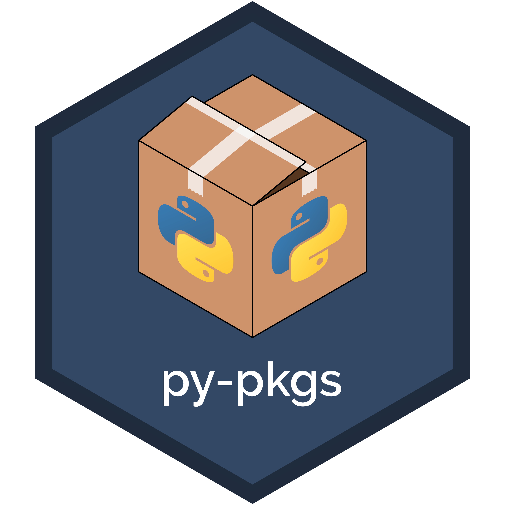

# Python packages

[Tomas Beuzen](https://www.tomasbeuzen.com/) & [Tiffany Timbers](https://www.tiffanytimbers.com/)

  

A practical book on how to distribute Python code via Python packages - available online at <https://py-pkgs.org/>. This book is aimed at Python intermediate users who want to package up their code to share it with their collaborators (including their future selves) and the wider Python community. It's scope and intent is inspired by the [R packages](https://r-pkgs.org/) book written by Hadley Wickham and Jenny Bryan.

## Building the book

If you'd like develop and build the py-pkgs book from source, you should:

- Clone this repository and run
- Run `pip install -r requirements.txt` (it is recommended you do this within a virtual environment)
- (Recommended) Clean the existing `jupyter-book clean py-pkgs/` directory
- Run `jupyter-book build py-pkgs/`

A fully-rendered HTML version of the book will be built in `py-pkgs/_build/html/`.

## Hosting the book (for developers)

The html version of the book in hosted on the `gh-pages` branch of this repo. A [GitHub actions workflow](.github/workflows/render-and-deploy.yml) has been created for this repository which automatically builds and deploys the book on Push/PR to the master branch of the repository.

## Contributing

Contributions are welcome and greatly appreciated! If you're interested in contributing to this project, take a look at the [contributor guide](docs/CONTRIBUTING.md).

## Contributors

All contributions are welcomed and recognized! You can see a list of current contributors in the [contributors tab](https://github.com/UBC-MDS/py-pkgs/graphs/contributors).

## Acknowledgements

This online book is created using the [Jupyter Book project](https://jupyterbook.org/) and [Jupyter Book cookiecutter](https://github.com/UBC-MDS/cookiecutter-jupyter-book). Go check them out!
