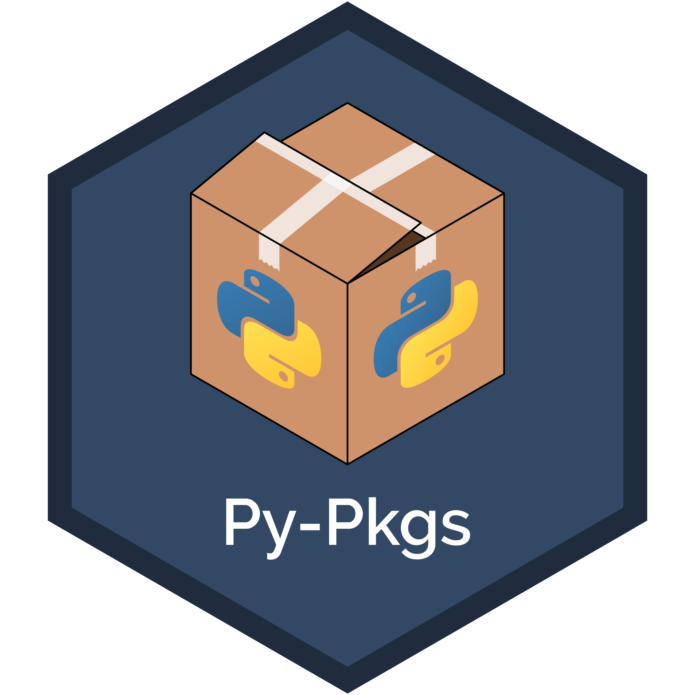

# Python packages


[](https://app.netlify.com/sites/zen-ptolemy-4bba7d/deploys)
[](https://py-pkgs.org/)

[Tomas Beuzen](https://www.tomasbeuzen.com/) & [Tiffany Timbers](https://www.tiffanytimbers.com/)

<p align="center">
  
</p>

Python packages are a core element of the Python programming language and are how you create organized, reusable, and shareable code in Python. *Python Packages* is an open source book that describes modern and efficient workflows for creating Python packages.

This book is currently under development. Please feel free to provide comments or suggestions in a [GitHub issue](https://github.com/py-pkgs/py-pkgs/issues).

## Building the book

### Jupyter Book (HTML)

If you'd like develop and build the `py-pkgs` book to HTML:

1. Clone this repository;
2. Run `pip install -r requirements.txt` (it is recommended you do this within a virtual environment);
3. Make any desired changes to source files;
4. Build the book using the `build_jupybook.sh` script:

  ```bash
  $ cd py-pkgs
  $ sh build_jupybook.sh
  ```

A fully-rendered HTML version of the book will be built in `py-pkgs/_build/html/`.

### Bookdown (PDF)

If you'd like develop and build the `py-pkgs` book to PDF:

1. Install [Docker](https://docs.docker.com/get-docker/);
2. Pull the `py-pkgs` images: `docker pull ubcdsci/intro-to-ds`;
3. Make any desired changes to source files;
4. Build the book using the `build_jupybook.sh` script:

  ```bash
  $ cd py-pkgs
  $ sh build_bookdown.sh
  ```

A fully-rendered PDF version of the book will be built in `py-pkgs/bookdown/_book/`.

## Contributing

Contributions are welcome and greatly appreciated! If you're interested in contributing to this project, take a look at the [contributor guide](docs/CONTRIBUTING.md).

## Colophon

This book was written in [JupyterLab](https://jupyterlab.readthedocs.io/en/stable/index.html) and compiled using [Jupyter Book](https://jupyterbook.org/intro.html). The source is hosted on [GitHub](https://github.com/UBC-MDS/py-pkgs) and is deployed online at <https://py-pkgs.org> with [Netlify](https://www.netlify.com/).

## Acknowledgements

We'd like to thank everyone that has contributed to the development of [*Python Packages*](https://py-pkgs.org/). This is an open source book that began as supplementary material for the University of British Columbia's Master of Data Science program and was subsequently developed openly on GitHub where it has been read, revised, and supported by many students, educators, practitioners and hobbyists. Without you all, this book wouldn't be nearly as good as it is, and we are deeply grateful. A special thanks to those who have directly contributed to the text via GitHub (in alphabetical order): `@Carreau`, `@dcslagel`.

The scope and intent of this book was inspired by the fantastic [R Packages](https://r-pkgs.org) book written by Hadley Wickham and Jenny Bryan, a book that has been a significant resource for the R community over the years. We hope that *Python Packages* will eventually play a similar role in the Python community.
