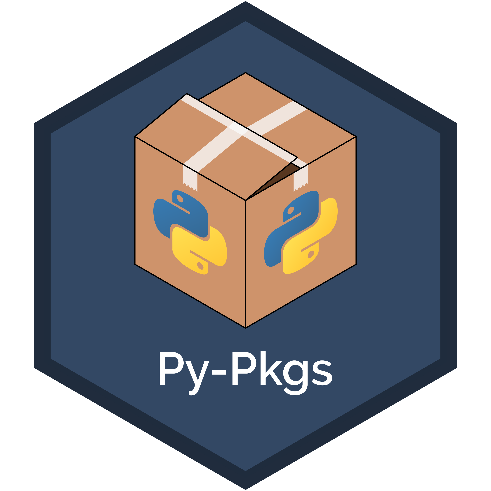

# Python packages

[](https://app.netlify.com/sites/zen-ptolemy-4bba7d/deploys)

[](https://py-pkgs.org/)
[](https://www.routledge.com/Python-Packages/Beuzen-Timbers/p/book/9781032029443)
[](https://www.amazon.com/dp/1032029447/)

[Tomas Beuzen](https://www.tomasbeuzen.com/) & [Tiffany Timbers](https://www.tiffanytimbers.com/)

<p align="center">
  
</p>

Python packages are a core element of the Python programming language and are how you create organized, reusable, and shareable code in Python. *Python Packages* is an open source book that describes modern and efficient workflows for creating Python packages.

You can purchase the book at [CRC Press](https://www.routledge.com/Python-Packages/Beuzen-Timbers/p/book/9781032029443) or on [Amazon](https://www.amazon.com/Python-Packages-Chapman-Hall-Crc/dp/1032029447).

## Editing and building the book

The book's source is a [Quarto](https://quarto.org/) book project in [`py-pkgs/`](py-pkgs/). Each chapter is a plain-text Quarto Markdown file (`.qmd`), rendered to a website (HTML) and to the print edition (PDF). The book contains no executable code; every Python and shell example is a static code block, so you don't need a Python environment to build it.

### 1. Install Quarto

Install Quarto from [quarto.org](https://quarto.org/docs/get-started/), or on macOS with Homebrew:

```bash
$ brew install --cask quarto
$ quarto --version   # the preview site builds with 1.10.18; any recent version is fine for editing
```

If you prefer `uv`, `uv tool install quarto-cli` installs the same binary from PyPI.

To build the PDF you also need a LaTeX distribution. The simplest is TinyTeX, which Quarto installs and manages for you (missing LaTeX packages are installed automatically on first render):

```bash
$ quarto install tinytex
```

If that fails with `Unable to determine latest release ... 403 - Forbidden`, you've hit GitHub's limit on anonymous API requests (common on shared or office networks). Quarto authenticates with a GitHub token if one is set in `GH_TOKEN`; with the [GitHub CLI](https://cli.github.com/) logged in:

```bash
$ GH_TOKEN=$(gh auth token) quarto install tinytex
```

### 2. Pick an editor

Any text editor works. We recommend [VS Code](https://code.visualstudio.com/) or [Positron](https://positron.posit.co/) with the [Quarto extension](https://quarto.org/docs/tools/vscode/), which adds syntax highlighting, completion for cross-references and citations, and a live preview.

The extension also has a [visual editor](https://quarto.org/docs/tools/vscode/visual-editor.html) (right-click a `.qmd` file → **Edit in Visual Mode**, or `⇧⌘F4`), which shows headings, callouts, figures and tables formatted as you type. Be aware that the visual editor rewrites the whole file into Pandoc's canonical Markdown when it saves (for example `` ```md `` becomes `` ``` {.md} ``), which makes pull-request diffs noisy. Use it for reading and drafting if you like, but prefer source mode for edits you plan to commit.

### 3. Preview while you edit

From the repository root:

```bash
$ quarto preview py-pkgs
```

This builds the HTML book, opens it in your browser and re-renders each page as you save. To build everything once:

```bash
$ quarto render py-pkgs --to html   # website  -> py-pkgs/_book/index.html
$ quarto render py-pkgs --to pdf    # print    -> py-pkgs/_book/Python-Packages.pdf
```

### Where things live

| Path | What it is |
|---|---|
| `py-pkgs/*.qmd` | Chapters, in the order listed in `py-pkgs/_quarto.yml` |
| `py-pkgs/_quarto.yml` | Book configuration: chapter list, HTML theme, PDF settings |
| `py-pkgs/references.bib` | Bibliography |
| `py-pkgs/images/` | Figures |
| `py-pkgs/latex/`, `py-pkgs/krantz.cls` | PDF-only styling: the CRC Press class, preamble, dedication and index |
| `netlify.toml` | Build settings for the preview site |

### Writing conventions

A quick reference for the syntax used in the chapters (see the [Quarto guide](https://quarto.org/docs/authoring/markdown-basics.html) for more):

| To... | Write |
|---|---|
| Label a section | `## Writing tests {#sec-05-writing-tests}` |
| Refer to a section by number ("Section 5.3") | `@sec-05-writing-tests` |
| Refer to a section by its title | `[Writing tests](#sec-05-writing-tests)` |
| Add a figure | `{#fig-05-test-workflow width="80%" fig-alt="Alt text."}` |
| Refer to a figure or table | `@fig-05-test-workflow`, `@tbl-03-toml` |
| Cite a reference in `references.bib` | `[@wickham2015]` |
| Add a note, tip or warning box | `::: {.callout-note}` ... `:::` (also `callout-tip`, `callout-warning`) |
| Add an index entry (PDF only) | `\index{pytest}` or `\index{tests!pytest}` right after the word |
| Force a page break (PDF only) | `\newpage` on its own line |

Labels use the chapter number as a prefix (`sec-05-…`, `fig-05-…`) so they stay unique across the book. `\index{}` and `\newpage` are LaTeX commands: they shape the printed book and are ignored on the website.

### Reviewing and commenting

Every change goes through a pull request into `draft-2nd-edition`:

- **Comment on the text in the pull request.** Because chapters are plain text, GitHub shows a readable line-by-line diff of each `.qmd` file. Use **Files changed** → click a line → **Add a comment** (or **Start a review**), and GitHub's suggestion button to propose replacement wording that the author can accept with one click.
- **Read the rendered result on the preview site.** Netlify builds every pull request and posts a deploy-preview link on the PR, so reviewers can read the formatted chapter (figures, callouts, cross-references) without installing anything, then leave their comments on the corresponding lines in the PR.
- **Check the PDF** by rendering it locally (`quarto render py-pkgs --to pdf`) when a change affects layout, such as wide tables, long code lines or figures.

## Contributing

Contributions are welcome and greatly appreciated! If you're interested in contributing to this project, take a look at the [contributor guide](docs/CONTRIBUTING.md).

## Colophon

The first edition was written in [JupyterLab](https://jupyterlab.readthedocs.io/en/stable/index.html) and compiled using [Jupyter Book](https://jupyterbook.org/intro.html). The second edition is written and compiled with [Quarto](https://quarto.org/). The source is hosted on [GitHub](https://github.com/UBC-MDS/py-pkgs) and is deployed online at <https://py-pkgs.org> with [Netlify](https://www.netlify.com/).

## Acknowledgements

We'd like to thank everyone that has contributed to the development of [*Python Packages*](https://py-pkgs.org/). This is an open source book that began as supplementary material for the University of British Columbia's Master of Data Science program and was subsequently developed openly on GitHub where it has been read, revised, and supported by many students, educators, practitioners and hobbyists. Without you all, this book wouldn't be nearly as good as it is, and we are deeply grateful. A special thanks to those who have contributed to or provided feedback on the text via GitHub (in alphabetical order): `benjy765`, `Carreau`, `chendaniely`, `dcslagel`, `eliasdabbas`, `fegue`, `firasm`, `Kaszanas`, `Midnighter`, `mtkerbeR`, `NickleDave`, `SamEdwardes`, `tarensanders`, `wirthual`.

The scope and intent of this book was inspired by the fantastic [R Packages](https://r-pkgs.org) book written by Hadley Wickham and Jenny Bryan, a book that has been a significant resource for the R community over the years. We hope that *Python Packages* will eventually play a similar role in the Python community.
