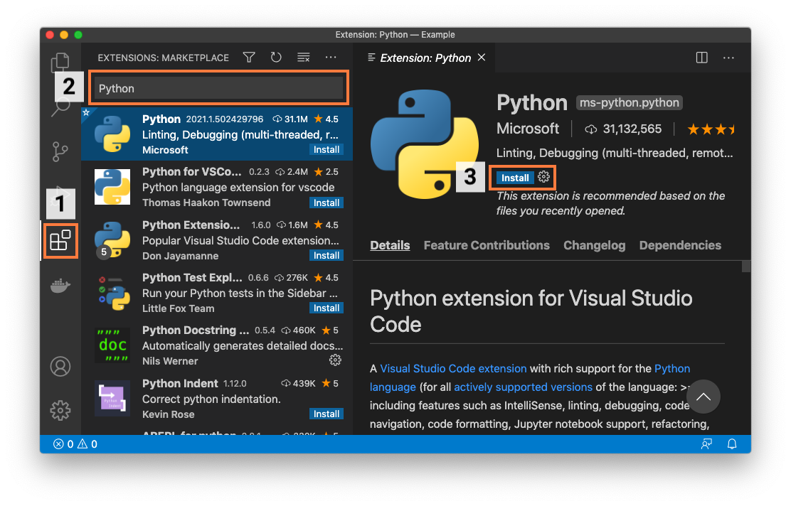
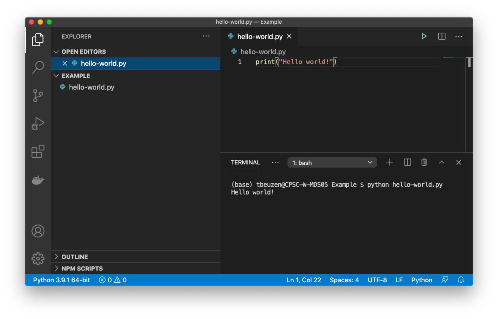
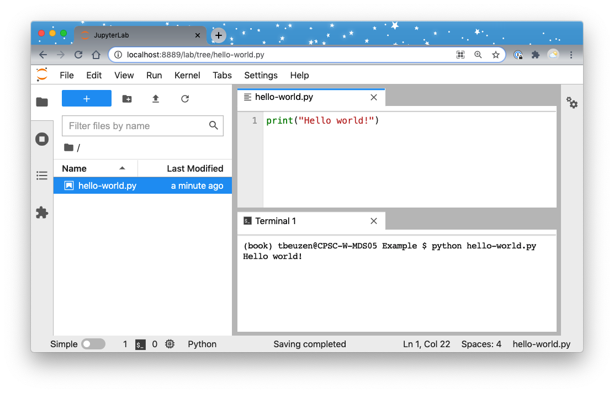

# System setup {#sec-02-system-setup}

If you intend to follow along with the code presented in this book, we recommend you follow these setup instructions so that you will run into fewer technical issues.

## The command-line interface

A command-line interface\index{command-line interface} (CLI) is a text-based interface used to interact with your computer. We'll be using a CLI for various tasks throughout this book. We'll assume Mac and Linux users are using the "Terminal"\index{Terminal} and Windows users are using the "Powershell"\index{Powershell} as a CLI.

## Installing software

**@sec-02-install-packaging-software** and **@sec-02-installing-python** describe how to install the software you'll need to develop a Python package and follow along with the text and examples in this book. However, we also support an alternative setup with Docker\index{Docker} that has everything you need already installed to get started. The Docker approach is recommended for anyone that runs into issues installing or using any of the software below on their specific operating system, or anyone who would simply prefer to use Docker — if that's you, skip to **@sec-02-register-for-a-pypi-account** for now, and we'll describe the Docker setup later in **@sec-02-developing-with-docker**.

### Install packaging software {#sec-02-install-packaging-software}

We will be using the `uv` Python package manager in this book which you can install following the official [documentation](https://docs.astral.sh/uv/getting-started/installation/). 

`uv` is a software that combines package installation, dependency resolution, and environment management into a single tool - all things that we will explore in this book. It helps you create virtual environments, which are isolated spaces on your machine where packages and their dependencies can be installed and built for distribution, without affecting other projects.

::: {.callout-warning}
## Attention

The alternative to not using virtual environments is simply installing all packages into a single, system-wide location. This is risky because different projects often require different versions of the same dependencies. As more packages are installed, version conflicts become likely and can cause code to break. Virtual environments avoid this by keeping each project’s dependencies separate and self-contained.
:::

While several package and environment managers exist in the Python ecosystem, we use `uv` in this book because it is modern, simple to use, extremely fast, and provides reliable, repeatable environments for Python projects.

### Installing Python {#sec-02-installing-python}

`uv` can install and manage Python versions on your machine. It will automatically detect if Python is already present on your machine, and will install Python versions on your machine as needed and as specified by the configuration of your `uv` virtual environment - we'll see this in **Chapter 3: [The Whole Game: How to Package a Python](#sec-03-how-to-package-a-python)** when we start to develop our first package with `uv`. 

To see what Python versions, if any, are currently installed on your machine you can run the following command (assuming you installed `uv` in **@sec-02-install-packaging-software**):

```bash
$ uv python list --only-installed
```

In this book, we'll be using Python 3.12. If that's not in your list of installed Python versions, you can install it:

```bash
$ uv python install 3.12
```

To start an interactive Python session, use:

```bash
$ uv run python3.12
```

::: {.callout-note}
When using `uv`-managed Python installations and development environments, we prepend our commands with `uv run` to isolate those process from our general software system.
:::

## Register for a PyPI account and get an authentication token {#sec-02-register-for-a-pypi-account}

The Python Package Index (PyPI)\index{PyPI} is the official online software repository for Python. A software repository\index{software repository} is a storage location for downloadable software, like Python packages. In this book we'll be publishing a package to PyPI. Before publishing packages to PyPI, it is typical to "test drive" their publication on TestPyPI\index{TestPyPI}, which is a test version of PyPI. To follow along with this book, you should register for a TestPyPI account on the [TestPyPI website](https://test.pypi.org/account/register/) and a PyPI account on the [PyPI website](https://pypi.org/account/register/).

Both TestPyPI and PyPI will require an authentication token for publishing your Python packages using `uv`. You should obtain one from each of these repositories and store them in a safe place, such as some password management software (e.g., [LastPass](https://www.lastpass.com/) or [1Password](https://1password.com/)). You can find the location of where to generate an authentication token by logging into the repository, and choosing "Account Settings" from the drop down menu under your username. Then scroll down to "API tokens" and click "Add API token". You will then be prompted to give the token a name and to set its scope. For scope choose "Entire account (all projects)".

## Set up Git and GitHub {#sec-02-set-up-git-and-github}

If you're not using a version control\index{version control} system, we highly recommend you get into the habit! A version control system tracks changes to the file(s) of your project in a clear and organized way (no more "document_1.doc", "document_1_new.doc", "document_final.doc", etc.). As a result, a version control system contains a full history of all the revisions made to your project, which you can view and retrieve at any time. You don't *need* to use or be familiar with version control to read this book, but if you're serious about creating Python packages, version control will become an invaluable part of your workflow, so now is a good time to learn!

There are many version control systems available, but the most common is Git\index{Git} and we'll be using it throughout this book. You can download Git by following the instructions in the [Git documentation](https://git-scm.com/book/en/v2/Getting-Started-Installing-Git). Git helps track changes to a project on a local computer, but what if we want to collaborate with others? Or, what happens if your computer crashes and you lose all your work? That's where GitHub\index{GitHub} comes in. GitHub is one of many online services for hosting Git-managed projects. GitHub helps you create an online copy of your local Git repository, which acts as a backup of your local work and allows others to easily and transparently collaborate on your project. You can sign up for a free GitHub account on the [GitHub website](https://www.github.com). Once signed up, you should also set up SSH authentication to help push and pull files from GitHub by following the steps in the official GitHub [documentation](https://docs.github.com/en/authentication/connecting-to-github-with-ssh).

We assume that those who choose to follow the optional version control sections of this book have basic familiarity with Git and GitHub (or equivalent). Two excellent learning resources are [*Happy Git and GitHub for the useR*](https://happygitwithr.com)[@bryan2021] and [*Research Software Engineering with Python*](https://merely-useful.tech/py-rse/git-cmdline.html)[@rsep2021].

## Python integrated development environments

A Python integrated development environment\index{integrated development environment} (IDE) will make the process of creating Python packages significantly easier. An IDE is a piece of software that provides advanced functionality for code development, such as directory and file creation and navigation, autocomplete, debugging, and syntax highlighting, to name a few. An IDE will save you time and help you write better code. Commonly used free Python IDEs include [Visual Studio Code\index{Visual Studio Code}](https://code.visualstudio.com/), [Sublime Text](https://www.sublimetext.com/), [Spyder](https://www.spyder-ide.org/), and [PyCharm Community Edition](https://www.jetbrains.com/pycharm/). For those more familiar with the Jupyter\index{Jupyter} ecosystem, [JupyterLab](https://jupyter.org/) is a suitable browser-based IDE.

You'll be able to follow along with the examples presented in this book regardless of what IDE you choose to develop your Python code in. If you don't know which IDE to use, we recommend starting with Visual Studio Code. Below we briefly describe how to set up Visual Studio Code and JupyterLab as Python IDEs. If you'd like to use Docker to help develop Python packages and follow along with this book, we'll describe how to do so with Visual Studio Code or JupyterLab in **@sec-02-developing-with-docker**.

### Visual Studio Code

You can download Visual Studio Code\index{Visual Studio Code} (VS Code) from the Visual Studio Code [website](https://code.visualstudio.com/). Once you've installed VS Code, you should install the "Python" extension from the VS Code Marketplace. To do this, follow the steps listed below and illustrated in @fig-02-vscode-1:

1. Open the Marketplace by clicking the *Extensions* tab on the VS Code activity bar.
2. Search for "Python" in the search bar.
3. Select the extension named "Python" and then click *Install*.

{#fig-02-vscode-1 width="100%" fig-alt="Installing the Python extension in Visual Studio Code."}

Once this is done, you have everything you need to start creating packages! For example, you can create files and directories from the *File Explorer* tab on the VS Code activity bar, and you can open up an integrated CLI by selecting *Terminal* from the *View* menu. @fig-02-vscode-2 shows an example of executing a Python *.py* file from the command line in VS Code.

{#fig-02-vscode-2 width="100%" fig-alt="Executing a simple Python file called hello-world.py from the integrated terminal in Visual Studio Code."}

We recommend you take a look at the VS Code [Getting Started Guide](https://code.visualstudio.com/docs) to learn more about using VS Code. While you don't need to install any additional extensions to start creating packages in VS Code, there are many extensions available that can support and streamline your programming workflows in VS Code. Below are a few we recommend installing to support the workflows we use in this book (you can search for and install these from the "Marketplace" as we did earlier):

- [Python Docstring Generator](https://marketplace.visualstudio.com/items?itemName=njpwerner.autodocstring): an extension to quickly generate documentation strings (docstrings\index{docstring}) for Python functions.
- [Markdown All in One](https://marketplace.visualstudio.com/items?itemName=yzhang.markdown-all-in-one): an extension that provides keyboard shortcuts, automatic table of contents, and preview functionality for Markdown\index{Markdown} files. [Markdown](https://www.markdownguide.org) is a plain-text markup language that we'll use and learn about in this book.

### JupyterLab

For those comfortable in the Jupyter\index{Jupyter} ecosystem feel free to stay there to create your Python packages! JupyterLab is a browser-based IDE that supports all of the core functionality we need to create packages. Install it following the official [installation instructions](https://jupyterlab.readthedocs.io/en/stable/getting_started/installation.html). 

Once installed, you can launch JupyterLab from your current directory by typing the following command in your terminal:

```bash
$ jupyter lab
```

In JupyterLab, you can create files and directories from the *File Browser* and can open up an integrated terminal from the *File* menu. @fig-02-jupyterlab shows an example of executing a Python *.py* file from the command line in JupyterLab.

{#fig-02-jupyterlab width="100%" fig-alt="Executing a simple Python file called hello-world.py from a terminal in JupyterLab."}

We recommend you take a look at the JupyterLab [documentation](https://jupyterlab.readthedocs.io/en/stable/index.html) to learn more about how to use Jupyterlab. In particular, we'll note that, like VS Code, JupyterLab supports an ecosystem of extensions that can add additional functionality to the IDE. We won't install any here, but you can browse them in the JupyterLab *Extension Manager* if you're interested.

## Developing with Docker {#sec-02-developing-with-docker}

If you have issues installing or using any of the software in this book on your specific operating system, or would prefer to use Docker\index{Docker} to help develop your Python packages, we have provided an alternative software setup with Docker\index{Docker} that has everything you need already installed to get started. [Docker](https://docs.docker.com/get-started/overview/) is a platform that allows you to run and develop software in an isolated environment called a *container*. *Images* contain the instructions required to create a container.

We have developed Docker images to support Python package development in Visual Studio Code\index{Visual Studio Code} or JupyterLab\index{Jupyter}, and we describe minimal workflows for using these images to follow along with this book in the sections below. Feel free to customize these images and/or workflows to suit your specific use cases. We will continue to maintain the Docker images via their GitHub repositories ([py-pkgs/docker-vscode](https://github.com/py-pkgs/docker-vscode) and [py-pkgs/docker-jupyter](https://github.com/py-pkgs/docker-jupyter)) to support readers of this book into the future.

### Docker with Visual Studio Code

To develop with Docker inside Visual Studio Code, you can consult the Visual Studio Code [official container tutorial](https://code.visualstudio.com/docs/devcontainers/tutorial), or try following the steps below:

1. Install Visual Studio Code from the [official website](https://code.visualstudio.com/).
2. Install and configure Docker Desktop for your operating system following the instructions on the [official website](https://www.docker.com/get-started).
3. Once docker is installed, open a command-line interface and pull the `pypkgs/vscode` docker image by running the following command:

    ```bash
    $ docker pull pypkgs/vscode
    ```

4. From Visual Studio Code, open/create the working directory you want to develop in (this can be called anything and located wherever you like on your file system).
5. In Visual Studio Code, open the *Extensions* tab on the Visual Studio Code activity bar and search for the "Dev Containers" extension in the search bar. Install this extension if it is not already installed.
6. Create a file called *`.devcontainer.json`* in your current working directory (be sure to include the period at the beginning of the file name). This file will tell Visual Studio Code how to run in a Docker container. You can read more about this configuration in the [official documentation](https://code.visualstudio.com/docs/devcontainers/create-dev-container), but for now, a minimal set up requires adding the following content to that file:

    ```json
    {
        "name": "poetry",
        "image": "pypkgs/vscode",
        "extensions": ["ms-python.python"],
    }
    ```

7. Now, open the Visual Studio Code [Command Palette](https://code.visualstudio.com/docs/getstarted/userinterface#_command-palette) and search for and select the command "Dev Containers: Reopen in Container". This command will open Visual Studio Code inside a container made using the `pypkgs/vscode` Docker image. After Visual Studio Code finishes opening in the container, test that you have access to the three pre-installed pieces of packaging software we need by opening the [integrated terminal](https://code.visualstudio.com/docs/editor/integrated-terminal) and trying the following commands:

    ```bash
    $ poetry --version
    $ conda --version
    $ cookiecutter --version
    ```

8. Your development environment is now set up, and you can work with Visual Studio Code as if everything were running locally on your machine (except now your development environment exists inside a container). If you exit Visual Studio Code, your container will stop but will persist on your machine. It can be re-opened at a later time using the “Dev Containers: Reopen in Container” command we used in step 7.

9. If you want to completely remove your development container to free up memory on your machine, first find the container's ID:\newpage

    ```bash
    $ docker ps -a
    ```
    
    ```md
    CONTAINER ID   IMAGE
    762bca6eb51e   pypkgs/vscode
    ```
    
10. Then use the `docker rm` command combined with the container's ID. This will remove the container, including any packages or virtual environments installed in it. However, any files and directories you created will persist on your machine.

    ```bash
    $ docker rm 762bca6eb51e
    ```

### Docker with JupyterLab

To develop with Docker in JupyterLab follow the instructions below. Helpful information and tutorials can also be found in the Jupyter Docker Stacks [documentation](https://jupyter-docker-stacks.readthedocs.io/en/latest/index.html).

1. Install and configure Docker Desktop for your operating system following the instructions on the [official website](https://www.docker.com/get-started).
2. Once Docker has been installed, open a command-line interface and pull the `pypkgs/jupyter` Docker image by running the `docker pull` command as follows:

    ```bash
    $ docker pull pypkgs/jupyter
    ```

3. From the command line, navigate to the directory you want to develop in (this can be called anything and located wherever you like on your file system).
4. Start a new container from that directory by running the following command from the command line:

    ```bash
    $ docker run -p 8888:8888 \
      -v "${PWD}":/home/jovyan/work \
      pypkgs/jupyter
    ```

   ::: {.callout-tip}
   In the command above, `-p` binds port 8888 in the container to port 8888 on the host machine and `-v` mounts the current directory into the container at the location `/home/jovyan/work`. Windows users that run into issues with the command above may need to try double-slashes in the volume mount path, for example: `-v /$(pwd)://home//jovyan//work`. You can read more about the `docker run` command and its arguments in the Docker command-line interface [documentation](https://docs.docker.com/engine/reference/commandline/run/).
   :::

    
5. Copy the unique URL printed to screen (that looks something like this: `http://127.0.0.1:8888/lab?token=45d53a348580b3acfafa`) to your browser. This will open an instance of JupyterLab running inside a Docker container.
6. Navigate to the `work` directory in JupyterLab. This is where you can develop and create new files and directories that will persist in the directory from where you launched your container.
7. Test that you have access to the three pre-installed pieces of packaging software we need by opening a terminal in JupyterLab and trying the following commands:

    ```bash
    $ poetry --version
    $ conda --version
    $ cookiecutter --version
    ```

8. When you've finished a working session, you can exit JupyterLab, and kill your terminal, and your container will persist. You can restart the container and launch JupyterLab again by first finding its ID:

    ```bash
    $ docker ps -a
    ```
    
    ```md
    CONTAINER ID   IMAGE
    653daa2cd48e   pypkgs/jupyter
    ```

9. Then, to restart the container and launch JupyterLab, use the `docker start -a` command combined with the container's ID:

    ```bash
    $ docker start -a 653daa2cd48e
    ```
    
10. If you want to completely remove the container you can use the `docker rm` command. This will remove the container, including any packages or virtual environments installed in it. However, all files and directories added to the `work` directory will persist on your machine.

    ```bash
    $ docker rm 653daa2cd48e
    ```
