# The Whole Game: How to Package a Python {#sec-03-how-to-package-a-python}

In this chapter we will develop an entire example Python package from beginning-to-end to demonstrate the key steps involved in developing a package. This chapter forms the foundation of this book. It contains everything you need to know to create a Python package and can be used as a reference sheet when creating packages in the future. Later chapters explore each of the individual steps in the packaging process in further detail.

The example package we are going to create in this chapter will help us calculate word counts from a text file. We'll be calling it `pycounts`, and it will be useful for calculating word usage in texts such as novels, research papers, news articles, log files, and more.

::: {.callout-tip}
## Instructor note: why "The Whole Game"?

The name of this chapter is a nod to a pedagogical idea called "Teaching Games for Understanding," developed by Bunker and Thorpe (1982) [@bunker1982]. Traditional teaching starts with isolated drills and skills, building up to the "whole game" only once those pieces are mastered. Bunker and Thorpe argued for flipping that order: start with the whole game and its rules, and let more specific skill learning and decision making come from that practical and complete context [@bunker1986].

Hadley Wickham and Jenny Bryan use "The Whole Game" for the equivalent chapters in *R Packages* [@wickham2015] and *R for Data Science*, and we've adopted the same name and idea here: this chapter walks through packaging a project end-to-end before the following chapters break each step down in detail. We think this framing also helps R package developers, already familiar with "The Whole Game" from Wickham and Bryan's work, feel at home moving into Python packaging.
:::

## Counting words in a text file

### Developing our code {#sec-03-developing-our-code}

Before even thinking about making a package, we'll first develop the code we want to package up. The `pycounts` package we are going to create will help us calculate word counts from a text file. Python has a useful `Counter` object that can be used to calculate counts of a collection of elements (like a list of words) and store them in a dictionary.

We can demonstrate the functionality of `Counter` by first opening up a Python interpreter at the command line:

```bash
$ uv run python3.12
```

We can then import the `Counter` class from the `collections` module:

```python
>>> from collections import Counter
```

Now we will define and use a sample list of words to create a `Counter` object:

```python
>>> words = ["a", "happy", "hello", "a", "world", "happy"]
>>> word_counts = Counter(words)
>>> word_counts
```

```md
Counter({'a': 2, 'happy': 2, 'hello': 1, 'world': 1})
```

Note how the `Counter` object automatically calculated the count of each unique word in our input list and returned the result as a dictionary of `'word': count` pairs! Given this functionality, how can we use `Counter` to count the words in a text file? Well, we would need to load the file with Python, split it up into a list of words, and then create a `Counter` object from that list of words.

We first need a text file to help us build this workflow. "[The Zen of Python](https://www.python.org/dev/peps/pep-0020/)" is a list of nineteen aphorisms about the Python programming language, which can be viewed by running `import this` in a Python interpreter:

```python
>>> import this
```

```md
The Zen of Python, by Tim Peters

Beautiful is better than ugly.
Explicit is better than implicit.
Simple is better than complex.
...
```

Let's make a text file called *`zen.txt`* containing the "The Zen of Python" text above. Do this by manually copying the above output into a file in your current directory called *`zen.txt`* using an editor of your choice, or by running the following command at the command line:

```bash
$ uv run python3.12 -c "import this" > zen.txt
```

::: {.callout-note}
In the command above, the `-c` option allows you to pass a string for Python to execute, and the `>` directs the output of the command to a file (which in our case is called "zen.txt" and is located in the current directory).
:::

Now that we have a text file to work with, we can go back to developing our word-counting workflow. To open *`zen.txt`* in Python, we can use the `open()` function to open the file and then the `.read()` method to read its contents as a Python string. The code below, run in a Python interpreter, saves the contents of *`zen.txt`* as a string in the variable `text`:

```python
>>> with open("zen.txt") as file:
        text = file.read()
```

Let's see what `text` looks like:

```python
>>> text
```

```md
"The Zen of Python, by Tim Peters\n\nBeautiful is better
than ugly.\nExplicit is better than implicit.\nSimple is 
better than complex.\nComplex is better than complicated
..."
```

We can see that the `text` variable is a single string, with the `\n` symbols indicating a new line in the string.

Before we split the above text into individual words for counting with `Counter`, we should lowercase all the letters and remove punctuation so that if the same word occurs multiple times with different capitalization or punctuation, it isn't treated as different words by `Counter`. For example we want "Better", "better", and "better!" to result in three counts of the word "better".

To lowercase all letters in a Python string, we can use the `.lower()` method:

```python
>>> text = text.lower()
```

To remove punctuation, we can find them in our string and replace them with nothing using the `.replace()` method. Python provides a collection of common punctuation marks in the `string` module:

```python
>>> from string import punctuation
>>> punctuation
```

```md
'!"#$%&\'()*+,-./:;<=>?@[\\]^_`{|}~'
```

We can use a `for` loop to remove each of the above punctuation marks from our `text` variable by replacing it with nothing, i.e., an empty string (`""`):

```python
>>> for p in punctuation:
        text = text.replace(p, "")
```

With punctuation removed and the letters in `text` all lowercase, we can now split it up into individual words using the `.split()` method. This method splits a string into a list of strings using spaces, newlines (`\n`), and tabs (`\t`) as separators:

```python
>>> words = text.split()
>>> words
```

```md
['the', 'zen', 'of', 'python', 'by', 'tim', 'peters', 
'beautiful', 'is', 'better', 'than', 'ugly', ...]
```

We've managed to load, pre-process, and split our *`zen.txt`* file up into individual words and can now determine the word counts by creating a `Counter` object:

```python
>>> from collections import Counter
>>> word_counts = Counter(words)
>>> word_counts
```

```md
Counter({'is': 10, 'better': 8, 'than': 8, 'the': 6, 
'to': 5, 'of': 3, 'although': 3, 'never': 3, ... })
```

### Turning our code into functions {#sec-03-turning-our-code-into-functions}

In **@sec-03-developing-our-code** we developed a workflow for counting words in a text file. But it would be a pain to run all that code every time we want to count the words in a file! To make things more efficient, let’s turn the above code into three reusable functions called `load_text()`, `clean_text()`, and `count_words()` by defining them in our Python interpreter:

::: {.callout-tip}
We've added a short documentation string (docstring) to each function here using triple quotes. We'll talk more about docstrings in **@sec-03-writing-docstrings**.

You'll also notice the `: str`, `-> str`, and `-> Counter` annotations in the function signatures. These are **type hints**\index{type hints} — an optional syntax (introduced in [PEP 484](https://peps.python.org/pep-0484/)) for declaring the expected types of a function's parameters and its return value; very useful information for the users of your code. Type hints have no effect at runtime; Python ignores them when executing your code. Their value comes from static type checkers — tools like [`mypy`](https://mypy-lang.org/) or [`pyright`](https://github.com/microsoft/pyright) — that read the annotations and warn you about type mismatches before you ever run the code. When you ship a package that includes type hints, you signal this to type checkers by including a *`py.typed`* marker file in your package directory, which we'll see shortly.
:::

```python
>>> def load_text(input_file: str) -> str:
        """Load text from a text file and return as a string."""
        with open(input_file, "r") as file:
            text = file.read()
        return text
```

```python
>>> def clean_text(text: str) -> str:
        """Lowercase and remove punctuation from a string."""
        text = text.lower()
        for p in punctuation:
            text = text.replace(p, "")
        return text
```

```python
>>> def count_words(input_file: str) -> Counter:
        """Count unique words in a string."""
        text = load_text(input_file)
        text = clean_text(text)
        words = text.split()
        return Counter(words)
```

We can now use our word-counting functionality as follows:

```python
>>> count_words("zen.txt")
```

```md
Counter({'is': 10, 'better': 8, 'than': 8, 'the': 6, 
'to': 5, 'of': 3, 'although': 3, 'never': 3, ... })
```

Unfortunately, if you quit from the Python interpreter, the functions we just defined will be lost and you will have to define them again in new sessions.

The whole idea of a Python package is that we can store Python code, like our `load_text()`, `clean_text()`, and `count_words()` functions, in a package that we, and others, can install, `import`, and use at any time and in any project. In the remainder of this chapter, we'll work towards packaging up the code we've written into a Python package called `pycounts`.

## Package structure

### A brief introduction {#sec-03-a-brief-introduction}

To develop our `pycounts` package we first need to create an appropriate directory structure. Python packages consist of a specific directory structure typically including the following:

- A root directory with the name of the package, e.g., *`pycounts/`*;
- One or more Python modules\index{module} (files with a *.py* extension that contain Python code) in a subdirectroy *`src/pycounts/`*;
- Instructions on how to build and install the package on a computer in a file called *`pyproject.toml`*\index{pyproject.toml}; and,
- Usage and development resources such as documentation, tests, a a README, LICENSE, CHANGELOG, etc

An example structure for a package called "pycounts" with two modules ("moduleA" and "moduleB") is shown below. There's a lot of files here, but don't worry; packages are usually created from pre-made templates, as we'll show in the next section. At this point, we're just getting a bird's-eye view of package structure\index{package structure}. We'll create and explore each of these elements and more in this structure as we make our way through this chapter.

```md
pycounts
├── CHANGELOG.md               ┐
├── CONDUCT.md                 │
├── CONTRIBUTING.md            │
├── docs                       │ Package documentation
├    └── ...                   │ 
├── LICENSE                    │
├── README.md                  ┘
├── pyproject.toml             ┐ 
├── src                        │
│   └── pycounts               │ 
│       ├── __init__.py        │ Package source code, metadata,
│       ├── moduleA.py         │ build instructions, and tests
│       ├── moduleB.py         │
│       └── py.typed           │
└── tests                      ┘
```

\newpage

::: {.callout-tip}
It might be confusing to see two directories with the package's name (the root directory `pycounts/` and the subdirectory *`src/pycounts/`*), but this is how Python packages are typically set up. It is called the **src layout**\index{src layout}, and it is the recommended structure for Python packages. The alternative — placing your package directory at the root — is known as the flat layout. The src layout has an important practical advantage: it prevents Python from accidentally importing your package's source code directly from the project root during development, instead of the installed version. This catches a class of subtle bugs where tests pass locally but fail for users who install from PyPI. We'll explore this structure more in the rest of this chapter and discuss it in detail in **Chapter 4: [Package structure and distribution](#sec-04-package-structure-and-distribution)**.
:::

### Creating a package structure {#sec-03-creating-a-package-structure}

Most developers use a pre-made template to quickly set up the directory structure of a Python package. `uv`, which we installed in **@sec-02-install-packaging-software**, can do that for us, using the command below:

```bash
$ uv init --lib pycounts --python 3.12
```

After executing this command, we have a new directory called `pycounts`, full of content suitable for building a fully-featured Python package! We'll explore each element of this directory structure, and include additional elements, as we develop our `pycounts` package throughout this chapter.

::: {.callout-tip}
The `--lib` flag is short for "library". A Python library is a collection of code that provides functionality and objects to be reused by others (including yourself). The term is often used interchangeably with "package" in the Python ecosystem, although the latter does refer to a specific structure of Python modules, as we'll discuss more in **Chapter 4: [Package structure and distribution](#sec-04-package-structure-and-distribution)**. Note that `uv init --lib` uses the src layout by default and we follow that conventtion throughout this book.
:::

\newpage

```md
pycounts
├── .gitignore                 ┐ 
├── .python-version            │ Package documentation and metadata
├── pyproject.toml             │
├── README.md                  ┘
└── src                        ┐ 
    └── pycounts               │ Package source code
        ├── __init__.py        │ 
        └── py.typed           ┘ 
```

Here's what each of the files/folders in that structure is for:

* `.gitignore` — Tells Git which files and folders to ignore so they are not saved in version control.
* `.python-version` — Specifies which Python version should be used for this project. Used by developers of the package to make sure everyone is developing using the same Python version.
* `pyproject.toml` — Defines how the package is built and lists its dependencies and configuration.
* `README.md` — Provides a human-readable description of what the package does and how to use it.
* `src/` — Holds the actual source code for the project.
* `pycounts/` — The main Python package directory containing the code users will import.
* `init.py` — Marks the directory as a Python package and can run setup code when imported.
* `py.typed` — Indicates that the package includes type hints for static type checkers.

Some of the terminology above may be unfamiliar to you and that's okay. We'll explore all these concepts throughout this chapter and the remainder of this book. For now, what's important to understand is that we have quickly and easily created a basic Python package using a pre-made template.

## Put your package under version control {#sec-03-put-your-package-under-version-control}

Before continuing to develop our package it is good practice to put it under local and remote version control\index{version control}. This is not necessary for developing a package, but it is highly recommended so that you can better manage and track changes to your package over time. Version control is particularly useful if you plan on collaborating on your package with others. If you don't want to use version control, feel free to skip to **@sec-03-packaging-your-code**. The tools we will be using for version control in this book are Git\index{Git} and GitHub\index{GitHub} (which we set up in **@sec-02-set-up-git-and-github**). 

\newpage

::: {.callout-warning}
## Attention

For this book, we assume readers have basic familiarity with Git and GitHub (or similar). To learn more about Git and GitHub, we recommend the following resources: [*Happy Git and GitHub for the useR*](https://happygitwithr.com)[@bryan2021] and [*Research Software Engineering with Python*](https://merely-useful.tech/py-rse/git-cmdline.html)[@rsep2021].
:::

### Set up local version control

To set up local version control\index{version control}, navigate to the root *`pycounts/`* directory and initialize a Git\index{Git} repository:

```bash
$ cd pycounts
$ git init
```

```md
Initialized empty Git repository in /Users/tomasbeuzen/pycounts/.git/
```

::: {.callout-note}
If you used `uv` to set up your package as we did in **@sec-03-creating-a-package-structure**, a Git repository was already initialized for you, but there's no harm in running the above command again to be sure.
:::

Next, we need to tell Git which files to track for version control (which will be all of them at this point) and then commit these changes locally:

```bash
$ git add .
$ git commit -m "initial package setup"
```

```md
[main (root-commit) e7da999] initial package setup
...
```

### Set up remote version control

Now that we have set up local version control\index{version control}, we will create a repository on [GitHub](https://github.com/)\index{GitHub} and set that as the remote version control home for this project. First, we need to create a new repository on [GitHub](https://www.github.com) as demonstrated in @fig-03-set-up-github-1:

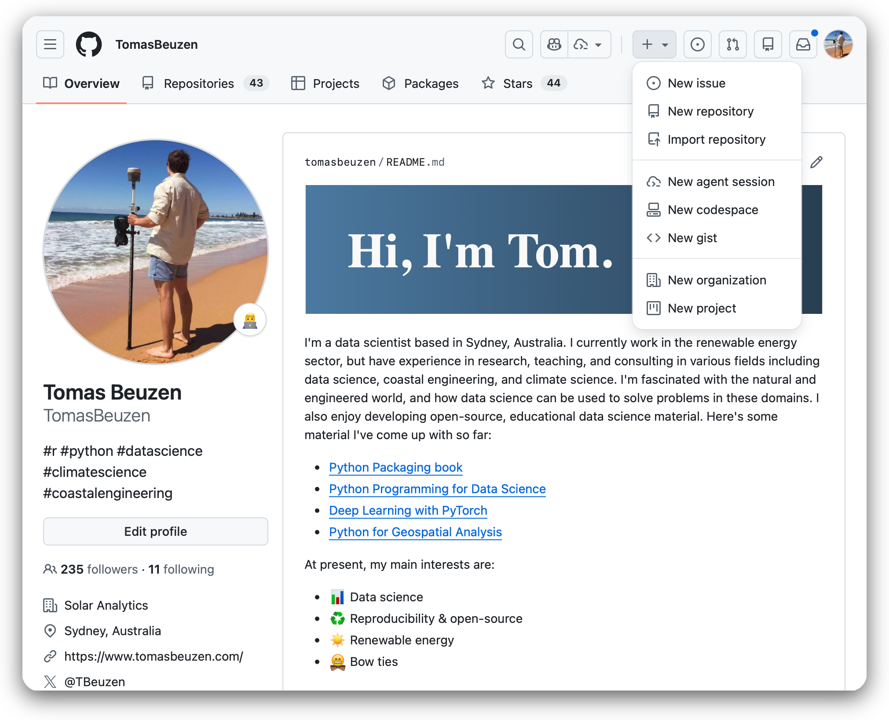{#fig-03-set-up-github-1 width="100%" fig-alt="Creating a new repository in GitHub."}

Next, select the following options when setting up your GitHub repository, as shown in @fig-03-set-up-github-2: 

1. Give the GitHub repository the same name as your Python package and give it a short description.
2. You can choose to make your repository public or private — we'll be making ours public so we can share it with others.
3. Do not initialize the repository with any files (we've already created all our files locally using the `uv` template).

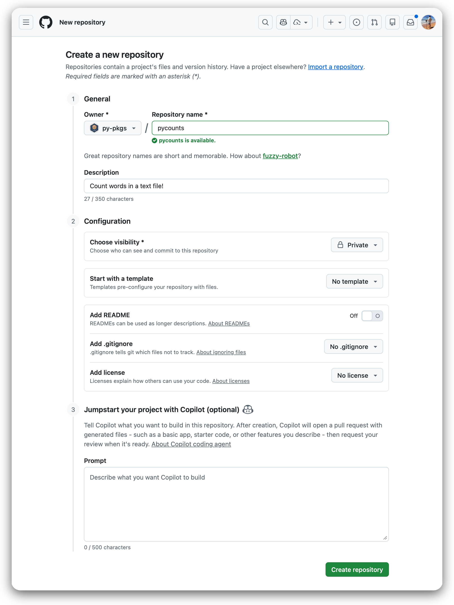{#fig-03-set-up-github-2 width="100%" fig-alt="Setting up a new repository in GitHub."}

Now, use the commands shown on GitHub, and outlined in @fig-03-set-up-github-3, to link your local and remote repositories and push your local content to GitHub:

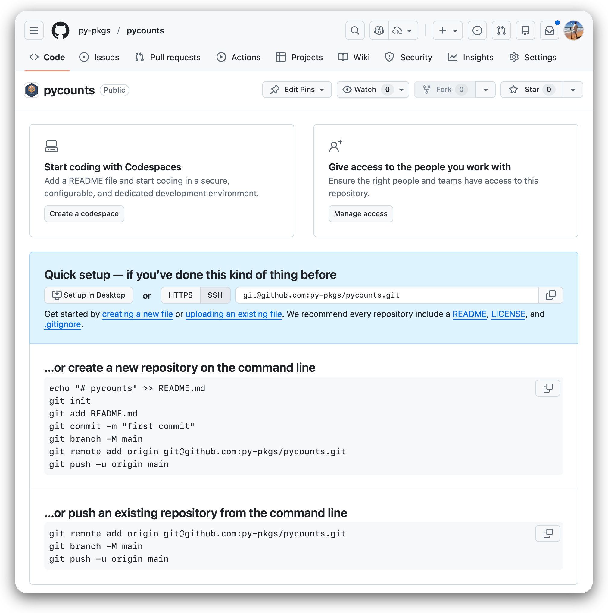{#fig-03-set-up-github-3 width="100%" fig-alt="Instructions on how to link local and remote version control repositories."}

\newpage

::: {.callout-warning}
## Attention

The commands below should be specific to your GitHub username and the name of your Python package. They use SSH authentication to connect to GitHub which you will need to set up by following the steps in the official GitHub [documentation](https://docs.github.com/en/authentication/connecting-to-github-with-ssh).
:::

```bash
$ git remote add origin git@github.com:TomasBeuzen/pycounts.git
$ git branch -M main
$ git push -u origin main
```

```md
...
To github.com:TomasBeuzen/pycounts.git
 * [new branch]      main -> main
branch 'main' set up to track 'origin/main'.
```

## Packaging your code {#sec-03-packaging-your-code}

We now have our `pycounts` package structure\index{package structure} set up, and are ready to populate our package with the `load_text()`, `clean_text()` and `count_words()` functions we developed at the beginning of the chapter in **@sec-03-turning-our-code-into-functions**. Where should we put these functions? Let's review the structure of our package:

\newpage

```md
pycounts
├── .gitignore
├── .python-version
├── pyproject.toml
├── README.md
└── src
    └── pycounts
        ├── __init__.py
        └── py.typed 
```

The Python code for our package should live in modules\index{module} in the *`src/pycounts/`* directory. Create that file now so that your directory structure looks like the below (note that this module can be named anything, but it is common for a module to share the name of the package):

``` {.md emphasize-lines="10"}
pycounts
├── .gitignore
├── .python-version
├── pyproject.toml
├── README.md
└── src
    └── pycounts
        ├── __init__.py
        ├── py.typed
        └── pycounts.py  <--- create this file
```

We'll copy the functions we created in **@sec-03-turning-our-code-into-functions** to the module *`src/pycounts/pycounts.py`* now. Our functions depends on `collections.Counter` and `string.punctuation`, so we also need to import those at the top of the file. Here's what *`src/pycounts/pycounts.py`* should now look like:

\newpage

```python
from collections import Counter
from string import punctuation

def load_text(input_file: str) -> str:
    """Load text from a text file and return as a string."""
    with open(input_file, "r") as file:
        text = file.read()
    return text
    
def clean_text(text: str) -> str:
    """Lowercase and remove punctuation from a string."""
    text = text.lower()
    for p in punctuation:
        text = text.replace(p, "")
    return text
    
def count_words(input_file: str) -> Counter:
    """Count unique words in a string."""
    text = load_text(input_file)
    text = clean_text(text)
    words = text.split()
    return Counter(words)
```

## Test drive your package code

### Create a virtual environment {#sec-03-create-a-virtual-environment}

Before we install and test our package, we will set up a virtual environment\index{virtual environment}. As discussed previously in **@sec-02-install-packaging-software**, a virtual environment provides a safe and isolated space to develop and install packages. While there are several options available when it comes to creating and managing virtual environments (e.g., `conda`\index{conda} or `venv`), we'll be using `uv`.

In a `uv`-managed project, running `uv sync` is all you need: it resolves your dependencies, creates a virtual environment in a *`.venv/`* directory, and installs your package — all in one step. We'll run `uv sync` in the next section once our *`pyproject.toml`* is ready, so you can see how it works.

You can view the packages currently installed in your virtual environment using the command `uv tree` or `uv pip list`, and you can exit your virtual environment using `deactivate`.

### Installing your package {#sec-03-installing-your-package}

We have our package structure set up and we've populated it with our Python code. How do we install and use our package? There are several tools available to develop installable Python packages\index{installable Python package}. Common options include `uv`, `poetry`\index{poetry}, `flit`\index{flit}, and `setuptools`\index{setuptools}, which we compare in **@sec-04-packaging-tools**. However, again, we will be using `uv` because it is a modern and extremely fast packaging tool that provides simple and efficient commands to develop, install, and distribute Python packages.

In a `uv`-managed package, the *`pyproject.toml`*\index{pyproject.toml} file stores all the metadata and install instructions for the package. The *`pyproject.toml`* that the command `uv init ...` created for our `pycounts` package earlier looks like this:

```toml
[project]
name = "pycounts"
version = "0.1.0"
description = "Add your description here"
readme = "README.md"
authors = [
    { name = "Tomas Beuzen", email = "py-pkgs@gmail.com" }
]
requires-python = ">=3.12"
dependencies = []

[build-system]
requires = ["uv_build>=0.9.18,<0.10.0"]
build-backend = "uv_build"
```

::: {.callout-note}
**Build backends and `pyproject.toml`**\index{build backend}\index{pyproject.toml}

The `pyproject.toml` file is the modern standard for Python package configuration, introduced by [PEP 518](https://peps.python.org/pep-0518/) and extended by [PEP 621](https://peps.python.org/pep-0621/). It separates *what* your package is (its name, version, and dependencies, declared under `[project]`) from *how* it is built (the `[build-system]` table). The `[build-system]` table names a **build backend** — a library responsible for turning your source code into an installable distribution. `uv init --lib` configures `uv`'s own build backend (`uv_build`) by default, though other backends such as `hatchling`, `setuptools`, and `flit-core` serve the same role and follow the same interface, defined by [PEP 517](https://peps.python.org/pep-0517/). This design means the tool you use to manage your project (`uv`, or anything else) and the tool that actually builds the package are decoupled — a deliberate choice to prevent the ecosystem from being locked to any single workflow.
:::

@tbl-03-toml provides a brief description of each of the headings in that file (called "tables" in TOML file jargon).

|TOML table|Description|
|:---  | :---  |
|`[project]`|Defines package metadata, like the `name`, `version`, `description`, and `authors` of the package, as well as the `dependencies` — that is, software that the package depends on. We'll add some of these later in this chapter.|
|`[build-system]`|Identifies the build tools required to build your package. We'll talk more about this in **@sec-03-building-and-distributing-your-package**.|

: A description of the tables in the pyproject.toml. {#tbl-03-toml}

With our *`pyproject.toml`* file set up, we can use `uv` to install our package using the command `uv sync` at the command line from the root package directory:

```bash
$ uv sync
```

```md
❯ uv sync
Resolved 1 package in 19ms
Prepared 1 package in 15ms
Installed 1 package in 4ms
 + pycounts==0.1.0
```

::: {.callout-tip}
**Lockfiles and `uv.lock`**\index{lockfile}\index{uv.lock}

When you run `uv sync`, `uv` creates a *`uv.lock`* file alongside your `pyproject.toml`. A lockfile records the *exact* version of every package in your environment — not just your direct dependencies, but every transitive dependency too. This is the key difference between a lockfile and the version constraints in `pyproject.toml`: your `pyproject.toml` might say "`numpy>=2.2`", while `uv.lock` pins it to, say, `numpy==2.4.1`. Anyone who subsequently runs `uv sync` — a collaborator, your CI pipeline, or yourself six months later — will get an identical environment, eliminating the classic "works on my machine" problem. Committing `uv.lock` to version control is therefore good practice.

[PEP 751](https://peps.python.org/pep-0751/)\index{PEP 751} has established a standardised, tool-agnostic lockfile format called *`pylock.toml`*\index{pylock.toml}. `uv` supports both exporting to and installing from *`pylock.toml`*, but continues to use *`uv.lock`* as its native format because it carries additional metadata that enables `uv`'s internal optimisations (such as faster resolution and content-addressed caching). In practice, *`uv.lock`* is what you will work with day-to-day; *`pylock.toml`* becomes relevant when you need to share a locked environment with tools outside the `uv` ecosystem.
:::

With our package installed, we can now `import` and use it in a Python session. Before we do that, we need a text file to test our package on. Feel free to use any text file, but we'll create the same "Zen of Python" text file we used earlier in the chapter by running the following at the command line:

```bash
$ uv run python3.12 -c "import this" > zen.txt
```

Now we can open a Python interpreter and `import`\index{import} and use the `count_words()` function from our `pycounts` module with the following code:

```bash
$ uv run python3.12
```

```python
>>> from pycounts.pycounts import count_words
>>> count_words("zen.txt")
```

```md
Counter({'is': 10, 'better': 8, 'than': 8, 'the': 6, 
'to': 5, 'of': 3, 'although': 3, 'never': 3, ... })
```

Looks like everything is working! We have now created and installed a simple Python package!

`uv` actually installs your locally-developed packages in "editable mode", which means that it installs a link to your package's code on your computer (rather than installing it as a independent piece of software). Editable installs\index{editable install} are commonly used by developers because it means that any edits made to the package's source code are immediately available the next time it is imported, without having to `uv sync` again. We'll talk more about installing packages in **@sec-03-building-and-distributing-your-package**.

In the next section, we'll show how to add code to our package that depends on another package. But for those using version control, it's a good idea to commit the changes we've made to *`src/pycounts/pycounts.py`* to local and remote version control\index{version control}:

```bash
$ git add src/pycounts/pycounts.py
$ git commit -m "feat: add word counting functions"
$ git push
```

\newpage

::: {.callout-tip}
In this book, we use the [Angular style](https://github.com/angular/angular.js/blob/master/DEVELOPERS.md#-git-commit-guidelines) for Git commit messages. We'll talk about this style more in **@sec-07-automatic-version-bumping**, but our commit messages have the form "type: subject", where "type" indicates the kind of change being made and "subject" contains a description of the change. We'll be using the following "types" for our commits:

- "build": indicates a change to the build system or external dependencies.
- "docs": indicates a change to documentation.
- "feat": indicates a new feature being added to the code base.
- "fix": indicates a bug fix.
- "test": indicates changes to testing framework.
:::

## Adding dependencies to your package {#sec-03-adding-dependencies-to-your-package}

Let's now add a new function to our package that can plot a bar chart of the top `n` words in a `Counter` object of word counts. Imagine we've come up with the following `plot_words()` function that does this. The function uses the convenient `.most_common()` method of the `Counter` object to return a list of tuples of the top `n` words counts in the format `(word, count)`. It then uses the Python function `zip(*...)` to unpack that list of tuples into two individual lists, `word` and `count`. Finally, the `matplotlib` [@hunter2007] package is used to plot the result (`plt.bar(...)`), which looks like @fig-03-matplotlib-figure.

::: {.callout-note}
If this code is not familiar to you, don't worry! The code itself is not overly important to our discussion of packaging. You just need to know that we are adding some new code to our package that depends on the `matplotlib` package.
:::

\newpage

```python
from collections import Counter

import matplotlib.pyplot as plt

def plot_words(word_counts: Counter, n: int = 10) -> plt.Figure:
    """Plot a bar chart of word counts."""
    top_n_words = word_counts.most_common(n)
    word, count = zip(*top_n_words)
    fig = plt.bar(range(n), count)
    plt.xticks(range(n), labels=word, rotation=45)
    plt.xlabel("Word")
    plt.ylabel("Count")
    return fig
```

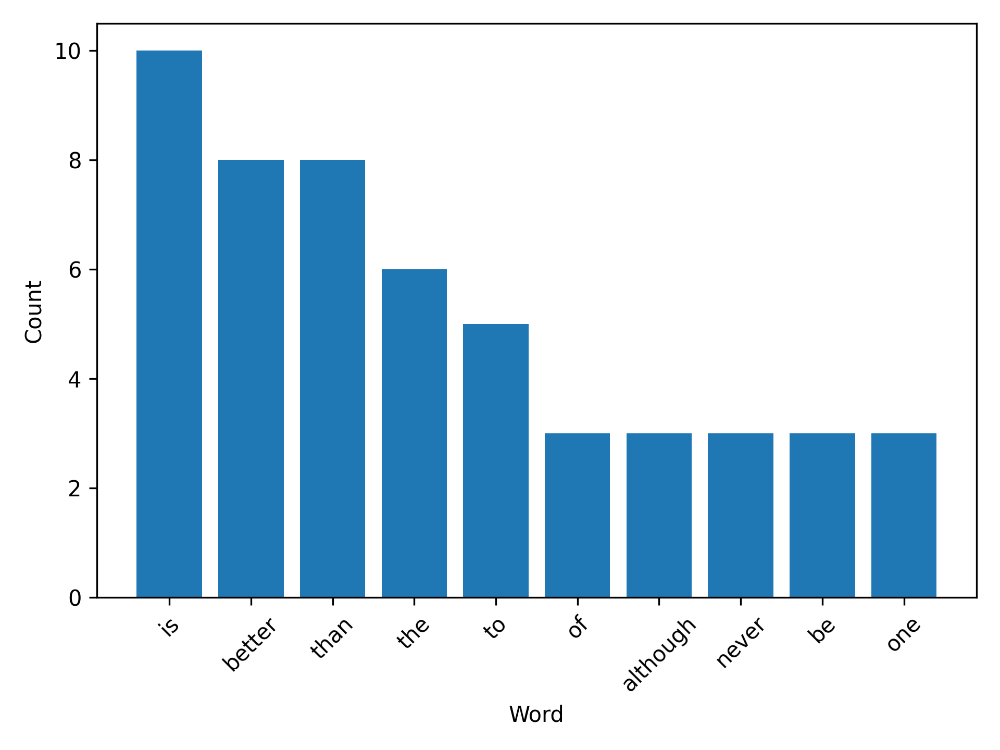{#fig-03-matplotlib-figure width="80%" fig-alt="Example figure created from the plotting function."}

Where should we put this function in our package? You could certainly add all your package code into a single module (e.g., *`src/pycounts/pycounts.py`*), but as you add functionality to your package that module will quickly become overcrowded and hard to manage. Instead, as you write more code, it's a good idea to organize it into multiple, logical modules. With that in mind, we'll create a new module called *`src/pycounts/plotting.py`* to house our plotting function `plot_words()`. Create that new module now in an editor of your choice.

Your package structure\index{package structure} should now look like this:

``` {.md emphasize-lines="10"}
pycounts
├── .gitignore
├── .python-version
├── .venv
├── README.md
├── pyproject.toml
├── src
│   └── pycounts
│       ├── __init__.py
│       ├── plotting.py  <--- create this file
│       ├── py.typed
│       └── pycounts.py
└── uv.lock
```

Open *`src/pycounts/plotting.py`* and add the `plot_words()` code from above (don't forget to add the `import matplotlib.pyplot as plt` at the top of the module).

After doing this, if we tried to `import` our new function in a Python interpreter we'd get an error:

```bash
$ uv run python3.12
```

```python
>>> from pycounts.plotting import plot_words
```

```md
ModuleNotFoundError: No module named 'matplotlib'
```

This is because `matplotlib` is not part of the standard Python library; we need to install it and add it as a dependency\index{dependency} of our `pycounts` package. We can do this with `uv` using the command `uv add matplotlib`. This command will install the specified dependency into the current virtual environment\index{virtual environment} and will update the `dependencies` list of the *`pyproject.toml`*\index{pyproject.toml} file:

```bash
$ uv add matplotlib
``` 

```md
Installed 12 packages in 17ms
 + contourpy==1.3.3
 + cycler==0.12.1
 + fonttools==4.61.1
 + kiwisolver==1.4.9
 + matplotlib==3.10.8
 + numpy==2.4.1
 + packaging==25.0
 + pillow==12.1.0
 ~ pycounts==0.1.0
 + pyparsing==3.3.1
 + python-dateutil==2.9.0.post0
 + six==1.17.0
```

If you open *`pyproject.toml`* file, you should now see `matplotlib` listed as a dependency under the `[project]` section:

```toml
[project]
name = "pycounts"
...
dependencies = [
    "matplotlib>=3.10.8",
]
```

We can now use our package in a Python interpreter as follows (be sure that the *`zen.txt`* file we created earlier is in the current directory if you're running the code below):

```bash
$ uv run python3.12
```

```python
>>> from pycounts.pycounts import count_words
>>> from pycounts.plotting import plot_words
>>> counts = count_words("zen.txt")
>>> fig = plot_words(counts, 10)
```

If running the above Python code in an interactive IPython shell or Jupyter Notebook, the plot will be displayed automatically. If you're running from the Python interpreter, you'll need to run the `matplotlib` command `plt.show()` to display the plot, as shown below:

```python
>>> import matplotlib.pyplot as plt
>>> plt.show()
```

We've made some important changes to our package in this section by adding a new module and a dependency. Those using version control\index{version control} should commit these changes:

```bash
$ git add src/pycounts/plotting.py
$ git commit -m "feat: add plotting module"
$ git add pyproject.toml uv.lock
$ git commit -m "build: add matplotlib as a dependency"
$ git push
```

### Dependency version constraints {#sec-03-dependency-version-constraints}

This section provides a short but important note on "versioning". Versioning is the practice of assigning a unique identifier to unique releases of a package. For example, [semantic versioning](https://semver.org)\index{semantic versioning} is a common versioning system that consists of three integers `A.B.C`. `A` is the "major" version, `B` is the "minor" version, and `C` is the "patch" version identifier. Package versions usually starts at 0.1.0 and positively increment the major, minor, and patch numbers from there, depending on the kind of changes made to the package over time.

We'll talk more about versioning in **Chapter 7: [Releasing and versioning](#sec-07-releasing-and-versioning)**, but what's important to know now is that we typically constrain the required version number(s) of our package's dependencies, to ensure we're using versions that are up-to-date and contain the functionality we need. You may have noticed `uv` prepended a greater-or-equal (>=) operator to the dependency versions in our *`pyproject.toml`* file, in the `dependencies` list:

```toml
dependencies = [
    "matplotlib>=3.10.8",
]
```

This operator is short-hand for "requires this or any higher version". For example, our package depends on any `matplotlib` version >=3.10.8. Thus, examples of valid versions include 3.10.9 and 4.1.0. There are other syntaxes too that can be used to specify version constraints in different ways, e.g., by adding upper bounds on the version, or constraining a package to the current major version, etc. So why do we care about this? The way that developers choose to constrain the dependency versions for their package can impact a user's ability to install it. 

You can read more about the implications and issues of version constraints in Henry Schreiner's excellent [blog post](https://iscinumpy.dev/post/bound-version-constraints/). But in general, the Python packaging community recommends specifying only a lower bound on your versions and no upper bound; unless you know for certain that a specific higher version is incompatible with your package. Fortunately, this is `uv`'s default behaviour (using the `>=` sign) so there's nothing we need to change here. However be aware that other packaging tools may behave differently; for example, `poetry` defaults to the caret operator (^) which constrains the upper bound of a dependency to the current major version (i.e., the left most digit cannot change).

## Testing your package {#sec-03-testing-your-package}

### Writing tests {#sec-03-writing-tests}

At this point we have developed a package that can count words in a text file and plot the results. But how can we be certain that our package works correctly and produces reliable results?

One thing we can do is write tests\index{tests} for our package that check the package is working as expected. This is particularly important if you intend to share your package with others (you don't want to share code that doesn't work!). But even if you don't intend to share your package, writing tests can still be helpful to catch errors in your code and to write new code without breaking any tried-and-tested existing functionality. If you don't want to write to tests for your package feel free to skip to **@sec-03-package-documentation**.

Many of us already conduct informal tests of our code by running it a few times in a Python session to see if it's working as we expect, and if not, changing the code and repeating the process. This is called "manual testing" or "exploratory testing". However, when writing software, it's preferable to define your tests in a more formal and reproducible way.

Tests in Python are often written with the `assert`\index{tests!assert} statement. `assert` checks the truth of an expression; if the expression is true, Python does nothing and continues running, but if it's false, the code terminates and shows a user-defined error message. For example, consider running the follow code in a Python interpreter:

```python
>>> ages = [32, 19, 9, 75]
>>> for age in ages:
>>>     assert age >= 18, "Person is younger than 18!"
>>>     print("Age verified!")
```

```md
Age verified!
Age verified!
Traceback (most recent call last):
  File "<stdin>", line 2, in <module>
AssertionError: Person is younger than 18!
```

Note how the first two "ages" (32 and 19) are verified, with an "Age verified!" message printed to screen. But the third age of 9 fails the `assert`, so an error message is raised and the program terminates before checking the last age of 75.

Using the `assert` statement, let's write a test for the `count_words()` function of our `pycounts` package. There are different kinds of tests used to test software (unit tests, integration tests, regression tests, etc.); we discuss these in **Chapter 5: [Testing](#sec-05-testing)**. For now, we'll write a unit test\index{tests!unit test}. Unit tests evaluate a single "unit" of software, such as a Python function, to check that it produces an expected result. A unit test consists of:

1. Some data to test the code with (called a "*fixture\index{tests!fixture}*"). The fixture is typically a small or simple version of the data the function will typically process.
2. The *actual* result that the code produces given the fixture.
3. The *expected* result of the test, which is compared to the *actual* result using an `assert` statement.

The unit test we are going to write will `assert` that the `count_words()` function produces an expected result given a certain fixture. We'll use the following quote from Albert Einstein as our fixture:

>*"Insanity is doing the same thing over and over and expecting different results."*

The *actual* result is the result `count_words()` outputs when we input this fixture. We can get the *expected* result by manually counting the words in the quote (ignoring capitalization and punctuation):

```python
einstein_counts = {'insanity': 1, 'is': 1, 'doing': 1, 
                   'the': 1, 'same': 1, 'thing': 1, 
                   'over': 2, 'and': 2, 'expecting': 1,
                   'different': 1, 'results': 1}
```

To write our unit test in Python code, let's create a text file containing the Einstein quote to use as our fixture. First, we'll create a *`tests/`* directory at the root of our package:

``` {.md emphasize-lines="13"}
pycounts
├── .gitignore
├── .python-version
├── .venv
├── README.md
├── pyproject.toml
├── src
│   └── pycounts
│       ├── __init__.py
│       ├── plotting.py
│       ├── py.typed
│       └── pycounts.py
├── tests  <----------- create this directory
│   └── ...
└── uv.lock
```

Now create a file called *`einstein.txt`* in the *`tests/`* directory — you can make the file manually, or you can create it from a Python session started in the root package directory using the following code:

```bash
$ uv run python3.12
```

```python
>>> quote = "Insanity is doing the same thing over and over and \
             expecting different results."
>>> with open("tests/einstein.txt", "w") as file:
        file.write(quote)
```

Now, a unit test for our `count_words()` function would look as below:

```python
>>> from pycounts.pycounts import count_words
>>> from collections import Counter
>>> expected = Counter({'insanity': 1, 'is': 1, 'doing': 1, 
                        'the': 1, 'same': 1, 'thing': 1, 
                        'over': 2, 'and': 2, 'expecting': 1,
                        'different': 1, 'results': 1})
>>> actual = count_words("tests/einstein.txt")
>>> assert actual == expected, "Einstein quote counted incorrectly!"
```

If the above code runs without error, our `count_words()` function is working, at least to our test specifications. In the next section, we'll discuss how we can make this testing process more efficient.

### Running tests {#sec-03-running-tests}

It would be tedious and inefficient to manually write and execute unit tests\index{tests} for your package's code like we did above. Instead, it's common to use a "testing framework" to automatically run our tests for us. `pytest`\index{tests!pytest} is the most common test framework\index{tests!test framework} used for Python packages. To use `pytest`:

1. Tests are defined as functions prefixed with `test_` and contain one or more statements that `assert` code produces an expected result.
2. Tests are put in files of the form *`test_*.py`* or *`*_test.py`*, and are usually placed in a directory called *`tests/`* in a package's root.
3. Tests can be executed using the command `pytest` at the command line and pointing it to the directory your tests live in (i.e., `pytest tests/`). `pytest` will find all files of the form *`test_*.py`* or *`*_test.py`* in that directory and its sub-directories, and execute any functions with names prefixed with `test_`.

We will now create a module called *`test_pycounts.py`* for us to put our tests in:

\newpage

``` {.md emphasize-lines="15"}
pycounts
├── .gitignore
├── .python-version
├── .venv
├── README.md
├── pyproject.toml
├── src
│   └── pycounts
│       ├── __init__.py
│       ├── plotting.py
│       ├── py.typed
│       └── pycounts.py
├── tests
│   ├── einstein.txt
│   └── test_pycounts.py  <--- create this file
└── uv.lock
```

As mentioned above, `pytest` tests are written as functions prefixed with `test_` and which contain one or more `assert` statements that check some code functionality. Based on this format, let's add the unit test we created in **@sec-03-writing-tests** as a test function to *`tests/test_pycounts.py`* using the below Python code:

```python
from pycounts.pycounts import count_words
from collections import Counter

def test_count_words():
    """Test word counting from a file."""
    expected = Counter({'insanity': 1, 'is': 1, 'doing': 1, 
                        'the': 1, 'same': 1, 'thing': 1, 
                        'over': 2, 'and': 2, 'expecting': 1,
                        'different': 1, 'results': 1})
    actual = count_words("tests/einstein.txt")
    assert actual == expected, "Einstein quote counted incorrectly!"
```

\newpage

Before we can use `pytest` to run our test for us we need to add it as a development dependency\index{dependency!development dependency} of our package using the command `uv add --dev pytest`. A development dependency is a package that is not required by a user to use your package but is required for development purposes (like testing):

```bash
$ uv add --dev pytest
```

If you look in the *`pyproject.toml`* file you will now see that `pytest` gets added under the `[dependency-groups]` section:

```toml
[dependency-groups]
dev = [
    "pytest>=9.0.2",
]
```

To use `pytest` to run our test we can use the following command from our root package directory:

```bash
$ uv run pytest tests/
```

```md
========================= test session starts =========================
...
collected 1 item                                                                                            

tests/test_pycounts.py .                                         [100%]

========================== 1 passed in 0.01s ==========================
```

From the `pytest` output we can see that our test passed! At this point, we could add more tests for our package by writing more `test_*` functions. But we'll do this in **Chapter 5: [Testing](#sec-05-testing)**. Typically you want to write enough tests to check all the core code of your package. We'll show how you can calculate how much of your package's code your tests actually check in the next section.

### Code coverage {#sec-03-code-coverage}

A good test suite will contain tests that check as much of your package's code as possible. How much of your code your tests actually use is called "code coverage\index{code coverage}". The simplest and most intuitive measure of code coverage is line coverage\index{code coverage!line coverage}. It is the proportion of lines of your package's code that are executed by your tests\index{tests}:

$$
  \text{coverage} = \frac{\text{lines executed}}{\text{total lines}} * 100\%
$$

There is a useful extension to `pytest`\index{tests!pytest} called `pytest-cov`\index{tests!pytest-cov}, which we can use to calculate coverage. First, we'll use `uv` to add `pytest-cov` as a development dependency\index{dependency!development dependency} of our `pycounts` package:

```bash
$ uv add --dev pytest-cov
```

We can calculate the line coverage of our tests by running the following command, which tells `pytest-cov` to calculate the coverage our tests have of our `pycounts` package:

```bash
$ uv run pytest tests/ --cov=pycounts
```

\newpage

```md
========================= test session starts =========================
...

Name                           Stmts   Miss  Cover
--------------------------------------------------
src/pycounts/__init__.py         2      1    50%
src/pycounts/plotting.py        10     10     0%
src/pycounts/pycounts.py        16      0   100%
--------------------------------------------------
TOTAL                           28     11    61%

========================== 1 passed in 0.02s ==========================
```

In the output above, `Stmts` is how many lines are in a module, `Miss` is how many lines were not executed during your tests, and `Cover` is the percentage of lines covered by your tests. From the above output, we can see that our tests currently don't cover any of the lines in the `pycounts.plotting` module. We'll write more tests for our package, and discuss more advanced methods of testing and calculating code coverage in **Chapter 5: [Testing](#sec-05-testing)**.

For those using version control, commit the changes we've made to our packages tests to local and remote version control\index{version control}:

```bash
$ git add pyproject.toml uv.lock
$ git commit -m "build: add pytest and pytest-cov as dev dependencies"
$ git add tests/einstein.txt tests/test_pycounts.py
$ git commit -m "test: add unit test for count_words"
$ git push
```

### Code style and formatting {#sec-03-code-style-and-formatting}

Beyond correctness (which tests check), good packages also enforce consistent code **style**\index{code style}. There are two complementary aspects to this:

- **Linting**\index{linting} analyses your code for potential errors, bad practices, and style violations — things like unused imports, undefined variables, or lines that are too long. Think of a linter as an automated code reviewer that flags problems without changing any files.
- **Formatting**\index{formatting} automatically rewrites your code to follow a consistent style — consistent indentation, quote styles, line lengths, and so on. Unlike a linter, a formatter changes files in place.

Historically, Python developers used separate tools for each task: `flake8`\index{flake8} for linting and `black`\index{black} for formatting (plus `isort` for import ordering). [`Ruff`](https://docs.astral.sh/ruff/)\index{Ruff} is a modern replacement that handles both linting and formatting in a single, extremely fast tool. It has become the community standard and is the tool we recommend throughout this book.

Add `ruff` as a development dependency and run it on your package's source code:

```bash
$ uv add --dev ruff
$ uv run ruff check src/
$ uv run ruff format src/
```

```md
All checks passed!
3 files left unchanged
```

`ruff check` will report any linting issues; `ruff format` will reformat your code in place. We'll cover `ruff` configuration and integration with your development workflow in more detail in a later chapter.

## Package documentation {#sec-03-package-documentation}

Documentation\index{documentation} describing what your package does and how to use it is invaluable for the users of your package (including yourself). The amount of documentation needed to support a package varies depending on its complexity and the intended audience. A typical package contains documentation in various parts of its directory structure\index{package structure}, as shown in @tbl-03-documentation. There's a lot here but don't worry, we'll show how to efficiently write all these pieces of documentation in the following sections.

|Documentation|Typical location|Description|
|:---    | :--- | :---      |
|README\index{documentation!README}|Root |Provides high-level information about the package, e.g., what it does, how to install it, and how to use it.|
|License\index{documentation!license}|Root |Explains who owns the copyright to your package source and how it can be used and shared.|
|Contributing guidelines\index{documentation!contributing guidelines}|Root |Explains how to contribute to the project.|
|Code of conduct\index{documentation!code of conduct}|Root |Defines standards for how to appropriately engage with and contribute to the project.|
|Changelog\index{documentation!changelog}|Root |A chronologically ordered list of notable changes to the package over time, usually organized by version.|
|Docstrings\index{docstring}| *.py* files |Text appearing as the first statement in a function, method, class, or module in Python that describes what the code does and how to use it. Accessible to users via the `help()` command.|
|Examples|*`docs/`* |Step-by-step, tutorial-like examples showing how the package works in more detail.|
|Application programming interface\index{application programming interface} (API) reference|*`docs/`* | An organized list of the user-facing functionality of your package (i.e., functions, classes, etc.) along with a short description of what they do and how to use them. Typically created automatically from your package's docstrings using the `sphinx` tool as we'll discuss in **@sec-03-building-documentation**.|

: Typical Python package documentation. {#tbl-03-documentation}

The typical workflow for documenting a Python package consists of three steps:

1. **Write documentation**: write documentation in a plain-text format.
2. **Build documentation\index{documentation!build documentation}**: compile and render documentation into HTML using a documentation generator like `quarto`, `mkdocs` or `sphinx`.
3. **Host documentation\index{documentation!host documentation} online**: share the built documentation online so it can be easily accessed by anyone with an internet connection, using a free service like [Read the Docs](https://readthedocs.org)\index{Read the Docs} or [GitHub Pages](https://pages.github.com)\index{GitHub Pages}.

In this section, we will walk through each of these steps in detail as we develop some documentation for our `pycounts` package.

### Writing documentation {#sec-03-writing-documentation}

Python package documentation\index{documentation} is typically written in a plain-text markup format such as [Markdown](https://en.wikipedia.org/wiki/Markdown)\index{Markdown} (*.md*) or [reStructuredText](https://www.sphinx-doc.org/en/master/usage/restructuredtext/index.html)\index{reStructuredText} (*.rst*). With a plain-text markup language, documents are written in plain-text and a special syntax is used to specify how the text should be formatted when it is rendered by a suitable tool. We'll show an example of this below, but we'll be using the Markdown language in this book because it is widely used, and we feel it has a less verbose and more intuitive syntax than reStructuredText (check out the [Markdown Guide](https://www.markdownguide.org) to learn more about Markdown syntax).

Let's start with a *`README.md`*, a blank one of which was created for our `pycounts` package already when we initialized our package with `uv init ...`.

``` {.md emphasize-lines="5"}
pycounts
├── .gitignore
├── .python-version
├── .venv
├── README.md   <------
├── pyproject.toml
├── src
│   └── ...
├── tests
│   └── ...
└── uv.lock
```

Fill the *`README.md`* with the following Markdown text:

::: {.callout-tip}
In the Markdown text below, the following syntax is used:

- Headers are denoted with number signs (\#). The number of number signs corresponds to the heading level.
- Code blocks are bounded by three back-ticks. A programming language can succeed the opening bounds to specify how the code syntax should be highlighted.
- Links are defined using brackets \[\] to enclose the link text, followed by the URL in parentheses ().
:::

````xml
# pycounts

Calculate word counts in a text file!

## Installation

```bash
$ pip install pycounts
```

## Usage

`pycounts` can be used to count words in a text file and plot results
as follows:

```python
from pycounts.pycounts import count_words
from pycounts.plotting import plot_words
import matplotlib.pyplot as plt

file_path = "test.txt"  # path to your file
counts = count_words(file_path)
fig = plot_words(counts, n=10)
plt.show()
```
````

When we render this Markdown text later on with `mkdocs`, it will look like @fig-03-documentation-1a. We'll talk about `mkdocs` in **@sec-03-building-documentation**, but many other tools are also able to natively render Markdown documents (e.g., Jupyter, VS Code, GitHub, etc.), which is why it's so widely used.

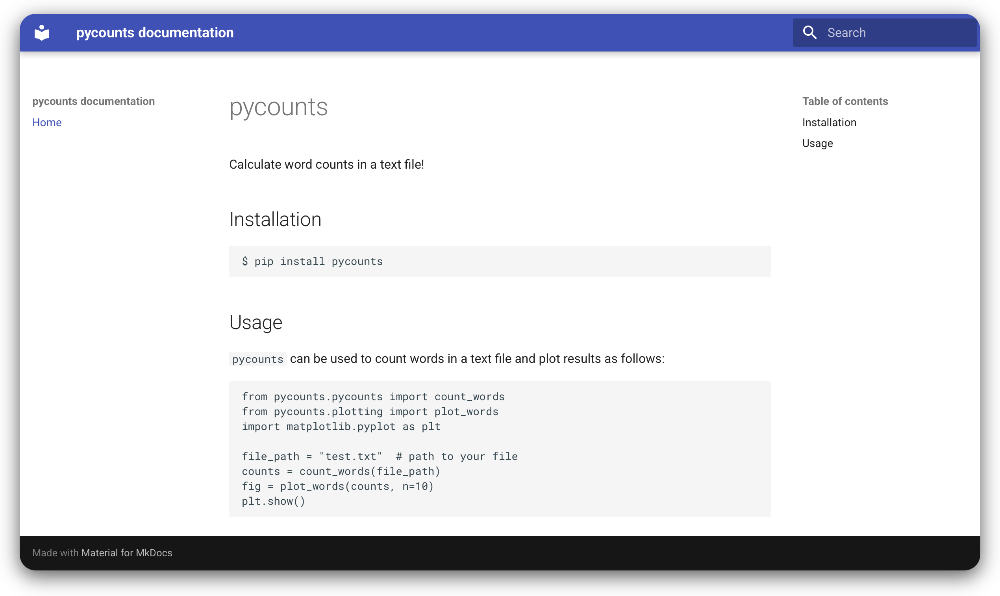{#fig-03-documentation-1a width="100%" fig-alt="Rendered version of README.md."}

This is a basic *`README.md`* for our project, take a look at the *`README.md`* of your favourite open-source package to find further inspiration for what you could include here. If you're planning on sharing your package with the world and making it open source, it is typical to include some other important pieces of documentation at the package root, as mentioned in @tbl-03-documentation, such as a *`LICENSE`*, which tells users how they can use your package code. GitHub's [Choose a License](https://choosealicense.com) tool is helpful here - it can provide you with the appropriate license for your use case, such as the very permissive MIT license:

```xml
MIT License

Copyright (c) [year] [fullname]

Permission is hereby granted, free of charge, to any person obtaining a copy
of this software and associated documentation files (the "Software"), to deal
in the Software without restriction, including without limitation the rights
to use, copy, modify, merge, publish, distribute, sublicense, and/or sell
copies of the Software, and to permit persons to whom the Software is
furnished to do so, subject to the following conditions:

The above copyright notice and this permission notice shall be included in all
copies or substantial portions of the Software.

THE SOFTWARE IS PROVIDED "AS IS", WITHOUT WARRANTY OF ANY KIND, EXPRESS OR
IMPLIED, INCLUDING BUT NOT LIMITED TO THE WARRANTIES OF MERCHANTABILITY,
FITNESS FOR A PARTICULAR PURPOSE AND NONINFRINGEMENT. IN NO EVENT SHALL THE
AUTHORS OR COPYRIGHT HOLDERS BE LIABLE FOR ANY CLAIM, DAMAGES OR OTHER
LIABILITY, WHETHER IN AN ACTION OF CONTRACT, TORT OR OTHERWISE, ARISING FROM,
OUT OF OR IN CONNECTION WITH THE SOFTWARE OR THE USE OR OTHER DEALINGS IN THE
SOFTWARE.
```

Ultimately, if you're planning on sharing your package with publicly, it is essential to have documentation that tells users how your package may be used and how to contribute to it. The [pyOpenSci documentation guide](https://www.pyopensci.org/python-package-guide/documentation/index.html) is an excellent resource for examples and more information about these kinds of documentation.

In the next section, we'll explain how to document your package's Python code using docstrings.

For those using version control\index{version control}, commit this work using the following commands:

\newpage

```bash
$ git add README.md
$ git commit -m "docs: updated readme"
$ git push
```

### Building documentation {#sec-03-building-documentation}

We've now written a *`README.md`*, and will soon show how to build up some more important documentation for our package like an API reference and usage examples. But first, let's walk through how to compile your documentation into a user-friendly format that is easy to share and search through.

This is where the documentation generator `mkdocs`\index{mkdocs} comes in. `mkdocs` is a static site generator that is used to convert Markdown files into the HTML, CSS, and JavaScript components required to diplay it as a website. `mkdocs` also has a rich ecosystem of extensions that can be used to help automatically generate content — we'll be using some of these extensions in the following sections to automatically create an API reference sheet from our docstrings, and to execute and render our Jupyter Notebook example into our documentation.

We'll be using `mkdocs-material` (a very user-friendly, powerful, and customisable framework built on top of `mkdocs`) to build our documentation. Install it now with the following command:

```bash
$ uv add --dev mkdocs-material
```

The source and configuration files to build documentation using `mkdocs` typically live in the *`docs/`* directory in a package's root. We can create that structure now by running the following command from the root of our `pycounts` package:

```bash
$ uv run mkdocs new .
```

We now have a simple documentation structure set up:

``` {.md emphasize-lines="5-7"}
pycounts
├── .gitignore
├── .python-version
├── .venv
├── docs         <-------
│   └─ index.md  <-------
├── mkdocs.yml   <-------
├── README.md
├── pyproject.toml
├── src
│   └── ...
├── tests
│   └── ...
└── uv.lock
```

The `mkdocs.yml` file is a configuration file for your documentation. You can read more about how to configure and customise your `mkdocs` site in the official [documentation](https://squidfunk.github.io/mkdocs-material/creating-your-site/#configuration). We'll keep ours minimal for now and fill it with the following:

```yaml
site_name: pycounts documentation
theme:
  name: material
nav:
  - Home: index.md
plugins:
  - search
```

::: {.callout-note}
In the config above:

* We've specified the default theme to be `material` which controls how the documentation will look once rendered. There are other built-in and third-party themes to choose from.
* The `nav` section defines the table of contents and navigation structure of our documentation. We've specified `index.md` as our "Home" page.
* The `search` item we added to `plugins` adds a useful search box in our documentation, but you can omit it if you like.
:::

The *`index.md`* file will form the landing page of our documentation (the one we saw earlier in @fig-03-documentation-1b). Think of it as the homepage of a website. For your landing page, you'd typically want some high-level information about your package. While you can write a custom *`index.md`*, the *`README.md`* file we created earlier would be a perfect fit for a landing page. However, to use it as our landing page, we'll need the help of a `mkdocs` extension `mkdocs-include-markdown-plugin` which we can install using the following command:

```bash
$ uv add --dev mkdocs-include-markdown-plugin
```

The `mkdocs-include-markdown-plugin` allows us to include Markdwown files from outside our *`docs/`* directory in our documentation. We first need to enable the plugin by updating our `mkdocs.yml` configuration file:

``` {.yaml emphasize-lines="8"}
site_name: pycounts documentation
theme:
  name: material
nav:
  - Home: index.md
plugins:
  - search
  - include-markdown
```

Then we can use the following special `mkdocs-include-markdown-plugin` syntax in our *`index.md`* file to reference our *`README.md`* file:

```xml

```

We can now have a sneak-peak at our documentation by running the following command:

```bash
$ uv run mkdocs serve
```

{#fig-03-documentation-1b width="100%" fig-alt="The documentation homepage generated by mkdocs."}

To build our documentation into the actual HTML, CSS and JavaScript source files that give us this preview, we can simply run the command:

```bash
$ uv run mkdocs build
```

This will output your static site content into a *`site/`* directory in the root of your package. We'll demonstrate how to easily host this built documentation online for free so others can see it in **@sec-03-hosting-documentation-online**.

In the next section, we'll add some more important documentation to our `pycounts` packages - docstrings and an API reference.

If using version control\index{version control}, commit your work using the following commands:

\newpage

```bash
$ git add mkdocs.yml docs/
$ git commit -m "docs: created documentation framework with mkdocs"
$ git add pyproject.toml uv.lock
$ git commit -m "build: added dev dependencies for building docs"
$ git push
```

### Writing docstrings {#sec-03-writing-docstrings}

A docstring\index{docstring} is a string, surrounded by triple-quotes, at the start of a module, class, or function in Python (preceding any code) that provides documentation on what the object does and how to use it. Docstrings automatically become the documented object's documentation, accessible to users via the `help()` function. Docstrings are a user's first port-of-call when they are trying to use your package, they really are a necessity when creating packages, even for yourself.

General docstring convention in Python is described in [Python Enhancement Proposal (PEP) 257 — Docstring Conventions](https://www.python.org/dev/peps/pep-0257/), but there is flexibility in how you write your docstrings. A minimal docstring contains a single line describing what the object does, and that might be sufficient for a simple function or for when your code is in the early stages of development. However, for code you intend to share with others (including your future self) a more comprehensive docstring should be written. A typical docstring will include:

1. A one-line summary that does not use variable names or the function name.
2. An extended description.
3. Parameter types and descriptions.
4. Returned value types and descriptions.
5. Example usage.
6. Potentially more.

There are different "docstring styles" used in Python to organize this information, such as [numpydoc style](https://numpydoc.readthedocs.io/en/latest/format.html#docstring-standard), [Google style](https://github.com/google/styleguide/blob/gh-pages/pyguide.md#38-comments-and-docstrings), and [sphinx style](https://sphinx-rtd-tutorial.readthedocs.io/en/latest/docstrings.html#the-sphinx-docstring-format). We'll be using the numpydoc style for our `pycounts` package. In the numpydoc style:

- Section headers are denoted as text underlined with dashes;

    ```xml
    Parameters
    ----------
    ```

- Input arguments are denoted as:

    ```xml
    name : type
        Description of parameter `name`.
    ```

- Output values use the same syntax above, but specifying the `name` is optional.

We show a numpydoc style docstring for our `count_words()` function below:

```python
def count_words(input_file: str):
    """Count words in a text file.

    Words are made lowercase and punctuation is removed 
    before counting.

    Parameters
    ----------
    input_file : str
        Path to text file.

    Returns
    -------
    collections.Counter
        dict-like object where keys are words and values are counts.

    Examples
    --------
    >>> count_words("text.txt")
    """
    text = load_text(input_file)
    text = clean_text(text)
    words = text.split()
    return Counter(words)
```

This docstrings can be accessed by users of our package by using the `help()` function in a Python interpreter:

```python
>>> from pycounts.pycounts import count_words
>>> help(count_words)
```

```md
Help on function count_words in module pycounts.pycounts:

count_words(input_file)
    Count words in a text file.
    
    Words are made lowercase and punctuation is removed 
    before counting.

    Parameters
    ----------
    ...
```

You can add information to your docstrings at your discretion — you won't always need all the sections above, and in some cases you may want to include additional sections from the numpydoc style [documentation](https://numpydoc.readthedocs.io/en/latest/format.html#docstring-standard). We've documented the remaining functions from our `pycounts` package as below. If you're following along with this tutorial, copy these docstrings into the functions in the `pycounts.pycounts` and `pycounts.plotting` modules:

```python
def plot_words(word_counts: Counter, n: int = 10):
    """Plot a bar chart of word counts.
    
    Parameters
    ----------
    word_counts : collections.Counter
        Counter object of word counts.
    n : int, optional
        Plot the top n words. By default, 10.

    Returns
    -------
    matplotlib.container.BarContainer
        Bar chart of word counts.

    Examples
    --------
    >>> from pycounts.pycounts import count_words
    >>> from pycounts.plotting import plot_words
    >>> counts = count_words("text.txt")
    >>> plot_words(counts)
    """
    top_n_words = word_counts.most_common(n)
    word, count = zip(*top_n_words)
    fig = plt.bar(range(n), count)
    plt.xticks(range(n), labels=word, rotation=45)
    plt.xlabel("Word")
    plt.ylabel("Count")
    return fig
```

\newpage

```python
def load_text(input_file: str):
    """Load text from a text file and return as a string.

    Parameters
    ----------
    input_file : str
        Path to text file.

    Returns
    -------
    str
        Text file contents.

    Examples
    --------
    >>> load_text("text.txt")
    """
    with open(input_file, "r") as file:
        text = file.read()
    return text
```

```python
def clean_text(text: str):
    """Lowercase and remove punctuation from a string.

    Parameters
    ----------
    text : str
        Text to clean.

    Returns
    -------
    str
        Cleaned text.

    Examples
    --------
    >>> clean_text("Early optimization is the root of all evil!")
    'early optimization is the root of all evil'
    """
    text = text.lower()
    for p in punctuation:
        text = text.replace(p, "")
    return text
```

For the users of our package it would be helpful to compile all of our functions and docstrings into easy-to-navigate documentation, so they can access this documentation without having to `import` them and run `help()`, or search through our source code. Fortunately, there's a `mkdocs` extension, `mkdocstrings-python`, that can automatically parse our source code, extract our functions and docstrings, and create an API reference in our compiled documentation for us.

First, install the extension `mkdocstrings-python`:

```bash
$ uv add --dev mkdocstrings-python
```

We then need to modify our *`mkdocs.yml`* as follows:

1. Add `mkdocstrings` to the plugins list;
2. Configure `mkdocstrings` to use `docstring_style: numpy`, and allow recursive discovery of functions in each modules by specifying `show_submodules: true`; and,
3. Add an API Reference page to our `nav` configuration (using a document we are abaout to create called *`api.md`*):

``` {.yaml emphasize-lines="6, 10-15"}
site_name: pycounts documentation
theme:
  name: material
nav:
  - Home: index.md
  - API Reference: api.md
plugins:
  - search
  - include-markdown
  - mkdocstrings:
      handlers:
        python:
          options:
            docstring_style: numpy
            show_submodules: true
```

Create *`api.md`* now and fill it with the following Markdwon text to populate it with a full API reference of our package during documentation building:

```xml
# API Reference

::: pycounts
```

That's all there is to it. If we now preview our documentation again, we'll be able to see that API Reference sheet generated automatically for us!

```bash
$ uv run mkdocs serve
```

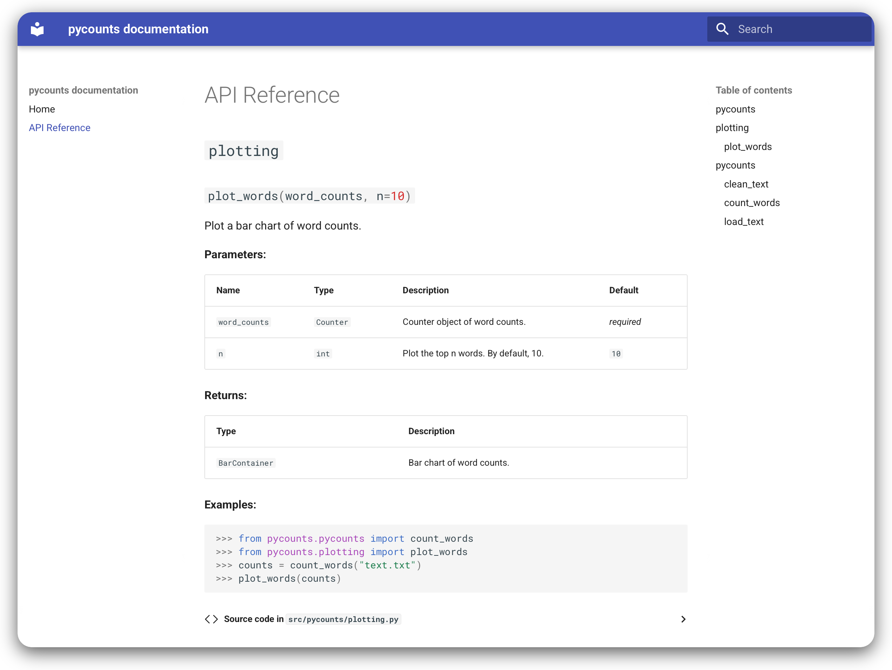{#fig-03-documentation-2 width="100%" fig-alt="API reference for the pycounts package."}

As a final example of the power of generated documentation, we'll show how to include executable, reproducible code from Jupyter notebooks into your documentation in **@sec-03-creating-usage-examples**. But if you've seen enough already, and just want to get your documentation online, feel free to jump to **@sec-03-hosting-documentation-online**.

For those using version control\index{version control}, now is a good time to move back to our package's root directory and commit our work using the following commands:

\newpage

```bash
$ git add src/pycounts/pycounts.py src/pycounts/plotting.py
$ git commit -m "docs: created docstrings for package functions"
$ git add mkdocs.yml docs/api.md
$ git commit -m "docs: created api reference"
$ git add pyproject.toml uv.lock
$ git commit -m "build: added dev dependencies for building docstrings"
$ git push
```

### Creating usage examples {#sec-03-creating-usage-examples}

Creating examples of how to use your package can be invaluable to new and existing users alike. Unlike the brief and basic "Usage" heading we wrote in our README in **@sec-03-writing-documentation**, these examples are more like tutorials, including a mix of text and code that demonstrates the functionality and common workflows of your package step-by-step. They are probably the most read part of any package documentation and are especially important for new users.

You could write examples from scratch using a plain-text format like Markdown\index{Markdown}, but this can be inefficient and prone to errors. If you change the way a function works, or what it outputs, you would have to re-write your example. Instead, in this section we'll show how to use a `mkdocs` extension, `mkdocs-jupyter`, as a more efficient, interactive, and reproducible way to create usage examples for your users.

The `mkdocs-jupyter` extension allows us to use Jupyter\index{Jupyter} Notebooks\index{Jupyter!notebooks} as pages in our documentation. Jupyter notebooks are interactive documents with an *.ipynb* extension that can contain code, equations, text, and visualizations. They are effective for demonstrating examples because they directly import and use code from your package; this ensures you don't make mistakes when writing out your examples, and it allows users to download, execute, and interact with the notebooks themselves (as opposed to just reading text). To create a usage example for our `pycounts` package using a Jupyter Notebook, we first need to add `mkdocs-jupyter` as a development dependency\index{dependency!development dependency}:

```bash
$ uv add --dev mkdocs-jupyter notebook
```

Now in *`mkdocs.yml`* we'll add a new section to `nav` for our "usage example" document and add the `mkdocs-jupyter` extension to the plugins list:

``` {.yaml emphasize-lines="6, 17-18"}
site_name: pycounts documentation
theme:
  name: material
nav:
  - Home: index.md
  - Usage: example.ipynb
  - API Reference: api.md
plugins:
  - search
  - include-markdown
  - mkdocstrings:
      handlers:
        python:
          options:
            docstring_style: numpy
            show_submodules: true
  - mkdocs-jupyter:
      execute: true
```

::: {.callout-note}
The `execute: true` option means our Jupyter notebook will be executed each time the documentation is run, so that it will be using the current version of your package in the examples.
:::

As explained in the Jupyter Notebook [documentation](https://jupyter-notebook.readthedocs.io/en/stable/), notebooks are comprised of "cells", which can contain Python code or Markdown text. This means you can use both text (Markdown) and Python code to illustrate how to use your package. Let's now create a Jupyter Notebook example document at *`docs/example.ipynb`*. First, open the Jupyter Notebook application using the following command from the root package directory:

```bash
$ uv run jupyter notebook
```

::: {.callout-note}
If you're developing your Python package in an IDE\index{integrated development environment} that natively supports Jupyter Notebooks, such as Visual Studio Code\index{Visual Studio Code}, you can also simply create your file there too, without needing to run the `jupyter notebook` command above.
:::

Use the Jupyter interface to create a Jupyter Notebook example document at *`docs/example.ipynb`*. Copy the brief example below into a cell so you can see how the output is rendered in your documentation:

```python
from pycounts.pycounts import count_words

quote = """Insanity is doing the same thing 
over and over and expecting different results."""
with open("einstein.txt", "w") as file:
    file.write(quote)
counts = count_words("einstein.txt")
print(counts)
```

Now when we build our documentation, this Jupyter Notebook(s) will be rendered into it, including any output from the cells.

```bash
$ uv run mkdocs serve
```

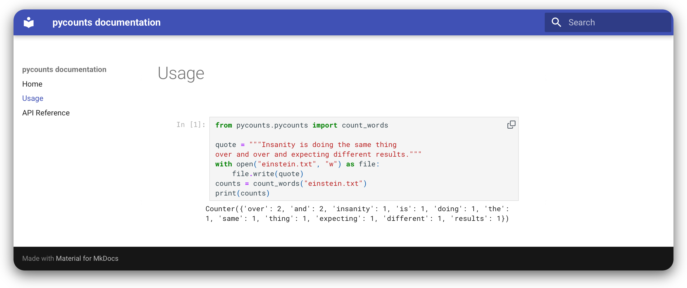{#fig-03-jupyter-example-1 width="100%" fig-alt="A simple Jupyter Notebook using code from pycounts."}

Figure @fig-03-jupyter-example-2 below shows an example of a more comprehensive notebook demonstrating the use of `pycounts`. You don't need to copy this example, but what's important to note is that the code and outputs are generated using our package itself, they have not been written manually, and you can thus generate comprehensive, and reproducible examples of using your package.

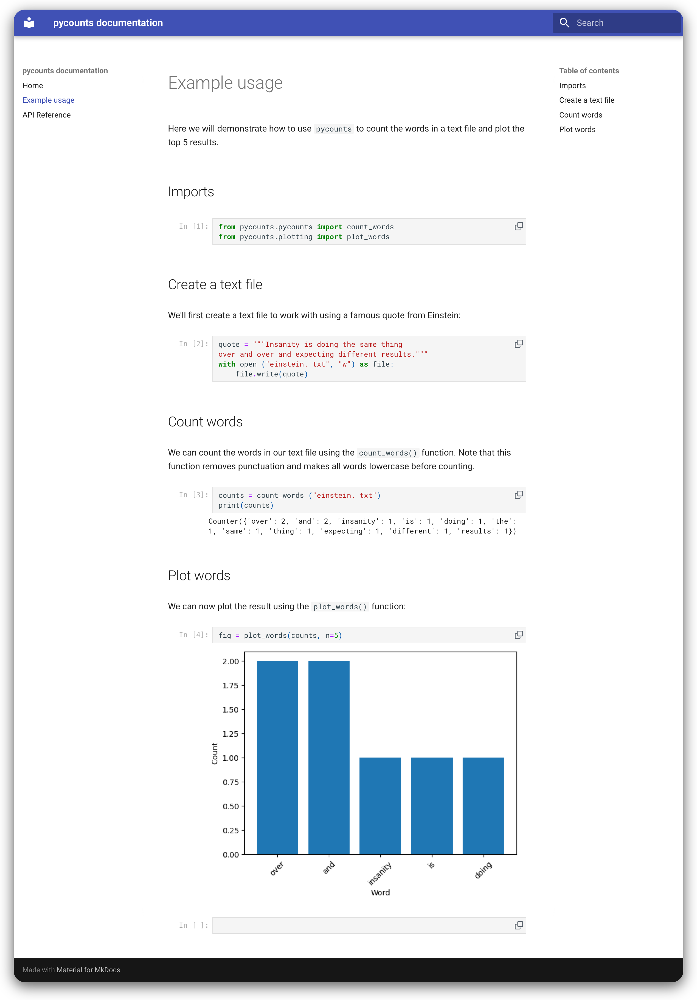{#fig-03-jupyter-example-2 width="100%" fig-alt="Jupyter Notebook demonstrating an example workflow using the pycounts package."}

`mkdocs` is a great, lightweight tool for generating Python docs and can be extended significantly through a wide array of extensions as we've seen in this section. However, other modern, powerful tools for creating executable and reproducible documentation also exist in the Python ecosystem, notably, [Jupyter Book](https://jupyterbook.org/stable/) and [Quarto](https://quarto.org).

For those using version control\index{version control}, now is a good time to commit all this new work using the following commands:

\newpage

```bash
$ git add mkdocs.yml docs/example.ipynb
$ git commit -m "docs: added usage example"
$ git add pyproject.toml uv.lock
$ git commit -m "build: added dev dependencies for Jupyter Notebooks"
$ git push
```

### Hosting documentation online {#sec-03-hosting-documentation-online}

If you intend to share your package with others, it will be useful to make your documentation accessible online\index{documentation!host documentation}. It's common to host Python package documentation on free online hosting services such as [GitHub Pages](https://pages.github.com)\index{GitHub Pages} or [Read the Docs](https://readthedocs.org/)\index{Read the Docs}. As we are already hosting our package code and documentation on GitHub, GitHub Pages is a convenient option for us. In fact, all that is required to deploy our documentation on GitHub pages is to run the following command, which will build our documentation and deploy it to a branch `gh-pages` in our repository:

```bash
$ uv run mkdocs gh-deploy --force
```

```md
...
INFO - Your documentation should shortly be available at: https://TomasBeuzen.github.io/pycounts/
```

Your documentation may take a minute or so to appear online, but if you still have problems, you may need to change the configuration of GitHub Pages for your repository, which you can read more about in the [official documentation](https://docs.github.com/en/pages/quickstart).

\newpage

## Tagging a package release with version control {#sec-03-tagging-a-package-release-with-version-control}

We have now created all the source files that make up version 0.1.0 of our `pycounts` package, including Python code, documentation, and tests — well done! In the next section, we'll turn all these source files into a distribution package that can be easily shared and installed by others. But for those using version control\index{version control}, it's helpful at this point to tag\index{version control!tag} a release\index{version control!release} of your package's repository. If you're not using version control, you can skip to **@sec-03-building-and-distributing-your-package**.

Tagging a release means that we permanently "tag" a specific point in our repository's history, and then create a downloadable "release" of all the files in our repository in the state they were in when the tag was made. It's common to tag a release for each new version of your package, as we'll discuss more in **Chapter 7: [Releasing and versioning](#sec-07-releasing-and-versioning)**.

Tagging a release is a two-step process involving both Git and GitHub:

1. Create a tag marking a specific point in a repository's history using the command `git tag`\index{Git}.
2. On GitHub\index{GitHub}, create a release of all the files in your repository (usually in the form of a zipped archive like *.zip* or *.tar.gz*) based on your tag. Others can then download this release if they wish to view or use your package's source files as they existed at the time the tag was created.

We'll demonstrate this process by tagging a release of v0.1.0 of our `pycounts` package (it's common to prefix a tag with "v" for "version"). First, we need to create a tag identifying the state of our repository at v0.1.0 and then push the tag to GitHub using the following `git` commands at the command line:

```bash
$ git tag v0.1.0
$ git push --tags
```

Now if you go to the `pycounts` repository on GitHub and navigate to the "Releases" tab, you should see a tag like that shown in @fig-03-tag.

\newpage

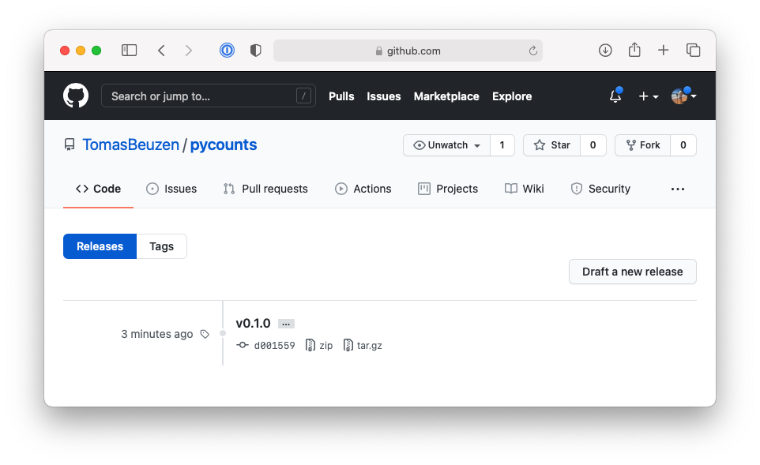{#fig-03-tag width="100%" fig-alt="Tag of v0.1.0 of pycounts on GitHub."}

To create a release from this tag, click "Draft a new release". You can then identify the tag from which to create the release and optionally add some additional details about the release as shown in @fig-03-release-1.

\newpage

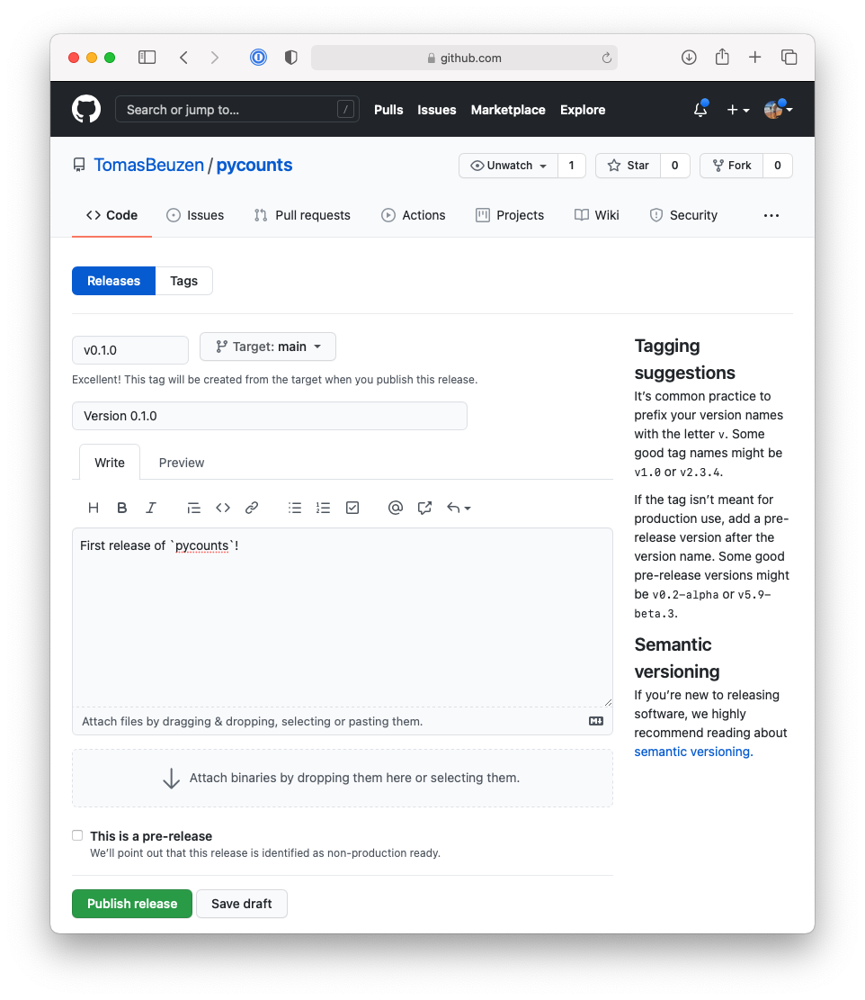{#fig-03-release-1 width="100%" fig-alt="Making a release of v0.1.0 of pycounts on GitHub."}

After clicking "Publish release", GitHub will automatically create a release from your tag, including compressed archives of your code in *.zip* and *.tar.gz* format, as shown in @fig-03-release-2.

\newpage

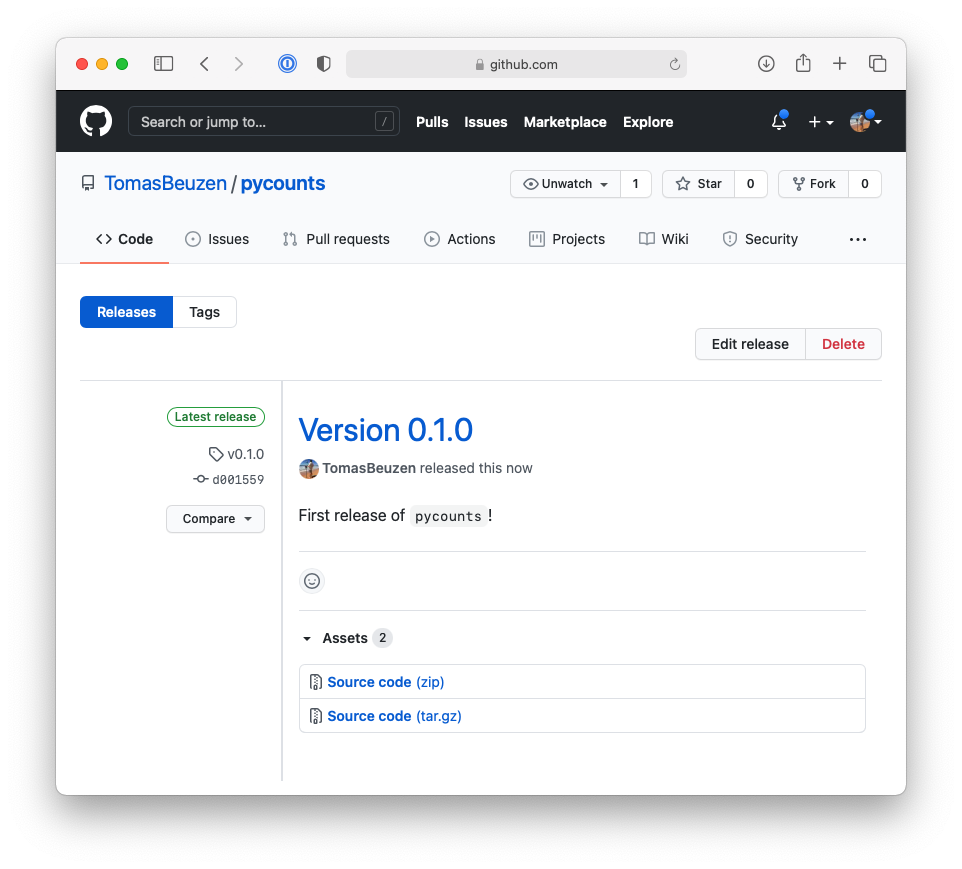{#fig-03-release-2 width="100%" fig-alt="Release of v0.1.0 of pycounts on GitHub."}

We'll talk more about making new versions and releases of your package as you update it (e.g., modify code, add features, fix bugs, etc.) in **Chapter 7: [Releasing and versioning](#sec-07-releasing-and-versioning)**.

::: {.callout-tip}
People with access to your GitHub repository can actually `pip install` your package directly from the repository using your tags. We talk more about that in **@sec-04-package-repositories**.
:::

## Building and distributing your package {#sec-03-building-and-distributing-your-package}

### Building your package {#sec-03-building-your-package}

Right now, our package is a collection of files and folders that is difficult to share with others. The solution to this problem is to create a "distribution package\index{distribution}". A distribution package is a single archive file containing all the files and information necessary to install a package using a tool like `pip`\index{pip}. Distribution packages are often called "distributions" for short and they are how packages are shared in Python and installed by users, typically with the command `pip install <some-package>`.

The main types of distributions in Python are source distributions (known as "sdists") and wheels. sdists\index{distribution!sdists} are a compressed archive of all the source files, metadata, and instructions needed to construct an installable version of your package. To install from an sdist, a user needs to download the sdist, extract its contents, and then use the build instructions to build and finally install the package on their computer.

In contrast, wheels\index{distribution!wheel} are pre-built versions of a package. They are built on the developer's machine before sharing with users. They are the preferred distribution format because a user only needs to download the wheel and move it to the location on their computer where Python searches for packages; no build step is required.

`pip install` can handle installation from either an sdist or a wheel, and we'll discuss these topics in much more detail in **@sec-04-package-distribution-and-installation**. What you need to know now is that when distributing a package it's common to create both sdist and wheel distributions. We can easily create an sdist and wheel of a package with `uv`\index{uv} using the command `uv build`. Let's do that now for our `pycounts` package by running the following command from our root package directory:

```bash
$ uv build
```

```md
Building source distribution (uv build backend)...
Building wheel from source distribution (uv build backend)...
Successfully built dist/pycounts-0.1.0.tar.gz
Successfully built dist/pycounts-0.1.0-py3-none-any.whl
```

After running this command, you'll notice a new directory in your package called *`dist/`*:

``` {.md emphasize-lines="5-7"}
pycounts
├── .gitignore
├── .python-version
├── .venv
├── dist
│   ├── pycounts-0.1.0-py3-none-any.whl  <- wheel
│   └── pycounts-0.1.0.tar.gz            <- sdist
├── docs
│   └─ ...
├── mkdocs.yml
├── README.md
├── pyproject.toml
├── src
│   └── ...
├── tests
│   └── ...
└── uv.lock
```

Those two new files are the sdist and wheel for our `pycounts` package. A user could now easily install our package\index{installable Python package} if they had one of these distributions by using `pip install`. For example, to install the wheel (the preferred distribution type), you could enter the following in a terminal:

```bash
$ cd dist/
$ uv pip install pycounts-0.1.0-py3-none-any.whl
```

```md
Processing ./pycounts-0.1.0-py3-none-any.whl
...
Successfully installed pycounts-0.1.0
```

To install using the sdist, you would have to unpack the sdist archive before running `pip install`. The procedure for this varies depending on your specific operating system. For example, on Mac OS, the command line tool `tar` with argument `x` (extract the input file), `z` (gunzip the input file), `f` (apply operations to the provided input file) can be used to unpack the sdist:

```bash
$ tar xzf pycounts-0.1.0.tar.gz
$ uv pip install pycounts-0.1.0/
```

\newpage

```md
Processing ./pycounts-0.1.0-py3-none-any.whl
  Installing build dependencies ... done
    Getting requirements to build wheel ... done
    Preparing wheel metadata ... done
...
Successfully built pycounts
Successfully installed pycounts-0.1.0
```

Note in the output above how installing from an sdist requires a build step prior to installation. The sdist is first built into a wheel, which is then installed. For those interested, we discuss the nuances of building and installing packages from sdists and wheels in **@sec-04-package-distribution-and-installation**.

Creating a distribution for our package is most useful if we make it available on an online repository like the Python Package Index (PyPI\index{PyPI}), the official online software repository for Python. This would allow users to simply run `pip install pycounts` to install our package, without needing the sdist or wheel files locally, and we'll do this in the next section. But even if you don't intend to share your package, it can still be useful to build and install distributions for two reasons:

1. A distribution is a self-contained copy of your package's source files that's easy to move around and store on your computer. It makes it easy to retain distributions for different versions of your package, so that you can re-use or share them if you ever need to.
2. Recall that `uv` installs package in "editable mode", such that a link to the package's location is installed, rather than an independent distribution of the package itself. This is useful for *development purposes*, because it means that any changes to the source code will be immediately reflected when you next `import` the package, without the need to `uv sync` again. However, for *users* of your package (including yourself using your package in other projects), it is often better to install a "non-editable" version of the package (the default behavior when you `pip install` an sdist or wheel) because a non-editable installation will remain stable and immune to any changes made to the source files on your computer.

### Publishing to TestPyPI {#sec-03-publishing-to-testpypi}

At this point, we have distributions of `pycounts` that we want to share with the world by publishing\index{publish} to [PyPI](https://pypi.org/)\index{PyPI}. However, it is good practice to do a "dry run" and check that everything works as expected by submitting to [TestPyPi](https://test.pypi.org/) first. `uv`\index{uv} has a `publish` command, which we can use to do this, however the default behavior is to publish to PyPI. So we need to add TestPyPI\index{TestPyPI} to the list of repositories\index{software repository} `uv` knows about by updating our *`pyproject.toml`* file with a `[[tool.uv.index]]` section:

```toml
[[tool.uv.index]]
name = "testpypi"
url = "https://test.pypi.org/simple/"
publish-url = "https://test.pypi.org/legacy/"
explicit = true
```

To publish to TestPyPI we can use the `uv publish` command, using `--index` to specify we want to push to TestPyPi, and authenticating with the token we created in **@sec-02-register-for-a-pypi-account**:

```bash
$ uv publish --index testpypi --token <your-long-testpypi-token>
```

```md
Publishing pycounts (0.1.0) to test-pypi
 - Uploading pycounts-0.1.0-py3-none-any.whl 100%
 - Uploading pycounts-0.1.0.tar.gz 100%
```

Now we should be able to visit our package on TestPyPI. The URL for our `pycounts` package is: <https://test.pypi.org/project/pycounts/>. We can try installing our package using `pip` from the command line with the following command:

```bash
$ uv pip install --index-url https://test.pypi.org/simple/ \
  --extra-index-url https://pypi.org/simple \
  pycounts
```

By default `pip install` will search PyPI for the named package. However, we want to search TestPyPI because that is where we uploaded our package. The argument `--index-url` points `pip` to the TestPyPI index. However, it's important to note that not all developers upload their packages to TestPyPI; some only upload them directly to PyPI. If your package depends on packages that are not on TestPyPI you can tell `pip` to try and look for them on PyPI instead. To do that, you can use the argument `--extra-index-url` as we do in the command above.

::: {.callout-note}
**Trusted Publishing**\index{Trusted Publishing}

Token-based authentication works well for publishing from your local machine, but long-lived API tokens carry risk: they can be accidentally committed to version control or leaked. The modern alternative is [Trusted Publishing](https://docs.pypi.org/trusted-publishers/), which uses OpenID Connect (OIDC) to let PyPI verify your identity directly from your CI/CD environment (e.g., GitHub Actions) — no token required. Because Trusted Publishing depends on a trusted CI environment rather than a local terminal, we cannot use it here. We will set it up properly in **Chapter 8: [Continuous integration and deployment](#sec-08-continuous-integration-and-deployment)**.
:::

### Publishing to PyPI {#sec-03-publishing-to-pypi}

If you were able to upload your package to TestPyPI\index{TestPyPI} and install it without error, you're ready to publish your package to PyPI\index{PyPI}. You can publish\index{publish} to PyPI using the `uv publish` by supplying your token (for PyPI this time, not TestPyPI):

```bash
$ uv publish --token <your-long-pypi-token>
```

::: {.callout-note}
We omitted the `--index` flag this time because the default repository for `uv publish` is PyPI.
:::

Your package will then be available on PyPI (e.g., <https://pypi.org/project/pycounts/>) and can be installed by anyone using `pip` (or if they're using `uv`, `uv pip`):

```bash
$ pip install pycounts
```

## Summary and next steps

This chapter provided a practical overview of the key steps required to generate a fully-featured Python package. In the following chapters, we'll explore each of these steps in more detail and continue to add features to our `pycounts` package. Two key workflows we have yet to discuss are:

1. Releasing new versions of your package as you update it. We'll discuss this in **Chapter 7: [Releasing and versioning](#sec-07-releasing-and-versioning)**.
2. Setting up continuous integration and continuous deployment (CI/CD) — that is, automated pipelines for running tests, building documentation, and deploying your package. We'll discuss CI/CD in **Chapter 8: [Continuous integration and deployment](#sec-08-continuous-integration-and-deployment)**.

Before moving onto the next chapter, let's summarize a reference list of all the steps we took to develop a Python package in this chapter:

1. Create a basic package structure using `uv` (**@sec-03-creating-a-package-structure**), or other similar template or tool.

    ```bash
    $ uv init --lib <your-package-name>
    ```
    
2. (Optional) Put your package under version control (**@sec-03-put-your-package-under-version-control**).
3. Create and activate a virtual environment using `uv` (**@sec-03-create-a-virtual-environment**).

    ```bash
    $ uv sync
    ```
    
4. Add Python code to module(s) in the *`src/`* directory (**@sec-03-packaging-your-code**), adding dependencies as needed (**@sec-03-adding-dependencies-to-your-package**).

    ```bash
    $ uv add <dependency>
    ```
    
5. Try out your package in a Python interpreter (**@sec-03-installing-your-package**).

    ```bash
    $ uv run python
    ```
    
6. (Optional) Write tests for your package in module(s) prefixed with *`test_`* in the *`tests/`* directory. Add `pytest` as a development dependency to run your tests (**@sec-03-running-tests**). Add `pytest-cov` as a development dependency to calculate the coverage of your tests (**@sec-03-code-coverage**).

    ```bash
    $ uv add --dev pytest pytest-cov
    $ uv run pytest tests/ --cov=<your-package-name>
    ```
    
7. (Optional) Create documentation source files for your package (**@sec-03-package-documentation**). Use `mkdocs` to compile and generate an HTML render of your documentation. Don't forget there are plenty of extensions out there for `mkdocs` to help you build beautiful, functional, automated documentation as we explored in **@sec-03-building-documentation**. Also recall that `uv run mkdocs build` builds the source files for your static documentation website, if you just wish to view it while you're developing it, use `uv run mkdocs serve` instead.
    
    ```bash
    $ uv add --dev mkdocs-material
    $ cd docs
    $ uv run mkdocs build
    $ cd ..
    ```
    
8. (Optional) Host documentation online with [GitHub Pages](https://pages.github.com)\index{GitHub Pages} (**@sec-03-hosting-documentation-online**).

    ```bash
    $ uv run mkdocs gh-deploy --force
    ```

9. (Optional) Tag a release of your package using Git and GitHub, or equivalent version control tools (**@sec-03-tagging-a-package-release-with-version-control**).
10. Build sdist and wheel distributions for your package (**@sec-03-building-your-package**).

    ```bash
    $ uv build
    ```
    
11. (Optional) Publish your distributions to [TestPyPI](https://test.pypi.org/) and try installing your package (**@sec-03-publishing-to-testpypi**).

    ```bash
    $ uv publish --index testpypi --token <your-long-testpypi-token>
    $ uv pip install --index-url https://test.pypi.org/simple/ \
      --extra-index-url https://pypi.org/simple \
      <your-package-name>
    ```
    
12. (Optional) Publish your distributions to [PyPI](https://pypi.org/). Your package can now be installed by anyone using `pip` (**@sec-03-publishing-to-pypi**).

    ```bash
    $ uv publish --token <your-long-pypi-token>
    $ uv pip install <your-package-name>
    ```
    
The above workflow uses `uv` for package management and environment handling, and `mkdocs` for documentation. While other tools exist for each of these roles, the underlying concepts — package metadata, build backends, dependency resolution, distribution, and testing — remain the same across the Python packaging ecosystem. The specific tools will evolve; the concepts covered in this chapter will not.
