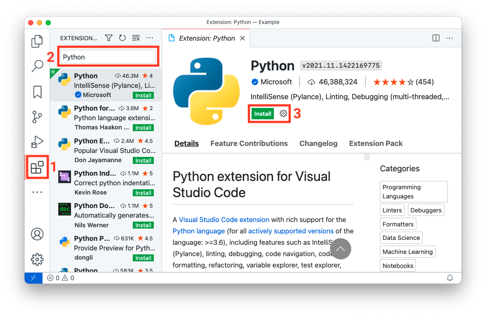
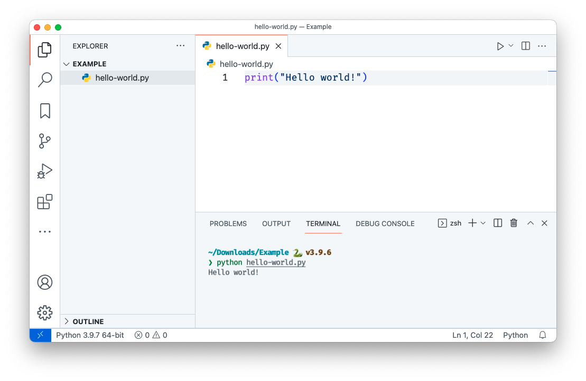

# System setup


If you intend to follow along with the code presented in this book, we recommend you follow these setup instructions so that you will run into fewer technical issues.

## The command-line interface

A command-line interface\index{command-line interface} (CLI) is a text-based interface used to interact with your computer. We'll be using a CLI for various tasks throughout this book. We'll assume Mac and Linux users are using the "Terminal"\index{Terminal} and Windows users are using the "Anaconda Prompt"\index{Anaconda Prompt} (which we'll install in the next section) as a CLI.

## Installing software

**Section \@ref(installing-python)** and **Section \@ref(install-packaging-software)** describe how to install the software you'll need to develop a Python package and follow along with the text and examples in this book. However, we also support an alternative setup with Docker\index{Docker} that has everything you need already installed to get started. The Docker approach is recommended for anyone that runs into issues installing or using any of the software below on their specific operating system, or anyone who would simply prefer to use Docker — if that's you, skip to **Section \@ref(register-for-a-pypi-account)** for now, and we'll describe the Docker setup later in **Section \@ref(developing-with-docker)**.

### Installing Python

We recommend installing the latest version of Python via the Miniconda\index{Miniconda} distribution by following the instructions in the Miniconda [documentation](https://docs.conda.io/en/latest/miniconda.html). Miniconda is a lightweight version of the popular Anaconda\index{Anaconda} distribution. If you have previously installed the Anaconda or Miniconda distribution feel free to skip to **Section \@ref(install-packaging-software)**.

If you are unfamiliar with Miniconda and Anaconda, they are distributions of Python that also include the `conda`\index{conda} package and environment manager, and a number of other useful packages. The difference between Anaconda and Miniconda is that Anaconda installs over 250 additional packages (many of which you might never use), while Miniconda is a much smaller distribution that comes bundled with just a few key packages; you can then install additional packages as you need them using the command `conda install`.

`conda` is a piece of software that supports the process of installing and updating software (like Python packages). It is also an environment manager, which is the key function we'll be using it for in this book. An environment manager helps you create "virtual environments\index{virtual environment}" on your machine, where you can safely install different packages and their dependencies in an isolated location. Installing all the packages you need in the same place (i.e., the system default location) can be problematic because different packages often depend on different versions of the same dependencies; as you install more packages, you'll inevitably get conflicts between dependencies, and your code will start to break. Virtual environments help you compartmentalize and isolate the packages you are using for different projects to avoid this issue. You can read more about virtual environments in the `conda` [documentation](https://conda.io/projects/conda/en/latest/user-guide/concepts/environments.html). While alternative package and environment managers exist, we choose to use `conda` in this book because of its popularity, ease-of-use, and ability to handle any software stack (not just Python).

### Install packaging software

Once you've installed the Miniconda\index{Miniconda} distribution, ensure that Python and `conda`\index{conda} are up to date by running the following command at the command line:

```bash
$ conda update --all
```

Now we'll install the two main pieces of software we'll be using to help us create Python packages in this book:

1. [`poetry`\index{poetry}](https://python-poetry.org/): software that will help us build our own Python packages. `poetry` is under active development, thus we recommend referring to the official [`poetry` documentation](https://python-poetry.org/docs/) for detailed installation instructions and support.

2. [`cookiecutter`\index{cookiecutter}](https://github.com/cookiecutter/cookiecutter): software that will help us create packages from pre-made templates. It can be installed with `conda` as follows:

    ```bash
    $ conda install -c conda-forge cookiecutter
    ```

## Register for a PyPI account

The Python Package Index (PyPI)\index{PyPI} is the official online software repository for Python. A software repository\index{software repository} is a storage location for downloadable software, like Python packages. In this book we'll be publishing a package to PyPI. Before publishing packages to PyPI, it is typical to "test drive" their publication on TestPyPI\index{TestPyPI}, which is a test version of PyPI. To follow along with this book, you should register for a TestPyPI account on the [TestPyPI website](https://test.pypi.org/account/register/) and a PyPI account on the [PyPI website](https://pypi.org/account/register/).

## Set up Git and GitHub

If you're not using a version control\index{version control} system, we highly recommend you get into the habit! A version control system tracks changes to the file(s) of your project in a clear and organized way (no more "document_1.doc", "document_1_new.doc", "document_final.doc", etc.). As a result, a version control system contains a full history of all the revisions made to your project, which you can view and retrieve at any time. You don't *need* to use or be familiar with version control to read this book, but if you're serious about creating Python packages, version control will become an invaluable part of your workflow, so now is a good time to learn!

There are many version control systems available, but the most common is Git\index{Git} and we'll be using it throughout this book. You can download Git by following the instructions in the [Git documentation](https://git-scm.com/book/en/v2/Getting-Started-Installing-Git). Git helps track changes to a project on a local computer, but what if we want to collaborate with others? Or, what happens if your computer crashes and you lose all your work? That's where GitHub\index{GitHub} comes in. GitHub is one of many online services for hosting Git-managed projects. GitHub helps you create an online copy of your local Git repository, which acts as a backup of your local work and allows others to easily and transparently collaborate on your project. You can sign up for a free GitHub account on the [GitHub website](https://www.github.com).

We assume that those who choose to follow the optional version control sections of this book have basic familiarity with Git and GitHub (or equivalent). Two excellent learning resources are [*Happy Git and GitHub for the useR*](https://happygitwithr.com) [@bryan2021] and [*Research Software Engineering with Python*](https://merely-useful.tech/py-rse/git-cmdline.html) [@rsep2021].

## Python integrated development environments

A Python integrated development environment\index{integrated development environment} (IDE) will make the process of creating Python packages significantly easier. An IDE is a piece of software that provides advanced functionality for code development, such as directory and file creation and navigation, autocomplete, debugging, and syntax highlighting, to name a few. An IDE will save you time and help you write better code. Commonly used free Python IDEs include [Visual Studio Code\index{Visual Studio Code}](https://code.visualstudio.com/), [Atom](https://atom.io/), [Sublime Text](https://www.sublimetext.com/), [Spyder](https://www.spyder-ide.org/), and [PyCharm Community Edition](https://www.jetbrains.com/pycharm/). For those more familiar with the Jupyter\index{Jupyter} ecosystem, [JupyterLab](https://jupyter.org/) is a suitable browser-based IDE. Finally, for the R\index{R} community, the [RStudio\index{RStudio} IDE](https://rstudio.com/products/rstudio/download/) also supports Python.

You'll be able to follow along with the examples presented in this book regardless of what IDE you choose to develop your Python code in. If you don't know which IDE to use, we recommend starting with Visual Studio Code. Below we briefly describe how to set up Visual Studio Code, JupyterLab, and RStudio as Python IDEs (these are the IDEs we personally use in our day-to-day work). If you'd like to use Docker to help develop Python packages and follow along with this book, we'll describe how to do so with Visual Studio Code or JupyterLab in **Section \@ref(developing-with-docker)**.

### Visual Studio Code

You can download Visual Studio Code\index{Visual Studio Code} (VS Code) from the Visual Studio Code [website](https://code.visualstudio.com/). Once you've installed VS Code, you should install the "Python" extension from the VS Code Marketplace. To do this, follow the steps listed below and illustrated in Fig. \@ref(fig:02-vscode-1-fig):

1. Open the Marketplace by clicking the *Extensions* tab on the VS Code activity bar.
2. Search for "Python" in the search bar.
3. Select the extension named "Python" and then click *Install*.

```{r 02-vscode-1-fig, fig.cap = "Installing the Python extension in Visual Studio Code.", out.width = "100%", fig.retina = 2, fig.align = "center", echo = FALSE, message = FALSE, warning = FALSE}

```

Once this is done, you have everything you need to start creating packages! For example, you can create files and directories from the *File Explorer* tab on the VS Code activity bar, and you can open up an integrated CLI by selecting *Terminal* from the *View* menu. Fig. \@ref(fig:02-vscode-2-fig) shows an example of executing a Python *.py* file from the command line in VS Code.

```{r 02-vscode-2-fig, fig.cap = "Executing a simple Python file called hello-world.py from the integrated terminal in Visual Studio Code.", out.width = "100%", fig.retina = 2, fig.align = "center", echo = FALSE, message = FALSE, warning = FALSE}

```

We recommend you take a look at the VS Code [Getting Started Guide](https://code.visualstudio.com/docs) to learn more about using VS Code. While you don't need to install any additional extensions to start creating packages in VS Code, there are many extensions available that can support and streamline your programming workflows in VS Code. Below are a few we recommend installing to support the workflows we use in this book (you can search for and install these from the "Marketplace" as we did earlier):

- [Python Docstring Generator](https://marketplace.visualstudio.com/items?itemName=njpwerner.autodocstring): an extension to quickly generate documentation strings (docstrings\index{docstring}) for Python functions.
- [Markdown All in One](https://marketplace.visualstudio.com/items?itemName=yzhang.markdown-all-in-one): an extension that provides keyboard shortcuts, automatic table of contents, and preview functionality for Markdown\index{Markdown} files. [Markdown](https://www.markdownguide.org) is a plain-text markup language that we'll use and learn about in this book.

### JupyterLab

For those comfortable in the Jupyter\index{Jupyter} ecosystem feel free to stay there to create your Python packages! JupyterLab is a browser-based IDE that supports all of the core functionality we need to create packages. As per the JupyterLab [installation instructions](https://jupyterlab.readthedocs.io/en/stable/getting_started/installation.html), you can install JupyterLab with:

```bash
$ conda install -c conda-forge jupyterlab
```

Once installed, you can launch JupyterLab from your current directory by typing the following command in your terminal:

```bash
$ jupyter lab
```

In JupyterLab, you can create files and directories from the *File Browser* and can open up an integrated terminal from the *File* menu. Fig. \@ref(fig:02-jupyterlab-fig) shows an example of executing a Python *.py* file from the command line in JupyterLab.

```{r 02-jupyterlab-fig, fig.cap = "Executing a simple Python file called hello-world.py from a terminal in JupyterLab.", out.width = "100%", fig.retina = 2, fig.align = "center", echo = FALSE, message = FALSE, warning = FALSE}
knitr::include_graphics("../images/02-jupyterlab.png")
```

We recommend you take a look at the JupyterLab [documentation](https://jupyterlab.readthedocs.io/en/stable/index.html) to learn more about how to use Jupyterlab. In particular, we'll note that, like VS Code, JupyterLab supports an ecosystem of extensions that can add additional functionality to the IDE. We won't install any here, but you can browse them in the JupyterLab *Extension Manager* if you're interested.

### RStudio

Users with an R\index{R} background may prefer to stay in the RStudio\index{RStudio} IDE. We recommend installing the most recent version of the IDE from the RStudio [website](https://rstudio.com/products/rstudio/download/preview/) (we recommend installing at least version ^1.4) and then installing the most recent version of R from [CRAN](https://cran.r-project.org/). To use Python in RStudio, you will need to install the [reticulate\index{reticulate}](https://rstudio.github.io/reticulate/) R package by typing the following in the R console inside RStudio:

```r
install.packages("reticulate")
```

When installing reticulate, you may be prompted to install the Anaconda distribution. We already installed the Miniconda distribution of Python in **Section \@ref(installing-python)**, so answer "no" to this prompt. Before being able to use Python in RStudio, you will need to configure `reticulate`. We will briefly describe how to do this for different operating systems below, but we encourage you to look at the `reticulate` [documentation](https://rstudio.github.io/reticulate/) for more help.

**Mac and Linux**

1. Find the path to the Python interpreter installed with Miniconda by typing `which python` at the command line.
2. Open (or create) an `.Rprofile` file in your HOME directory and add the line `Sys.setenv(RETICULATE_PYTHON = "path_to_python")`, where `"path_to_python"` is the path identified in step 1.
3. Open (or create) a `.bash_profile` file in your HOME directory and add the line `export PATH="/opt/miniconda3/bin:$PATH"`, replacing `/opt/miniconda3/bin` with the path you identified in step 1 but without the `python` at the end.
4. Restart R.
5. Try using Python in RStudio by running the following in the R console:

```r
library(reticulate)
repl_python()
```

**Windows**

1. Find the path to the Python interpreter installed with Miniconda by opening an Anaconda Prompt from the Start Menu and typing `where python` in a terminal.
2. Open (or create) an `.Rprofile` file in your HOME directory and add the line `Sys.setenv(RETICULATE_PYTHON = "path_to_python")`, where `"path_to_python"` is the path identified in step 1. Note that in Windows, you need `\\` instead of `\` to separate the directories; for example your path might look like: `C:\\Users\\miniconda3\\python.exe`.
3. Open (or create) a `.bash_profile` file in your HOME directory and add the line `export PATH="/opt/miniconda3/bin:$PATH"`, replacing `/opt/miniconda3/bin` with the path you identified in step 1 but without the `python` at the end.
4. Restart R.
5. Try using Python in RStudio by running the following in the R console:

```r
library(reticulate)
repl_python()
```

Fig. \@ref(fig:02-rstudio-fig) shows an example of executing Python code interactively within the RStudio console.

```{r 02-rstudio-fig, fig.cap = "Executing Python code in the RStudio.", out.width = "100%", fig.retina = 2, fig.align = "center", echo = FALSE, message = FALSE, warning = FALSE}
knitr::include_graphics("../images/02-rstudio.png")
```

## Developing with Docker

If you have issues installing or using any of the software in this book on your specific operating system, or would prefer to use Docker\index{Docker} to help develop your Python packages, we have provided an alternative software setup with Docker\index{Docker} that has everything you need already installed to get started. [Docker](https://docs.docker.com/get-started/overview/) is a platform that allows you to run and develop software in an isolated environment called a *container*. *Images* contain the instructions required to create a container.

We have developed images to support Python package development in Visual Studio Code\index{Visual Studio Code} or JupyterLab\index{Jupyter}, and we describe the workflows for using these images in the sections below. We will continue to maintain these images via their GitHub repositories ([py-pkgs/docker-vscode](https://github.com/py-pkgs/docker-vscode) and [py-pkgs/docker-jupyter](https://github.com/py-pkgs/docker-jupyter)) to support readers of this book into the future.

### Docker with Visual Studio Code

To develop with Docker inside Visual Studio Code, you can consult the Visual Studio Code [official container tutorial](https://code.visualstudio.com/docs/remote/containers-tutorial), or try following the steps below:

1. Install Visual Studio Code from the [official website](https://code.visualstudio.com/).
2. Install and configure Docker Desktop for your operating system following the instructions on the [official website](https://www.docker.com/get-started).
3. Once docker is installed, open a command-line interface and pull the `py-pkgs-vscode` docker image by running the following command:

    ```bash
    $ docker pull tbeuzen/py-pkgs-vscode
    ```

4. From Visual Studio Code, open/create the working directory you want to develop in (this can be called anything and located wherever you like on your file system).
5. In Visual Studio Code, open the *Extensions* tab on the VS Code activity bar and search for the "Remote - Containers" extension in the search bar. Install this extension if it is not already installed.
6. Create a file called *`.devcontainer.json`* in your current working directory (be sure to include the period at the beginning of the file name). This file will tell Visual Studio Code how to run in a Docker container. You can read more about this configuration in the [official documentation](https://code.visualstudio.com/docs/remote/create-dev-container), but for now, a minimal set up requires adding the following content to that file:

    ```json
    {
        "name": "poetry",
        "image": "tbeuzen/py-pkgs-vscode",
        "extensions": ["ms-python.python"],
    }
    ```

7. Now, open the Visual Studio Code [Command Palette](https://code.visualstudio.com/docs/getstarted/userinterface#_command-palette) and search for and select the command "Remote-Containers: Reopen in Container". This command will open Visual Studio Code inside a container made using the `py-pkgs-vscode` docker image. After Visual Studio Code finishes opening in the container, test that you have access to the three pre-installed pieces of packaging software we need by opening the [integrated terminal](https://code.visualstudio.com/docs/editor/integrated-terminal) and trying the following commands:

    ```bash
    $ poetry --version
    $ conda --version
    $ cookiecutter --version
    ```

8. Your development environment is now set up, and you can work with Visual Studio Code as if everything were running locally on your machine (except now your development environment exists inside a container). If you exit Visual Studio Code, your container will persist, and you can re-open it in the future using the “Remote-Containers: Reopen in Container” command we used in step 7.

### Docker with JupyterLab

<!-- #region -->
To develop with Docker in JupyterLab follow the instructions below. Helpful information and tutorials can also be found in the Jupyter Docker Stacks [documentation](https://jupyter-docker-stacks.readthedocs.io/en/latest/index.html).

1. Install and configure Docker Desktop for your operating system following the instructions on the [official website](https://www.docker.com/get-started).
2. Once docker is installed, open a command-line interface and pull the `py-pkgs-jupyter` docker image by running the following command:

    ```bash
    $ docker pull tbeuzen/py-pkgs-jupyter
    ```

3. From the command line, navigate to the directory you want to develop in (this can be called anything and located wherever you like on your file system).
4. Start a new container by running the following command from the command line:

    ```bash
    $ docker run -it \
      -p 8888:8888 \
      -v "${PWD}":/home/jovyan/work \
      tbeuzen/py-pkgs-jupyter
    ```
    
>In the command above, `-it` creates an interactive bash shell in the container, `-p` binds port 8888 in the container to port 8888 on the host machine and `-v` mounts the current directory into the container at the location `/home/jovyan/work`. You can read more about the `docker run` command and its arguments in the Docker command-line interface [documentation](https://docs.docker.com/engine/reference/commandline/run/).

    
5. Copy the unique URL printed to screen (that looks something like this: `http://127.0.0.1:8888/lab?token=45d53a348580b3acfafa`) to your browser. This will open an instance of JupyterLab running inside a Docker container.
6. Navigate to the `work` directory in JupyterLab. This is where you can develop and create new files and directories that will persist in the directory from where you launched your container.
7. Test that you have access to the three pre-installed pieces of packaging software we need by opening a terminal in JupyterLab and trying the following commands:

    ```bash
    $ poetry --version
    $ conda --version
    $ cookiecutter --version
    ```

8. When you've finished a working session, you can exit JupyterLab, and kill your terminal, and your container will persist for you to use later. To re-enter the container at a later time, first find its ID:

    ```bash
    $ docker ps -a
    ```
    
    ```md
    CONTAINER ID   IMAGE
    653daa2cd48e   tbeuzen/py-pkgs-jupyter
    ```
    
9. Re-enter the container using the unique ID above:

    ```bash
    $ docker start -a 653daa2cd48e
    ```
    
10. If you want to completely remove the container, use the following command:

    ```bash
    $ docker rm 653daa2cd48e
    ```
<!-- #endregion -->
