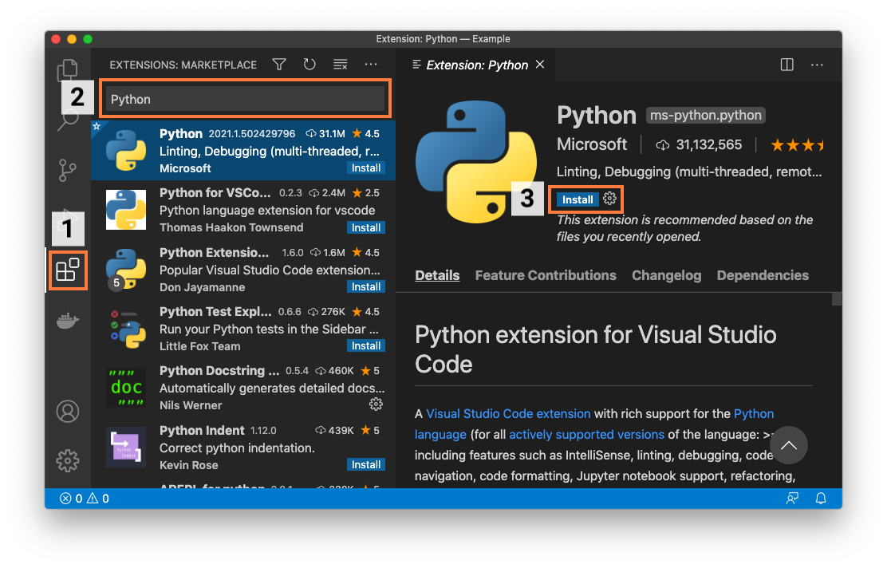
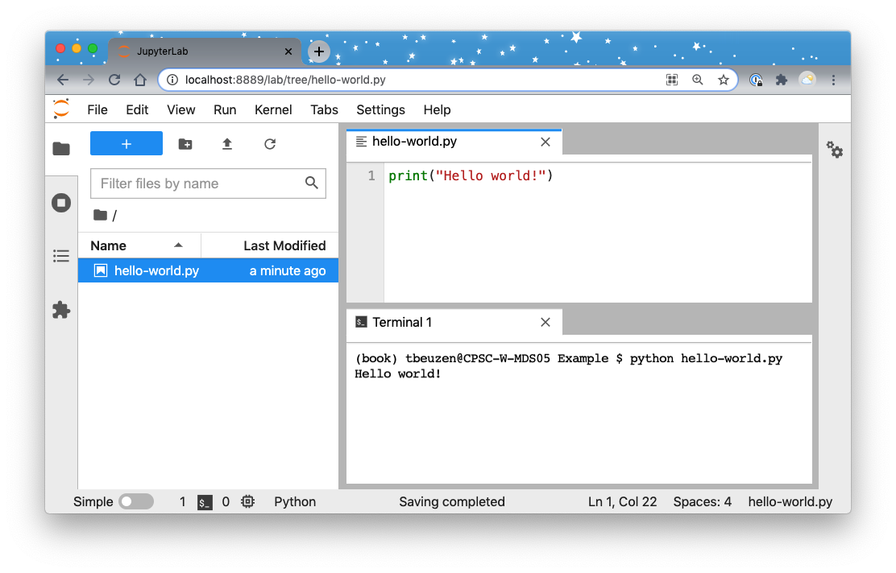

# System setup

If you intend to follow along with the code presented in this book, we recommend you follow these setup instructions so that you will run into fewer technical issues.

## Installing Python

We recommend installing the latest version of Python via the Anaconda distribution by following the instructions in the [Anaconda documentation](https://docs.anaconda.com/anaconda/install/). Anaconda is a Python distribution that includes Python, the `conda`  package and environment manager, and a number of commonly used Python libraries and dependencies. If you'd prefer to install packages as you need them, feel free to install Python via the [Miniconda](https://docs.conda.io/en/latest/miniconda.html) distribution instead, which is a lightweight version of Anaconda that essentially comes with Python, `conda` and only a few key packages. If you have previosuly installed the Anaconda or Miniconda distribution, ensure that Python and `conda` are up to date by running the following command in your terminal:

```bash
conda update --all
```

If you're not familiar with `conda`, it is a piece of software that simplifies the process of installing and updating software (like Python packages). It is also an environment manager which is the key function we'll be using it for in this text. An environment manager helps you create "virtual environments" on your machine where you can safely install different packages and their dependencies in an isolated location. Installing all the packages you need in the same place (i.e., the system default location) can be problematic, because different packages have different dependencies, and as you install more packages, you'll inevitably get conflicts between packages and your code will start to break. Virtual environments help you compartmentalise and isolate the packages you are using for different projects to avoid this issue. While alternative package and environment managers exist, we choose to use `conda` in this book because of its popularity, ease-of-use, and ability to handle any software stack (not just Python!).

Once you've installed the Anaconda distribution, use `conda` to install `poetry` ([a package](https://python-poetry.org/) that will help us build our own Python packages) and `cookiecutter` ([a package](https://github.com/cookiecutter/cookiecutter) that will help us create packages from pre-made templates) with the following command:

```bash
conda install -c conda-forge poetry cookiecutter
```

## Register for a PyPI account

PyPI is the official online software repository for Python. A software repository is a storage location for downloadable software, like Python packages. In this book we'll be publishing a package on PyPI. Before publishing packages on PyPI, it is typical to "test drive" their publication on TestPyPI which is a test version of PyPI. To follow along with this book, you should register for a TestPyPI account on the [TestPyPI website](https://test.pypi.org/account/register/) and a PyPI account on the [PyPI website](https://pypi.org/account/register/).

## Install Git and register for a GitHub account

If you're not using a version control system, we highly recommend you get into the habit! A version control system tracks changes to the file(s) of your project in a clear and organised way (no more "document_1.doc", "document_1_new.doc", "document_final.doc", etc.). A VCS works by storing a master copy of your project in a "repository" which you don’t edit directly. Instead, you edit a copy of the project file(s), and then *commit* changes back to the repository. In this way, a VCS contains a full history of all the revisions made to your project which you can view and retrieve at any time.

There are many version control systems available, but the most common is Git and we'll be using it throughout this book. You can download Git by following the instructions in the [Git documentation](https://git-scm.com/book/en/v2/Getting-Started-Installing-Git). Git will help us track changes to our project on our local computers, but what if we want to collaborate with others? Or, what happens if our computer crashes? That's where GitHub comes in. GitHub is one of many online services for hosting Git-managed projects. GitHub helps you create an online version of your local Git repository which acts as a back-up of your local work and allows others to easily and transparently collaborate on your project. You can sign up for a GitHub account on the [GitHub website](https://www.github.com).

## Python integrated development environments

A Python integrated development environment (IDE) will make the process of creating Python packages significantly easier. An IDE is a piece of software that provides advanced functionality for code development such as directory and file creation and navigation, code refactoring, autocomplete, debugging, and syntax highlighting, to name a few. Put simply, an IDE will save you time and help you write better code. Commonly used free Python IDEs include [Visual Studio Code](https://code.visualstudio.com/), [Atom](https://atom.io/), [Sublime Text](https://www.sublimetext.com/), [Spyder](https://www.spyder-ide.org/), and [PyCharm Community Edition](https://www.jetbrains.com/pycharm/). For those more familiar with the popular Jupyter ecosystem, [JupyterLab](https://jupyter.org/) is an alternative browser-based IDE. Finally, for the R community, the [RStudio IDE](https://rstudio.com/products/rstudio/download/) also supports Python.

You'll be able to follow along with the examples presented in this book regardless of what IDE you choose to develop your Python code in. Below, we will briefly describe how to set up Visual Studio Code, JupyterLab, and RStudio as Python IDEs (these are the IDEs we personally use in our day-to-day work). If you don't know which IDE to use, we recommend starting with Visual Studio Code.

### Visual Studio Code

You can download Visual Studio Code (VS Code) from [the Visual Studio Code website](https://code.visualstudio.com/). Once you've installed VS Code, you should install the "Python" extension from the VS Code *Marketplace*. To do this, you should:
1. Open the *Marketplace* by clicking the *Extensions* tab on the VS Code activity bar;
2. Search for "Python" in the search bar;
3. Select the extension named "Python" and then click *Install*.

```{r 02-vscode-1, fig.cap = "Installing the Python extension in Visual Studio Code.", out.width = "100%", fig.retina = 2, fig.align = "center", echo = FALSE, message = FALSE, warning = FALSE}

```

Once this is done, you have everything you need to start creating packages! For example, you can create files and directories from the *File Explorer* tab on the VS Code activity bar and you can open up an integrated terminal by clicking selecting *Terminal* from the *View* menu.

```{r 02-vscode-2, fig.cap = "Executing a simple Python file called hello-world.py from the integrated terminal in Visual Studio Code.", out.width = "100%", fig.retina = 2, fig.align = "center", echo = FALSE, message = FALSE, warning = FALSE}
knitr::include_graphics("../images/vscode-2.png")
```

We recommend you take a look at the VS Code [Getting Started Guide](https://code.visualstudio.com/docs) to learn more about VS Code. While you don't need to install any additional extensions to start creating packages in VS Code, there are many extensions available that can support and streamline your programming workflows in VS Code. Here's a few we currently recommend installing (you can search for and install these from the *Marketplace* just as we did earlier):
- Python Docstring Generator
- Bracket Pair Colorizer 2
- Markdown All in One
- markdownlint
- reStructuredText
- Material Icon Theme
- Material Theme

### JupyterLab

For those comfortable in the Jupyter ecosystem feel free to stay there. JupyterLab is a browser-based IDE that supports all of the core functionality we need to create packages. As per the [JupyterLab installation instructions](https://jupyterlab.readthedocs.io/en/stable/getting_started/installation.html), you can install JupyterLab with:

```sh
conda install -c conda-forge jupyterlab
```

Once installed, you can launch JupyterLab from your current directory using:

```sh
jupyter-lab
```

At a minimum for package development, we need to be able to create files and directories and have access to a terminal. In JupyterLab, you can create files and directories from the *File Browser* and can open up an integrated terminal from the *File* menu or a *Launcher* pane.

```{r 02-jupyterlab, fig.cap = "Executing a simple Python file called hello-world.py from a terminal in JupyterLab.", out.width = "100%", fig.retina = 2, fig.align = "center", echo = FALSE, message = FALSE, warning = FALSE}

```

We recommend you take a look at the JupyterLab [documentation](https://jupyterlab.readthedocs.io/en/stable/index.html) to learn more about how to use Jupyterlab. In particular, we'll note that, like VS Code, JupyterLab also supports an ecosystem of extensions to support the IDE. We won't install any here, but you can browse them in the JupyterLab *Extension Manager* if you're interested.

### RStudio

Users with an R background may prefer to stay in the RStudio IDE. We recommend installing the most recent version of the IDE from the [RStudio site](https://rstudio.com/products/rstudio/download/preview/) and then installing the most recent version of R from [CRAN](https://cran.r-project.org/). To use Python in RStudio, you will need to install the [reticulate](https://rstudio.github.io/reticulate/) R package by typing the following in the R console inside RStudio:

```r
install.packages("reticulate")
```

When installing reticulate, you may be prompted to install the Anaconda distribution. If you have already installed the Anaconda distribution of Python (which we did earlier), answer "no" to installing Anaconda distribution at this prompt. Depending on your operating system and how your Python and R environments are set up, you may need to configure `reticulate` in different ways. The `reticulate` [documentation](https://rstudio.github.io/reticulate/) can help you with this set up.

### Collaborative package development and packaging in the cloud

Git and GitHub make it easy for others to collaborate on your Python packages, and we will use these tools in this book. In this workflow, collaborators create a copy of a package's code from GitHub on their local machine, make changes to it, and then "push" those changes back to the remote GitHub repository. This is an effective way of making and tracking changes to a code base over time in a collaborative environment.

There also exists other options for collaborative software development that allow collaborators to directly edit source code (without having to make a copy of it), potentially simultaneously. Such a workflow might be particularly suited to collaborators that want to develop together in real-time, leverage cloud resources, or keep their work in private servers/hardware. Some current options for this kind of collaborative software development include:
- [Visual Studio Live Share](https://visualstudio.microsoft.com/services/live-share/): real-time collaborative development in VS Code. 
- [Google Colab](https://colab.research.google.com/): Jupyter notebooks that can be shared with collaborators via Google Drive. Collaborators can then view, edit or comment on these notebooks. While Python .py files can't be be created in Google Colab, they can be shared via Google Drive and accessed in the Google Colab environment.
- [JupyterHub](https://jupyter.org/hub): facilitates groups of users to interact within a shared Jupyter ecosystem that runs on private hardware or the cloud. A key advantage of JupyterHub is that it gives users access to collaborative computational environments without burdening the users with software installation.
