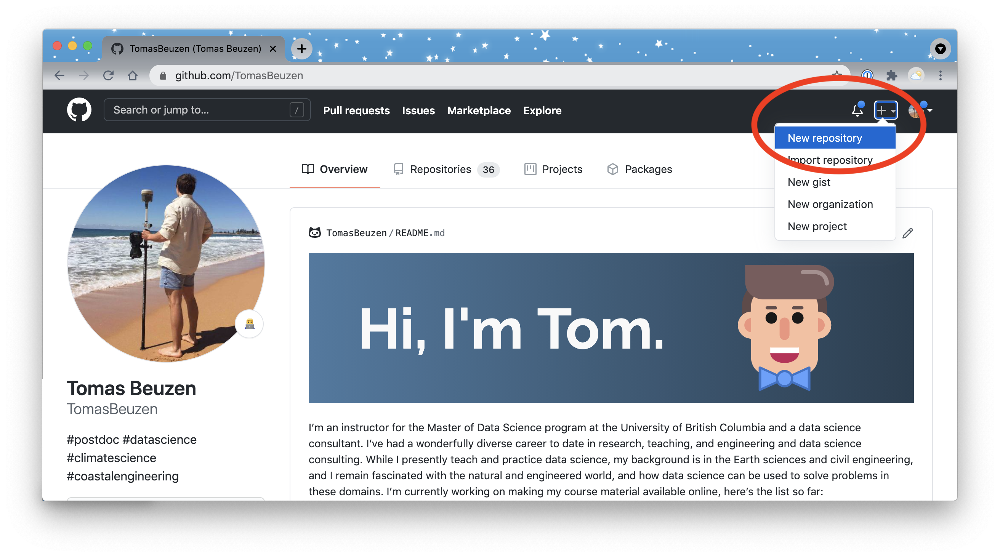
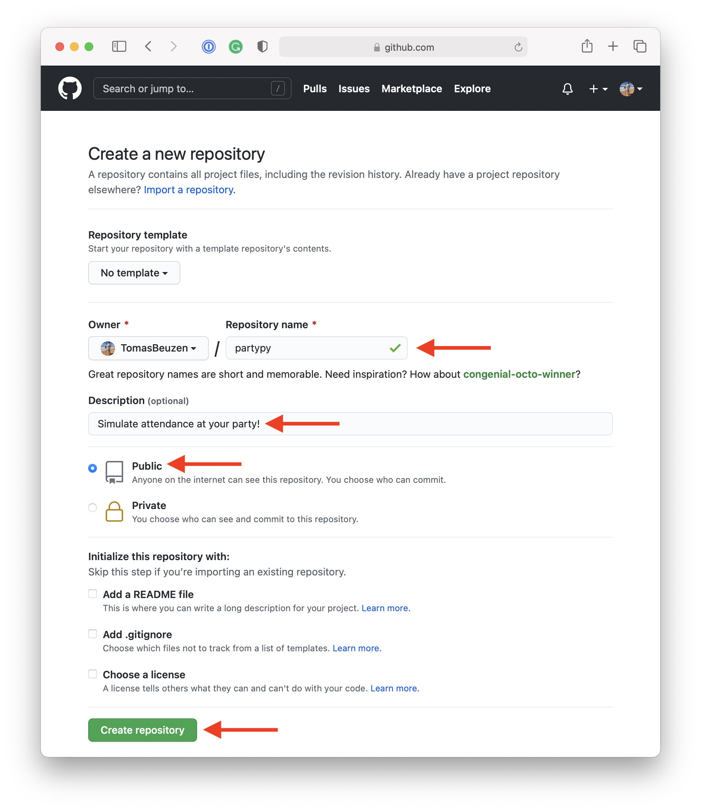
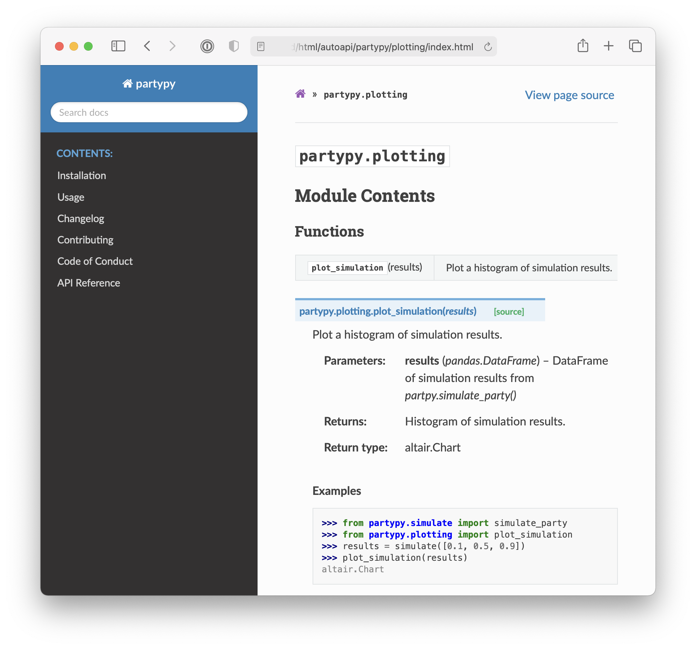
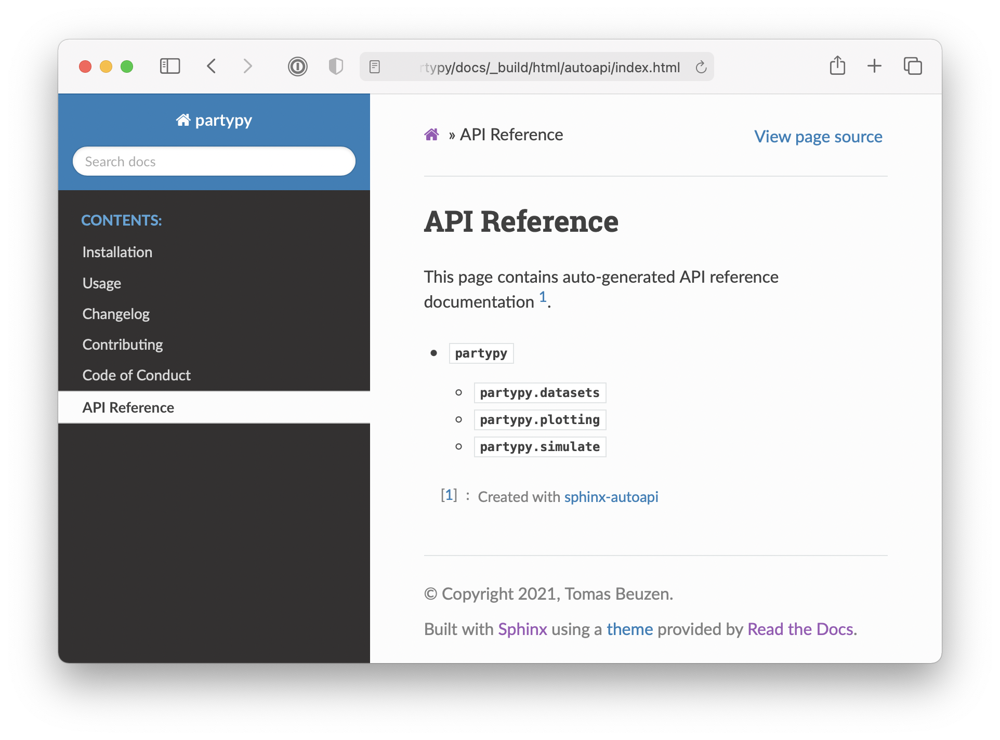
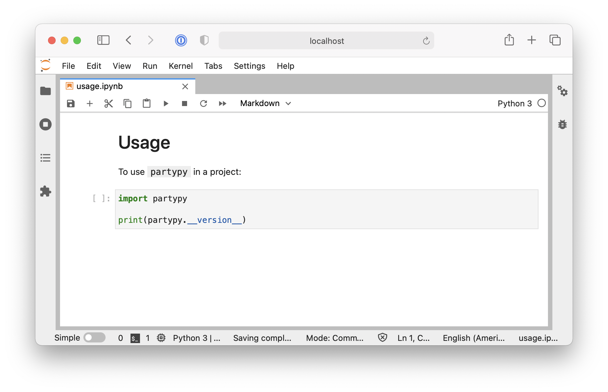

# How to package a Python


To start this book, we will first develop an entire Python package from beginning to end. The aim of this chapter is to give the reader a simple and high level overview of the key steps involved in developing a Python package and what the final product we're building actually looks like. Later chapters will then explore each of these key steps in more detail. This chapter was inspired by [The Whole Game chapter](https://r-pkgs.org/whole-game.html) of the [R packages book](https://r-pkgs.org/) written by Hadley Wickham and Jenny Bryan.

## Package structure

<!-- #region -->
The first thing to do is create a directory structure for our Python package. Without getting too technical, a Python package is just a particular file and directory structure, consisting of one or more modules. So that we don't have to create this structure from scratch, we will use Cookiecutter & Poetry to do this for us (both of which you installed back in **Chapter 2: [System setup]**).

Cookiecutter is a tool for populating a file and directory structure from a pre-made template. We have developed our own [Cookiecutter template](https://github.com/UBC-MDS/cookiecutter-ubc-mds) which is based off the template by the [PyOpenSci](https://www.pyopensci.org/) organization for creating Python packages (PyOpenSci is a not-for-profit organization that promotes open and reproducible research through peer-review of scientific Python packages). To use our Cookiecutter template to set up the structure of your Python package, open up a terminal session, change into the directory where you want your package to live and run the line of code below:

```bash
cookiecutter https://github.com/UBC-MDS/cookiecutter-ubc-mds.git
```

You will be prompted to provide information that will help customize the project.

>In this tutorial we will be calling our package `pypkgs`. However, we will eventually be publishing our package to Python's main package index [PyPI](https://pypi.org/). Package names on PyPI must be unique. As a result, you will need to choose a **unique name for your package** while following this tutorial. Something like `pypkgs_[your intials]` might be appropriate (e.g., `pypkgs_TB`). You should always check if your chosen name is already taken by visiting PyPI and searching for that name.

Below is an example of how to respond to the Cookiecutter prompts (default values for each attribute are shown in square brackets, hitting enter will accept the default attribute value):

```bash
full_name [Monty Python]: Tomas Beuzen
github_username [mpython]: TomasBeuzen
project_name [My Python package]: pypkgs
project_slug [pypkgs]: 
project_short_description [This cookiecutter creates a boilerplate for a Python project.]: Python package that eases the pain of concatenating Pandas categoricals!
version ['0.1.0']: 
Select open_source_license:
1 - MIT license
2 - BSD license
3 - ISC license
4 - Apache Software License 2.0
5 - GNU General Public License v3
Choose from 1, 2, 3, 4, 5 [1]: 
Select include_github_actions:
1 - no
2 - build
3 - build+deploy
Choose from 1, 2, 3 [1]:
```

>In the example above we chose not to include any GitHub Actions workflows in our initial directory structure. GitHub Actions workflows can help automate the building, testing and deployment of your Python package, workflows typically called Continuous Integration (CI) and Continuous Deployment (CD). We'll explore these topics in more detail in a later chapter.

We now have a new directory called `pypkgs` (of course, your package will have a different name but for the rest of the book, we'll keep referring to it as `pypkgs`). Next, we need to navigate into the `pypkgs` directory and initialize the project as a Poetry project so that we can take advantage of the package management and building tools of Poetry:

```bash
cd pypkgs
poetry init
```

Again we are prompted for more information related to our package. Once again, default values are shown in square brackets and have been populated where possible from the Cookiecutter template. Here is an example of how to respond to the prompts:

```bash
This command will guide you through creating your pyproject.toml config.

Package name [pypkgs]:  
Version [0.1.0]:  
Description []:  Python package that eases the pain of concatenating Pandas categoricals!
Author [Tomas Beuzen <tomas.beuzen@gmail.com>, n to skip]:  
License []:  MIT
Compatible Python versions [^3.7]:  

Would you like to define your main dependencies interactively? (yes/no) [yes] no
Would you like to define your development dependencies interactively? (yes/no) [yes] no
Generated file

[tool.poetry]
name = "pypkgs"
version = "0.1.0"
description = "Python package that eases the pain of concatenating Pandas categoricals!"
authors = ["Tomas Beuzen <tomas.beuzen@gmail.com>"]
license = "MIT"

[tool.poetry.dependencies]
python = "^3.7"

[tool.poetry.dev-dependencies]

[build-system]
requires = ["poetry>=0.12"]
build-backend = "poetry.masonry.api"

Do you confirm generation? (yes/no) [yes] 
```

>We said "no" to defining our dependencies interactively because it is more efficient to define them using `poetry add` which we will explore a bit later on.

After using Cookiecutter and Poetry, we end up with the following directory structure:

```bash
pypkgs
├── CONDUCT.rst
├── CONTRIBUTING.rst
├── CONTRIBUTORS.rst
├── docs
│   ├── conduct.rst
│   ├── conf.py
│   ├── contributing.rst
│   ├── contributors.rst
│   ├── index.rst
│   ├── installation.rst
│   ├── make.bat
│   ├── Makefile
│   └── usage.rst
├── pypkgs
│   ├── __init__.py
│   └── pypkgs.py
├── .gitignore
├── LICENSE
├── pyproject.toml
├── .readthedocs.yml
├── README.md
└── tests
    ├── __init__.py
    └── test_pypkgs.py
```

These two simple steps (Cookiecutter + Poetry) have given us a boilerplate file and directory structure suitable for building our Python package. While there are quite a few files in our boilerplate, at this point we only need to worry about a few of these to get a working package together. Specifically, we'll be working on:

- the file where we will write the Python functions that our package will distribute (`pypkgs/pypkgs.py`);
- the file where we will write tests to ensure that our package's functions work as we expect (`tests/test_pypkgs.py`); and,
- the `pyproject.toml` file that defines our project's metadata and dependencies and how it will eventually be built and distributed.

Later chapters will focus on the other components of the boilerplate, which can be used to refine your package and packaging process with, for example, quality documentation, extensive testing, continuous integration, version bumping, continuous deployment, etc.

>Users of the RStudio IDE may also want to make this Python project directory an RStudio project. Why? Well, once you have an `*.Rproj` file, you can use that file to quickly open the RStudio IDE (which has a terminal and an interactive Python REPL, assuming you have set this up with `reticulate`) to the project's root directory.

<!-- #endregion -->

## Putting your project under version control

Before we start developing our package it is generally good practice to put your data science projects under local and remote version control. The tools we recommend using for this are Git & GitHub. For this book, we assume readers have [Git](https://git-scm.com/) installed on their machine, have novice Git skills, and have a [GitHub.com](https://github.com/) account.

### Set up local version control

From the terminal and in the root `pypkgs` directory, we will initialize the repository to be tracked by Git using:

```bash
git init

Initialized empty Git repository in /Users/tbeuzen/GitHub/py-pkgs/pypkgs/.git/
```

Next, we need to tell Git which files to track (which will be all of them at this point) and commit these changes locally:

```bash
git add .
git commit -m "initial package setup"
[master (root-commit) 8b4edcb] initial package setup
 21 files changed, 704 insertions(+)
 create mode 100644 .gitignore
 create mode 100644 .readthedocs.yml
 create mode 100755 CONDUCT.rst
 ...
 create mode 100644 pyproject.toml
 create mode 100644 tests/__init__.py
 create mode 100644 tests/test_pypkgs.py
```

### Set up remote version control

<!-- #region -->
Now that we have set up our local version control, let's create a repository on [GitHub.com](https://github.com/) and set that as the remote version control home for this project:

```{r 03-github-1, fig.cap = "Creating a new repository in GitHub.", out.width = "100%", fig.retina = 2, fig.align = "center", echo = FALSE, message = FALSE, warning = FALSE}

```

The options we recommend for setting up a repository for a Python package using the workflow we present in this book include: 

- give the GitHub.com repository the same name as your Python Poetry project's name;
- make the GitHub.com repository public; and,
- **do not** initialize the GitHub.com repository with a README file.

```{r 03-github-2, fig.cap = "Setting up a new repository in GitHub.", out.width = "100%", fig.retina = 2, fig.align = "center", echo = FALSE, message = FALSE, warning = FALSE}

```

Next, copy the remote link to your repository and use the following commands to set the remote address locally, and push your project to GitHub.com:

```bash
git remote add origin git@github.com:TomasBeuzen/pypkgs.git
git branch -M main
git push -u origin main
Enumerating objects: 25, done.
Counting objects: 100% (25/25), done.
Delta compression using up to 8 threads
Compressing objects: 100% (20/20), done.
Writing objects: 100% (25/25), 10.17 KiB | 2.03 MiB/s, done.
Total 25 (delta 0), reused 0 (delta 0)
To github.com:TomasBeuzen/pypkgs.git
 * [new branch]      main -> main
Branch 'main' set up to track remote branch 'main' from 'origin'.
```

>The example above uses SSH authentication with GitHub. SSH is useful for connecting to GitHub without having to supply your username and password every time. If you're interested in setting up SSH, take a look at the [GitHub documentation](https://docs.github.com/en/github/authenticating-to-github/connecting-to-github-with-ssh). If you don't have SSH authentication set up, HTTPS authentication works as well and would require the use of this url in place of the one shown above to set the remote: `https://github.com/TomasBeuzen/pypkgs.git`. 

<!-- #endregion -->

## Writing your first function

[Pandas categoricals](https://pandas.pydata.org/pandas-docs/stable/reference/api/pandas.Categorical.html) are a very useful data type for modeling (and were inspired by "factors" in R), but certain manipulations of this data type can be tricky during data wrangling. One such manipulation is the concatenation (joining) of two Pandas categoricals. Let's observe the result of trying to concatenate two Pandas categorical objects:

```{python error=TRUE}
import pandas as pd
a = pd.Categorical(["character", "hits", "your", "eyeballs"])
b = pd.Categorical(["but", "integer", "where it", "counts"])
pd.concat([a, b])
```

<!-- #region -->
>Pandas comes packaged with the Anaconda distribution we installed in **Chapter 2: [System setup]**. However, if for some reason you don't currently have Pandas installed, you can install it with `pip` or `conda`, check out the official [Pandas documentation](https://pandas.pydata.org/docs/getting_started/install.html).

This error occurs because the categoricals are represented as integers in memory, and in the variable `a`, the integer 0 corresponds to the word "character" while in `b`, the integer 0 corresponds to the word "but". Thus, when we ask Python to concatenate these two Pandas categorical options it doesn't know what to do with these integer mappings to different categories, and so it throws an error. We can get around this several ways, one way is to convert the Pandas categoricals to a `str` type, then do the concatenation, and finally convert the concatenated Pandas obeject back to a categorical again. We demonstrate that approach below:
<!-- #endregion -->

```{python}
concatenated = pd.concat([pd.Series(a.astype("str")), pd.Series(b.astype("str"))])
pd.Categorical(concatenated)
```

That seems to work 🎉 , but it's quite a bit of typing every time we want to do this... So let's turn this code into a function called `catbind`!

```{python}
def catbind(a, b):
  concatenated = pd.concat([pd.Series(a.astype("str")),
                            pd.Series(b.astype("str"))])
  return pd.Categorical(concatenated)

catbind(a, b)
```

<!-- #region -->
>This book assumes you know how to write, document and test functions in Python. To learn more about this see [Think Python, Chapter 3: Functions](http://greenteapress.com/thinkpython/html/thinkpython004.html) by Allen Downey.

So where do we save this function if we want it to be a part of our `pypkgs` Python package? Let's review the landscape of our Python project so far:

```bash
pypkgs
├── CONDUCT.rst
├── CONTRIBUTING.rst
├── CONTRIBUTORS.rst
├── docs
│   └── conduct.rst
│   └── conf.py
│   └── contributing.rst
│   └── contributors.rst
│   └── index.rst
│   └── installation.rst
│   └── make.bat
│   └── Makefile
│   └── usage.rst
├── pypkgs
│   └── __init__.py
│   └── pypkgs.py
├── .gitignore
├── LICENSE
├── pyproject.toml
├── .readthedocs.yml
├── README.md
└── tests
    ├── __init__.py
    └── test_pypkgs.py
```

All the code that we would like the user to run as part of our package should live inside the `pypkgs` directory. Typically, for a relatively small package with just a few functions, we would house them inside a single python module (i.e., a `.py` file). Our template project directory structure already created and named such a module for us: `pypkgs/pypkgs.py`. Let's save our function there. Additionally, given that our package depends on the Pandas Python package, we should import Pandas at the top of the `pypkgs.py` file. Here's what `pypkgs.py` should look like:

```python
import pandas as pd

def catbind(a, b):
    concatenated = pd.concat([pd.Series(a.astype("str")),
                              pd.Series(b.astype("str"))])
    return pd.Categorical(concatenated)

```
<!-- #endregion -->

## Test drive your package code

To test drive the function we just wrote we first install our package locally using Python poetry. We choose to do this with Python Poetry as opposed to using Python's native package manager `pip` because Poetry automatically creates and activates a virtual environment for us and will perform tricky tasks like package solving that can sometimes trip us up when we use `pip` alone. We can install our package locally by ensuring we are in our root package directory and running:

```bash
poetry install
Creating virtualenv pypkgs-7_Ony_oT-py3.7 in /Users/tbeuzen/Library/Caches/pypoetry/virtualenvs
Installing dependencies from lock file

No dependencies to install or update

  - Installing pypkgs (0.1.0)
```

Now, inside the root project directory we can open an interactive Python session (by typing `python` at the command line) and import our `pypkgs` module which contains our `catbind` function as shown:

```python
from pypkgs import pypkgs
```

The `pypkgs` module has now been mapped to the current session's namespace and we can access the `catbind` function in our Python session using dot notation: `pypkgs.catbind` (note that if you wanted to import just the `catbind` function, rather than the whole `pypkgs` module, you could do `from pypkgs.pypkgs import catbind`, in which case "dot notation" would not be required to use the function). Let's try to use the function to concatenate two Pandas categoricals:

```python
import pandas as pd
a = pd.Categorical(["character", "hits", "your", "eyeballs"])
b = pd.Categorical(["but", "integer", "where it", "counts"])
pypkgs.catbind(a, b)

[character, hits, your, eyeballs, but, integer, where it, counts]
Categories (8, object): [but, character, counts, eyeballs, hits, integer, where it, your]
```

Hurray again! This seems to work as expected! Now that we have something working, you can exit your Python session (by typing `exit()`) and commit changes to version control:

```bash
git add .
git commit -m "First working version of catbind function"
```

## Add package dependencies

<!-- #region -->
Our function depends on the Pandas package, and without it, it would fail to work. Thus we need to record this dependency in a useful place so that when we publish our packaged code this important information (and the mechanism for making it work) will be shipped along with it. We again use `poetry` to do this, using the `add` command. This command will update the `[tool.poetry.dependencies]` section of the `pyproject.toml` file which currently looks like this and lists only Python as a project dependency:

```bash
[tool.poetry]
name = "pypkgs"
version = "0.1.0"
description = "Python package that eases the pain of concatenating Pandas categoricals!"
authors = ["Tomas Beuzen <tomas.beuzen@gmail.com>"]
license = "MIT"

[tool.poetry.dependencies]
python = "^3.7"

[tool.poetry.dev-dependencies]

[build-system]
requires = ["poetry>=0.12"]
build-backend = "poetry.masonry.api"
```

Let's add our Pandas dependency now:

```bash
poetry add pandas

Using version ^1.0.5 for pandas

Updating dependencies
Resolving dependencies... (0.2s)

Writing lock file

Package operations: 5 installs, 0 updates, 0 removals

  - Installing six (1.15.0)
  - Installing numpy (1.19.0)
  - Installing python-dateutil (2.8.1)
  - Installing pytz (2020.1)
  - Installing pandas (1.0.5)
```

Now if we view our `pyproject.toml` file we see that `pandas` is listed as a dependency:

```bash
[tool.poetry]
name = "pypkgs"
version = "0.1.0"
description = "Python package that eases the pain of concatenating Pandas categoricals!"
authors = ["Tomas Beuzen <tomas.beuzen@gmail.com>"]
license = "MIT"

[tool.poetry.dependencies]
python = "^3.7"
pandas = "^1.0.5"

[tool.poetry.dev-dependencies]

[build-system]
requires = ["poetry>=0.12"]
build-backend = "poetry.masonry.api"
```

This changed two files, `pyproject.toml` (which we printed above) and `poetry.lock` (a record of all the packages and exact versions of them that poetry downloaded for this project). These changes are important for our package, so let's commit them to version control as well:

```bash
git add .
git commit -m "added pandas as a dependency"
```

>For those of you who have used `requirements.txt` before with `pip` or a `environment.yml` with `conda`, you can think of `poetry.lock` as the `poetry` equivalent of those files.

<!-- #endregion -->

## Package documentation

### Reading and rendering documentation locally

<!-- #region -->
For the users of your code (including your future self) we need to have readable and accessible documentation expressing how to install your package, and how to use the functions within it. We'll discuss documentation in detail in **Chapter 6: [Documentation]**, but for now, we will demonstrate the basic steps required to get your documentation up-and-running quickly.

The Python packaging ecosystem has a tool to help you easily make documentation - [Sphinx](https://docs.readthedocs.io/en/stable/intro/getting-started-with-sphinx.html). In the Cookiecutter template we used to define our package's directory structure, there is a basic docs template that the Cookiecutter progam filled in with the information you entered interactively when you ran `cookiecutter https://github.com/UBC-MDS/cookiecutter-ubc-mds.git`. These files live in the `docs` directory and are `.rst` (reStructuredText markup language) filetype. This is a lightweight markup language that works similar to Markdown but uses different syntax. The templates provided to you here are fairly well formatted already, so you do not have to change the `.rst` formatting, however if you are interested in doing so, you can see the [Sphinx documentation](https://www.sphinx-doc.org/en/master/usage/restructuredtext/index.html) to get started.

First, we need to install `sphinx` as a development dependency using `poetry`. 

```bash
poetry add --dev sphinx
```

>The use of `--dev` specifies a development dependency, rather than a package function dependency. A development dependency is a package that is not required by a user to use your package, but is required for development purposes. If you look in `pyproject.toml` you will see that `sphinx` gets added under the `[tool.poetry.dev-dependencies]` section as opposed to the `[tool.poetry.dependencies]` section.

Next, to render the help documents locally from `.rst` to `.html` we need to navigate into the `docs` directory and then run the `Makefile` there, directing it to run the `html` target:

```bash
cd docs
poetry run make html
```

>We append `poetry run` in front of most of our unix shell commands in this Python package workflow to ensure our commands are executed within our project's virtualenv and are using only the software tools we have specifically installed in that virtual environment.

>You may see some red warnings while your docs are rendering, but these can be ignored and are typically just suggestions on how to improve your docs if you wish.

If we now look inside our `docs` directory we see that it has expanded, and the rendered `.html` files live in `_build/html`. We can open `_build/html/index.html` to view our docs locally on our laptop, they should look something like this:

```{r 03-documentation-1, fig.cap = "The rendered docs homepage.", out.width = "100%", fig.retina = 2, fig.align = "center", echo = FALSE, message = FALSE, warning = FALSE}
knitr::include_graphics("../images/documentation-1.png")
```

If we click on the "Module Index" link under the heading "Indices and tables" at the bottom of the page we get a "Your file was not found message":

```{r 03-documentation-2, fig.cap = "File not found error!", out.width = "100%", fig.retina = 2, fig.align = "center", echo = FALSE, message = FALSE, warning = FALSE}

```

This is because we haven't written any documentation for our package function. Let's do that now by adding a `NumPy`-style docstring to the `catbind` function in `pypkgs/pypkgs.py` as shown below (we'll discuss docstring style more in **Chapter 6: [Documentation]**):

```python
import pandas as pd

def catbind(a, b):
    """
    Concatenates two pandas categoricals.

    Parameters
    ----------
    a : pandas.core.arrays.categorical.Categorical
      A pandas categorical.
    b : pandas.core.arrays.categorical.Categorical
      A pandas categorical that you wish to concatenate to a.

    Returns
    -------
    pandas.core.arrays.categorical.Categorical
      The new concatenated pandas categorical.

    Examples
    --------
    >>> from pypkgs import pypkgs
    >>> import pandas as pd
    >>> a = pd.Categorical(["character", "hits", "your", "eyeballs"])
    >>> b = pd.Categorical(["but", "integer", "where it", "counts"])
    >>> pypkgs.catbind(a, b)
    [character, hits, your, eyeballs, but, integer, where it, counts]
    Categories (8, object): [but, character, counts,
    eyeballs, hits, integer, where it, your]
    """
    concatenated = pd.concat([pd.Series(a.astype("str")),
                              pd.Series(b.astype("str"))])
    return pd.Categorical(concatenated)

```

Now we can use a `sphinx` extension (`napolean`) to render our `NumPy`-styled docstring into a modules page on our docs. To do this we need to install `napoleon` as a dev dependency:

```bash
poetry add --dev sphinxcontrib-napoleon
```

>Normally to use this extension, we would also have to add `extensions = ['sphinx.ext.napoleon']` in the `conf.py` file in the `docs` directory, but we have taken care of this for you already with our Cookiecutter template.

Now we can change back to our root `pypkgs` directory, and use `sphinx-apidoc` and `poetry` to re-render our docs:

```bash
cd ..
poetry run sphinx-apidoc -f -o docs/source pypkgs
cd docs
poetry run make html
```

Now when we click on the "Module Index" link under the heading "Indices and tables" we see a webpage that has a link to our module, `pypkgs.pypkgs`:

```{r 03-documentation-3, fig.cap = "The rendered docs module index.", out.width = "100%", fig.retina = 2, fig.align = "center", echo = FALSE, message = FALSE, warning = FALSE}

```

And we can click on that to see the docs for `pypkgs.pypkgs.catbind`. Which should look roughly like this:

```{r 03-documentation-4, fig.cap = "Our function documentation.", out.width = "100%", fig.retina = 2, fig.align = "center", echo = FALSE, message = FALSE, warning = FALSE}

```

Another hurray! 🎉🎉🎉 Let's commit this to version control and push to our remote:

```bash
cd ..
git add .
git commit -m "generated and rendered docs for local viewing"
git push
```
<!-- #endregion -->

### Reading and rendering documentation remotely

<!-- #region -->
To share these docs online, we need to link our GitHub repository to [Read the Docs](https://readthedocs.org/) (where we will build and host our docs remotely). To do this:

1. Visit <https://readthedocs.org/> and click on "Sign up";
2. Select "Sign up with GitHub";
3. Click "Import a Project";
4. Click "Import Manually";
5. Fill in the project details by providing a package name (this must be a unique name, we've already taken "pypkgs" so perhaps try "pypkgs[your initials]"), the repository URL, **set the default branch to "main"**, and leave the rest as is. Click "Next"; and,
6. Click "Build version".

After following the steps above, your docs should get successfully built on [Read the Docs](https://readthedocs.org/) and you should be able to access them via the "View Docs" button on the build page, or from the link that Cookiecutter created for you on your repositories `README.md` file.

>For [Read the Docs](https://readthedocs.org/) to work with the `poetry` package workflow you need to have a `.readthedocs.yml` in the root of your Python package. We have created this for you using Cookiecutter and you can view it [here](https://github.com/UBC-MDS/cookiecutter-ubc-mds/blob/main/%7B%7Bcookiecutter.project_slug%7D%7D/.readthedocs.yml).

<!-- #endregion -->

## Writing tests

<!-- #region -->
We have interactively taken `catbind` for a test drive, but to prove to our future self and others that our code does in fact do what it is supposed to do, let's write some formal unit tests. We'll discuss testing in detail in **Chapter 5: [Testing]**, but will go over the key steps here. In Python packages, our tests live inside the `test` directory, typically in a file called `test_<module_name>.py`, thus for this package this is `tests/test_pypkgs.py`. Let's add a unit test (as a function named `test_catbind`) for our `catbind` function there now:

```python
from pypkgs import __version__
from pypkgs import pypkgs
import pandas as pd

def test_version():
    assert __version__ == '0.1.0'

def test_catbind():
    a = pd.Categorical(["character", "hits", "your", "eyeballs"])
    b = pd.Categorical(["but", "integer", "where it", "counts"])
    assert ((pypkgs.catbind(a, b)).codes == [1, 4, 7, 3, 0, 5, 6, 2]).all()
    assert ((pypkgs.catbind(a, b)).categories == ["but", "character",
            "counts", "eyeballs", "hits", "integer", "where it", "your"]).all()

```

>Given that we use `pd.Categorical` to create objects to test on, we have to import the `pandas` package at the top of our test file.

While we could test our test functions by starting a Python session, importing and running them it is much more efficient to automate the testing workflow. In the Python package ecosystem one way we can do this is to use `pytest`. A single call to `pytest` from the root of a project will look for all files in the `tests` directory, import all files prefixed with `test*` and then call all functions prefixed with `test*`. Pretty great! 

To try this out, we first add `pytest` as a dev dependency via `poetry`:

```bash
poetry add --dev pytest
```

Then to run the tests, we use:

```bash
poetry run pytest

============================= test session starts ==============================
platform darwin -- Python 3.7.6, pytest-5.4.3, py-1.9.0, pluggy-0.13.1
rootdir: /Users/tbeuzen/GitHub/py-pkgs/pypkgs
collected 2 items                                                              

tests/test_pypkgs.py ..                                                  [100%]

============================== 2 passed in 0.56s ===============================
```

We get no error returned to us, indicating that our tests passed, Hurray! This suggests that the code we wrote is correct (at least to our test specifications)! Now we can share this with the world by putting these under local and remote version control:

```bash
git add .
git commit -m "added unit tests for catbind"
git push
```
<!-- #endregion -->

## Building and publishing your package

### TestPyPI

<!-- #region -->
Python packages are generally shared via the [PyPI package index](https://pypi.org/). However, when we are just starting to develop packages, and/or at the development stage of our package, we typically first check that everything works by submitting to [testPyPi](https://test.pypi.org/). `poetry` has a command called `publish` which we can use to do this, however the default behaviour is to publish to PyPI. So we need to add testPyPI to the list of repositories `poetry` knows about via:

```bash
poetry config repositories.test-pypi https://test.pypi.org/legacy/
```

Before we send our package, we first need to build it to source and wheel distributions (the format that PyPI distributes and something you'll learn more about in **Chapter 4: [Package structure and state]**) using `poetry build`:

```bash
poetry build

Building pypkgs (0.1.0)
 - Building sdist
 - Built pypkgs-0.1.0.tar.gz

 - Building wheel
 - Built pypkgs-0.1.0-py3-none-any.whl
```

Finally, to publish to testPyPI we can use `poetry publish` (you will be prompted for your testPyPI username and password, sign up for one if you have not already done so):

```bash
poetry publish -r test-pypi
```

Now you should be able to visit your package on testPyPI (e.g., <https://test.pypi.org/project/pypkgs/>) and download it from there using `pip` via:

```bash
pip install --index-url https://test.pypi.org/simple/ --extra-index-url https://pypi.org/simple pypkgs
```

>By default `pip install` will search PyPI for the named package. However, we want to search testPyPI because that is where we uploaded our package. The argument `--index-url` points `pip` to the testPyPI index. However, our package `pypkgs` depends on `pandas` which can't be found on testPyPI (it is hosted on PyPI). So, we need to use the `--extra-index-url` argument to also point `pip` to PyPI so that it can pull any necessary dependencies of `pypkgs` from there.

<!-- #endregion -->

### PyPI

When you're at the point where you're happy to officially share your package with the world, you can publish to PyPI by simply typing:

```bash
poetry publish
```

Your package will then be available on PyPI (e.g., <https://pypi.org/project/pypkgs/>) and can be installed with `pip`:

```bash
pip install pypkgs
```

There are a number of optional arguments you can specify in your `pyproject.toml` file to control the metadata of your package, check them out in the [`poetry` documentation](https://python-poetry.org/docs/pyproject/). For example, you can use your `README.md` file as the description of your package on testPyPI or PyPI. To do this, you need to add the `readme` argument to the `[tool.poetry]` section of your `pyproject.toml` file and point to your `README.md` file, for example:

```
[tool.poetry]
name = "pypkgs"
version = "0.1.0"
description = "Python package that eases the pain of concatenating Pandas categoricals!"
authors = ["Tomas Beuzen <tomas.beuzen@gmail.com>"]
license = "MIT"
readme = "README.md"
```
