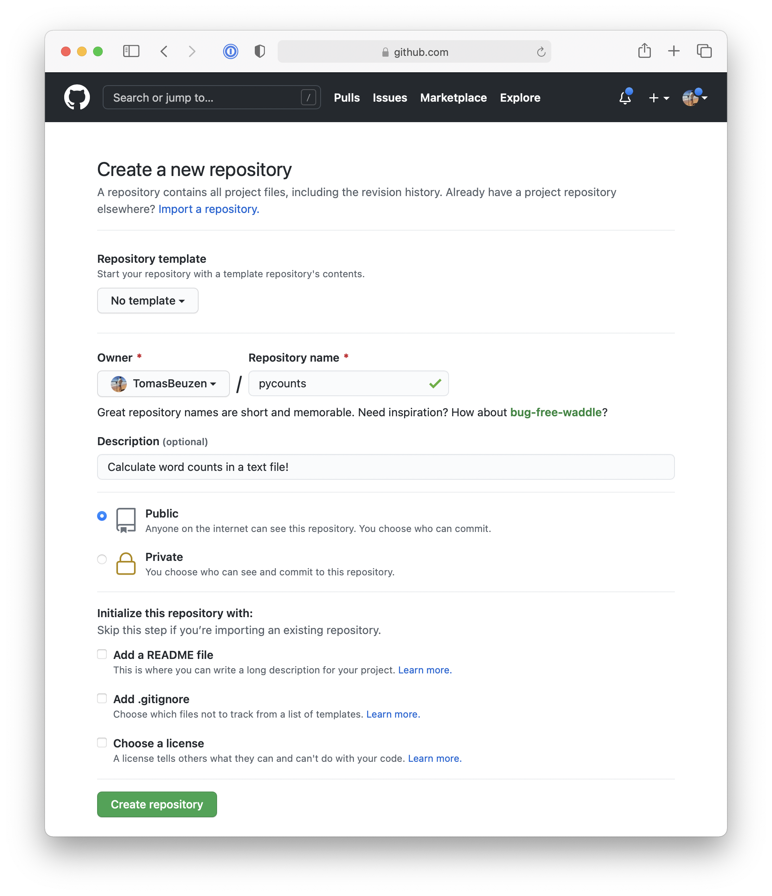
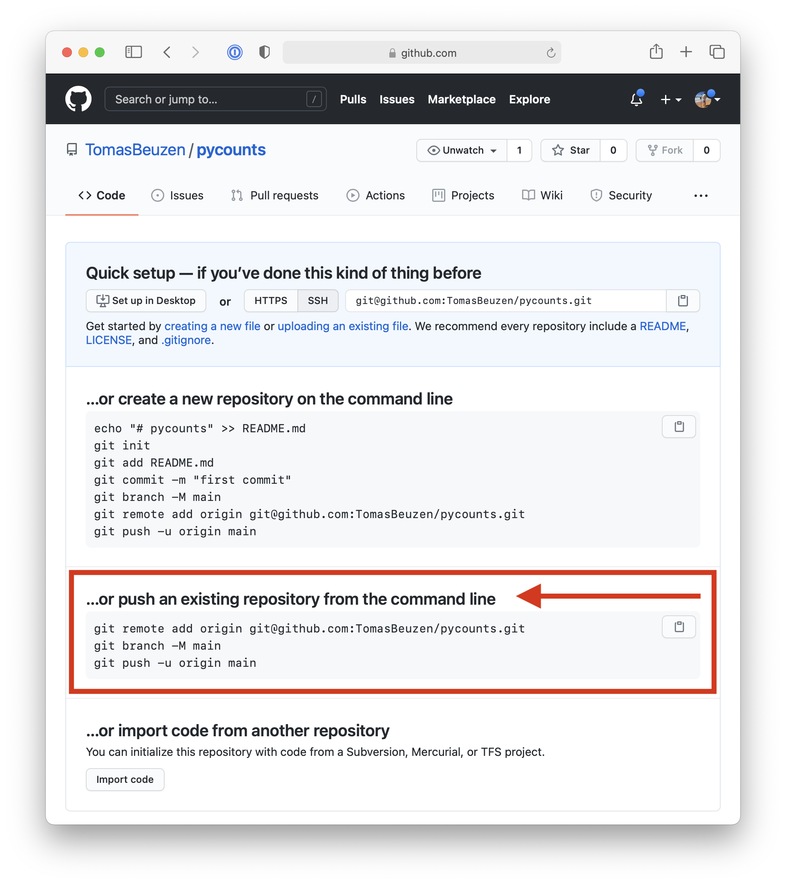
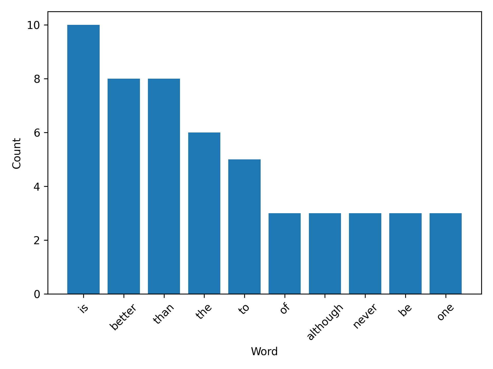
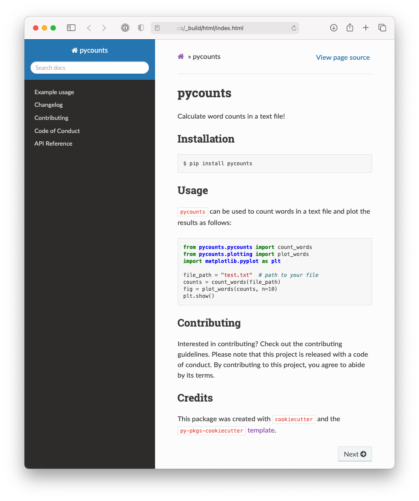
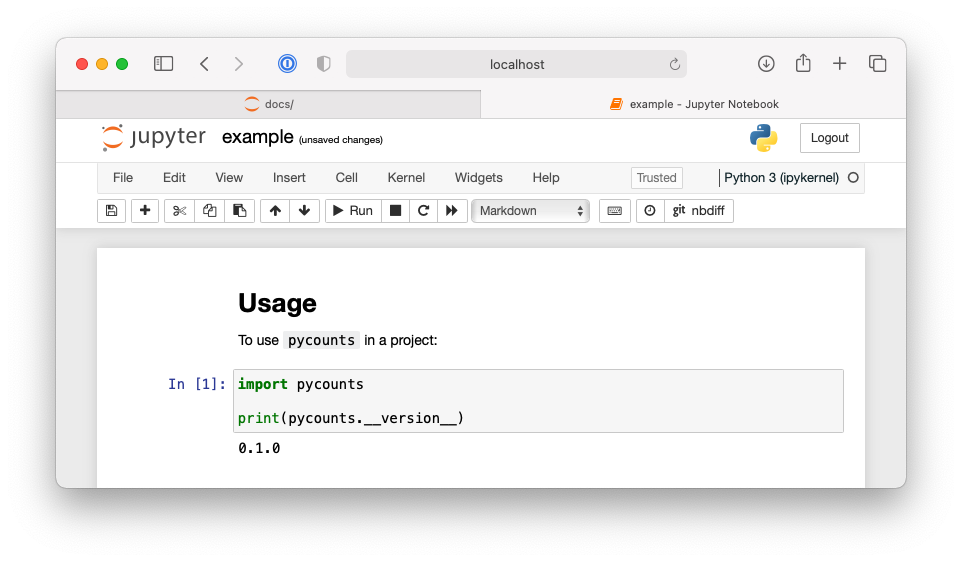
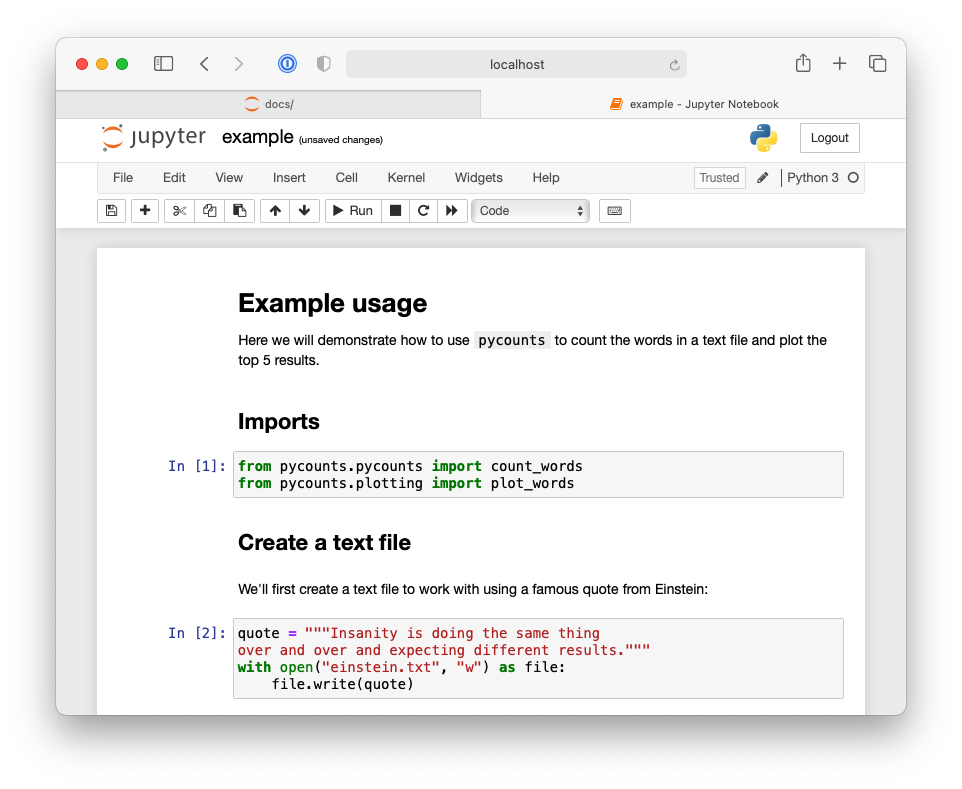
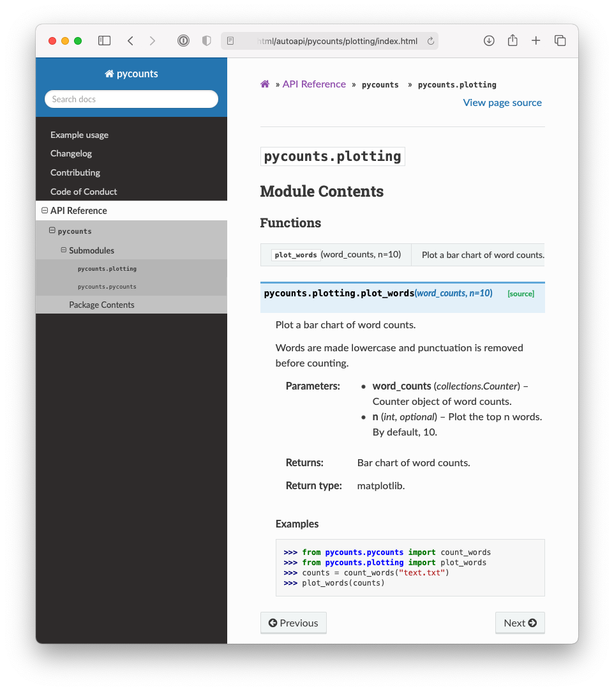
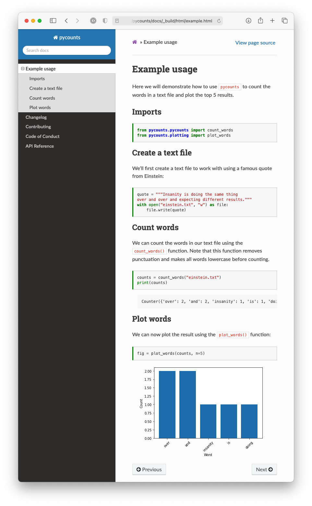
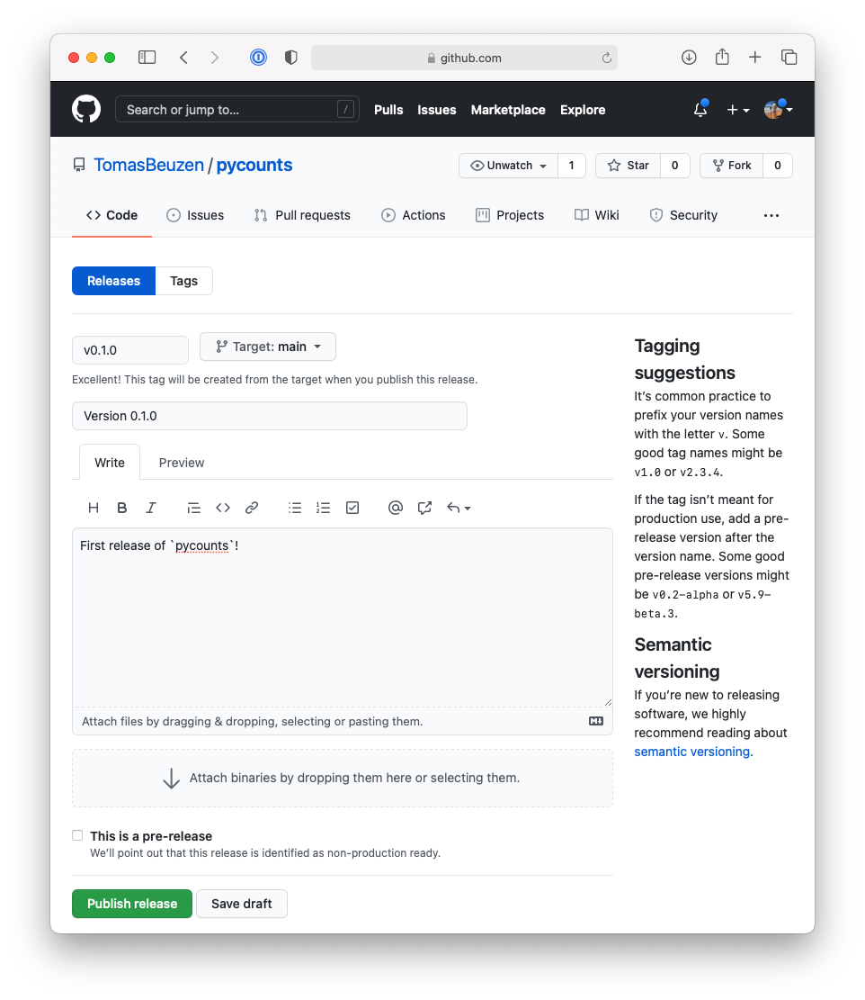
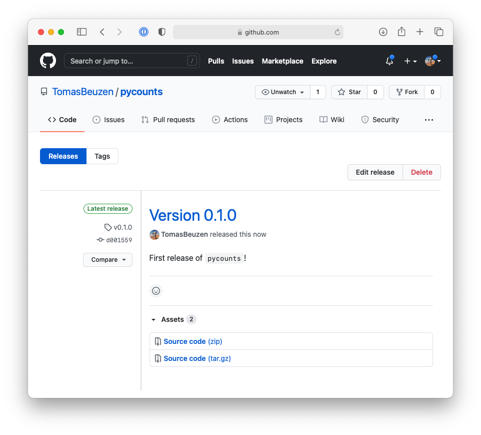

# How to package a Python
<hr>

In this chapter we will develop an entire example Python package from beginning-to-end to demonstrate the key steps involved in developing a package. This chapter forms the foundation of this book. It contains everything you need to know to create a Python package and can be used as a reference sheet when creating packages in the future. Later chapters explore each of the individual steps in the packaging process in further detail.

The example package we are going to create in this chapter will help us calculate word counts from a text file. We'll be calling it `pycounts`, and it will be useful for calculating word usage in texts such as novels, research papers, news articles, log files, and more.

## Counting words in a text file

### Developing our code

Before even thinking about making a package, we'll first develop the code we want to package up. The `pycounts` package we are going to create will help us calculate word counts from a text file. Python has a useful `Counter` object that can be used to calculate counts of a collection of elements (like a list of words) and store them in a dictionary.

We can demonstrate the functionality of `Counter` by first opening up a Python interpreter by typing `python` at the command line:

```bash
$ python
```

We can then import the `Counter` class from the `collections` module:

```python
>>> from collections import Counter
```

Now we will define and use a sample list of words to create a `Counter` object:

```python
>>> words = ["a", "happy", "hello", "a", "world", "happy"]
>>> word_counts = Counter(words)
>>> word_counts
```

```md
Counter({'a': 2, 'happy': 2, 'hello': 1, 'world': 1})
```

Note how the `Counter` object automatically calculated the count of each unique word in our input list and returned the result as a dictionary of `'word': count` pairs! Given this functionality, how can we use `Counter` to count the words in a text file? Well, we would need to load the file with Python, split it up into a list of words, and then create a `Counter` object from that list of words.

We first need a text file to help us build this workflow. "[The Zen of Python](https://www.python.org/dev/peps/pep-0020/)" is a list of nineteen aphorisms about the Python programming language, which can be viewed by running `import this` in a Python interpreter:

```python
>>> import this
```

```md
The Zen of Python, by Tim Peters

Beautiful is better than ugly.
Explicit is better than implicit.
Simple is better than complex.
...
```

Let's make a text file called *`zen.txt`* containing the "The Zen of Python" text above. Do this by manually copying the above output into a file in your current directory called *`zen.txt`* using an editor of your choice, or by running the following command at the command line:

```bash
$ python -c "import this" > zen.txt
```

>In the command above, the `-c` option allows you to pass a string for Python to execute, and the `>` directs the output of the command to a file (which in our case is called "zen.txt" and is located in the current directory).

Now that we have a text file to work with, we can go back to developing our word-counting workflow. To open *`zen.txt`* in Python, we can use the `open()` function to open the file and then the `.read()` method to read its contents as a Python string. The code below, run in a Python interpreter, saves the contents of *`zen.txt`* as a string in the variable `text`:

```python
>>> with open("zen.txt") as file:
        text = file.read()
```

Let's see what `text` looks like:

```python
>>> text
```

```md
"The Zen of Python, by Tim Peters\n\nBeautiful is better
than ugly.\nExplicit is better than implicit.\nSimple is 
better than complex.\nComplex is better than complicated
..."
```

We can see that the `text` variable is a single string, with the `\n` symbols indicating a new line in the string.

Before we split the above text into individual words for counting with `Counter`, we should lowercase all the letters and remove punctuation so that if the same word occurs multiple times with different capitalization or punctuation, it isn't treated as different words by `Counter`. For example we want "Better", "better", and "better!" to result in three counts of the word "better".

To lowercase all letters in a Python string, we can use the `.lower()` method:

```python
>>> text = text.lower()
```

To remove punctuation, we can find them in our string and replace them with nothing using the `.replace()` method. Python provides a collection of common punctuation marks in the `string` module:

```python
>>> from string import punctuation
>>> punctuation
```

```md
'!"#$%&\'()*+,-./:;<=>?@[\\]^_`{|}~'
```

We can use a `for` loop to remove each of the above punctuation marks from our `text` variable by replacing it with nothing, i.e., an empty string (`""`):

```python
>>> for p in punctuation:
        text = text.replace(p, "")
```

With punctuation removed and the letters in `text` all lowercase, we can now split it up into individual words using the `.split()` method. This method splits a string into a list of strings using spaces, newlines (`\n`), and tabs (`\t`) as separators:

```python
>>> words = text.split()
>>> words
```

```md
['the', 'zen', 'of', 'python', 'by', 'tim', 'peters', 
'beautiful', 'is', 'better', 'than', 'ugly', ...]
```

We've managed to load, pre-process, and split our *`zen.txt`* file up into individual words and can now determine the word counts by creating a `Counter` object:

```python
>>> from collections import Counter
>>> word_counts = Counter(words)
>>> word_counts
```

```md
Counter({'is': 10, 'better': 8, 'than': 8, 'the': 6, 
'to': 5, 'of': 3, 'although': 3, 'never': 3, ... })
```

### Turning our code into functions

<!-- #region -->
In **Section \@ref(developing-our-code)** we developed a workflow for counting words in a text file. But it would be a pain to run all that code every time we want to count the words in a file! To make things more efficient, let’s turn the above code into three reusable functions called `load_text()`, `clean_text()`, and `count_words()` by defining them in our Python interpreter:

>We've added a short documentation string (docstring) to each function here using triple quotes. We'll talk more about docstrings in **Section \@ref(writing-docstrings)**.

```python
>>> def load_text(input_file):
        """Load text from a text file and return as a string."""
        with open(input_file, "r") as file:
            text = file.read()
        return text
```

```python
>>> def clean_text(text):
        """Lowercase and remove punctuation from a string."""
        text = text.lower()
        for p in punctuation:
            text = text.replace(p, "")
        return text
```

```python
>>> def count_words(input_file):
        """Count unique words in a string."""
        text = load_text(input_file)
        text = clean_text(text)
        words = text.split()
        return Counter(words)
```

We can now use our word-counting functionality as follows:

```python
>>> count_words("zen.txt")
```

```md
Counter({'is': 10, 'better': 8, 'than': 8, 'the': 6, 
'to': 5, 'of': 3, 'although': 3, 'never': 3, ... })
```

Unfortunately, if you quit from the Python interpreter, the functions we just defined will be lost and you will have to define them again in new sessions.

The whole idea of a Python package is that we can store Python code, like our `load_text()`, `clean_text()`, and `count_words()` functions, in a package that we, and others, can install, `import`, and use at any time and in any project. In the remainder of this chapter, we'll work towards packaging up the code we've written into a Python package called `pycounts`.
<!-- #endregion -->

## Package structure

### A brief introduction

<!-- #region -->
To develop our `pycounts` package we first need to create an appropriate directory structure. Python packages consist of a specific directory structure typically including the following:

- A root directory with the name of the package, e.g., *`pycounts/`*;
- One or more Python modules\index{module} (files with a *.py* extension that contain Python code) in a subdirectroy *`src/pycounts/`*;
- Instructions on how to build and install the package on a computer in a file called *`pyproject.toml`*\index{pyproject.toml};
- Important documentation such as a README in the root directory, and additional documentation in a *`docs/`* subdirectory; and,
- Tests in a *`tests/`* subdirectory.

An example structure for a package called "pycounts" with two modules ("moduleA" and "moduleB") is shown below. There's a lot of files here, but don't worry; packages are usually created from pre-made templates, as we'll show in the next section. At this point, we're just getting a bird's-eye view of package structure\index{package structure}. We'll create and explore each element in this structure as we make our way through this chapter.

```md
pycounts
├── CHANGELOG.md               ┐
├── CONDUCT.md                 │
├── CONTRIBUTING.md            │
├── docs                       │ Package documentation
│   └── ...                    │
├── LICENSE                    │
├── README.md                  ┘
├── pyproject.toml             ┐ 
├── src                        │
│   └── pycounts               │ Package source code, metadata,
│       ├── __init__.py        │ and build instructions 
│       ├── moduleA.py         │
│       └── moduleB.py         ┘
└── tests                      ┐
    └── ...                    ┘ Package tests
```

\newpage

>It might be confusing to see two directories with the package's name (the root directory `pycounts/` and the subdirectory *`src/pycounts/`*, but this is how Python packages are typically set up. We'll explore this structure more in the rest of this chapter and discuss it in detail in **Chapter 4: [Package structure and distribution]**.

<!-- #endregion -->

### Creating a package structure

Most developers use a pre-made template to set up the directory structure of a Python package. We will use the `cookiecutter`\index{cookiecutter} tool (which we installed in **Section \@ref(install-packaging-software)**) to create our package structure\index{package structure} for us.

`cookiecutter` is a tool for populating a directory structure from a pre-made template. People have developed and open-sourced many `cookiecutter` templates for different projects, such as for creating Python packages, R packages, websites, and more. You can find these templates by, for example, searching an online hosting service like [GitHub](https://www.github.com). We have developed our own `py-pkgs-cookiecutter`\index{py-pkgs-cookiecutter} Python package template to support this book; it is [hosted on GitHub](https://github.com/py-pkgs/py-pkgs-cookiecutter).

To use this template to create a package directory structure, you can navigate to the directory where you want to create your package from the command line, and then run the command below. Upon executing this command you will be prompted to provide information that will be used to create your package file and directory structure. We provide an example of how to respond to these prompts below and an explanation of what they mean in Table \@ref(tab:03-prompt-table).

```bash
$ cookiecutter https://github.com/py-pkgs/py-pkgs-cookiecutter.git
```

\newpage

```md
author_name [Monty Python]: Tomas Beuzen
package_name [mypkg]: pycounts
package_short_description []: Calculate word counts in a text file!
package_version [0.1.0]: 
python_version [3.9]: 
Select open_source_license:
1 - MIT
2 - Apache License 2.0
3 - GNU General Public License v3.0
4 - Creative Commons Attribution 4.0
5 - BSD 3-Clause
6 - Proprietary
7 - None
Choose from 1, 2, 3, 4, 5, 6 [1]: 
Select include_github_actions:
1 - no
2 - ci
3 - ci+cd
Choose from 1, 2, 3 [1]:
```

Table: (\#tab:03-prompt-table) A description of the py-pkgs-cookiecutter template prompts.

|Prompt keyword|Description|
|:---  | :---  |
|`author_name`, `package_name`, `package_short_description`| These are self-explanatory. Note that we will be publishing our `pycounts` package to Python's main package index PyPI\index{PyPI}, where names must be unique. **If you plan to follow along with this tutorial you should choose a unique name for your package**. Something like `pycounts_[your intials]` might be appropriate, but you can check if a name is already taken by searching for it on PyPI. We provide guidance on choosing a good package name in **Section \@ref(package-and-module-names)**. |
|`package_version`|The version of your package. Most packages use semantic versioning\index{semantic versioning}, where a version number consists of three integers `A.B.C`. `A` is the "major" version, `B` is the "minor" version, and `C` is the "patch" version. The first version of a package usually starts at 0.1.0 and increments from there. We'll discuss versioning in **Chapter 7: [Releasing and versioning]**.|
|`python_version`|The minimum version of Python your package will support. We'll talk more about versions and constraints in **Section \@ref(dependency-version-constraints)**|
|`open_source_license`|The license\index{license} that dictates how your package can be used by others. We discuss licenses in **Section \@ref(license)**. The MIT license we chose in our example is a permissive license commonly used for open-source work. If your project will not be open source you can choose not to include a license.|
|`include_github_actions`|An option to include continuous integration and continuous deployment files for use with GitHub Actions. We'll explore these topics in **Chapter 8: [Continuous integration and deployment]**, so for now, we recommend responding `no`.|


After responding to the `py-pkgs-cookiecutter` prompts, we have a new directory called `pycounts`, full of content suitable for building a fully-featured Python package! We'll explore each element of this directory structure as we develop our `pycounts` package throughout this chapter.

\newpage

```md
pycounts
├── .readthedocs.yml           ┐
├── CHANGELOG.md               │
├── CONDUCT.md                 │
├── CONTRIBUTING.md            │
├── docs                       │
│   ├── changelog.md           │
│   ├── conduct.md             │
│   ├── conf.py                │ 
│   ├── contributing.md        │ Package documentation
│   ├── example.ipynb          │
│   ├── index.md               │
│   ├── make.bat               │
│   ├── Makefile               │
│   └── requirements.txt       │
├── LICENSE                    │
├── README.md                  ┘
├── pyproject.toml             ┐ 
├── src                        │
│   └── pycounts               │ Package source code, metadata,
│       ├── __init__.py        │ and build instructions 
│       └── pycounts.py        ┘
└── tests                      ┐
    └── test_pycounts.py       ┘ Package tests
```

## Put your package under version control

<!-- #region -->
Before continuing to develop our package it is good practice to put it under local and remote version control\index{version control}. This is not necessary for developing a package, but it is highly recommended so that you can better manage and track changes to your package over time. Version control is particularly useful if you plan on collaborating on your package with others. If you don't want to use version control, feel free to skip to **Section \@ref(packaging-your-code)**. The tools we will be using for version control in this book are Git\index{Git} and GitHub\index{GitHub} (which we set up in **Section \@ref(set-up-git-and-github)**). 

\newpage

>For this book, we assume readers have basic familiarity with Git and GitHub (or similar). To learn more about Git and GitHub, we recommend the following resources: [*Happy Git and GitHub for the useR*](https://happygitwithr.com) [@bryan2021] and [*Research Software Engineering with Python*](https://merely-useful.tech/py-rse/git-cmdline.html) [@rsep2021].

<!-- #endregion -->

### Set up local version control

To set up local version control\index{version control}, navigate to the root *`pycounts/`* directory and initialize a Git\index{Git} repository:

```bash
$ cd pycounts
$ git init
```

```md
Initialized empty Git repository in /Users/tomasbeuzen/pycounts/.git/
```

Next, we need to tell Git which files to track for version control (which will be all of them at this point) and then commit these changes locally:

```bash
$ git add .
$ git commit -m "initial package setup"
```

```md
[master (root-commit) 51795ad] initial package setup
 20 files changed, 502 insertions(+)
 create mode 100644 .gitignore
 create mode 100644 .readthedocs.yml
 create mode 100644 CHANGELOG.md
 ...
 create mode 100644 src/pycounts/__init__.py
 create mode 100644 src/pycounts/pycounts.py
 create mode 100644 tests/test_pycounts.py
```

### Set up remote version control

Now that we have set up local version control\index{version control}, we will create a repository on [GitHub](https://github.com/)\index{GitHub} and set that as the remote version control home for this project. First, we need to create a new repository on [GitHub](https://www.github.com) as demonstrated in Fig. \@ref(fig:03-set-up-github-1-fig):

```{r 03-set-up-github-1-fig, fig.cap = "Creating a new repository in GitHub.", out.width = "100%", fig.retina = 2, fig.align = "center", echo = FALSE, message = FALSE, warning = FALSE}

```

Next, select the following options when setting up your GitHub repository, as shown in Fig. \@ref(fig:03-set-up-github-2-fig): 

1. Give the GitHub repository the same name as your Python package and give it a short description.
2. You can choose to make your repository public or private — we'll be making ours public so we can share it with others.
3. Do not initialize the repository with any files (we've already created all our files locally using the `py-pkgs-cookiecutter` template).

```{r 03-set-up-github-2-fig, fig.cap = "Setting up a new repository in GitHub.", out.width = "100%", fig.retina = 2, fig.align = "center", echo = FALSE, message = FALSE, warning = FALSE}

```

Now, use the commands shown on GitHub, and outlined in Fig. \@ref(fig:03-set-up-github-3-fig), to link your local and remote repositories and push your local content to GitHub:

```{r 03-set-up-github-3-fig, fig.cap = "Instructions on how to link local and remote version control repositories.", out.width = "100%", fig.retina = 2, fig.align = "center", echo = FALSE, message = FALSE, warning = FALSE}

```

\newpage
>The commands below should be specific to your GitHub username and the name of your Python package. They use SSH authentication to connect to GitHub which you will need to set up by following the steps in the official GitHub [documentation](https://docs.github.com/en/authentication/connecting-to-github-with-ssh).

```bash
$ git remote add origin git@github.com:TomasBeuzen/pycounts.git
$ git branch -M main
$ git push -u origin main
```

```md
Enumerating objects: 26, done.
Counting objects: 100% (26/26), done.
Delta compression using up to 8 threads
Compressing objects: 100% (19/19), done.
Writing objects: 100% (26/26), 8.03 KiB | 4.01 MiB/s, done.
Total 26 (delta 0), reused 0 (delta 0)
To github.com:TomasBeuzen/pycounts.git
 * [new branch]      main -> main
Branch 'main' set up to track remote branch 'main' from 'origin'.
```

## Packaging your code

We now have our `pycounts` package structure\index{package structure} set up, and are ready to populate our package with the `load_text()`, `clean_text()` and `count_words()` functions we developed at the beginning of the chapter in **Section \@ref(turning-our-code-into-functions)**. Where should we put these functions? Let's review the structure of our package:

\newpage

```md
pycounts
├── .readthedocs.yml
├── CHANGELOG.md
├── CONDUCT.md
├── CONTRIBUTING.md
├── docs
│   └── ...
├── LICENSE
├── pyproject.toml
├── README.md
├── src
│   └── pycounts
│       ├── __init__.py
│       └── pycounts.py
└── tests
    └── ...
```

The Python code for our package should live in modules\index{module} in the *`src/pycounts/`* directory. The `py-pkgs-cookiecutter` template already created a Python module for us to put our code in called *`src/pycounts/pycounts.py`* (note that this module can be named anything, but it is common for a module to share the name of the package). We'll copy the functions we created in **Section \@ref(turning-our-code-into-functions)** to the module *`src/pycounts/pycounts.py`* now. Our functions depends on `collections.Counter` and `string.punctuation`, so we also need to import those at the top of the file. Here's what *`src/pycounts/pycounts.py`* should now look like:

\newpage

```python
from collections import Counter
from string import punctuation

def load_text(input_file):
    """Load text from a text file and return as a string."""
    with open(input_file, "r") as file:
        text = file.read()
    return text
    
def clean_text(text):
    """Lowercase and remove punctuation from a string."""
    text = text.lower()
    for p in punctuation:
        text = text.replace(p, "")
    return text
    
def count_words(input_file):
    """Count unique words in a string."""
    text = load_text(input_file)
    text = clean_text(text)
    words = text.split()
    return Counter(words)
```

## Test drive your package code

### Create a virtual environment

Before we install and test our package, it is highly recommended to set up a virtual environment\index{virtual environment}. As discussed previously in **Section \@ref(installing-python)**, a virtual environment provides a safe and isolated space to develop and install packages. If you don't want to use a virtual environment, feel free to skip to **Section \@ref(installing-your-package)**.

There are several options available when it comes to creating and managing virtual environments (e.g., `conda`\index{conda} or `venv`). We will use `conda` (which we installed in **Section \@ref(installing-python)**) because it is a simple, commonly used, and effective tool for managing virtual environments.

To use `conda` to create a new virtual environment called `pycounts` that contains Python, run the following in your terminal:

```bash
$ conda create --name pycounts python=3.9 -y
```

>We are specifying `python=3.9` because that is the minimum version of Python we specified that our package will support in **Section \@ref(creating-a-package-structure)**.

To use this new environment for developing and installing software we need to "activate" it:

```bash
$ conda activate pycounts
```

In most command lines, `conda` will add a prefix like `(pycounts)` to your command-line prompt to indicate which environment you are working in. Anytime you wish to work on your package, you should activate its virtual environment. You can view the packages currently installed in a `conda` environment using the command `conda list`, and you can exit a `conda` virtual environment using `conda deactivate`.

>`poetry`, the packaging tool we'll use to develop our package later in this chapter, also supports [virtual environment management](https://python-poetry.org/docs/managing-environments/) without the need for `conda`. However, we find `conda` to be a more intuitive and explicit environment manager, which is why we advocate for it in this book. 


### Installing your package

We have our package structure set up and we've populated it with our Python code. How do we install and use our package? There are several tools available to develop installable Python packages\index{installable Python package}. The most common are `poetry`\index{poetry}, `flit`\index{flit}, and `setuptools`\index{setuptools}, which we compare in **Section \@ref(packaging-tools)**. In this book, we will be using `poetry` (which we installed in **Section \@ref(install-packaging-software)**); it is a modern packaging tool that provides simple and efficient commands to develop, install, and distribute Python packages.

In a `poetry`-managed package, the *`pyproject.toml`*\index{pyproject.toml} file stores all the metadata and install instructions for the package. The *`pyproject.toml`* that the `py-pkgs-cookiecutter` created for our `pycounts` package looks like this:

```toml
[tool.poetry]
name = "pycounts"
version = "0.1.0"
description = "Calculate word counts in a text file."
authors = ["Tomas Beuzen"]
license = "MIT"
readme = "README.md"

[tool.poetry.dependencies]
python = "^3.9"

[tool.poetry.dev-dependencies]

[build-system]
requires = ["poetry-core>=1.0.0"]
build-backend = "poetry.core.masonry.api"
```

Table \@ref(tab:03-toml-table) provides a brief description of each of the headings in that file (called "tables" in TOML file jargon).

Table: (\#tab:03-toml-table) A description of the tables in the pyproject.toml.

|TOML table|Description|
|:---  | :---  |
|`[tool.poetry]`|Defines package metadata. The `name`, `version`, `description`, and `authors` of the package are required.|
|`[tool.poetry.dependencies]`|Identifies dependencies\index{dependency} of a package — that is, software that the package depends on. Our `pycounts` package only depends on Python 3.9 or higher, but we'll add other dependencies to our package later in this chapter.|
|`[tool.poetry.dev-dependencies]`|Identifies development dependencies\index{dependency!development dependency} of a package — dependencies required for development purposes, such as running tests or building documentation. We'll add development dependencies to our `pycounts` package later in this chapter.|
|`[build-system]`|Identifies the build tools required to build your package. We'll talk more about this in **Section \@ref(building-and-distributing-your-package)**.|


<!-- #region -->
With our *`pyproject.toml`* file already set up for us by the `py-pkgs-cookiecutter` template, we can use `poetry` to install our package using the command `poetry install` at the command line from the root package directory:

```bash
$ poetry install
```

```md
Updating dependencies
Resolving dependencies... (0.1s)

Writing lock file

Installing the current project: pycounts (0.1.0)
```

>When you run `poetry install`, `poetry` creates a *`poetry.lock`* file, which contains a record of all the dependencies you've installed while developing your package. For anyone else working on your project (including you in the future), running `poetry install` installs dependencies from *`poetry.lock`* to ensure that they have the same versions of dependencies that you did when developing the package. We won't be focusing on *`poetry.lock`* in this book, but it can be a helpful development tool, which you can read more about in the `poetry` [documentation](https://python-poetry.org/docs/basic-usage/#installing-dependencies). 

With our package installed, we can now `import` and use it in a Python session. Before we do that, we need a text file to test our package on. Feel free to use any text file, but we'll create the same "Zen of Python" text file we used earlier in the chapter by running the following at the command line:

```bash
$ python -c "import this" > zen.txt
```

Now we can open a Python interpreter and `import`\index{import} and use the `count_words()` function from our `pycounts` module with the following code:

```python
>>> from pycounts.pycounts import count_words
>>> count_words("zen.txt")
```

```md
Counter({'is': 10, 'better': 8, 'than': 8, 'the': 6, 
'to': 5, 'of': 3, 'although': 3, 'never': 3, ... })
```

Looks like everything is working! We have now created and installed a simple Python package! You can now use this Python package in any project you wish (if using virtual environments, you'll need to `poetry install` the package in them before it can be used).

`poetry install` actually installs packages in "editable mode", which means that it installs a link to your package's code on your computer (rather than installing it as a independent piece of software). Editable installs\index{editable install} are commonly used by developers because it means that any edits made to the package's source code are immediately available the next time it is imported, without having to `poetry install` again. We'll talk more about installing packages in **Section \@ref(building-and-distributing-your-package)**.

In the next section, we'll show how to add code to our package that depends on another package. But for those using version control, it's a good idea to commit the changes we've made to *`src/pycounts/pycounts.py`* to local and remote version control\index{version control}:

```bash
$ git add src/pycounts/pycounts.py
$ git commit -m "feat: add word counting functions"
$ git push
```

\newpage

>In this book, we use the [Angular style](https://github.com/angular/angular.js/blob/master/DEVELOPERS.md#-git-commit-guidelines) for Git commit messages. We'll talk about this style more in **Section \@ref(automatic-version-bumping)**, but our commit messages have the form "type: subject", where "type" indicates the kind of change being made and "subject" contains a description of the change. We'll be using the following "types" for our commits:
>
>- "build": indicates a change to the build system or external dependencies.
- "docs": indicates a change to documentation.
- "feat": indicates a new feature being added to the code base.
- "fix": indicates a bug fix.
- "test": indicates changes to testing framework.

<!-- #endregion -->

## Adding dependencies to your package

<!-- #region -->
Let's now add a new function to our package that can plot a bar chart of the top `n` words in a `Counter` object of word counts. Imagine we've come up with the following `plot_words()` function that does this. The function uses the convenient `.most_common()` method of the `Counter` object to return a list of tuples of the top `n` words counts in the format `(word, count)`. It then uses the Python function `zip(*...)` to unpack that list of tuples into two individual lists, `word` and `count`. Finally, the `matplotlib`  [@hunter2007] package is used to plot the result (`plt.bar(...)`), which looks like Fig. \@ref(fig:03-matplotlib-figure-fig).

>If this code is not familiar to you, don't worry! The code itself is not overly important to our discussion of packaging. You just need to know that we are adding some new code to our package that depends on the `matplotlib` package.

\newpage

```python
import matplotlib.pyplot as plt

def plot_words(word_counts, n=10):
    """Plot a bar chart of word counts."""
    top_n_words = word_counts.most_common(n)
    word, count = zip(*top_n_words)
    fig = plt.bar(range(n), count)
    plt.xticks(range(n), labels=word, rotation=45)
    plt.xlabel("Word")
    plt.ylabel("Count")
    return fig
```

```{r 03-matplotlib-figure-fig, fig.cap = "Example figure created from the plotting function.", out.width = "80%", fig.retina = 2, fig.align = "center", echo = FALSE, message = FALSE, warning = FALSE}

```

Where should we put this function in our package? You could certainly add all your package code into a single module (e.g., *`src/pycounts/pycounts.py`*), but as you add functionality to your package that module will quickly become overcrowded and hard to manage. Instead, as you write more code, it's a good idea to organize it into multiple, logical modules. With that in mind, we'll create a new module called *`src/pycounts/plotting.py`* to house our plotting function `plot_words()`. Create that new module now in an editor of your choice.

Your package structure\index{package structure} should now look like this:

```md
pycounts
├── .readthedocs.yml
├── CHANGELOG.md
├── CONDUCT.md
├── CONTRIBUTING.md
├── docs
│   └── ...
├── LICENSE
├── poetry.lock
├── pyproject.toml
├── README.md
├── src
│   └── pycounts
│       ├── __init__.py
│       ├── plotting.py  <--------
│       └── pycounts.py
└── tests
    └── ...
```

Open *`src/pycounts/plotting.py`* and add the `plot_words()` code from above (don't forget to add the `import matplotlib.pyplot as plt` at the top of the module).

After doing this, if we tried to `import` our new function in a Python interpreter we'd get an error:

>If using a `conda` virtual environment, make sure that environment is active by running `conda activate pycounts`, before using or working on your package.

```python
>>> from pycounts.plotting import plot_words
```

```md
ModuleNotFoundError: No module named 'matplotlib'
```

This is because `matplotlib` is not part of the standard Python library; we need to install it and add it as a dependency\index{dependency} of our `pycounts` package. We can do this with `poetry` using the command `poetry add`. This command will install the specified dependency into the current virtual environment\index{virtual environment} and will update the `[tool.poetry.dependencies]` section of the *`pyproject.toml`*\index{pyproject.toml} file:

```bash
$ poetry add matplotlib
``` 

```md
Using version ^3.4.3 for matplotlib

Updating dependencies
Resolving dependencies...

Writing lock file

Package operations: 8 installs, 0 updates, 0 removals

  • Installing six (1.16.0)
  • Installing cycler (0.10.0)
  • Installing kiwisolver (1.3.1)
  • Installing numpy (1.21.1)
  • Installing pillow (8.3.1)
  • Installing pyparsing (2.4.7)
  • Installing python-dateutil (2.8.2)
  • Installing matplotlib (3.4.3)
```

If you open *`pyproject.toml`* file, you should now see `matplotlib` listed as a dependency under the `[tool.poetry.dependencies]` section (which previously only contained Python 3.9 as a dependency, as we saw in **Section \@ref(installing-your-package)**):

```toml
[tool.poetry.dependencies]
python = "^3.9"
matplotlib = "^3.4.3"
```

We can now use our package in a Python interpreter as follows (be sure that the *`zen.txt`* file we created earlier is in the current directory if you're running the code below):

```python
>>> from pycounts.pycounts import count_words
>>> from pycounts.plotting import plot_words
>>> counts = count_words("zen.txt")
>>> fig = plot_words(counts, 10)
```

If running the above Python code in an interactive IPython shell or Jupyter Notebook, the plot will be displayed automatically. If you're running from the Python interpreter, you'll need to run the `matplotlib` command `plt.show()` to display the plot, as shown below:

```python
>>> import matplotlib.pyplot as plt
>>> plt.show()
```

We've made some important changes to our package in this section by adding a new module and a dependency. Those using version control\index{version control} should commit these changes:

```bash
$ git add src/pycounts/plotting.py
$ git commit -m "feat: add plotting module"
$ git add pyproject.toml poetry.lock
$ git commit -m "build: add matplotlib as a dependency"
$ git push
```
<!-- #endregion -->

### Dependency version constraints

Versioning is the practice of assigning a unique identifier to unique releases of a package. For example, [semantic versioning](https://semver.org)\index{semantic versioning} is a common versioning system that consists of three integers `A.B.C`. `A` is the "major" version, `B` is the "minor" version, and `C` is the "patch" version identifier. Package versions usually starts at 0.1.0 and positively increment the major, minor, and patch numbers from there, depending on the kind of changes made to the package over time.

We'll talk more about versioning in **Chapter 7: [Releasing and versioning]**, but what's important to know now is that we typically constrain the required version number(s) of our package's dependencies, to ensure we're using versions that are up-to-date and contain the functionality we need. You may have noticed `poetry` prepended a caret (^) operator to the dependency versions in our *`pyproject.toml`* file, under the `[tool.poetry.dependencies]` section:

```toml
[tool.poetry.dependencies]
python = "^3.9"
matplotlib = "^3.4.3"
```

The caret operator is short-hand for "requires this or any higher version that does not modify the left-most non-zero version digit". For example, our package depends on any Python version >=3.9.0 and <4.0.0. Thus, examples of valid versions include 3.9.1 and 3.12.0, but 4.0.1 would be invalid. There are many other syntaxes that can be used to specify version constraints in different ways, as you can read more about in the `poetry` [documentation](https://python-poetry.org/docs/dependency-specification). So why do we care about this? The caret operator enforces an upper cap on the dependency versions our package requires. A problem with this approach is that it forces anyone depending on your package to specify the same constraints and can thus make it difficult to add and resolve dependencies.

This problem is best shown by example. Version 1.21.5 of the popular `numpy` [@harris2020array] package had bound version constraints on Python, requiring version >=3.7 and <3.11 (see the [source code](https://github.com/numpy/numpy/blob/c3d0a09342c08c466984654bc4738af595fba896/setup.py#L409)). Watch what happens if we try to add this version of `numpy` to our `pycounts` package (we use the argument `--dry-run` to show what would happen here without actually executing anything):

```bash
$ poetry add numpy=1.21.5 --dry-run
``` 

```md
Updating dependencies
Resolving dependencies... (0.1s)

SolverProblemError

The current project's Python requirement (>=3.9,<4.0) is not compatible 
with some of the required packages Python requirement:
    - numpy requires Python >=3.7,<3.11, so it will not be satisfied 
      for Python >=3.11,<4.0
```

The problem here is that our package currently supports Python versions ^3.9 (i.e., >=3.9.0 and <4.0.0), so if we released it, a user with Python 3.12.0 would technically be able to install it. However, `numpy` 1.21.5 only supports >=3.7 and <3.11 which would not be compatible with Python 3.12.0 (or any version >=3.11). As a result of this inconsistency, `poetry` refuses to add `numpy` 1.21.5 as a dependency of our package. To add it, we have three main choices:

1. Change the Python version constraints of our package to >=3.7 and <3.11.
2. Wait for a version of `numpy` that is compatible with our package's Python constraints.
3. Manually specify the versions of Python for which the dependency can be installed, e.g.: `poetry add numpy=1.21.5 --python ">=3.7, <3.11"`.  

None of these options is really ideal, especially if your package has a large number of dependencies with different bound version constraints. However, a simple way this issue could be resolved is if `numpy` 1.21.5 did not having an upper cap on the Python version required. In fact, in the subsequent minor version release of `numpy`, 1.22.0, the upper version cap on Python was removed, requiring only version >=3.8 (see the [source code](https://github.com/numpy/numpy/blob/4adc87dff15a247e417d50f10cc4def8e1c17a03/setup.py#L410)), which we would be able to successfully add to our package:

```bash
$ poetry add numpy=1.22.0 --dry-run
``` 

Ultimately, version constraints are an important issue that can affect the usability of your package. If you intend to share your package, having an upper cap on dependency versions can make it very difficult for other developers to use your package as a dependency in their own projects. At the time of writing, much of the packaging community, including the [Python Packaging Authority](https://github.com/pypa/packaging.python.org/pull/850), generally recommend not using an upper cap on version constraints unless absolutely necessary. As a result, we recommend specifying version constraints without an upper cap by manually changing `poetry`'s default caret operator (^) to a greater-than-or-equal-to sign (>=). For example, we will change the `[tool.poetry.dependencies]` section of our *`pyproject.toml`* file as follows:

```toml
[tool.poetry.dependencies]
python = ">=3.9"
matplotlib = ">=3.4.3"
```

You can read more about the issues around version constraints, as well as examples where they might actually be valid, in Henry Schreiner's excellent [blog post](https://iscinumpy.dev/post/bound-version-constraints/). Those using version control should commit this import change we've made to our package:

```bash
$ git add pyproject.toml
$ git commit -m "build: remove upper bound on dependency versions"
$ git push
```

## Testing your package

### Writing tests

At this point we have developed a package that can count words in a text file and plot the results. But how can we be certain that our package works correctly and produces reliable results?

One thing we can do is write tests\index{tests} for our package that check the package is working as expected. This is particularly important if you intend to share your package with others (you don't want to share code that doesn't work!). But even if you don't intend to share your package, writing tests can still be helpful to catch errors in your code and to write new code without breaking any tried-and-tested existing functionality. If you don't want to write to tests for your package feel free to skip to **Section \@ref(package-documentation)**.

Many of us already conduct informal tests of our code by running it a few times in a Python session to see if it's working as we expect, and if not, changing the code and repeating the process. This is called "manual testing" or "exploratory testing". However, when writing software, it's preferable to define your tests in a more formal and reproducible way.

Tests in Python are often written with the `assert`\index{tests!assert} statement. `assert` checks the truth of an expression; if the expression is true, Python does nothing and continues running, but if it's false, the code terminates and shows a user-defined error message. For example, consider running the follow code in a Python interpreter:

```python
>>> ages = [32, 19, 9, 75]
>>> for age in ages:
>>>     assert age >= 18, "Person is younger than 18!"
>>>     print("Age verified!")
```

```md
Age verified!
Age verified!
Traceback (most recent call last):
  File "<stdin>", line 2, in <module>
AssertionError: Person is younger than 18!
```

Note how the first two "ages" (32 and 19) are verified, with an "Age verified!" message printed to screen. But the third age of 9 fails the `assert`, so an error message is raised and the program terminates before checking the last age of 75.

Using the `assert` statement, let's write a test for the `count_words()` function of our `pycounts` package. There are different kinds of tests used to test software (unit tests, integration tests, regression tests, etc.); we discuss these in **Chapter 5: [Testing]**. For now, we'll write a unit test\index{tests!unit test}. Unit tests evaluate a single "unit" of software, such as a Python function, to check that it produces an expected result. A unit test consists of:

1. Some data to test the code with (called a "*fixture\index{tests!fixture}*"). The fixture is typically a small or simple version of the data the function will typically process.
2. The *actual* result that the code produces given the fixture.
3. The *expected* result of the test, which is compared to the *actual* result using an `assert` statement.

The unit test we are going to write will `assert` that the `count_words()` function produces an expected result given a certain fixture. We'll use the following quote from Albert Einstein as our fixture:

>*"Insanity is doing the same thing over and over and expecting different results."*

The *actual* result is the result `count_words()` outputs when we input this fixture. We can get the *expected* result by manually counting the words in the quote (ignoring capitalization and punctuation):

```python
einstein_counts = {'insanity': 1, 'is': 1, 'doing': 1, 
                   'the': 1, 'same': 1, 'thing': 1, 
                   'over': 2, 'and': 2, 'expecting': 1,
                   'different': 1, 'results': 1}
```

To write our unit test in Python code, let's first create a text file containing the Einstein quote to use as our fixture. We'll add it to the *`tests/`* directory of our package as a file called *`einstein.txt`* — you can make the file manually, or you can create it from a Python session started in the root package directory using the following code:

```python
>>> quote = "Insanity is doing the same thing over and over and \
             expecting different results."
>>> with open("tests/einstein.txt", "w") as file:
        file.write(quote)
```

Now, a unit test for our `count_words()` function would look as below:

```python
>>> from pycounts.pycounts import count_words
>>> from collections import Counter
>>> expected = Counter({'insanity': 1, 'is': 1, 'doing': 1, 
                        'the': 1, 'same': 1, 'thing': 1, 
                        'over': 2, 'and': 2, 'expecting': 1,
                        'different': 1, 'results': 1})
>>> actual = count_words("tests/einstein.txt")
>>> assert actual == expected, "Einstein quote counted incorrectly!"
```

If the above code runs without error, our `count_words()` function is working, at least to our test specifications. In the next section, we'll discuss how we can make this testing process more efficient.

### Running tests

<!-- #region -->
It would be tedious and inefficient to manually write and execute unit tests\index{tests} for your package's code like we did above. Instead, it's common to use a "testing framework" to automatically run our tests for us. `pytest`\index{tests!pytest} is the most common test framework\index{tests!test framework} used for Python packages. To use `pytest`:

1. Tests are defined as functions prefixed with `test_` and contain one or more statements that `assert` code produces an expected result.
2. Tests are put in files of the form *`test_*.py`* or *`*_test.py`*, and are usually placed in a directory called *`tests/`* in a package's root.
3. Tests can be executed using the command `pytest` at the command line and pointing it to the directory your tests live in (i.e., `pytest tests/`). `pytest` will find all files of the form *`test_*.py`* or *`*_test.py`* in that directory and its sub-directories, and execute any functions with names prefixed with `test_`.

The `py-pkgs-cookiecutter`\index{py-pkgs-cookiecutter} created a *`tests/`* directory and a module called *`test_pycounts.py`* for us to put our tests in:

\newpage

```md
pycounts
├── CHANGELOG.md
├── CONDUCT.md
├── CONTRIBUTING.md
├── docs
│   └── ...
├── LICENSE
├── poetry.lock
├── pyproject.toml
├── README.md
├── src
│   └── ...
└── tests                 <--------
    ├── einstein.txt      <--------
    └── test_pycounts.py  <--------
```

>We created the file *`tests/einstein.txt`* ourselves in **Section \@ref(writing-tests)**, it was not created by the `py-pkgs-cookiecutter`.

As mentioned above, `pytest` tests are written as functions prefixed with `test_` and which contain one or more `assert` statements that check some code functionality. Based on this format, let's add the unit test we created in **Section \@ref(writing-tests)** as a test function to *`tests/test_pycounts.py`* using the below Python code:

```python
from pycounts.pycounts import count_words
from collections import Counter

def test_count_words():
    """Test word counting from a file."""
    expected = Counter({'insanity': 1, 'is': 1, 'doing': 1, 
                        'the': 1, 'same': 1, 'thing': 1, 
                        'over': 2, 'and': 2, 'expecting': 1,
                        'different': 1, 'results': 1})
    actual = count_words("tests/einstein.txt")
    assert actual == expected, "Einstein quote counted incorrectly!"
```

\newpage

Before we can use `pytest` to run our test for us we need to add it as a development dependency\index{dependency!development dependency} of our package using the command `poetry add --dev`. A development dependency is a package that is not required by a user to use your package but is required for development purposes (like testing):

>If using a `conda` virtual environment, make sure that environment is active by running `conda activate pycounts`, before using or working on your package.

```bash
$ poetry add --dev pytest
```

If you look in the *`pyproject.toml`* file you will see that `pytest` gets added under the `[tool.poetry.dev-dependencies]` section (which was previously empty, as we saw in **Section \@ref(installing-your-package)**):

```toml
[tool.poetry.dev-dependencies]
pytest = "^6.2.5"
```

To use `pytest` to run our test we can use the following command from our root package directory:

```bash
$ pytest tests/
```

```md
========================= test session starts =========================
...
collected 1 item                                                                                            

tests/test_pycounts.py .                                         [100%]

========================== 1 passed in 0.01s ==========================
```

\newpage

>If you're not developing your package in a `conda` virtual environment, `poetry` will automatically create a virtual environment for you using a tool called `venv` (read more in the [documentation](https://python-poetry.org/docs/managing-environments/)). You'll need to tell `poetry` to use this environment by prepending any command you run with `poetry run`, like: `poetry run pytest tests/`. 

From the `pytest` output we can see that our test passed! At this point, we could add more tests for our package by writing more `test_*` functions. But we'll do this in **Chapter 5: [Testing]**. Typically you want to write enough tests to check all the core code of your package. We'll show how you can calculate how much of your package's code your tests actually check in the next section.
<!-- #endregion -->

### Code coverage

A good test suite will contain tests that check as much of your package's code as possible. How much of your code your tests actually use is called "code coverage\index{code coverage}". The simplest and most intuitive measure of code coverage is line coverage\index{code coverage!line coverage}. It is the proportion of lines of your package's code that are executed by your tests\index{tests}:

$$
  \text{coverage} = \frac{\text{lines executed}}{\text{total lines}} * 100\%
$$

There is a useful extension to `pytest`\index{tests!pytest} called `pytest-cov`\index{tests!pytest-cov}, which we can use to calculate coverage. First, we'll use `poetry` to add `pytest-cov` as a development dependency\index{dependency!development dependency} of our `pycounts` package:

```bash
$ poetry add --dev pytest-cov
```

We can calculate the line coverage of our tests by running the following command, which tells `pytest-cov` to calculate the coverage our tests have of our `pycounts` package:

```bash
$ pytest tests/ --cov=pycounts
```

\newpage

```md
========================= test session starts =========================
...

Name                       Stmts   Miss  Cover
----------------------------------------------
src/pycounts/__init__.py       2      0   100%
src/pycounts/plotting.py       9      9     0%
src/pycounts/pycounts.py      16      0   100%
----------------------------------------------
TOTAL                         27      9    67%

========================== 1 passed in 0.02s ==========================
```

In the output above, `Stmts` is how many lines are in a module, `Miss` is how many lines were not executed during your tests, and `Cover` is the percentage of lines covered by your tests. From the above output, we can see that our tests currently don't cover any of the lines in the `pycounts.plotting` module. We'll write more tests for our package, and discuss more advanced methods of testing and calculating code coverage in **Chapter 5: [Testing]**.

For those using version control, commit the changes we've made to our packages tests to local and remote version control\index{version control}:

```bash
$ git add pyproject.toml poetry.lock
$ git commit -m "build: add pytest and pytest-cov as dev dependencies"
$ git add tests/*
$ git commit -m "test: add unit test for count_words"
$ git push
```

## Package documentation

Documentation\index{documentation} describing what your package does and how to use it is invaluable for the users of your package (including yourself). The amount of documentation needed to support a package varies depending on its complexity and the intended audience. A typical package contains documentation in various parts of its directory structure\index{package structure}, as shown in Table \@ref(tab:03-documentation-table). There's a lot here but don't worry, we'll show how to efficiently write all these pieces of documentation in the following sections.

Table: (\#tab:03-documentation-table) Typical Python package documentation.

|Documentation|Typical location|Description|
|:---    | :--- | :---      |
|README\index{documentation!README}|Root |Provides high-level information about the package, e.g., what it does, how to install it, and how to use it.|
|License\index{documentation!license}|Root |Explains who owns the copyright to your package source and how it can be used and shared.|
|Contributing guidelines\index{documentation!contributing guidelines}|Root |Explains how to contribute to the project.|
|Code of conduct\index{documentation!code of conduct}|Root |Defines standards for how to appropriately engage with and contribute to the project.|
|Changelog\index{documentation!changelog}|Root |A chronologically ordered list of notable changes to the package over time, usually organized by version.|
|Docstrings\index{docstring}| *.py* files |Text appearing as the first statement in a function, method, class, or module in Python that describes what the code does and how to use it. Accessible to users via the `help()` command.|
|Examples|*`docs/`* |Step-by-step, tutorial-like examples showing how the package works in more detail.|
|Application programming interface\index{application programming interface} (API) reference|*`docs/`* | An organized list of the user-facing functionality of your package (i.e., functions, classes, etc.) along with a short description of what they do and how to use them. Typically created automatically from your package's docstrings using the `sphinx` tool as we'll discuss in **Section \@ref(building-documentation)**.|


Our `pycounts` package is a good example of a package with all this documentation:

```md
pycounts
├── .readthedocs.yml
├── CHANGELOG.md
├── CONDUCT.md
├── CONTRIBUTING.md
├── docs
│   ├── example.ipynb 
│   └── ...
├── LICENSE
├── README.md
├── poetry.lock
├── pyproject.toml
├── src
│   └── ...
└── tests
    └── ...
```

The typical workflow for documenting a Python package consists of three steps:

1. **Write documentation**: manually write documentation in a plain-text format.
2. **Build documentation\index{documentation!build documentation}**: compile and render documentation into HTML using the documentation generator `sphinx`\index{sphinx}.
3. **Host documentation\index{documentation!host documentation} online**: share the built documentation online so it can be easily accessed by anyone with an internet connection, using a free service like [Read the Docs](https://readthedocs.org)\index{Read the Docs} or [GitHub Pages](https://pages.github.com)\index{GitHub Pages}.

In this section, we will walk through each of these steps in detail.

### Writing documentation

<!-- #region -->
Python package documentation\index{documentation} is typically written in a plain-text markup format such as [Markdown](https://en.wikipedia.org/wiki/Markdown)\index{Markdown} (*.md*) or [reStructuredText](https://www.sphinx-doc.org/en/master/usage/restructuredtext/index.html)\index{reStructuredText} (*.rst*). With a plain-text markup language, documents are written in plain-text and a special syntax is used to specify how the text should be formatted when it is rendered by a suitable tool. We'll show an example of this below, but we'll be using the Markdown language in this book because it is widely used, and we feel it has a less verbose and more intuitive syntax than reStructuredText (check out the [Markdown Guide](https://www.markdownguide.org) to learn more about Markdown syntax).

Most developers create packages from templates which pre-populate a lot of the standard package documentation for them. For example, as we saw in **Section \@ref(package-documentation)**, the `py-pkgs-cookiecutter`\index{py-pkgs-cookiecutter} template we used to create our `pycounts` package created a *`LICENSE`*, *`CHANGELOG.md`*, contributing guidelines (*`CONTRIBUTING.md`*), and code of conduct (*`CONDUCT.md`*) for us already!

A *`README.md`* was also created, but it contains a "Usage" section, which is currently empty. Now that we've developed the basic functionality of `pycounts`, we can fill that section with Markdown text as follows:

>In the Markdown text below, the following syntax is used:
>
>- Headers are denoted with number signs (\#). The number of number signs corresponds to the heading level.
- Code blocks are bounded by three back-ticks. A programming language can succeed the opening bounds to specify how the code syntax should be highlighted.
- Links are defined using brackets \[\] to enclose the link text, followed by the URL in parentheses ().

````xml
# pycounts

Calculate word counts in a text file!

## Installation

```bash
$ pip install pycounts
```

## Usage

`pycounts` can be used to count words in a text file and plot results
as follows:

```python
from pycounts.pycounts import count_words
from pycounts.plotting import plot_words
import matplotlib.pyplot as plt

file_path = "test.txt"  # path to your file
counts = count_words(file_path)
fig = plot_words(counts, n=10)
plt.show()
```

## Contributing

Interested in contributing? Check out the contributing guidelines. 
Please note that this project is released with a Code of Conduct. 
By contributing to this project, you agree to abide by its terms.

## License

`pycounts` was created by Tomas Beuzen. It is licensed under the terms
of the MIT license.

## Credits

`pycounts` was created with 
[`cookiecutter`](https://cookiecutter.readthedocs.io/en/latest/) and 
the `py-pkgs-cookiecutter` 
[template](https://github.com/py-pkgs/py-pkgs-cookiecutter).
````

When we render this Markdown text later on with `sphinx`, it will look like Fig. \@ref(fig:03-documentation-1a-fig). We'll talk about `sphinx` in **Section \@ref(building-documentation)**, but many other tools are also able to natively render Markdown documents (e.g., Jupyter, VS Code, GitHub, etc.), which is why it's so widely used.

```{r 03-documentation-1a-fig, fig.cap = "Rendered version of README.md.", out.width = "100%", fig.retina = 2, fig.align = "center", echo = FALSE, message = FALSE, warning = FALSE}

```

So, we now have a *`CHANGELOG.md`*, *`CONDUCT.md`*, *`CONTRIBUTING.md`*, *`LICENSE`*, and *`README.md`*. In the next section, we'll explain how to document your package's Python code using docstrings.
<!-- #endregion -->

### Writing docstrings

A docstring\index{docstring} is a string, surrounded by triple-quotes, at the start of a module, class, or function in Python (preceding any code) that provides documentation on what the object does and how to use it. Docstrings automatically become the documented object's documentation, accessible to users via the `help()` function. Docstrings are a user's first port-of-call when they are trying to use your package, they really are a necessity when creating packages, even for yourself.

General docstring convention in Python is described in [Python Enhancement Proposal (PEP) 257 — Docstring Conventions](https://www.python.org/dev/peps/pep-0257/), but there is flexibility in how you write your docstrings. A minimal docstring contains a single line describing what the object does, and that might be sufficient for a simple function or for when your code is in the early stages of development. However, for code you intend to share with others (including your future self) a more comprehensive docstring should be written. A typical docstring will include:

1. A one-line summary that does not use variable names or the function name.
2. An extended description.
3. Parameter types and descriptions.
4. Returned value types and descriptions.
5. Example usage.
6. Potentially more.

There are different "docstring styles" used in Python to organize this information, such as [numpydoc style](https://numpydoc.readthedocs.io/en/latest/format.html#docstring-standard), [Google style](https://github.com/google/styleguide/blob/gh-pages/pyguide.md#38-comments-and-docstrings), and [sphinx style](https://sphinx-rtd-tutorial.readthedocs.io/en/latest/docstrings.html#the-sphinx-docstring-format). We'll be using the numpydoc style for our `pycounts` package because it is readable, commonly used, and supported by `sphinx`. In the numpydoc style:

- Section headers are denoted as text underlined with dashes;

    ```xml
    Parameters
    ----------
    ```

- Input arguments are denoted as:

    ```xml
    name : type
        Description of parameter `name`.
    ```

- Output values use the same syntax above, but specifying the `name` is optional.

We show a numpydoc style docstring for our `count_words()` function below:

```python
def count_words(input_file):
    """Count words in a text file.

    Words are made lowercase and punctuation is removed 
    before counting.

    Parameters
    ----------
    input_file : str
        Path to text file.

    Returns
    -------
    collections.Counter
        dict-like object where keys are words and values are counts.

    Examples
    --------
    >>> count_words("text.txt")
    """
    text = load_text(input_file)
    text = clean_text(text)
    words = text.split()
    return Counter(words)
```

This docstrings can be accessed by users of our package by using the `help()` function in a Python interpreter:

```python
>>> from pycounts.pycounts import count_words
>>> help(count_words)
```

```md
Help on function count_words in module pycounts.pycounts:

count_words(input_file)
    Count words in a text file.
    
    Words are made lowercase and punctuation is removed 
    before counting.

    Parameters
    ----------
    ...
```

You can add information to your docstrings at your discretion — you won't always need all the sections above, and in some cases you may want to include additional sections from the numpydoc style [documentation](https://numpydoc.readthedocs.io/en/latest/format.html#docstring-standard). We've documented the remaining functions from our `pycounts` package as below. If you're following along with this tutorial, copy these docstrings into the functions in the `pycounts.pycounts` and `pycounts.plotting` modules:

```python
def plot_words(word_counts, n=10):
    """Plot a bar chart of word counts.
    
    Parameters
    ----------
    word_counts : collections.Counter
        Counter object of word counts.
    n : int, optional
        Plot the top n words. By default, 10.

    Returns
    -------
    matplotlib.container.BarContainer
        Bar chart of word counts.

    Examples
    --------
    >>> from pycounts.pycounts import count_words
    >>> from pycounts.plotting import plot_words
    >>> counts = count_words("text.txt")
    >>> plot_words(counts)
    """
    top_n_words = word_counts.most_common(n)
    word, count = zip(*top_n_words)
    fig = plt.bar(range(n), count)
    plt.xticks(range(n), labels=word, rotation=45)
    plt.xlabel("Word")
    plt.ylabel("Count")
    return fig
```

\newpage

```python
def load_text(input_file):
    """Load text from a text file and return as a string.

    Parameters
    ----------
    input_file : str
        Path to text file.

    Returns
    -------
    str
        Text file contents.

    Examples
    --------
    >>> load_text("text.txt")
    """
    with open(input_file, "r") as file:
        text = file.read()
    return text
```

```python
def clean_text(text):
    """Lowercase and remove punctuation from a string.

    Parameters
    ----------
    text : str
        Text to clean.

    Returns
    -------
    str
        Cleaned text.

    Examples
    --------
    >>> clean_text("Early optimization is the root of all evil!")
    'early optimization is the root of all evil'
    """
    text = text.lower()
    for p in punctuation:
        text = text.replace(p, "")
    return text
```

For the users of our package it would be helpful to compile all of our functions and docstrings into a easy-to-navigate document, so they can access this documentation without having to `import` them and run `help()`, or search through our source code. Such a document is referred to as an application programming interface\index{application programming interface} (API) reference. We could create one by manually copying and pasting all of our function names and docstrings into a plain-text file, but that would be inefficient. Instead, we'll show how to use `sphinx` in **Section \@ref(building-documentation)** to automatically parse our source code, extract our functions and docstrings, and create an API reference for us.

### Creating usage examples

<!-- #region -->
Creating examples of how to use your package can be invaluable to new and existing users alike. Unlike the brief and basic "Usage" heading we wrote in our README in **Section \@ref(writing-documentation)**, these examples are more like tutorials, including a mix of text and code that demonstrates the functionality and common workflows of your package step-by-step.

You could write examples from scratch using a plain-text format like Markdown\index{Markdown}, but this can be inefficient and prone to errors. If you change the way a function works, or what it outputs, you would have to re-write your example. Instead, in this section we'll show how to use Jupyter Notebooks  [@jupyter2016] as a more efficient, interactive, and reproducible way to create usage examples for your users. If you don't want to create usage examples for your package, or aren't interested in learning how to use Jupyter Notebooks to do so, you can skip to **Section \@ref(building-documentation)**.

Jupyter\index{Jupyter} Notebooks\index{Jupyter!notebooks} are interactive documents with an *.ipynb* extension that can contain code, equations, text, and visualizations. They are effective for demonstrating examples because they directly import and use code from your package; this ensures you don't make mistakes when writing out your examples, and it allows users to download, execute, and interact with the notebooks themselves (as opposed to just reading text). To create a usage example for our `pycounts` package using a Jupyter Notebook, we first need to add `jupyter` as a development dependency\index{dependency!development dependency}:

>If using a `conda` virtual environment, make sure that environment is active by running `conda activate pycounts`, before using or working on your package.

```bash
$ poetry add --dev jupyter
```

Our `py-pkgs-cookiecutter` template already created a Jupyter Notebook example document for us at *`docs/example.ipynb`*. To edit that document, we first open the Jupyter Notebook application using the following command from the root package directory:

```bash
$ jupyter notebook
```

>If you're developing your Python package in an IDE\index{integrated development environment} that natively supports Jupyter Notebooks, such as Visual Studio Code\index{Visual Studio Code} or JupyterLab, you can simply open *`docs/example.ipynb`* to edit it, without needing to run the `jupyter notebook` command above.

In the interface, navigate to and open *`docs/example.ipynb`*. As explained in the Jupyter Notebook [documentation](https://jupyter-notebook.readthedocs.io/en/stable/), notebooks are comprised of "cells", which can contain Python code or Markdown text. Our notebook currently looks like Fig. \@ref(fig:03-jupyter-example-1-fig).

```{r 03-jupyter-example-1-fig, fig.cap = "A simple Jupyter Notebook using code from pycounts.", out.width = "100%", fig.retina = 2, fig.align = "center", echo = FALSE, message = FALSE, warning = FALSE}

```

As an example, we'll update our notebook with the collection of Markdown and code cells shown in Fig. \@ref(fig:03-jupyter-example-2-fig) and Fig. \@ref(fig:03-jupyter-example-3-fig).

```{r 03-jupyter-example-2-fig, fig.cap = "First half of Jupyter Notebook demonstrating an example workflow using the pycounts package.", out.width = "100%", fig.retina = 2, fig.align = "center", echo = FALSE, message = FALSE, warning = FALSE}

```

\newpage

```{r 03-jupyter-example-3-fig, fig.cap = "Second half of Jupyter Notebook demonstrating an example workflow using the pycounts package.", out.width = "100%", fig.retina = 2, fig.align = "center", echo = FALSE, message = FALSE, warning = FALSE}
knitr::include_graphics("../images/03-jupyter-example-3.png")
```

Our Jupyter Notebook now contains an interactive tutorial demonstrating the basic usage of our package. What's important to note is that the code and outputs are generated using our package itself, they have not been written manually. Our users could now also download our example notebook and interact and execute it themselves. But in the next section, we'll show how to use `sphinx` to automatically execute notebooks and include their content (including the outputs of code cells) into a compiled collection of all our package's documentation that users can easily read and navigate through without even having to start the Jupyter application!
<!-- #endregion -->

### Building documentation

<!-- #region -->
We've now written all the individual pieces of documentation\index{documentation} needed to support our `pycounts` package. But all this documentation is spread over the directory structure of our package making it difficult to share and search through.

This is where the documentation generator `sphinx`\index{sphinx} comes in. `sphinx` is a tool used to compile and render collections of plain-text source files into user-friendly output formats, such as HTML or PDF. `sphinx` also has a rich ecosystem of extensions that can be used to help automatically generate content — we'll be using some of these extensions in this section to automatically create an API reference sheet from our docstrings, and to execute and render our Jupyter Notebook example into our documentation.

To first give you an idea of what we're going to build\index{documentation!build documentation}, Fig. \@ref(fig:03-documentation-1b-fig) shows the homepage of our package's documentation compiled by `sphinx` into HTML.

```{r 03-documentation-1b-fig, fig.cap = "The documentation homepage generated by sphinx.", out.width = "100%", fig.retina = 2, fig.align = "center", echo = FALSE, message = FALSE, warning = FALSE}

```

The source and configuration files to build documentation like this using `sphinx` typically live in the *`docs/`* directory in a package's root. The `py-pkgs-cookiecutter`\index{py-pkgs-cookiecutter} automatically created this directory and the necessary files for us. We'll discuss what each of these files are used for below.

```md
pycounts
├── .readthedocs.yml
├── CHANGELOG.md
├── CONDUCT.md
├── CONTRIBUTING.md
├── docs
│   ├── changelog.md
│   ├── conduct.md
│   ├── conf.py
│   ├── contributing.md
│   ├── example.ipynb
│   ├── index.md
│   ├── make.bat
│   ├── Makefile
│   └── requirements.txt
├── LICENSE
├── poetry.lock
├── pyproject.toml
├── README.md
├── src
│   └── ...
└── tests
    └── ...
```

The *`docs/`* directory includes:

- *`Makefile`*/*`make.bat`*: files that contain commands needed to build our documentation with `sphinx` and do not need to be modified. [Make](https://www.gnu.org/software/make/)\index{Make} is a tool used to run commands to efficiently read, process, and write files. A Makefile\index{Make!Makefile} defines the tasks for Make to execute. If you're interested in learning more about Make, we recommend the [Learn Makefiles](https://makefiletutorial.com) tutorial. But for building documentation with `sphinx`, all you need to know is that having these Makefiles allows us to build documentation with the simple command `make html`, which we'll do later in this section.

\newpage

- *`requirements.txt`*: contains a list of documentation-specific dependencies required to host our documentation online on [Read the Docs](https://readthedocs.org/), which we'll discuss in **Section \@ref(hosting-documentation-online)**.
- *`conf.py`* is a configuration file controlling how `sphinx` builds your documentation. You can read more about *`conf.py`* in the `sphinx` [documentation](https://www.sphinx-doc.org/en/master/usage/configuration.html) and we'll touch on it again shortly, but, for now, it has been pre-populated by the `py-pkgs-cookiecutter` template and does not need to be modified.
- The remaining files in the *`docs/`* directory form the content of our generated documentation, as we'll discuss in the remainder of this section.

The *`index.md`* file will form the landing page of our documentation (the one we saw earlier in Fig. \@ref(fig:03-documentation-1b-fig)). Think of it as the homepage of a website. For your landing page, you'd typically want some high-level information about your package, and then links to the rest of the documentation you want to expose to a user. If you open *`index.md`* in an editor of your choice, that's exactly the content we are including, with a particular kind of syntax, which we explain below.

````xml
```{include} ../README.md
```

```{toctree}
:maxdepth: 1
:hidden:

example.ipynb
changelog.md
contributing.md
conduct.md
autoapi/index
```
````

The syntax we're using in this file is known as [Markedly Structured Text\index{Markedly Structured Text} (MyST)](https://myst-parser.readthedocs.io/en/latest/syntax/syntax.html). MyST is based on Markdown but with additional syntax options compatible for use with `sphinx`. The `{include}` syntax specifies that when this page is rendered with `sphinx`, we want it to include the content of the *`README.md`* from our package's root directory (think of it as a copy-paste operation).

The `{toctree}` syntax defines what documents will be listed in the table of contents (ToC) on the left-hand side of our rendered documentation, as shown in Fig. \@ref(fig:03-documentation-1b-fig). The argument `:maxdepth: 1` indicates how many heading levels the ToC should include, and `:hidden:` specifies that the ToC should only appear in the side bar and not in the welcome page itself. The ToC then lists the documents to include in our rendered documentation.

"example.ipynb" is the Jupyter Notebook we wrote in section **Section \@ref(creating-usage-examples)**. `sphinx` doesn't support relative links in a ToC, so to include the documents *`CHANGELOG.md`*, *`CONTRIBUTING.md`*, *`CONDUCT.md`* from our package's root, we create "stub files" called *`changelog.md`*, *`contributing.md`*, and *`conduct.md`*, which link to these documents using the `{include}` syntax we saw earlier. For example, *`changelog.md`* contains the following text:

````xml
```{include} ../CHANGELOG.md
```
````

The final document in the ToC, "autoapi/index" is an API reference sheet that will be generated automatically for us, from our package structure and docstrings, when we build our documentation with `sphinx`.

Before we can go ahead and build our documentation with `sphinx`, it relies on a few `sphinx` extensions that need to be installed and configured:

- [myst-nb](https://myst-nb.readthedocs.io/en/latest/): extension that will enable `sphinx` to parse our Markdown, MyST, and Jupyter Notebook files (`sphinx` only supports reStructuredTex, *.rst* files, by default).
- [sphinx-rtd-theme](https://sphinx-rtd-theme.readthedocs.io/en/stable/): a custom theme for styling the way our documentation will look. It looks much better than the default theme.
- [sphinx-autoapi](https://sphinx-autoapi.readthedocs.io/en/latest/): extension that will parse our source code and docstrings to create an API reference sheet.
- [sphinx.ext.napoleon](https://sphinxcontrib-napoleon.readthedocs.io/en/latest/): extension that enables `sphinx` to parse numpydoc style docstrings.
- [sphinx.ext.viewcode](https://www.sphinx-doc.org/en/master/usage/extensions/viewcode.html): extension that adds a helpful link to the source code of each object in the API reference sheet.

These extensions are not necessary to create documentation with `sphinx`, but they are all commonly used in Python packaging documentation and significantly improve the look and user-experience of the generated documentation. Extensions without the `sphinx.ext` prefix need to be installed. We can install them as development dependencies in a `poetry`-managed project with the following command:

>If using a `conda` virtual environment, make sure that environment is active by running `conda activate pycounts`, before using or working on your package.

```bash
$ poetry add --dev myst-nb --python "^3.9"
$ poetry add --dev sphinx-autoapi sphinx-rtd-theme
```

>Adding `myst-nb` is a great example of why upper caps on dependency versions can be a pain, as we discussed in **Section \@ref(dependency-version-constraints)**. At the time of writing, one of the dependencies of `myst-nb`, `mdit-py-plugins`, has an upper cap of <4.0 on the Python version it requires, so it's not compatible with our package and its other dependencies which all support Python >=3.9. Thus, unless `mdit-py-plugins` removes this upper cap, the easiest way for us to add `myst-nb` is to tell `poetry` to only install it for Python versions ^3.9 (i.e., >=3.9 and <4.0), by using the argument `--python "^3.9"`.

Once installed, any extensions you want to use need to be added to a list called `extensions` in the *`conf.py`* configuration file and configured. Configuration options for each extension (if they exist) can be viewed in their respective documentation, but the `py-pkgs-cookeicutter` has already taken care of everything for us, by defining the following variables within *`conf.py`*:

```python
extensions = [
    "myst_nb",
    "autoapi.extension",
    "sphinx.ext.napoleon",
    "sphinx.ext.viewcode"
]
autoapi_dirs = ["../src"]  # location to parse for API reference
html_theme = "sphinx_rtd_theme"
```

With our documentation structure set up, and our extensions configured, we can now navigate to the *`docs/`* directory and build our documentation with `sphinx` using the following commands:

```bash
$ cd docs
$ make html
```

```md
Running Sphinx
...
build succeeded.
The HTML pages are in _build/html.
```

If we look inside our *`docs/`* directory we see a new directory *`_build/html`*, which contains our built documentation as HTML files. If you open *`_build/html/index.html`*, you should see the page shown earlier in Fig. \@ref(fig:03-documentation-1b-fig).

>If you make significant changes to your documentation, it can be a good idea to delete the *`_build/`* folder before building it again. You can do this easily by adding the `clean` option into the `make html` command: `make clean html`.

The `sphinx-autoapi` extension extracted the docstrings we wrote for our package's functions in **[Writing docstrings]** and rendered them into our documentation. You can find the generated API reference sheet by clicking "API Reference" in the table of contents. For example, Fig. \@ref(fig:03-documentation-2-fig) shows the functions and docstrings in the `pycounts.plotting` module. The `sphinx.ext.viewcode` extension added the "source" button next to each function in our API reference sheet, which links readers directly to the source code of the function (if they want to view it).

\newpage

```{r 03-documentation-2-fig, fig.cap = "Documentation for the pycounts plotting module.", out.width = "100%", fig.retina = 2, fig.align = "center", echo = FALSE, message = FALSE, warning = FALSE}

```

Finally, if we navigate to the "Example usage" page, Fig. \@ref(fig:03-documentation-3-fig) shows the Jupyter Notebook\index{Jupyter!notebook} we wrote in **Section \@ref(creating-usage-examples)** rendered into our documentation, including the Markdown text, code input, and executed output. This was made possible using the `myst-nb` extension.

\newpage

```{r 03-documentation-3-fig, fig.cap = "Jupyter Notebook example rendered into pycounts's documentation.", out.width = "100%", fig.retina = 2, fig.align = "center", echo = FALSE, message = FALSE, warning = FALSE}

```

Ultimately, you can efficiently make beautiful and many-featured documentation with `sphinx` and its ecosystem of extensions. You can now use this documentation yourself or potentially share it with others, but it really shines when you host it on the web using a free service like [Read the Docs](https://readthedocs.org/), as we'll do in the next section. For those using version control\index{version control}, now is a good time to move back to our package's root directory and commit our work using the following commands:

\newpage

```bash
$ cd ..
$ git add README.md docs/example.ipynb
$ git commit -m "docs: updated readme and example"
$ git add src/pycounts/pycounts.py src/pycounts/plotting.py
$ git commit -m "docs: created docstrings for package functions"
$ git add pyproject.toml poetry.lock
$ git commit -m "build: added dev dependencies for docs"
$ git push
```
<!-- #endregion -->

### Hosting documentation online

<!-- #region -->
If you intend to share your package with others, it will be useful to make your documentation accessible online\index{documentation!host documentation}. It's common to host Python package documentation on the free online hosting service [Read the Docs](https://readthedocs.org/)\index{Read the Docs}. Read the Docs works by connecting to an online repository hosting your package documentation, such as a GitHub repository. When you push changes to your repository, Read the Docs automatically builds a fresh copy of your documentation (i.e., runs `make html`) and hosts it at the URL `https://<pkgname>.readthedocs.io/` (you can also configure Read the Docs to use a custom domain name). This means that any changes you make to your documentation source files (and push to your linked remote repository) are immediately deployed to your users. If you need your documentation to be private (e.g., only available to employees of a company), Read the Docs offers a paid "Business plan" with this functionality.

>[GitHub Pages](https://pages.github.com)\index{GitHub Pages} is another popular service used for hosting documentation from a repository. However, it doesn't natively support automatic building of your documentation when you push changes to the source files, which is why we prefer to use Read the Docs here. If you did want to host your docs on GitHub Pages, we recommend using the [ghp-import](https://github.com/c-w/ghp-import) package, or setting up an automated GitHub Actions workflow using the [peaceiris/actions-gh-pages](https://github.com/peaceiris/actions-gh-pages) action (we'll learn more about GitHub Actions in **Chapter 8: [Continuous integration and deployment]**).

\newpage

The [Read the Docs](https://readthedocs.org) documentation will provide the most up-to-date steps required to host your documentation online. For our `pycounts` package, this involved the following steps:

1. Visit <https://readthedocs.org/> and click on "Sign up".
2. Select "Sign up with GitHub".
3. Click "Import a Project".
4. Click "Import Manually".
5. Fill in the project details by:
    1. Providing your package name (e.g., `pycounts`).
    2. The URL to your package's GitHub repository (e.g., `https://github.com/TomasBeuzen/pycounts`).
    3. Specify the default branch as `main`.
6. Click "Next" and then "Build version".

After following the steps above, your documentation should be successfully built by [Read the Docs](https://readthedocs.org/), and you should be able to access it via the "View Docs" button on the build page. For example, the documentation for `pycounts` is now available at <https://pycounts.readthedocs.io/en/latest/>. This documentation will be automatically re-built by Read the Docs each time you push changes to your GitHub repository.

>The *`.readthedocs.yml`* file that `py-pkgs-cookiecutter` created for us in the root directory of our Python package contains the configuration settings necessary for Read the Docs to properly build our documentation. It specifies what version of Python to use and tells Read the Docs that our documentation requires the extra packages specified in *`pycounts/docs/requirements.txt`* to be generated correctly.

\newpage
<!-- #endregion -->

## Tagging a package release with version control

<!-- #region -->
We have now created all the source files that make up version 0.1.0 of our `pycounts` package, including Python code, documentation, and tests — well done! In the next section, we'll turn all these source files into a distribution package that can be easily shared and installed by others. But for those using version control\index{version control}, it's helpful at this point to tag\index{version control!tag} a release\index{version control!release} of your package's repository. If you're not using version control, you can skip to **Section \@ref(building-and-distributing-your-package)**.

Tagging a release means that we permanently "tag" a specific point in our repository's history, and then create a downloadable "release" of all the files in our repository in the state they were in when the tag was made. It's common to tag a release for each new version of your package, as we'll discuss more in **Chapter 7: [Releasing and versioning]**.

Tagging a release is a two-step process involving both Git and GitHub:

1. Create a tag marking a specific point in a repository's history using the command `git tag`\index{Git}.
2. On GitHub\index{GitHub}, create a release of all the files in your repository (usually in the form of a zipped archive like *.zip* or *.tar.gz*) based on your tag. Others can then download this release if they wish to view or use your package's source files as they existed at the time the tag was created.

We'll demonstrate this process by tagging a release of v0.1.0 of our `pycounts` package (it's common to prefix a tag with "v" for "version"). First, we need to create a tag identifying the state of our repository at v0.1.0 and then push the tag to GitHub using the following `git` commands at the command line:

```bash
$ git tag v0.1.0
$ git push --tags
```

Now if you go to the `pycounts` repository on GitHub and navigate to the "Releases" tab, you should see a tag like that shown in Fig. \@ref(fig:03-tag-fig).

\newpage

```{r 03-tag-fig, fig.cap = "Tag of v0.1.0 of pycounts on GitHub.", out.width = "100%", fig.retina = 2, fig.align = "center", echo = FALSE, message = FALSE, warning = FALSE}
knitr::include_graphics("../images/03-tag.png")
```

To create a release from this tag, click "Draft a new release". You can then identify the tag from which to create the release and optionally add some additional details about the release as shown in Fig. \@ref(fig:03-release-1-fig).

\newpage

```{r 03-release-1-fig, fig.cap = "Making a release of v0.1.0 of pycounts on GitHub.", out.width = "100%", fig.retina = 2, fig.align = "center", echo = FALSE, message = FALSE, warning = FALSE}

```

After clicking "Publish release", GitHub will automatically create a release from your tag, including compressed archives of your code in *.zip* and *.tar.gz* format, as shown in Fig. \@ref(fig:03-release-2-fig).

\newpage

```{r 03-release-2-fig, fig.cap = "Release of v0.1.0 of pycounts on GitHub.", out.width = "100%", fig.retina = 2, fig.align = "center", echo = FALSE, message = FALSE, warning = FALSE}

```

We'll talk more about making new versions and releases of your package as you update it (e.g., modify code, add features, fix bugs, etc.) in **Chapter 7: [Releasing and versioning]**.

>People with access to your GitHub repository can actually `pip install` your package directly from the repository using your tags. We talk more about that in **Section \@ref(package-repositories)**.

<!-- #endregion -->

## Building and distributing your package

### Building your package

Right now, our package is a collection of files and folders that is difficult to share with others. The solution to this problem is to create a "distribution package\index{distribution}". A distribution package is a single archive file containing all the files and information necessary to install a package using a tool like `pip`\index{pip}. Distribution packages are often called "distributions" for short and they are how packages are shared in Python and installed by users, typically with the command `pip install <some-package>`.

The main types of distributions in Python are source distributions (known as "sdists") and wheels. sdists\index{distribution!sdists} are a compressed archive of all the source files, metadata, and instructions needed to construct an installable version of your package. To install from an sdist, a user needs to download the sdist, extract its contents, and then use the build instructions to build and finally install the package on their computer.

In contrast, wheels\index{distribution!wheel} are pre-built versions of a package. They are built on the developer's machine before sharing with users. They are the preferred distribution format because a user only needs to download the wheel and move it to the location on their computer where Python searches for packages; no build step is required.

`pip install` can handle installation from either an sdist or a wheel, and we'll discuss these topics in much more detail in **Section \@ref(package-distribution-and-installation)**. What you need to know now is that when distributing a package it's common to create both sdist and wheel distributions. We can easily create an sdist and wheel of a package with `poetry`\index{poetry} using the command `poetry build`. Let's do that now for our `pycounts` package by running the following command from our root package directory:

```bash
$ poetry build
```

```md
Building pycounts (0.1.0)
  - Building sdist
  - Built pycounts-0.1.0.tar.gz
  - Building wheel
  - Built pycounts-0.1.0-py3-none-any.whl
```

After running this command, you'll notice a new directory in your package called *`dist/`*:

```md
pycounts
├── .readthedocs.yml
├── CHANGELOG.md
├── CONDUCT.md
├── CONTRIBUTING.md
├── dist
│   ├── pycounts-0.1.0-py3-none-any.whl  <- wheel
│   └── pycounts-0.1.0.tar.gz            <- sdist
├── docs
│   └── ...
├── LICENSE
├── poetry.lock
├── pyproject.toml
├── README.md
├── src
│   └── ...
└── tests
    └── ...
```

Those two new files are the sdist and wheel for our `pycounts` package. A user could now easily install our package\index{installable Python package} if they had one of these distributions by using `pip install`. For example, to install the wheel (the preferred distribution type), you could enter the following in a terminal:

```bash
$ cd dist/
$ pip install pycounts-0.1.0-py3-none-any.whl
```

```md
Processing ./pycounts-0.1.0-py3-none-any.whl
...
Successfully installed pycounts-0.1.0
```

To install using the sdist, you would have to unpack the sdist archive before running `pip install`. The procedure for this varies depending on your specific operating system. For example, on Mac OS, the command line tool `tar` with argument `x` (extract the input file), `z` (gunzip the input file), `f` (apply operations to the provided input file) can be used to unpack the sdist:

```bash
$ tar xzf pycounts-0.1.0.tar.gz
$ pip install pycounts-0.1.0/
```

\newpage

```md
Processing ./pycounts-0.1.0-py3-none-any.whl
  Installing build dependencies ... done
    Getting requirements to build wheel ... done
    Preparing wheel metadata ... done
...
Successfully built pycounts
Successfully installed pycounts-0.1.0
```

Note in the output above how installing from an sdist requires a build step prior to installation. The sdist is first built into a wheel, which is then installed. For those interested, we discuss the nuances of building and installing packages from sdists and wheels in **Section \@ref(package-distribution-and-installation)**.

Creating a distribution for our package is most useful if we make it available on an online repository like the Python Package Index (PyPI\index{PyPI}), the official online software repository for Python. This would allow users to simply run `pip install pycounts` to install our package, without needing the sdist or wheel files locally, and we'll do this in the next section. But even if you don't intend to share your package, it can still be useful to build and install distributions for two reasons:

1. A distribution is a self-contained copy of your package's source files that's easy to move around and store on your computer. It makes it easy to retain distributions for different versions of your package, so that you can re-use or share them if you ever need to.
2. Recall that `poetry` installs package in "editable mode", such that a link to the package's location is installed, rather than an independent distribution of the package itself. This is useful for *development purposes*, because it means that any changes to the source code will be immediately reflected when you next `import` the package, without the need to `poetry install` again. However, for *users* of your package (including yourself using your package in other projects), it is often better to install a "non-editable" version of the package (the default behavior when you `pip install` an sdist or wheel) because a non-editable installation will remain stable and immune to any changes made to the source files on your computer.

### Publishing to TestPyPI

<!-- #region -->
At this point, we have distributions of `pycounts` that we want to share with the world by publishing\index{publish} to [PyPI](https://pypi.org/)\index{PyPI}. However, it is good practice to do a "dry run" and check that everything works as expected by submitting to [TestPyPi](https://test.pypi.org/) first. `poetry`\index{poetry} has a `publish` command, which we can use to do this, however the default behavior is to publish to PyPI. So we need to add TestPyPI\index{TestPyPI} to the list of repositories\index{software repository} `poetry` knows about using the following command:

```bash
$ poetry config repositories.test-pypi https://test.pypi.org/legacy/
```

To publish to TestPyPI we can use `poetry publish` (you will be prompted for your username and password for TestPyPI — which we signed up for in **Section \@ref(register-for-a-pypi-account)**):

```bash
$ poetry publish -r test-pypi
```

```md
Username: TomasBeuzen
Password: 
Publishing pycounts (0.1.0) to test-pypi
 - Uploading pycounts-0.1.0-py3-none-any.whl 100%
 - Uploading pycounts-0.1.0.tar.gz 100%
```

>Rather than entering your username and password every time you want to publish a distribution to TestPyPI or PyPI, you can configure an API token as described in the PyPI [documentation](https://pypi.org/help/#apitoken).

Now we should be able to visit our package on TestPyPI. The URL for our `pycounts` package is: <https://test.pypi.org/project/pycounts/>. We can try installing our package using `pip` from the command line with the following command:

```bash
$ pip install --index-url https://test.pypi.org/simple/ pycounts
```

\newpage

>By default `pip install` will search PyPI for the named package. However, we want to search TestPyPI because that is where we uploaded our package. The argument `--index-url` points `pip` to the TestPyPI index.

Finally, it's important to note that not all developers upload their packages to TestPyPI; some only upload them directly to PyPI. If your package depends on packages that are not on TestPyPI you will have to tell `pip` to look for them on PyPI instead. To do that, you can use the argument `--extra-index-url` as below:

```bash
$ pip install --index-url https://test.pypi.org/simple/ \
  --extra-index-url https://pypi.org/simple pycounts
```
<!-- #endregion -->

### Publishing to PyPI

If you were able to upload your package to TestPyPI\index{TestPyPI} and install it without error, you're ready to publish your package to PyPI\index{PyPI}. You can publish\index{publish} to PyPI using the `poetry publish` command without any arguments:

```bash
$ poetry publish
```

Your package will then be available on PyPI (e.g., <https://pypi.org/project/pycounts/>) and can be installed by anyone using `pip`:

```bash
$ pip install pycounts
```

## Summary and next steps

This chapter provided a practical overview of the key steps required to generate a fully-featured Python package. In the following chapters, we'll explore each of these steps in more detail and continue to add features to our `pycounts` package. Two key workflows we have yet to discuss are:

1. Releasing new versions of your package as you update it. We'll discuss this in **Chapter 7: [Releasing and versioning]**.
2. Setting up continuous integration and continuous deployment (CI/CD) — that is, automated pipelines for running tests, building documentation, and deploying your package. We'll discuss CI/CD in **Chapter 8: [Continuous integration and deployment]**.

Before moving onto the next chapter, let's summarize a reference list of all the steps we took to develop a Python package in this chapter:

1. Create package structure using a `cookiecutter` template (**Section \@ref(creating-a-package-structure)**).

    ```bash
    $ cookiecutter \
      https://github.com/py-pkgs/py-pkgs-cookiecutter.git
    ```
    
2. (Optional) Put your package under version control (**Section \@ref(put-your-package-under-version-control)**).
3. (Optional) Create and activate a virtual environment using `conda` (**Section \@ref(create-a-virtual-environment)**).

    ```bash
    $ conda create --name <your-env-name> python=3.9 -y
    $ conda activate <your-env-name>
    ```
    
4. Add Python code to module(s) in the *`src/`* directory (**Section \@ref(packaging-your-code)**), adding dependencies as needed (**Section \@ref(adding-dependencies-to-your-package)**).

    ```bash
    $ poetry add <dependency>
    ```
    
5. Install and try out your package in a Python interpreter (**Section \@ref(installing-your-package)**).

    ```bash
    $ poetry install
    ```
    
6. (Optional) Write tests for your package in module(s) prefixed with *`test_`* in the *`tests/`* directory. Add `pytest` as a development dependency to run your tests (**Section \@ref(running-tests)**). Add `pytest-cov` as a development dependency to calculate the coverage of your tests (**Section \@ref(code-coverage)**).

    ```bash
    $ poetry add --dev pytest pytest-cov
    $ pytest tests/ --cov=<pkg-name>
    ```
    
7. (Optional) Create documentation source files for your package (**Section \@ref(package-documentation)**). Use `sphinx` to compile and generate an HTML render of your documentation, adding the required development dependencies (**Section \@ref(building-documentation)**).
    
    ```bash
    $ poetry add --dev myst-nb sphinx-autoapi sphinx-rtd-theme
    $ cd docs
    $ make html
    $ cd ..
    ```
    
8. (Optional) Host documentation online with [Read the Docs](https://readthedocs.org/) (**Section \@ref(hosting-documentation-online)**).
9. (Optional) Tag a release of your package using Git and GitHub, or equivalent version control tools (**Section \@ref(tagging-a-package-release-with-version-control)**).
10. Build sdist and wheel distributions for your package (**Section \@ref(building-your-package)**).

    ```bash
    $ poetry build
    ```
    
11. (Optional) Publish your distributions to [TestPyPI](https://test.pypi.org/) and try installing your package (**Section \@ref(publishing-to-testpypi)**).

    ```bash
    $ poetry config repositories.test-pypi \
      https://test.pypi.org/legacy/
    $ poetry publish -r test-pypi
    $ pip install --index-url https://test.pypi.org/simple/ \
      <pkg-name>
    ```
    
12. (Optional) Publish your distributions to [PyPI](https://pypi.org/). Your package can now be installed by anyone using `pip` (**Section \@ref(publishing-to-pypi)**).

    ```bash
    $ poetry publish
    $ pip install <pkg-name>
    ```
    
The above workflow uses a particular suite of tools (e.g., `conda`, `poetry`, `sphinx`, etc.) to develop a Python package. While there are other tools that can be used to help build Python packages, the aim of this book is to give a high-level, practical, and efficient introduction to Python packaging using modern tools, and this has influenced our selection of tools in this chapter and book. However, the concepts and workflow discussed here remain relevant to the Python packaging ecosystem, regardless of the exact tools you use to develop your Python packages.
