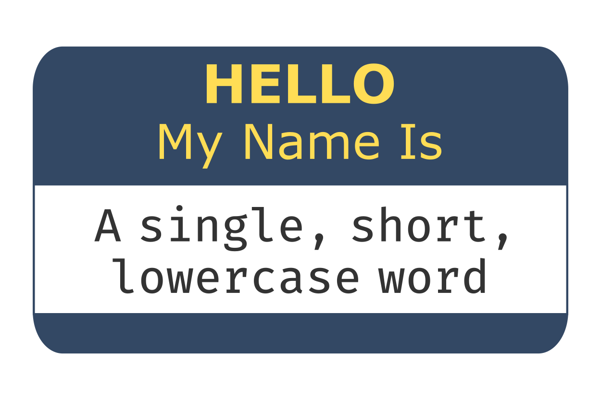
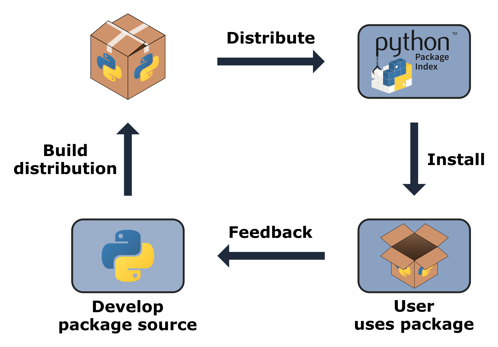

# Package structure and distribution


**Chapter 3: [How to package a Python]** provided a practical overview of how to create, install, and distribute a Python package. This chapter now goes into more detail about what a Python package actually is, digging deeper into how packages are structured, installed, and distributed.

We begin with a discussion of how modules and packages are represented in Python and why they are used\index{package structure}. We then discuss some more advanced package structure topics, such as controlling the import behavior of a package and including non-code files, like data. The chapter finishes with a discussion of what package distributions\index{distribution} are, how to build them, and how they are installed. Along the way, we'll demonstrate key concepts by continuing to develop our `pycounts` package from the previous chapter.

## Packaging fundamentals

We'll begin this chapter by exploring some of the lower-level implementation details related to what packages are, how they're structured, and how they're used in Python. 

All data in a Python program are represented by objects or by relations between objects. For example, integers and functions are kinds of Python objects. We can find the type of a Python object using the `type()` function. For example, the code below, run in a Python interpreter, creates an integer object and a function object mapped to the names `a` and `hello_world`, respectively:

```python
>>> a = 1
>>> type(a)
```

```md
int
```

```python
>>> def hello_world(name):
        print(f"Hello world! My name is {name}.")
>>> type(hello_world)
```

```md
function
```

The Python object important to our discussion of packages is the "module\index{module}" object. A module is an object that serves as an organizational unit of Python code. Typically, Python code you want to reuse is stored in a file with a *.py* suffix and is imported using the `import`\index{import} statement. This process creates a module object with the same name as the imported file (excluding the *.py* suffix), and from this object, we can access the contents of the file.

For example, imagine we have a module *`greetings.py`* in our current directory containing functions to print "Hello World!" in English and Squamish (the [Squamish people](https://en.wikipedia.org/wiki/Squamish_people) are an indigenous people of modern-day British Columbia, Canada):

```python
def hello_world():
    print("Hello World!")

def hello_world_squamish():
    print("I chen tl'iḵ!")
```

We can import that module using the `import` statement and can use the `type()` function to verify that we created a module object, which has been mapped to the name "greetings" (the name of the file):

```python
>>> import greetings
>>> type(greetings)
```

```md
module
```

We call the module object an "organizational unit of code" because the content of the module (in this case, the two "hello world" functions) can be accessed via the module name and "dot notation". For example:

\newpage

```python
>>> greetings.hello_world()
```

```md
"Hello World!"
```

```python
>>> greetings.hello_world_squamish()
```

```md
"I chen tl'iḵ!"
```

At this point in our discussion, it's useful to mention Python's namespaces\index{namespace}. A "namespace" in Python is a mapping from names to objects. From the code examples above, we've added the names `a` (an integer), `hello_world` (a function), and `greetings` (a module) to the current namespace and can use those names to refer to the objects we created. The `dir()` function can be used to inspect a namespace. When called with no arguments, `dir()` returns a list of names defined in the current namespace:

```python
>>> dir()
```

```md
['__annotations__', '__builtins__', '__doc__', '__loader__',
 '__name__', '__package__', '__spec__', 'a', 'hello_world',
 'greetings']
```

In the output above, we can see the names of the three objects we have defined in this section: `a`, `hello_world`, and `greetings`. The other names bounded by double underscores are objects that were initialized automatically when we started the Python interpreter and are implementation details that aren't important to our discussion here but can be read about in the Python [documentation](https://docs.python.org/3/reference/executionmodel.html?highlight=__builtins__#execution-model).

Namespaces are created at different moments, have different lifetimes, and can be accessed from different parts of a Python program — but these details digress from our discussion, and we point interested readers to the Python [documentation](https://docs.python.org/3/tutorial/classes.html#python-scopes-and-namespaces) to learn more. The important point to make here is that when a module is imported using the `import` statement, a module object is created and it has its own namespace containing the names of the Python objects defined in the modules. For example, when we imported the *`greetings.py`* file earlier, we created a `greetings` module object and namespace containing the names of the objects defined in the file — `hello_world` and `hello_world_squamish` — which we can access using dot notation, e.g., `greetings.hello_world()` and `greetings.hello_world_squamish()`.

In this way, the module object isolates a collection of code and provides us with a clean, logical, and organized way to access it. We can inspect the namespace of a module by passing the module object as an input to the `dir()` function:

```python
>>> dir(greetings)
```

```md
['__annotations__', '__builtins__', '__doc__', '__loader__',
 '__name__', '__package__', '__spec__', 'hello_world',
 'hello_world_squamish']
```

An important point to stress here is that there is no relation between names in different namespaces. That means that we can have objects of the exact same name in a Python session if they exist in different namespaces. For example, in the Python session we've been running in this section we have access to two `hello_world` functions; one that was defined earlier in our interactive interpreter, and one defined in the `greetings` module. While these functions have the exact same name, there is no relation between them because they exist in different namespaces; `greetings.hello_world()` exists in the `greetings` module namespace, and `hello_world()` exists in the "global" namespace of our interpreter. So, we can access both with the appropriate syntax:

```python
>>> hello_world("Tom")
```

```md
"Hello world! My name is Tom."
```

```python
>>> greetings.hello_world()
```

```md
"Hello World!"
```

<!-- #region -->
Now that we have a basic understanding of modules, we can further discuss packages. Packages\index{package structure} are just a collection of one or more modules. They are typically structured as a directory (the package) containing one or more  *.py* files (the modules) and/or subdirectories (which we call subpackages). A special file named *`__init__.py`*\index{init.py} is used to tell Python that a directory is a package (rather than just a plain-old directory on your computer). We'll talk more about the *`__init__.py`* file and package structure in **Section \@ref(package-structure)**, but for now, here's an example of a simple package structure with two modules and one subpackage:

```md
pkg
├── __init__.py
├── module1.py
└── subpkg
    ├── __init__.py
    └── module2.py
```

Put simply, packages provide another level of abstraction for our code and allow us to organize related modules under a single package namespace. It's helpful to think of a package as a module containing other modules. In fact, this is pretty much how Python treats packages. Regardless of whether you `import` a single, standalone module (i.e., a *.py* file) or a package (i.e., a directory), Python will create a module object in the current namespace. For example, let's import the `pycounts` package we created in **Chapter 3: [How to package a Python]** and check its type (recall that this package contains two modules; *`pycounts.py`* and *`plotting.py`*): 

>If you're following on from **Chapter 3: [How to package a Python]** and created a virtual environment for your `pycounts` package using `conda`, as we did in **Section \@ref(create-a-virtual-environment)**, be sure to activate that environment before continuing with this chapter by running `conda activate pycounts` at the command line.

<!-- #endregion -->

```python
>>> import pycounts
>>> type(pycounts)
```

```md
module
```

Note that despite importing our `pycounts` package (which contains two modules), Python still created a single module object. Just as before, we can access the contents of our package via dot notation. For example, we can import the `plot_words()` function from the `plotting` module of the `pycounts` package using the following syntax:

\newpage

```python
>>> from pycounts.plotting import plot_words
>>> type(plot_words)
```

```md
function
```

<!-- #region -->
While we get a module object regardless of whether we import a single module (a single *.py* file) or a package (a directory containing one or more *.py* files), one technical difference between a module and a package in Python is that packages are imported as module objects that have a `__path__` attribute.

When importing a package or module, Python searches for it in the default list of directories defined in `sys.path`:

```python
>>> import sys
>>> sys.path
```

```md
['',
 '/opt/miniconda/base/envs/pycounts/lib/python39.zip',
 '/opt/miniconda/base/envs/pycounts/lib/python3.9',
 '/opt/miniconda/base/envs/pycounts/lib/python3.9/lib-dynload',
 '/opt/miniconda/base/envs/pycounts/lib/python3.9/site-packages']
```

>The list of directories shown by `sys.path` will change depending on how you installed Python and whether or not you're in a virtual environment. The empty string at the start of the list represents the current directory.

But when importing something from a package, Python uses the `__path__` attribute of the package to look for that something, rather than the paths in `sys.path`. For example, let's check the `__path__` attribute of the `pycounts` object:
<!-- #endregion -->

```python
>>> pycounts.__path__
```

```md
['/Users/tomasbeuzen/pycounts/src/pycounts']
```

<!-- #region -->
>In **Section \@ref(installing-your-package)** we discussed how `poetry`, the tool we're using to develop our `pycounts` package, installs packages in "editable" mode\index{editable install} meaning that it installs a link to your package's code on your computer, and that's what we see in the output above. If you install `pycounts` (or any other package) using `pip install` or `conda install` and check its `__path__` attribute you would see a path including a *`site-packages/`* directory, which is where Python puts installed packages by default, e.g.: `['/opt/miniconda/base/envs/pycounts/lib/python3.9/site-packages/pycounts']`.
>
>We'll talk more about package installation in **Section \@ref(package-distribution-and-installation)**.

What this all means is that when you type `import pycounts.plotting`, Python first searches for a module or package called `pycounts` in the list of search paths defined by `sys.path`. If `pycounts` is a package, it then searches for a `plotting` module or subpackage using `pycounts.__path__` as the search path (rather than `sys.path`). At this point, we're straying into the nuances of Python's import system and digressing from the scope of this book, but interested readers can read more about Python's import system in the Python [documentation](https://docs.python.org/3/reference/import.html).

Ultimately, the important takeaway message from this section is that packages are a collection of Python modules. They help us better organize and access our code, as well as distribute it to others, as we'll discuss in **Section \@ref(package-distribution-and-installation)**.
<!-- #endregion -->

## Package structure

With the theory out of the way, we'll now get back to more practical topics in this section; we'll discuss how packages are structured\index{package structure}, how we can control their `import`\index{import} behavior, and how we can include non-code files, like data, into our packages.

### Package contents

<!-- #region -->
As we discussed in **Section \@ref(packaging-fundamentals)**, packages are a way of organizing and accessing a collection of modules. Fundamentally, a package is identified as a directory containing an *`__init__.py`*\index{init.py} file, and a module is a file with a *.py* extension that contains Python code. Below is an example directory structure of a simple Python package with two modules and a subpackage:

```md
pkg
├── __init__.py
├── module1.py
└── subpkg
    ├── __init__.py
    └── module2.py
```

The *`__init__.py`* tells Python to treat a directory as a package (or subpackage). It is common for *`__init__.py`* files to be empty, but they can also contain helpful initialization code to run when your package is imported, as we'll discuss in **Section \@ref(the-init-file)**.

The above structure satisfies the criteria for a Python package, and you would be able to `import`\index{import} content from this package on your local computer if it was in the current working directory (or if its path had been manually added to `sys.path`). But this package lacks the content required to make it installable\index{installable Python package}. 

To create an installable package, we need a tool capable of installing and building packages. Currently the most common tools used for package development are `poetry`\index{poetry}, `flit`\index{flit}, and `setuptools`\index{setuptools}. In this book, we use `poetry`, but we'll compare these tools later in **Section \@ref(packaging-tools)**. Regardless of the tool you use, it will rely on a configuration file(s) that defines the metadata and installation instructions for your package. In a `poetry`-managed project, that file is the *`pyproject.toml`*\index{pyproject.toml}. It's also good practice to include a README in your package's root directory to provide high-level information about the package, and to put the Python code of your package in a *`src/`* directory (we'll discuss why this is in **Section \@ref(the-source-layout)**). Thus, the structure for an installable package looks more like this:

```md
pkg
├── src
│   └── pkg
│       ├── __init__.py
│       ├── module1.py
│       └── subpkg
│           ├── __init__.py
│           └── module2.py
├── README.md
└── pyproject.toml
```

The above structure is suitable for a simple package, or one intended solely for personal use. But most packages include many more bells and whistles than this, such as detailed documentation\index{documentation}, tests\index{tests}, and more, as we saw in **Chapter 3: [How to package a Python]**. The `pycounts` package we created in that chapter is a more typical example of a Python package structure:

```md
pycounts
├── .readthedocs.yml
├── CHANGELOG.md
├── CONDUCT.md
├── CONTRIBUTING.md
├── docs
│   └── ...
├── LICENSE
├── README.md
├── pyproject.toml
├── src
│   └── pycounts
│       ├── __init__.py
│       ├── plotting.py
│       └── pycounts.py
└── tests
    └── ...
```

Not all of this content will be included in the version of your package that you install or distribute to others. Typically, it's just the Python code (in the *`src/`* directory) that forms the installable version of your package (but we'll show how you can specify additional content to include in **Section \@ref(including-non-code-files-in-a-package)**). The rest of the content, like documentation and tests, exists to support development, and this content is not needed by the users of your package, so it's usually shared (if desired) via a collaborative medium like GitHub\index{GitHub}, where other developers can access and contribute to it.

>The package structure described in this section is technically called a "regular package" in Python, and it is what the vast majority of Python packages and developers use. However, Python also supports a second type of package known as a "namespace package\index{namespace package}". Namespace packages are a way of splitting a single Python package across multiple directories. Unlike regular packages, where all contents live in the same directory hierarchy, namespace packages can be formed from directories in different locations on a file system and do not contain an *`__init__.py`* file.
>
>\newpage
>
>The main reason a developer might want to use a namespace package is if they wish to develop, install, and distribute portions of a package separately, or if they want to combine packages that reside on different locations on their file system. However, namespace packages can be a confusing topic for beginners and the majority of developers will never create a namespace package so we won't discuss them further in this book. Instead we refer readers interested in learning more about them to [PEP 420](https://www.python.org/dev/peps/pep-0420/) and the Python [documentation](https://docs.python.org/3/reference/import.html#namespace-packages). As a result, when we use the term "package" in this book, we specifically mean "regular package".

<!-- #endregion -->

### Package and module names

When building a package, it's important to select appropriate names for your package and its modules. Python package naming\index{package name} guidelines and conventions are described in [Python Enhancement Proposal (PEP) 8](https://www.python.org/dev/peps/pep-0008/) and [PEP 423](https://www.python.org/dev/peps/pep-0423/). The fundamental guidelines are:

- Packages and modules should have a single, short, all-lowercase name.
- Underscores can be used to separate words in a name if it improves readability, but their use is typically discouraged.

In terms of the actual name chosen for a module or package, it may be helpful to consider the following "three M's":

1. **Meaningful**: the name should reflect the functionality of the package.
2. **Memorable**: the name should be easy for users to find, remember, and relate to other relevant packages.
3. **Manageable**: remember that users of your package will access its contents/namespace via dot notation. Make it as quick and easy as possible for them to do this by keeping your names short and sweet. For example, imagine if we called our `pycounts` package something like `wordcountingpackage`. Every time a user wanted to access the `plot_words()` function from the `plotting` module, they'd have to write this: `from wordcountingpackage.plotting import plot_words()` — yikes!

Finally, you should always check [PyPI](https://pypi.org)\index{PyPI} and other popular hosting sites like GitHub, GitLab, BitBucket, etc., to make sure that your chosen package name is not already in use.

```{r 04-pkg-naming-fig, fig.cap = "Keep package names meaningful, memorable, and manageable.", out.width = "50%", fig.retina = 2, fig.align = "center", echo = FALSE, message = FALSE, warning = FALSE}

```

### Intra-package references

When building packages of multiple modules, it is common to want to use code from one module in another. For example, consider the following package structure:

```md
src
└── package
    ├── __init__.py
    ├── moduleA.py
    ├── moduleB.py
    └── subpackage
        ├── __init__.py
        └── moduleC.py
```

A developer may want to import code from `moduleA` in `moduleB`. This is an "intra-package reference\index{intra-package reference}" and can be accomplished via an "absolute\index{intra-package reference!absolute}" or "relative\index{intra-package reference!relative}" import.

Absolute imports use the package name in an absolute context. Relative imports use dots to indicate from where the relative import should begin. A single dot indicates an import relative to the current package (or subpackage), additional dots can be used to move further up the packaging hierarchy, one level per dot after the first dot.

Table \@ref(tab:04-intra-package-table) shows some practical examples of absolute and relative imports, based on the package structure shown previously.

Table: (\#tab:04-intra-package-table) Demonstration of absolute and relative intra-package imports.

| | Absolute | Relative |
| :--- | :--- | :--- |
|Import from `moduleA` in `moduleB`| `from package.moduleA import XXX` | `from .moduleA import XXX`
|Import from `moduleA` in `moduleC`| `from package.moduleA import XXX` |`from ..moduleA import XXX`|
|Import from `moduleC` in `moduleA`| `from package.subpackage.moduleC import XXX` |`from .subpackage.moduleC import XXX`|


While the choice here mostly comes down to personal preference, [PEP 8](https://www.python.org/dev/peps/pep-0008/) recommends using absolute imports because they are explicit.

### The init file

Earlier we discussed how an *`__init__.py`*\index{init.py} file is used to tell Python that the directory containing the *`__init__.py`* file is a package. The *`__init__.py`* file can be, and often is, left empty and only used for the purpose of identifying a directory as a package. However, it can also be used to add objects to the package's namespace\index{namespace}, provide documentation, and/or run other initialization code.

We'll demonstrate this functionality using the `pycounts` packages we developed in **Chapter 3: [How to package a Python]**. Consider the *`__init__.py`* of our package:

\newpage

```md
pycounts
├── .readthedocs.yml
├── CHANGELOG.md
├── CONDUCT.md
├── CONTRIBUTING.md
├── docs
│   └── ...
├── LICENSE
├── pyproject.toml
├── README.md
├── src
│   └── pycounts
│       ├── __init__.py  <--------
│       ├── plotting.py
│       └── pycounts.py
└── tests
    └── ...
```

When a package is imported, the *`__init__.py`* file is executed, and any objects it defines are bound to the package's namespace. As an example, in Python packaging, it's convention to define a package's version in two places:

1. In the package's configuration file, *`pyproject.toml`*, as we saw in **Section \@ref(installing-your-package)**.
2. In the package's *`__init__.py`* file using the `__version__` attribute, so users can quickly check the version of your package they are using, with code like:

```python
>>> import pycounts
>>> pycounts.__version__
```

```md
0.1.0
```

Sometimes you'll see the version number hard-coded in the *`__init__.py`* file, like `__version__ = "0.1.0"`\index{init.py!version}. But this means you have to remember to update the version in two places anytime you want to make a new version of your package — *`__init__.py`* and *`pyproject.toml`* (we'll discuss versioning in **Chapter 7: [Releasing and versioning]**). Instead, it's better to have your package version defined only in *`pyproject.toml`*\index{pyproject.toml}, and then read programmatically in the *`__init__.py`* file using the `importlib.metadata.version()` function, which reads a package's version from its installed metadata (i.e., the *`pyproject.toml`* file).

The `py-pkgs-cookiecutter` we used to create our `pycounts` package (**Section \@ref(creating-a-package-structure)**) already populated our *`__init__.py`* file with this code for us:

```python
# read version from installed package
from importlib.metadata import version
__version__ = version("pycounts")
```

Because any objects defined in the *`__init__.py`* get bound to the package's namespace upon `import`, the `__version__` variable is accessible from our package's namespace as we saw earlier.

Another common use case of the *`__init__.py`* file is to control the import\index{import} behavior of a package. For example, there are currently only two main functions that users will commonly use from our `pycounts` package: `pycounts.count_words()` and `plotting.plot_words()`. Users have to type the full path to these functions to import them:

```python
from pycounts.pycounts import count_words
from pycounts.plotting import plot_words
```

We could make life easier for our users by importing these core functions in `pycounts`'s *`__init__.py`* file, which would bind them to the package namespace. For example, the code below, added to the *`__init__.py`* file, imports our core functions `pycounts.count_words()` and `plotting.plot_words()`: 

```python
# read version from installed package
from importlib.metadata import version
__version__ = version(__name__)

# populate package namespace
from pycounts.pycounts import count_words
from pycounts.plotting import plot_words
```

<!-- #region -->
>If you're following along and developing the `pycounts` package in this book, and tried installing it from TestPyPI or PyPI in **Section \@ref(building-and-distributing-your-package)**, it will no longer be installed in "editable mode"\index{editable install} and so won't reflect any changes you make to the source code. You'll have to run `poetry install` to see your changes and put your package back in editable mode (which is the mode you want for development).

The functions are now bound to the `pycounts` namespace, so users can access them like this:
<!-- #endregion -->

```python
>>> import pycounts
>>> pycounts.count_words
```

```md
<function count_words>
```

Ultimately, the *`__init__.py`* file can be used to customize how your package and its contents are imported. It's an interesting exercise to visit large Python packages, such as [NumPy](https://github.com/numpy/numpy/blob/main/numpy/__init__.py), [pandas](https://github.com/pandas-dev/pandas/blob/master/pandas/__init__.py), or [scikitlearn](https://github.com/scikit-learn/scikit-learn/blob/main/sklearn/__init__.py), to see the kinds of initialization code they run in their *`__init__.py`* files.

### Including non-code files in a package

Consider again the full structure of our `pycounts` package:

\newpage

```md
pycounts
├── .readthedocs.yml
├── CHANGELOG.md
├── CONDUCT.md
├── CONTRIBUTING.md
├── docs
│   ├── changelog.md
│   ├── conduct.md
│   ├── conf.py
│   ├── contributing.md
│   ├── example.ipynb
│   ├── index.md
│   ├── make.bat
│   ├── Makefile
│   └── requirements.txt
├── LICENSE
├── README.md
├── poetry.lock
├── pyproject.toml
├── src
│   └── pycounts
│       ├── __init__.py
│       └── pycounts.py
└── tests
    ├── einstein.text
    └── test_pycounts.py
```

The installable version of your package that you distribute to others will typically only contain the Python code in the *`src/`* directory. The rest of the content\index{non-code files} exists to support development of the package and is not needed by users to actually use the package. This content is typically shared by the developer by some other means, such as GitHub, so that other developers can access and contribute to it if they wish. 

However, it is possible to include arbitrary additional content in your package that will get installed by users, along with the usual Python code. The method of doing this varies depending on what packaging tool you're using, but with `poetry`\index{poetry}, you can specify the extra content you wish to include in your package using the `include` parameter under the `[tool.poetry]` table in *`pyproject.toml`*\index{pyproject.toml}. For example, if we wanted to include our *`tests/`* directory and *`CHANGELOG.md`* file to our installable package distribution, we would add the following to *`pyproject.toml`*:

```toml
[tool.poetry]
name = "pycounts"
version = "0.1.0"
description = "Calculate word counts in a text file!"
authors = ["Tomas Beuzen"]
license = "MIT"
readme = "README.md"
include = ["tests/*", "CHANGELOG.md"]

...rest of file hidden...
```

Most developers won't ship additional content with their package like this, preferring to share it via a service like GitHub, but there are certainly use cases for doing so — for example, if you're sharing a package privately within an organization, you may wish to ship everything with your package (documentation, tests, etc.).

### Including data in a package

<!-- #region -->
One type of non-code that developers do commonly want to include in a package is data\index{data}. There are several reasons why a developer might want to include data in their package:

1. It's required to use some of the package's functionality.
2. To provide example data to help demonstrate the functionality of the package.
3. As a method of distributing and versioning a data file(s).
4. If the package is being used to bundle up a reproducible data analysis and it's important to keep the code and data together.

Regardless of the use case, there are two typical ways to include data in a Python package:

1. Include the raw data as part of the installable package, and provide code to help users load it (if required). This option is well-suited to smaller data files, or for data that the package absolutely depends on.
2. Include scripts as part of the package that download the data from an external source. This option is suited to large data files, or ones that a user may only need optionally.

We'll demonstrate option 1 above with an example. Our `pycounts` package helps users calculate words counts in text files. To demonstrate our package's functionality to new users, it might be helpful to add an example text file to our package for them to practice with. For our package, we'll add a text file of the novel *Flatland*, by Edwin Abbott [@abbott1884] ([available online](https://www.gutenberg.org/ebooks/97)).

To include this data in our package, we need to do two things:

1. Include the raw *.txt* file in our package.
2. Include code to help a user access the data.

We'll start by creating a new *`data`* subpackage in our *`src/pycounts/`* directory, where you should download and place the linked *Flatland* novel as *`flatland.txt`*. We'll also create a new module *`datasets.py`* in our package that we'll shortly populate with code to help users load data. Our `pycounts` directory structure now looks like this:

```md
pycounts
├── ...rest of package hidden...
├── src
│   └── pycounts
│       ├── __init__.py
│       ├── data               <--------
│       │   ├── __init__.py    <--------
│       │   └── flatland.txt   <--------
│       ├── datasets.py        <--------
│       ├── plotting.py
│       └── pycounts.py
└── ...rest of package hidden...

```

Now we need to add some Python code to *`datasets.py`* to help users load the example data. The recommended way to access data files in a package is using the `importlib.resources` [module](https://docs.python.org/3/library/importlib.html#module-importlib.resources). The main function of our `pycounts` package, `pycounts.count_words()` requires users to pass a file path to the text file they want to count words in. So, we should write a function in our new *`datasets.py`* that returns the path to the example *`flatland.txt`* file to the user. The `importlib.resources.path()` function can help us do that. You can read about this function in the Python [documentation](https://docs.python.org/3/library/importlib.html#importlib.resources.path); it is used in a `with` statement and requires two parameters, the location of the subpackage the data is in (`"pycounts.data"`) and the name of the data file to access within that subpackage (`"flatland.txt"`). The code below, which we'll add to *`datasets.py`*, demonstrates its usage:

```python
from importlib import resources

def get_flatland():
    """Get path to example "Flatland" [1]_ text file.

    Returns
    -------
    pathlib.PosixPath
        Path to file.

    References
    ----------
    .. [1] E. A. Abbott, "Flatland", Seeley & Co., 1884.
    """
    with resources.path("pycounts.data", "flatland.txt") as f:
        data_file_path = f
    return data_file_path
```

Once you've added this code to *`datasets.py`*, you can try it out:

```python
>>> from pycounts.datasets import get_flatland
>>> get_flatland()
```

```md
PosixPath('/Users/tomasbeuzen/pycounts/src/pycounts/data/flatland.txt')
```

>If you're following along and developing the `pycounts` package in this book, and tried installing it from TestPyPI or PyPI in **Section \@ref(building-and-distributing-your-package)**, it will no longer be installed in "editable mode" and so won't reflect any changes you make to the source code. You'll have to run `poetry install` to see your changes and put your package back in editable mode (which is the mode you want for development).

A user can directly use this path in the `pycounts` function `count_words()` as follows:

```python
>>> from pycounts.pycounts import count_words
>>> from pycounts.datasets import get_flatland
>>> flatland_path = get_flatland()
>>> count_words(flatland_path)
```

```md
Counter({'the': 2244, 'of': 1597, 'to': 1078, 'and': 1074, 
'a': 902, 'i': 706, 'in': 698, 'that': 486, ... })
```

This is just one example of how we can include data as part of our package and expose it to a user. The `importlib.resources` module can be used to load any kind of data in different ways (as a path, as a string, as a binary file, etc.). If you're developing a package that includes user-facing data, we recommend taking a look at the `importlib.resources` [documentation](https://docs.python.org/3/library/importlib.html#module-importlib.resources), as well as the "datasets" modules included in larger Python libraries such as [scikit-learn](https://github.com/scikit-learn/scikit-learn/tree/main/sklearn/datasets), [torchvision](https://github.com/pytorch/vision/tree/main/torchvision/datasets), or [statsmodels](https://github.com/statsmodels/statsmodels/tree/main/statsmodels/datasets) to learn more.
<!-- #endregion -->

### The source layout

When describing and defining package structure throughout this book, we have been nesting our package's Python code inside a *`src/`* directory, as in the example structure below. This layout is called the "src"/"source" layout\index{source layout} for obvious reasons.

```md
pkg
├── ...
├── src
│   └── pkg
│       ├── __init__.py
│       ├── module1.py
│       └── subpkg
│           ├── __init__.py
│           └── module2.py
└── ...
```

However, nesting a package's code in a *`src/`* directory is not required to build a package, and it's also common to see packages without it. We'll call this the "non-src" layout and show an example below.

```md
pkg
├── ...
├── pkg
│   ├── __init__.py
│   ├── module1.py
│   └── subpkg
│       ├── __init__.py
│       └── module2.py
└── ...
```

In general, we recommend using the "src" layout over the "non-src" layout (and so does the [Python Packaging Authority](https://packaging.python.org/tutorials/packaging-projects/)) because it has several advantages when it comes to developing and distributing installable Python packages. We list a few of these below:

1. For developers using a testing framework like `pytest`, a "src" layout forces you to install your package before it can be tested. Most developers would agree that you would want to test your package as it will be installed by users, rather than as it currently exists on your own machine. The problem with a "non-src" layout is that Python can `import` your package even if it is not installed. This is because in most cases the first place Python searches when running `import` is the current directory (check this by importing `sys` and running `sys.path[0]`). Without a "src" folder, Python will find your package as it exists in the current directory and import it, rather than using it as it would be installed on a user's machine. There are plenty of horror stories of developers uploading broken distributions to PyPI because they were testing their code as it existed on their machine rather than as it would be installed by users. This issue is described in detail in Ionel Cristian Mărieș' [Packaging a Python Library](https://blog.ionelmc.ro/2014/05/25/python-packaging/) and Hynek Schlawack's [Testing and Packaging](https://hynek.me/articles/testing-packaging/) excellent blog posts for those interested.
    
2. A "src" layout leads to cleaner editable installs of your package. Recall from **Section \@ref(installing-your-package)** that when developing a package, it's common to install it in editable mode (the default when running `poetry install`). This adds the path to your project's Python code to the `sys.path` list so that changes to your source code are immediately available when you `import` it, without needing to reinstall.  With a "src" layout that path looks something like this:

    ```md
    '/Users/tomasbeuzen/pycounts/src'
    ```
    
    In contrast, a "non-src" layout will add your project's root to `sys.path` (there is no "src" directory to provide a layer of separation):
    
    ```md
    '/Users/tomasbeuzen/pycounts/'
    ```
    
    There's usually a lot more than just Python code at that path. There could be test modules, scratch code, data files, documentation, example scripts, etc., all of which are now potentially importable in your development workflow!

3. Finally, "src" is generally a universally recognized location for source code, making it easier for others to quickly navigate the contents of your package.

Ultimately, while you can certainly use a "non-src layout" to develop a package, using a "src" layout will typically reduce the chance of things breaking during development and distribution.

## Package distribution and installation

In this section, we won't be writing any code, but rather we will discuss theory related to package distribution\index{distribution} and installation for those interested. If that's not you, feel free to skip to **Section \@ref(version-control)**.

As we saw in **Chapter 3: [How to package a Python]**, the typical workflow for developing and distributing a Python packages is as follows:

1. A *developer* creates a Python package on their machine.
2. The *developer* uses a tool like `poetry` to build a distribution from that package.
3. The *developer* shares the distribution, usually by uploading to a online repository like [PyPI](https://pypi.org).
4. A *user* uses an installation tool like `pip` to download the distribution and install it on their machine.
5. (Optional) *Users* provide feedback to the developer about the package (identify bugs, request features, etc.) and the cycle repeats.

This workflow is illustrated in Fig. \@ref(fig:04-pkg-cycle-fig).

```{r 04-pkg-cycle-fig, fig.cap = "The Python package cycle.", out.width = "100%", fig.retina = 2, fig.align = "center", echo = FALSE, message = FALSE, warning = FALSE}

```

To build up an intuition of the steps in this process, we'll begin at the user-end, and discuss how packages are installed. We'll then work our way backwards to better understand what distributions are and how they're made.

### Package installation

To be installed, a package needs to generate two directories:

1. *`{package}`*: a directory of the package's source files (i.e., modules and subpackages).
2. *`{package}-{version}.dist-info`*: a directory of files containing information about the package, such as a  metadata file with information such as the package's author and what versions of Python it supports (METADATA), a license file (LICENSE), a file specifying what tool was used to install the package (INSTALLER), and more. These files are described in detail in [PEP 427](https://www.python.org/dev/peps/pep-0427/#the-dist-info-directory).

We'll talk about how these directories are actually built shortly, but for now, we'll talk about installation\index{installable Python package}. When you install a package with an installer like `pip` the above directories are copied into the *`site-packages/`* directory of your Python installation, which is one of the default places Python looks when importing a package. The exact path to the *`site-packages/`* directory varies depending on your operating system, how you installed Python, and whether you're using a virtual environment. You can check the path using the `sys.path` variable. The below paths are for a MacOS, with Python installed via [Miniconda](https://docs.conda.io/en/latest/miniconda.html), and with a virtual environments called `pycounts` activated:

```python
>>> import sys
>>> sys.path
```

```md
['',
'/opt/miniconda/base/envs/pycounts/lib/python39.zip',
'/opt/miniconda/base/envs/pycounts/lib/python3.9',
'/opt/miniconda/base/envs/pycounts/lib/python3.9/lib-dynload',
'/opt/miniconda/base/envs/pycounts/lib/python3.9/site-packages']
```

If you navigate to the *`site-packages/`* directory you will see examples of the *`{package}`* and *`{package}-{version}.dist-info`* directories for each package you have installed. For example, if we were to `pip install` the `pycounts` package we uploaded to PyPI in **Section \@ref(building-and-distributing-your-package)**, we would see the following in our *`site-packages`* folder:

```md
'/opt/miniconda/base/lib/python3.9/site-packages/pycounts'
├── __init__.py
├── __pycache__
├── plotting.py
└── pycounts.py
```

```md
/opt/miniconda/base/lib/python3.9/site-packages/pycounts-0.1.0.dist-info
├── INSTALLER
├── LICENSE
├── METADATA
├── RECORD
├── REQUESTED
└── WHEEL
```

\newpage

So the question is, how do we provide the *`{package}`* and *`{package}-{version}.dist-info`* directories necessary to install our package? There are two options:

1. Create a single archive of all our package source code, metadata, and instructions on how to create the *`{package}`* and *`{package}-{version}.dist-info`* directories, and then share that archive with users. This is called a source distribution or sdist\index{distribution!sdists}. To install your package from an sdist, a user needs to download the archive, unpack it, and use the included build instructions to build it into the *`{package}`* and *`{package}-{version}.dist-info`* directories on their own computer (we'll talk about how these directories are "built" in **Section \@ref(building-sdists-and-wheels)**). Finally, the package is installed by copying these directories to the *`site-packages/`* directory.
2. Build the *`{package}`* and *`{package}-{version}.dist-info`* directories on our own machine, compress them into a single file, and share them with users. This single file is called a wheel\index{distribution!wheel}. A user just needs to download the wheel and extract the contents to the *`site-packages/`* folder; no build step is necessary.

`pip install`\index{pip} can handle installation from an sdist or a wheel, but distributing your package to users as a wheel (option 2) certainly seems preferable; everything has already been done on the developer's side and installation just involves downloading the distribution and copying it to the appropriate location on a user's computer. This is why wheels are the preferred distribution format for Python packages. In fact, when you run `pip install <some-package>`, it will always prioritize installing the specified package from a wheel (if it exists).

At this point you might be wondering why we bother with sdists at all. The reason is that wheels aren't always available to users. Some Python packages contain "extensions" written in other languages, such as C/C++, because they offer functionality and performance enhancements. While Python is typically referred to as an interpreted language (i.e., your Python code is translated to machine code as it is executed), languages such as C/C++ require compilation by a compiler program before they can be used (i.e., your code must be translated into "machine code" *before* it can be executed). Compilation is platform-specific. Thus, if a developer wanted to provide wheels of a package that included extensions in another language, they would have to generate one wheel for each platform they wanted to support (e.g., MacOS-arm64, MacOS-x86, Win-32, Win-amd64, etc.). For this reason, sdists are usually provided with wheels; if a wheel isn't available for a user's particular platform, they will still be able to build the package from the sdist (which would require that they have the appropriate compiling program(s)).

As an example, the popular `numpy` package contains extensions written in C, so its wheels are platform-specific. Wheels have a specific naming convention (described in [PEP 427](https://www.python.org/dev/peps/pep-0427/)), which includes the name of the platform they support; if you look at `numpy`'s [distributions on PyPi](https://pypi.org/project/numpy/#files), you'll see wheels for common platforms, as well as an sdist at the bottom of the list.

Wheels specific to a platform are known as "platform wheels". However, the vast majority of Python packages use pure Python code (i.e., they don't include extensions written in other languages), and so don't need to worry about generating platform wheels. Most developers and readers of this book will only ever generate one wheel for their package: a "universal wheel" (compatible with Python 2 and 3) or a "pure Python wheel" (compatible with either Python 2 or 3). The build tool you use to make your distributions will handle wheel creation for you (as we'll talk about in the next section), so it's not something you need to worry about, but it's interesting to know these things!

### Building sdists and wheels

In the previous section we talked about how packages need to generate *`{package}`* and *`{package}-{version}.dist-info`* folders to be installed, and how a wheel is a single archive containing these files. So how exactly do we build a wheel?

In a nutshell the build process involves:
1. Developer builds the package source into an sdist{distribution!sdists};
2. Developer or user builds a wheel from the sdist;
3. Users installs the wheel{distribution!wheel}.

The build steps here are where packaging tools like `poetry`\index{poetry}, `flit`\index{flit}, or `setuptools`\index{setuptools} come in. These tools provide the code required to build sdists and wheels. Recall the *`pyproject.toml`* file `poetry` uses to manage package development. One table in that file we did not talk about when we introduced the file in **Section \@ref(installing-your-package)** is `[build-system]`:

```toml
...other file content hidden...

[build-system]
requires = ["poetry-core>=1.0.0"]
build-backend = "poetry.core.masonry.api"
```

This table specifies the tools required to build the sdist and wheel for a package (`requires`) and where the functions that actually do the build are located in a build-tool's library (`build-backend`). For example, the table above shows that the `poetry-core` library is required to build our package, and that the building functions are located in `poetry.core.masonry.api`. If you take a look at the source code of `poetry-core`'s `poetry.core.masonry.api` [module](https://github.com/python-poetry/poetry-core/blob/master/src/poetry/core/masonry/api.py), you'll see functions like `build_wheel()` and `build_sdist()`. The exact building mechanics are beyond the scope of this book, so we wont go into detail about how they work. However, as a packaging book, it would be remiss not to mention that the ability to specify the build tools required to make sdists and wheels of a package is a relatively new development in the packaging ecosystem. This functionality was introduced in [PEP 517](https://www.python.org/dev/peps/pep-0517/) and [PEP 518](https://www.python.org/dev/peps/pep-0518/), to remove the dependency of the packaging system on legacy tools. These PEPs are an interesting read for those keen on digging into more of the low-level details of building and installing package distributions.

### Packaging tools

The focus of this book is on workflows and tools that make packaging accessible and efficient. `poetry`\index{poetry} is one of those tools; it abstracts the lower-level details of package development away from the developer so they can focus on writing code. `poetry` is completely configured by a single *`pyproject.toml`*\index{pyproject.toml} file and has intuitive commands to install a package (`poetry install`), manage dependencies (`poetry add`), build distributions (`poetry build`), and publish those distributions to a repository like PyPI (`poetry publish`).

An alternative modern packaging tool is `flit`\index{flit}. `flit` is essentially a stripped-down version of `poetry`. It is also managed by a *`pyproject.toml`* file and provides commands similar to `poetry` to help install a package (`flit install`), build distributions (`flit build`), and publish those distributions to a repository like PyPI (`flit publish`). The main difference between `flit` and `poetry` is that `flit` doesn't automatically manage the dependencies of your project like `poetry` does; you have to manually add dependencies and their version specifications to *`pyproject.toml`*. As a result, we prefer `poetry` because it means there's one less thing to worry about!

The downside of `poetry` and `flit` is that, at the time of writing, they only support pure Python packages and not packages that contain extensions written in other languages, which we discussed in **Section \@ref(package-installation)**. This is completely fine for the vast majority of developers. However, for those looking to build more advanced packages that include non-Python code, `setuptools`\index{setuptools} is the preferred option. For a long time, `setuptools` was the default build tool for Python packages so it is still used by many projects that have been around for a while. `setuptools` require a little more expertise to configure than `poetry` or `flit`, as you can read more about in the [documentation](https://setuptools.readthedocs.io/en/latest/userguide/index.html), so we prefer `poetry` or `flit` for packaging projects where possible.

### Package repositories

In **Chapter 3: [How to package a Python]**, we released our `pycounts` package to the Python Package Index ([PyPI](https://pypi.org/)) and discussed how PyPI is the main repository for Python packages. Even if you've never heard of PyPI\index{PyPI}, if you've ever run `pip install <some-package>`\index{pip} you've installed packages from there. If you're interested in sharing your work publicly, PyPI is probably where you'll release your package, however, it is not the only option.

The [Anaconda](https://anaconda.org/anaconda/repo)\index{Anaconda} and [conda-forge](https://conda-forge.org)\index{conda-forge} repositories are the next most popular software repositories for Python packages. Packages on these repositories can be installed from the command line using `conda install`\index{conda} (we installed the `conda` tool in **Section \@ref(installing-python)**). The main differences between PyPI and these repositories is that they can host non-Python software (as opposed to PyPI which only hosts Python software), and `conda` packages are binaries (there is never a need to have to build a package or its dependencies from an sdist). As a result, packages that depend on non-Python code are usually released to Anaconda or conda-forge. Even for packages that are pure Python, developers sometimes still also create a `conda` package and upload to Anaconda or conda-forge to cater to users who are using `conda` as a package manager rather than `pip`. For those interested, Anaconda provides a helpful [tutorial](https://docs.conda.io/projects/conda-build/en/latest/user-guide/tutorials/build-pkgs-skeleton.html) to help convert packages on PyPI to `conda` packages, but for most readers of this book, building sdist and wheel distributions and sharing them on PyPI will be enough.

In some cases, you may want to release your package to a private repository (for example, for internal use by your company only). There are many private repository options for Python packages. Companies like [Anaconda](https://docs.anaconda.com/), [PyDist](https://pydist.com/), and [GemFury](https://gemfury.com/) are all examples that offer (typically paid) private Python package repository hosting. You can also set up your own server on a dedicated machine or cloud service — as discussed in this [article](https://medium.com/swlh/how-to-install-a-private-pypi-server-on-aws-76993e45c610). You can also choose to host your package on GitHub (or equivalent), and forego releasing to a dedicated software repository. `pip install` supports installing a package directly from a GitHub repository you have access to, as discussed in the [documentation](https://pip.pypa.io/en/stable/topics/vcs-support/). You can `pip install` from a repository branch, a specific commit, or a tag. For example, we tagged a release of v0.1.0 of our `pycounts` package on GitHub in **Section \@ref(tagging-a-package-release-with-version-control)**. Others could now install our package directly from GitHub\index{GitHub} using the following command:

```bash
$ pip install git+https://github.com/TomasBeuzen/pycounts.git@v0.1.0
```

Installing from GitHub can be useful for users wanting a version of your package not yet available on PyPI (for example, a development version), or if you want to host your package in a private repository and only share it with a select few collaborators. In general though, we don't recommend GitHub for sharing Python packages to a wide audience as the vast majority of Python users do not install packages from GitHub, and dedicated software repositories like PyPI provide better discoverability, ease of installation, and a stamp of authenticity.

## Version control

In **Section \@ref(including-data-in-a-package)** we made an important change to our `pycounts` package by adding a new `datasets` module and some example data. We will make a new release of our package in **Chapter 7: [Releasing and versioning]** that incorporates this change. So, if you're following along building the `pycounts` package yourself and using version control, commit these changes to your local and remote repositories using the commands below. If you're not building the `pycounts` package or not using version control\index{version control}, you can skip to the next chapter.

```bash
$ git add src/pycounts/datasets.py src/pycounts/data
$ git commit -m "feat: add example data and datasets module"
$ git push
```
