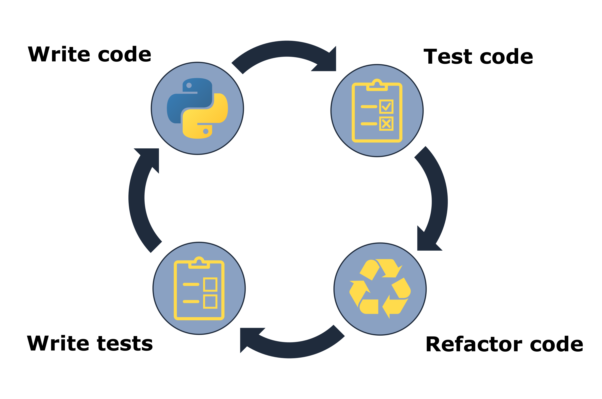
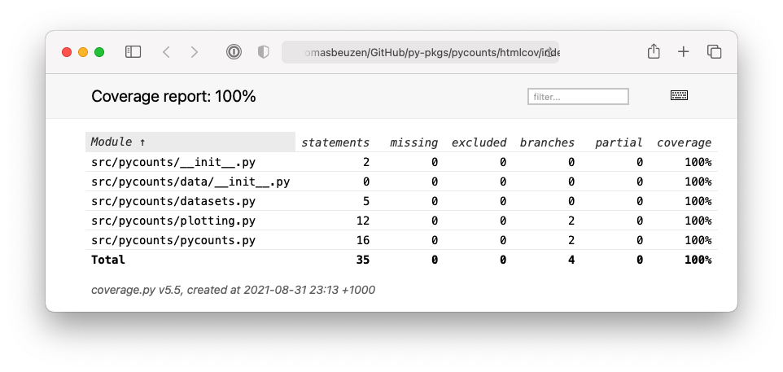
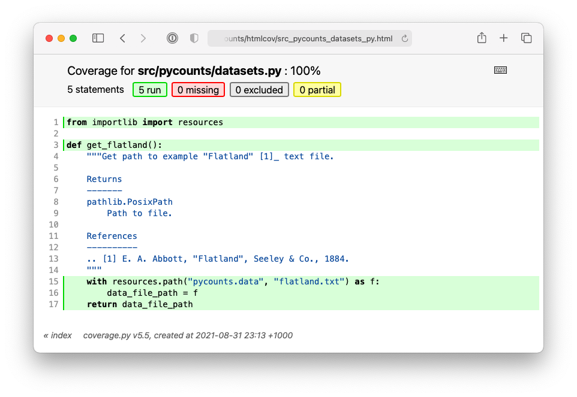

# Testing


Testing is an important part of Python package development but one that is often neglected due to the perceived additional workload. However, the reality is quite the opposite! Introducing formal, automated testing into your workflow can have several benefits:

1. **Fewer bugs:** you’re explicitly constructing and testing your code from the viewpoint of a developer and a user.
2. **Better code structure:** writing tests forces you to structure and organize your code so that it's easier to test and understand.
3. **Easier development:** formal tests will help you and others add features to your code without breaking tried-and-tested existing functionality.

**Section \@ref(testing-your-package)** briefly introduced testing in Python package development. This chapter now goes into more detail about how to write tests\index{tests}, different types of tests (unit tests, regression tests, integration tests), and code coverage.

## Testing workflow

In general, the goal of testing is to check that your code produces the results you expect it to. You probably already conduct informal tests of your code in your current workflow. In a typical workflow, we write code, run it in a Python session to see if it's working as we expect, make changes, repeat. This is sometimes called "manual testing" or "exploratory testing" and is common in the early stages of development of your code. But when developing code you intend to package up, reuse, and potentially share with others, you'll need to test it in a more formal and reproducible way.

In Python, tests are usually written using an `assert`\index{tests!assert} statement, which checks the truth of a given expression, and returns a user-defined error message if the expression is false. To demonstrate this process, imagine we want to create a function called `count_letters()` that counts the number of letters in a string. We come up with the following code as a first version of that function:

```python
def count_letters(text):
    """Count letters in a string."""
    return len(text)
```

We can write some tests for that function using the `assert` statement to check it's working as we expect it to. For example we would expect our function to calculate five letters in the string `"Hello"` and ten letters in the string `"Hello world"`:

```python
>>> assert count_letters("Hello") == 5, "'Hello' should have 5 letters"
>>> assert count_letters("Hello world") == 10, "'Hello world' should \
                                                have 10 letters"
```

If we ran the above `assert` statements, the first would pass without error, but the second would raise an error:

```md
AssertionError: 'Hello world' should have 10 letters
```

What went wrong? When we call `len()` on a string, it counts all the characters in the string, including the spaces. So, we need to go back to our `count_letters()` function and remove spaces before counting letters. One way we can do this is by using the `.replace()` method to replace spaces with an empty string `""` (i.e., nothing):

```python
def count_letters(text):
    """Count letters in a string."""
    return len(text.replace(" ", ""))
```

Now our previous `assert` statements should both pass. This process we just went through roughly followed the typical testing workflow\index{tests!testing workflow} of:

1. Write a test.
2. Write the code to be tested.
3. Test the code.
4. Refactor code (make small changes).
5. Repeat.

This workflow is illustrated in Fig. \@ref(fig:05-test-workflow-fig).

```{r 05-test-workflow-fig, fig.cap = "The testing workflow.", out.width = "100%", fig.retina = 2, fig.align = "center", echo = FALSE, message = FALSE, warning = FALSE}

```

In our earlier demonstration with the `count_letters()` function, we swapped steps 1 and 2; we wrote the first version of our function's code before we wrote our tests, and this is a common workflow too. However, you can see how it might have been beneficial to write the tests (or at least think about them) before writing the code; if we knew we were testing text with a space in it, we might have included that in our function in the first place.

Writing your tests before your code is known as "test-driven development\index{tests!test-driven development}", and advocates of this approach suggest that it helps you better understand the code you need to write, prevent bugs, and ultimately save you time. However in practice, writing your tests first or last doesn't seem to have a significant impact on overall development time [@fucci2016]. Regardless of when you choose to formally write your tests, all developers should at least think about the specifications of their code before they write it. What might the inputs look like? What will the output look like? Are there any [edge cases](https://en.wikipedia.org/wiki/Edge_case) to consider? Taking a moment to consider and write down these specifications will help you write code effectively and efficiently.

Ultimately, the testing workflow is all about working incrementally and iteratively. The idea is to make small changes to your code as you add features or identify bugs, test it, write more tests, repeat. Managing and executing such a workflow manually like we did above would clearly be inefficient. Instead, a test framework is typically used to help manage the testing workflow in an efficient, automated, and reproducible way. `pytest` is one of the most common test frameworks for Python packages. We used it to help test our `pycounts` package in **Section \@ref(running-tests)**. In the rest of this chapter, we'll continue to explore how `pytest` can be used to test a package and will demonstrate concepts by writing tests for the `pycounts` package.

## Test structure

To use `pytest`\index{tests!pytest} as a testing framework, it expects tests to be structured as follows:

1. Tests are defined as functions prefixed with `test_` and contain one or more statements that `assert`\index{tests!assert} code produces an expected result or raises a particular error.
2. Tests are put in files of the form *`test_*.py`* or *`*_test.py`*, and are usually placed in a directory called *`tests/`* in a package's root.

Tests can be executed using the command `pytest` at the command line and pointing it to the directory your tests live in (i.e., `pytest tests/`). `pytest` will find all files of the form *`test_*.py`* or *`*_test.py`* in that directory and its subdirectories, and execute any functions with names prefixed with `test_`.

As an example, consider the structure of the `pycounts` package we developed in **Chapter 3: [How to package a Python]**:

```md
pycounts
├── .readthedocs.yml
├── CHANGELOG.md
├── CONDUCT.md
├── CONTRIBUTING.md
├── docs
│   └── ...
├── LICENSE
├── README.md
├── poetry.lock
├── pyproject.toml
├── src
│   └── ...
└── tests                 <--------
    ├── einstein.txt      <--------
    └── test_pycounts.py  <--------
```

The file *`einstein.txt`* is a text file we created in **Section \@ref(writing-tests)** to use in our tests. It includes a quote from Albert Einstein:

>*"Insanity is doing the same thing over and over and expecting different results."*

The file *`test_pycounts.py`* is where the tests we want to run with `pytest` should be. That file contains the following test we wrote in **Section \@ref(running-tests)**, using the format expected by `pytest`, a function prefixed with `test_` that includes an `assert` statement.

```python
from pycounts.pycounts import count_words
from collections import Counter

def test_count_words():
    """Test word counting from a file."""
    expected = Counter({'insanity': 1, 'is': 1, 'doing': 1, 
                        'the': 1, 'same': 1, 'thing': 1, 
                        'over': 2, 'and': 2, 'expecting': 1,
                        'different': 1, 'results': 1})
    actual = count_words("tests/einstein.txt")
    assert actual == expected, "Einstein quote counted incorrectly!"
```

To use `pytest` to run this test it should first be installed as a development dependency\index{dependency!development dependency} of your package. If using `poetry` as a packaging tool, as we do in this book, that can be done with the following command:

```bash
$ poetry add --dev pytest
```

>If you're following on from **Chapter 3: [How to package a Python]**, specifically, **Section \@ref(running-tests)**, we already installed `pytest` as a development dependency of our `pycounts` package so running the above command won't do anything.

With `pytest` installed, we use the following command from our root package directory to run our test:

```bash
$ pytest tests/
```

```md
========================= test session starts =========================
...
collected 1 item                                                                                                              

tests/test_pycounts.py .                                         [100%]

========================== 1 passed in 0.01s ==========================
```

The output of `pytest` provides some basic system information, along with how many tests were run and what percentage passed. If a test fails, it will output the traceback of the error, so you can see exactly which test failed and why. In the next section, we'll go into more detail about how to write different kinds of tests in `pytest`.

## Writing tests

There are several kinds of tests commonly used to test Python packages: unit tests, integration tests, and regression tests. In this section, we'll explore and demonstrate what these tests are and how to write them in `pytest`.

### Unit tests

Unit tests\index{tests!unit test} are the most common type of test you will write. A unit test verifies that an independent unit of code (e.g., a Python function) is working as expected in a particular situation. It will typically comprise:

1. Some data to test the code with (called a "fixture\index{tests!fixture}"). The fixture is typically a small or simple version of the type of data the function will typically process.
2. The *actual* result that the code produces given the fixture.
3. The *expected* result of the test, which is compared to the *actual* result, typically using an `assert`\index{tests!assert} statement.

The `test_count_words()` function of our `pycounts` package is an example of a unit test. Recall that our `count_words()` function can be used to calculate words counts in a text file. To test it, we created a small, sample text file called *`einstein.txt`* (our fixture), which contains the following quote:

>*"Insanity is doing the same thing over and over and expecting different results."*

The result of our `count_words()` function using this fixture is the *actual* result. The fixture is small enough that we can count the words by hand, and that forms our *expected* result. Thus the unit test currently in our *`test_pycounts.py`* looks as follows:

```python
from pycounts.pycounts import count_words
from collections import Counter

def test_count_words():
    """Test word counting from a file."""
    expected = Counter({'insanity': 1, 'is': 1, 'doing': 1, 
                        'the': 1, 'same': 1, 'thing': 1, 
                        'over': 2, 'and': 2, 'expecting': 1,
                        'different': 1, 'results': 1})
    actual = count_words("tests/einstein.txt")
    assert actual == expected, "Einstein quote counted incorrectly!"
```

A `pytest` test function can actually include multiple `assert` statements and if any of the included `assert` functions fail, the whole test will fail. As an example of a unit test with multiple `assert` statements, we'll write a new test in our *`test_pycounts.py`* file for the `plot_words()` function of our `pycounts.plotting` module. We developed the `plot_words()` function in **Section \@ref(adding-dependencies-to-your-package)** and show it below:

\newpage

```python
import matplotlib.pyplot as plt

def plot_words(word_counts, n=10):
    """Plot a bar chart of word counts.
    
    Parameters
    ----------
    word_counts : collections.Counter
        Counter object of word counts.
    n : int, optional
        Plot the top n words. By default, 10.
    
    ...rest of docstring hidden...
    """
    top_n_words = word_counts.most_common(n)
    word, count = zip(*top_n_words)
    fig = plt.bar(range(n), count)
    plt.xticks(range(n), labels=word, rotation=45)
    plt.xlabel("Word")
    plt.ylabel("Count")
    return fig
```

Our function takes in a `Counter` object of word counts and outputs a `matplotlib` bar chart. To test that it's working as expected with a unit test, we'll:

- Use the manually counted words from the Einstein quote as a fixture.
- Use that fixture as an input to the `plot_words()` function to create a bar plot (the actual result).
- `assert` that the plot is a `matplotlib` bar chart (`matplotlib.container.BarContainer`) and `assert` that there are ten bars in the bar chart (`n=10` is the default number of bars to plot in the `plot_words()` function, as you can see above).

Below we show this unit test in Python code, and we'll add it to our *`test_pycounts.py`* file:

\newpage

```python
from pycounts.pycounts import count_words
from pycounts.plotting import plot_words <--------
import matplotlib                        <--------
from collections import Counter

def test_count_words():
    # ... same as before ...

def test_plot_words():  <--------
    """Test plotting of word counts."""
    counts = Counter({'insanity': 1, 'is': 1, 'doing': 1, 
                      'the': 1, 'same': 1, 'thing': 1, 
                      'over': 2, 'and': 2, 'expecting': 1,
                      'different': 1, 'results': 1})
    fig = plot_words(counts)
    assert isinstance(fig, matplotlib.container.BarContainer), \
           "Wrong plot type"
    assert len(fig.datavalues) == 10, \
           "Incorrect number of bars plotted"
```

Now that we've written a new test, we need to check that it is working. Running `pytest` at the command line should now show two tests were run:

```bash
$ pytest tests/
```

```md
========================= test session starts =========================
...
collected 2 item                                                                                                              

tests/test_pycounts.py .                                         [100%]

========================== 2 passed in 0.01s ==========================
```

Looks like things are working as expected!

Before we move on, there's one more important thing to mention. We know that the `assert` statement can be used with any expression that evaluates to a boolean (`True`/`False`). However, if your package uses floating-point numbers, and you're wanting to `assert` the equality of floating-point numbers in your tests, there's one thing to watch out for. Due to the limitations of floating-point arithmetic in computers, numbers that we would expect to be equal are sometimes not. Consider the following infamous example:

```python
>>> assert 0.1 + 0.2 == 0.3, "Numbers are not equal!"
```

```md
AssertionError: Numbers are not equal!
```

You can read more about the nuances of floating-point arithmetic in the Python [documentation](https://docs.python.org/3/tutorial/floatingpoint.html), but the important point here is that, when working with floating-point numbers, we usually `assert` that numbers are *approximately* equal, rather than *exactly* equal. To do this we can use the `pytest.approx()` function:

```python
>>> import pytest
>>> assert 0.1 + 0.2 == pytest.approx(0.3), "Numbers are not equal!"
```

You can control how approximate you want the equality to be by using the `abs` and `rel` arguments of `pytest.approx()` to specify how much absolute or relative error you want to allow, respectively.

### Test that a specific error is raised

<!-- #region -->
Rather than `assert` that your code produces a particular output given a particular input, sometimes you want to check that your code raises\index{tests!raises} a particular error\index{tests!error} when used in the wrong way by a user. Consider again the `plot_words()` function of our `pycounts.plotting` module. From the docstring\index{docstring}, we see that the function expects users to pass a `Counter` object to the function:

\newpage

```python
import matplotlib.pyplot as plt

def plot_words(word_counts, n=10):
    """Plot a bar chart of word counts.

    Parameters
    ----------
    word_counts : collections.Counter  <--------
        Counter object of word counts.
    n : int, optional
        Plot the top n words. By default, 10.

    ...rest of docstring hidden...
    """
    top_n_words = word_counts.most_common(n)
    word, count = zip(*top_n_words)
    fig = plt.bar(range(n), count)
    plt.xticks(range(n), labels=word, rotation=45)
    plt.xlabel("Word")
    plt.ylabel("Count")
    return fig
```

What happens if a user inputs a different object? For the sake of argument, let's consider what happens if they pass a list of words to our function:

```python
>>> from pycounts.plotting import plot_words
>>> word_list = ["Pythons", "are", "non", "venomous"]
>>> plot_words(word_list)
```

```md
AttributeError: 'list' object has no attribute 'most_common'
```

This `AttributeError` message is not overly useful to our users. The problem is that our code uses the method `.most_common()`, which is specific to the `Counter` object and retrieves the top `n` counts from that object. To improve the user-experience, we might want to raise a more helpful error message to a user to tell them if they pass the wrong object type.

Let's modify our `plot_words()` function to check that the `word_counts` argument is a `Counter` object using the `isinstance()` function and, if it's not, `raise` a `TypeError` with a useful message. The `raise` statement terminates a program and allows you to notify users of an error. There are many error types to choose from and you can even create your own, as discussed in the Python [documentation](https://docs.python.org/3/library/exceptions.html). We'll use the `TypeError` here because it is used to indicate that an object is of the wrong type. Our function, with this new checking code in it, now looks like this:

```python
import matplotlib.pyplot as plt
from collections import Counter  <--------

def plot_words(word_counts, n=10):
    """Plot a bar chart of word counts.

    ...rest of docstring hidden...
    """
    if not isinstance(word_counts, Counter):  <--------
        raise TypeError("'word_counts' should be of type 'Counter'.")
    top_n_words = word_counts.most_common(n)
    word, count = zip(*top_n_words)
    fig = plt.bar(range(n), count)
    plt.xticks(range(n), labels=word, rotation=45)
    plt.xlabel("Word")
    plt.ylabel("Count")
    return fig
```

>Other commons exceptions used in tests include:
>
>- `AttributeError`: for when an object does not support a referenced attribute (i.e., of the form `object.attribute`).
- `ValueError`: for when an argument has the right type but an inappropriate value.
- `FileNotFoundError`: for when a specified file or directory doesn’t exist.
- `ImportError`: for when the `import` statement can't find a module.

We can check that our new error-handling code is working by starting a new Python session and retrying our code from before, which passed a `list` to our function:

\newpage

```python
>>> from pycounts.plotting import plot_words
>>> word_list = ["Pythons", "are", "non", "venomous"]
>>> plot_words(word_list)
```

```md
TypeError: 'word_counts' should be of type 'Counter'.
```

Great, our `plot_words()` function now raises a helpful `TypeError` when a user inputs the wrong type of object. But how can we test this functionality with `pytest`\index{tests!pytest}? We can use `pytest.raises()`. `pytest.raises()` is used as part of a `with` statement, which contains the code you expect to throw an error. Let's add the new unit test shown below, called `test_plot_words_error()`, to our test file *`test_pycounts.py`* to demonstrate this functionality.

>We've written a new test called `test_plot_words_error()`, rather than adding to our existing `test_plot_words()` test, because unit tests should be written to check one unit of code (i.e., a function) in one particular situation.

```python
from pycounts.pycounts import count_words
from pycounts.plotting import plot_words
import matplotlib
from collections import Counter
import pytest  <--------

def test_count_words():
    # ... same as before ...

def test_plot_words():
    # ... same as before ...

def test_plot_words_error():  <--------
    """Check TypeError raised when Counter not used."""
    with pytest.raises(TypeError):
        list_object = ["Pythons", "are", "non", "venomous"]
        plot_words(list_object)
```

\newpage

In the new test above, we purposefully pass the wrong object type (a list) to `plot_words()` and expect it to raise a `TypeError`. Let's check that this new test, and our existing tests, all pass by running `pytest` at the terminal. `pytest` should now find and execute three tests:

```bash
$ pytest tests/
```

```md
========================= test session starts =========================
...
collected 3 items

tests/test_pycounts.py .                                         [100%]

========================== 3 passed in 0.39s ==========================
```
<!-- #endregion -->

### Integration tests

<!-- #region -->
The unit tests we've written above verify that the individual functions of our package work in isolation. But we should also test that they work correctly together. Such a test is called an "integration test\index{tests!integration test}" (because individual units of code are integrated into a single test).

Integration tests are structured the same way as unit tests. We use a fixture to produce an actual result with our code, which is then compared to an expected result. As an example of an integration test we'll:

- Use the "Einstein quote" text file, *`einstein.txt`*, as a fixture.
- Count the words in the quote using the `count_words()` function.
- Plot the word counts using the `plot_words()` function.
- `assert` that a `matplotlib` bar chart was created, that the chart has 10 bars, and that the maximum word count in the chart is 2 (no word appears more than twice in the quote in the *`einstein.txt`* file).

The overall aim of this test is to check that the two core functions of our package `count_words()` and `plot_words()` work together (at least to our test specifications). It can be written and added to our *`test_pycounts.py`* file as follows:

\newpage

```python
from pycounts.pycounts import count_words
from pycounts.plotting import plot_words
import matplotlib
from collections import Counter
import pytest

def test_count_words():
    # ... same as before ...

def test_plot_words():
    # ... same as before ...

def test_plot_words_error():
    # ... same as before ...

def test_integration():  <--------
    """Test count_words() and plot_words() workflow."""
    counts = count_words("tests/einstein.txt")
    fig = plot_words(counts)
    assert isinstance(fig, matplotlib.container.BarContainer), \
           "Wrong plot type"
    assert len(fig.datavalues) == 10, \
           "Incorrect number of bars plotted"
    assert max(fig.datavalues) == 2, "Highest word count should be 2"
```

`pytest` should now find and execute four tests:

```bash
$ pytest tests/
```

```md
========================= test session starts =========================
...
collected 4 items

tests/test_pycounts.py .                                         [100%]

========================== 4 passed in 0.39s ==========================
```
<!-- #endregion -->

### Regression tests

<!-- #region -->
We've been testing our `pycounts` package on the simple "Einstein quote" fixture, but how does it perform on real data? We added some example real data to our package in **Section \@ref(including-data-in-a-package)**; a *.txt* file of the novel *Flatland*, by Edwin Abbott [@abbott1884] ([available online](https://www.gutenberg.org/ebooks/97)). However, it would be impossible to count all of the words in that text by hand to come up with an "expected" result.

Instead, regression testing\index{tests!regression test} is about testing that your code produces consistent results as opposed to expected results. The idea is to see how our package performs on this data now, and add a test to check that the result stays consistent in the future as we add more functionality to our package.

For example, the most-common words in *Flatland* can be determined as follows:

```python
>>> from pycounts.datasets import get_flatland
>>> from pycounts.pycounts import count_words
>>> counts = count_words(get_flatland())
>>> counts.most_common(1)
```

```md
[('the', 2245)]
```

Unsurprisingly, the most common word is "the" which occurs 2245 times. An example regression test for our package would, therefore, look as follows:

\newpage

```python
from pycounts.pycounts import count_words
from pycounts.plotting import plot_words
from pycounts.datasets import get_flatland  <--------
import matplotlib
from collections import Counter
import pytest

def test_count_words():
    # ... same as before ...

def test_plot_words():
    # ... same as before ...

def test_plot_words_error():
    # ... same as before ...

def test_integration():
    # ... same as before ...

def test_regression():  <--------
    """Regression test for Flatland"""
    top_word = count_words(get_flatland()).most_common(1)
    assert top_word[0][0] == "the", "Most common word is not 'the'"
    assert top_word[0][1] == 2245, "'the' count has changed"
```

`pytest` should now find and execute five tests:

```bash
$ pytest tests/
```

```md
========================= test session starts =========================
...
collected 5 items

tests/test_pycounts.py .                                         [100%]

========================== 5 passed in 0.39s ==========================
```
<!-- #endregion -->

### How many tests should you write

Now that you know how to write tests, how many should you actually write? There's no single answer to this question. In general, you want your tests to evaluate the core functionality of your program. Code coverage, which we'll discuss in **Section \@ref(code-coverage)**, is a metric that can help you understand how much of your code your tests actually evaluate. But even 100% coverage doesn't guarantee your code is perfect, only that it passes the specific tests you wrote!

It might be near impossible to write tests for every single use-case of your package (you'd be amazed at the weird and wonderful ways users can find to unwittingly break your code!). That's why testing is an iterative procedure, as we discussed in **Section \@ref(testing-workflow)**; as you refactor and add to your code, as users find ways to use your function that you didn't expect, or it produces results you didn't account for, write new tests, write new code, run your tests, and repeat.

## Advanced testing methods

As the complexity and number of tests you write increases, it can be helpful to streamline and organize your tests in a more efficient and accessible manner. `pytest` fixtures and parameterizations are two useful concepts that can help here. As we'll next discuss, `pytest` fixtures can be used to more efficiently define the context for your tests (e.g., the data or directory structure they run in), and parameterizations allow you to run the same test multiple times but with different input and output values.

### Fixtures

Our current *`test_pycounts.py`* file contains the same fixture\index{fixture}\index{tests!fixture} defined multiple times; a `Counter` object of the words in the "Einstein quote". 

```python
from pycounts.pycounts import count_words
from pycounts.plotting import plot_words
from pycounts.datasets import get_flatland
import matplotlib
from collections import Counter
import pytest

def test_count_words():
    """Test word counting from a file."""
    expected = Counter({'insanity': 1, 'is': 1, 'doing': 1, 
                        'the': 1, 'same': 1, 'thing': 1, 
                        'over': 2, 'and': 2, 'expecting': 1,
                        'different': 1, 'results': 1})
    actual = count_words("tests/einstein.txt")
    assert actual == expected, "Einstein quote counted incorrectly!"

def test_plot_words():
    """Test plotting of word counts."""
    counts = Counter({'insanity': 1, 'is': 1, 'doing': 1, 
                      'the': 1, 'same': 1, 'thing': 1, 
                      'over': 2, 'and': 2, 'expecting': 1,
                      'different': 1, 'results': 1})
    fig = plot_words(counts)
    assert isinstance(fig, matplotlib.container.BarContainer), \
           "Wrong plot type"
    assert len(fig.datavalues) == 10, "Incorrect number of bars plotted"

... rest of file hidden ...
```

This is inefficient and violates the "don't repeat yourself" (DRY) principle of software development. Fortunately, there's a solution. In `pytest`, fixtures can be defined as functions that can be reused across your test suite. In our case, we could create a fixture that defines the "Einstein quote" `Counter` object, and makes it available to any test that wants to use it.

It's easiest to see the utility of a fixture by example. Fixtures can be created in `pytest` using the `@pytest.fixture` decorator. A decorator in Python is defined using the `@` symbol and immediately precedes a function definition. Decorators add functionality to the function they are "decorating"; understanding them isn't necessary to use them here, but for those interested in learning more, check out this [Primer on Python Decorators](https://realpython.com/primer-on-python-decorators).

In the code below, we define a function called `einstein_counts()` and decorate it with the `@pytest.fixture` decorator. This fixture returns the manually counted words in the Einstein quote as a `Counter` object. To use it in a test, we pass it as an parameter to the test function, just like you would usually specify a function parameter, e.g., `test_count_words(einstein_counts)`. We'll use our new fixture in both the `test_count_words()` and `test_plot_words()` below:

\newpage

```python
from pycounts.pycounts import count_words
from pycounts.plotting import plot_words
from pycounts.datasets import get_flatland
import matplotlib
from collections import Counter
import pytest

@pytest.fixture         <--------
def einstein_counts():  <--------
    return Counter({'insanity': 1, 'is': 1, 'doing': 1, 
                    'the': 1, 'same': 1, 'thing': 1, 
                    'over': 2, 'and': 2, 'expecting': 1,
                    'different': 1, 'results': 1})

def test_count_words(einstein_counts):  <--------
    """Test word counting from a file."""
    expected = einstein_counts
    actual = count_words("tests/einstein.txt")
    assert actual == expected, "Einstein quote counted incorrectly!"

def test_plot_words(einstein_counts):   <--------
    """Test plotting of word counts."""
    fig = plot_words(einstein_counts)
    assert isinstance(fig, matplotlib.container.BarContainer), \
           "Wrong plot type"
    assert len(fig.datavalues) == 10, "Incorrect number of bars plotted"
        
... rest of file hidden ...
```

We now have a way of defining a fixture once but using it in multiple tests.

At this point you might wonder why we used the `@pytest.fixture` decorator at all, why not just define a variable as normal at the top of the script like this:

\newpage

```python
from pycounts.pycounts import count_words
from pycounts.plotting import plot_words
from pycounts.datasets import get_flatland
import matplotlib
from collections import Counter
import pytest


einstein_counts = Counter({'insanity': 1, 'is': 1, 'doing': 1, 
                           'the': 1, 'same': 1, 'thing': 1, 
                           'over': 2, 'and': 2, 'expecting': 1,
                           'different': 1, 'results': 1})

def test_count_words():
    """Test word counting from a file."""
    expected = einstein_counts
    
# ... rest of file hidden ...
```

The short answer is that fixtures provide far more functionality and reliability than manually defined variables. For example, each time you use a `pytest` fixture, it triggers the fixture function, meaning that each test gets a fresh copy of the data; you don't have to worry about accidentally mutating or deleting your fixture during a test session. You can also control this behavior; should the fixture be executed once per use, once per test module, or once per test session? This can be helpful if the fixture is large or time-consuming to create. Finally, we've only explored the use of fixtures as data for a test, but fixtures can also be used to set up the environment for a test. For example, the directory structure a test should run in, or the environment variables it should have access to. `pytest` fixtures can help you easily set up these kinds of contexts, as you can read more about in the `pytest` [documentation](https://pytest.readthedocs.io/en/latest/fixture.html).

### Parameterizations

<!-- #region -->
Parameterizations\index{parameterization}\index{tests!parameterization} can be useful for running a test multiple times using different arguments. For example, recall in **Section \@ref(test-that-a-specific-error-is-raised)** that we added some code to `pycounts`'s `plot_words()` function that raises a `TypeError` if a user inputs an object other than a `Counter` object to the function. We wrote a test to check that in our *`test_pycounts.py`* file as follows:

\newpage

```python
# ... rest of file hidden ...

def test_plot_words_error():
    """Check TypeError raised when Counter not used."""
    with pytest.raises(TypeError):
        list_object = ["Pythons", "are", "non", "venomous"]
        plot_words(list_object)
        
# ... rest of file hidden ...
```

Our test only tests the `TypeError` is raised if a `list` object is passed as an input, but we should also test what happens if other objects are passed too, such as numbers or strings. Rather than writing new tests for each object we want to try, we can parameterize this test with all the different data we want to try, and `pytest` will run the test for each piece of data.

Parameterizations can be created in `pytest` using the `@pytest.mark.parametrize(argnames, argvalues)` decorator. `argnames` represent the names of test variable(s) you want to use in your test function (you can use any name you want), and `argvalues` is a list of the values those test variable(s) will take.

In the code example below, that we've added to the *`test_pycounts.py`* file, we create a test variable named `obj`, which can take three values; a float (`3.141`), a string (`"test.txt"`), or a list of strings (`["list", "of", "words"]`). With this parameterization, `pytest` will run our test three times, once for each value that we specified we want `obj` to take.

```python
# ... rest of file hidden ...

@pytest.mark.parametrize(
    "obj",
    [
        3.141,
        "test.txt",
        ["list", "of", "words"]
    ]
)
def test_plot_words_error(obj):
    """Check TypeError raised when Counter not used."""
    with pytest.raises(TypeError):
        plot_words(obj)
        
# ... rest of file hidden ...
```

We can explicitly show that `pytest` will run our test three times (once for each value we specified) by adding the `--verbose` flag to our `pytest` command:

```bash
$ pytest tests/ --verbose
```

```md
========================= test session starts =========================
...
collected 7 items                                                       

tests/test_pycounts.py::test_count_words PASSED                  [ 14%]
tests/test_pycounts.py::test_plot_words PASSED                   [ 28%]
tests/test_pycounts.py::test_plot_words_error[3.141] PASSED      [ 42%]
tests/test_pycounts.py::test_plot_words_error[test.txt] PASSED   [ 57%]
tests/test_pycounts.py::test_plot_words_error[obj2] PASSED       [ 71%]
tests/test_pycounts.py::test_integration PASSED                  [ 85%]
tests/test_pycounts.py::test_regression PASSED                   [100%]

======================== 7 passed in 0.52s ============================
```

Sometimes you'll want to run a test on a function, where the output depends on the input. As an example, consider the function `is_even()` below:

```python
def is_even(n):
    """Check if n is even."""
    if n % 2 == 0:
        return True
    else:
        return False
```

To parameterize this test with different input/output pairs, we use the same syntax as before with `@pytest.mark.parametrize()` except we comma-separate the test arguments in a string (`"n, result"`) and group the pairs of values we want those arguments to take in a tuple (e.g., `(2, True)`, `(3, False)`, etc.). In the example test that follows, we'll purposefully add a wrong input/output pair (`(4, False)`) to show what the output of `pytest` looks like in the case of a failed parameterization:

\newpage

```python
@pytest.mark.parametrize(
    "n, result",
    [
        (2, True),
        (3, False),
        (4, False)  # this last pair is purposefully wrong so we can
                    # show an example of the pytest error message
    ]
)
def test_is_even(n, result):
    assert is_even(n) == result
```

The above test would run successfully for the first two parameterized input/output pairs but would fail for the last one with the following helpful error message that points out exactly which parameterization failed:

```{code-block} xml
---
emphasize-lines: 4, 19
---
============================== FAILURES ===============================
________________________ testis_even[4-False] _________________________

n = 4, result = False

    @pytest.mark.parametrize(
        "n, result",
        [
            (2, True),
            (3, False),
            (4, False)
        ]
    )
    def testis_even(n, result):
>       assert is_even(n) == result

tests/test_example.py:13: AssertionError
======================= short test summary info =======================
FAILED tests/test_example.py:testis_even[4-False]: assert True == False
```

You can read more about parameterizations in the `pytest` [documentation](https://docs.pytest.org/en/6.2.x/parametrize.html).
<!-- #endregion -->

## Code coverage

A good test suite will contain tests that check as much of your package's code as possible. How much of your code your tests actually use is called "code coverage\index{code coverage}", and there are different ways to calculate it, as we'll learn about in this section.

### Line coverage

The simplest and most intuitive measure of code coverage is line coverage\index{code coverage!line coverage}. It is the proportion of lines of your package's code that are executed by your tests:

$$
  \text{coverage} = \frac{\text{lines executed}}{\text{total lines}} * 100\%
$$

Consider the following hypothetical code, consisting of 9 lines:

```python
def myfunc(x):                          # Line 1
    if x > 0:                           # Line 2
        print("x above threshold!")     # Line 3
        print("Running analysis.")      # Line 4
        y = round(x)                    # Line 5
        z = y ** 2                      # Line 6
    elif x < 0:                         # Line 7
        z = abs(x)                      # Line 8
    return z                            # Line 9
```

Imagine we write the following unit test for that code. This unit test uses `x=10.25` as a test fixture (if you follow the code above, you'll see that the expected result for that fixture is 100):

```python
def test_myfunc_1():
    assert myfunc(x=10.25) == 100
```

This test only covers the condition `x > 0` of our `myfunc()` function and hence will only execute lines 1 — 6 and line 9; a total of 7, of 9, possible lines. The coverage would therefore be:

$$
  \text{coverage} = \frac{\text{7}}{\text{9}} * 100\% = 78\%
$$

Line coverage is simple and intuitive to understand, and many developers use it as a measure of how much of their package's code is covered by their tests. But you can see how line coverage can potentially be misleading. Our `myfunc()` function has two possible outputs, depending on which condition of the `if` statement is satisfied. These two possible code paths are called "branches", and they might be equally important to our package, but our line coverage metric is heavily dependent on which branches we actually test. Imagine if we used the test below for our `myfunc()` function, which passes a value `x <= 0`:

```python
def test_myfunc_2():
    assert myfunc(x=-5) == 5
```

This test only covers line 1, 2 and lines 7-9 of the function, for a total of 5 lines and 56% coverage. Because line coverage can be skewed (or artificially inflated) by how many lines are in the branches of your code, some developers prefer to calculate branch coverage, which we'll talk about in the next section.

### Branch coverage

In contrast to line coverage, branch coverage\index{code coverage!branch coverage} evaluates how many branches in your code are executed by tests, where a branch is a possible execution path the code can take, usually in the form of an `if` statement.

```python
def myfunc(x):
    # Branch 1
    if x > 0:
        print("x above threshold!")
        print("Running analysis.")
        y = round(x)
        z = y ** 2
    # Branch 2
    elif x < 0:
        z = abs(x)
    return z
```

$$
  \text{coverage} = \frac{\text{branches executed}}{\text{total branches}} * 100\%
$$

When using branch coverage, we would get 50% coverage regardless of whether we ran the `test_myfunc_1()` or `test_myfunc_2()` test functions we defined in **Section \@ref(line-coverage)** because each test covers one branch. While line coverage is perhaps more intuitive and easier to understand than branch coverage, many developers feel that branch coverage provides a more useful, less-biased, measure of coverage. In the next section, we'll show how to calculate coverage as a mix of line and branch coverage, to get the best of both metrics.

### Calculating coverage

We can calculate code coverage with `pytest`\index{tests!pytest} using the extension `pytest-cov`\index{tests!pytest-cov}. For a `poetry`-managed package, `pytest-cov` can be installed as a development dependency\index{dependency!development dependency} with the following command:

```bash
$ poetry add --dev pytest-cov
```

>`pytest-cov` is an implementation of the `coverage` package. It can sometimes be helpful to visit the latter's [documentation](https://coverage.readthedocs.io/en/latest/) if you're looking for more information about how `pytest-cov` calculates coverage.

Code coverage can be calculated using the `pytest` command with the argument `--cov=<pkg-name>` specified. For example, the following command determines the coverage our tests have of our `pycounts` package:

```bash
$ pytest tests/ --cov=pycounts
```

```xml
========================= test session starts =========================

Name                            Stmts   Miss  Cover
---------------------------------------------------
src/pycounts/__init__.py            2      0   100%
src/pycounts/data/__init__.py       0      0   100%
src/pycounts/datasets.py            5      0   100%
src/pycounts/plotting.py           12      0   100%
src/pycounts/pycounts.py           16      0   100%
---------------------------------------------------
TOTAL                              35      0   100%

========================== 7 passed in 0.46s ==========================
```

The output summarizes the coverage of the individual modules in our `pycounts` package. By default, `pytest-cov` calculates coverage as line coverage. `Stmts` is how many lines are in a module, `Miss` is how many lines were not executed by tests, and `Cover` is the percentage of lines executed by your tests. After having made our way through this chapter, we've written enough tests to obtain 100 percent line coverage for our `pycounts` modules! But note that 100 percent coverage doesn't guarantee our code is perfect, only that it passes the specific tests we wrote!

If we want to calculate branch coverage with `pytest`, we can specify the argument `--cov-branch`:

```bash
$ pytest --cov=pycounts --cov-branch
```

```xml
========================= test session starts =========================

Name                            Stmts   Miss Branch BrPart  Cover
-----------------------------------------------------------------
src/pycounts/__init__.py            2      0      0      0   100%
src/pycounts/data/__init__.py       0      0      0      0   100%
src/pycounts/datasets.py            5      0      0      0   100%
src/pycounts/plotting.py           12      0      2      0   100%
src/pycounts/pycounts.py           16      0      2      0   100%
-----------------------------------------------------------------
TOTAL                              35      0      4      0   100%

========================== 5 passed in 0.46s ==========================
```

In this output `Branch` is the number of branches in the module, and `BrPart` is the number of branches executed by tests. "Branch coverage" in `pytest-cov` is actually calculated using a mix of branch and line coverage, which can be useful to get the best of both metrics:

$$
  \text{coverage} = \frac{\text{lines executed} + \text{branches executed}}{\text{total lines} + \text{total branches}} * 100\%
$$

### Coverage reports

As we've seen, `pytest --cov` provides a helpful high-level summary of our test coverage at the command line. But if we want to see a more detailed output we can generate a useful HTML report\index{code coverage!coverage report} using the argument `--cov-report html` as follows:

```bash
$ pytest --cov=pycounts --cov-report html
```

The report will be available at *`htmlcov/index.html`* (relative to your working directory) and will look like Fig. \@ref(fig:05-test-report-1-fig).

```{r 05-test-report-1-fig, fig.cap = "HTML test report.", out.width = "100%", fig.retina = 2, fig.align = "center", echo = FALSE, message = FALSE, warning = FALSE}

```

We can click on elements of the report, like the *`datasets.py`* module, to see exactly what lines/branches the tests are hitting/missing, as shown in Fig. \@ref(fig:05-test-report-2-fig):

```{r 05-test-report-2-fig, fig.cap = "Detailed view of the datasets module in the HTML report.", out.width = "100%", fig.retina = 2, fig.align = "center", echo = FALSE, message = FALSE, warning = FALSE}

```

## Version control

Throughout this chapter, we added a significant number of tests to our *`test_pycounts.py`* file, and made a small change to our `pycounts.plotting.plot_words()` function in **Section \@ref(test-that-a-specific-error-is-raised)** to have it check that users pass a `Counter` object as an input argument. These changes will form part of a new release of our package that we'll develop in **Chapter 7: [Releasing and versioning]**. So, if you're following along building the `pycounts` package yourself and using version control\index{version control}, commit these changes to your local and remote repositories using the commands below. If you're not building the `pycounts` package or not using version control, you can skip to the next chapter.

```bash
$ git add tests/test_pycounts.py
$ git commit -m "test: add additional tests for all modules"
$ git add src/pycounts/plotting.py
$ git commit -m "fix: check input type to plot_words function"
$ git push
```
