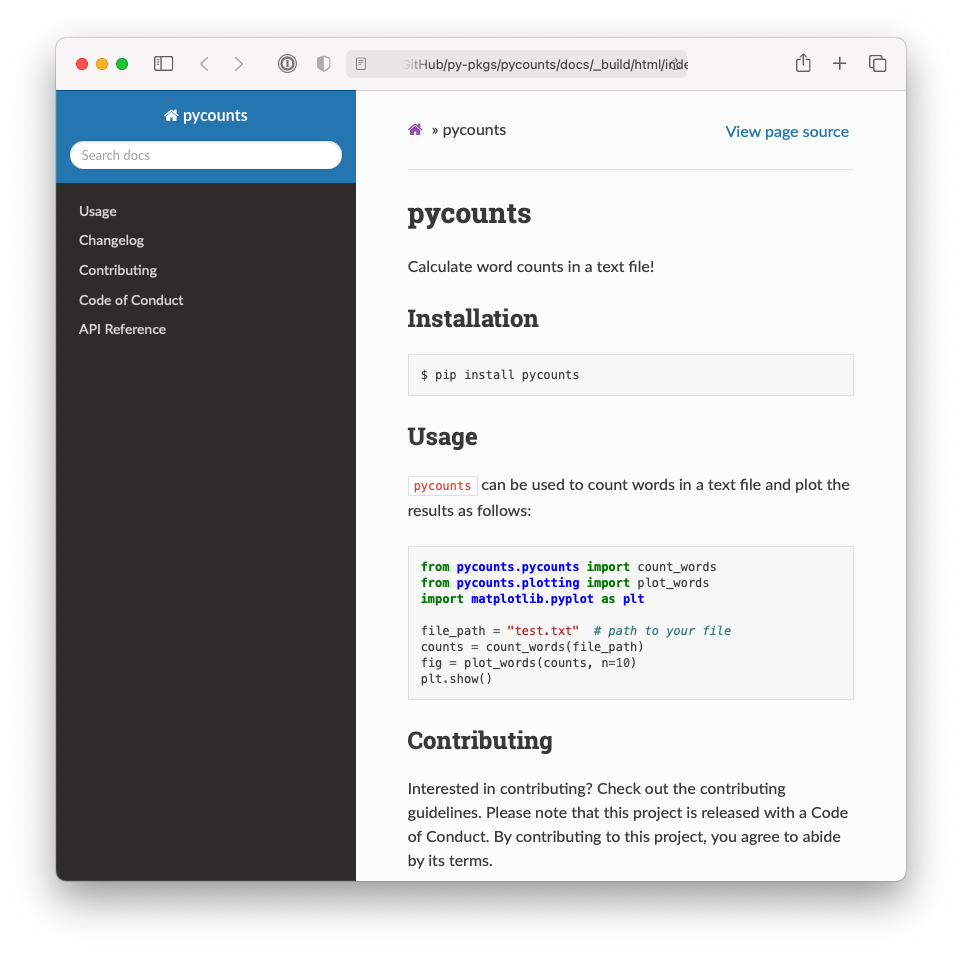
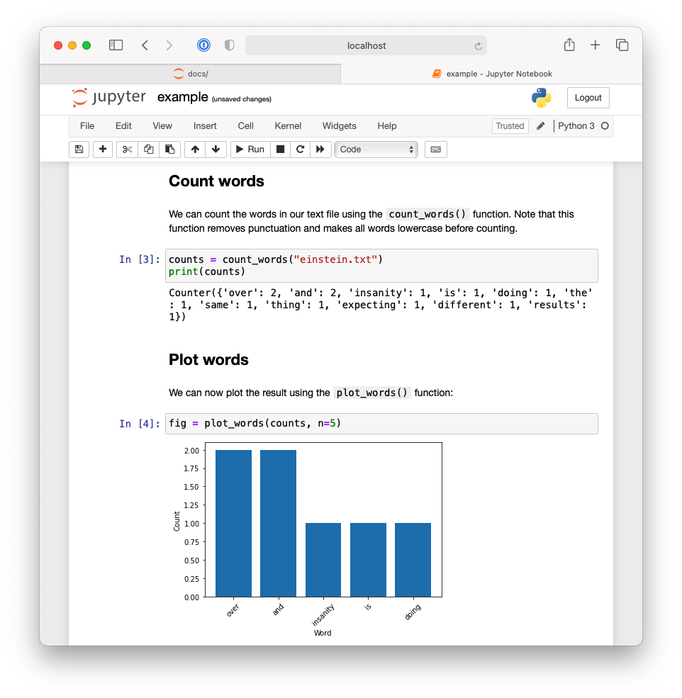
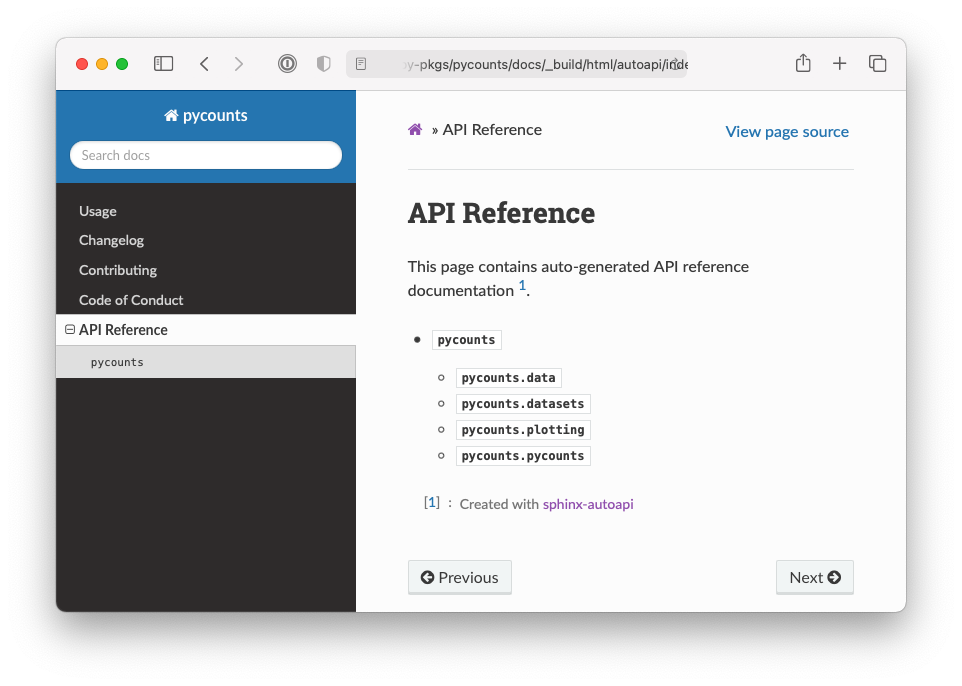
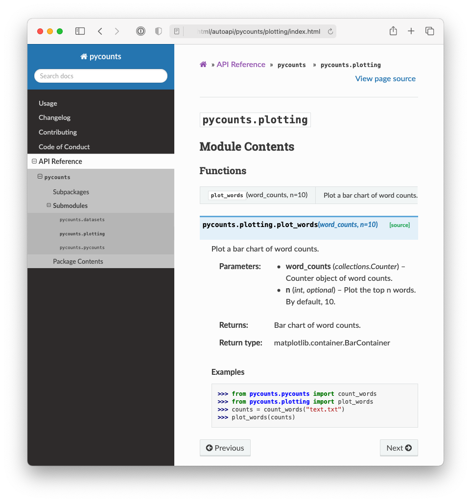

# Documentation


Writing documentation\index{documentation} for your package is arguably one of the most important, but perhaps least exciting, parts of the packaging process. The purpose of documentation is to help users understand how they can use and interact with your package, without having to read the source code. For the users of your code (including your future self), having readable and accessible documentation is invaluable. The reality is, if no one knows how to use your package, it will probably not get used!

In **Section \@ref(package-documentation)**, we walked through the steps required to create documentation, compile it into a user-friendly and shareable HTML format, and then host it online. We'll revise those steps here and will provide more detail about the documentation workflow and the individual elements of package documentation.

## Documentation content and workflow

To give you an idea of what we mean when we say "documentation", Table \@ref(tab:06-documentation-table) shows the documentation included with a typical Python package and where it is usually located in the package's directory structure.

Table: (\#tab:06-documentation-table) Typical Python package documentation.

|Documentation|Typical location|Description|
|:---    | :--- | :---      |
|README|Root |Provides high-level information about the package, e.g., what it does, how to install it, and how to use it.|
|License|Root |Explains who owns the copyright to your package source and how it can be used and shared.|
|Contributing guidelines|Root |Explains how to contribute to the project.|
|Code of conduct|Root |Defines standards for how to appropriately engage with and contribute to the project and its community.|
|Changelog|Root |A chronologically ordered list of notable changes to the package over time, usually organized by version.|
|Docstrings| *.py* files |Text appearing as the first statement in a function, method, class, or module in Python that describes what the code does and how to use it. Accessible to users via the `help()` command.|
|Examples|*`docs/`* |Step-by-step, tutorial-like examples showing how the package works in more detail.|
|API reference|*`docs/`* | An organized list of the user-facing functionality of your package (i.e., functions, classes, etc.) along with a short description of what they do and how to use them. Typically created automatically from your package's docstrings using the `sphinx` tool as we'll discuss in **Section \@ref(building-documentation)**.|


\newpage

We'll discuss what each of these pieces of documentation are and how to write them in **Section \@ref(writing-documentation)**. But it's first helpful to understand the big-picture documentation workflow and what we're aiming to build.

The typical workflow for documenting a Python package consists of three steps:

1. **Write documentation**: manually write the documentation source files that will support your package, such as those listed in Table \@ref(tab:06-documentation-table). These are usually written in a plain-text format like [Markdown](https://en.wikipedia.org/wiki/Markdown) (*.md*). [reStructuredText](https://www.sphinx-doc.org/en/master/usage/restructuredtext/index.html) (*.rst*), which we explain in **Section \@ref(writing-documentation)**. Below we show an example of the *`README.md`* file we wrote for the `pycounts` package we developed in **Chapter 3: [How to package a Python]**.

    ````xml
    # pycounts

    Calculate word counts in a text file!

    ## Installation

    ```bash
    $ pip install pycounts
    ```

    ## Usage

    `pycounts` can be used to count words in a text file and plot
    results as follows:

    ```python
    from pycounts.pycounts import count_words
    from pycounts.plotting import plot_words
    import matplotlib.pyplot as plt

    file_path = "test.txt"  # path to your file
    counts = count_words(file_path)
    fig = plot_words(counts, n=10)
    plt.show()
    ```

    ...rest of file hidden...
    ````

2. **Build documentation\index{documentation!build documentation}**: compile and render the manually written documentation into an organized, coherent, and shareable format, such as HTML or PDF, using the documentation generator tool `sphinx`. To help you understand what this means, Fig. \@ref(fig:06-documentation-1-fig) shows an example of what the README document above looks like when it's "built".

    ```{r 06-documentation-1-fig, fig.cap = "Example of HTML documentation generated by sphinx.", out.width = "100%", fig.retina = 2, fig.align = "center", echo = FALSE, message = FALSE, warning = FALSE}

```

3. **Host documentation\index{documentation!host documentation} online**: share documentation online so it can be easily accessed by anyone with an internet connection, using a free service like [Read the Docs](https://readthedocs.org)\index{Read the Docs} or [GitHub Pages](https://pages.github.com). For example, the documentation we built for `pycounts` in **Section \@ref(package-documentation)** is available online at <https://pycounts.readthedocs.io/en/latest/>.

In the remaining sections of this chapter, we'll walk through each of the above steps of the documentation workflow.

## Writing documentation

Table \@ref(tab:06-documentation-table) shows the typical documentation included in a package and where it is usually located in the package's directory structure. There's a lot of content to think about here, but the reality is that most developers make Python packages from templates that create most of this documentation\index{documentation} automatically. For example, consider the `pycounts` package we created using the `py-pkgs-cookiecutter` template in **Section \@ref(creating-a-package-structure)**:

```md
pycounts
├── .readthedocs.yml
├── CHANGELOG.md      <--------
├── CONDUCT.md        <--------
├── CONTRIBUTING.md   <--------
├── docs              <--------
│   └── ...           <--------
├── LICENSE           <--------
├── README.md         <--------
├── poetry.lock
├── pyproject.toml
├── src
│   └── ...
└── tests
    └── ...
```

Documentation is typically written in a plain-text markup format, such as [Markdown](https://en.wikipedia.org/wiki/Markdown)\index{Markdown} (*.md*) or [reStructuredText](https://www.sphinx-doc.org/en/master/usage/restructuredtext/index.html)\index{reStructuredText} (*.rst*). With a plain-text markup language, documents are written in plain-text and a special syntax is used to specify how the text should be formatted when it is rendered by a suitable tool. We saw an example of a raw and rendered Markdown document in **Section \@ref(documentation-content-and-workflow)**. As you can see from the structure of our `pycounts` package above, we use Markdown (*.md*) in this book because it is widely used, and we feel it has a less verbose and more intuitive syntax than reStructuredText. Automatic Markdown-rendering is also supported on a wide variety of IDEs\index{integrated development environment} and websites. We'll show examples of Markdown syntax and writing the documents above in the following sections, and you can check out the [Markdown Guide](https://www.markdownguide.org) to learn more about Markdown.

### README

<!-- #region -->
The README\index{documentation!README} file is the "map" of your package. It's typically the first thing users will see and read when interacting with your package and should provide high-level information such as: what your package does, how it can be installed, a brief demonstration of usage, who created the package, how it is licensed, and how to contribute to it. The README is the "gateway" to your package. Without it, users won't know where to begin.

As an example of a README file, we show the full README of our `pycounts` package below, which we developed in **Chapter 3: [How to package a Python]**.

>In the Markdown text below, the following syntax is used:
>
>- Headers are denoted with number signs (\#). The number of number signs corresponds to the heading level.
- Code blocks are bounded by three back-ticks. A programming language can succeed the opening bounds to specify how the code syntax should be highlighted.
- Links are defined using brackets \[\] to enclose the link text, followed by the URL in parentheses ().

\newpage

````xml
# pycounts

Calculate word counts in a text file!

## Installation

```bash
$ pip install pycounts
```

## Usage

`pycounts` can be used to count words in a text file and plot results
as follows:

```python
from pycounts.pycounts import count_words
from pycounts.plotting import plot_words
import matplotlib.pyplot as plt

file_path = "test.txt"  # path to your file
counts = count_words(file_path)
fig = plot_words(counts, n=10)
plt.show()
```

## Contributing

Interested in contributing? Check out the contributing guidelines. 
Please note that this project is released with a Code of Conduct. 
By contributing to this project, you agree to abide by its terms.

## License

`pycounts` was created by Tomas Beuzen. It is licensed under the terms
of the MIT license.

## Credits

`pycounts` was created with 
[`cookiecutter`](https://cookiecutter.readthedocs.io/en/latest/) and 
the `py-pkgs-cookiecutter` 
[template](https://github.com/py-pkgs/py-pkgs-cookiecutter).
````

To stress the point once more, while the raw text above doesn't look like much, the Markdown syntax formats the text nicely when rendered by a tool like `sphinx` into what we showed in Fig. \@ref(fig:06-documentation-1-fig). This is why we use Markdown to write package documentation — it can be easily written in plain-text but renders into something so much more!
<!-- #endregion -->

### License

A license\index{documentation!license} tells others what they can and can't do with your code. The [Open Source Initiative (OSI)](https://opensource.org/) is a good place to learn more about different licenses, and GitHub also has a [useful tool](https://choosealicense.com/) for helping choose the most appropriate license for your package. Some common licenses used for Python packages include:

- Creative Commons CC0 1.0 Universal (CC0 1.0): releases your software into the public domain, such that others can use it for any purpose. 
- MIT license: allows users to do whatever they want with your software, as long as they include the original copyright and license notice in any copy or substantial modification of it. 
- GNU General Public License v3 (GPL-3): less permissive than the above licenses. Any changes made to your software must be recorded, and the complete source code of the original software and modifications of it must be made available under the same GPL-3 license.

If you don't include a license, then default copyright laws apply, which typically means that you retain all rights to your source code, and no one may download, reproduce, distribute, or create derivative works from your package. This might be fine if you want to keep your work private or proprietary, but if you open-source your work without a license, others will be unable to use or contribute to it.

### Contributing guidelines

A contributing guidelines\index{documentation!contributing guidelines} file (often named "CONTRIBUTING") outlines procedures for how users can contribute to your project. These guidelines will vary depending on how you're sharing your package's source with others, but they typically include information on what kinds of contributions you're accepting, and how to make those contributions (usually via the use of a version control system). GitHub provides a good [guide](https://help.github.com/en/github/building-a-strong-community/setting-guidelines-for-repository-contributors) for adding a contributing file to your project.

Having clear contributing guidelines streamlines the incorporation of contributions into your package. Without contributing guidelines, it's not clear how others should effectively contribute, or if you would like contributions at all. As a result, you may receive contributions you don't want, or in a way you don't want, which could waste your and other people's time.

### Code of conduct

A code of conduct\index{documentation!code of conduct} file (often named "CONDUCT") is used to define community standards, identify a welcoming and inclusive project, and outline procedures for handling abuse. GitHub provides an excellent [guide](https://help.github.com/en/github/building-a-strong-community/adding-a-code-of-conduct-to-your-project) for adding a code of conduct to your project. A code of conduct helps the community feel safe, respected, and welcome to contribute to your package. Without it, others may not want to contribute to your package, and conflicts may arise among contributors with conflicting ideas.

### Changelog

<!-- #region -->
A changelog\index{documentation!changelog} is a file which contains a chronologically ordered list of changes made to your package. Changes are typically organized per released version of your package, something we'll discuss more in **Chapter 7: [Releasing and versioning]**. Having a changelog helps users and contributors understand the history of a package and how it has evolved over time. Without it, there's no easy way for users to understand when, what, and why changes were made to your package.

Changelog's are made for humans to read. They typically contain dot-points of important changes made for each version of your package, grouped into categories such as: "Feature", "Fix", "Documentation", "Tests", and with the latest version at the top of the file. An example of a hypothetical changelog for our `pycounts` package is shown below.

>In the Markdown text below the syntax `<!-- ... -->` indicates a comment. Comments aren't included in the rendered version of the document.

\newpage

```xml
# Changelog

<!--next-version-placeholder-->

## v0.2.1 (12/09/2021)

### Fix

- Changed confusing error message in plotting.plot_words()

## v0.2.0 (10/09/2021)

### Feature

- Added a "stop_words" argument to pycounts.count_words()

### Documentation

- Added new usage examples
- Now hosting documentation on Read the Docs

## v0.1.0 (24/08/2021)

- First release of `pycounts`
```

>In **Chapter 8: [Continuous integration and deployment]**, we'll show how you can automatically update your changelog from your version control commit messages when you make a new release of your package.

<!-- #endregion -->

### Examples

<!-- #region -->
Creating examples of how to use your package can be invaluable to new and existing users alike. Unlike the brief "Usage" heading in the README in **Section \@ref(readme)**, these examples are more like tutorials, including a mix of text, figures, and code that demonstrate the functionality and common workflows of your package step-by-step. The examples should be realistic and illustrate workflows that users of your package might actually do (as opposed to toy examples).

It's important to think about your audience here too. Sometimes, it's necessary to create examples for different levels of expertise. Examples for new users will introduce the basic functionality of your package step-by-step, with plenty of commentary about what each piece of code is doing and why. Examples for more competent users might be more code-based, requiring less explanation of each step, and will likely explore more advanced usage of the package.

You could certainly write examples from scratch using a plain-text format like Markdown, but this can be inefficient and prone to errors. Instead, we recommend creating examples using a computational notebook like a Jupyter Notebook [@jupyter2016] (*.ipynb* file). Jupyter Notebooks are interactive documents that can contain code, equations, text, and visualizations. They are effective for demonstrating examples because they directly import and use code from your package; this ensures you don't make mistakes when writing out your example, and it allows users to download, execute, and interact with the notebooks themselves (as opposed to just reading text). 

To create examples in a Jupyter\index{Jupyter} notebook\index{Jupyter!notebook}, you'll need to install the Jupyter software. If you're using a `poetry`-managed project, as we do in this book, you can install the Jupyter software as a development dependency of your package with the following command:

>If you're following on from **Chapter 3: [How to package a Python]** and created a virtual environment for your `pycounts` package using `conda`, as we did in **Section \@ref(create-a-virtual-environment)**, be sure to activate that environment before continuing by running `conda activate pycounts` at the command line.

```bash
$ poetry add --dev jupyter
```

Once installed, you can launch the Jupyter Notebook application with the following command:

```bash
$ jupyter notebook
```

\newpage

>If you're developing your Python packages in an IDE that supports notebooks, such as VS Code or JupyterLab, feel free to create your notebooks there.

Notebooks are made of "cells" that can contain Python code or Markdown text. Discussing how to use the Jupyter application is beyond the scope of this book, and we refer readers to the Jupyter [documentation](https://jupyter-notebook.readthedocs.io/en/latest/?badge=latest) to learn more. However, as an example, Fig. \@ref(fig:06-jupyter-example-1-fig) and Fig. \@ref(fig:06-jupyter-example-2-fig) show the example notebook that we created to support our `pycounts` package in **Section \@ref(creating-usage-examples)**.

```{r 06-jupyter-example-1-fig, fig.cap = "First half of Jupyter Notebook demonstrating an example workflow using the pycounts package.", out.width = "100%", fig.retina = 2, fig.align = "center", echo = FALSE, message = FALSE, warning = FALSE}
knitr::include_graphics("../images/06-jupyter-example-1.png")
```

```{r 06-jupyter-example-2-fig, fig.cap = "Second half of Jupyter Notebook demonstrating an example workflow using the pycounts package.", out.width = "100%", fig.retina = 2, fig.align = "center", echo = FALSE, message = FALSE, warning = FALSE}

```

In **Section \@ref(building-documentation)**, we'll show how we can use `sphinx` to automatically execute notebooks and include their content (including the outputs of code cells) into our built documentation so that users can easily read and navigate through them without having to even start the Jupyter application!
<!-- #endregion -->

### Docstrings

A docstring\index{docstring} is a string, surrounded by triple-quotes, at the start of a module, class, or function in Python (preceding any code) that provides documentation on what the object does and how to use it. Docstrings automatically become the documented object's documentation, accessible to users via the `help()` function. Docstrings are a user's first port-of-call when they are trying to use code from your package; they really are a necessity when creating packages, even for yourself.

\newpage

General docstring convention in Python is described in [Python Enhancement Proposal (PEP) 257 — Docstring Conventions](https://www.python.org/dev/peps/pep-0257/), but there is flexibility in how you write your docstrings. A minimal docstring contains a single line describing what the object does, and that might be sufficient for a simple function or for when your code is in the early stages of development. However, for code you intend to share with others (including your future self) a more comprehensive docstring should be written. 

A typical docstring will include:

1. A one-line summary that does not use variable names or the function name.
2. An extended description.
3. Parameter types and descriptions.
4. Returned value types and descriptions.
5. Example usage.
6. Potentially more.

There are different "docstring styles" used in Python to organize this information, such as [numpydoc style](https://numpydoc.readthedocs.io/en/latest/format.html#docstring-standard), [Google style](https://github.com/google/styleguide/blob/gh-pages/pyguide.md#38-comments-and-docstrings), and [sphinx style](https://sphinx-rtd-tutorial.readthedocs.io/en/latest/docstrings.html#the-sphinx-docstring-format). In this book, we've been using the numpydoc style because we find it has an intuitive syntax and is human-readable. In the numpydoc style:

- Section headers are denoted as text underlined with dashes:

    ```xml
    Parameters
    ----------
    ```

- Input arguments are denoted as:

    ```xml
    name : type
        Description of parameter `name`.
    ```

- Output values use the same syntax above, but specifying the `name` is optional.

As an example of a docstring, consider the `count_words()` function of our `pycounts` package:

\newpage

```python
def count_words(input_file):
    """Count words in a text file.

    Words are made lowercase and punctuation is removed 
    before counting.

    Parameters
    ----------
    input_file : str
        Path to text file.

    Returns
    -------
    collections.Counter
        dict-like object where keys are words and values are counts.

    Examples
    --------
    >>> count_words("text.txt")
    """
    text = load_text(input_file)
    text = clean_text(text)
    words = text.split()
    return Counter(words)
```

You can add information to your docstrings at your discretion — you won't always need all the sections above, and in some case you may want to include additional sections from the numpydoc style [documentation](https://numpydoc.readthedocs.io/en/latest/format.html#docstring-standard).

### Application programming interface (API) reference

An application programming interface\index{application programming interface} (API) reference sheet is an organized index of your package's user-facing functionality and associated docstrings. It helps users efficiently understand and search through your package's functionality without having to dig in to the source code or run the Python `help()` command on every object they need to know about.

As a concrete example of what we're talking about, Fig. \@ref(fig:06-documentation-2-fig) shows an API reference for our `pycounts` package, and Fig. \@ref(fig:06-documentation-3-fig) shows the detail we get when we click on the `pycounts.plotting` module.

```{r 06-documentation-2-fig, fig.cap = "API reference for the pycounts package.", out.width = "100%", fig.retina = 2, fig.align = "center", echo = FALSE, message = FALSE, warning = FALSE}

```

```{r 06-documentation-3-fig, fig.cap = "API reference for the pycounts.plotting package.", out.width = "100%", fig.retina = 2, fig.align = "center", echo = FALSE, message = FALSE, warning = FALSE}

```

You could create an API reference by manually copying and pasting the names of all of your package's Python objects (functions, modules, classes, etc.) and their docstrings into a plain-text file, but that would be incredibly tedious and not reproducible. Instead, API references are usually generated automatically using `sphinx`, which can parse your source code to extract Python objects and their docstrings and render them into an API reference. We'll demonstrate how to do this in **Section \@ref(building-documentation)**.

### Other package documentation

In this section, we've only explored the core documentation typically included in a Python package. But you can add as much documentation as you wish! For example, you might wish to write documents for frequently asked questions (FAQs), a document referencing how your project compares to similar projects, information on project funding and attribution, etc. In general, the more documentation the better!

## Building documentation

<!-- #region -->
At the moment, the documentation\index{documentation!build documentation} we've written is spread throughout our package's directory structure in the form of plain-text Markdown files, Jupyter Notebooks, and docstrings in our Python modules. Rather than requiring users to search through this directory structure to find documentation, it's common to use a documentation generator like `sphinx`\index{sphinx} to compile and render all of this plain-text documentation into a user-friendly output format, such as HTML or PDF, that is easy to view, navigate, and share with others. We showed an example of `sphinx`-generated documentation in Fig. \@ref(fig:06-documentation-1-fig). As we'll see in this section, `sphinx` also has a rich ecosystem of extensions that can be used to help customize and automatically generate content to complement your manually-written documentation.

We'll demonstrate the process of building documentation with `sphinx` using our `pycounts` package. This section will effectively walk through the same steps we went through in **Section \@ref(building-documentation)**, so for readers who have recently read that section, feel free to skip to **Section \@ref(hosting-documentation-online)**. 

The source and configuration files to build documentation using `sphinx` live in a *`docs/`* folder in the root of your package. The `py-pkgs-cookiecutter` automatically created this folder for us:

```md
pycounts
├── .readthedocs.yml
├── CHANGELOG.md
├── CONDUCT.md
├── CONTRIBUTING.md
├── docs                <---------
│   ├── changelog.md
│   ├── conduct.md
│   ├── conf.py
│   ├── contributing.md
│   ├── example.ipynb
│   ├── index.md
│   ├── make.bat
│   ├── Makefile
│   └── requirements.txt
├── LICENSE
├── pyproject.toml
├── README.md
├── src
│   └── ...
└── tests
    └── ...
```

>If you don't use a template to create your Python package directory structure, the `sphinx` command `sphinx-quickstart` can be used to quickly create the source files in the *`docs/`* directory for you.

The *`docs/`* directory includes:

- *`Makefile`*/*`make.bat`*: files that contain commands needed to build our documentation with `sphinx` and do not need to be modified. [Make](https://www.gnu.org/software/make/)\index{Make} is a tool used to run commands to efficiently read, process, and write files. A Makefile\index{Make!Makefile} defines the tasks for Make to execute. If you're interested in learning more about Make, we recommend the [Learn Makefiles](https://makefiletutorial.com) tutorial. But for building documentation with `sphinx`, all you need to know is that having these Makefiles allows us to build documentation with the simple command `make html` and to clean documentation (i.e., remove it so we can make a fresh copy) with the command `make clean`. We'll use these commands later in this section.
- *`requirements.txt`*: contains a list of documentation-specific dependencies required to host our documentation online on [Read the Docs](https://readthedocs.org/), which we'll discuss in **Section \@ref(hosting-documentation-online)**.
- *`conf.py`* is a configuration file controlling how `sphinx` builds your documentation. You can read more about *`conf.py`* in the `sphinx` [documentation](https://www.sphinx-doc.org/en/master/usage/configuration.html), and we'll touch on it again shortly, but for now, it has been pre-populated by the `py-pkgs-cookiecutter` template and does not need to be modified.
- The remaining files in the *`docs/`* directory form the content of our generated documentation, as we'll discuss in the remainder of this section.

The *`index.md`* file will form the landing page of our documentation. Think of it as the homepage of a website. For your landing page, you'd typically want some high-level information about your package, and then links to the rest of the documentation you want to expose to a user. For example, the landing page we are going to build will look like Fig. \@ref(fig:06-documentation-4-fig).

\newpage

```{r 06-documentation-4-fig, fig.cap = "The documentation homepage generated by sphinx.", out.width = "100%", fig.retina = 2, fig.align = "center", echo = FALSE, message = FALSE, warning = FALSE}
knitr::include_graphics("../images/06-documentation-4.png")
```

\newpage

If you open *`index.md`* in an editor of your choice you'll see we're generating this content with a particular kind of syntax explained below.

````xml
```{include} ../README.md
```

```{toctree}
:maxdepth: 1
:hidden:

example.ipynb
changelog.md
contributing.md
conduct.md
autoapi/index
```
````

Sphinx natively supports [reStructuredText](https://www.sphinx-doc.org/en/master/usage/restructuredtext/index.html), but many developers prefer to work in Markdown (as we do in this book). The syntax shown above in *`index.md`* is a flavor of Markdown known as [Markedly Structured Text (MyST)](https://myst-parser.readthedocs.io/en/latest/syntax/syntax.html). MyST is based on Markdown but with additional syntax options inspired by reStructuredText and compatible for use with `sphinx`. For example, the `{include}` syntax specifies that we want the *`index.md`* landing page to include the content of the *`README.md`* in our package's root directory (think of it as a copy-paste operation).

The `{toctree}` syntax defines what documents will be listed in the table of contents (ToC) on the left-hand side of Fig. \@ref(fig:06-documentation-4-fig). The argument `:maxdepth: 1` indicates how many heading levels the ToC should include, and `:hidden:` specifies that the ToC should only appear in the side bar and not in the index page itself. The ToC then lists the documents we want to include and link to in our documentation. "example.ipynb" is the Jupyter Notebook we showed in section **Section \@ref(examples)**. `sphinx` doesn't support relative links in a ToC, so to include the documents *`CHANGELOG.md`*, *`CONTRIBUTING.md`*, and *`CONDUCT.md`* from our root, we create "stub files" *`changelog.md`*, *`contributing.md`*, and *`conduct.md`*, which contain links to these documents with the `{include}` syntax from earlier (which does support relative links). For example, *`changelog.md`* contains the following text:

````xml
```{include} ../CHANGELOG.md
```
````

The final document in the ToC, "autoapi/index" is an API reference sheet that will be generated automatically for us, from our package structure and docstrings, when we build our documentation with `sphinx`.

Before we can go ahead and build our documentation with `sphinx`, it relies on a few `sphinx` extensions that need to be installed and configured:

- [myst-nb](https://myst-nb.readthedocs.io/en/latest/): extension that enables `sphinx` to parse Markdown, MyST, and notebook files (`sphinx` only supports reStructuredTex, *.rst* files, by default).
- [sphinx-rtd-theme](https://sphinx-rtd-theme.readthedocs.io/en/stable/): a custom theme for styling the way our documentation will look. It looks much better than the `sphinx` default.
- [sphinx-autoapi](https://sphinx-autoapi.readthedocs.io/en/latest/): extension that will parse our source code and docstrings to create an API reference sheet.
- [sphinx.ext.napoleon](https://sphinxcontrib-napoleon.readthedocs.io/en/latest/): enables `sphinx` to parse numpydoc style docstrings.
- [sphinx.ext.viewcode](https://www.sphinx-doc.org/en/master/usage/extensions/viewcode.html): adds a helpful link to the source code of each object in the API reference sheet.

These extensions are not necessary to create documentation with `sphinx`, but they are all commonly used in Python packaging documentation and significantly improve the look and user-experience of the generated documentation. Extensions without the `sphinx.ext` prefix need to be installed. We can install them as development dependencies in a `poetry`-managed project with the following command:

```bash
$ poetry add --dev myst-nb --python "^3.9"
$ poetry add --dev sphinx-autoapi sphinx-rtd-theme
```

>Adding `myst-nb` is a great example of why upper caps on dependency versions can be a pain, as we discussed in **Section \@ref(dependency-version-constraints)**. At the time of writing, one of the dependencies of `myst-nb`, `mdit-py-plugins`, has an upper cap of <4.0 on the Python version it requires, so it's not compatible with our package which supports Python >=3.9. Thus, unless `mdit-py-plugins` removes this upper cap, the easiest way for us to add `myst-nb` is to tell `poetry` to only install it for Python versions ^3.9 (i.e., >=3.9 and <4.0), by using the argument `--python "^3.9"`.

Once installed, any extensions you want to use need to be added to a list called `extensions` in the *`conf.py`* configuration file and configured. Configuration options for each extension (if they exist) can be viewed in their respective documentation, but the `py-pkgs-cookeicutter` has already taken care of everything for us, by defining the following variables within *`conf.py`*:

```python
extensions = [
    "myst_nb",
    "autoapi.extension",
    "sphinx.ext.napoleon",
    "sphinx.ext.viewcode",
]
autoapi_dirs = ["../src"]  # location to parse for API reference
html_theme = "sphinx_rtd_theme"
```

With our documentation structure set up, and our extensions configured, we can now navigate to the *`docs/`* directory and build our documentation with `sphinx` using the following commands:

```bash
$ cd docs
$ make html
```

```md
Running Sphinx
...
build succeeded.
The HTML pages are in _build/html.
```

If we now look inside our *`docs/`* directory we see a new directory *`_build/html`*, which contains our built documentation as HTML files. If you open *`_build/html/index.html`* you should see the landing page in Fig. \@ref(fig:06-documentation-4-fig).

>If you make significant changes to your documentation, it can be a good idea to delete the *`_build/`* folder before building it again. You can do this easily by adding the `clean` option into the `make html` command: `make clean html`.

The `sphinx-autoapi` and `sphinx.ext.napoleon` extensions extracted the docstrings within each module and rendered them into our documentation. If you click "API Reference" you should now be able to view pages like those shown in Fig. \@ref(fig:06-documentation-2-fig) and Fig. \@ref(fig:06-documentation-3-fig).

If you navigate to the "Example usage" page, you should see a rendered version of our Jupyter Notebook example, as shown in Fig. \@ref(fig:06-documentation-5-fig). This was made possible using the `myst-nb` extension.

```{r 06-documentation-5-fig, fig.cap = "Jupyter Notebook example rendered into pycounts's documentation.", out.width = "100%", fig.retina = 2, fig.align = "center", echo = FALSE, message = FALSE, warning = FALSE}
knitr::include_graphics("../images/06-documentation-5.png")
```

Ultimately, you can efficiently make beautiful and many-featured documentation with `sphinx` and its ecosystem of extensions. You can now use this documentation yourself or potentially share it with others, but it really shines when you host it on the web using a free service like [Read the Docs](https://readthedocs.org/), as we'll do in the next section. 
<!-- #endregion -->

## Hosting documentation online

<!-- #region -->
If you intend to share your package with others, it will be useful to make your documentation accessible online\index{documentation!host documentation}. It's common to host Python package documentation on the free online hosting service [Read the Docs](https://readthedocs.org/)\index{Read the Docs}, which can automate the building, deployment, and hosting of your documentation. Read the Docs works by connecting to an online repository hosting your package documentation, such as a GitHub repository. When you push changes to your repository, Read the Docs automatically builds a fresh copy of your documentation (i.e., runs `make html`) and hosts it at the URL <https://pkgname.readthedocs.io/> (you can also configure Read the Docs to use a custom domain name). This means that any changes you make to your documentation source files are immediately deployed to your users. If you need your documentation to be private (i.e., only available to employees of a company), Read the Docs offers a paid "Business plan" with this functionality.

>[GitHub Pages](https://pages.github.com)\index{GitHub Pages} is another popular service used for hosting documentation from a repository. However, it doesn't natively support automatic building of your documentation when you push changes to the source files, which is why we prefer to use Read the Docs here. If you did want to host your docs on GitHub Pages, we recommend using the [ghp-import](https://github.com/c-w/ghp-import) package, or setting up an automated GitHub Actions workflow using the [peaceiris/actions-gh-pages](https://github.com/peaceiris/actions-gh-pages) action (we'll learn more about GitHub Actions in **Chapter 8: [Continuous integration and deployment]**).

The [Read the Docs](https://readthedocs.org) documentation will provide the most up-to-date steps required to host your documentation online. For our `pycounts` package, this involved the following steps:

1. Visit <https://readthedocs.org/> and click on "Sign up".
2. Select "Sign up with GitHub".
3. Click "Import a Project".
4. Click "Import Manually".
5. Fill in the project details by:
    - Providing your package name (e.g., `pycounts`).
    - The GitHub repository URL (e.g., <https://github.com/TomasBeuzen/pycounts>).
    - Specifying the default branch as `main`.
6. Click "Next" and then "Build version".

After following the steps above, your documentation should be successfully built by [Read the Docs](https://readthedocs.org/), and you should be able to access it via the "View Docs" button on the build page. For example, the documentation for `pycounts` is now available at <https://pycounts.readthedocs.io/en/latest/>. This documentation will be automatically re-built by Read the Docs each time you push changes to the specified default branch of your GitHub repository.

>The *`.readthedocs.yml`* file that `py-pkgs-cookiecutter` created for us in the root directory of our Python package contains the configuration settings necessary for Read the Docs to properly build our documentation. It specifies what version of Python to use and tells Read the Docs that our documentation requires the extra packages specified in *`pycounts/docs/requirements.txt`* to be generated correctly.

<!-- #endregion -->
