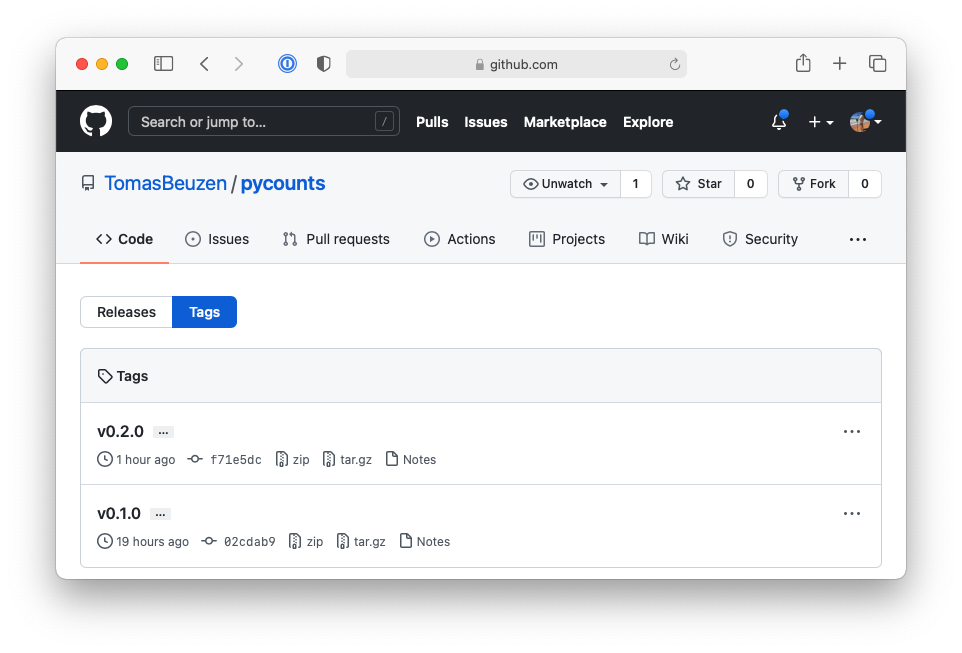
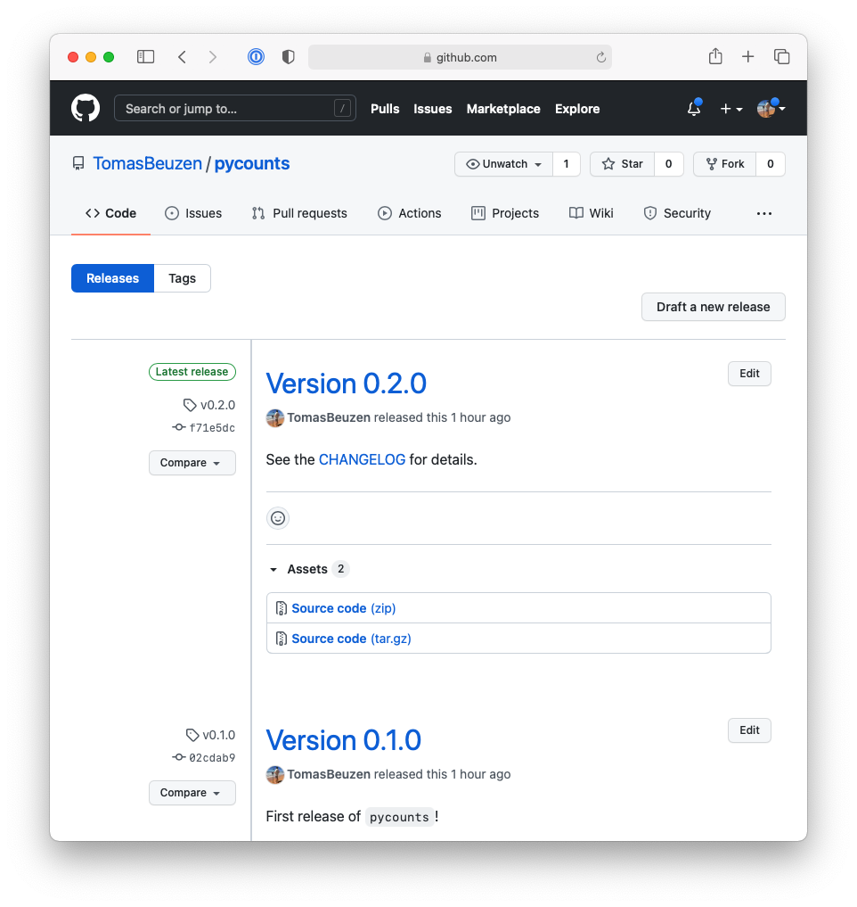

# Releasing and versioning


Previous chapters have focused on how to develop a Python package from scratch by creating the Python source code, developing a testing framework, writing documentation, and then releasing it online via PyPI (if desired). This chapter now describes the next step in the packaging workflow — updating your package!

At any given time, your package's users (including you) will install a particular version of your package in a project. If you change the package's source code, their code could potentially break (imagine you change a module name, or remove a function argument a user was using). To solve this problem, developers assign a unique version number to each unique state of their package and release each new version independently. Most of the time, users will want to use the most up-to-date version of your package, but sometimes, they'll need to use an older version that is compatible with their project. Releasing versions is also an important way of communicating to your users that your package has changed (e.g., bugs have been fixed, new features have been added, etc.).

In this chapter, we'll walk through the process of creating and releasing new versions of your Python package.

## Version numbering

Versioning\index{versioning} is the process of adding unique identifiers to different versions of your package. The unique identifier you use may be name-based or number-based, but most Python packages use [semantic versioning](https://semver.org)\index{semantic versioning}. In semantic versioning, a version number consists of three integers A.B.C, where A is the "major" version, B is the "minor" version, and C is the "patch" version. The first version of a software usually starts at 0.1.0 and increments from there. We call an increment a "bump", and it consists of adding 1 to either the major, minor, or patch identifier as follows:

- **Patch** release\index{versioning!patch} (0.1.0 -> 0.1.**1**): patch releases are typically used for bug fixes, which are backward compatible. Backward compatibility refers to the compatibility of your package with previous versions of itself. For example, if a user was using v0.1.0 of your package, they should be able to upgrade to v0.1.1 and have any code they previously wrote still work. It's fine to have so many patch releases that you need to use two digits (e.g., 0.1.27).
- **Minor** release\index{versioning!minor} (0.1.0 -> 0.**2**.0): a minor release typically includes larger bug fixes or new features that are backward compatible, for example, the addition of a new function. It's fine to have so many minor releases that you need to use two digits (e.g., 0.13.0).
- **Major** release\index{versioning!major} (0.1.0 -> **1**.0.0): release 1.0.0 is typically used for the first stable release of your package. After that, major releases are made for changes that are not backward compatible and may affect many users. Changes that are not backward compatible are called "breaking changes". For example, changing the name of one of the modules in your package would be a breaking change; if users upgraded to your new package, any code they'd written using the old module name would no longer work, and they would have to change it.

Most of the time, you'll be making patch and minor releases. We'll discuss major releases, breaking changes\index{breaking change}, and how to deprecate package functionality (i.e., remove it) more in **Section \@ref(breaking-changes-and-deprecating-package-functionality)**.

Even with the guidelines above, versioning a package can be a little subjective and requires you to use your best judgment. For example, small packages might make a patch release for each individual bug fixed or a minor release for each new feature added. In contrast, larger packages will often group multiple bug fixes into a single patch release or multiple features into a single minor release, because making a release for every individual change would result in an overwhelming and confusing amount of releases! Table \@ref(tab:07-release-table) shows some practical examples of major, minor, and patch releases made for the Python software itself. To formalize the circumstances under which different kinds of releases should be made, some developers create a "version policy" document for their package; the `pandas` [version policy](https://pandas.pydata.org/docs/development/policies.html#version-policy) is a good example of this.

Table: (\#tab:07-release-table) Examples of major, minor, and patch releases of Python.

|Release Type|Version Bump|Description|
|:---    |:---   | :---      |
|Major|2.X.X -> 3.0.0 ([December, 2008](https://www.python.org/downloads/release/python-300/))| This release included breaking changes, e.g., `print()` became a function, integer division resulted a float rather than an integer, built-in objects like dictionaries and strings changed considerably, and many old features were removed.|
|Minor|3.8.X -> 3.9.0 ([October, 2020](https://www.python.org/downloads/release/python-390/))| New features and optimizations were added in this release, e.g., string methods to remove prefixes and suffixes (`.removeprefix()`/`.removesuffix()`) were added, and a new parser was implemented for CPython (the engine that compiles and executes your Python code).|
|Patch|3.9.5 -> 3.9.6 ([June, 2021](https://www.python.org/downloads/release/python-396/))| This release contained bug and maintenance fixes, e.g., a confusing error message was updated in the `str.format()` method, and the version of `pip` bundled with Python downloads was updated from 21.1.2 -> 21.1.3, and parts of the documentation were updated.|


\newpage

## Version bumping

While we'll discuss the full workflow for releasing a new version of your package in **Section \@ref(checklist-for-releasing-a-new-package-version)**, we first want to dicuss version bumping. That is, how to increment the version of your package when you're preparing a new release. This can be done manually or automatically as we'll show below.

### Manual version bumping

Once you've decided what the new version\index{versioning!manual} of your package will be (i.e., are you making a patch, minor, or major release) you need to update the package's version number in your source code. For a `poetry`-managed project\index{poetry}, that information is in the *`pyproject.toml`* file\index{pyproject.toml}. Consider the *`pyproject.toml`* file of the `pycounts` package we developed in **Chapter 3: [How to package a Python]**, the top of which looks like this:

```toml
[tool.poetry]
name = "pycounts"
version = "0.1.0"
description = "Calculate word counts in a text file!"
authors = ["Tomas Beuzen"]
license = "MIT"
readme = "README.md"

...rest of file hidden...
```

Imagine we wanted to make a patch release of our package. We could simply change the `version` number manually in this file to "0.1.1", and many developers do take this manual approach. An alternative method is to use the `poetry version` command. The `poetry version` command can be used with the arguments `patch`, `minor`, or `major` depending on how you want to update the version of your package. For example, to make a patch release, we could run the following at the command line:

>If you're building the `pycounts` package with us in this book, you don't have to run the below command, it is just for demonstration purposes. We'll make a new version of `pycounts` later in this chapter.

```bash
$ poetry version patch
```

```md
Bumping version from 0.1.0 to 0.1.1
```

This command changes the `version` variable in the `pyproject.toml` file:

```toml
[tool.poetry]
name = "pycounts"
version = "0.1.1"
description = "Calculate word counts in a text file!"
authors = ["Tomas Beuzen"]
license = "MIT"
readme = "README.md"

...rest of file hidden...
```

### Automatic version bumping

<!-- #region -->
In this book, we're interested in automating as much as possible of the packaging workflow. While the manual versioning approach described above in **Section \@ref(manual-version-bumping)** is certainly used by many developers, we can do things more efficiently! To automate version bumping\index{versioning!automatic}, you'll need to be using a version control system like Git. If you are not using version control\index{version control} for your package, you can skip to **Section \@ref(checklist-for-releasing-a-new-package-version)**.

[Python Semantic Release\index{versioning!Python Semantic Release}\index{Python Semantic Release} (PSR)](https://python-semantic-release.readthedocs.io/en/latest/) is a tool that can automatically bump version numbers based on keywords it finds in commit messages. The idea is to use a standardized commit message format and syntax, which PSR can parse to determine how to increment the version number. The default commit message format used by PSR is the [Angular commit style](https://github.com/angular/angular.js/blob/master/DEVELOPERS.md#commit-message-format), which looks like this:

```md
<type>(optional scope): short summary in present tense

(optional body: explains motivation for the change)

(optional footer: note BREAKING CHANGES here, and issues to be closed)
```

\newpage

`<type>` refers to the kind of change made and is usually one of:

- `feat`: A new feature.
- `fix`: A bug fix.
- `docs`: Documentation changes.
- `style`: Changes that do not affect the meaning of the code (white-space, formatting, missing semi-colons, etc).
- `refactor`: A code change that neither fixes a bug nor adds a feature.
- `perf`: A code change that improves performance.
- `test`: Changes to the test framework.
- `build`: Changes to the build process or tools.

`scope` is an optional keyword that provides context for where the change was made. It can be anything relevant to your package or development workflow (e.g., it could be the module or function name affected by the change).

Different text in the commit message will trigger PSR to make different kinds of releases:

- A `<type>` of `fix` triggers a patch version bump, e.g.:

    ```bash
    $ git commit -m "fix(mod_plotting): fix confusing error message in \
                     plot_words"
    ```

- A `<type>` of `feat` triggers a minor version bump, e.g.:

    ```bash
    $ git commit -m "feat(package): add example data and new module to \
                     package"
    ```

- The text `BREAKING CHANGE:` in the `footer` will trigger a major release, e.g.: 

    ```bash
    $ git commit -m "feat(mod_plotting): move code from plotting module \
                     to pycounts module
    $ 
    $ BREAKING CHANGE: plotting module wont exist after this release."
    ```

To use PSR we need to install and configure it. To install PSR as a development dependency of a `poetry`-managed project, you can use the following command:

```bash
$ poetry add --dev python-semantic-release
```

To configure PSR, we need to tell it where the version number of our package is stored. The package version is stored in the *`pyproject.toml`* file for a `poetry`-managed project. It exists as the variable `version` under the table `[tool.poetry]`. To tell PSR this, we need to add a new table to the *`pyproject.toml`* file called `[tool.semantic_release]` within which we specify that our `version_variable` is stored at `pyproject.toml:version`:

```toml
...rest of file hidden...

[tool.semantic_release]
version_variable = "pyproject.toml:version"
```

Finally, you can use the command `semantic-release version` at the command line to get PSR to automatically bump your package's version number. PSR will parse all the commit messages since the last tag of your package to determine what kind of version bump to make. For example, imagine the following three commit messages have been made since tag v0.1.0:

```xml
1. "fix(mod_plotting): raise TypeError in plot_words"
2. "fix(mod_plotting): fix confusing error message in plot_words"
3. "feat(package): add example data and new module to package"
```

PSR will note that there are two "fix" and one "feat" keywords. "fix" triggers a patch release, but "feat" triggers a minor release, which trumps a patch release, so PSR would make a minor version bump from v0.1.0 to v0.2.0.

As a more practical demonstration of how PSR works, imagine we have a package at version 0.1.0, make a bug fix and commit our changes with the following message:

>If you're building the `pycounts` package with us in this book, you don't have to run the below commands, they are just for demonstration purposes. We'll make a new version of `pycounts` later in this chapter.

```bash
$ git add src/pycounts/plotting.py
$ git commit -m "fix(code): change confusing error message in \
  plotting.plot_words"
```

We then run `semantic-release version` to update our version number. In the command below, we'll specify the argument `-v DEBUG` to ask PSR to print extra information to the screen so we can get an inside look at how PSR works:

```bash
$ semantic-release version -v DEBUG
```

```md
Creating new version
debug: get_current_version_by_config_file()
debug: Parsing current version: path=PosixPath('pyproject.toml')
debug: Regex matched version: 0.1.0
debug: get_current_version_by_config_file -> 0.1.0
Current version: 0.1.0
debug: evaluate_version_bump('0.1.0', None)
debug: parse_commit_message('fix(code): change confusing error... )
debug: parse_commit_message -> ParsedCommit(bump=1, type='fix')
debug: Commits found since last release: 1
debug: evaluate_version_bump -> patch
debug: get_new_version('0.1.0', 'patch')
debug: get_new_version -> 0.1.1
debug: set_new_version('0.1.1')
debug: Writing new version number: path=PosixPath('pyproject.toml')
debug: set_new_version -> True
debug: commit_new_version('0.1.1')
debug: commit_new_version -> [main d82fa3f] 0.1.1
debug:  Author: semantic-release <semantic-release>
debug:  1 file changed, 5 insertions(+), 1 deletion(-)
debug: tag_new_version('0.1.1')
debug: tag_new_version -> 
Bumping with a patch version to 0.1.1
```

We can see that PSR found our commit messages, and decided that a patch release was necessary based on the text in the message. We can also see that command automatically updated the version number in the the *`pyproject.toml`* file and created a new version control tag for our package's source (we talked about tags in **Section \@ref(tagging-a-package-release-with-version-control)**). In the next section, we'll go through a real example of using PSR with our `pycounts` package.
<!-- #endregion -->

## Checklist for releasing a new package version

Now that we know about versioning and how to increment the version\index{versioning} of our package, we're ready to run through a release checklist. We'll make a new minor release of the `pycounts` package we've been developing throughout this book, from v0.1.0 to v0.2.0, to demonstrate each step in the release checklist.

### Step 1: make changes to package source files

<!-- #region -->
This is an obvious one, but before you can make a new release, you need to make the changes to your package's source that will comprise your new release!

Consider our `pycounts` package. We published the first release, v0.1.0, of our package in **Chapter 3: [How to package a Python]**. Since then, we've made a few changes. Specifically:

- In **Chapter 4: [Package structure and distribution]**, we added a new "datasets" module to our package along with some example data, a text file of the novel *Flatland* by Edwin Abbott [@abbott1884], that users could load to try out the functionality of our package.
- In **Chapter 5: [Testing]**, we significantly upgraded our testing suite by adding several new unit, integration, and regression tests to the *`tests/test_pycounts.py`* file.

>In practice, if you're using version control, changes are usually made to a package's source using [branches](https://git-scm.com/book/en/v2/Git-Branching-Branches-in-a-Nutshell). Branches isolate your changes so you can develop your package without affecting the existing, stable version. Only when you're happy with your changes do you merge them into the existing source.

<!-- #endregion -->

### Step 2: document your changes

<!-- #region -->
Before we make our new release, we should document everything we've changed in our changelog. For example, here's `pycounts`'s updated *`CHANGELOG.md`* file\index{documentation!changelog}:

>We talked about changelog file format and content in **Section \@ref(changelog)**.

\newpage

```{code-block} xml
---
emphasize-lines: 5
---
# Changelog

<!--next-version-placeholder-->

## v0.2.0 (10/09/2021)

### Feature

- Added new datasets modules to load example data

### Fix

- Check type of argument passed to `plotting.plot_words()`

### Tests

- Added new tests to all package modules in test_pycounts.py

## v0.1.0 (24/08/2021)

- First release of `pycounts`
```

If using version control, you should commit this change to make sure it becomes part of your release:

```bash
$ git add CHANGELOG.md
$ git commit -m "build: preparing for release v0.2.0"
$ git push
```
<!-- #endregion -->

### Step 3: bump version number

Once your changes for the new release are ready, you need to bump the package version manually (**Section \@ref(manual-version-bumping)**) or automatically with the PSR tool (**Section \@ref(automatic-version-bumping)**).

We'll take the automatic route using PSR\index{versioning!Python Semantic Release}\index{Python Semantic Release} here, but if you're not using Git as a version control system, you'll need to do this step manually. The changes we made to `pycounts`, described in the section above, constitute a minor release (we added a new feature to load example data and made some significant changes to our package's test framework). When we committed these changes in **Section \@ref(version-control)** and **Section \@ref(version-control)**, we did so with the following collection of commit messages:

```bash
$ git commit -m "feat: add example data and datasets module"
$ git commit -m "test: add additional tests for all modules"
$ git commit -m "fix: check input type to plot_words function"
```

As we discussed in **Section \@ref(automatic-version-bumping)**, PSR can automatically parse these commit messages to increment our package version for us. If you haven't already, install PSR as a development dependency using `poetry`:

```bash
$ poetry add --dev python-semantic-release
```

This command updated our recorded package dependencies in `pyproject.toml` and `poetry.lock`, so we should commit those changes to version control before we update our package version:

```bash
$ git add pyproject.toml poetry.lock
$ git commit -m "build: add PSR as dev dependency"
$ git push
```

Now we can use PSR to automatically bump our package version with the `semantic-release version` command. If you want to see exactly what PSR found in your commit messages and why it decided to make a patch, minor, or major release, you can add the argument `-v DEBUG`.

>Recall from **Section \@ref(automatic-version-bumping)** that to use PSR, you need to tell it where your package's version number is stored by defining `version_variable = "pyproject.toml:version"` under the `[tool.semantic_release]` table in *`pyproject.toml`*.

```bash
$ semantic-release version
```

```md
Creating new version
Current version: 0.1.0
Bumping with a minor version to 0.2.0
```

This step automatically updated our package's version in the *`pyproject.toml`* file and created a new tag for our package, "v0.2.0", which you could view by typing `git tag --list` at the command line:

```bash
$ git tag --list
```

```md
v0.1.0
v0.2.0
```

### Step 4: run tests and build documentation

We've now prepped our package for release, but before we release it, it's important to check that its tests run and documentation builds successfully. To do this with our `pycounts` package, we should first install the package (we should re-install because we've created a new version):

```bash
$ poetry install
```

```md
Installing the current project: pycounts (0.2.0)
```

Now we'll check that our tests are still passing and what their coverage is using `pytest` and `pytest-cov` (we discussed these tools in **Chapter 5: [Testing]**):

```bash
$ pytest tests/ --cov=pycounts
```

```xml
========================= test session starts =========================

---------- coverage: platform darwin, python 3.9.6-final-0 -----------
Name                            Stmts   Miss  Cover
---------------------------------------------------
src/pycounts/__init__.py            2      0   100%
src/pycounts/data/__init__.py       0      0   100%
src/pycounts/datasets.py            5      0   100%
src/pycounts/plotting.py           12      0   100%
src/pycounts/pycounts.py           16      0   100%
---------------------------------------------------
TOTAL                              35      0   100%

========================== 7 passed in 0.41s ==========================
```

Finally, to check that documentation still builds correctly you typically want to create the documentation from scratch, i.e., remove any existing built documentation in your package and then building it again. To do this, we first need to run `make clean --directory docs/` before running `make html --directory docs/` (we discussed building documentation with these commands in **Chapter 6: [Documentation]**). In the spirit of efficiency we can combine these two commands together like we do below:

```bash
$ make clean html --directory docs/
```

```md
Running Sphinx
...
build succeeded.
The HTML pages are in _build/html.
```

Looks like everything is working!

### Step 5: Tag a release with version control

For those using remote version control on GitHub (or similar), it's time to tag\index{version control!tag} a new release\index{version control!release} of your repository on GitHub\index{GitHub}. If you're not using version control, you can skip to the next section. We discussed how to tag a release and why we do this in **Section \@ref(tagging-a-package-release-with-version-control)**. Recall that it's a two-step process:

1. Create a tag marking a specific point in a repository's history using the command `git tag`.
2. On GitHub, create a release of your repository based on the tag.

If using PSR to bump your package version, then step 1 was done automatically for you. If you didn't use PSR, you can make a tag manually using the following command:

```bash
$ git tag v0.2.0
```

You can now push any local commits and your new tag to GitHub with the following commands:

```bash
$ git push
$ git push --tags
```

After running those commands for our `pycounts` package, we can go to GitHub and navigate to the "Releases" tab to see our tag, as shown in Fig. \@ref(fig:07-tag-fig).

```{r 07-tag-fig, fig.cap = "Tag of v0.2.0 of pycounts on GitHub.", out.width = "100%", fig.retina = 2, fig.align = "center", echo = FALSE, message = FALSE, warning = FALSE}

```

\newpage

To create a release from this tag, click "Draft a new release". You can then identify the tag from which to create the release and optionally add a description of the release; often, this description links to the changelog, where changes have already been documented. Fig. \@ref(fig:07-release-1-fig) shows the release of v0.2.0 of `pycounts` on GitHub.

\newpage

```{r 07-release-1-fig, fig.cap = "Release v0.2.0 of pycounts on GitHub.", out.width = "100%", fig.retina = 2, fig.align = "center", echo = FALSE, message = FALSE, warning = FALSE}

```

### Step 6: build and release package to PyPI

It's now time to build the new distributions\index{distribution} for our package (i.e., the sdist and wheel — we talked about these in **Section \@ref(package-distribution-and-installation)**). We can do that with `poetry` using the following command:

```bash
$ poetry build
```

\newpage

```md
Building pycounts (0.2.0)
  - Building sdist
  - Built pycounts-0.2.0.tar.gz
  - Building wheel
  - Built pycounts-0.2.0-py3-none-any.whl
```

You can now use and share these distributions as you please, but most developers will want to upload them to PyPI, which is what we'll do here.

As discussed in **Section \@ref(publishing-to-testpypi)**, it's good practice to release your package on [TestPyPI](https://test.pypi.org/) before PyPI\index{PyPI}, to test that everything is working as expected. We can do that with `poetry publish`:

```bash
$ poetry publish -r test-pypi
```

>The above command assumes that you have added TestPyPI to the list of repositories `poetry` knows about via: `poetry config repositories.test-pypi https://test.pypi.org/legacy/`

Now you should be able to try and download your package from TestPyPI\index{TestPyPI} with the following command:

```bash
$ pip install --index-url https://test.pypi.org/simple/ pycounts
```

>By default `pip install` will search PyPI for the named package. The argument `--index-url` points `pip` to the TestPyPI index instead. If your package has dependencies that a developer did not upload to TestPyPI, you'll also need to tell `pip` that it can search for them on PyPI with the following argument: `--extra-index-url https://pypi.org/simple`.

If you're happy with how your newly versioned package is working, you can go ahead and publish to PyPI:

```bash
$ poetry publish
```

## Automating releases

As you've seen in this chapter, there are quite a few steps to go through in order to make a new release of a package. In **Chapter 8: [Continuous integration and deployment]** we'll see how we can automate the entire release process, including running tests, building documentation, and publishing to TestPyPI and PyPI.

## Breaking changes and deprecating package functionality

<!-- #region -->
As discussed earlier in the chapter, major version releases may come with backward incompatible changes, which we call "breaking changes\index{breaking change}". Breaking changes affect your package's user base. The impact and importance of breaking changes is directly proportional to the number of people using your package. That's not to say that you should avoid breaking changes — there are good reasons for making them, such as improving software design mistakes, improving functionality, or making code simpler and easier to use.

If you do need to make a breaking change, it is best to implement that change gradually, by providing adequate warning and advice to your package's user base through "deprecation\index{deprecation} warnings".

We can add a deprecation warning to our code by using the `warnings` [module](https://docs.python.org/3/library/warnings.html) from the Python standard library. For example, imagine that we want to remove the `get_flatland()` function from the `datasets` module of our `pycounts` package in the upcoming major v1.0.0 release. We can do this by adding a `FutureWarning` to our code, as shown in the *`datasets.py`* module below (we created this module back in **Section \@ref(including-data-in-a-package)**).

\newpage

>If you've used any larger Python libraries before (such as `NumPy`, `Pandas` or `scikit-learn`) you probably have seen deprecation warnings before! On that note, these large, established Python libraries offer great resources for learning how to properly manage your own package — don't be afraid to check out their source code and history on GitHub.

```python
from importlib import resources
import warnings

def get_flatland():
    """Get path to example "Flatland" [1]_ text file.

    ...rest of docstring hidden...
    """
    warnings.warn("This function will be deprecated in v1.0.0.", 
                  FutureWarning)
    
    with resources.path("pycounts.data", "flatland.txt") as f:
        data_file_path = f
    return data_file_path
```

If we were to try and use this function now, we would see the `FutureWarning` printed to our output:

```python
>>> from pycounts.datasets import get_flatland
>>> flatland_path = get_flatland()
```

```md
FutureWarning: This function will be deprecated in v1.0.0.
```

A few other things to think about when making breaking changes:

- If you're changing a function significantly, consider keeping both the legacy version (with a deprecation warning) and new version of the function for a few releases to help users make a smoother transition to using the new function.
- If you're deprecating a lot of code, consider doing it in small increments over multiple releases.
- If your breaking change is a result of one of your package's dependencies changing, it is often better to warn your users that they require a newer version of a dependency rather than immediately making it a required dependency of your package.
- Documentation is key! Don't be afraid to be verbose about documenting breaking changes in your package's documentation and changelog.
<!-- #endregion -->
