# Continuous integration and deployment

<!-- #region -->
If you've gotten this far, you now have a working knowledge of how to create a fully-featured Python package! We went through quite a lot to get here: we learned about package structure, developed source code, created tests, wrote documentation, and learned how to release new versions of a package.

As you continue to develop your package into the future it would be helpful to automate many of these workflows so you and your collaborators can focus more on writing code and less on the nuances of packaging and testing. This is where continuous integration\index{continuous integration} (CI) and continuous deployment\index{continuous deployment} (CD) come in! CI/CD\index{CI/CD} generally refers to the automated testing, building, and deployment of software. In this chapter, we'll first introduce CI/CD and walk through how to set it up with the GitHub Actions service. After that, we'll show how to set up CI/CD for a Python package, demonstrating concepts using the `pycounts` package we've been developing throughout this book.

>This chapter requires basic familiarity with Git and GitHub or similar version control\index{version control} tools. To learn more about Git and GitHub, we recommend the following resources: [*Happy Git and GitHub for the useR*](https://happygitwithr.com) [@bryan2021] and [*Research Software Engineering with Python*](https://merely-useful.tech/py-rse/git-cmdline.html) [@rsep2021].

<!-- #endregion -->

## An introduction to CI/CD

Continuous integration\index{continuous integration} (CI) refers to the process of automatically evaluating your code as it is updated by yourself and contributors, to try and catch any potential issues your updates have caused. A CI workflow typically includes automatic execution of many of the steps we've seen throughout this book, such as running tests, calculating code coverage, and building documentation, among others.

Continuous deployment\index{continuous deployment} (CD) is the process of automating the deployment of new versions of your software to e.g., PyPI, from changes that have made it through CI.

CI/CD\index{CI/CD} can automate the packaging workflows that we've done manually throughout this book and can ultimately save you time and help you release new versions of your package quickly. CI/CD also helps others contribute to your package, because the process of updating your package is automated and doesn't depend on one person's expert knowledge (i.e., yours) of how to make releases manually. Even if your package won't be updated very often, setting up CI/CD is still beneficial because it means you don't have to remember all the manual steps required to make a release of your package (which can be daunting and deter you from wanting to update and maintain your package).

## CI/CD tools

<!-- #region -->
You could manually write and execute a CI/CD workflow by, for example, writing scripts that execute all of the steps we've walked through in previous chapters (i.e., running tests, building documented, build and release distributions, etc.). However, this process is not efficient or scalable, and it does not work well if more than one person (i.e., you) is contributing to your code.

It is therefore more common to use a CI/CD service to implement CI/CD. These services essentially do what we described above but in an automated manner; we define a workflow, which these services will automatically run at certain "trigger events", which we can also define (for example, merging new code into the "main" branch of a GitHub repository might trigger the automatic deployment of a new version of the software).

There are many CI/CD services out there — such as [GitHub Actions](https://docs.github.com/en/actions)\index{GitHub Actions}, [Travis CI](https://www.travis-ci.com), and [CircleCi](https://circleci.com). We'll be using GitHub Actions in this chapter, which is a service for executing CI/CD workflows for software stored in a GitHub repository. We'll introduce how to use GitHub Actions in the next section.

\newpage

>GitHub Actions is free for public repositories and includes a generous amount of free minutes for private repositories. Read more in the GitHub Actions [documentation](https://docs.github.com/en/billing/managing-billing-for-github-actions/about-billing-for-github-actions).

<!-- #endregion -->

## Introduction to GitHub Actions

### Key concepts

GitHub Actions\index{GitHub Actions} is a service for executing CI/CD workflows. The general idea is to create a set of commands that GitHub Actions will run on our behalf. We call this set of commands a "workflow". A GitHub Actions workflow is defined in a *.yml* file and contains the set of "actions" we want GitHub Actions to run for us (such as running our tests with `pytest` or building our documentation with `sphinx`). Actions are organized as "steps" in a workflow (e.g., step 1: run tests, step 2: build documentation), which in turn are organized into "jobs" (e.g., job 1: continuous integration). A workflow is executed on a machine provided by GitHub Actions called a "runner", when triggered by a particular "event" (like merging code into the `main` branch of a repository).

That's a lot to take in, but don't worry! All this terminology is summarized in Table \@ref(tab:08-actions-table), and we'll walk through an example of using GitHub Actions, which refers to this terminology in the next section.

Table: (\#tab:08-actions-table) Terminology used in GitHub Actions.

|Keyword|Description|
|:---   | :---      |
|Actions|Individual tasks you want to perform.|
|Workflow|A collection of actions (specified together in one file).|
|Event|Something that triggers the running of a workflow.|
|Runner|A machine that can run the Github Action(s).|
|Job|A set of steps executed on the same runner.|
|Step|A set of commands or actions which a job executes.|


### A toy example

In this section, we'll walk through a simple example of running a workflow with GitHub Actions. The workflow will contains actions that simply print some things to the GitHub Actions runner's terminal using the `echo` command, when a change is made to a repository's content.

- **Step 1**

    Create a new repository on GitHub named anything you like (we called our repository "actions-example"). Click on the "Actions" tab, and then click the "Set up this workflow" button as shown in Fig. \@ref(fig:08-example-1-fig).

```{r 08-example-1-fig, fig.cap = "Setting up our first GitHub Actions workflow.", out.width = "100%", fig.retina = 2, fig.align = "center", echo = FALSE, message = FALSE, warning = FALSE}
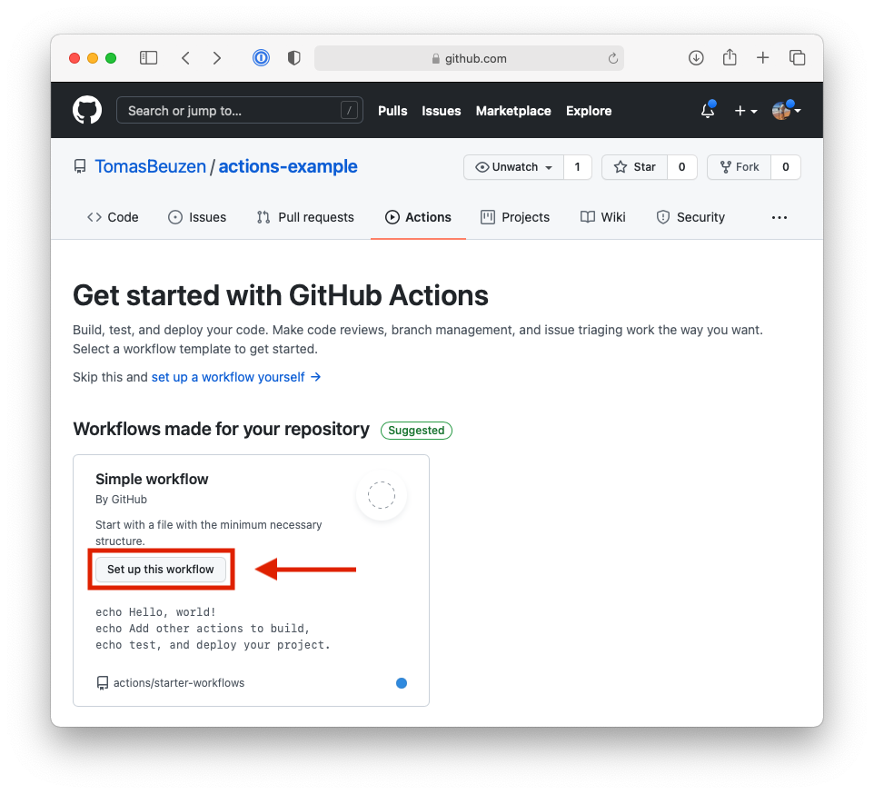
```

- **Step 2**

    Commit the *.yml* file that has been created for you to your repository by clicking "Start commit" and then "Commit new file". Then, open the file on GitHub. You should see the contents below. All the terminology we defined in **Section \@ref(key-concepts)** exists in this workflow file, and each line is commented to describe exactly what it does. For example, we can see that:
    - This workflow is triggered `on` any push or pull request made to the main branch.
    - It consists of one job called `build`.
    - The job will run on `ubuntu-latest` (the latest version of the Ubuntu runner GitHub Actions provides).
    - It contains three `steps`. The first step "checks out" the repository — this is necessary for the runner to access your repository. The second step will print "Hello, world!" to the runner's terminal. The final step will print two lines.  We'll discuss steps and how to write them in **Section \@ref(actions-and-commands)**.

    ```yaml
    # This is a basic workflow to help you get started with Actions
    
    # Name of the workflow
    name: CI

    # Controls when the workflow will run
    on:
      # Triggers the workflow on push or pull request events but only for 
      # the main branch
      push:
        branches: [ main ]
      pull_request:
        branches: [ main ]

      # Allows you to run this workflow manually from the Actions tab
      workflow_dispatch:

    # A workflow run is made up of one or more jobs that can run 
    # sequentially or in parallel
    jobs:
      # This workflow contains a single job called "build"
      build:
        # The type of runner that the job will run on
        runs-on: ubuntu-latest

        # Steps represent a sequence of tasks that will be executed as 
        # part of the job
        steps:
          # Checks-out your repository so your job can access it
          - uses: actions/checkout@v2

          # Runs a single command using the runners shell
          - name: Run a one-line script
            run: echo Hello, world!

          # Runs a set of commands using the runners shell
          - name: Run a multi-line script
            run: |
              echo Add other actions to build,
              echo test, and deploy your project.
    ```

- **Step 3**

    Now, go to the "Actions" tab of your repository. You should see one workflow run, as in Fig. \@ref(fig:08-example-2-fig). This workflow ran because in **Step 2** we committed our workflow *.yml* file to the `main` branch of our repository, and the workflow is triggered to execute on any push or pull request with the `main` branch.

```{r 08-example-2-fig, fig.cap = "Our first GitHub Actions workflow.", out.width = "100%", fig.retina = 2, fig.align = "center", echo = FALSE, message = FALSE, warning = FALSE}
knitr::include_graphics("../images/08-example-2.png")
```

- **Step 4**

    Look at the logs of the executed workflow by clicking on the "Create blank.yml" workflow, then clicking the "build" job in the left-hand panel. Click on arrows inside the build logs to examine their output. You should be able to see output printed to the screen for the "Run a one-line script" and "Run a multi-line script" steps in our workflow, as shown in Fig. \@ref(fig:08-example-3-fig).

```{r 08-example-3-fig, fig.cap = "The logs of our first GitHub Actions workflow.", out.width = "100%", fig.retina = 2, fig.align = "center", echo = FALSE, message = FALSE, warning = FALSE}
knitr::include_graphics("../images/08-example-3.png")
```

We'll practice writing workflows for implementing CI and CD for a Python package in the following sections of this chapter, but at this point, the high-level concepts to be aware of are:

- A workflow is a set of commands that are triggered to execute by certain events (like a push to the `main` branch of a repository).
- A workflow is run on a machine called a runner, which uses a particular operating system and is hosted by the CI/CD service.
- A workflow contains one or more jobs.
- Each job contains one or more steps to execute. In GitHub Actions, steps comprise either "actions" or "commands" as we'll discuss in the next section.


### Actions and commands

As we saw in the workflow file in **Section \@ref(a-toy-example)**, a step in a GitHub Actions can be an "action" (specified with the keyword `uses`) or a "command" (specified with keyword `run`). We'll briefly explain the difference between these two concepts here.

Steps that use command line commands consist of a `name` and a `run` key, as shown in the example below: 

```yaml
# Runs a single command using the runners shell
- name: Run a one-line script
  run: echo Hello, world!
```

Anything after the `run` key will be executed at the runner's command line. You can run multiple commands in a single step using the `|` character:

```yaml
# Runs a set of commands using the runners shell
- name: Run a multi-line script
  run: |
    echo Add other actions to build,
    echo test, and deploy your project.
```

In contrast to commands, actions are reusable units of code that perform a particular task without having to write out any commands. You'll typically use actions that have been created by others and shared on the [GitHub Marketplace](https://github.com/marketplace?type=). Actions are specified with the `uses` keyword, followed by the name of the action you want to use. The `@` symbol is used to specify which version of the action you want to use, like in the example below:

```yaml
# Checks-out your repository so your job can access it
- uses: actions/checkout@v2
```

Some actions can also be configured with inputs using the `with` key, as in the example below:

```yaml
# Set up a Python environment for use in actions
- uses: actions/setup-python@v2
  with:
    python-version: 3.9
```

## Setting up continuous integration

Now that we have a basic familiarity with GitHub Actions, in this section we'll build up a continuous integration\index{continuous integration} workflow for a Python package. We'll create this workflow for the `pycounts` package we've been developing throughout this book. However, it will be applicable to any Python package, and it should be straightforward to see how you can modify it to your needs.

Our goal here is to create a CI workflow that will install our package with `poetry`, run our package's tests with `pytest`, and build its documentation with `sphinx`, every time someone makes a push or pull request of changes to the `main` branch of the `pycounts` GitHub repository. These are steps we, or a collaborator, would usually perform locally every time our package is changed, so it makes sense to automate them.

### Setup

<!-- #region -->
To set up a workflow with GitHub Actions, we need to create a workflow file. Workflow files are *.yml* files located in a *`.github/workflows/`* directory in the root package directory. We'll call our file *`ci-cd.yml`*. You can create that file in an editor of your choice, or by running the following commands at the command line, from your root package directory:

```bash
$ mkdir -p .github/workflows
$ touch .github/workflows/ci-cd.yml
```

Your package directory structure should now look something like the following:

\newpage

```md
pycounts
├── .github             <--------
│   └── workflows       <--------
│       └── ci-cd.yml   <--------
├── .readthedocs.yml
├── CHANGELOG.md
├── CONDUCT.md
├── CONTRIBUTING.md
├── docs
│   └── ...
├── LICENSE
├── README.md
├── poetry.lock
├── pyproject.toml
├── src
│   └── ...
└── tests
    └── ...
```

Open this new *`ci-cd.yml`* file in an editor. We are going to set up a CI workflow that triggers when someone pushes new content or makes a pull-request to the `main` branch of our repository. To set this up, copy and paste the following text into *`ci-cd.yml`*:

>When building our CI workflow, we'll be using the same syntax and terminology we described previously in **Section \@ref(introduction-to-github-actions)**. Don't be afraid to revise that section as needed.

```yaml
name: ci-cd

on:
  push:
    branches:
      - main
  pull_request:
    branches:
      - main
```

\newpage

Now we need to set up the steps that will be executed if one of the above trigger events occurs. GitHub Actions essentially provides you with a blank operating system of your choice (a "runner"), which we need to set up based on what steps we are going to want it to execute. In our case, we need to install Python and install `poetry` on the runner, so that we can then install our packages and run its tests and build its documentation. Thus, our setup will involve the steps below, for which we've indicated whether step will use an action or command(s) (**Section \@ref(actions-and-commands)**):

1. Specify an operating system. We'll be using Ubuntu with the syntax `runs-on: ubuntu-latest`. MacOS and Windows are also available if you wish to test your package on those systems, but Ubuntu is a good default to use — see the GitHub Actions [documentation](https://docs.github.com/en/actions/using-github-hosted-runners/about-github-hosted-runners#supported-runners-and-hardware-resources)).
2. Install Python (action: [actions/setup-python@v2](https://github.com/actions/setup-python)).
3. Checkout our repository so we can access its contents (action: [actions/checkout@v2](https://github.com/actions/checkout)).
4. Install `poetry` (action: [snok/install-poetry@v1](https://github.com/snok/install-poetry)).
5. Use `poetry` to install `pycounts` (command: `poetry install`).

We'll add all these steps to our workflow in a job called "ci":

```yaml
name: ci-cd

on:
  push:
    branches:
      - main
  pull_request:
    branches:
      - main

jobs:
  ci:
    # Step 1. Set up operating system
    runs-on: ubuntu-latest
    steps:
    # Step 2. Set up Python 3.9
    - uses: actions/setup-python@v2
      with:
        python-version: 3.9
    # Step 3. Check-out repository so we can access its contents
    - uses: actions/checkout@v2
    # Step 4. Install poetry
    - uses: snok/install-poetry@v1
    # Step 5. Install our pycounts package
    - name: Install package
      run: poetry install
```

The above steps will set up our system in preparation for:

1. Running `pycounts`'s unit tests with `pytest`.
2. Checking the code coverage of our tests.
3. Checking that `pycounts`'s documentation builds correctly.

We'll create each of these steps in the following sections.
<!-- #endregion -->

### Running tests

<!-- #region -->
Remember all the hard work we put into writing tests for our package back in the **Chapter 5: [Testing]**? Well, we likely want to make sure that these tests (and any others that we add) continue to pass for any new changes proposed to our package. 

Recall that we used `pytest` as the testing framework for our `pycounts` package. This is listed as a development dependency of our package, so it will already be installed on our runner from "Step 5" when we execute `poetry install`. Therefore, we just need to add a new step to our workflow with a command to run `pytest`. Because our runner is not using a `conda` virtual environment, `poetry` sets one up automatically when `poetry install` is executed. We need to explicitly tell `poetry` to use this virtual environment it set up for us by prefixing commands with `poetry run`, as we do below:

```yaml
    # Step 6. Run tests for pycounts
    - name: Test with pytest
      run: poetry run pytest tests/ --cov=pycounts --cov-report=xml
```

\newpage

>We could install `conda` on our runner and set up a virtual environment if we wanted to. But this is a lot of overhead for a workflow that is just going to run tests and build documentation, so we've decided not to do that here.

Note that in the command above we are also obtaining our test coverage through the `--cov` argument and outputting a report to *.xml* format with the `--cov-report` argument (these require the `pytest-cov` package which we used and added as a dependency of our package in **Section \@ref(calculating-coverage)**). In the next section, we will integrate another service called [Codecov](https://codecov.io/) into our workflow that will automatically record test coverage for us using the *.xml* report.
<!-- #endregion -->

### Recording code coverage

<!-- #region -->
In the previous step, we ran the tests for our `pycounts` package. However, if someone adds new code to your package but forgets to write tests for that new code, your existing tests will still pass, but the coverage will be reduced. So, we probably want to track code coverage in our CI workflow.

To do this, we could print the coverage to our runner's build log, but having the coverage buried in those logs is not overly helpful. Instead, it's common to use a service like [Codecov](https://codecov.io/) to track our code coverage for us. To set up Codecov, first create a Codecov account by linking it with your GitHub account, as described in the Codecov [documentation](https://docs.codecov.com/docs) (Codecov also supports GitLab and Bitbucket). Once you've done this, Codecov automatically syncs with all the repositories that you have access to. Now, to use Codecov to automatically track code coverage as part of our CI workflow we can use the action they've created called [codecov/codecov-action@v2](https://github.com/marketplace/actions/codecov), as below:

>If your GitHub repository is private, you'll need to provide an "upload token" to allow Codecov to access it as described in the Codecov [documentation](https://github.com/marketplace/actions/codecov). 

```yaml
    # Step 7. Use Codecov to track coverage
    - uses: codecov/codecov-action@v2
      with:
        files: ./coverage.xml   # coverage report
        fail_ci_if_error: true  # terminate workflow if an error occurs
```

With this step in our workflow, coverage will automatically be recorded for each new proposed change to our code. Codecov can show you whether coverage has increased or decreased, by how much, and will link to relevant areas of your package's source code. This information will automatically appear on any pull request someone makes to the `main` branch on GitHub, or it can be viewed anytime on the Codecov website; for example, Fig. \@ref(fig:08-cov-fig) shows the coverage dashboard for a package called `pypkgs`, where coverage decreased significantly after the most recent commit.

```{r 08-cov-fig, fig.cap = "Example of the Codecov dashboard linked to a repository called pypkgs. Coverage decreased significantly after the most recent commit.", out.width = "100%", fig.retina = 2, fig.align = "center", echo = FALSE, message = FALSE, warning = FALSE}
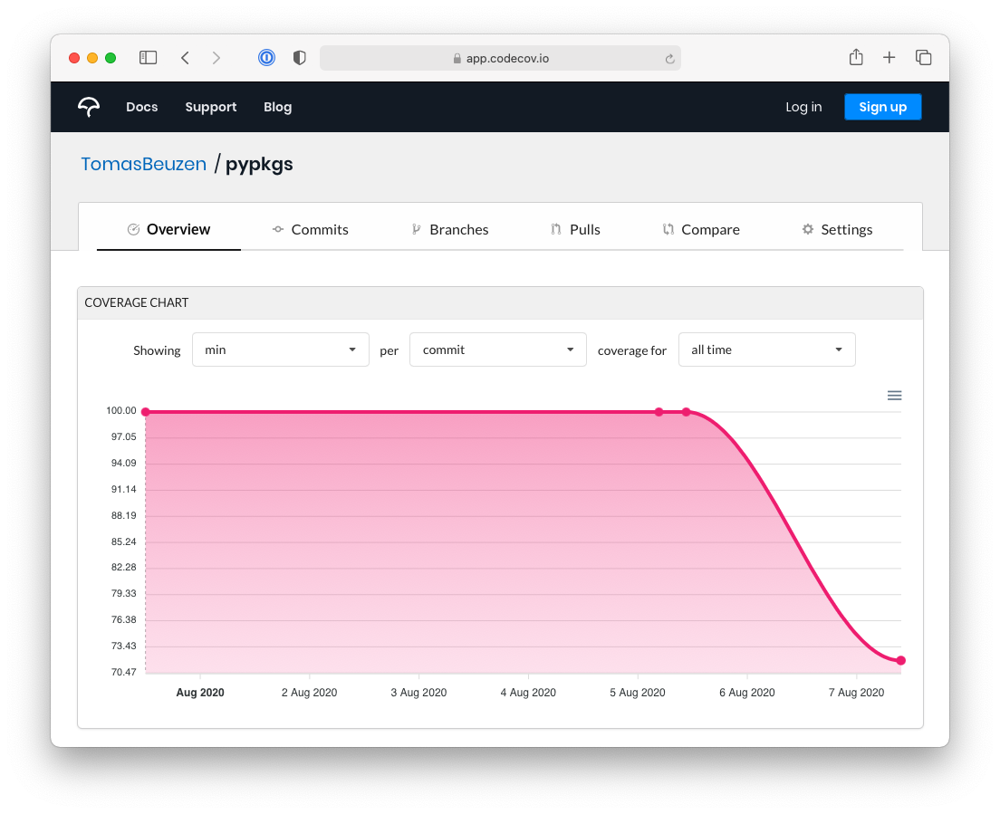
```
<!-- #endregion -->

### Build documentation

The final step we'll add to our CI workflow will be to check that our documentation builds without issue. We'll use the same `make html` command we've used throughout this book to build documentation with `sphinx` to do this:

```yaml
    # Step 8. Build documentation
    - name: Build documentation
      run: poetry run make html --directory docs/
```

### Testing continuous integration

We've now set up our CI pipeline! Our final *`.github/workflows/ci-cd.yml`* file looks like this:

```yaml
name: ci-cd

on:
  push:
    branches:
      - main
  pull_request:
    branches:
      - main

jobs:
  ci:
    # Step 1. Set up operating system
    runs-on: ubuntu-latest
    steps:
    # Step 2. Set up Python 3.9
    - uses: actions/setup-python@v2
      with:
        python-version: 3.9
    # Step 3. Check-out repository so we can access its contents
    - uses: actions/checkout@v2
    # Step 4. Install poetry
    - uses: snok/install-poetry@v1
    # Step 5. Install our pycounts package
    - name: Install package
      run: poetry install
    # Step 6. Run tests for pycounts
    - name: Test with pytest
      run: poetry run pytest tests/ --cov=pycounts --cov-report=xml
    # Step 7. Use Codecov to track coverage
    - uses: codecov/codecov-action@v2
      with:
        files: ./coverage.xml   # coverage report
        fail_ci_if_error: true  # terminate workflow if an error occurs
    # Step 8. Build documentation
    - name: Build documentation
      run: poetry run make html --directory docs/
```

We're now ready to test out our workflow! Let's go ahead and commit our workflow file to version control and push it to GitHub. This will trigger our workflow because we configured it to run when someone pushes to the "main" branch of our repository.

```bash
$ git add .github/workflows/ci-cd.yml
$ git commit -m "build: add CI workflow"
$ git push
```

Now if we go to our `pycounts` GitHub repository and click on the "Actions" tab, we should see our workflow, as shown in Fig. \@ref(fig:08-ci-1-fig):

```{r 08-ci-1-fig, fig.cap = "Successfully run continuous integration workflow on GitHub.", out.width = "100%", fig.retina = 2, fig.align = "center", echo = FALSE, message = FALSE, warning = FALSE}
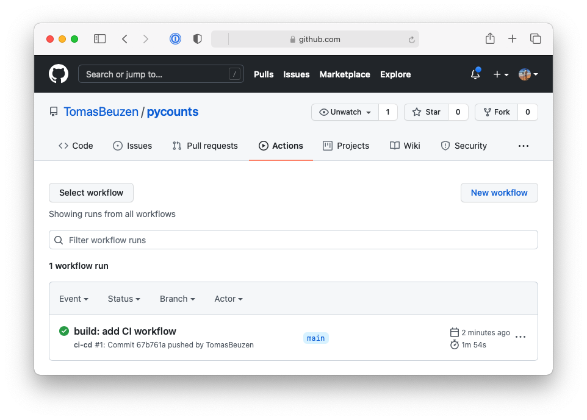
```

We can investigate the build logs by clicking the "ci" job as in Fig. \@ref(fig:08-ci-2-fig):

```{r 08-ci-2-fig, fig.cap = "Continuous integration workflow logs.", out.width = "100%", fig.retina = 2, fig.align = "center", echo = FALSE, message = FALSE, warning = FALSE}
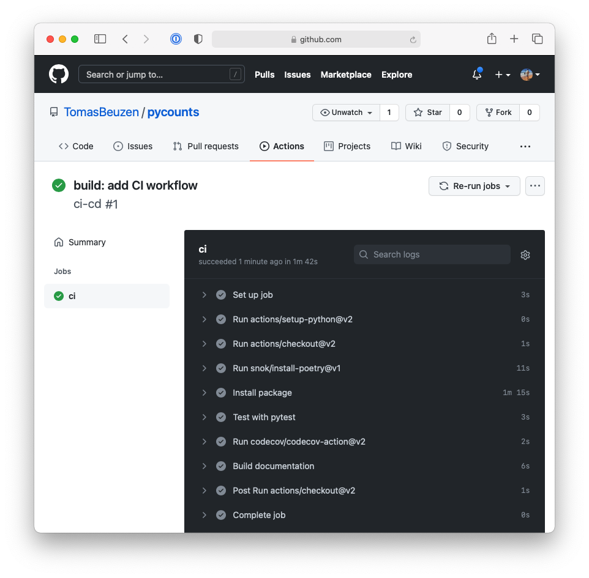
```

This workflow will trigger anytime someone makes a push or pull request with the `main` branch. Now you, or your collaborators, don't have to worry about remembering all these steps or running them manually! In the next section, we'll take this automation to the next level, and set up a workflow to automatically deploy a new version of our package if proposed changes pass the CI workflow.

## Setting up continuous deployment

In the previous step, we set up CI for our package to check that tests run, code coverage is stable, and documentation still builds, whenever we make a push or pull request with new changes to the `main` branch of our repository.

In this section, we'll set up continuous deployment\index{continuous deployment} (CD). If the changes we push to our repository pass our CI, then we want a CD workflow that will automatically:

1. Create a new version of our `pycounts` package.
2. Build new distributions (i.e., sdist and wheel).
3. Upload the distributions to TestPyPI and test that the package can be installed successfully.
4. Upload the distributions to PyPI.

We'll build up that CD workflow in this section.

### Setup

To set up CD, we'll add to the *`.github/workflows/ci-cd.yml`* workflow file we created in **Section \@ref(setting-up-continuous-integration)**. Our aim here is to add a new job called "cd" to this workflow that will trigger a deployment of our package each time updated code is pushed to the `main` branch of our repository. We only want this job to execute if:

1. The "ci" job passes — we don't want to deploy a new version of our package if it isn't passing CI. We can specify this constraint using the `needs` keyword in GitHub Actions ([documentation](https://docs.github.com/en/actions/reference/workflow-syntax-for-github-actions#jobsjob_idneeds)).
2. Code is pushed to the `main` branch — we don't want to deploy a new version of our package when a pull request is opened, we only want to deploy a new version when a pull request is merged into the `main` branch or changes are pushed to the `main` branch directly. We can specify this constraint using the `if` syntax in GitHub Actions ([documentation](https://docs.github.com/en/actions/reference/workflow-syntax-for-github-actions#jobsjob_idif)).

We can set up a new job and add the two constraints above with the following syntax:

```yaml
name: ci-cd

on:
  push:
    branches:
      - main
  pull_request:
    branches:
      - main

jobs:
  ci:
    # ...
    # CI steps hidden
    # ...
  cd:
    # Only run this job if the "ci" job passes
    needs: ci
    # Only run this job if new work is pushed to "main"
    if: github.event_name == 'push' && github.ref == 'refs/heads/main'
```

Now we can set up our CD workflow. In GitHub Actions, each job runs on a fresh runner, which we need to set up from scratch. Once we've done that, our CD workflow will effectively comprise all the steps we walked through manually in **Chapter 7: [Releasing and versioning]**. Below we list all the steps required to set up the CD workflow:

1. Specify an operating system. We'll be using Ubuntu again with the syntax `runs-on: ubuntu-latest`.
2. Install Python (action: [actions/setup-python@v2](https://github.com/actions/setup-python)).
3. Check out our repository so we can access its contents (action: [actions/checkout@v2](https://github.com/actions/checkout)).
4. Make a new release of `pycounts` (command: `semantic-release publish`, this uses the [Python Semantic Release (PSR)](https://python-semantic-release.readthedocs.io/en/latest/) tool which we described in **Section \@ref(automatic-version-bumping)** and will describe again below).
5. Upload new release to TestPyPI (action: [pypa/gh-action-pypi-publish@release/v1](https://github.com/pypa/gh-action-pypi-publish)).
6. Test that the new package version installs successfully from TestPyPI (command: `pip install`).
7. Upload new release to PyPI (action: [pypa/gh-action-pypi-publish@release/v1](https://github.com/pypa/gh-action-pypi-publish)).

Steps 1 to 3 are the same as we set up previously for our CI workflow, so we can just copy and paste them into our "cd" job as below. The only new code here is that we specify the input parameter `fetch-depth: 0` for the [actions/checkout@v2](https://github.com/actions/checkout) action. This input parameter will allow the PSR tool to access the full history of commits in our repository, so that it can determine how to bump the package's version. Without this parameter, PSR can only access the single most recent commit message.

```yaml
name: ci-cd

on:
  push:
    branches:
      - main
  pull_request:
    branches:
      - main

jobs:
  ci:
    # ...
    # CI steps hidden
    # ...
  cd:
    # Only run this job if the "ci" job passes
    needs: ci
    # Only run this job if the "main" branch changes
    if: github.event_name == 'push' && github.ref == 'refs/heads/main'
    # Step 1. Set up operating system
    runs-on: ubuntu-latest
    steps:
    # Step 2. Set up Python 3.9
    - uses: actions/setup-python@v2
      with:
        python-version: 3.9
    # Step 3. Check-out repository so we can access its contents
    - uses: actions/checkout@v2
      with:
        fetch-depth: 0
```

We'll discuss steps 4 to 7 in the sections below.

### Automatically creating a new package version

As we saw in **Chapter 7: [Releasing and versioning]**, there are a few key steps to go through when creating a new version of your package:

1. Document what's changed in the *`CHANGELOG.md`*\index{documentation!changelog}.
2. Bump the package version\index{versioning} number.
3. Tag\index{version control!tag} a new release\index{version control!release} on GitHub.
4. Build a new sdist and wheel\index{distribution}.

In **Section \@ref(automatic-version-bumping)**, we introduced the [Python Semantic Release (PSR)](https://python-semantic-release.readthedocs.io/en/latest/) tool, which can automatically bump your package's version number based on keywords it finds in commit messages.

However, PSR\index{versioning!Python Semantic Release}\index{Python Semantic Release} can do more than this! In fact, it can do all the steps we list above. In **Section \@ref(automatic-version-bumping)**, we saw how PSR is configured using a table called `[tool.semantic_release]` in the *`pyproject.toml`*\index{pyproject.toml}. To configure it to perform all the steps above, we need to add a few keys to that table as follows:

```toml
[tool.semantic_release]
version_variable = "pyproject.toml:version" # version location
branch = "main"                             # branch to make releases of
changelog_file = "CHANGELOG.md"             # changelog file
build_command = "pip install poetry && poetry build"  # build dists
dist_path = "dist/"                         # where to put dists
upload_to_pypi = false                      # don't auto-upload to PyPI
remove_dist = false                         # don't remove dists
```

We've added comments above to clarify what each key is doing in the table, and we describe them in Table \@ref(tab:08-psr-table). You can also read more about these configuration options in the PSR [documentation](https://python-semantic-release.readthedocs.io/en/latest/configuration.html).

\newpage

Table: (\#tab:08-psr-table) Description of Python Semantic Release configuration options.

| Key    | Description |
| :--- | ---: |
|`version_variable`|Location of version number for PSR to bump.|
|`branch`|Branch where releases should be made from.|
|`changelog_file`|Location of changelog file for PSR to update using commit messages.|
|`build_command`|How to build new distributions for the release.|
|`dist_path`|Location of distributions after running `build_command`.|
|`upload_to_pypi`|Whether to upload to PyPI. Default is `true`, but we want to upload to TestPyPI first to test things out, so we've turned this off. |
|`remove_dist`|Whether to remove distributions at `dist_path` after upload. We turned this off because we want to upload these distributions to TestPyPI and PyPI ourselves.|


With PSR configured in our *`pyproject.toml`*, we can now add it as a step to our CD workflow. In **Section \@ref(automatic-version-bumping)**, we used the command `semantic-release version` to get PSR to automatically update our version based on keywords it finds in all the commit messages that have been made since the last tag of your package. In our CD workflow, we'll be using the slightly different command `semantic-release publish`, which will bump our version, update our changelog, tag a new release on GitHub, and build a new sdist and wheel. Because PSR will directly modify our *`CHANGELOG.md`* file and tagging a new release for us in our GitHub repository, we need to configure the Git credentials of the runner machine. This involves setting the username as `github-actions` and email address as `github-actions@github.com`. If you don't configure these credentials, the workflow won't be able to make changes to our repository, as you can read more about in the GitHub [documentation](https://docs.github.com/en/get-started/getting-started-with-git/setting-your-username-in-git).

\newpage

```yaml
    # Step 4. Use PSR to make release
    - name: Python Semantic Release
      run: |
          pip install python-semantic-release
          git config user.name github-actions
          git config user.email github-actions@github.com
          semantic-release publish
```

We'll see PSR in action shortly, but let's first configure the rest of our CD workflow file.

### Uploading to TestPyPI and PyPI

The PSR step will create an sdist and wheel for our new package version. What we need to do next in our CD workflow is try uploading those distributions to TestPyPI\index{TestPyPI}. This step is not strictly necessary, but it's a good idea because it can help catch any unexpected errors before we upload our package to PyPI\index{PyPI}.

Rather than write the code needed to do all this from scratch, we'll use the [pypa/gh-action-pypi-publish@release/v1](https://github.com/pypa/gh-action-pypi-publish) action. This action relies on token authentication with TestPyPI (rather than the classic username and password authentication). To use the action, you'll need to log-in to [TestPyPI](https://test.pypi.org), [create an API token](https://pypi.org/help/#apitoken), and [add the token as a secret](https://docs.github.com/en/actions/reference/encrypted-secrets) called `TEST_PYPI_API_TOKEN` to your GitHub repository, as shown in Fig. \@ref(fig:08-token-1-fig).

```{r 08-token-1-fig, fig.cap = "Adding the TestPyPI API token to our GitHub repository.", out.width = "100%", fig.retina = 2, fig.align = "center", echo = FALSE, message = FALSE, warning = FALSE}
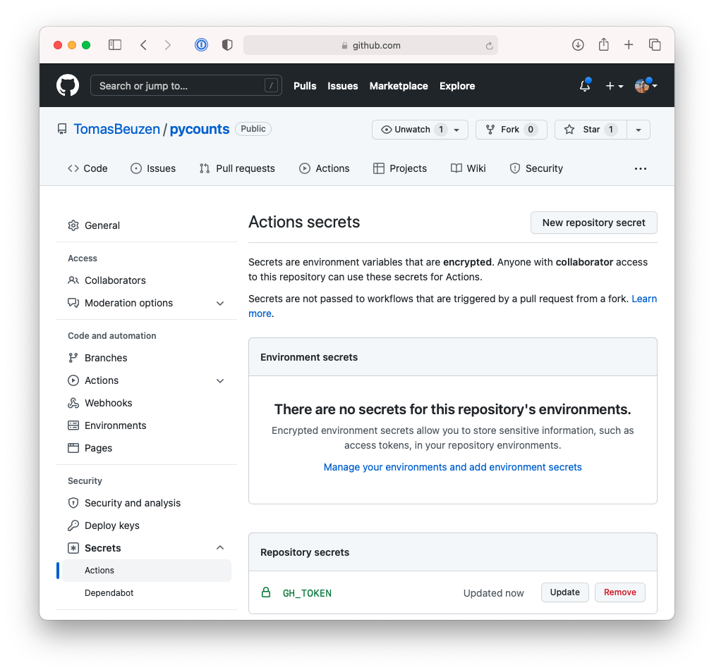
```

To use the [pypa/gh-action-pypi-publish@release/v1](https://github.com/pypa/gh-action-pypi-publish) action, we can add the following step to our CD workflow. Note how we configure the action to use the token `user` method, specifying `password` as the `TEST_PYPI_API_TOKEN` we just added to our repository, and we point the action to the TestPyPI repository (`repository_url: https://test.pypi.org/legacy/`).

```yaml
    # Step 5. Publish to TestPyPI
    - uses: pypa/gh-action-pypi-publish@release/v1
      with:
        user: __token__
        password: ${{ secrets.TEST_PYPI_API_TOKEN }}
        repository_url: https://test.pypi.org/legacy/
```

The above action will publish the new version of your package to TestPyPI. We now want to test that we can install the package correctly from TestPyPI using the following command:

```yaml
    # Step 6. Test install from TestPyPI
    - name: Test install from TestPyPI
      run: |
          pip install \
          --index-url https://test.pypi.org/simple/ \
          --extra-index-url https://pypi.org/simple \
          pycounts
```

Finally, the last step in our CD workflow will be publishing our package to PyPI. This uses the same [pypa/gh-action-pypi-publish@release/v1](https://github.com/pypa/gh-action-pypi-publish) action as earlier and will require you to obtain a token from [PyPI](https://pypi.org) and add the token as `PYPI_API_TOKEN` to your GitHub repository, as shown in Fig. \@ref(fig:08-token-2-fig).

```{r 08-token-2-fig, fig.cap = "Adding the PyPI API token to our GitHub repository.", out.width = "100%", fig.retina = 2, fig.align = "center", echo = FALSE, message = FALSE, warning = FALSE}
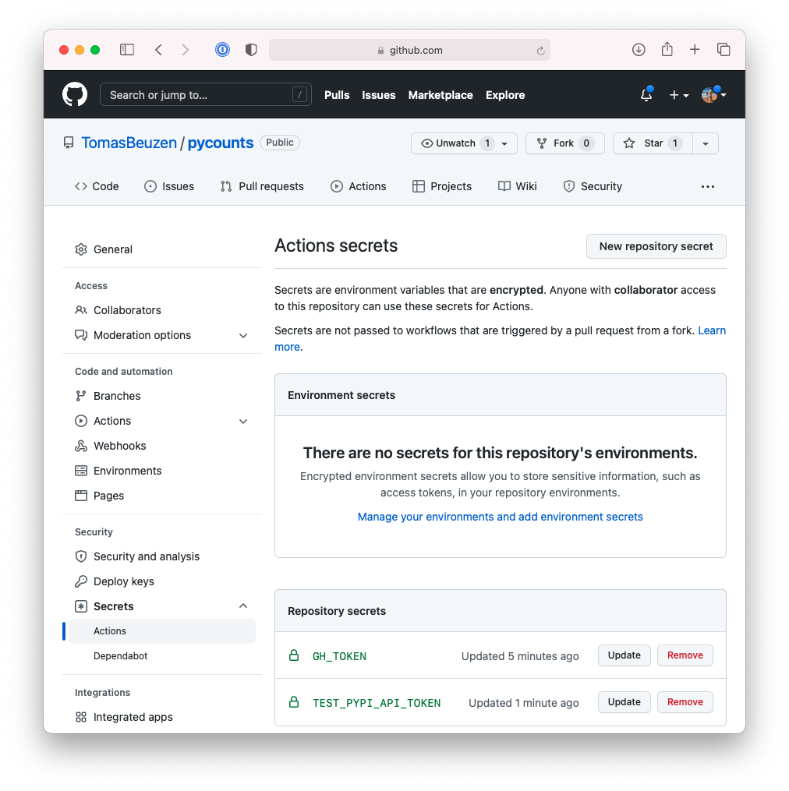
```

\newpage

```yaml
    # Step 7. Publish to PyPI
    - uses: pypa/gh-action-pypi-publish@release/v1
      with:
        user: __token__
        password: ${{ secrets.PYPI_API_TOKEN }}
```

### Testing continuous deployment

We've now set up our CD workflow! Our final *`.github/workflows/ci-cd.yml`* file looks like this:

```yaml
name: ci-cd

on:
  push:
    branches:
      - main
  pull_request:
    branches:
      - main

jobs:
  ci:
    # ...
    # CI steps same as before
    # ...
  cd:
    # Only run this job if the "ci" job passes
    needs: ci
    # Only run this job if new work is pushed to "main"
    if: github.event_name == 'push' && github.ref == 'refs/heads/main'
    # Step 1. Set up operating system
    runs-on: ubuntu-latest
    steps:
    # Step 2. Set up Python 3.9
    - uses: actions/setup-python@v2
      with:
        python-version: 3.9
    # Step 3. Check-out repository so we can access its contents
    - uses: actions/checkout@v2
      with:
        fetch-depth: 0
    # Step 4. Use PSR to make release
    - name: Python Semantic Release
      run: |
          pip install python-semantic-release
          git config user.name github-actions
          git config user.email github-actions@github.com
          semantic-release publish
    # Step 5. Publish to TestPyPI
    - uses: pypa/gh-action-pypi-publish@release/v1
      with:
        user: __token__
        password: ${{ secrets.TEST_PYPI_API_TOKEN }}
        repository_url: https://test.pypi.org/legacy/
    # Step 6. Test install from TestPyPI
    - name: Test install from TestPyPI
      run: |
          pip install \
          --index-url https://test.pypi.org/simple/ \
          --extra-index-url https://pypi.org/simple \
          pycounts
    # Step 7. Publish to PyPI
    - uses: pypa/gh-action-pypi-publish@release/v1
      with:
        user: __token__
        password: ${{ secrets.PYPI_API_TOKEN }}
```

We're now ready to test out our full CI/CD workflow! Let's go ahead and commit our new workflow file and our *`pyproject.toml`* file (which we changed when we added the configuration options for PSR) to version control and push it to GitHub. This will trigger our CI/CD workflow because we configured it to run when someone pushes to the "main" branch of our repository. For the sake of example, we'll include the "feat" keyword in our commit message to trigger PSR to make a minor release of our package from these changes (we described what keywords trigger particular version bumps in **Section \@ref(automatic-version-bumping)**).

```bash
$ git add .github/workflows/ci-cd.yml pyproject.toml
$ git commit -m "feat: add CI/CD workflow"
$ git push
```

Now if we go to our `pycounts` GitHub repository and click on the "Actions" tab, we should see a new run of our workflow as shown in Fig. \@ref(fig:08-cd-1-fig):

\newpage

```{r 08-cd-1-fig, fig.cap = "Continuous deployment workflow on GitHub.", out.width = "100%", fig.retina = 2, fig.align = "center", echo = FALSE, message = FALSE, warning = FALSE}
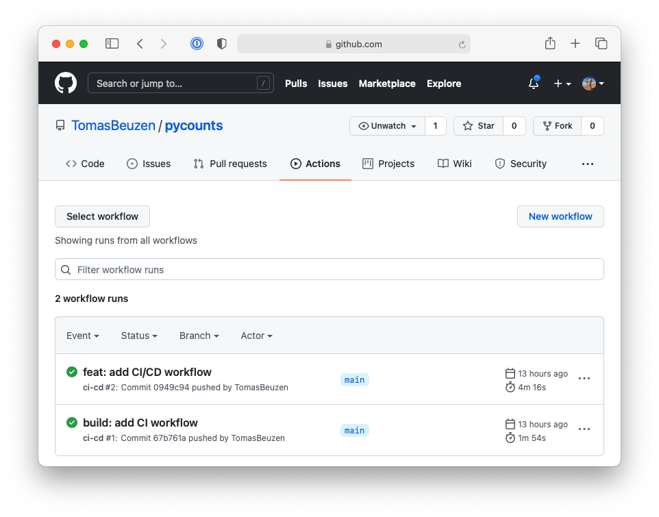
```

If we click on the workflow we will see it was composed of two jobs, "ci" and "cd", each of which ran successfully, as shown in Fig. \@ref(fig:08-cd-2-fig):

\newpage

```{r 08-cd-2-fig, fig.cap = "Successfully run continuous deployment workflow on GitHub.", out.width = "100%", fig.retina = 2, fig.align = "center", echo = FALSE, message = FALSE, warning = FALSE}
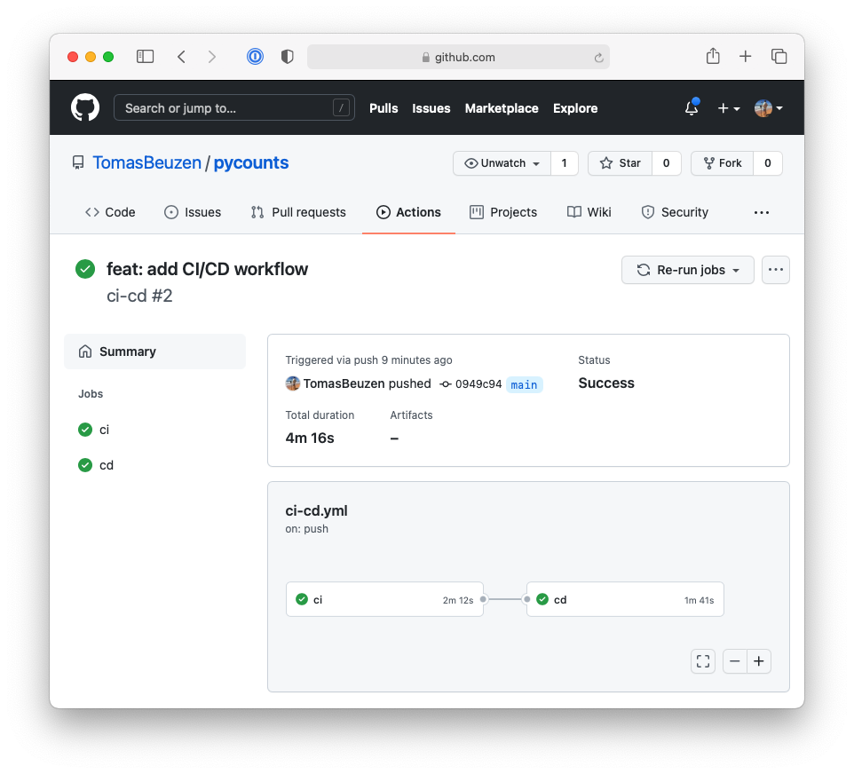
```

If we click on the "cd" job to view the build log, we can see that PSR parsed our commit message — "feat: add CI/CD workflow" — to determine that our package should be bumped with a minor release from 0.2.0 to 0.3.0 as shown in Fig. \@ref(fig:08-cd-3-fig).

\newpage

```{r 08-cd-3-fig, fig.cap = "The Python semantic release tool automatically bumped the package version from 0.2.0 to 0.3.0.", out.width = "100%", fig.retina = 2, fig.align = "center", echo = FALSE, message = FALSE, warning = FALSE}
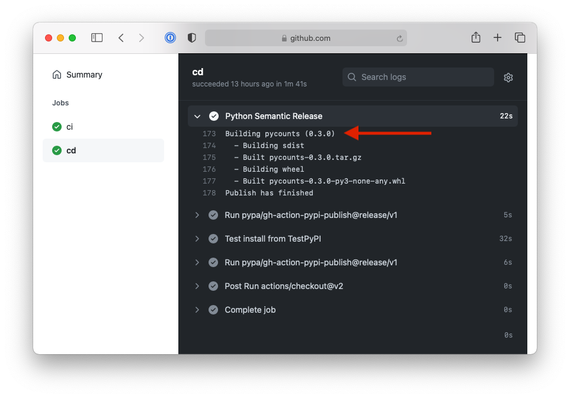
```

PSR also automatically updated our changelog and tagged a new release of our package, as shown in Fig. \@ref(fig:08-cd-4-fig) and Fig. \@ref(fig:08-cd-5-fig), respectively.

\newpage

```{r 08-cd-4-fig, fig.cap = "The Python semantic release tool automatically updated the changelog and added an entry for v0.3.0 based on commit messages.", out.width = "100%", fig.retina = 2, fig.align = "center", echo = FALSE, message = FALSE, warning = FALSE}
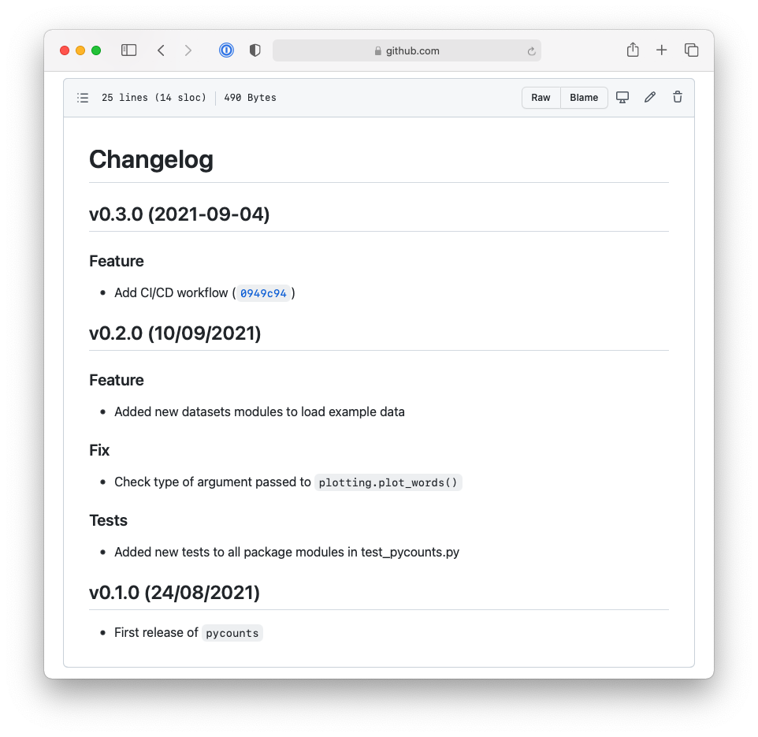
```

```{r 08-cd-5-fig, fig.cap = "The Python semantic release tool automatically created tagged release v0.3.0.", out.width = "100%", fig.retina = 2, fig.align = "center", echo = FALSE, message = FALSE, warning = FALSE}
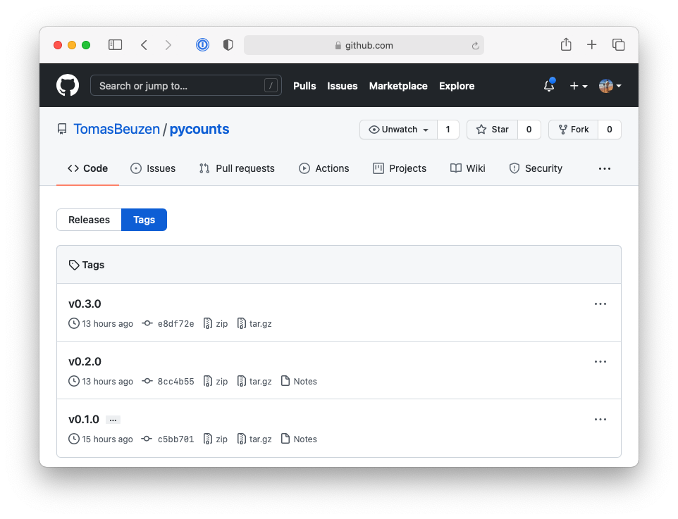
```

\newpage

Finally, we can see from the build logs that the new version of our package was released to TestPyPI and PyPI, as shown in Fig. \@ref(fig:08-cd-6-fig):

\newpage

```{r 08-cd-6-fig, fig.cap = "Deployment of new package version 0.3.0 to PyPI.", out.width = "100%", fig.retina = 2, fig.align = "center", echo = FALSE, message = FALSE, warning = FALSE}
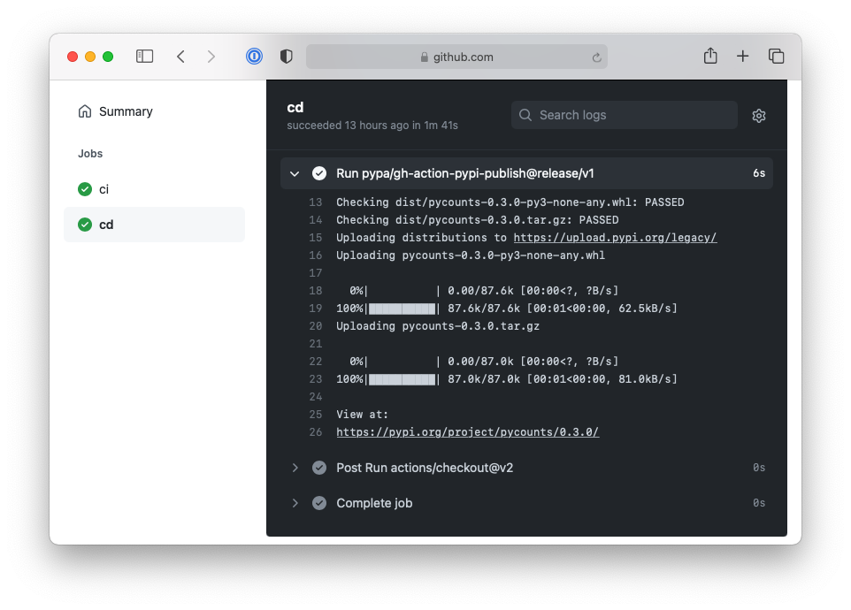
```

It didn't take too long for us to implement a CD workflow that completely automates all the steps we would usually have to perform manually when publishing a new release of our package. You may choose, or need, to use different tools and commands to what we've used here to implement CD for your packages in the future. But hopefully you can see the kinds of things that are possible with CD and how it can be useful to quickly deploy new releases of your package, how it saves you from having to remember all the commands you'd need to run to do this yourself, and how it lowers the barrier for potential collaborators to contribute to your package.

## Summary

In this chapter, we created CI/CD workflows for our `pycounts` package. What we've shown here is just one example and one set of tools for implementing CI/CD — but after reading this chapter, the hope is that you can appreciate the utility of CI/CD and the kinds of workflows that you can set up for your packages in the future.

It's important to note that when using version control in this book, we've been directly modifying the `main` branch of our repository. However, changes to your package are more typically made on branches. Branches isolate your changes so you can develop your package without affecting the existing, stable version. Only when you're happy with your changes and they've passed CI, do you merge them into the existing source and trigger a CD workflow (if it exists). In collaborative environments, this is typically done via a "pull request", which you can read more about in the GitHub [documentation](https://docs.github.com/en/github/collaborating-with-pull-requests/proposing-changes-to-your-work-with-pull-requests/about-pull-requests). Open-source projects are built off pull requests; go visit your favorite Python package repository on GitHub and click the "Pull requests" tab to see what and how collaborators are merging changes into the package, and the kind of CI/CD workflows that are set up to handle them.

Finally, while we developed our workflow file from scratch here, the `py-pkgs-cookiecutter` [template](https://github.com/py-pkgs/py-pkgs-cookiecutter) we used to set up our package in **Section \@ref(creating-a-package-structure)** can make the workflow *.yml* file for you. Recall from **Section \@ref(creating-a-package-structure)** that one of the `py-pkgs-cookiecutter` prompts was as follows:

```md
Select include_github_actions:
1 - no
2 - ci
3 - ci+cd
Choose from 1, 2, 3 [1]:
```

In the future, you can include a workflow file for CI or CI+CD by selecting an appropriate response.

Congratulations on making it to the end of the book and happy packaging!
