# Preface {-}

Python packages are the fundamental units of shareable code in Python. Packages make it easy to organize, reuse, and maintain your code, as well as share it between projects, with your colleagues, and with the wider Python community. [*Python Packages*](https://py-pkgs.org/) is an open source textbook that describes modern and efficient workflows for creating Python packages. The focus of this book is overwhelmingly practical; we will demonstrate methods and tools you can use to develop and maintain packages quickly, reproducibly, and with as much automation as possible - so you can focus on writing and sharing code!

## Why read this book? {-}

Despite their importance, packages can be difficult to understand and cumbersome to create for beginners and seasoned developers alike. This book aims to describe the packaging process at an accessible and practical level for data scientists, developers, and programmers. Along the way, we'll develop a real Python package and will explore all the key elements of Python packaging, including; creating a package file and directory structure, when and why to write tests and documentation, and how to maintain and update your package with the help of automated continuous integration and continuous deployment (CI/CD) pipelines.

By reading this book, you will:

- Understand what Python packages are, and when and why you should use them.
- Be able to build your own Python package from scratch.
- Learn how to document your Python code and packages, and how to render this documentation into a coherent, shareable document.
- Write software tests for your code, and automate them.
- Learn how to release your package on the Python Package Index (PyPI) and discover best practices for updating and versioning your code.
- Implement automation and CI/CD pipelines to build, test, and deploy your package and update its dependencies.
- Get tips on Python coding style, best-practice packaging workflows, and other useful development tools.

## Structure of the book {-}

**Chapter 1: [Introduction]** first gives a brief introduction to packages in Python and why you should know how to make them.

**Chapter 2: [System setup]** describes how to set up your development environment to develop packages and follow along with the examples in this book.

In **Chapter 3: [How to package a Python]**, we develop an example package from beginning-to-end as a practical demonstration of the key steps involved in the packaging process. This chapter forms the foundation of the book and will act as a reference sheet for readers creating packages in the future.

The remaining chapters then go into more detail about each step in this process, organized roughly in their order in the workflow:

- **Chapter 4: [Package structure and distribution]** 
- **Chapter 5: [Testing]**
- **Chapter 6: [Documentation]**
- **Chapter 7: [Releasing and versioning]**
- **Chapter 8: [Continuous integration and deployment]**

## Assumptions {-}

While this book aims to introduce Python packaging at a beginner level, we assume readers have basic familiarity with the concepts listed in {numref}`assumptions-table`:

```{table} Concepts this book assumes readers have basic familiarity with.
:name: assumptions-table

| Item    | Learning resources |
| :--- | ---: |
| How to import Python packages with the `import` statement | Python [documentation](https://docs.python.org/3/reference/simple_stmts.html#the-import-statement) | {-}| How to write conditionals (`if`/`elif`/`else`) and loops (`for`) in Python| Python [documentation](https://docs.python.org/3/tutorial/controlflow.html)|
| How to use and write simple Python functions| [Plotting and Programming in Python: Writing Functions](https://swcarpentry.github.io/python-novice-gapminder/16-writing-functions/index.html) {cite:p}`carpentries2021` |
| (Optional) Basic familiarity with version control and Git and GitHub (or similar tools) | [Happy Git and GitHub for the useR](https://happygitwithr.com) {cite:p}`bryan2021` or [Research Software Engineering with Python: Using Git at the Command Line](https://merely-useful.tech/py-rse/git-cmdline.html) {cite:p}`rsep2021b`| 
```

## Conventions {-}

Throughout this book we use `foo()` to refer to functions, `bar` for inline commands/variables/function parameters/package names, and *`__init__.py`*  and *`src/`* to refer to files and directories respectively.

Commands entered at the command line appear as below, with \$ indicating the command prompt:

```{prompt} bash \$ auto
$ mkdir my-first-package
$ cd my-first-package
$ python
```

Code entered in a Python interpreter looks like this:

```python
>>> import math
>>> round(math.pi, 3)
```

```python
3.142
```

Code blocks appear as below:

```python
def is_even(n):
    if n % 2 == 0:
        return True
    else:
        return False
```

As we discuss concepts and walk through code examples in the text, we emphasize lines we want to draw attention to by highlighting them. For example, let's add a short documentation string (docstring) to the `is_even()` function:

```python
def is_even(n):
    """Check if n is even."""
    if n % 2 == 0:
        return True
    else:
        return False
```

If you are reading an electronic version of the book, e.g., <https://py-pkgs.org>, all code is rendered so that you can easily copy and paste directly from your browser to your Python interpreter or editor.

## Persistence {-}

The Python software ecosystem is constantly evolving. While we aim to make the packaging workflows and concepts discussed in this book tool-agnostic, the tools we do use in the book may have been updated by the time you read it. If the maintainers of these tools are doing the right thing by documenting, versioning, and properly deprecating their code (we'll explore these concepts ourselves in **Chapter 7: [Releasing and versioning]**), then it should be straightforward to adapt any outdated code in the book.

## Colophon {-}

This book was written in [JupyterLab](https://jupyterlab.readthedocs.io/en/stable/index.html) and compiled using [Jupyter Book](https://jupyterbook.org/intro.html). The source is hosted on [GitHub](https://github.com/UBC-MDS/py-pkgs) and is deployed online at <https://py-pkgs.org> with [Netlify](https://www.netlify.com/).

## Acknowledgements {-}

We'd like to thank everyone that has contributed to the development of [*Python Packages*](https://py-pkgs.org/). This is an open source textbook that began as supplementary material for the University of British Columbia's Master of Data Science program and was subsequently developed openly on GitHub where it has been read, revised, and supported by many students, educators, practitioners and hobbyists. Without you all, this book wouldn’t be nearly as good as it is, and we are deeply grateful. A special thanks to those who directly contributed to the text via GitHub (in alphabetical order): `@Carreau`, `@dcslagel`.

The scope and intent of this book was inspired by the fantastic [R Packages](https://r-pkgs.org) {cite:p}`wickham2015` book written by Hadley Wickham and Jenny Bryan, a book that has been a significant resource for the R community over the years. We hope that [*Python Packages*](https://py-pkgs.org/) will eventually play a similar role in the Python community.

<!--chapter:end:index.Rmd-->


# About the authors {-}

Tomas Beuzen is a Postdoctoral Teaching & Learning Fellow in the Department of Statistics at the University of British Columbia and a data science consultant. In these roles he teaches courses and provides expert advice about Python and R programming, data wrangling, and machine learning. Tomas has a background in coastal engineering and enjoys the practical application of data science to solving problems in the natural and engineered world. He is currently interested in developing open-source, educational data science material.


Tiffany Timbers is an Assistant Professor of Teaching in the Department of Statistics and an Co-Director for the Master of Data Science program (Vancouver Option) at the University of British Columbia. In these roles she teaches and develops curriculum around the responsible application of Data Science to solve real-world problems. One of her favourite courses she teaches is a graduate course on collaborative software development, which focuses on teaching how to create R and Python packages using modern tools and workflows.


<!--chapter:end:00-authors.Rmd-->

\mainmatter

# Introduction


Python packages are a core element of the Python programming language and are how you write reuseable and shareable code in Python. This book assumes that readers are already familiar with how to import and use packages with the help of the `import` statement in Python. For example, the code below imports and uses `numpy` {cite:p}`harris2020array`, the core scientific computing package for Python, to round pi to three decimal places:

```python
>>> import math
>>> np.round(np.pi, decimals=3)
```

```python
3.142
```

At a minimum, a package bundles together code (such as functions, classes, variables, or scripts) so that it can be easily reused across different projects. However, packages are typically also supported by extra content such as documentation and tests, which become exponentially more important if you wish to share your package with others.

As of July 2021, there are over 300,000 packages available on the [Python Package Index (PyPI)](https://pypi.org), the official online software repository for Python. Packages are a key reason why Python is such a powerful and widely used programming language. The chances are that someone has already solved a problem that you're working on, and you can benefit from their work by downloading and installing their package. Put simply, packages are how you make it as easy as possible to use, maintain, share and collaborate on Python code with others; whether they be your friends, work colleagues, the world, or your future self!

Even if you never intend to share your code with others, making packages will ultimately save you time. Packages make it significantly easier for you to reuse and maintain your code within a project and across different projects. After programming for some time, most people will eventually reach a point where they want to reuse code from one project in another. For beginners in particular, this is something often accomplished by copy-and-pasting existing code into the new project. Despite being inefficient, this practice also makes it difficult to improve and maintain your code across projects. Creating a simple Python package will solve these problems.

Regardless of your motivation, the goal of this book is to show you how to easily develop Python packages. The focus is overwhelmingly practical - we will leverage modern methods and tools to develop and maintain packages efficiently, reproducibly, and with as much automation as possible; so you can focus on writing and sharing code. Along the way, we'll also enlighten some interesting and relevant lower-level details of Python packaging and the Python programming language.

## Why you should create packages

In summary, there are many reasons why you should develop Python packages!

- To effectively share your code with others.
- They save you time. Even if you don't intend to share your package with others, they help you easily reuse and maintain your code across multiple projects.
- They force you to organize and document your code, such that it can be easily understood and used at a later time.
- They isolate dependencies for your code and improve its reproducibility.
- They are a good way to practice writing good code.
- Packages can be used to effectively bundle up reproducible data analysis and programming projects.
- Finally, developing and distributing packages supports the Python ecosystem and other Python users who can benefit from your work.

<!--chapter:end:01-introduction.Rmd-->


# System setup


If you intend to follow along with the code presented in this book, we recommend you follow these setup instructions so that you will run into fewer technical issues.

## The command-line interface

A \index{command-line interface} (CLI) is a text-based interface used to interact with your computer. We'll be using a CLI for various tasks throughout this book. We'll assume Mac and Linux users are using the "Terminal" and Windows users are using the "Anaconda Prompt" (which we'll install in the next section) as a CLI.

## Installing software

### Installing Python

We recommend installing the latest version of Python via the \index{Miniconda} distribution by following the instructions in the Miniconda [documentation](https://docs.conda.io/en/latest/miniconda.html). Miniconda is a lightweight version of the popular \index{Anaconda} distribution. If you have previously installed the Anaconda or Miniconda distribution feel free to skip to **{numref}`02:Install-packaging-software`**.

If you are unfamiliar with Miniconda and Anaconda, they are distributions of Python that also include the \index{`conda`} package and environment manager, and a number of other useful packages. The difference between Anaconda and Miniconda is that Anaconda automatically installs over 250 additional packages (many of which you might never use), while Miniconda is a much smaller distribution that comes bundled with just a few key packages; you can then install additional packages as you need them using the command `conda install`.

`conda` is a piece of software that supports the process of installing and updating software (like Python packages). It is also an environment manager which is the key function we'll be using it for in this book. An environment manager helps you create "\index{virtual environment}s" on your machine where you can safely install different packages and their dependencies in an isolated location. Installing all the packages you need in the same place (i.e., the system default location) can be problematic because different packages often depend on different versions of the same dependencies; as you install more packages, you'll inevitably get conflicts between dependencies and your code will start to break. Virtual environments help you compartmentalize and isolate the packages you are using for different projects to avoid this issue. While alternative package and environment managers exist, we choose to use `conda` in this book because of its popularity, ease-of-use, and ability to handle any software stack (not just Python).

### Install packaging software

<!-- #region -->
Once you've installed the Miniconda distribution, ensure that Python and `conda` are up to date by running the following command at the command-line:

```{prompt} bash \$ auto
$ conda update --all
```

Then, use `conda` to install the two main pieces of software we'll be using to help us create Python packages in this book:

1. [`\index{poetry}`](https://python-poetry.org/): software that will help us build our own Python packages; and,
2. [`\index{cookiecutter}`](https://github.com/cookiecutter/cookiecutter): software that will help us create packages from pre-made templates:

```{prompt} bash \$ auto
$ conda install -c conda-forge poetry cookiecutter
```

>You may also choose to install `poetry` and/or `cookiecutter` using alternative methods such as `pip`, but be sure to properly manage your virtual environments.

<!-- #endregion -->

## Register for a PyPI account

\index{PyPI} is the official online software repository for Python. A \index{software repository} is a storage location for downloadable software, like Python packages. In this book we'll be publishing a package on PyPI. Before publishing packages on PyPI, it is typical to "test drive" their publication on \index{TestPyPI} which is a test version of PyPI. To follow along with this book, you should register for a TestPyPI account on the [TestPyPI website](https://test.pypi.org/account/register/) and a PyPI account on the [PyPI website](https://pypi.org/account/register/).

## Set up Git and GitHub

<!-- #region -->
If you're not using a \index{version control system}, we highly recommend you get into the habit! A version control system tracks changes to the file(s) of your project in a clear and organized way (no more "document_1.doc", "document_1_new.doc", "document_final.doc", etc.). As a result, a version control system contains a full history of all the revisions made to your project which you can view and retrieve at any time. You don't *need* to use or be familiar with version control to read this book, but if you're serious about creating Python packages, version control will become an invaluable part of your workflow, so now is a good time to learn!

There are many version control systems available, but the most common is Git and we'll be using it throughout this book. You can download Git by following the instructions in the [Git documentation](https://git-scm.com/book/en/v2/Getting-Started-Installing-Git). Git will help us track changes to our project on our local computers, but what if we want to collaborate with others? Or, what happens if our computer crashes? That's where GitHub comes in. GitHub is one of many online services for hosting Git-managed projects. GitHub helps you create an online copy of your local Git repository which acts as a back-up of your local work and allows others to easily and transparently collaborate on your project. You can sign up for a free GitHub account on the [GitHub website](https://www.github.com).

>This book assume that those who choose to follow the optional version control sections of this book have basic familiarity with Git and GitHub (or equivalent). Two excellent learning resources are [Happy Git and GitHub for the useR](https://happygitwithr.com) {cite:p}`bryan2021` and [Research Software Engineering with Python: Using Git at the Command Line](https://merely-useful.tech/py-rse/git-cmdline.html) {cite:p}`rsep2021b`.

<!-- #endregion -->

## Python integrated development environments

A Python integrated development environment (IDE) will make the process of creating Python packages significantly easier. An IDE is a piece of software that provides advanced functionality for code development such as directory and file creation and navigation, code refactoring, autocomplete, debugging, and syntax highlighting, to name a few. An IDE will save you time and help you write better code. Commonly used free Python IDEs include [Visual Studio Code](https://code.visualstudio.com/), [Atom](https://atom.io/), [Sublime Text](https://www.sublimetext.com/), [Spyder](https://www.spyder-ide.org/), and [PyCharm Community Edition](https://www.jetbrains.com/pycharm/). For those more familiar with the Jupyter ecosystem, [JupyterLab](https://jupyter.org/) is a suitable browser-based IDE. Finally, for the R community, the [RStudio IDE](https://rstudio.com/products/rstudio/download/) also supports Python.

You'll be able to follow along with the examples presented in this book regardless of what IDE you choose to develop your Python code in. If you don't know which IDE to use, we recommend starting with Visual Studio Code. Below we briefly describe how to set up Visual Studio Code, JupyterLab, and RStudio as Python IDEs (these are the IDEs we personally use in our day-to-day work). 

### Visual Studio Code

You can download Visual Studio Code (VS Code) from the Visual Studio Code [website](https://code.visualstudio.com/). Once you've installed VS Code, you should install the "Python" extension from the VS Code Marketplace. To do this, follow the steps listed below and illustrated in {numref}`02-vscode-1`:
1. Open the Marketplace by clicking the *Extensions* tab on the VS Code activity bar;
2. Search for "Python" in the search bar;
3. Select the extension named "Python" and then click *Install*.

```{r 02-vscode-1, fig.cap = "Installing the Python extension in Visual Studio Code.", out.width = "100%", fig.retina = 2, fig.align = "center", echo = FALSE, message = FALSE, warning = FALSE}
knitr::include_graphics("../images/vscode-1.png")
```

Once this is done, you have everything you need to start creating packages! For example, you can create files and directories from the *File Explorer* tab on the VS Code activity bar and you can open up an integrated CLI by selecting *Terminal* from the *View* menu. {numref}`02-vscode-2` shows an example of executing a Python *.py* file from the command line in VS Code.

```{r 02-vscode-2, fig.cap = "Executing a simple Python file called hello-world.py from the integrated terminal in Visual Studio Code.", out.width = "100%", fig.retina = 2, fig.align = "center", echo = FALSE, message = FALSE, warning = FALSE}
knitr::include_graphics("../images/vscode-2.png")
```

We recommend you take a look at the VS Code [Getting Started Guide](https://code.visualstudio.com/docs) to learn more about using VS Code. While you don't need to install any additional extensions to start creating packages in VS Code, there are many extensions available that can support and streamline your programming workflows in VS Code. Below are a few we recommend installing to support the workflows we use in this book (you can search for and install these from the "Marketplace" as we did earlier):
- [Python Docstring Generator](https://marketplace.visualstudio.com/items?itemName=njpwerner.autodocstring): an extension to quickly generate docstrings for Python functions.
- [Markdown All in One](https://marketplace.visualstudio.com/items?itemName=yzhang.markdown-all-in-one): an extension that provides keyboard shortcuts, automatic table of contents, and preview functionality for Markdown files.
- [markdownlint](https://marketplace.visualstudio.com/items?itemName=DavidAnson.vscode-markdownlint): an extension that enables automatic style checking of Markdown files.

### JupyterLab

For those comfortable in the Jupyter ecosystem feel free to stay there to create your Python packages! JupyterLab is a browser-based IDE that supports all of the core functionality we need to create packages. As per the JupyterLab [installation instructions](https://jupyterlab.readthedocs.io/en/stable/getting_started/installation.html), you can install JupyterLab with:

```{prompt} bash
conda install -c conda-forge jupyterlab
```

Once installed, you can launch JupyterLab from your current directory by typing the following command in your terminal:

```{prompt} bash
jupyter lab
```

In JupyterLab, you can create files and directories from the *File Browser* and can open up an integrated terminal from the *File* menu. {numref}`02-jupyterlab` shows an example of executing a Python *.py* file from the command line in JupyterLab.

```{r 02-jupyterlab, fig.cap = "Executing a simple Python file called hello-world.py from a terminal in JupyterLab.", out.width = "100%", fig.retina = 2, fig.align = "center", echo = FALSE, message = FALSE, warning = FALSE}
knitr::include_graphics("../images/jupyterlab.png")
```

We recommend you take a look at the JupyterLab [documentation](https://jupyterlab.readthedocs.io/en/stable/index.html) to learn more about how to use Jupyterlab. In particular, we'll note that, like VS Code, JupyterLab supports an ecosystem of extensions that can add additional functionality to the IDE. We won't install any here, but you can browse them in the JupyterLab *Extension Manager* if you're interested.

### RStudio

Users with an R background may prefer to stay in the RStudio IDE. We recommend installing the most recent version of the IDE from the RStudio [website](https://rstudio.com/products/rstudio/download/preview/) (we recommend installing at least version ^1.4) and then installing the most recent version of R from [CRAN](https://cran.r-project.org/). To use Python in RStudio, you will need to install the [reticulate](https://rstudio.github.io/reticulate/) R package by typing the following in the R console inside RStudio:

```r
install.packages("reticulate")
```

When installing reticulate, you may be prompted to install the Anaconda distribution. We already installed the Miniconda distribution of Python in **{numref}`02:Installing-Python`**, so answer "no" to this prompt. Before being able to use Python in RStudio, you will need to configure `reticulate`. We will briefly describe how to do this for different operating systems below, but encourage you to look at the `reticulate` [documentation](https://rstudio.github.io/reticulate/) for more help.

**Mac and Linux**

1. Find the path to the Python interpreter installed with Miniconda by typing `which python` at the command line;
2. Open (or create) an `.Rprofile` file in your HOME directory and add the line `Sys.setenv(RETICULATE_PYTHON = "path_to_python")`, where `"path_to_python"` is the path identified in step 1;
3. Open (or create) a `.bash_profile` file in your HOME directory and add the line `export PATH="/opt/miniconda3/bin:$PATH"`, replacing `/opt/miniconda3/bin` with the path you identified in step 1 but without the `python` at the end.
4. Restart R.
5. Try using Python in RStudio by running the following in the R console:

```r
library(reticulate)
repl_python()
```

**Windows**

1. Find the path to the Python interpreter installed with Miniconda by opening an Anaconda Prompt from the Start Menu and typing `where python` in a terminal;
2. Open (or create) an `.Rprofile` file in your HOME directory and add the line `Sys.setenv(RETICULATE_PYTHON = "path_to_python")`, where `"path_to_python"` is the path identified in step 1. Note that in Windows, you need `\\` instead of `\` to separate the directories; for example your path might look like: `C:\\Users\\miniconda3\\python.exe`;
3. Open (or create) a `.bash_profile` file in your HOME directory and add the line `export PATH="/opt/miniconda3/bin:$PATH"`, replacing `/opt/miniconda3/bin` with the path you identified in step 1 but without the `python` at the end.
4. Restart R.
5. Try using Python in RStudio by running the following in the R console:

```r
library(reticulate)
repl_python()
```

{numref}`02-rstudio` shows an example of executing Python code interactively in RStudio.

```{r 02-rstudio, fig.cap = "Executing Python code in the RStudio.", out.width = "100%", fig.retina = 2, fig.align = "center", echo = FALSE, message = FALSE, warning = FALSE}
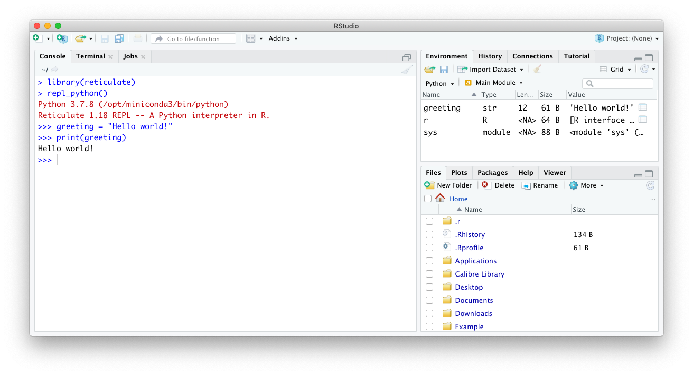
```

<!--chapter:end:02-setup.Rmd-->


# How to package a Python
<hr>

In this chapter we will develop an entire example Python package from beginning-to-end to demonstrate the key steps involved in developing a package. This chapter forms the foundation of this book, it contains everything you need to know to create a Python package. The intention is for readers to go through it once, and then use it as a quick-reference sheet to refer to when creating Python packages in the future. For those looking to learn even more, later chapters explore each of the individual steps in the packaging process in further detail.

The example package we are going to create in this chapter will help us calculate word counts from a plain-text file. We'll be calling it `pycounts` and it will be useful for parsing and understanding word usage in texts such as novels, research papers, news articles, log files, and more.

## Counting words in a text file

### Developing our code

Before even thinking about making a package, we'll first develop the code we want to package up. The `pycounts` package we are going to create will help us calculate word counts from a plain-text file. Python has a useful `Counter` object (which can be imported from the `collections` module) that can be used to calculate counts of a collection of elements (like a list of words) and store them in a dictionary.

We can demonstrate the functionality of `Counter` by first opening up a Python interpreter by typing `python` at the command line:

```{prompt} bash \$ auto
$ python
```

And importing `Counter` from the `collections` module:

```python
>>> from collections import Counter
```

We can then define a sample list of words and create a `Counter` object by passing that list of words as an input to `Counter()`:

```python
>>> words = ["a", "happy", "hello", "a", "world", "happy"]
>>> word_counts = Counter(words)
>>> word_counts
```

```console
Counter({'a': 2, 'happy': 2, 'hello': 1, 'world': 1})
```

<!-- #region -->
The `Counter` object automatically calculated the count of each unique word in our list and returned the result as a dictionary of `'word': count` pairs!

So, how can we use `Counter` to count the words in a given text file? Well, we could load the file, split it up into a list of words, and then create a `Counter` object from that list of words.

We first need a text file to help us build this workflow. "[The Zen of Python](https://www.python.org/dev/peps/pep-0020/)" is a list of 19 aphorisms about the Python programming language which can be viewed by executing `import this` in Python:

```python
>>> import this
```

```console
The Zen of Python, by Tim Peters

Beautiful is better than ugly.
Explicit is better than implicit.
Simple is better than complex.
...
```

Let's export "The Zen of Python" as a text file called *`zen.txt`*. You can do this by manually copying the output of `import this` into a file called *`zen.txt`* using an editor of your choice, or you can do it from the command line by first exiting the Python interpreter:

```python
>>> exit()
```

Then running the following command:

```{prompt} bash \$ auto
$ python -c "import this" > zen.txt
```

>In the command above, the `-c` option allows you to pass a string for Python to execute, and the `>` directs the output of the command to a file (which in our case is called "zen.txt" and is located in the current directory).

Now that we have a text file to work with, we can go back to developing our word counting functionality. To open our *`zen.txt`* file in Python, we can use the `open()` function to open the file and then the `.read()` method to read its contents as a Python string. The code below, run in a Python interpreter, saves the contents of *`zen.txt`* as a string in the variable `text`:

```python
>>> with open("zen.txt") as file:
        text = file.read()
```

Let's see what `text` looks like:

```python
>>> text
```

```console
"The Zen of Python, by Tim Peters\n\nBeautiful is better
than ugly.\nExplicit is better than implicit.\nSimple is 
better than complex.\nComplex is better than complicated
..."
```

We can see that the `text` variable is a single string, with the `\n` symbols indicates a new-line in the string.

Before we split the above text into individual words for counting with `Counter`, we should lowercase all the letters and remove punctuation so that if the same word occurs multiple times with different capitalization or punctuation, it isn't treated as different words by `Counter`. For example we want "Better", "better", and "better!" to result in three counts of the word "better".

To lowercase all letters in a Python string, we can use the `.lower()` method:

```python
>>> text = text.lower()
```

To remove punctuation, we can iterate over a collection of punctuation marks and replace them with nothing using the `.replace()` method. Python conveniently provides a collection of punctuation marks in the `string` module:

```python
>>> from string import punctuation
>>> punctuation
```

```console
'!"#$%&\'()*+,-./:;<=>?@[\\]^_`{|}~'
```

We can use a `for` loop to remove each punctuation mark from `text` by replacing it with an empty string (`""`):

```python
>>> for p in punctuation:
        text = text.replace(p, "")
```

With punctuation removed and the letters in `text` all lowercase, we can now split it up into individual words using the `.split()` method, which by default will split a string into a list of strings using spaces, newlines (`\n`) and tabs (`\t`):

```python
>>> words = text.split()
>>> words
```

```console
['the', 'zen', 'of', 'python', 'by', 'tim', 'peters', 
'beautiful', 'is', 'better', 'than', 'ugly', ...]
```

We've now managed to load, pre-process, and split our `*zen.txt*` file up into individual words and can now determine the word counts by creating a `Counter` object:

```python
>>> from collections import Counter
>>> word_counts = Counter(words)
>>> word_counts
```

```console
Counter({'is': 10, 'better': 8, 'than': 8, 'the': 6, 
'to': 5, 'of': 3, 'although': 3, 'never': 3, ... })
```
<!-- #endregion -->

### Turning our code into functions

<!-- #region -->
In **{numref}`03:Developing-our-code`** we developed a workflow for counting words in a text file. But it would be a pain to run all that code every time we want to count the words in a file! To make things more efficient, let’s turn the above code into three reusable functions called `load_text()`, `clean_text()` and `count_words()` by defining them in our Python interpreter:

>We've added a short documentation string (docstring) to each function here using triple quotes. We'll talk more about docstrings in **{numref}`03:Writing-docstrings`**.

```python
>>> def load_text(input_file):
        """Load text from a text file and return as a string."""
        with open(input_file, "r") as file:
            text = file.read()
        return text
```

```python
>>> def clean_text(text):
        """Lowercase and remove punctuation from a string."""
        text = text.lower()
        for p in punctuation:
            text = text.replace(p, "")
        return text
```

```python
>>> def count_words(input_file):
        """Count unique words in a string."""
        text = load_text(input_file)
        text = clean_text(text)
        words = text.split()
        return Counter(words)
```

We can now use our word-counting functionality as follows:

```python
>>> count_words("zen.txt")
```

```console
Counter({'is': 10, 'better': 8, 'than': 8, 'the': 6, 
'to': 5, 'of': 3, 'although': 3, 'never': 3, ... })
```

Unfortunately, if you quit from the Python interpreter, the functions we defined will be lost and you will have to define them again in new sessions.

The whole idea of a Python package is that we can store Python code, like our `load_text()`, `clean_text()` and `count_words()` functions, in a package that we, and others, can then install and `import` to use in any project without having to re-write it. In the remainder of this chapter, we'll work towards packaging up the code we've written into a Python package called `pycounts` so we can do exactly that.
<!-- #endregion -->

## Package structure

### A brief introduction

To develop our `pycounts` package we first need to create an appropriate directory structure. We talk about package structure in detail in **{numref}`04:Package-structure`**, but provide a practical summary here that contains everything you need to know to build your own package. 

Python packages are a collection of Python modules; files with a *.py* extension that contain the Python code you want to package up. A package comprises a specific directory structure of one or more Python modules, along with instructions on how to build and install the package on a computer. Below is an example package structure containing two modules:

```
example_pkg
├── src
│   └── example_pkg
│       ├── __init__.py
│       ├── module1.py
│       └── module2.py
├── README.md
└── pyproject.toml
```

The root directory is named after the package ("example_pkg" here). It contains a *`src/example_pkg`* subdirectory that shares the package's name and contains the Python source code (*.py* files) that make up the package. The *`__init__.py`* file tells Python to treat the directory as a package (we'll talk more about this file in **{numref}`04:The-__init__.py-file`**). *`README.md`* is a text file that provides high-level information about the package (what it does, how it can be used, its structure, etc.). The *`pyproject.toml`* file contains metadata about the project (who made it, how it is licensed, etc.) and instructions on how to build the package for installation and distribution, as we'll talk about in **{numref}`03:Installing-your-package`**.

The above structure is suitable for a simple package, or one intended solely for personal use. But packages typically include many more bells and whistles than this, such as detailed documentation, tests that can be run to validate the functionality of the package, and more. Below is a more typical example of a Python package structure:

```
example_pkg
├── CHANGELOG.md
├── CONDUCT.md
├── CONTRIBUTING.md
├── docs
│   └── ...
├── LICENSE
├── pyproject.toml
├── README.md
├── src
│   └── example_pkg
│       ├── __init__.py
│       ├── example_module1.py
│       └── example_module2.py
└── tests
    └── ...
```

The `pycounts` package we are going to create in this chapter will follow the latter package structure and we'll explore each element in that structure in the remainder of this chapter. Our reasoning for building a package with all the bells and whistles is to expose you to all the different elements of packaging; so that you understand them and can make informed choices about what content to include in your own packages in the future, depending on their intended use and audience.

### Creating a package structure

Regardless of your packaging expertise, it's efficient to use a pre-made template to set up the boilerplate directory structure of a package. We will use `cookiecutter` (a Python package we installed in **{numref}`02:Install-packaging-software`**) to create our package structure for us.

`cookiecutter` is a tool for populating a directory structure from a pre-made template. People have developed and open-sourced many `cookiecutter` templates for different projects; such as for creating Python packages, R packages, websites, and more. You can find these templates by, for example, searching an online hosting service like [GitHub](https://www.github.com). We have developed our own `py-pkgs-cookiecutter` Python package template to support this book, and which is hosted on [GitHub](https://github.com/py-pkgs/py-pkgs-cookiecutter).

To use this template to create a boilerplate directory structure, use the command line to navigate to the directory where you want to create your package, and then running the command below. Upon executing the command you will be prompted to provide information that will be used to create and customize your package file and directory structure. We provide an example of how to respond to these prompts and an explanation of what they mean in {numref}`prompt-table`.

```{prompt} bash \$ auto
$ cookiecutter https://github.com/py-pkgs/py-pkgs-cookiecutter.git
```

```console
author_name [Monty Python]: Tomas Beuzen
package_name [mypkg]: pycounts
package_short_description [A package for doing great things!]: Calculate word counts in a text file!
package_version [0.1.0]: 
python_version [3.9]: 
Select open_source_license:
1 - MIT
2 - Apache License 2.0
3 - GNU General Public License v3.0
4 - Creative Commons Attribution 4.0
5 - BSD 3-Clause
6 - Proprietary
7 - None
Choose from 1, 2, 3, 4, 5, 6 [1]: 
Select include_github_actions:
1 - no
2 - yes
Choose from 1, 2 [1]: 
```

```{table} A description of the py-pkgs-cookiecutter template prompts.
:name: prompt-table

|Prompt keyword|Description|
|:---  | :---  |
|`author_name`, `package_name`, `package_short_description`| These are self-explanatory. We provide guidance on choosing a good package name in **{numref}`04:Package-and-modules-names`**, but note that we will be publishing our `pycounts` package to Python's main package index [PyPI](https://pypi.org/). Package names on PyPI must be unique. **So if you plan to follow along with this tutorial you should choose a unique name for your package**. Something like `pycounts_[your intials]` might be appropriate, but you can check if a particular name is already taken by searching for it on [PyPI](https://pypi.org/).|
|`package_version`|The version of your package. Most Python packages use [semantic versioning](https://semver.org) for identifying their software. In semantic versioning, a version number consists of three integers A.B.C, where A is the "major" version, B is the "minor" version, and C is the "patch" version. The first version of a software usually starts at 0.1.0 and increments from there. We'll discuss versioning in **{numref}`Chapter %s<07:Releasing-and-versioning>`**.|
|`python_version`|The minimum version of Python you want to support.|
|`open_source_license`|The license to use that dictates how your package can be used by others. We discuss licenses in **{numref}`06:License`**. The [MIT license](https://choosealicense.com/licenses/mit/) we chose in our example response is a simple, permissive license commonly used for open source work. If your project will not be open source or you wish to retain exclusive copyright, you can choose not to include a license.|
|`include_github_actions`|An option to include continuous integration and continuous deployment files to help automate the building, testing and deployment of your Python package using the [GitHub Actions](https://github.com/features/actions) service. We'll explore these topics in more detail in **Chapter 8: [Continuous integration and deployment]**, so for now, we recommend responding `no`.|
```

After responding to the `py-pkgs-cookiecutter` prompts, we now have a new directory called `pycounts`, full of content suitable for building a fully-featured Python package! We'll explore each element of this directory structure as we develop our package throughout this chapter, but we've given a rough indication of what each file is related to below:

```
pycounts
├── .readthedocs.yml           ┐
├── CHANGELOG.md               │
├── CONDUCT.md                 │
├── CONTRIBUTING.md            │
├── docs                       │
│   ├── make.bat               │
│   ├── Makefile               │
│   ├── requirements.txt       │
│   ├── changelog.md           │
│   ├── conduct.md             │
│   ├── conf.py                │ Package documentation
│   ├── contributing.md        │
│   ├── index.md               │
│   └── usage.ipynb            │
├── LICENSE                    │
├── README.md                  ┘
├── pyproject.toml             ┐ 
├── src                        │
│   └── pycounts               │ Package source code, metadata,
│       ├── __init__.py        │ and build instructions 
│       └── pycounts.py        ┘
└── tests                      ┐
    └── test_pycounts.py       ┘ Package tests
```

## Put your package under version control

<!-- #region -->
Before continuing to develop our package it is generally good practice to put it under local and remote version control. This is not necessary for developing a package but is highly recommended so that you can better manage and track changes to your package over time. Version control is particularly useful and important if you plan on sharing and collaborating on your package with others. If you don't want to use version control, feel free to skip to **{numref}`03:Packaging-your-code`**. The tools we will be using for version control in this book are Git and GitHub (which we set up in **{numref}`02:Set-up-Git-and-GitHub`)**. 

>For this book, we assume readers have basic familiarity with Git and GitHub (or similar). To learn more about Git and GitHub, we recommend the following resources: [Happy Git and GitHub for the useR](https://happygitwithr.com) {cite:p}`bryan2021` and [Research Software Engineering with Python: Using Git at the Command Line](https://merely-useful.tech/py-rse/git-cmdline.html) {cite:p}`rsep2021b`

<!-- #endregion -->

### Set up local version control

To set up local version control, navigate to the root `pycounts` directory and initialize a Git repository:

```{prompt} bash \$ auto
$ cd pycounts
$ git init
```

```console
Initialized empty Git repository in /Users/tomasbeuzen/pycounts/.git/
```

Next, we need to tell Git which files to track (which will be all of them at this point) and then commit these changes locally:

```{prompt} bash \$ auto
$ git add .
$ git commit -m "initial package setup"
```

```console
[master (root-commit) 51795ad] initial package setup
 20 files changed, 502 insertions(+)
 create mode 100644 .gitignore
 create mode 100644 .readthedocs.yml
 create mode 100644 CHANGELOG.md
 ...
 create mode 100644 src/pycounts/__init__.py
 create mode 100644 src/pycounts/pycounts.py
 create mode 100644 tests/test_pycounts.py
```

### Set up remote version control

<!-- #region -->
Now that we have set up our local version control, we will create a repository on [GitHub](https://github.com/) and set that as the remote version control home for this project. First we need to create a new repository on [GitHub](https://www.github.com) as demonstrated in {numref}`03-set-up-github-1`:

```{r 03-set-up-github-1, fig.cap = "Creating a new repository in GitHub.", out.width = "100%", fig.retina = 2, fig.align = "center", echo = FALSE, message = FALSE, warning = FALSE}
knitr::include_graphics("../images/03-set-up-github-1.png")
```

To follow along with this tutorial, select the following options when setting up your GitHub repository, as shown in {numref}`03-set-up-github-2`: 

1. Give the GitHub repository the same name as your Python package and give it a short description;
2. You can choose to make your repository public or private - we'll be making ours public so we can share it with others; and,
3. Do not initialize the GitHub.com repository with any files (we've already created the files we need using our `py-pkgs-cookiecutter` template).

```{r 03-set-up-github-2, fig.cap = "Setting up a new repository in GitHub.", out.width = "100%", fig.retina = 2, fig.align = "center", echo = FALSE, message = FALSE, warning = FALSE}
knitr::include_graphics("../images/03-set-up-github-2.png")
```

Next, copy the remote link to your repository and then use the commands shown on GitHub, and outlined in {numref}`03-set-up-github-3`, to link your local repository with the remote repository, and push your project to GitHub:

```{r 03-set-up-github-3, fig.cap = "Instructions on how to link local and remote version control repositories.", out.width = "100%", fig.retina = 2, fig.align = "center", echo = FALSE, message = FALSE, warning = FALSE}
knitr::include_graphics("../images/03-set-up-github-3.png")
```

```{prompt} bash \$ auto
$ git remote add origin git@github.com:TomasBeuzen/pycounts.git
$ git branch -M main
$ git push -u origin main
```

```console
Enumerating objects: 26, done.
Counting objects: 100% (26/26), done.
Delta compression using up to 8 threads
Compressing objects: 100% (19/19), done.
Writing objects: 100% (26/26), 8.03 KiB | 4.01 MiB/s, done.
Total 26 (delta 0), reused 0 (delta 0)
To github.com:TomasBeuzen/pycounts.git
 * [new branch]      main -> main
Branch 'main' set up to track remote branch 'main' from 'origin'.
```

>The commands above should be specific to your GitHub username and the name of your Python package. The example above uses SSH authentication with GitHub which we recommend setting up. SSH is useful for connecting to GitHub without having to supply your username and password every time. If you're interested in setting up SSH, take a look at the GitHub [documentation](https://docs.github.com/en/github/authenticating-to-github/connecting-to-github-with-ssh). If you don't have SSH authentication set up, HTTPS authentication works as well and would require the use of the following url in place of the one shown above to set the remote: `https://github.com/TomasBeuzen/pycounts.git`. 

<!-- #endregion -->

## Packaging your code

We now have our package structure set up, and are ready to populate our package with the `load_text()`, `clean_text()` and `count_words()` functions we developed at the beginning of the chapter. Where should we put these functions? Let's review the structure of our package:

```
pycounts
├── .readthedocs.yml
├── CHANGELOG.md
├── CONDUCT.md
├── CONTRIBUTING.md
├── docs
│   └── ...
├── LICENSE
├── pyproject.toml
├── README.md
├── src
│   └── pycounts
│       ├── __init__.py
│       └── pycounts.py
└── tests
    └── ...
```

All the code that we would like the user to run as part of our package should live in modules in the `src/` directory. Our `py-pkgs-cookiecutter` template already created a Python module for us to put our code in called `src/pycounts/pycounts.py` (note that this module can be named anything, but it is common for a module to share the name of the package). We'll save our functions there.

Because our functions depends on `collections.Counter` and `string.punctuation`, we should also be sure to import them at the top of the file. Here's what *`src/pycounts/pycounts.py`* should now look like:

```python
from collections import Counter
from string import punctuation

def load_text(input_file):
    """Load text from a text file and return as a string."""
    with open(input_file, "r") as file:
        text = file.read()
    return text
    
def clean_text(text):
    """Lowercase and remove punctuation from a string."""
    text = text.lower()
    for p in punctuation:
        text = text.replace(p, "")
    return text
    
def count_words(input_file):
    """Count unique words in a string."""
    text = load_text(input_file)
    text = clean_text(text)
    words = text.split()
    return Counter(words)
```

## Test drive your package code

### Create a virtual environment

Before we install and test our package, it is highly recommended to set up a virtual environment. As discussed previously in **{numref}`02:Installing-Python`**, a virtual environment provides a safe and isolated space for us to install our package and any other packages it depends on. If you don't want to use a virtual environment, feel free to skip to **{numref}`03:Installing-your-package`**.

There are several options available when it comes to creating and managing virtual environments (e.g., `conda`, `virtualenv`, etc.). We will use `conda` (which we installed in **{numref}`02:Installing-Python`**) because it is a simple, commonly-used, and effective tool for managing virtual environments.

To use `conda` to create and activate a new virtual environment called `pycounts` that includes Python 3.9, run the following in your terminal:

```{prompt} bash \$ auto
$ conda create --name pycounts python=3.9 -y
```

>We are using Python 3.9 because that is the minimum version of Python we specified that our package will support in **{numref}`03:Creating-a-package-structure`**.

To use this new environment for developing and installing software, we should "activate" the environment:

```{prompt} bash \$ auto
$ conda activate pycounts
```

In most command lines, `conda` will add a prefix like `(pycounts)` to your command-line prompt to indicate which environment you are working in. Anytime you wish to work on your package, you should activate its virtual environment.  At this point, our `pycounts` environment should only have Python 3.9 and a small collection of its dependencies installed.

>You can view the packages installed in a `conda` environment using the command `conda list` and you can exit a `conda` virtual environment anytime using `conda deactivate`.


### Installing your package

We have our package structure set up and we've populated it with some Python code. Now, how do we install and use it? There are several tools available to develop installable Python packages; `poetry`, `flit`, `setuptools`, and more. We compare and contrast these tools in **{numref}`04:Packaging-tools`**. In this book we will be using `poetry` (which we installed in **{numref}`02:Install-packaging-software`**), because it is a modern packaging tool that provides simple and efficient commands to develop, install, and distribute Python packages.

`poetry` uses the *`pyproject.toml`* file to store information about a package and configure how it should be installed. The *`pyproject.toml`* that the `py-pkgs-cookiecutter` automatically created for our `pycounts` package looks like this:

```toml
[tool.poetry]
name = "pycounts"
version = "0.1.0"
description = "Calculate word counts in a text file."
authors = ["Tomas Beuzen"]
license = "MIT"
readme = "README.md"

[tool.poetry.dependencies]
python = "^3.9"

[tool.poetry.dev-dependencies]

[build-system]
requires = ["poetry-core>=1.0.0"]
build-backend = "poetry.core.masonry.api"
```

{numref}`toml-table` provides a brief description of each of the headings in that file (called "tables" in TOML file jargon).

```{table} A description of the tables in the pyproject.toml.
:name: toml-table

|TOML table|Description|
|:---  | :---  |
|`[tool.poetry]`|Contains metadata about a package. The `name`, `version`, `description`, and `authors` of the package must be defined, but there are also other optional metadata that can be defined as described in the `poetry` [documentation](https://python-poetry.org/docs/pyproject/#dependencies-and-dev-dependencies).|
|`[tool.poetry.dependencies]`|Identifies the dependencies of a package - that is, other software required to use your package. Currently our `pycounts` package only depends on Python 3.9 or higher, but we'll add some other dependencies to our package later in this chapter.|
|`[tool.poetry.dev-dependencies]`|Identifies development dependencies of our package. These are packages required for development purposes such as running tests or building documentation. We'll add development dependencies to our `pycounts` package later in this chapter.|
|`[build-system]`|Identifies the build tools required to build your package. We'll talk more about this in **{numref}`03:Building-and-distributing-your-package`**.|
```

<!-- #region -->
With our *`pyproject.toml`* file already set up for us by the `py-pkgs-cookiecutter` template, we can go right ahead and use `poetry` to install our package using the command `poetry install` from the root package directory:

```{prompt} bash \$ auto
$ poetry install
```

```console
Updating dependencies
Resolving dependencies... (0.1s)

Writing lock file

Installing the current project: pycounts (0.1.0)
```

```{tip language="tip"}
When installing your package for the first time, `poetry` also creates a *`poetry.lock`* file, which contains the exact versions of all the packages you've installed for your project. Subsequent runs of `poetry install` will install packages based on *`poetry.lock`*. This can be helpful for anyone developing your project (including you in the future) because it means they can use the exact same versions of the dependencies that you used when you created the project - even if those dependencies have since released new versions. We won't be focusing on *`poetry.lock`* in this book but it can be a helpful collaborative development tool which you can read more about in the `poetry` [documentation](https://python-poetry.org/docs/basic-usage/#installing-dependencies). 
```

With our package installed, we can now `import` and use it in a Python session. Before we do that, we need a text file to test our package on. Feel free to use any text file here, but for now, we'll create the same "Zen of Python" text file we used earlier in the chapter by running the following at the command line:

```{prompt} bash \$ auto
$ python -c "import this" > zen.txt
```

Now we can open an interactive Python session and `import` and use the `count_words()` function from our `pycounts` module with the following code:

```python
>>> from pycounts.pycounts import count_words
>>> count_words("zen.txt")
```

```console
Counter({'is': 10, 'better': 8, 'than': 8, 'the': 6, 
'to': 5, 'of': 3, 'although': 3, 'never': 3, ... })
```

Looks like everything is working! We now have created and installed a simple Python package! You can now use this Python package in any project you wish (if using virtual environments, you'll need to `poetry install` the package in them before it can be used).

It's important to note that `poetry install` installs packages in "editable mode", which essentially means that it installs a link to your package's code on your computer. This is common practice for developers because it means that any edits you now make to your package's source code are immediately available the next time you `import` it, without having to `poetry install` again. We'll talk about installing non-editable versions of your package in **{numref}`03:Building-and-distributing-your-package`**.

In the next section, we'll show how to add code to our package that relies on a dependency not in the standard Python library. But for those using version control, it's a good idea to commit the changes we've made to *`src/pycounts/pycounts.py`* to local and remote version control:

```{prompt} bash \$ auto
$ git add src/pycounts/pycounts.py
$ git commit -m "feat: add word counting functions"
$ git push
```

>In this book we use the [Angular commit message style](https://github.com/angular/angular.js/blob/master/DEVELOPERS.md#-git-commit-guidelines). We'll talk about this style more in **{numref}`07:Automatic-version-bumping`**, but messages have the basic form "type: subject", where "type" indicates the kind of change being made and "subject" contains a description of the change. In this book, we'll use the follow "types" to identify our commits:
- "build": indicates a change to the build system or external dependencies.
- "docs": indicates a change to documentation.
- "feat": indicates a new feature being added to the code base.
- "fix": indicates a bug fix.
- "test": indicates changes to testing framework.

<!-- #endregion -->

## Adding code with dependencies to your package

Let's now add some new functionality to our package; a plotting function that will plot a bar chart of the top `n` words in a text file.

Imagine we've come up with the following `plot_words()` function that creates a bar chart of the top `n` words in a `Counter` object of words counts. The code itself is not overly important to our discussion, but we'll briefly explain it. The function uses the `.most_common()` method of the `Counter` object to find the top `n` word counts in the object and returns a list of `n` tuples of the format `(word, count)`. It then uses the Python short-hand `zip(*...)` to unpack that list of tuples into two individual lists, `word` and `count`. Finally, the `matplotlib` package is used to plot the result (`plt.bar(...)`), which looks like {numref}`03-matplotlib-figure`.

```python
import matplotlib.pyplot as plt

def plot_words(word_counts, n=10):
    """Plot a bar chart of word counts."""
    top_n_words = word_counts.most_common(n)
    word, count = zip(*top_n_words)
    fig = plt.bar(range(n), count)
    plt.xticks(range(n), labels=word, rotation=45)
    plt.xlabel("Word")
    plt.ylabel("Count")
    return fig
```

```{r 03-matplotlib-figure, fig.cap = "Example figure created from the `plot_words()` function.", out.width = "80%", fig.retina = 2, fig.align = "center", echo = FALSE, message = FALSE, warning = FALSE}
knitr::include_graphics("../images/03-matplotlib-figure.png")
```

Where should we put this function in our package? You could certainly add all your package code into a single module (e.g., *`src/pycounts/pycounts.py`*), but as you add functionality to your package that module will quickly become overcrowded and hard to manage. Instead, as you write more code, it's a good idea to organize it into multiple, logical modules. With that in mind, we'll create a new module called *`src/pycounts/plotting.py`* to house our plotting function `plot_words()`. Create that new module in an editor of your choice, or by running the following command from your root package directory:

```{prompt} bash \$ auto
$ touch src/pycounts/plotting.py
```

Your package structure should now look like this:

```
pycounts
├── .readthedocs.yml
├── CHANGELOG.md
├── CONDUCT.md
├── CONTRIBUTING.md
├── docs
│   └── ...
├── LICENSE
├── pyproject.toml
├── README.md
├── src
│   └── pycounts
│       ├── __init__.py
│       ├── plotting.py
│       └── pycounts.py
└── tests
    └── ...
```

Open *`src/pycounts/plotting.py`* and add the `plot_words()` code above (don't forget to add the `import matplotlib.pyplot as plt` at the top of the module).

After doing this, if we tried to `import` our new function in a Python interpreter we'd get an error:

```python
>>> from pycounts.plotting import plot_words
```

```console
ModuleNotFoundError: No module named 'matplotlib'
```

This is because `matplotlib` is not part of the standard Python library, we need to install it and add it as a dependency of our `pycounts` package. We can do this with `poetry` using the command `poetry add`. This command will install the specified dependency into the current environment and will update the `[tool.poetry.dependencies]` section of the *`pyproject.toml`* file:

```{prompt} bash \$ auto
$ poetry add matplotlib
``` 

```console
Using version ^3.4.3 for matplotlib

Updating dependencies
Resolving dependencies...

Writing lock file

Package operations: 8 installs, 0 updates, 0 removals

  • Installing six (1.16.0)
  • Installing cycler (0.10.0)
  • Installing kiwisolver (1.3.1)
  • Installing numpy (1.21.1)
  • Installing pillow (8.3.1)
  • Installing pyparsing (2.4.7)
  • Installing python-dateutil (2.8.2)
  • Installing matplotlib (3.4.3)
```

If you open *`pyproject.toml`* file, you should now see `matplotlib` listed as a dependency under the `[tool.poetry.dependencies]` section (which previously only contained Python 3.9 as a dependency, as we saw in **{numref}`03:Installing-your-package`**):

```toml
[tool.poetry.dependencies]
python = "^3.9"
matplotlib = "^3.4.3"
```

We can now use our package in a Python interpreter as follows (be sure that the *`zen.txt`* file is in the current directory):

```python
>>> from pycounts.pycounts import count_words
>>> from pycounts.plotting import plot_words
>>> counts = count_words("zen.txt")
>>> fig = plot_words(counts, 10)
```

`>If running the above Python code in an interactive IPython shell or Jupyter notebook, the plot will be displayed automatically. If you're running from the Python shell, you'll need to run the `matplotlib` command `plt.show()` to display the plot:
>
>python
>>> import matplotlib.pyplot as plt
>>> plt.show()
```
````

We've made some important changes to our package in this section by adding a new module and a dependency, so those using version control should commit these changes:

```{prompt} bash \$ auto
$ git add src/pycounts/plotting.py
$ git commit -m "feat: add plotting module"
$ git add pyproject.toml poetry.lock
$ git commit -m "build: add matplotlib as a dependency"
$ git push
```

## Testing your package

### Writing tests

At this point we have developed a package that can count words in a text file and plot the results. But how can we be certain that our package works correctly and produces reliable results?

One thing we can do is write tests for our package that check the package is working as expected. This is particularly important if you intend to share your package with others (you don't want to share code that doesn't work!). Even if you don't intend to share your package, writing tests can still be helpful to catch errors in your code, and to write new code without breaking any tried-and-tested existing functionality. If you don't want to write to tests for your package feel free to skip to **{numref}`03:Package-documentation`**.

Many of us already conduct informal tests of our code by running it a few times in a Python session to see if it's working as we expect, and if not, changing the code and repeating the process. This is called "manual testing" or "exploratory testing". However, when writing software, it's preferable to define your tests in a more formal and reproducible way.

Tests in Python are often written with the `assert` statement. It checks the truth of an expression; if the expression is true, Python does nothing and continues running, but if it's false, the code terminates and shows a user-defined error message. For example, consider running the follow code in a Python interpreter:

```python
ages = [32, 19, 9, 75]
for age in ages:
    assert age >= 18, "Person is younger than 18!"
    print("Age verified!")
```

```console
Age verified!
Age verified!
Traceback (most recent call last):
  File "<stdin>", line 2, in <module>
AssertionError: Person is younger than 18!
```

Note how the first two "ages" (32 and 19) are verified, with an "Age verified!" message printed to screen. But the third age of 9 fails the `assert`, so an error message is raised and the program terminates, such that the last age of 75 is not checked.

Using the `assert` statement, let's write a test for the `count_words()` function of our `pycounts` package. There are different kinds of tests used to test software (unit tests, integration tests, regression tests, etc.) and we discuss these in **Chapter 5: [Testing]**. For now, we'll write a unit test. Unit tests evaluate a single "unit" of software, such as a Python function, to check that it produces an expected result. They consist of:

1. Some data to test the code with (called a "*fixture*"). The fixture is typically a small or simple version of the data the function will typically process;
2. The *actual* result that the code produces given the fixture; and,
3. The *expected* result of the test, which is compared to the *actual* result, typically using an `assert` statement.

So in our case, we want to `assert` that the `count_words()` function produces an expected result given a particular input. Consider the following quote from Albert Einstein:

>*"Insanity is doing the same thing over and over and expecting different results."*

We can manually count the words in that quote to get the following *expected* result (ignoring capitalization and punctuation):

```python
einstein_counts = {'insanity': 1, 'is': 1, 'doing': 1, 
                   'the': 1, 'same': 1, 'thing': 1, 
                   'over': 2, 'and': 2, 'expecting': 1,
                   'different': 1, 'results': 1}
```

A unit test for `count_words()` would therefore check that the *actual* result it produces given the raw quote as input, is the same as the *expected* result above. To write this test, let's first create a text file containing the Einstein quote to use in our unit test. We'll add it to the *`tests/`* directory of our package as a file called *`einstein.txt`* - you can make the file manually and copy the quote above, or you can create it from a Python session started in the root package directory using the following code:

```python
>>> quote = "Insanity is doing the same thing over and over and expecting different results."
>>> with open("tests/einstein.txt", "w") as file:
        file.write(quote)
```

Now, a unit test for our `count_words()` function would look as below:

```python
>>> from pycounts.pycounts import count_words
>>> from collections import Counter
>>> expected = Counter({'over': 2, 'and': 2, 'insanity': 1,
                        'is': 1, 'doing': 1, 'the': 1, 
                        'same': 1, 'thing': 1, 'expecting': 1,
                        'different': 1, 'results': 1})
>>> actual = count_words("tests/einstein.txt")
>>> assert actual == expected, "Einstein quote words counted incorrectly!"
```

If the above code runs without error, our `count_words()` function is working, at least to our test specifications. In the next section, we'll discuss how we can make this testing process more efficient.

### Running tests

<!-- #region -->
It would be tedious and inefficient to manually write and execute unit tests for your package's code in a Python interpreter like we did above. Instead, it's common to use a testing framework to automatically run our tests for us. `pytest` is one of the most commonly used testing frameworks for Python packages. To use `pytest`:

1. Tests are defined as functions prefixed with `test_` and contain one or more statements that `assert` code produces an expected result;
2. Tests are put in files of the form *`test_*.py`* or *`*_test.py`*, and are usually placed in a directory called *`tests/`* in a package's root; and,
3. Tests can be executed using the command `pytest` at the command line and pointing it to the directory your tests live in (i.e., `pytest tests/`). `pytest` will find all files of the form *`test_*.py`* or *`*_test.py`* in that directory and its sub-directories, and execute any functions with names prefixed with `test_`.

The `py-pkgs-cookiecutter` already created a *`tests/`* directory and a module called *`test_pycounts.py`* for us to put our tests in:

```
example_pkg
├── CHANGELOG.md
├── CONDUCT.md
├── CONTRIBUTING.md
├── docs
│   └── ...
├── LICENSE
├── poetry.lock
├── pyproject.toml
├── README.md
├── src
│   └── ...
└── tests
    ├── einstein.txt
    └── test_pycounts.py
```

>We created the file *`tests/einstein.txt`* ourselves in **{numref}`03:Writing-tests`**, it was not created by the `py-pkgs-cookiecutter`.

As mentioned above, `pytest` tests are written as functions prefixed with `test_` and which contains one or more `assert` statements that verifies some code functionality. Based on this format, let's add the unit test we created in **{numref}`03:Writing-tests`** as a test function to *`tests/test_pycounts.py`* using the below Python code:

```python
from pycounts.pycounts import count_words
from collections import Counter

def test_count_words():
    """Test word counting from a file."""
    expected = Counter({'over': 2, 'and': 2, 'insanity': 1, 'is': 1,
                        'doing': 1, 'the': 1, 'same': 1, 'thing': 1,
                        'expecting': 1, 'different': 1, 'results': 1})
    actual = count_words("tests/einstein.txt")
    assert actual == expected, "Einstein quote words counted incorrectly!"
```

Before we can use `pytest` to run our test for us we need to add it as a development dependency of our package using the command `poetry add --dev`. A development dependency is a package that is not required by a user to use your package, but is required for development purposes (like testing):

```{prompt} bash \$ auto
$ poetry add --dev pytest
```

If you look in the *`pyproject.toml`* file you will see that `pytest` gets added under the `[tool.poetry.dev-dependencies]` section (which was previously empty, as we saw in **{numref}`03:Installing-your-package`**):

```toml
[tool.poetry.dev-dependencies]
pytest = "^6.2.4"
```

To use `pytest` to run our test we can use the following command from our root package directory:

```{prompt} bash \$ auto
$ pytest tests/
```

```console
============================= test session starts ==============================
platform darwin -- Python 3.9.6, pytest-6.2.4, py-1.10.0, pluggy-0.13.1
rootdir: /Users/tomasbeuzen/pycounts
collected 1 item                                                                                                                                   

tests/test_pycounts.py .                                                  [100%]

============================== 1 passed in 0.01s ===============================
```

We get no error returned to us, indicating that our test passed! This suggests that the code we wrote is correct (at least to our test specifications)!

At this point, we could add more tests for our package by writing more `test_*` functions. But we'll do this in **Chapter 5: [Testing]**. Typically you want to write tests that cover all the core functionality of your package - we'll show how you can determine how much of your code your tests covers in the next section. For those using version control, commit your tests to local and remote version control:

```{prompt} bash \$ auto
$ git add pyproject.toml poetry.lock
$ git commit -m "build: add pytest as a dev dependency"
$ git add tests/*
$ git commit -m "test: add unit test for count_words"
$ git push
```
<!-- #endregion -->

### Test coverage

A good test suite will contain tests that cover the main functionality of your code, that is, your tests should run most or all of your code at least once. There are certainly exceptions to this, but the general idea is to have your tests cover the core functionality of your package. We refer to this as "coverage" and there is a useful extension to `pytest` called `pytest-cov` which we can use to automatically determine how much coverage our tests have.

Let's use `poetry` to add `pytest-cov` as a development dependency of our `pycounts` package now:

```{prompt} bash \$ auto
$ poetry add --dev pytest-cov
```

We can determine the coverage of our tests by running the following command which tells `pytest-cov` to determine the coverage our tests have of the `pycounts` package:

```{prompt} bash \$ auto
$ pytest tests/ --cov=pycounts
```

```console
============================= test session starts ==============================
platform darwin -- Python 3.9.6, pytest-6.2.4, py-1.10.0, pluggy-0.13.1
rootdir: /Users/tomasbeuzen/pycounts
plugins: cov-2.12.1
collected 1 item                                                                                                                                   

tests/test_pycounts.py .                                                  [100%]

---------- coverage: platform darwin, python 3.9.6-final-0 -----------
Name                       Stmts   Miss  Cover
----------------------------------------------
src/pycounts/__init__.py       2      0   100%
src/pycounts/plotting.py       9      9     0%
src/pycounts/pycounts.py      16      0   100%
----------------------------------------------
TOTAL                         27      9    67%

============================== 1 passed in 0.01s ===============================
```

In the output above, `Stmts` is how many lines are in a module, `Miss` is how many lines were not executed by your tests, and `Cover` is the percentage of lines executed by your tests. From the above output, we can see that our tests currently don't cover any of the lines in the `pycounts.plotting` module. We'll write more tests for our package, and discuss more advanced methods of testing and calculating code coverage in **Chapter 5: [Testing]**.

## Package documentation

Documentation describing what your package does and how to use it is invaluable for the users of your package (including yourself). The amount of documentation needed to support your package varies depending on its complexity and the intended audience. All packages should at least have:
- A README: a text file containing high-level information about the package, e.g., what it does, how to install it, and how to use it.
- docstrings: a docstring is a string at the start of a module, class, method or function that describes what the code does and how to use it.

The above documentation might suffice for a simple, personal package. But more complex packages and/or ones that will be shared and collaborated on with a larger audience will typically contain additional documents such as:
- A license: explains who owns the copyright to your package source and how it can be used and shared.
- Contributing guidelines: explains how to contribute to the project.
- A code of conduct: defines standards for how to engage with and contribute to the project.
- A Changelog: a chronologically ordered list of notable changes to your package over time, usually organized by version.
- Examples of usage: step-by-step examples showing how the package works in more detail.
- An application programming interface (API) reference: a list of the user-facing functionality of your package (i.e., functions, classes, etc.) along with a short description of what they do and how to use them.

We'll discuss these documents, and more, in detail in **Chapter 6: [Documentation]**. But regardless of how much documentation you intend to include in your package, it's common to develop it from a mix of manually written and automatically generated content using the documentation generator tool `sphinx`.

In this section, we will develop the documentation for our `pycounts` package. As we will be making `pycounts` open source and sharing it publicly, it will include all of the documentation listed above. We'll show how to compile this documentation and generate content automatically with `sphinx`, and how to host your documentation online using the free service [Read the Docs](https://readthedocs.org/).

### Writing documentation

Python package documentation is typically written in a plain-text markup format such as [Markdown](https://en.wikipedia.org/wiki/Markdown) (*.md*) or [reStructuredText](https://www.sphinx-doc.org/en/master/usage/restructuredtext/index.html) (*.rst*). We'll be using Markdown in this book because it is widely used, and we feel it has a less verbose and more intuitive syntax than reStructuredText (check out the [Markdown Guide](https://www.markdownguide.org) to learn more about Markdown syntax). For now, consider the layout of our `pycounts` package:

```
pycounts
├── .readthedocs.yml
├── CHANGELOG.md
├── CONDUCT.md
├── CONTRIBUTING.md
├── docs
│   └── ...
├── LICENSE
├── README.md
├── poetry.lock
├── pyproject.toml
├── src
│   └── ...
└── tests
    └── ...
```

The reality is that most developers create packages from templates and rarely have to write all of this documentation from scratch! The `py-pkgs-cookiecutter` template we used to create our package structure created and populated a *`CHANGELOG.md`*, *`CONDUCT.md`*, *`CONTRIBUTING.md`*, and *`LICENSE`* file for us. These files are usually found in the root directory of the package because they contain important information for those interested in using and/or contributing to your package. A basic *`README.md`* was also created for us but it contains a "Usage" section which is currently empty. Now that we've developed the basic functionality of `pycounts`, we can fill that section with Markdown text as follows:

````
# pycounts

Calculate word counts in a text file!

## Installation

```bash
$ pip install pycounts
```

## Usage

`pycounts` can be used to count words in a text file and plot the results as follows:

```python
from pycounts.pycounts import count_words
from pycounts.plotting import plot_words
import matplotlib.pyplot as plt

file_path = "test.txt"  # path to your file
counts = count_words(file_path)
fig = plot_words(counts, n=10)
plt.show()
```

## Contributing

Interested in contributing? Check out the contributing guidelines. Please note that this project is released with a Code of Conduct. By contributing to this project, you agree to abide by its terms.

## License

`pycounts` was created by Tomas Beuzen. It is licensed under the terms of the MIT license.

## Credits

`pycounts` was created with [`cookiecutter`](https://cookiecutter.readthedocs.io/en/latest/) and the `py-pkgs-cookiecutter` [template](https://github.com/py-pkgs/py-pkgs-cookiecutter).
````

>In the Markdown text above, the following syntax is used:
- Headers are denoted with number signs (\#). The number of number signs corresponds to the heading level.
- Code blocks are bounded by three back-ticks (\`\`\`). A programming language can succeed the opening bounds to specify how the code syntax should be highlighted.
- Links are defined using brackets \[\] to enclose the link text, followed by the URL in parentheses ().

So, we now have a *`CHANGELOG.md`*, *`CONDUCT.md`*, *`CONTRIBUTING.md`*, *`LICENSE`*, and *`README.md`*. In the next section, we'll explain how to document your package's Python code using docstrings.

### Writing docstrings

A docstring is a string, surrounded by triple-quotes, at the start of a module, class, or function in Python (preceding any code) that provides documentation on what the object does and how to use it. Docstrings automatically become the object's documentation, accessible to users via the `help()` function. Docstrings are a user's first port-of-call when they are trying to use your package, they really are a necessity when creating packages, even for yourself.

General docstring convention in Python is described in [Python Enhancement Proposal (PEP) 257 - Docstring Conventions](https://www.python.org/dev/peps/pep-0257/), but there is flexibility in how you write your docstrings. A minimal docstring contains a single line describing what the object does, and that might be sufficient for a simple function or for when your code is in the early stages of development. However, for code you intend to share with others (including your future self) a more comprehensive docstring should be written. A typical docstring will include:

1. A one-line summary that does not use variable names or the function name;
2. An extended description;
3. Parameter types and descriptions;
4. Returned value types and descriptions;
5. Example usage; and,
6. Potentially more.

There are different "docstring styles" used in Python to organize this information, such as [numpydoc style](https://numpydoc.readthedocs.io/en/latest/format.html#docstring-standard), [Google style](https://github.com/google/styleguide/blob/gh-pages/pyguide.md#38-comments-and-docstrings), and [sphinx style](https://sphinx-rtd-tutorial.readthedocs.io/en/latest/docstrings.html#the-sphinx-docstring-format). We'll be using the numpydoc style for our `pycounts` package because it is readable, commonly-used, and supported by `sphinx`. In the numpydoc style:
- Section headers are denoted as text underlined with dashes;
- Input arguments are denoted as:
    ```
    name : type
        Description of parameter `name`.
    ```
- Output values use the same syntax above, but specifying the `name` is optional.

We show a numpydoc style docstring for our `count_words()` function below (numbers in the docstring below identify items in the numbered list above, but they should not be included in your docstring):

```python
def count_words(input_file):
    """Count words in a text file. (1)

    Words are made lowercase and punctuation is removed 
    before counting. (2)

    Parameters (3)
    ----------
    input_file : str
        Path to text file.

    Returns (4)
    -------
    collections.Counter
        dict-like object where keys are words and values are their counts.

    Examples (5)
    --------
    >>> count_words("text.txt")
    """
    text = load_text(input_file)
    text = clean_text(text)
    words = text.split()
    return Counter(words)
```

You can add information to your docstrings at your discretion - you won't always need all the sections above, and in some case you may want to include additional sections from the numpydoc style [documentation](https://numpydoc.readthedocs.io/en/latest/format.html#docstring-standard). We've documented the remaining functions from our `pycounts` package as below. If you're following along with this tutorial, copy these docstrings into the functions in your *.py* files:

```python
def load_text(input_file):
    """Load text from a text file and return as a string.

    Parameters
    ----------
    input_file : str
        Path to text file.

    Returns
    -------
    str
        Text file contents.

    Examples
    --------
    >>> load_text("text.txt")
    """
    with open(input_file, "r") as file:
        text = file.read()
    return text

def clean_text(text):
    """Lowercase and remove punctuation from a string.

    Parameters
    ----------
    text : str
        Text to clean.

    Returns
    -------
    str
        Cleaned text.

    Examples
    --------
    >>> clean_text("Early optimization is the root of all evil!")
    'early optimization is the root of all evil'
    """
    text = text.lower()
    for p in punctuation:
        text = text.replace(p, "")
    return text

def plot_words(word_counts, n=10):
    """Plot a bar chart of word counts.

    Words are made lowercase and punctuation is removed 
    before counting.

    Parameters
    ----------
    word_counts : collections.Counter
        Counter object of word counts.
    n : int, optional
        Plot the top n words. By default, 10.

    Returns
    -------
    matplotlib.
        Bar chart of word counts.

    Examples
    --------
    >>> from pycounts.pycounts import count_words
    >>> from pycounts.plotting import plot_words
    >>> counts = count_words("text.txt")
    >>> plot_words(counts)
    """
    top_n_words = word_counts.most_common(n)
    word, count = zip(*top_n_words)
    fig = plt.bar(range(n), count)
    plt.xticks(range(n), labels=word, rotation=45)
    plt.xlabel("Word")
    plt.ylabel("Count")
    return fig
```

These docstrings can be accessed by users of our package by using the `help()` function in a Python interpreter:

```python
>>> from pycounts.pycounts import count_words
>>> help(count_words)
```

```console
Help on function count_words in module pycounts.pycounts:

count_words(input_file)
    Count words in a text file.
    
    Words are made lowercase and punctuation is removed 
    before counting.

    Parameters
    ----------
    input_file : str
        Path to text file.

    ...
```

However, for the users of our package it would be helpful to compile all of our functions and docstrings into a easy-to-navigate document, so they can access this information without having to `import` or search through our source code. Such a document is referred to as an application programming interface (API) reference. We could create one by manually copying and pasting all of our function names and docstrings into a plain-text file, but that would be inefficient. Instead, we'll show how to use `sphinx` in **{numref}`03:Generating-documentation`** to automatically parse our source code, extract our functions and docstrings, and create an API reference for us.

### Creating usage examples

<!-- #region -->
Creating examples of how to use your package can be invaluable to new and existing users alike. Unlike the brief and basic "Usage" heading we wrote in our README in **{numref}`03:Writing-documentation`**, these examples are more like tutorials, including a mix of text and code that demonstrates the functionality and common workflows of your package step-by-step.

You could write examples from scratch using a plain-text format like Markdown but this can be inefficient and prone to errors. If you change the way a function works, or what it outputs, you would have to re-write your example. Instead, in this section we'll show how to use Jupyter notebooks as a more efficient, interactive, and reproducible way to create usage examples for your users. If you don't want to create usage example for your package, or aren't interested in learning how to use Jupyter notebooks to do so, you can skip to **{numref}`03:Generating-documentation`**.

Jupyter notebook (*.ipynb* file). Jupyter notebooks are interactive documents that can contain code, equations, text, and visualizations. They are effective for demonstrating examples because they directly import and use code from your package; this ensures you don't make mistakes when writing out your example, and allows users to download, execute, and interact with the notebooks themselves (as opposed to just reading text). To create a usage example for our `pycounts` package using a Jupyter notebook, we first need to add `jupyter` as a development dependency:

```{prompt} bash \$ auto
$ poetry add --dev jupyter
```

Our `py-pkgs-cookiecutter` template already created a notebook for us at *`docs/example.ipynb`*. To edit that document, we first open the Jupyter Notebook application using the following command:

```{prompt} bash \$ auto
$ jupyter notebook
```

>If you're developing your Python package in an IDE that supports notebooks, such as VS Code or JupyterLab, feel free to edit *`pycounts/docs/example.ipynb`* there.

In the interface, navigate to and open *`docs/example.ipynb`*. As explained in the Jupyter Notebook [documentation](https://jupyter-notebook.readthedocs.io/en/stable/), notebooks are comprised of "cells" which can contain Python code or Markdown text. Our notebook currently looks like {numref}`03-jupyter-example-1`.

```{r 03-jupyter-example-1, fig.cap = "A simple Jupyter notebook using code from `pycounts`.", out.width = "100%", fig.retina = 2, fig.align = "center", echo = FALSE, message = FALSE, warning = FALSE}
knitr::include_graphics("../images/03-jupyter-example-1.png")
```

Let's update that example with the collection of Markdown and code cells shown in {numref}`03-jupyter-example-2`.

```{r 03-jupyter-example-2, fig.cap = "Jupyter notebook demonstrating an example workflow using the `pycounts` package.", out.width = "100%", fig.retina = 2, fig.align = "center", echo = FALSE, message = FALSE, warning = FALSE}
knitr::include_graphics("../images/03-jupyter-example-2.png")
```

Our Jupyter notebook now contains an interactive tutorial demonstrating the basic usage of our package. What's important to note is that the outputs are generated using the actual code from our package itself, they have not been written manually. This approach ensures that if we change any code, those changes would be automatically reflected in our examples.

While our users could download our example notebook so that they can interact and execute it themselves, in the next section, we'll show how to use `sphinx` to automatically execute notebooks and include their content (including the outputs of code cells) into a compiled collection of all our package's documentation that users can easily read and navigate through without having to start the Jupyter application!
<!-- #endregion -->

### Building documentation

<!-- #region -->
We've now written all the individual pieces of documentation needed to support our `pycounts` package. But all this documentation is not overly helpful in its current state because it's spread over the directory structure of our package making it inefficient to search through. 

This is where the documentation generator `sphinx` comes in. `sphinx` can be used to compile a collection of plain-text source files into user-friendly output formats such as HTML or PDF for sharing and/or hosting on the web. It also has a rich ecosystem of extensions that can be used to help automatically generate content - we'll be using some of these extensions in this section to help create an API reference sheet and to execute and render our Jupyter notebook example into our documentation.

To first give you an idea of what we're going to build, {numref}`03-documentation-1` shows the homepage of our package's documentation compiled by `sphinx` into HTML.

```{r 03-documentation-1, fig.cap = "The documentation homepage generated by `sphinx`.", out.width = "100%", fig.retina = 2, fig.align = "center", echo = FALSE, message = FALSE, warning = FALSE}
knitr::include_graphics("../images/03-documentation-1.png")
```

The source and configuration files to build documentation like this using `sphinx` typically live in a *`docs/`* folder in the root of your package. The `py-pkgs-cookiecutter` automatically created this for us:

```
pycounts
├── .readthedocs.yml
├── CHANGELOG.md
├── CONDUCT.md
├── CONTRIBUTING.md
├── docs
│   ├── changelog.md
│   ├── conduct.md
│   ├── conf.py
│   ├── contributing.md
│   ├── example.ipynb
│   ├── index.md
│   ├── make.bat
│   ├── Makefile
│   └── requirements.txt
├── LICENSE
├── poetry.lock
├── pyproject.toml
├── README.md
├── src
│   └── ...
└── tests
    └── ...
```

The *`docs/`* directory includes:

- *`Makefile`*/*`make.bat`*: files that contain commands needed to build our documentation with `sphinx` and do not need to be modified. [Make](https://www.gnu.org/software/make/) is a tool used to run commands to efficiently read, process, and write files. A Makefile defines the tasks for Make to execute. If you're interested in learning more about Make, we recommend the excellent tutorial [Learn Makefiles](https://makefiletutorial.com). But for building documentation with `sphinx`, all you need to know is that having these Makefiles allows us to build documentation with the simple command `make html` and clean documentation (i.e., remove it so we can make a fresh copy) with the command `make clean`.
- *`requirements.txt`*: contains a list of documentation-specific dependencies required to host our docs on [Read the Docs](https://readthedocs.org/), which we'll discuss in **{numref}`06:Hosting-documentation-online`**;
- *`conf.py`* is a configuration script controlling how `sphinx` builds your documentation. You can read more about *`conf.py`* in the `sphinx` [documentation](https://www.sphinx-doc.org/en/master/usage/configuration.html) and we'll touch on it again shortly, but for now, it has been pre-populated by the `py-pkgs-cookiecutter` template and does not need to be modified;
- The remaining files in the `docs` directory form the content of our generated documentation, as we'll discuss in the remainder of this section.

The *`index.md`* file forms the landing page of our documentation (the one we saw earlier in {numref}`03-documentation-1`). Think of it as the homepage of a website. If you open it in an editor of your choice, you'll see the following:

````
```{include} ../README.md
```

```{toctree}
:maxdepth: 1
:hidden:

example.ipynb
changelog.md
contributing.md
conduct.md
autoapi/index
```
````

The syntax we're using in this file is known as [Markedly Structured Text (MyST)](https://myst-parser.readthedocs.io/en/latest/syntax/syntax.html). MyST is based on Markdown but with additional syntax options compatible for use with `sphinx`. The `{include}` syntax specifies that we want this page to include the content of the *`README.md`* in our package's root directory (think of it as a copy-paste operation).

The `{toctree}` syntax defines what documents will be listed in the table of contents (ToC) on the left-hand side of {numref}`03-documentation-1`. The argument `:maxdepth: 1` indicates how many heading levels the ToC should include, and `:hidden:` specifies that the ToC should only appear in the side bar and not in the welcome page itself. The ToC then lists the documents we want to include in our rendered documentation.

"example.ipynb" is the notebook we wrote in section **{numref}`03:Creating-usage-examples`**. `sphinx` doesn't support relative links in a ToC, so to include the documents *`CHANGELOG.md`*, *`CONTRIBUTING.md`*, *`CONDUCT.md`* in our root, we create "stub files" *`changelog.md`*, *`contributing.md`*, and *`conduct.md`* which contain links to these documents with the `{include}` syntax from earlier (which does support relative links). For example, *`changelog.md`* contains the following text:

````
```{include} ../CHANGELOG.md
```
````

The final document in the ToC, "autoapi/index" is an API reference sheet that will be generated automatically for us, using our package structure and docstrings, when we build our documentation.

Before we can go ahead and build our documentation, it relies on a few extensions that need to be installed and configured:

- [myst-nb](https://myst-nb.readthedocs.io/en/latest/): extension that will enable `sphinx` to parse our Markdown, MyST, and notebook files (`sphinx` only supports reStructuredTex, *.rst* files, by default);
- [sphinx-rtd-theme](https://sphinx-rtd-theme.readthedocs.io/en/stable/): a custom theme for styling the way our documentation will look;
- [sphinx-autoapi](https://sphinx-autoapi.readthedocs.io/en/latest/): extension that will parse our source code to create an API reference sheet;
- [sphinx.ext.napoleon](https://sphinxcontrib-napoleon.readthedocs.io/en/latest/): extension that enables `sphinx` to parse both numpydoc-style docstrings; and,
- [sphinx.ext.viewcode](https://www.sphinx-doc.org/en/master/usage/extensions/viewcode.html): extension that adds a helpful link to the source code of each object in the API reference sheet.

All these extensions are not necessary to create documentation with `sphinx`, but they are all commonly used in Python packaging documentation and significantly improve the look and user-experience of the generated documentation. Extensions without the `sphinx.ext` prefix need to be installed. We can install them as development dependencies in a `poetry`-managed project with the following command:

```{prompt} bash \$ auto
$ poetry add --dev myst-nb sphinx-autoapi sphinx-rtd-theme
```

Once installed, any extensions you want to use need to be added to a list called `extensions` in the *`conf.py`* configuration file and configured. Configuration options for each extension (if they exist) can be viewed in their respective documentation, but the `py-pkgs-cookeicutter` has already taken care of everything for us, by defining the following variables within *`conf.py`*:

```python
extensions = [
    "myst_nb",
    "autoapi.extension",
    "sphinx.ext.napoleon",
    "sphinx.ext.viewcode",
    "sphinx_copybutton",
]
autoapi_dirs = ["../src"]
html_theme = "sphinx_rtd_theme"
```

With our documentation structure set up, and our extensions configured, we can now build our documentation with `sphinx` using the following command from our root package directory:

```{prompt} bash \$ auto
$ make html --directory=docs/
```

```console
Running Sphinx
making output directory... done
...
build succeeded.
The HTML pages are in _build/html.
```

If we look inside our *`docs/`* directory we see a new directory *`_build/html`* which contains our rendered HTML files. If you open *`_build/html/index.html`* you should see the page shown in {numref}`03-documentation-1`.

The `sphinx-autoapi` extension extracted the docstrings within each module and rendered them into our documentation. You can find the generated API reference sheet by clicking "API Reference" in the table of contents. For example, {numref}`03-documentation-2` shows the functions and docstrings in the `pycounts.plotting` module. The `sphinx.ext.napoleon` enabled `sphinx` to parse our [numpydoc style](https://numpydoc.readthedocs.io/en/latest/format.html#docstring-standard) docstrings and the `sphinx.ext.viewcode` extension added the "\[source\]" link next to each function in our API reference sheet which links readers directly to the source code of the function (if they want to view it).

```{r 03-documentation-2, fig.cap = "Documentation for the pycounts plotting module.", out.width = "100%", fig.retina = 2, fig.align = "center", echo = FALSE, message = FALSE, warning = FALSE}
knitr::include_graphics("../images/03-documentation-2.png")
```

Finally, if we navigate to the "Example usage" page, {numref}`03-documentation-3` shows the Jupyter notebook we wrote in **{numref}`03:Creating-usage-examples`** rendered into our documentation, including the Markdown text, code input, and executed output. This was made possible using the `myst-nb` extension.

```{r 03-documentation-3, fig.cap = "Jupyter notebook example rendered into `pycounts`'s documentation.", out.width = "100%", fig.retina = 2, fig.align = "center", echo = FALSE, message = FALSE, warning = FALSE}
knitr::include_graphics("../images/03-documentation-3.png")
```

Ultimately, you can easily and efficiently make beautiful and many-featured documentation with `sphinx` and its ecosystem of extensions. You can now use this documentation yourself or potentially share it with others, but it really shines when you host it on the web using a free service like [Read the Docs](https://readthedocs.org/), as we'll do in the next section. For those using version control, now is a good time to commit our work on our package's documentation:

```{prompt} bash \$ auto
$ git add README docs/example.ipynb
$ git commit -m "docs: updated readme and example"
$ git add src/pycounts/pycounts.py src/pycounts/plotting.py
$ git commit -m "docs: created docstrings for package functions"
$ git add pyproject.toml poetry.lock
$ git commit -m "build: added dev dependencies for docs"
$ git push
```
<!-- #endregion -->

### Hosting documentation online

<!-- #region -->
If you intend to share your package with others, it will be useful to make your documentation accessible online. It's common to host Python package documentation on the free online hosting service [Read the Docs](https://readthedocs.org/), which can automate the building, deployment, and hosting of your documentation directly from an online repository. 

Read the Docs works by connecting to an online repository hosting your package documentation, such as a GitHub repository. When you push changes to your repository, Read the Docs automatically builds a fresh copy of your documentation (i.e., runs `make html`) and hosts it at the URL <https://pkgname.readthedocs.io/> (you can also configure Read the Docs to use a custom domain name). This means that any changes you make to your documentation source files are immediately deployed to your users. If you need your documentation to be private (e.g., only available to employees of a company), Read the Docs offers a paid "Business plan" with this functionality.

The [Read the Docs](https://readthedocs.org) documentation will provide the most up-to-date steps required to host your documentation online. For our `pycounts` package, this involved the following steps:

1. Visit <https://readthedocs.org/> and click on "Sign up";
2. Select "Sign up with GitHub";
3. Click "Import a Project";
4. Click "Import Manually";
5. Fill in the project details by:
    1. Providing your package name (e.g., `pycounts`);
    2. The GitHub repository URL (e.g., `https://github.com/TomasBeuzen/pycounts`); and,
    3. Specify the default branch as `main`.
6. Click "Next" and then "Build version".

After following the steps above, your documentation should be successfully built by [Read the Docs](https://readthedocs.org/) and you should be able to access it via the "View Docs" button on the build page. For example, the documentation for `pycounts` is now available at <https://pycounts.readthedocs.io/en/latest/>. This documentation will be automatically re-built by Read the Docs each time you push changes to your GitHub repository.

>The *`.readthedocs.yml`* file that `py-pkgs-cookiecutter` created for us in the root directory of our Python package contains the configuration settings necessary for Read the Docs to properly build our documentation. It specifies what version of Python to use and tells Read the Docs that our documentation requires the extra packages specified in *`pycounts/docs/requirements.txt`* to be generated correctly.

<!-- #endregion -->

## Tagging a package release with version control

<!-- #region -->
We have now created all the source files that make up version 0.1.0 of our `pycounts` package, including Python code, documentation, and tests - well done! In the next section we'll turn all these source files into a distribution package that can be easily shared and installed by others. But for those using version control, it's helpful at this point to tag a release of your package's source. If you're not using version control, you can skip to **{numref}`03:Building-and-distributing-your-package`**.

Tagging a release means that we permanently "tag" a specific point in our repository's history, and then create a downloadable "release" of all the files in our repository in the state they were in when the tag was made. It's common to tag a release for each new version of your package, as we'll discuss more in **Chapter 7: [Releasing and versioning]**.

Tagging a release is a two-step process involving both Git and GitHub:

1. Create a tag marking a specific point in a repository's history using the command `git tag`; and,
2. On GitHub, create a release of all the files in your repository (usually in the form of a zipped archive like *.zip* or *.tar.gz*) based on your tag. Others can then download this release if they wish to view or use your package's source files as they existed at the time the tag was created.

We'll demonstrate this process by tagging a release of v0.1.0 of our `pycounts` package. First, we need to create a tag identifying the state of our repository at v0.1.0 and then push the tag to GitHub using the following `git` commands at the command line:

```{prompt} bash \$ auto
$ git tag v0.1.0
$ git push --tags
```

Now if you go to the `pycounts` repository on GitHub and navigate to the "Releases" tab, you should see a tag like that shown in {numref}`03-tag`.

```{r 03-tag, fig.cap = "Tag of v0.1.0 of `pycounts` on GitHub.", out.width = "100%", fig.retina = 2, fig.align = "center", echo = FALSE, message = FALSE, warning = FALSE}
knitr::include_graphics("../images/03-tag.png")
```

To create a release from this tag, click "Draft a new release". You can then identify the tag from which to create the release and optionally add some additional details about the release as shown in {numref}`03-release-1`.

```{r 03-release-1, fig.cap = "Making a release of v0.1.0 of `pycounts` on GitHub.", out.width = "100%", fig.retina = 2, fig.align = "center", echo = FALSE, message = FALSE, warning = FALSE}
knitr::include_graphics("../images/03-release-1.png")
```

After clicking "Publish release", GitHub will automatically create a release from your tag, including compressed archives of your code in *.zip* and *.tar.gz* format, as shown in {numref}`03-release-2`.

```{r 03-release-2, fig.cap = "Making a release of v0.1.0 of `pycounts` on GitHub.", out.width = "100%", fig.retina = 2, fig.align = "center", echo = FALSE, message = FALSE, warning = FALSE}
knitr::include_graphics("../images/03-release-2.png")
```

We'll talk more about making new versions and releases of your package as you update it (e.g., modify code, add features, fix bugs, etc.) in **Chapter 7: [Releasing and versioning]**.
<!-- #endregion -->

## Building and distributing your package

### Building your package

Right now, our package is a collection of files and folders that is difficult to share. If someone wanted to use our package (including ourselves wanting to use our package in a different project) they would need to have a copy of all these source files to be able to install it. The solution to this problem is to create a "distribution package". A distribution package is a single archive file containing all the files and information necessary to install a package. Distribution packages are often called "distributions" for short.

The main types of distributions in Python are source distributions (known as "sdists") and wheels. sdists are a compressed archive of all the source files, metadata, and instructions needed to construct a package that can be installed by Python. When installing a package from an sdist, all this information is used to build the package on the user's computer before it is installed.

In contrast, wheels are pre-built versions of a package for specific operating systems. They are the preferred distribution format because they only need to be copied to the location on your computer where Python searches for packages, no build step is required. We'll discuss sdists and wheels in much more detail in **{numref}`04:04:Package-distribution-and-installation`**, but when sharing a package it's common to create both. We can easily create an sdist and wheel of a package with `poetry` using the command `poetry build`. Let's do that now for our `pycounts` package by running the following command from our root package directory:

```{prompt} bash \$ auto
$ poetry build
```

```console
Building pycounts (0.1.0)
  - Building sdist
  - Built pycounts-0.1.0.tar.gz
  - Building wheel
  - Built pycounts-0.1.0-py3-none-any.whl
```

After running this command, you'll notice a new directory in your package called *`dist`*:

```
pycounts
├── .readthedocs.yml
├── CHANGELOG.md
├── CONDUCT.md
├── CONTRIBUTING.md
├── dist
│   ├── pycounts-0.1.0-py3-none-any.whl  <- wheel
│   └── pycounts-0.1.0.tar.gz            <- sdist
├── docs
│   └── ...
├── LICENSE
├── poetry.lock
├── pyproject.toml
├── README.md
├── src
│   └── ...
└── tests
    └── ...
```

Those two new files are the sdist and wheel for our `pycounts` package. A user could install our package now if they had one of these distributions by using `pip install`. For example, to install the wheel (the preferred distribution type), you could enter the following in a terminal:

```{prompt} bash \$ auto
$ cd dist
$ pip install pycounts-0.1.0-py3-none-any.whl
```

```console
Processing ./pycounts-0.1.0-py3-none-any.whl
...
Successfully installed pycounts-0.1.0
```

To install using the sdist, you would have to unpack the sdist archive before running `pip install`. In the command below we use the command line tool `tar` with argument `x` (extract the input file), `z` (gunzip the input file), `f` (apply operations to the provided input file) to unpack the sdist, but the command on your specific operating system might be different.

```{prompt} bash \$ auto
$ tar xzf pycounts-0.1.0.tar.gz
$ pip install pycounts-0.1.0/
```

```console
Processing ./pycounts-0.1.0-py3-none-any.whl
  Installing build dependencies ... done
    Getting requirements to build wheel ... done
    Preparing wheel metadata ... done
...
Successfully built pycounts
Successfully installed pycounts-0.1.0
```

Note in the output above how installing from an sdist requires a build step prior to installation. For those interested, we discuss the nuances of installing from sdists vs wheels in **{numref}`04:Package-distribution-and-installation`**.

Creating a distribution for our package is most useful if we make it available from an online repository like [Python Package Index (PyPI)](https://pypi.org/), the official online software repository for Python. This would allow users to simply run `pip install pycounts` to install our package, without needing the sdist or wheel files locally, and we'll do this in the next section. But even if you don't intend to share your package, it can still be useful to build and install distributions for two reasons:
1. A distribution is a self-contained copy of your package's source files that's easy to move around and store on your computer. It makes it easy to retain distributions for different versions of your package, so that you can re-use or share them if you ever need to.
2. Recall that `poetry` installs package in "editable mode", such that a link to the package's location is installed, rather than an independent distribution of the package itself. This is useful for *development purposes*, because it means that any changes to the source code will be immediately reflected when you next `import` the package, without the need to `poetry install` again. However, for *users* of your package (including yourself using your package in other projects), it is often better to install a "non-editable" version of the package (the default behavior when you `pip install` an sdist or wheel) because a non-editable installation will remain stable and immune to any changes made to the source files on your computer.

### Publishing to TestPyPI

<!-- #region -->
At this point, we have distributions of `pycounts` which we want to share with the world by publishing to the [PyPI](https://pypi.org/). However, it is good practice to do a "dry run" and check that everything works as expected by submitting to [TestPyPi](https://test.pypi.org/) first. `poetry` has a `publish` command which we can use to do this, however the default behavior is to publish to PyPI. So we need to add TestPyPI to the list of repositories `poetry` knows about using the following command:

```{prompt} bash \$ auto
$ poetry config repositories.test-pypi https://test.pypi.org/legacy/
```

To publish to TestPyPI we can use `poetry publish` (you will be prompted for your TestPyPI username and password - sign up if you have not already done so):

```{prompt} bash \$ auto
$ poetry publish -r test-pypi
```

```console
Username: TomasBeuzen
Password: 
Publishing pycounts (0.1.0) to test-pypi
 - Uploading pycounts-0.1.0-py3-none-any.whl 100%
 - Uploading pycounts-0.1.0.tar.gz 100%
```

>Rather than entering your username and password every time you want to publish a distribution to TestPyPI or PyPI, you can configure an API token as described in the PyPI [documentation](https://pypi.org/help/#apitoken).

Now we should be able to visit our package on TestPyPI. The URL for our `pycounts` package is: <https://test.pypi.org/project/pycounts/>. We can try installing our package using `pip` from the command line with the following command:

```{prompt} bash \$ auto
$ pip install --index-url https://test.pypi.org/simple/ pycounts
```

>By default `pip install` will search PyPI for the named package. However, we want to search TestPyPI because that is where we uploaded our package. The argument `--index-url` points `pip` to the TestPyPI index.

Finally, it's important to note that not all developers upload their packages to TestPyPI; some only upload them directly to PyPI. If your package depends on packages that are not on TestPyPI you will have to tell `pip` to look for them on PyPI instead. To do that, you can use the argument `--extra-index-url` as below:

```{prompt} bash \$ auto
$ pip install --index-url https://test.pypi.org/simple/ --extra-index-url https://pypi.org/simple pycounts
```
<!-- #endregion -->

### Publishing to PyPI

If you were able to upload your package to TestPyPI and install it without error, you're ready to publish your package to PyPI. You can publish to PyPI using the `poetry publish` command without any arguments:

```{prompt} bash \$ auto
$ poetry publish
```

Your package will then be available on PyPI (e.g., <https://pypi.org/project/pycounts/>) and can be installed by anyone using `pip`:

```{prompt} bash \$ auto
$ pip install pycounts
```

## Summary and next steps

This chapter provided a practical overview of the key steps required to generate a fully-featured Python package. In the following chapters we'll explore each of these steps in more detail and continue to add features to our `pycounts` package. In particular, a key workflow we have yet to discuss is continuous integration and continuous deployment (CI/CD) - that is, setting up automated pipelines for running tests, building documentation, and versioning, building and deploying your package. We'll discuss CI/CD in **Chapter 8: [Continuous integration and deployment]**.

Before moving onto the next chapter, let's summarize the steps we took to develop a Python package in this chapter:

1. Create package structure using a `cookiecutter` template (**{numref}`03:Creating-a-package-structure`**).
    ```{prompt} bash \$ auto
    $ cookiecutter https://github.com/py-pkgs/py-pkgs-cookiecutter.git
    ```
2. (Optional) Put your package under version control (**{numref}`03:Put-your-package-under-version-control`**).
3. (Optional) Create and activate a virtual environment using `conda` (**{numref}`03:Create-a-virtual-environment`**).
    ```{prompt} bash \$ auto
    $ conda create --name <your-env-name> python=3.9 -y
    $ conda activate <your-env-name>
    ```
4. Add Python code and add to module(s) in the *`src/`* directory (**{numref}`03:Packaging-your-code`**), adding dependencies as needed (**{numref}`03:Adding-code-with-dependencies-to-your-package`**).
    ```{prompt} bash \$ auto
    $ poetry add <dependency>
    ```
5. Install and try out your package in a Python interpreter (**{numref}`03:Installing-your-package`**).
    ```{prompt} bash \$ auto
    $ poetry install
    ```
6. (Optional) Write tests for your package in module(s) prefixed with *`test_`* in the *`tests/`* directory. Add `pytest` as a development dependency to run your tests (**{numref}`03:Running-tests`**). Optionally add `pytest-cov` as a development dependency to calculate the coverage of your tests (**{numref}`03:Test-coverage`**).
    ```{prompt} bash \$ auto
    $ poetry add --dev pytest pytest-cov
    $ pytest tests/ --cov=<pkg-name>
    ```
7. (Optional) Create documentation source files for your package (**{numref}`03:Package-documentation`**). Optionally use `sphinx` to compile and generate an HTML render of your documentation, adding the required development dependencies (**{numref}`03:Generating-documentation`**).
    ```{prompt} bash \$ auto
    $ poetry add --dev myst-nb sphinx-autoapi sphinx-rtd-theme
    $ make html -C docs
    ```
8. (Optional) Host documentation online with [Read the Docs](https://readthedocs.org/) (**{numref}`03:Hosting-documentation-online`**).
9. (Optional) Tag a release of your package using Git and GitHub, or equivalent version control tools (**{numref}`03:Tagging-a-package-release-with-version-control`**).
10. Build sdist and wheel distributions for your package (**{numref}`03:Building-your-package`**).
    ```{prompt} bash \$ auto
    $ poetry build
    ```
11. (Optional) Publish your distributions to [TestPyPi](https://test.pypi.org/) and try installing your package (**{numref}`03:Publishing-to-TestPyPI`**).
    ```{prompt} bash \$ auto
    $ poetry config repositories.test-pypi https://test.pypi.org/legacy/
    $ poetry publish -r test-pypi
    $ pip install --index-url https://test.pypi.org/simple/ <pkg-name>
    ```
12. (Optional) Publish your distributions to [PyPi](https://pypi.org/). Your package can now be installed by anyone using `pip` (**{numref}`03:Publishing-to-PyPI`**).
    ```{prompt} bash \$ auto
    $ poetry publish
    $ pip install <pkg-name>
    ```
    
The above workflow uses a particular suite of tools (e.g., `conda`, `poetry`, `sphinx`, etc.) to develop a Python package. While there are other tools that can be used to help build Python packages, the aim of this book is to give a high-level, practical, and efficient introduction to Python packaging using modern tools, and this has influenced our selection of tools in this chapter and book. However, the concepts and workflow discussed here remain relevant to the Python packaging ecosystem, regardless of the exact tools you use to develop your Python packages.

<!--chapter:end:03-how-to-package-a-python.Rmd-->


# Package structure and distribution


The previous chapter provided a practical overview of how to create, install, and distribute (if desired) a Python package. This chapter now goes into more detail about what a Python package actually is, digging deeper into how packages are structured, installed, and distributed. We begin with a discussion of what modules and packages are in Python and how they are imported and used in a Python program. We then discuss some more advanced package structure topics such as controlling the import behavior of a package and including non-code files, like data. The chapter finishes with a discussion of package distributions and how they are installed. Along the way, we'll demonstrate key concepts by continuing to develop our `pycounts` package from the previous chapter.

## Packaging fundamentals

We'll begin this chapter by exploring some of the lower-level implementation details related to what packages are, how they're structured, and how they're used in Python. 

All data in a Python program is represented by objects or by relations between objects. For example, integers and functions are kinds of Python objects. We can find the type of a Python object using the `type()` function. For example, the code below, run in an Python interpreter, creates an integer object and a function object mapped to the names `a` and `hello_world` respectively:

```python
>>> a = 1
>>> type(a)
```

```console
int
```

```python
>>> def hello_world(name):
        print(f"Hello world! My name is {name}.")
>>> type(hello_world)
```

```console
function
```

The Python object important to our discussion of packages is the "module" object. A module is an object that serves as an organizational unit of Python code. In the simplest case, this Python code is stored in a file with a *.py* suffix and is imported using the `import` statement, which creates a module object with the same name as the imported file (excluding the *.py* suffix). For example, imagine we have a module *`greetings.py`* in our current directory containing functions to print "Hello World!" in English and Squamish (the [Squamish people](https://en.wikipedia.org/wiki/Squamish_people) are an indigenous people of modern-day British Columbia, Canada):

```python
def hello_world():
    print("Hello World!")

def hello_world_squamish():
    print("I chen tl'iḵ!")
```

We can import that module using the `import` statement and can use the `type()` function to verify that we created a module object which has been mapped to the name "greetings" (the name of the file):

```python
>>> import greetings
>>> type(greetings)
```

```python
module
```

As mentioned earlier, this module object is an organizational unit of code. We say this because the content of the module (in this case, the two "hello world" functions) are accessed via the module name and "dot notation". For example:

```python
>>> greetings.hello_world()
```

```python
"Hello World!"
```

```python
>>> greetings.hello_world_squamish()
```

```python
"I chen tl'iḵ!"
```

At this point in our discussion, it's useful to mention Python's namespaces. A "namespace" in Python is a mapping from names to objects. From the code examples above, we've added the names `a` (an integer), `hello_world` (a function), and `greetings` (a module) to the current namespace and can use those names to refer to the objects we created. The `dir()` function can be used to inspect a namespace. When called with no arguments, `dir()` returns a list of names defined in the current namespace:

```python
>>> dir()
```

```python
['__annotations__', '__builtins__', '__doc__', '__loader__',
 '__name__', '__package__', '__spec__', 'a', 'hello_world',
 'greetings']
```

In the output above, we can see the names of the three objects we have defined in this section: `a`, `hello_world`, and `greetings`. The other names prefixed with double underscores are objects that were initialized automatically when we started the Python interpreter and are implementation details that aren't important to our discussion here, but can be read about in the Python [documentation](https://docs.python.org/3/reference/executionmodel.html?highlight=__builtins__#execution-model).

Namespaces are created at different moments, have different lifetimes, and can be accessed from different parts of a Python program - but these details digress from the text and we point interested readers to the Python [documentation](https://docs.python.org/3/tutorial/classes.html#python-scopes-and-namespaces) to learn more. The important point to make here is that, when a module is imported using the `import` statement, a module object is created and it has its own namespace populated by the Python code (i.e, definitions and statements) within that module. A module's namespace can be accessed using the module's name and dot notation, as we saw earlier with our `greetings` module. In this way, the module object isolates a collection of code and provides us with a clean, logical, and organized way to access it.

We can view the namespace of a module by passing the module object as an input to the `dir()` function :

```python
>>> dir(greetings)
```

```python
['__annotations__', '__builtins__', '__doc__', '__loader__',
 '__name__', '__package__', '__spec__', 'hello_world',
 'hello_world_squamish']
```

An important point to stress here is that namespaces not only help us organize code, but they help us avoid name collisions because there is no relation between names in different namespaces. That is, we can have multiple variables of the exact same name in a Python session if they exist in different namespaces.

For example, in the Python session we've been running in this section we have access to two `hello_world` functions; one that was defined earlier in our interactive interpreter, and one defined in the `greetings` module. While these functions have the exact same name, there is no relation between them because they exist in different namespaces; `greetings.hello_world()` exists in the `greetings` module namespace and `hello_world()` exists in the top-level global namespace. So, we can access both with the appropriate syntax:

```python
>>> hello_world("Tom")
```

```python
"Hello world! My name is Tom."
```

```python
>>> greetings.hello_world()
```

```python
"Hello World!"
```

<!-- #region -->
Now that we have a basic understanding of modules, we can further discuss packages. Packages are just a collection of one or more modules. Put simply, they provide another level of abstraction for our code and allow us to group and organize related modules (as well as non-code files, like data, as we'll discuss in **{numref}`04:Including-data-in-a-package`**) under a single package namespace. 

Loosely speaking, a package is like a module containing other modules. In fact, this is pretty much how Python treats packages. Regardless of whether you `import` a single, standalone module (i.e., a *.py* file) or a package (i.e., a directory), Python will create a module object in the current namespace. For example, let's import the `pycounts` package we created in **Chapter 3: [How to package a Python]** and check its type:

>If you're following on from **Chapter 3: [How to package a Python]** and created a virtual environment for your `pycounts` package using `conda`, as we did in **{numref}`03:Create-a-virtual-environment`**, be sure to activate that environment before continuing with this chapter by running `conda activate pycounts` at the command line.

<!-- #endregion -->

```python
>>> import pycounts
>>> type(pycounts)
```

```python
module
```

Note that despite importing our `pycounts` package (a collection of modules), Python still created a single module object. Just as before, we can access the contents of our package via dot notation. For example, we can import the `count_words()` function from the `pycounts` module of the `pycounts` package using the following syntax:

```python
>>> from pycounts.pycounts import count_words
>>> type(count_words)
```

```python
function
```

<!-- #region -->
While we get a module object regardless of whether we import a single module (a single *.py* file) or a package (a directory containing one or more *.py* files), one technical difference between a module and a package in Python is that packages are imported as module objects that have a `__path__` attribute. When importing a package or module, Python searches for it in the default list of directories defined in `sys.path`:

```python
>>> import sys
>>> sys.path
```

```python
['',
 '/opt/miniconda/base/envs/pycounts/lib/python39.zip',
 '/opt/miniconda/base/envs/pycounts/lib/python3.9',
 '/opt/miniconda/base/envs/pycounts/lib/python3.9/lib-dynload',
 '/opt/miniconda/base/envs/pycounts/lib/python3.9/site-packages']
```

>The list of directories shown by `sys.path` will change depending on how you installed Python and whether or not you're in a virtual environment. The empty string at the start of the list represents the current directory.

But when importing something from a package, Python uses the `__path__` attribute of the package to look for that something, rather than the paths in `sys.path`. For example, let's check that the `pycounts` module object we just created does indeed have an attribute called `__path__`, but the `greetings` module object we created from *`greetings.py`* earlier does not:
<!-- #endregion -->

```python
>>> pycounts.__path__
```

```python
['/Users/tomasbeuzen/pycounts/src/pycounts']
```

```python
>>> greetings.__path__
```

```python
Traceback (most recent call last):
  File "<stdin>", line 1, in <module>
AttributeError: module 'greetings' has no attribute '__path__'
```

`>Recall that `poetry` installs packages in "editable" mode when you use `poetry install`, such that a link to the package's location is installed, rather than an independent distribution of the package itself. That's why we see the absolute path to our package source code above when running `pycounts.__path__`.
>
>If you have installed `pycounts` from a local sdist or wheel, or from PyPI, you would see a different path. Most likely including a *site-packages/`* directory, which is where Python puts installed packages, e.g.:
>
>console
['/opt/miniconda/base/envs/pycounts/lib/python3.9/site-packages/pycounts']
```

We'll talk more about package installation in **{numref}**`04:Package-distribution-and-installation`.
````

What this all means is that when you type `import pycounts.plotting`, Python first searches for a module or package called `pycounts` in the list of search paths defined by `sys.path`. If `pycounts` is a package, it then searches for `plotting` using `pycounts.__path__` as the search path (rather than `sys.path`). At this point, we're straying into the nuances of Python's import system and digressing from the scope of this book, but you can read more about Python's fascinating import system in the Python [documentation](https://docs.python.org/3/reference/import.html) if you're interested.

Ultimately, the important takeaway message from this section is that packages are a collection of Python modules. They help us better organize and access our code, as well as distribute it to others, as we'll discuss in **{numref}`04:Package-distribution-and-installation`**.

## Package structure

With the theory out of the way, we'll now get back to a more practical focus in this section. We'll discuss how packages are structured, how we can control their `import` behaviour, and how we can include non-code files, like data, into our packages.

### Package contents

<!-- #region -->
As we discussed in **{numref}`04:Packaging-fundamentals`**, packages are a way of organizing and accessing a collection of modules. Fundamentally, a package is identified as a directory containing an *`__init__.py`* file, and a module is a file with a *.py* extension that contains Python code. Below is an example directory structure of a simple Python package with two modules and a subpackage:

```
pkg
├── __init__.py
├── module1.py
└── subpkg
    ├── __init__.py
    └── module2.py
```

The *`__init__.py`* tells Python to treat a directory as a package (or subpackage). It is common for *`__init__.py`* files to be empty, but they can also contain helpful initialization code to run when your package is imported, as we'll discuss in **{numref}`04:The-__init__.py-file`**.

The above structure satisfies the criteria for a Python package, and you would be able to `import` content from this package on your local computer if it was in the current working directory (or if its path had been added to `sys.path`). But this package lacks the content required to make it installable so that it can be used across different projects. 

To create such a package, we first need a tool capable of installing and building packages. Currently the most common tools used for package development are `poetry`, `flit`, and `setuptools`. In this book, we use `poetry` but we'll compare these tools later in **{numref}`04:Packaging-tools`**. Regardless of the tool you use, it will rely on a configuration file(s) to manage the metadata, installation, maintenance, and distribution of your package. In a `poetry`-managed project that file is the *`pyproject.toml`*. It's also good practice to include a README in your package's root directory to provide high-level information about the package, and to put the Python code of your package in a *`src/`* directory (we'll discuss why this is in **{numref}`04:The-source-layout`**). Thus, the structure for an installable package looks more like this:

```
pkg
├── src
│   └── pkg
│       ├── __init__.py
│       ├── module1.py
│       └── subpkg
│           ├── __init__.py
│           └── module2.py
├── README.md
└── pyproject.toml
```

The above structure is suitable for a simple package, or one intended solely for personal use. But most packages include many more bells and whistles than this, such as detailed documentation, tests that can be run to validate the functionality of the package, and more. The `pycounts` package we created in **{numref}`03:Creating-a-package-structure`** is a more typical example of a Python package structure:

```
pycounts
├── .readthedocs.yml
├── CHANGELOG.md
├── CONDUCT.md
├── CONTRIBUTING.md
├── docs
│   ├── changelog.md
│   ├── conduct.md
│   ├── conf.py
│   ├── contributing.md
│   ├── example.ipynb
│   ├── index.md
│   ├── make.bat
│   ├── Makefile
│   └── requirements.txt
├── LICENSE
├── README.md
├── poetry.lock
├── pyproject.toml
├── src
│   └── pycounts
│       ├── __init__.py
│       ├── plotting.py
│       └── pycounts.py
└── tests
    ├── einstein.txt
    └── test_pycounts.py
```

Not all of this content will be included in the version of your package that you install or distribute to others. Typically, it's just the Python code (in the *`src/`* directory) that forms the installable version of your package (but we'll show how you can specify additional content to include in **{numref}`04:Including-non-code-files-in-a-package`**). The rest of the content, like documentation and tests, exist to support development and this content is not needed by the users of your package. Instead, it's usually shared via a collaborative medium like GitHub, so that developers can access and contribute to it.

>The package structure described in this section is technically called a "regular package" in Python and it is what the vast majority of Python packages and developers use.
>
>However, Python also supports a second type of package known as a "namespace package". Namespace packages are a way of splitting a single Python package across multiple directories. Unlike regular packages, where all contents live in the same directory hierarchy, namespace packages can be formed from directories in different locations on a file system and do not contain an *`__init__.py`* file.
>
>The main reason a developer might want to use a namespace package is if they wish to develop, install, and distribute portions of a package separately, or if they want to combine packages that reside on different locations on their file system. Namespace packages can be a confusing topic for beginners and the vast majority of users will never create a namespace package so we won't discuss them further in this book. Instead we refer readers interested in learning more about them to [PEP 420](https://www.python.org/dev/peps/pep-0420/) and the Python [documentation](https://docs.python.org/3/reference/import.html#namespace-packages). As a result, when we use the term "package" in this book, we specifically mean "regular package".

<!-- #endregion -->

### Package and modules names

When building a package, it's important to select appropriate names for your package and its modules. Python package naming guidelines and conventions are described in [Python Enhancement Proposal (PEP) 8 - Style Guide for Python Code](https://www.python.org/dev/peps/pep-0008/) and [PEP 423 - Naming conventions and recipes related to packaging](https://www.python.org/dev/peps/pep-0423/). The fundamental guidelines are that:
- Packages and modules should have a single, short, all-lowercase name; and,
- Underscores can be used to separate words in a name if it improves readability, but their use is typically discouraged.

In terms of the actual name chosen for a module or package, it may be helpful to consider the following "three M's":
1. **Meaningful**: the name should somewhat reflect the functionality of the package.
2. **Memorable**: the name should be easy for users to find, remember, and relate to other relevant packages.
3. **Manageable**: remember that users of your package will access its contents/namespace via dot notation. Make it as quick and easy as possible for them to do this by keeping your names short and sweet. For example, imagine if we called our `pycounts` package something like `count_words_in_file`. Every time a user wanted to access the `count_words()` function from the `pycounts` module, they'd have to write this: `from count_words_in_file.pycounts import count_words()` - yikes!

Finally, you should also check [PyPI](https://pypi.org) and other popular hosting sites like GitHub, GitLab, BitBucket, etc., to make sure your chosen name is not already in use.

```{r 04-pkg-naming, fig.cap = "Keep package names meaningful, memorable, and manageable.", out.width = "50%", fig.retina = 2, fig.align = "center", echo = FALSE, message = FALSE, warning = FALSE}
knitr::include_graphics("../images/04-pkg-naming.png")
```

### Intra-package references

<!-- #region -->
When building packages of multiple modules, it is common to want to use code from one module in another. For example, consider the following package structure:

```
src
└── package
    ├── __init__.py
    ├── moduleA.py
    ├── moduleB.py
    └── subpackage
        ├── __init__.py
        └── moduleC.py
```

A developer may want to import code from `moduleA` in `moduleB`. This is an "intra-package reference" and can be accomplished via an "absolute" or "relative" import.

Absolute imports use the package name in an absolute context. Relative imports use dots to indicate from where the relative import should begin. A single dot indicates an import relative to the current package (or subpackage), additional dots can be used to move further up the packaging hierarchy, one level per dot after the first dot.

{numref}`intra-package-table` shows some practical examples of absolute and relative imports, based on the package structure shown previously.

```{table} Demonstration of absolute and relative intra-package imports.
:name: intra-package-table

| | Absolute | Relative |
| :--- | :--- | :--- |
|Import from `moduleA` in `moduleB`| `from package.moduleA import XXX` | `from .moduleA import XXX`
|Import from `moduleA` in `moduleC`| `from package.moduleA import XXX` |`from ..moduleA import XXX`|
|Import from `moduleC` in `moduleA`| `from package.subpackage.moduleC import XXX` |`from .subpackage.moduleC import XXX`|
```

While the choice here mostly comes down to personal preference, [PEP 8](https://www.python.org/dev/peps/pep-0008/) recommends using absolute imports because they are explicit.
<!-- #endregion -->

### The \_\_init\_\_.py file

<!-- #region -->
Earlier we discussed how an *`__init__.py`* file is used to tell Python that the directory containing the *`__init__.py`* file is a package. The *`__init__.py`* file can be, and often is, left empty and only used for the purpose of identifying a directory as a package. However, it can also be used to add objects to the package's namespace, provide documentation, and/or run other initialization code.

We'll demonstrate this functinoality by example using the `pycounts` packages we developed in **Chapter 3: [How to package a Python]**. Consider the *`__init__.py`* of our package:

```{code-block}
---
emphasize-lines: 14
---
pycounts
├── .readthedocs.yml
├── CHANGELOG.md
├── CONDUCT.md
├── CONTRIBUTING.md
├── docs
│   └── ...
├── LICENSE
├── poetry.lock
├── pyproject.toml
├── README.md
├── src
│   └── pycounts
│       ├── __init__.py
│       ├── plotting.py
│       └── pycounts.py
└── tests
    └── ...
```

When a package is imported, the *`__init__.py`* file is executed, and any objects it defines are bound to the package's namespace. The `py-pkgs-cookiecutter` we used to create our `pycounts` package (**{numref}`03:Creating-a-package-structure`**) already populated our *`__init__.py`* file with a variable called `__version__`:

```python
# read version from installed package
from importlib.metadata import version
__version__ = version("pycounts")
```

In Python packaging, it's convention to define a package's version in the top-level *`__init__.py`* file using the `__version__` attribute. Sometimes you'll see this attribute hard-coded like `__version__ = "0.1.0"` but it's better to have it defined programatically using the `importlib.metadata` which gets a package's version from the installed package metadata. Because any objects defined in the *`__init__.py`* get bound to the package's namespace upon `import`, we should be able to access the `__version__` of our package via its namespace:

```python
>>> import pycounts
>>> pycounts.__version__
```

```console
0.1.0
```

Another common use case of the *`__init__.py`* file is to control the import behavior of a package. For example, there are currently only two main functions that users will commonly use from our `pycounts` package: `pycounts.pycounts.count_words()` and `pycounts.plotting.plot_words()`. Currently, users have to type the full path to these functions to import them:

```python
from pycounts.pycounts import count_words
from pycounts.plotting import plot_words
```

We could make life easier for our users by importing these core functions in `pycounts`'s *`__init__.py`* file which would bind them to the package namespace. For example, the code below added to the *`__init__.py`* file imports our core functions `pycounts.pycounts.count_words()` and `pycounts.plotting.plot_words()`: 
<!-- #endregion -->

```python
# read version from installed package
from importlib.metadata import version
__version__ = version(__name__)

# populate package namespace
from pycounts.pycounts import count_words
from pycounts.plotting import plot_words
```

The functions are now bound to the `pycounts` namespace, so users can access them like this:

```python
>>> import pycounts
>>> pycounts.count_words
```

```console
<function count_words>
```

Ultimately, the *`__init__.py`* file can be used to customize how your package and its contents are imported. It's an interesting exercise to visit large Python packages such as [NumPy](https://github.com/numpy/numpy/blob/main/numpy/__init__.py), [pandas](https://github.com/pandas-dev/pandas/blob/master/pandas/__init__.py), or [scikitlearn](https://github.com/scikit-learn/scikit-learn/blob/main/sklearn/__init__.py) to see the kinds of initialization code they run in their the *`__init__.py`* files.

### Including non-code files in a package

Consider again the structure of our `pycounts` package:

```
pycounts
├── .readthedocs.yml
├── CHANGELOG.md
├── CONDUCT.md
├── CONTRIBUTING.md
├── docs
│   ├── make.bat
│   ├── Makefile
│   ├── requirements.txt
│   ├── changelog.md
│   ├── conduct.md
│   ├── conf.py
│   ├── contributing.md
│   ├── index.md
│   └── usage.ipynb
├── LICENSE
├── README.md
├── poetry.lock
├── pyproject.toml
├── src
│   └── pycounts
│       ├── __init__.py
│       └── pycounts.py
└── tests
    └── test_pycounts.py
```

The installable version of your package that you distribute to others will typically only contain the Python code in the *`src/`* directory. The rest of the content exists to support development of the package and is not needed by users to actually use the package on their machine. This content is typically shared by the developer using a service like GitHub, so that other developers can access and contribute to it if they wish. 

However, it is possible to include arbitrary additional content in your package that will get installed by users, along with the usual Python code. The method of doing this varies depending on what packaging tool you're using, but with `poetry`, you can specify the extra content you wish to include in your package using the `include` parameter under the `[tool.poetry]` table in *`pyproject.toml`*. For example, if we wanted to include our *`tests/`* directory and *`CHANGELOG.md`* file to our installable package distribution, we would add the following to *`pyproject.toml`*:

```{code-block} toml
---
emphasize-lines: 8
---
[tool.poetry]
name = "pycounts"
version = "0.1.0"
description = "Calculate word counts in a text file!"
authors = ["Tomas Beuzen"]
license = "MIT"
readme = "README.md"
include = ["tests/*", "CHANGELOG.md"]

...rest of file hidden...
```

Most developers won't ship additional content with their package like this, preferring to share it via a service like GitHub so it can be accessed by those who need it. But there are certainly use cases for this functionality - for example, if you're sharing a package privately within an organization, you may wish to ship everything with your package (documentation, tests, etc.).

### Including data in a package

<!-- #region -->
One type of non-code file that is commonly included with Python packages is data. There are several reasons why a developer might want to include data in their package:

1. It's required to use some of the package's functionality;
2. To provide example data to help demonstrate the functionality of the package;
3. As a method of distributing and versioning a data file(s); 
4. If the package is being used to bundle up a reproducible data analysis and it's important to keep the code and data together.

Regardless of the use case, there are two typical ways to include data in a Python package:

1. Include the raw data as part of the package, and provide code to help users load it (if required). This option is well-suited to smaller data files, or for data that the package absolutely depends on.
2. Include scripts as part of the package that download the data from an external source. This option is suited to large data files, or ones that a user may only need optionally.

We'll demonstrate option 1 above with an example. Our `pycounts` package helps users calculate words counts in text files. To help demonstrate our package's functionality, it might be helpful to add an example text file to our package for our users to practice with. For our package, we'll add the novel "Flatland", by Edwin Abbott {cite:p}`abbott1884` ([available online](https://www.gutenberg.org/ebooks/97)).

To include this data in our package we need to do two things:

1. Include the raw data file in our package as a *.txt* file; and,
2. Include code to help a user access the data.

We'll start by creating a new *`data`* subpackage in our *`src/pycounts/`* directory where you should download and place the above file as *`flatland.txt`*. We'll also create a new module *`datasets.py`* in our package that we'll shortly populate with code to help users load data. Our `pycounts` directory structure now looks like this:

```{code-block}
---
emphasize-lines: 15-18
---
pycounts
├── .readthedocs.yml
├── CHANGELOG.md
├── CONDUCT.md
├── CONTRIBUTING.md
├── docs
│   └── ...
├── LICENSE
├── poetry.lock
├── pyproject.toml
├── README.md
├── src
│   └── pycounts
│       ├── __init__.py
│       ├── data
│       │   ├── __init__.py
│       │   └── flatland.txt
│       ├── datasets.py
│       ├── plotting.py
│       └── pycounts.py
└── tests
    └── ...
```

Now we need to add some Python code to *`datasets.py`* to help users load the example data. The recommended way to access data files in a package is using the `importlib.resources` [module](https://docs.python.org/3/library/importlib.html#module-importlib.resources). The main function of our `pycounts` package, `pycounts.count_words()` requires users to pass a file path to the text file they want to count words in. So, we need to write a function in our new *`datasets.py`* that returns the path to our "flatland.txt" file. `importlib.resources` has a `path()` function to help us do that. You can read about this function in the Python [documentation](https://docs.python.org/3/library/importlib.html#importlib.resources.path); it is used in a `with` statement and requires two parameters, the location of the subpackage the data is in (`"pycounts.data"`) and the name of the data file (`"flatland.txt"`). The code below, which we'll add to *`datasets.py`*, demonstrates its usage:

```python
from importlib import resources

def get_flatland():
    """Get path to example "Flatland" [1]_ text file.

    Returns
    -------
    pathlib.PosixPath
        Path to file.

    References
    ----------
    .. [1] E. A. Abbott, "Flatland", Seeley & Co., 1884.
    """
    with resources.path("pycounts.data", "flatland.txt") as f:
        data_file_path = f
    return data_file_path
```

Once you've added this code to *`datasets.py`*, you can try it out:

```python
>>> from pycounts.datasets import get_flatland
>>> get_flatland()
```

```console
PosixPath('/Users/tomasbeuzen/pycounts/src/pycounts/data/flatland.txt')
```

A user can directly use this path in the `pycounts` function `count_words()` as follows:

```python
>>> from pycounts.pycounts import count_words
>>> from pycounts.datasets import get_flatland
>>> flatland_path = get_flatland()
>>> count_words(flatland_path)
```

```console
Counter({'the': 2245, 'of': 1597, 'to': 1078, 'and': 1074, 
'a': 902, 'i': 706, 'in': 698, 'that': 486, ... })
```

This is just one example of how we can include data as part of our package and expose it to a user. The `importlib.resources` module can be used to load any kind of data in different ways (as a path, as a string, as a binary file, etc.). If you're developing a package that includes user-facing data, we recommend taking a look at the "datasets" modules included in larger Python libraries such as [scikit-learn](https://github.com/scikit-learn/scikit-learn/tree/main/sklearn/datasets), [torchvision](https://github.com/pytorch/vision/tree/main/torchvision/datasets), or [statsmodels](https://github.com/statsmodels/statsmodels/tree/main/statsmodels/datasets) to learn more.
<!-- #endregion -->

### The source layout

<!-- #region -->
When describing and defining package structure throughout this book, we have been nesting our package's Python code inside a *`src/`* directory, as in this example package structure. This layout is called the "src"/"source" layout for obvious reasons.

```{code-block}
---
emphasize-lines: 2
---
pkg
├── src
│   └── pkg
│       ├── __init__.py
│       ├── module1.py
│       └── subpkg
│           ├── __init__.py
│           └── module2.py
├── README.md
└── pyproject.toml
```

However, nesting a package's code in a *`src/`* directory is not required to build a package, and it's also common to see packages without it. We'll call this the "non-src" layout, and show an example below.

```{code-block}
---
emphasize-lines: 2
---
pkg
├── pkg
│   ├── __init__.py
│   ├── module1.py
│   └── subpkg
│       ├── __init__.py
│       └── module2.py
├── README.md
└── pyproject.toml
```

In general, we recommend using the "src" layout over the "non-src" layout (and so does the [Python Packaging Authority](https://packaging.python.org/tutorials/packaging-projects/)), because it has several advantages when it comes to developing and distributing installable Python packages. We list a few of these below:

1. For developers using a testing framework like `pytest`, a "src" layout forces you to install your package before it can be tested. Most developers would agree that you would want to test your package as it will be installed by users, rather than as it currently exists on your own machine. The problem with a "non-src" layout is that Python can `import` your package even if it is not installed. This is because in most cases the first place Python searches when running `import` is the current directory (check this by importing `sys` and running `sys.path[0]`). Without a "src" folder, Python will find your package as it exists in the current directory and import it. This issue is described in detail in Ionel Cristian Mărieș' [Packaging a Python Library](https://blog.ionelmc.ro/2014/05/25/python-packaging/) and Hynek Schlawack's[Testing and Packaging](https://hynek.me/articles/testing-packaging/) excellent blog posts for those interested.
    
2. A "src" layout leads to cleaner editable installs of your package. Recall from **{numref}`03:Installing-your-package`** that when developing a package, it's common to install it in editable mode (the default when running `poetry install`). This adds the path to your project's Python code to the `sys.path` list so that changes to your source code are immediately available without needing to reinstall.  With a "src" layout that path looks something like this:

    ```console
    '/Users/tomasbeuzen/pycounts/src'
    ```
    
    In contrast, a "non-src" layout will add your project's root to `sys.path` (there is no "src" directory to provide a layer of separation):
    
    ```console
    '/Users/tomasbeuzen/pycounts/'
    ```
    
    There's usually a lot more than just Python code at that path. There could be test modules, scratch code, data files, documentation, etc., all of which are now potentially importable in your development workflow!

3. Finally, "src" is general a universally recognized location for source code, making it easier for others to quickly navigate and find the contents of your package.

Ultimately, while you can certainly use a "non-src layout" to develop a package, using a "src" layout will reduce the chance of things breaking down the line (for example, uploading a broken distribution to PyPI).
<!-- #endregion -->

## Package distribution and installation

In this section, we won't be writing any code, but rather we will discuss concepts related to package distribution and installation for those interested. If that's not you, feel free to skip to **{numref}`04:Version-control`**.

As we saw in **Chapter 3: [How to package a Python]**, the typical workflow for developing and distributing a Python packages is as follows:

1. A *developer* creates a Python package on their machine;
2. The *developer* uses a tool like `poetry` to build a distribution from that package;
3. The *developer* shares the distribution, usually by uploading to a online repository like [PyPI](https://pypi.org); and,
4. A *user* uses an installation tool like `pip` to download and install the distribution on their machine.
5. (Optional) *Users* provide feedback to the developer about the package (identify bugs, request features, etc.) and the cycle repeats.

```{r 04-pkg-cycle, fig.cap = "The Python package cycle.", out.width = "100%", fig.retina = 2, fig.align = "center", echo = FALSE, message = FALSE, warning = FALSE}
knitr::include_graphics("../images/04-pkg-cycle.png")
```

To build up an intuition of the steps in this process, we'll begin at the user-end, and discuss how packages are installed. We'll then work our way backwards to better understand what distributions are and how to make them.

### Package installation

To be installed, a Python package needs to have two directories:
1. A folder of the package's source files (i.e., modules and subpackages) named *`{package}`*.
2. A folder of metadata named *`{package}-{version}.dist-info`*. This folder contains files of information about the package, such as metadata about the package's author and what versions of Python it supports (METADATA), the package's license (LICENSE), what tool installed it (INSTALLER), and more. These files are described in detail in [PEP 427](https://www.python.org/dev/peps/pep-0427/#the-dist-info-directory).

When you install a package with an installer like `pip` the above folders are copied into the *`site-packages`* directory of your Python installation, which is one of the default places Python looks when importing a package. The exact path to the *`site-packages`* folder varies depending on how you installed Python and whether you're currently using a virtual environment. You can check the path using the `sys.path` variable. The below paths are for a MacOS, with Python installed via [Miniconda](https://docs.conda.io/en/latest/miniconda.html), and with a virtual environments called `pycounts` activated:

```python
>>> import sys
>>> sys.path
```

```{code-block language="code-block"}
---
emphasize-lines: 5
---
['',
'/opt/miniconda/base/envs/pycounts/lib/python39.zip',
'/opt/miniconda/base/envs/pycounts/lib/python3.9',
'/opt/miniconda/base/envs/pycounts/lib/python3.9/lib-dynload',
'/opt/miniconda/base/envs/pycounts/lib/python3.9/site-packages']
```

If you navigate to the *`site-packages`* folder you will see examples of the *`{package}`* and *`{package}-{version}.dist-info`* folders for each package you have installed. For example, if we were to `pip install` the `pycounts` package we uploaded to PyPI in **{numref}`03:Building-and-distributing-your-package`**, we would see the following in our *`site-packages`* folder:

```
'/opt/miniconda/base/lib/python3.9/site-packages/pycounts'
├── __init__.py
├── __pycache__
├── plotting.py
└── pycounts.py
```

```
/opt/miniconda/base/lib/python3.9/site-packages/pycounts-0.1.0.dist-info
├── INSTALLER
├── LICENSE
├── METADATA
├── RECORD
├── REQUESTED
└── WHEEL
```

So the question is, how do we generate the *`{package}`* and *`{package}-{version}.dist-info`* for our package? There are two options:

1. Create an archive of all our package source code, metadata, and instructions on how to build it so it can be installed, and then share that archive with users. This is called a source distribution or sdist. A user would then download the archive, unpack it, and use the included build instructions to turn the source into *`{package}`* and *`{package}-{version}.dist-info`* folders. These can then be copied to their *`site-packages`* folder and used in a Python program. We'll talk more about what exactly we mean by "building" a package from source in **{numref}`04:Building-sdists-and-wheels`**.
2. Build the *`{package}`* and *`{package}-{version}.dist-info`* folders on our own machine, compress them into a single file, and share them with users. This single file is called a wheel. A user just needs to download the wheel the contents to the *`site-packages`* folder, no building required.

Distributing your package as a wheel (option 2) certainly seems preferable; everything has already been done on the developer's side and the user just needs to download the distribution and copy it to the appropriate location on their computer. This is why wheels are the preferred distribution format for Python packages. In fact, when you run `pip install`, it will always prioritize installing from a wheel (if it exists).

At this point you might be wondering why we bother with sdists at all. The reason is that wheels aren't always available to users. The main reason for this is that some Python packages contain "extensions" written in other languages, such as C/C++, because they offer functionality and performance enhancements. While Python is typically referred to as an interpreted language (i.e., your Python code is translated to machine code as it is executed), languages such as C/C++ require compilation by a compiler program before they can be used (i.e., your code must be translated into "machine code" *before* it can be executed). This compilation is platform-specific. Thus, if a developer wanted to provide wheels of a package, they would have to generate one for each platform they wanted to support. For this reason, sdists are usually provided with wheels; if a wheel isn't available for a user's particular platform, they will still be able to (try to) build the package from the sdist.

As an example, the popular `numpy` package contains extensions written in C, so its wheels are platform-specific. Wheels have a specific naming convention (described in [PEP 427](https://www.python.org/dev/peps/pep-0427/)) which includes the name of the platform they support; if you look at `numpy`'s [distributions on PyPi](https://pypi.org/project/numpy/#files), you'll see wheels for common platforms (variations of MacOS, Linux, Windows, etc.), as well as an sdist at the bottom of the list.

Wheels specific to a platform are known as "platform wheels". However, the vast majority of Python packages use pure Python code (i.e., they don't include extensions written in other languages that require platform-specific compilation), and so don't need to worry about generating platform wheels. Instead, pure-Python packages will be built as either:

1. Universal wheels: can be installed on any platform using either Python 2 or Python 3; 
2. Pure Python wheels: can be installed on any platform but only support one version of Python (e.g., Python 2 or Python 3).

Now we know a bit more about how packages are installed. But we have yet to talk about how wheels and our *`{package}`* and *`{package}-{version}.dist-info`* folders are actually built from a package's source files. That's coming up in the next section.

### Building sdists and wheels

The term "build" refers to one of two things:
- Building the sdist from a package's source files;
- Buidling a wheel from the sdist.

Regardless of the situation, a tool is required to do the building. That's where packaging tools like `poetry`, `flit` or `setuptools` comes in. These tools provide the code required to build sdists and wheels. 

Recall the *`pyproject.toml`* file `poetry` uses. One table in that file we have yet to talk about is the build system:

```toml
...other file content hidden...

[build-system]
requires = ["poetry-core>=1.0.0"]
build-backend = "poetry.core.masonry.api"
```

This section specifies the tools required to build the sdist and wheel. Moreover, it specifies to users what build tool they should use if they are building the package from an sdist on their own machine. The mechanics are a little beyond the scope of this book, but [PEP 517] and [PEP 518] are to thank for this. What happens if a users has to isntall from an sdist, basically this:

1. create a temporary folder
2. create an isolated (from the third-party site-packages) python 1. environment python -m virtualenv our_build_env, let’s refer to this 1. python executable as python_isolated
3. install the build dependencies
4. generate a wheel we can install via python_isolated setup.py bdist_wheel
5. extract wheel to site packages of python.

pip install --no-binary pycounts --use-pep517 pycounts -v

### Packaging tools

<!-- #region -->
- the main packaging tools are `poetry`, `flit`, and `setuptools`. 
- poetry and flit are similar - they offer an intuitive api for building and dsitrubting packages and are configured entirely from a `*pyproject.toml`* file. we use poetry because of its ability to resolve dependencies as they're added to your package, which flit can;t do.
- A caveat on the use of `poetry` and `flit` is that, at the time of writing, they only support pure Python projects. This will be completely fine for the vast majority of prospective packagers. However, for those looking to build more advanced packages that include non-Python code, we recommend reading [this documentation](https://packaging.python.org/guides/packaging-binary-extensions/#cross-platform-wheel-generation-with-scikit-build) from the Python Packaging Authority.
- setuptools does offer this


The focus of this book is on workflows and tools that make packaging accessible and efficient. `poetry` is one of those tools. It abstract most of the lower-level details away from the packager and provides an easy-to-use CLI to develop, build, and publish a package - so developers can focus on writing code and not worry about the nuances of building and sharing it within the constraints of the Python ecosystem.

Another tool worth mentioning here is `flit`. `flit` is a slightly stripped down version of `poetry` in that it is a Python package that provides a simple tool to put Python packages and modules on PyPI. It is similarly configured with the *`pyproject.toml`* file and provides CLI commands such as `build`, `install`, and `publish`. At the time of writing, the main difference between `flit` and `poetry` is that `flit` doesn’t help you manage or resolve dependencies. This is a useful feature, especially for beginner and intermediate packagers, which is why we typically choose to use `poetry` for our package development. `poetry` also implicitly supports the use of virtual environments but this is a feature we haven't used in this book, in favor of using `conda`. This is mostly personal choice but `conda` can be used with `flit` for example, illustrating one of the reasons we chose to use it - it's universal.

A caveat on the use of `poetry` and `flit` is that, at the time of writing, they only support pure Python projects. This will be completely fine for the vast majority of prospective packagers. However, for those looking to build more advanced packages that include non-Python code, we recommend reading [this documentation](https://packaging.python.org/guides/packaging-binary-extensions/#cross-platform-wheel-generation-with-scikit-build) from the Python Packaging Authority.
<!-- #endregion -->

## Version control

In **{numref}`04:Including-data-in-a-package`** we made an important change to our `pycounts` package by adding a new `datasets` module and some example data. We will make a new release of our package in **Chapter 7: [Releasing and versioning]** that incorporates this change. So, if you're following along building the `pycounts` package yourself and using version control, commit these changes to your local and remote repositories using the commands below. If you're not building the `pycounts` package or not using version control, you can skip to the next chapter.

```{prompt} bash \$ auto
$ git add src/pycounts/datasets.py src/pycounts/data
$ git commit -m "feat: added example data and datasets module"
$ git push
```

## Package repositories

Before talking about versioning in more detail, it's useful to briefly talk about package repositories. If you're planning on sharing your software with users other than your future self, you first need to decide where to release it to.

The Python Package Index ([PyPI](https://pypi.org/)) is the official software repository for Python. If you're interested in sharing your work publicly, this is probably where you'll be releasing your package. In **Chapter 3: [How to package a Python]** we released our `partypy` package to PyPI. While we focus on releasing packages to PyPI in this book, it is not the only option. Another popular software repository for Python (and other languages) software is that hosted by [Anaconda](https://www.anaconda.com/) and accessible with the `conda` (which we installed back in **Chapter 2: [System setup]**). We won't go into the details of the differences between these two popular repositories here, but if you're interested to read more, we recommend [this article](https://www.anaconda.com/blog/understanding-conda-and-pip). Creating packages for Anaconda requires a little more work than for PyPI but Anaconda provides a [helpful tutorial](https://docs.conda.io/projects/conda-build/en/latest/user-guide/tutorials/build-pkgs-skeleton.html) on the workflow.

In some cases, you may want to release your package to a private repository (for example, for internal use by your company only). There are many private repository options for Python packages. Companies like [Anaconda](https://docs.anaconda.com/), [PyDist](https://pydist.com/) and [GemFury](https://gemfury.com/) are all examples that offer (typically paid) private Python package repository hosting. You can also set up your own server on a dedicated machine or cloud service like AWS - read more [here](https://medium.com/swlh/how-to-install-a-private-pypi-server-on-aws-76993e45c610).

Finally, you can also choose to simply host your package on GitHub (or equivalent), and forego releasing to a dedicated software repository like PyPI. In some cases, it is possible for users to `pip install` directly from a GitHub repository (read [this excellent article](https://adamj.eu/tech/2019/03/11/pip-install-from-a-git-repository/) to learn more). For example, to install the `partypy` package directly from GitHub:

```{prompt} bash \$ auto
$ python -m pip install git+https://github.com/TomasBeuzen/partypy.git
```

```{attention language="attention"}
We don't recommend GitHub for sharing Python packages to a wide audience as the install workflow can often be problematic, the vast majority of Python users do not install packages from GitHub, and dedicated software repositories like PyPI provide better discoverability, ease of installation, and a stamp of authenticity.
```

<!--chapter:end:04-package-structure.Rmd-->


# Testing


Testing is an important part of Python package development but one that is often neglected due to the perceived additional workload. However, the reality is quite the opposite! Introducing formal, automated testing into your workflow can have several benefits:

1. **Fewer bugs:** you’re explicitly constructing and testing your code from the viewpoint of a developer and a user;
2. **Better code structure:** writing tests forces you to structure and compartmentalise your code so that it's easier to test and understand;
3. **Easier development:** formal tests will help you and others add features to your code without breaking the tried-and-tested base functionality.

**{numref}`03:Testing-your-package`** briefly introduced testing in Python package development. This chapter now goes into more detail about how to write tests, different types of tests (unit tests, regression tests, integration tests), and code coverage.

## Testing workflow

<!-- #region -->
In general, the goal of testing is to check that your code produces the results you expect it to. You probably already conduct informal tests of your code in your current workflow. In a typical workflow, we write code, run it in a Python session to see if it's working as we expect, make changes, repeat. This is sometimes called "manual testing" or "exploratory testing" and is common in the early stages of development of your code. But when developing code you intend to package up, reuse, and potentially share with others, you'll want to test it in a more formal and reproducible way.

In Python, tests are usually written using an `assert` statement, which checks the truth of a given expression, and returns a user-defined error message if the statement is false. To demonstrate this process, imagine we want to create a function called `count_letters()` that counts the number of letters in a string. We come up with the following code as a first version of that function:

```python
def count_letters(text):
    """Count letters in a string."""
    return len(text)
```

We can write some tests for that function using the `assert` statement to check it's working as we expect it to. For example we would expect our function to calculate 5 letters in the string `"Hello"` and 10 letters in the string `"Hello world"`:

```python
>>> assert count_letters("Hello") == 5, "'Hello' should have 5 letters"
>>> assert count_letters("Hello world") == 10, "'Hello world' should have 10 letters"
```

If we ran the above `assert` statements, the first would pass without error, but the second would throw an error:

```console
AssertionError: 'Hello world' should have 10 letters
```

What went wrong? When we call `len()` on a string, it counts all the characters in the string, including the spaces. So, we need to go back to our `count_letters()` function and remove spaces before counting letters. One way we can do this is by using the `.replace()` method to replace spaces with an empty string (i.e., nothing):

```{code-block}
---
emphasize-lines: 3
---
def count_letters(text):
    """Count letters in a string."""
    return len(text.replace(" ", ""))
```

Now our previous `assert` statements should both pass. This process we just went through roughly followed the typical testing workflow of:

1. Write a test;
2. Write the code to be tested;
3. Test the code; 
4. Refactor code (make small changes); and,
5. Repeat.

```{r 05-test-workflow, fig.cap = "The testing workflow.", out.width = "80%", fig.retina = 2, fig.align = "center", echo = FALSE, message = FALSE, warning = FALSE}
knitr::include_graphics("../images/05-test-workflow.png")
```

In our earlier demonstration with the `count_letters()` function, we swapped step 1 and 2; we wrote the first version of our function's code before we wrote our tests, and this is a common workflow too. However, you can see how it might have been beneficial to write the tests (or at least think about them) before writing the code; if we knew we were testing text with a space in it, we might have included that in our function in the first place. Writing your tests before your code is known as "test-driven development" and advocates of this approach suggest that it helps you better understand the code you need to write, prevent bugs, and ultimately save you time. However in practice, writing your tests first or last doesn't seem to have a significant impact on overall development time {cite:p}`fucci2016`. Regardless of when you choose to formally write your tests, all developers should at least think about the specifications of their code before they write it. What might the inputs look like? What will the output look like? Are there any [edge cases](https://en.wikipedia.org/wiki/Edge_case) to consider? Taking a moment to consider and write down these specifications will help you write code effectively and efficiently.

Ultimately, the testing workflow is all about working incrementally and iteratively. The idea is to make small changes to your code as you add features or identify bugs, test it, write more tests, repeat. Managing and executing such a workflow manually like we did above would clearly be inefficient. Instead, a test framework is typically used to help manage the testing workflow in an efficient, automated, and reproducible way. `pytest` is one of the most common test frameworks for Python packages. We used it to help test our `pycounts` package in **{numref}`03:Running-tests`**. In the rest of this chapter we'll continue to explore how `pytest` can be used to test your package and will demonstrate concepts by building on the `pycounts` package.
<!-- #endregion -->

## Test structure

<!-- #region -->
`pytest` expects tests to be structured as follows:

1. Tests are defined as functions prefixed with `test_` and contain one or more statements that `assert` code produces an expected result or raises a particular error;
2. Tests are put in files of the form *`test_*.py`* or *`*_test.py`*, and are usually placed in a directory called *`tests/`* in a package's root.

Tests can be executed using the command `pytest` at the command line and pointing it to the directory your tests live in (i.e., `pytest tests/`). `pytest` will find all files of the form *`test_*.py`* or *`*_test.py`* in that directory and its sub-directories, and execute any functions with names prefixed with `test_`.

>Tests are sometimes put in the *`src/`* folder of a package and included in the distribution that users will install. This isn't common because users don't usually need (or want) to run tests for your package - they expect that you as a developer have done that and that the package they are installing is going to work - So there's no need to bloat their installation with tests. 

As an example, consider the structure of our `pycounts` package:

```{code-block}
---
emphasize-lines: 13-15
---
pycounts
├── .readthedocs.yml
├── CHANGELOG.md
├── CONDUCT.md
├── CONTRIBUTING.md
├── docs
│   └── ...
├── LICENSE
├── README.md
├── pyproject.toml
├── src
│   └── ...
└── tests
    ├── einstein.txt
    └── test_pycounts.py
```

The file *`einstein.txt`* is a text file we created in **{numref}`03:Writing-tests`** to use in our tests. It includes a quote from Albert Einstein:

>*"Insanity is doing the same thing over and over and expecting different results."*

The file *`test_pycounts.py`* is where the tests we want to run with `pytest` should be. That files contains the following test we wrote in **{numref}`03:Running-tests`**, using the format expected by `pytest`; a function prefixed with `test_` that includes an `assert` statement.

```python
from pycounts.pycounts import count_words
from collections import Counter

def test_count_words():
    """Test word counting from a file."""
    expected = Counter({'over': 2, 'and': 2, 'insanity': 1, 'is': 1,
                        'doing': 1, 'the': 1, 'same': 1, 'thing': 1,
                        'expecting': 1, 'different': 1, 'results': 1})
    actual = count_words("tests/einstein.txt")
    assert actual == expected, "Einstein quote words counted incorrectly!"
```

To use `pytest` to run this test it should first be installed as a development dependency of your package. If using `poetry` as a packaging tool, as we do in this book, that can be done with the following command:

```{prompt} bash \$ auto
$ poetry add --dev pytest
```

>If you're following on from **Chapter 3: [How to package a Python]**, specifically, **{numref}`03:Running-tests`**, we already installed `pytest` as a development dependency of our `pycounts` package so running the above code won't do anything.

With `pytest` installed, we use the following command from our root package directory to run our test:

```{prompt} bash \$ auto
$ pytest tests/
```

```console
============================= test session starts ==============================
platform darwin -- Python 3.9.6, pytest-6.2.4, py-1.10.0, pluggy-0.13.1
rootdir: /Users/tomasbeuzen/pycounts
collected 1 item                                                                                                                                   

tests/test_pycounts.py .                                                  [100%]

============================== 1 passed in 0.01s ===============================
```

The output of `pytest` provides some basic system information, along with how many tests were run and what percentage passed. If a test fails, it will output the trace-back of the error, so you can see exactly which test failed and why. In the next section, we'll go into more detail about how to write tests in `pytest` and demonstrate concepts by continuing to build on our `pycounts` package.
<!-- #endregion -->

## Writing tests

Your test code will typically do one of the following:
1. Assert that an output matches an expected result;
2. Assert that a specific error is raised when code is used in a particular way.

There are also different ways of writing these tests:
1. Unit test: the most common type of test you will write. A unit test verifies that an independent unit of code (e.g., a Python function) is working as expected.
2. Integration test: checks that the individual units of code work together.
3. Regression test: checks that your code produces the same results as it did in the past

In this section, we'll explore and demonstrate these different test elements. We'll begin by writing unit tests but will explore intergation testing and regression texting in **{numref}``**

### Unit tests

<!-- #region -->
Unit tests are the most common type of test you will write. A unit test verifies that an independent unit of code (e.g., a Python function) is working as expected. It will typically comprise:
1. Some data to test the code with (called a "*fixture*"). The fixture is typically a small or simple version of the type of data the function will typically process;
2. The *actual* result that the code produces given the fixture; and,
3. The *expected* result of the test, which is compared to the *actual* result, typically using an `assert` statement.

The `test_count_words()` function of our `pycounts` package is an example of a unit test. Recall that our `count_words()` function can be used to calculate words counts in a text file. To test it, we've created a small, sample text file called *`einstein.txt`* (our *fixture*) which contains the following quote:

>*"Insanity is doing the same thing over and over and expecting different results."*

The result of our `count_words()` function to count this fixture will be the *actual* result. The fixture is small enough that we can count the words by hand, so we also have the *expected* result (i.e., what the `count_words()` function should output when used with this fixture). In Python code, that unit test looks as follows:

```python
from pycounts.pycounts import count_words
from collections import Counter

def test_count_words():
    """Test word counting from a file."""
    expected = Counter({'over': 2, 'and': 2, 'insanity': 1, 'is': 1,
                        'doing': 1, 'the': 1, 'same': 1, 'thing': 1,
                        'expecting': 1, 'different': 1, 'results': 1})
    actual = count_words("tests/einstein.txt")
    assert actual == expected, "Einstein quote words counted incorrectly!"
```

This is a unit test because it tests one function in one particular situation. 

The `assert` statement can be used with any statement that evaluates to a boolean (`True`/`False`) and should be followed by a user-defined error message providing some helpful debugging information in case the `assert` fails, as in the example above.

A `pytest` test function can include multiple `assert` statements and if any of the included `assert` functions fail, the whole test will fail. As an example, let's write a test for the `plot_words()` function of our `pycounts.plotting` module which we developed in **{numref}`03:Adding-code-with-dependencies-to-your-package`** (but currently don't have a test for) and show below:

```python
import matplotlib.pyplot as plt

def plot_words(word_counts, n=10):
    """Plot a bar chart of word counts.

    ...rest of docstring hidden...
    """
    if not isinstance(word_counts, Counter):
        raise TypeError("'word_counts' should be of type 'Counter'.")
    top_n_words = word_counts.most_common(n)
    word, count = zip(*top_n_words)
    fig = plt.bar(range(n), count)
    plt.xticks(range(n), labels=word, rotation=45)
    plt.xlabel("Word")
    plt.ylabel("Count")
    return fig
```

This function takes in a `Counter` object of word counts and outputs a `matplotlib` bar chart. To test that it's working as expected, we'll:
- Use the manually counted words from the Einstein quote as a fixture;
- Use that fixture as an input to the `plot_words()` function to create a bar plot (the actual result); and,
- `assert` that the plot is a `matplotlib` bar chart and `assert` that there are 10 bars in the bar chart as (`n=10` is the default number of bars to plot in the `plot_words()` function, as you can see above).

Here's that unit test in Python code:

```python
from pycounts.pycounts import count_words
from pycounts.plotting import plot_words
import matplotlib
from collections import Counter

def test_count_words():
    # ... same as before ...

def test_plot_words():
    """Test plotting of word counts."""
    counts = Counter({'over': 2, 'and': 2, 'insanity': 1, 'is': 1,
                      'doing': 1, 'the': 1, 'same': 1, 'thing': 1,
                      'expecting': 1, 'different': 1, 'results': 1})
    fig = plot_words(counts)
    assert isinstance(fig, matplotlib.container.BarContainer), "Wrong plot type"
    assert len(fig.datavalues) == 10, "Incorrect number of bars plotted"
```

Now that we've written a new test, we need to check that it is working. Running `pytest` at the command line should now show two tests were run:

```{prompt} bash \$ auto
$ pytest tests/
```

```{code-block}
---
emphasize-lines: 4, 9
---
============================= test session starts ==============================
platform darwin -- Python 3.9.6, pytest-6.2.4, py-1.10.0, pluggy-0.13.1
rootdir: /Users/tomasbeuzen/pycounts
collected 2 items

tests/test_pycounts.py .                                                  [100%]

============================== 2 passed in 0.23s ===============================
```

Looks like things are working as expected!

As mentioned earlier, the `assert` statement can be used with any statement that evaluates to a boolean (`True`/`False`). However, if your package uses floating-point numbers, and you're wanting to `assert` the equality of floating-point numbers in your tests, there's one thing to watch out for. Due to the limitations of floating-point arithmetic in computers, numbers that we would expect to be equal are sometimes not. Consider the following infamous example:

```python
>>> assert 0.1 + 0.2 == 0.3, "Numbers are not equal!"
```

```console
AssertionError: Numbers are not equal!
```

You can read more about the nuances of floating-point arithmetic in the Python [documentation](https://docs.python.org/3/tutorial/floatingpoint.html), but the important point here is that, when working with floating-point numbers, we usually `assert` that numbers are *approximately* equal, rather than *exactly* equal. For this we can use the `pytest.approx()` function:

```python
>>> import pytest
>>> assert 0.1 + 0.2 == pytest.approx(0.3), "Numbers are not equal!"
```

You can control how approximate you want the equality to be by using the `abs` and `rel` arguments to specify how much absolute or relative error you want to allow respectively.
<!-- #endregion -->

### Test that a specific error is raised

<!-- #region -->
Rather than `assert` that your code produces a particular output, sometimes you want to check that your code raises a particular error when used in the wrong way by a user. Consider again the `plot_words()` function of our `pycounts.plotting` module. From the docstring, we see that the function expects users to pass a `Counter` object to the function:

```python
import matplotlib.pyplot as plt

def plot_words(word_counts, n=10):
    """Plot a bar chart of word counts.

    Parameters
    ----------
    word_counts : collections.Counter
        Counter object of word counts.
    n : int, optional
        Plot the top n words. By default, 10.

    ...rest of docstring hidden...
    """
    top_n_words = word_counts.most_common(n)
    word, count = zip(*top_n_words)
    fig = plt.bar(range(n), count)
    plt.xticks(range(n), labels=word, rotation=45)
    plt.xlabel("Word")
    plt.ylabel("Count")
    return fig
```

What happens if a user inputs a different object? For the sake of argument, let's consider what happens if they pass a list of words to our function:

```python
>>> from pycounts.pycounts import plot_words
>>> word_list = ["Pythons", "are", "non", "venomous"]
>>> plot_words(word_list)
```

```python
AttributeError: 'list' object has no attribute 'most_common'
```

This `AttributeError` message is not overly useful to our users. The problem is that our code uses a method, `.most_common()` which is specific to the `Counter` object and retrieves the top `n` counts from that object. To improve the user-experience, we might want to raise a more helpful error message to a user to tell them this if they do pass the wrong object type.

Let's modify our `plot_words()` function to check that the `word_counts` argument is a `Counter` object using the `isinstance()` function, and if it's not, `raise` a `TypeError` with a useful message. The `raise` statement terminates a program and allows you to notify users of a particular error. There are many error types to choose from and you can even create your own, as discussed in the Python [documentation](https://docs.python.org/3/library/exceptions.html). We'll use the `TypeError` here because it is used to indicate that an object is of the wrong type. Our function with this new checking code in it looks like this:

```python
import matplotlib.pyplot as plt
from collections import Counter

def plot_words(word_counts, n=10):
    """Plot a bar chart of word counts.

    ...rest of docstring hidden...
    """
    if not isinstance(word_counts, Counter):
        raise TypeError("'word_counts' should be of type 'Counter'.")
    top_n_words = word_counts.most_common(n)
    word, count = zip(*top_n_words)
    fig = plt.bar(range(n), count)
    plt.xticks(range(n), labels=word, rotation=45)
    plt.xlabel("Word")
    plt.ylabel("Count")
    return fig
```

>Other commons exceptions used in tests include:
- `AttributeError`: for when an object does not support a referenced attribute (i.e., of the form `object.attribute`).
- `ValueError`: for when an argument has the right type but an inappropriate value.
- `FileNotFoundError`: for when a specified file or directory doesn’t exist.
- `ImportError`: for when the `import` statement can't find a module.

We can check that our new error-handling code is working by starting a new Python session and retrying our code from before, which passed a `list` to our function:

```python
>>> from pycounts.pycounts import plot_words
>>> word_list = ["Pythons", "are", "non", "venomous"]
>>> plot_words(word_list)
```

```console
TypeError: 'word_counts' should be of type 'Counter'.
```

Great, our `plot_words()` function now raises a helpful `TypeError` when a user inputs the wrong type of object. How can we now test this functionality with `pytest`? We can use `pytest.raises()`. `pytest.raises()` is used as part of a `with` statement which contains the code you expect to throw a particular error. Let's add a new unit test called `test_plot_words_raises()` to our test file *`test_pycounts.py`* to demonstrate this functionality.

>We'll write a new test function (`test_plot_words_raises()`) for checking this error, rather than adding it to our existing function (`test_plot_words()`), because unit tests should be written to check one unit of code (i.e., a function) in one particular situation.

```python
from pycounts.pycounts import count_words
from pycounts.plotting import plot_words
import matplotlib
from collections import Counter
import pytest

def test_count_words():
    # ... same as before ...

def test_plot_words():
    # ... same as before ...

def test_plot_words_raises():
    """Check TypeError raised when Counter not used."""
    with pytest.raises(TypeError):
        list_object = ["Pythons", "are", "non", "venomous"]
        plot_words(list_object)
```

In the new test above, we purposefully pass the wrong object type (a list) to `plot_words()` and expect it to raise a `TypeError`. Let's check that this new test, and our existing tests, all pass by running `pytest` at the terminal. `pytest` should now find and execute three tests:

```{prompt} bash \$ auto
$ pytest tests/
```

```{code-block}
---
emphasize-lines: 4, 9
---
============================= test session starts ==============================
platform darwin -- Python 3.9.6, pytest-6.2.4, py-1.10.0, pluggy-0.13.1
rootdir: /Users/tomasbeuzen/pycounts
collected 3 items

tests/test_pycounts.py .                                                  [100%]

============================== 3 passed in 0.39s ===============================
```
<!-- #endregion -->

### Integration tests

The unit tests we've written above verify that the individual functions of our package work in isolation. But we should also test that they work correctly together. Such a test is called an "integration test" (because individual units of code are integrated into a single test).

Integration tests are structured the same way as unit tests. We use a fixture to produce an actual result with our code, which is then compared to an expected result. As an example of an integration test we'll:
- Use the "Einstein quote" text file, *`einstein.txt`*, as a fixture;
- Count the words in the quote using the `count_words()` functions;
- Plot the word counts using the `plot_words()` function; and,
- `assert` that a `matplotlib` bar chart was created, that the chart has 10 bars, and that the maximum word count in the chart is 2 (no word appears more than twice in the quote in the *`einstein.txt`* file).

The overall aim of this test is to check that the two core functions of our package `count_words()` and `plot_words()` work together (at least to our test specifications). It can be written as follows:

```python
from pycounts.pycounts import count_words
from pycounts.plotting import plot_words
import matplotlib
from collections import Counter
import pytest

def test_count_words():
    # ... same as before ...

def test_plot_words():
    # ... same as before ...

def test_plot_words_raises():
    # ... same as before ...

def test_integration():
    """Test count_words() and plot_words() workflow."""
    counts = count_words("tests/einstein.txt")
    fig = plot_words(counts)
    assert isinstance(fig, matplotlib.container.BarContainer), "Wrong plot type"
    assert len(fig.datavalues) == 10, "Incorrect number of bars plotted"
    assert max(fig.datavalues) == 2, "Highest word count should be 2"
```

### Regression tests

In most other cases, you can get away with only having unit and integration tests.

- Regression testing is about testing that your code produces consistent results as opposed to expected results. 
- For example, we don't really know exaclty how many words are in flatland.txt, it woul dbe next to impossible to count them all by hand. What we can do instead is find out how our code counts it now, write a test for that, and then as we make changes in the future, we can observe to see if this changes for some reason (either for better or for worse)

### How many tests should you write

Now that you know how to write tests, how many should you actually write? There's no single answer to this question. In general, you want your tests to validate the core functionality of your program. Combining unit tests and integration tests can be helpful. Code coverage can help here, but even 100% coverage doesn't guarantee your code is perfect, only that it passes the specific tests you wrote. It might be near impossible to write tests for every single use-case of your package (you'd be amazed at the weird and wonderful ways users can find to unwittingly break your code!). That's why testing is an iterative procedure, as we discussed in **{numref}`05:Testing-workflow`**; as you refactor and add to your code, as users find ways to use your function that you didn't expect, or it produces results you didn;t account for, write new tests.

## Advanced testing methods

As the complexity and number of tests you write increases, it can be helpful to streamline and organize your tests in a more efficient and accessible manner. Fixtures and parameterizations in `pytest` are two useful concepts to know about. As we'll discuss below, fixtures help define data that can be used across your tests, and parameterizations allow you to run the same test multiple times but with different inputs/outputs.

### Fixtures

In the previous section we used fixtures in our tests to provide context, e.g., the data to use for testing. However, you may have noticed some repetition of fixtures throughout the test suite we've written for `pycounts` so far; we define a `Counter` object from a manually defined dictionary of the words in the Einstein quote multiple times. 

```python
from pycounts.pycounts import count_words
from pycounts.plotting import plot_words
from collections import Counter
import matplotlib
import pytest

def test_count_words():
    """Test word counting from a file."""
    expected = Counter({'over': 2, 'and': 2, 'insanity': 1, 'is': 1,
                        'doing': 1, 'the': 1, 'same': 1, 'thing': 1,
                        'expecting': 1, 'different': 1, 'results': 1})
    actual = count_words("tests/einstein.txt")
    assert actual == expected, "Einstein quote words counted incorrectly!"

def test_plot_words():
    """Test plotting of word counts."""
    counts = Counter({'over': 2, 'and': 2, 'insanity': 1, 'is': 1,
                      'doing': 1, 'the': 1, 'same': 1, 'thing': 1,
                      'expecting': 1, 'different': 1, 'results': 1})
    fig = plot_words(counts)
    assert isinstance(fig, matplotlib.container.BarContainer), "Wrong plot type"
    assert len(fig.datavalues) == 10, "Incorrect number of bars plotted"

def test_plot_words_raises():
    # ... hidden ...

def test_integration():
    # ... hidden ...
```

This is inefficient and violates the "don't repeat yourself" (DRY) principle of software development. Fortunately, there's a solution. In `pytest`, fixtures can be defined as functions that can be reused across your test suite. In our case, we could create a fixture that defines the our manually counted "Einstein quote" `Counter` object, and make it available to any test that wants to use it.

It's easiest to see the utility of a fixture by example. Fixtures can be created in `pytest` using the `@pytest.fixture` decorator. A decorator in Python is defined using the `@` symbol and immediately precedes a function definition. Decorators add functionality to the function they are "decorating"; understanding them isn't necessary to use them here, but for those interested in learning more, check out this [Primer on Python Decorators](https://realpython.com/primer-on-python-decorators).

In the code below we define a function called `einstein_counts()` and decorate it with the `@pytest.fixture` decorator. This fixture returns the manually counted words in the Einstein quote as a `Counter` object. To use it in our tests, we can pass it as an argument to the test function, just like you would usually use a function argument. We'll use this fixture in both the `test_count_words()` and `test_plot_words()` functions:

```python
from pycounts.pycounts import count_words
from pycounts.plotting import plot_words
from collections import Counter
import matplotlib
import pytest

@pytest.fixture
def einstein_counts():
    return Counter({'over': 2, 'and': 2, 'insanity': 1, 'is': 1,
                    'doing': 1, 'the': 1, 'same': 1, 'thing': 1,
                    'expecting': 1, 'different': 1, 'results': 1})

def test_count_words(einstein_counts):
    """Test word counting from a file."""
    expected = einstein_counts
    actual = count_words("tests/einstein.txt")
    assert actual == expected, "Einstein quote words counted incorrectly!"

def test_plot_words(einstein_counts):
    """Test plotting of word counts."""
    fig = plot_words(einstein_counts)
    assert isinstance(fig, matplotlib.container.BarContainer)
    assert len(fig.datavalues) == 10
    with pytest.raises(TypeError):
        plot_words(["Pythons", "are", "non", "venomous"])
        
def test_plot_words_raises():
    # ... same as before ...
```

We now have a way of defining a fixture once, but using it in multiple tests. However, at this point you might wonder why we used the `@pytest.fixture` decorator at all, why not just define a variable as normal at the top of the script like this:

```python
from pycounts.pycounts import count_words
from pycounts.plotting import plot_words
from collections import Counter
import matplotlib
import pytest

einstein_counts = Counter({'over': 2, 'and': 2, 'insanity': 1, 'is': 1,
                           'doing': 1, 'the': 1, 'same': 1, 'thing': 1,
                           'expecting': 1, 'different': 1, 'results': 1})

def test_count_words(einstein_counter):
    """Test word counting from a file."""
    expected = einstein_counter
    # ... rest of file hidden ...
```

The short answer is that fixtures provide far more functionality and reliability than manually defined variables. For example, each time you use a `pytest` fixture, it triggers the fixture function, meaning that each test gets a fresh copy of the data; you don't have to worry about accidentally mutating or deleting your fixture during a test. However, you can also control this behaviour; should the fixture be executed once per call, once per module, or once per session? This can be helpful if the fixture is large or time-consuming to create. Finally, we've only explored the use of fixtures as data for a test, but fixtures can also be used to set up the environment for a test. For example, the directory structure a test should run in, or the environment variables it should have access to. `pytest` fixtures can help you easily set up these kinds of contexts, as you can read more about in the `pytest` [documentation](https://pytest.readthedocs.io/en/latest/fixture.html).

### Parameterizations

<!-- #region -->
Parameterizations can be useful for running a test multiple times using different arguments. For example, recall in **{numref}`05:Assert-that-a-specific-error-is-raised`** that we added some code to `pycounts`'s `plot_words()` function that raises a `TypeError` if a user inputs an object other than a `Counter` object to the function. We wrote a test for that new functionality as follows:

```{code-block}
# ... rest of file hidden ...

def test_plot_words_raises():
    """Check TypeError raised when Counter not used."""
    with pytest.raises(TypeError):
        list_object = ["Pythons", "are", "non", "venomous"]
        plot_words(list_object)
        
# ... rest of file hidden ...
```

That test only tests the error is raised if a `list` object is passed, but we should also test what happens if other objects are passed too, such as numbers or strings. Rather than writing new tests for each object we want to try, we can parameterize this test with all the different data we want to try and `pytest` will run the test for each piece of data.

Parameterizations can be created in `pytest` using the `@pytest.mark.parametrize(argnames, argvalues)` decorator. `argnames` represent the names of test variable(s) you want to use in your function (you can use any name you want), and `argvalues` is a list of the values those test variable(s) will take. In the code example below, we create a test variable named `obj` which can take three values; a float (`3.141`), a string (`"test.txt"`), or a list of strings (`["list", "of", "words"]`). `pytest` will run our test three times, once for each value that `obj` can take.

```python
# ... same as before ...

@pytest.mark.parametrize(
    "obj",
    [
        3.141,
        "test.txt",
        ["list", "of", "words"]
    ]
)
def test_plot_words_error(obj):
    with pytest.raises(TypeError):
        plot_words(obj)
```

If we ran this test module with `pytest`, it would run `test_plot_words_raises()` three times; once for each of the three objects we parameterized it with. To show this explicitly, we can add the `--verbose` flag to our `pytest` command:

```{prompt} bash \$ auto
$ pytest tests/ --verbose
```

```{code-block}
---
emphasize-lines: 8, 9, 10
---
============================= test session starts =================================
platform darwin -- Python 3.9.2, pytest-6.2.3, py-1.10.0, pluggy-0.13.1
rootdir: /Users/tomasbeuzen/GitHub/py-pkgs/pycounts
collected 6 items                                                                                

tests/test_pycounts.py::test_count_words PASSED                               [ 16%]
tests/test_pycounts.py::test_plot_words PASSED                                [ 33%]
tests/test_pycounts.py::test_plot_words_error[3.141] PASSED                   [ 50%]
tests/test_pycounts.py::test_plot_words_error[test.txt] PASSED                [ 66%]
tests/test_pycounts.py::test_plot_words_error[["list", "of", "words"]] PASSED [ 83%]
tests/test_pycounts.py::test_integration PASSED                               [100%]

============================== 6 passed in 0.52s ===================================
```

Often you'll want to run a test on a function that's output depends on the input. As an example, consider the function `is_even()` below:

```python
def is_even(n):
    """Check if n is even."""
    if n % 2 == 0:
        return True
    else:
        return False
```

To parameterize this test with different input/output pairs, we use the same syntax as before with `@pytest.mark.parametrize()` except we comma-separate the test arguments in a string (`"n, result"`) and group the pairs of values we want those arguments to take in a tuple (e.g., `(2, True)`, `(3, False)`, etc.). In the example below, we'll purposefully add a wrong input/output pair (`(4, False)`) to show what the output of `pytest` looks like in the case of a failed parameterization:

```python
@pytest.mark.parametrize(
    "n, result",
    [
        (2, True),
        (3, False),
        (4, False)  # this last pair is purposefully wrong so we can
                    # show an example of the pytest error message
    ]
)
def testis_even(n, result):
    assert is_even(n) == result
```

The above test would run successfully for the first two parameterized input/output pairs but would fail for the last one with the following helpful error message that points out exactly which parameterization failed:

```{code-block}
---
emphasize-lines: 4, 19
---
================================== FAILURES ====================================
____________________________ testis_even[4-False] ______________________________

n = 4, result = False

    @pytest.mark.parametrize(
        "n, result",
        [
            (2, True),
            (3, False),
            (4, False)
        ]
    )
    def testis_even(n, result):
>       assert is_even(n) == result

tests/test_example.py:13: AssertionError
=========================== short test summary info ============================
FAILED tests/test_example.py::testis_even[4-False] - assert True == False
```

You can read more about parameterizations in the `pytest` [documentation](https://docs.pytest.org/en/6.2.x/parametrize.html).
<!-- #endregion -->

## Code coverage

Regardless of the exact method of calculating coverage, the point is that there are different ways to evaluate the "coverage" of your tests which can provide useful insights about how your code is written and how it might fail. A key takeaway is that a 100% score in one metric like line coverage, doesn't mean your package code, of tests are perfect! Line and branch coverage are the two most popular methods of code coverage and will be acceptable for the large majority of Python packagers, however other methods exist that might prove useful in different situations, such as condition coverage, function coverage, mutation coverage, etc.

### Line coverage

How much of your package's source code your tests actually run is called "code coverage". There are several metrics to measure code coverage. The simplest and most intuitive is line coverage, which is the proportion of lines of your package's code that are executed by your tests:

$$
  \text{coverage} = \frac{\text{lines covered}}{\text{total lines}} * 100\%
$$

Consider the following hypothetical code, consisting of 8 lines (not including the function definition line `def ():`):

```python
def lines(x):
    if x > 0:                        # Line 1
        print("x above threshold!")  # Line 2
        print("Running analysis.")   # Line 3
        y = round(x)                 # Line 4
        z = y ** 2                   # Line 5
    else:                            # Line 6
        z = abs(x)                   # Line 7
    return z                         # Line 8
```

Imagine we write the following unit test for that code. This unit test uses `x=10.25` as a test fixture (the expected result for that input is 100):

```python
def test_lines():
    assert lines(x=10.25) == 100
```

That test only covers the condition `x > 0` and hence will only execute lines 1 - 5 and line 8 of our `lines()` function; a total of 6, of 8, possibel lines. The coverage would therefore be:

$$
  \text{coverage} = \frac{\text{6}}{\text{8}} * 100\% = 75\%
$$

Line coverage is simple and intuitive to understand, and many developers use it as a measure of how much of their codebase is covered by their tests. But you can see how line coverage can potentially be misleading. Our `lines()` function has two possible paths and outputs conditioned on the `if` statement and dependent on the value of `x` passed to the function. These two possible code paths are called "branches" and they might be equally important to our package but our line coverage is heavily dependent on which branches we actually test. If our test passed a value `x <= 0`, 

```python
def test_lines():
    assert lines(x=-5) == 5
```

then the test would only have covered line 1, and lines 6-8, resulting in a coverage of 50%. One way we can equally weight the different branches of our code is to use "branch coverage", which we'll discuss in the next section.

### Branch coverage

In contrast to line coverage, branch coverage evaluates how many branches in your code are executed by tests, where a branch is a possible execution path the code can take, usually in the form of an `if` statement.

```python
def lines(x):
    # Branch 1
    if x > 0:
        print("x above threshold!")
        print("Running analysis.")
        y = round(x)
        z = y ** 2
    # Branch 2
    else:
        z = abs(x)
    return z
```

$$
  \text{coverage} = \frac{\text{branches covered}}{\text{total branches}} * 100\%
$$

Regardless of whether we run test_lines_1() ot test_lines_2() we would get 50% branch coverage, because each test tests one branch.

### Calculating coverage

We can calculate code coverage with `pytest` using the extension `pytest-cov`. For a `poetry`-managed package, `pytest-cov` can be installed as a development dependency with the following command:

```{prompt} bash \$ auto
$ poetry add --dev pytest-cov
```

>`pytest-cov` is an implementation of the `coverage` It can sometimes be helpful to visit the latter's [documentation](https://coverage.readthedocs.io/en/latest/) if you're looking for more information about how `pytest-cov` calculates coverage.

Code coverage can then be calculated using the `pytest` command with the argument `--cov=<pkg-name>` specified. For example, the following command determines the coverage our tests have of our `pycounts` package:

```{prompt} bash \$ auto
$ pytest tests/ --cov=pycounts
```

```console
============================= test session starts ==============================

---------- coverage: platform darwin, python 3.9.6-final-0 -----------
Name                            Stmts   Miss  Cover
---------------------------------------------------
src/pycounts/__init__.py            4      0   100%
src/pycounts/data/__init__.py       0      0   100%
src/pycounts/datasets.py            5      5     0%
src/pycounts/plotting.py           12      0   100%
src/pycounts/pycounts.py           16      0   100%
---------------------------------------------------
TOTAL                              37      5    86%

============================== 5 passed in 0.46s ===============================
```

The output summarizes the coverage of the individual modules in our `pycounts` package. By default, `pytest-cov` calculates line coverage. `Stmts` is how many lines are in a module, `Miss` is how many lines were not executed by tests, and `Cover` is the percentage of lines executed by your tests.

We can calculate branch coverage by specifying the argument `--cov-branch`:

```{prompt} bash \$ auto
$ pytest --cov=pycounts --cov-branch
```

```console
============================= test session starts ==============================

---------- coverage: platform darwin, python 3.9.6-final-0 -----------
Name                            Stmts   Miss Branch BrPart  Cover
-----------------------------------------------------------------
src/pycounts/__init__.py            4      0      0      0   100%
src/pycounts/data/__init__.py       0      0      0      0   100%
src/pycounts/datasets.py            5      5      0      0     0%
src/pycounts/plotting.py           12      0      2      0   100%
src/pycounts/pycounts.py           16      0      2      0   100%
-----------------------------------------------------------------
TOTAL                              37      5      4      0    88%

============================== 5 passed in 0.46s ===============================
```

In this output `Branch` is the number of branches in the module, and `BrPart` is the number of branches executed by tests. "Branch coverage" in `pytest-cov` is actually calculated using a mix of branch and line coverage, which can be useful to get the best of both:

$$
  \text{coverage} = \frac{\text{lines covered} + \text{branches covered}}{\text{total lines} + \text{total lines}} * 100\%
$$

### Coverage reports

As we've seen, `pytest --cov` provides a helpful high-level summary of our test coverage at the command line. But if we want to see a more detailed output we can generate a useful HTML report using the argument `--cov-report html` as follows:

```{prompt} bash \$ auto
$ pytest --cov=pycounts --cov-report html
```

The report will be available at *`htmlcov/index.html`* (relative to your working directory) and will look as below:

```{r 05-test-report-1, fig.cap = "HTML test report.", out.width = "100%", fig.retina = 2, fig.align = "center", echo = FALSE, message = FALSE, warning = FALSE}
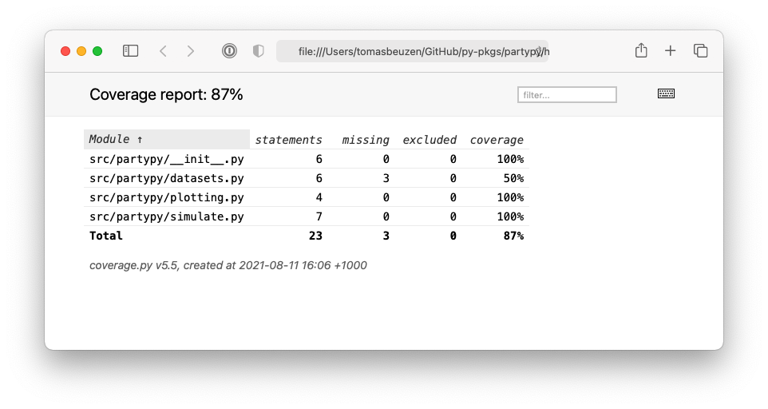
```

We can click on elements of the report, like the *`datasets.py`* module, to see exactly what lines/branches tests are hitting/missing:

```{r 05-test-report-2, fig.cap = "Detailed view of the datasets module in the HTML report.", out.width = "100%", fig.retina = 2, fig.align = "center", echo = FALSE, message = FALSE, warning = FALSE}
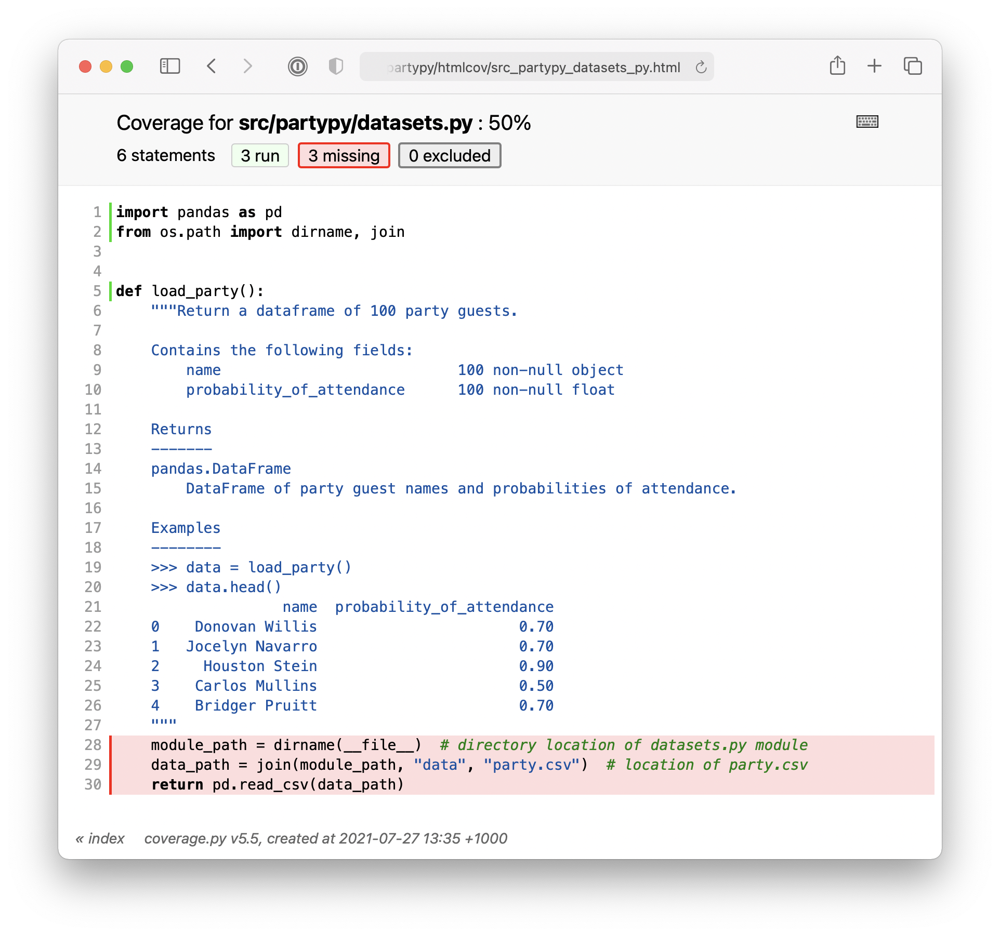
```

## Version control

Throughout this chapter we added a significant number of tests to our *`test_pycounts.py`* file. This change will form part of a new release of our package we'll make in **Chapter 7: [Releasing and versioning]**. So, if you're following along building the `pycounts` package yourself and using version control, commit these changes to your local and remote repositories using the commands below. If you're not building the `pycounts` package or not using version control, you can skip to the next chapter.

```{prompt} bash \$ auto
$ git add tests/test_pycounts.py
$ git commit -m "test: add additional tests for all modules"
$ git push
```

<!--chapter:end:05-testing.Rmd-->


# Documentation


Writing documentation for your package is arguably one of the most important, but perhaps least exciting, parts of the packaging process. The purpose of documentation is to help users understand how they can use and interact with your package, without having to read the source code. For the users of your code (including your future self), having readable and accessible documentation is invaluable. The reality is, if no one knows how to use your package, it will probably not get used!

In **{numref}`03:Package-documentation`** we walked through the steps required to create documentation, compile it into a user-friendly and shareable HTML format, and then host it online. We'll revise those steps here and will provide more detail about documentation workflow and the individual elements of package documentation and when and why they should be included.

## Documentation content and workflow

A typical Python package will include the documentation shown in {numref}`documentation-table`:

```{table} Typical Python package documentation.
:name: documentation-table

|Documentation|Description|
|:---    | :---      |
|README|Provides high-level information about the package, e.g., what it does, how to install it, and how to use it|
|License|Explains who owns the copyright to your package source and how it can be used and shared.|
|Contributing guidelines|Explains how to contribute to the project.|
|Code of conduct|Defines standards for how to appropriately engage with and contribute to the project.|
|Changelog|A chronologically ordered list of notable changes to the package over time, usually organized by version.|
|Examples|Step-by-step, tutorial-like, examples showing how the package works in more detail.|
|Docstrings| Text appearing as the first statement in a function, method, class or module in Python that describes what the code does an dhow to use it. Accessible to users via the `help()` command.|
|API reference|An organized list of the user-facing functionality of your package (i.e., functions, classes, etc.) along with a short description of what they do and how to use them. Typically created automatically from your package's docstrings and `sphinx`|
```

---

but clearly the amount of documentation needed to support your package varies depending on its purpose and the intended audience. For example, if you're developing a package to share code among your own personal projects, or as a way to bundle up a reproducible data analysis, then you may not need contributing guidelines or examples.

- while you might not need this documentation for every package, the reality is that sometimes packages originally intended for personal use, do end up being share, so we recommend generally including eveyrhting. 

Packages that start out for personal use, and that end up being useful, often end up being shared. I think we should suggest they do all this for any package, and use that rationale as to why (and that, it's much harder to find the time and motivation to write those docs after you are done with the package and are at the sharing stage...)

Documentatino is not usually included in a package distribution (i.e., the thing that users will isntall). Instead, it's usually shared

While you may feel that not all of this documentatio nis needed, often a project that is originally created for personal use might end up being shared, so there' sno harm

---

We'll discuss what each of these pieces of documentation are, how to write them, and where to put them in **{numref}`06:Writing-documentation`**. But it's first helpful to understand the big-picture documentation workflow and what we're aiming to build.

The typical workflow for documenting a Python package consists of three steps:
1. **Write documentation**: manually write the documentation source files in  {numref}`documentation-table`, usually in plain-text format, that will support your package;
2. **Build documentation**: compile manually written documentation into an organized, coherent, and shareable format such as HTML or PDF using a documentation generator tool like `sphinx`. {numref}`06-documentation-1` shows an example of built documentation;

    ```{figure} images/03-documentation-1.png
    ---
    width: 100%
    name: 06-documentation-1
    alt: The documentation homepage generated by `sphinx`.
    ---
    The documentation homepage generated by `sphinx`.
    ```

3. **Host documentation online**: share documentation online so it can be easily accessed by anyone with an internet connection, using a free service like [Read the Docs](https://readthedocs.org) or [GitHub Pages](https://pages.github.com). For example, the documentation we built for `pycounts` in **{numref}`03:Package-documentation`** is available online at <https://pycounts.readthedocs.io/en/latest/>.

In the remaining sections of this chapter, we'll walk through each of the above steps.

## Writing documentation

<!-- #region -->
{numref}`documentation-table` shows the typical documentation included in a package. But where does all this documentation go?
- The README, License, Code of conduct, Contributing guidelines, and Changelog files usually appear in the root package directory. They contain important information about your project which should not be buried in its directory structure.
- Additional documentation such as usage examples are usually included in a *`docs/`* subdirectory. This directory also houses the source and configuration files required to build documentation with `sphinx` (such as that shown in {numref}`06-documentation-1`), as we'll talk about in **{numref}`x`**
- Docstrings are written in the Python modules of your package (i.e., *.py* files in the *`src/`* directory). They precede code defintions, as we'll tlak about in **{numref}`x`**.

There's a lot to think about here, but the reality is that most developers make Python packages from templates that create this documentation automatically. For example, consider the `pycounts` package we created using  the `cookiecutter` templating package and the `py-pkgs-cookiecutter` template in **{numref}`03:Creating-a-package-structure`**:

```{code-block}
---
emphasize-lines: 3-9
---
pycounts
├── .readthedocs.yml
├── CHANGELOG.md
├── CONDUCT.md
├── CONTRIBUTING.md
├── docs
│   └── ...
├── LICENSE
├── README.md
├── pyproject.toml
├── src
│   └── ...
└── tests
    └── ...
```

```{note language="note"}
We hide the contents of the docs file here because it might be confusing to look at before we get to **{numref}`sphinx`**.
```

As you can see from the structure above, documentation is typically written in a plain-text markup format such as [Markdown](https://en.wikipedia.org/wiki/Markdown) (*.md*). [reStructuredText](https://www.sphinx-doc.org/en/master/usage/restructuredtext/index.html) (*.rst*) is also commonly used to write documentation, but we prefer Markdown in this book because it is widely used, and we feel it has a less verbose and more intuitive syntax than reStructuredText. Markdown is also supported on a wide variety of IDEs and websites. (check out the [Markdown Guide](https://www.markdownguide.org) to learn more about Markdown syntax). We'll show examples of Markdown syntax and writing these documents in the following sections.
<!-- #endregion -->

### README

The README file is the "map" of your package. It's typically the first thing users will see and read when interacting with your package and should provide high-level information such as: what your package does, how it can be installed, a brief demonstration of usage, who created the package, how it is licensed, and how to contribute it. The README is the "gateway" to your package, without it, users won't know where to begin.

As an example of a README file, we show `pycounts` README below:

````
# pycounts

Calculate word counts in a text file!

## Installation

```bash
$ pip install pycounts
```

## Usage

`pycounts` can be used to count words in a text file and plot the results as follows:

```python
from pycounts.pycounts import count_words
from pycounts.plotting import plot_words
import matplotlib.pyplot as plt

file_path = "test.txt"  # path to your file
counts = count_words(file_path)
fig = plot_words(counts, n=10)
plt.show()
```

## Contributing

Interested in contributing? Check out the contributing guidelines. Please note that this project is released with a code of conduct. By contributing to this project, you agree to abide by its terms.

## License

`pycounts` was created by Tomas Beuzen and licensed under the terms of the MIT license.

## Credits

`pycounts` was created with [`cookiecutter`](https://cookiecutter.readthedocs.io/en/latest/) and the `py-pkgs-cookiecutter` [template](https://github.com/py-pkgs/py-pkgs-cookiecutter).
````

>In the Markdown text above, the following syntax is used:
- Headers are denoted with number signs (\#). The number of number signs corresponds to the heading level.
- Code blocks are bounded by three back-ticks (\`\`\`). A programming language can succeed the opening bounds to specify how the code syntax should be highlighted.
- Links are defined using brackets \[\] to enclose the link text, followed by the URL in parentheses ().

While the raw text above doesn't look like much, the Markdown syntax formats the text nicely when rendered using a tool like `sphinx` (as shown in {numref}`06-documentation-1`), or in any IDE or service that supports Markdown rendering (which is most of them). This is why we use Markdown to write package documentation - it can be written in plain-text but renders into something so much more!

### License

A license tells others what they can and can't do with your code. The [Open Source Initiative (OSI)](https://opensource.org/) is a good place to learn more about different licenses and GitHub also has a [useful tool](https://choosealicense.com/) for helping choose the most appropriate license for your package. Some common licenses used for Python packages include:
- Creative Commons CC0 1.0 Universal (CC0 1.0): releases your software into the public domain, granting permission to use it for any purpose. 
- MIT license: allows users to do whatever they want with your software, as long as they include the original copyright and license notice in any copy or substantial modification of it. 
- GNU General Public License v3 (GPL-3): less permissive than the above licenses. Any changes made to your software must be recorded, and the complete source code of the original software and modifications of it must be made available under the same GPL-3 license.

If you don't include a license, then default copyright laws apply which typically means that you retain all rights to your source code and no one may download, reproduce, distribute, or create derivative works from your package. This might be fine if you want to keep your work private or proprietary, but if you open-source your work without a license, others will be unable to use or contribute to it.

### Contributing guidelines

A contributing guidelines file (often named "CONTRIBUTING") outlines procedures for how users can efficiently and helpfully contribute to your project. These guidelines will vary depending on how you're sharing your package's source with others, but they typically include information on what kind of contributions you're accepting, and how to make those contributions (usually via the use of a version control system). GitHub provides a good [guide](https://help.github.com/en/github/building-a-strong-community/setting-guidelines-for-repository-contributors) for adding a contributing file to your project.

Having clear contributing guidelines streamlines the handling and incorporation of contributions into your package. Without contributing guidelines, it's not clear how others should effectively contribute, or if you would like contributions at all. As a result, you may receive contributions you don't want, or in a way you don't want, which could waste yours and other people's time.

### Code of conduct

A code of conduct file (often named "CONDUCT") is used to define community standards, identify a welcoming and inclusive project, and outline procedures for handling abuse. GitHub provides an excellent [guide](https://help.github.com/en/github/building-a-strong-community/adding-a-code-of-conduct-to-your-project) for adding a code of conduct to your project. A code of conduct helps the community feel safe, respected, and welcome to contribute to your package. Without it, others may not want to contribute to your package and conflicts may arise among contributors with conflicting ideas.

### Changelog

<!-- #region -->
A changelog is a file which contains a chronologically ordered list of changes made to your package. Changes are typically organized per released version of your package, something we'll discuss more in **Chapter 7: [Releasing and versioning]**. Having a changelog helps users and contributors understand the history of a package and how it has evolved over time. Without it, there's no easy way for users to understand when, what, and why changes were made to your package.

Changelog's are made for humans to read. They typically contain dot-points of important changes made for each version of your package, grouped into categories such as: "Feature", "Fix", "Documentation", "Tests", and with the latest version at the top of the file. An example of a hypothetical changelog for our `pycounts` package is shown below and the rendered version is shown in Fig X:

```
# Changelog

<!--next-version-placeholder-->

## v0.2.1 (24/08/2021)

### Fix

- First release of `pycounts`

## v0.2.0 (24/08/2021)

### Feature

- First release of `pycounts`

### Documentation

- Add examples

## v0.1.0 (24/08/2021)

- First release of `pycounts`
```

>In **Chapter 8: [Continuous integration and deployment]**, we'll show how you can automatically update your changelog with continuous integration.

<!-- #endregion -->

### Examples

<!-- #region -->
Creating examples of how to use your package can be invaluable to new and existing users alike. Unlike the brief "Usage" heading in the README in **{numref}`06:README`**, these examples are more like tutorials, including a mix of text, figures, and code that demonstrates the functionality and common workflows of your package step-by-step. The examples should be realistic and illustrate workflows that users of your package might actually do (as opposed to toy examples).

It's important to think about your audience here too. Sometimes, it's necessary to create examples for different levels of expertise. Examples for new users will introduce the basic functionality of your package step-by-step, with plenty of commentary about what each piece of code is doing and why. Examples for more competent users might be more code-based, requiring less explanation of each step, and will likely explore more advanced usage of the package.

You could certainly write examples from scratch using a plain-text format like Markdown but this can be inefficient and prone to errors. Instead, we recommend creating examples using a computational notebook like a Jupyter notebook (*.ipynb* file). Jupyter notebooks are interactive documents that can contain code, equations, text, and visualizations. They are effective for demonstrating examples because they directly import and use code from your package; this ensures you don't make mistakes when writing out your example, and allows users to download, execute, and interact with the notebooks themselves (as opposed to just reading text). 

To create examples in a Jupyter notebook, you'll need to install the Jupyter software. If you're using a `poetry`-managed project, as we do in this book, you can install the Jupyter software as a development dependency of your package with the following command:

```{prompt} bash \$ auto
$ poetry add --dev jupyter
```

Once installed, you can launch the Jupyter Notebook application with the following command:

```{prompt} bash \$ auto
$ jupyter notebook
```

>If you're developing your Python packages in an IDE that supports notebooks, such as VS Code or JupyterLab, feel free to create your notebooks there.

Notebooks are made of "cells" that can contain Python code or Markdown text. Discussing how to use the Jupyter application is beyond the scope of this book, and we refer readers to the Jupyter [documentation](https://jupyter-notebook.readthedocs.io/en/latest/?badge=latest) to learn more. However, **{numref}`06-jupyter-example-2`**, shows an example notebook that we created to support our `pycounts` package in **{numref}`03:Creating-usage-examples`**.

```{r 06-jupyter-example-2, fig.cap = "A simple Jupyter notebook using code from `pycounts`.", out.width = "100%", fig.retina = 2, fig.align = "center", echo = FALSE, message = FALSE, warning = FALSE}
knitr::include_graphics("../images/03-jupyter-example-2.png")
```

It's important to stress that because examples written in Jupyter notebooks use your package's code directly, they will immediately reflect any changes you make to your code. As opposed ot if you wrote example manually, you'd have to go back and change all the outputs. interactive notebooks uses code from  important to note is that the outputs are generated using the actual code from our package itself, they have not been included manually. 

In **{numref}`XXX`** we'll show how we can even use `sphinx` to automatically execute notebooks and include their content (including the outputs of code cells) into our built documentation collection of all our packages documentation that users can easily read and navigate through without having to start the Jupyter application!
<!-- #endregion -->

### Docstrings

A docstring is a string, surrounded by triple-quotes, at the start of a module, class, or function in Python (preceding any code) that provides documentation on what the object does and how to use it. Docstrings automatically become the object's documentation, accessible to users via the `help()` function. Docstrings are a user's first port-of-call when they are trying to use your package, they really are a necessity when creating packages, even for yourself.

General docstring convention in Python is described in [Python Enhancement Proposal (PEP) 257 - Docstring Conventions](https://www.python.org/dev/peps/pep-0257/), but there is flexibility in how you write your docstrings. A minimal docstring contains a single line describing what the object does, and that might be sufficient for a simple function or for when your code is in the early stages of development. However, for code you intend to share with others (including your future self) a more comprehensive docstring should be written. A typical docstring will include:

1. A one-line summary that does not use variable names or the function name;
2. An extended description;
3. Parameter types and descriptions;
4. Returned value types and descriptions;
5. Example usage; and,
6. Potentially more.

There are different "docstring styles" used in Python to organize this information, such as [numpydoc style](https://numpydoc.readthedocs.io/en/latest/format.html#docstring-standard), [Google style](https://github.com/google/styleguide/blob/gh-pages/pyguide.md#38-comments-and-docstrings), and [sphinx style](https://sphinx-rtd-tutorial.readthedocs.io/en/latest/docstrings.html#the-sphinx-docstring-format). In this book, we've been using the numpydoc style because we find it has an intuitive syntax and is human-readable. In the numpydoc style:
- Section headers are denoted as text underlined with dashes;
- Input arguments are denoted as:
    ```
    name : type
        Description of parameter `name`.
    ```
- Output values use the same syntax above, but specifying the `name` is optional.

As an example of a docstring, consider the `count_words()` function of our `pycounts` (numbers in the docstring below identify items in the numbered list above, but they should not be included in your docstring) In this style, header sections are denoted by text underline with dashes, and input/output arguments 

```python
def count_words(input_file):
    """Count words in a text file. (1)

    Words are made lowercase and punctuation is removed 
    before counting. (2)

    Parameters (3)
    ----------
    input_file : str
        Path to text file.

    Returns (4)
    -------
    collections.Counter
        dict-like object where keys are words and values are their counts.

    Examples (5)
    --------
    >>> count_words("text.txt")
    """
    text = load_text(input_file)
    text = clean_text(text)
    words = text.split()
    return Counter(words)
```

You can add information to your docstrings at your discretion - you won't always need all the sections above, and in some case you may want to include additional sections from the [numpydoc style documentation](https://numpydoc.readthedocs.io/en/latest/format.html#docstring-standard).

### Application Programming Interface (API) reference

An Application Programming Interface (API) reference sheet is an organized index of your package's user-facing functionality and associated docstrings. It helps users efficiently understand and search through your package's functionality without having to dig-in to the source code or run the Python `help()` command on every object they need to know about.

As a conrete example of what we're talking about, **{numref}`03-documentation-4`** show an API reference for our `pycounts` package and **{numref}`03-documentation-3`** shows the contents of clicking on the `pycounts.plotting` module.

```{r 06-documentation-4, fig.cap = "Documentation for the pycounts plotting module.", out.width = "100%", fig.retina = 2, fig.align = "center", echo = FALSE, message = FALSE, warning = FALSE}
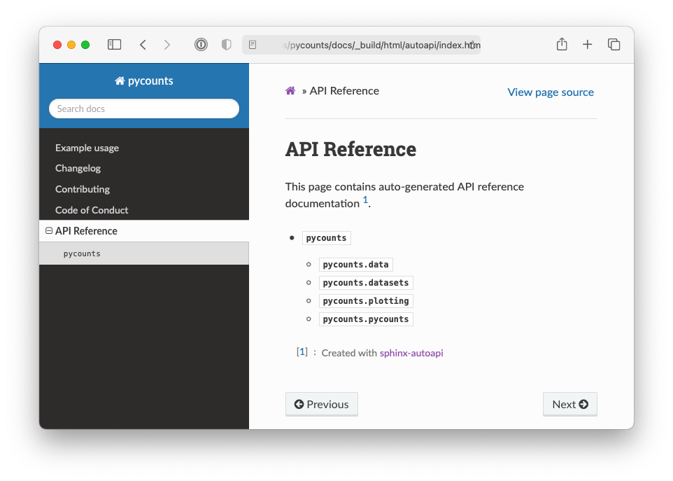
```

```{r 06-documentation-3, fig.cap = "Documentation for the pycounts plotting module.", out.width = "100%", fig.retina = 2, fig.align = "center", echo = FALSE, message = FALSE, warning = FALSE}
knitr::include_graphics("../images/03-documentation-3.png")
```

You could create an API reference by manually copying and pasting the names of all of your package's Python objects (functions, modules, classes, etc.) and their docstrings into a plain-text file, but that would be incredibly tedious and not reproducible. Instead, API references are usually generated automatically using `sphinx` which can parse your source code to extract Python objects and their docstrings and render them into an API reference. We'll demonstrate how to do this in **{numref}`06:Building-documentation`**.

### Other package documentation

In this section we've only explored the core documentation typically included in a Python package. But you can add as much documentation as you wish! For example, you might wish to write documents for frequently asked questions (FAQ), a document referencing how your project compares to similar projects, information on project funding and attribution, etc. In general, the more documentation the better!

## Building documentation

<!-- #region -->
At the moment, the documentation we've written is spread throughout our package's directory structure in the form of plain-text Markdown files, Jupyter notebooks, and docstrings in our Python modules. Rather than requiring users to search through this directory structure to find documentation, it's common to use a documentation generator like `sphinx` to compile all of this documentation into a user-friendly output format such as HTML or PDF that is easy to view, navigate, and share with others. We showed an example of `sphinx`-generated documentation in {numref}`06-documentation-1`. As we'll see in this section, `sphinx` also has a rich ecosystem of extensions that can be used to help customize and automatically generate content to complement your manually-written documentation.

We'll demonstrate the process of building documentation with `sphinx` using our `pycounts` package. This section will effectively walk through the same steps we went through in **{numref}`03:Generating-documentation`**, so for readers that have recently read that section, feel free to skip to **{numref}`06:Hosting-documentation-online`**. 

The source and configuration files to build documentation using `sphinx` live in a *`docs/`* folder in the root of your package. The `py-pkgs-cookiecutter` automatically created this folder for us:

```{code-block}
---
emphasize-lines: 6-15
---
pycounts
├── .readthedocs.yml
├── CHANGELOG.md
├── CONDUCT.md
├── CONTRIBUTING.md
├── docs
│   ├── changelog.md
│   ├── conduct.md
│   ├── conf.py
│   ├── contributing.md
│   ├── example.ipynb
│   ├── index.md
│   ├── make.bat
│   ├── Makefile
│   └── requirements.txt
├── LICENSE
├── pyproject.toml
├── README.md
├── src
│   └── ...
└── tests
    └── ...
```

>If you don't use a template to create your Python package directory structure, the `sphinx` command `sphinx-quickstart` can be used to quickly create the source files for you.

The *`docs`* directory includes:

- *`Makefile`*/*`make.bat`*: files that contain commands needed to build our documentation with `sphinx` and do not need to be modified. [Make](https://www.gnu.org/software/make/) is a tool used to run commands to efficiently read, process, and write files. A Makefile defines the tasks for Make to execute. If you're interested in learning more about `make`, we recommend the excellent tutorial [Learn Makefiles](https://makefiletutorial.com). But for building documentation with `sphinx`, all you need to know is that having these Makefiles allows us to build documentation with the simple command `make html` and clean documentation (i.e., remove it so we can make a fresh copy) with the command `make clean`.
- *`requirements.txt`*: contains a list of documentation-specific dependencies required to host our docs on [Read the Docs](https://readthedocs.org/), which we'll discuss in **{numref}`06:Hosting-documentation-online`**;
- *`conf.py`* is a configuration script controlling how `sphinx` builds your documentation. You can read more about *`conf.py`* in the `sphinx` [documentation](https://www.sphinx-doc.org/en/master/usage/configuration.html) and we'll touch on it again shortly, but for now, it has been pre-populated by the `py-pkgs-cookiecutter` template and does not need to be modified;
- The remaining files in the `docs` directory form the content of our generated documentation, as we'll discuss in the remainder of this section.

The *`index.md`* file forms the landing page of `sphinx` documentation. Think of it as the homepage of a website. Our landing page will look like {numref}`06-documentation-2` once we build it.

```{r 06-documentation-2, fig.cap = "The documentation homepage generated by `sphinx`.", out.width = "100%", fig.retina = 2, fig.align = "center", echo = FALSE, message = FALSE, warning = FALSE}
knitr::include_graphics("../images/03-documentation-1.png")
```

For your documentation landing page, you'd typically want some high-level information about your package, and then links to the rest of the documentation you want to expose to a user. If you open *`index.md`* in an editor of your choice, that's exactly the content we are including, with a very particular kind of syntax:

````
```{include} ../README.md
```

```{toctree}
:maxdepth: 1
:hidden:

example.ipynb
changelog.md
contributing.md
conduct.md
autoapi/index
```
````

Sphinx natively supports [reStructuredText](https://www.sphinx-doc.org/en/master/usage/restructuredtext/index.html), but many developers prefer to work in Markdown (as we do in this book). The syntax shown above in *`index.md`* is a flavor of Markdown known as [Markedly Structured Text (MyST)](https://myst-parser.readthedocs.io/en/latest/syntax/syntax.html). MyST is based on Markdown but with additional syntax options compatible for use with `sphinx`. For example, the `{include}` syntax specifies that we want the *`index.md`* landing page to include the content of the *`README.md`* in our package's root directory (think of it as a copy-paste operation).

The `{toctree}` syntax defines what documents will be listed in the table of contents (ToC) on the left-hand side of {numref}`06-documentation-2`. The argument `:maxdepth: 1` indicates how many heading levels the ToC should include, and `:hidden:` specifies that the ToC should only appear in the side bar and not in the index page itself. The ToC then lists the documents we want to include and link to in our documentation.

"example.ipynb" is the notebook we wrote in section **{numref}`03:Creating-usage-examples`**. `sphinx` doesn't support relative links in a ToC, so to include the documents *`CHANGELOG.md`*, *`CONTRIBUTING.md`*, *`CONDUCT.md`* in our root, we create "stub files" *`changelog.md`*, *`contributing.md`*, and *`conduct.md`* which contain links to these documents with the `{include}` syntax from earlier (which does support relative links). For example, *`changelog.md`* contains the following text:

````md
```{include} ../CHANGELOG.md
```
````

The final document in the ToC, "autoapi/index" is an API reference sheet that will be generated automatically for us, using our package structure and docstrings, when we build our documentation.

Before we can go ahead and build our documentation, it relies on a few extensions that need to be installed and configured:

- [myst-nb](https://myst-nb.readthedocs.io/en/latest/): extension that will enable `sphinx` to parse our Markdown, MyST, and notebook files (`sphinx` only supports reStructuredTex, *.rst* files, by default);
- [sphinx-rtd-theme](https://sphinx-rtd-theme.readthedocs.io/en/stable/): a custom theme for styling the way our documentation will look;
- [sphinx-autoapi](https://sphinx-autoapi.readthedocs.io/en/latest/): extension that will parse our source code to create an API reference sheet;
- [sphinx.ext.napoleon](https://sphinxcontrib-napoleon.readthedocs.io/en/latest/): extension that enables `sphinx` to parse both numpydoc-style docstrings; and,
- [sphinx.ext.viewcode](https://www.sphinx-doc.org/en/master/usage/extensions/viewcode.html): extension that adds a helpful link to the source code of each object in the API reference sheet.

All these extensions are not necessary to create documentation with `sphinx`, but they are all commonly used in Python packaging documentation and significantly improve the look and user-experience of the generated documentation. Extensions without the `sphinx.ext` prefix need to be installed. We can install them as development dependencies in a `poetry`-managed project with the following command:

```{prompt} bash \$ auto
$ poetry add --dev myst-nb sphinx-autoapi sphinx-rtd-theme
```

Once installed, any extensions you want to use need to be added to a list called `extensions` in the *`conf.py`* configuration file. Configuration options for each extension (if they exist) can be viewed in their respective documentation, but the `py-pkgs-cookeicutter` has already taken care of everything for us, by defining the following variables within *`conf.py`*:

```python
extensions = [
    "myst_nb",
    "autoapi.extension",
    "sphinx.ext.napoleon",
    "sphinx.ext.viewcode",
    "sphinx_copybutton",
]
autoapi_dirs = ["../src"]
html_theme = "sphinx_rtd_theme"
```

With our documentation structure set up, and our extensions configured, we can now build our documentation with `sphinx` using the following command from our root package directory:

```{prompt} bash \$ auto
$ make html -C docs
```

```console
Running Sphinx
making output directory... done
...
build succeeded.
The HTML pages are in _build/html.
```

If we now look inside our *`docs`* directory we see a new directory *`_build/html`* which contains our rendered HTML files. If you open *`_build/html/index.html`* you should see the page shown in {numref}`06-documentation-2`.

The `sphinx-autoapi` extension extracted the docstrings within each module and rendered them into our documentation. You can find the generated API reference sheet by clicking "API Reference" in the table of contents. For example, {numref}`03-documentation-2` shows the functions and docstrings in the `pycounts.plotting` module. The `sphinx.ext.napoleon` enabled `sphinx` to parse our [numpydoc style](https://numpydoc.readthedocs.io/en/latest/format.html#docstring-standard) docstrings and the `sphinx.ext.viewcode` extension added the "\[source\]" link next to each function in our API reference sheet which links readers directly to the source code of the function (if they want to view it).

```{r 06-documentation-2, fig.cap = "Documentation for the pycounts plotting module.", out.width = "100%", fig.retina = 2, fig.align = "center", echo = FALSE, message = FALSE, warning = FALSE}
knitr::include_graphics("../images/03-documentation-2.png")
```

Finally, if we navigate to the "Example usage" page, {numref}`03-documentation-3` shows the Jupyter notebook we wrote in **{numref}`03:Creating-usage-examples`** rendered into our documentation, including the Markdown text, code input, and executed output. This was made possible using the `myst-nb` extension.

```{r 06-documentation-3, fig.cap = "Jupyter notebook example rendered into `pycounts`'s documentation.", out.width = "100%", fig.retina = 2, fig.align = "center", echo = FALSE, message = FALSE, warning = FALSE}
knitr::include_graphics("../images/03-documentation-3.png")
```

Ultimately, you can easily and efficiently make beautiful and many-featured documentation with `sphinx` and its ecosystem of extensions. You can now use this documentation yourself or potentially share it with others, but it really shines when you host it on the web using a free service like [Read the Docs](https://readthedocs.org/), as we'll do in the next section. 
<!-- #endregion -->

## Hosting documentation online

<!-- #region -->
If you intend to share your package with others, it will be useful to make your documentation accessible online. It's common to host Python package documentation on the free online hosting service [Read the Docs](https://readthedocs.org/), which can automate the building, deployment, and hosting of your documentation directly from an online repository. 

Read the Docs works by connecting to an online repository hosting your package documentation, such as a GitHub repository. When you push changes to your repository, Read the Docs automatically builds a fresh copy of your documentation (i.e., runs `make html`) and hosts it at the URL <https://pkgname.readthedocs.io/> (you can also configure Read the Docs to use a custom domain name). This means that any changes you make to your documentation source files are immediately deployed to your users. If you need your documentation to be private (i.e., only available to employees of a company), Read the Docs offers a paid "Business plan" with this functionality.

>[GitHub Pages](https://pages.github.com) is another popular service used for hosting documentation from a repository. However, it doesn't natively support automatic building of your documentation when you push changes to the source files. This functionality can be configured through the use of [GitHub Actions](https://github.com/features/actions), but we prefer to use Read the Docs here because of it's simpler set up.

The [Read the Docs](https://readthedocs.org) documentation will provide the most up-to-date steps required to host your documentation online. For our `pycounts` package, this involved the following steps:

1. Visit <https://readthedocs.org/> and click on "Sign up";
2. Select "Sign up with GitHub";
3. Click "Import a Project";
4. Click "Import Manually";
5. Fill in the project details by:
    1. Providing your package name (e.g., `pycounts`);
    2. The GitHub repository URL (e.g., `https://github.com/TomasBeuzen/pycounts`); and,
    3. Specify the default branch as `main`.
6. Click "Next" and then "Build version".

After following the steps above, your documentation should be successfully built by [Read the Docs](https://readthedocs.org/) and you should be able to access it via the "View Docs" button on the build page. For example, the documentation for `pycounts` is now available at <https://pycounts.readthedocs.io/en/latest/>. This documentation will be automatically re-built by Read the Docs each time you push changes to the specified default branch of your GitHub repository.

>The *`.readthedocs.yml`* file that `py-pkgs-cookiecutter` created for us in the root directory of our Python package contains the configuration settings necessary for Read the Docs to properly build our documentation. It specifies what version of Python to use and tells Read the Docs that our documentation requires the extra packages specified in *`pycounts/docs/requirements.txt`* to be generated correctly.

<!-- #endregion -->

<!--chapter:end:06-documentation.Rmd-->


# Releasing and versioning


Previous chapters have focused on how to develop a Python package from scratch; by creating the Python source code, developing a testing framework, writing documentation, and then releasing it online via PyPI (if desired). This chapter now describes the next step in the packaging workflow; updating your package!

At any given time, your package's users (including you) will use a particular version of your package in a project. If you change the package's source code, their code could potentially break (imagine you change a module name, or remove a function argument a user was using). To solve this problem, developers assign a unique version number to each unique state of their package and release each new version as an independent distribution. Most of the time, users will want to use the most up-to-date version of your package, but sometimes, they'll need to use an older version that was compatible with a project they created at the time they used a particular version. Releasing versions of your package is also the main way you can communicate to your users that your package has changed (e.g, bugs have been fixed, new features have been added,etc.). In this chapter, we'll walk through this process of creating and releasing new versions of your Python package.

## Version numbering

Versioning is the process of adding unique identifiers to different versions of your package. The unique identifier you use may be name-based or number-based, but most Python packages use [semantic versioning](https://semver.org) for identifying versions of their software. In semantic versioning, a version number consists of three integers A.B.C, where A is the "major" version, B is the "minor" version, and C is the "patch" version. In semantic versioning, the first version of a software usually starts at 0.1.0 and increments from there. We refer to an increment as a "bump" and it consists of adding 1 to either the major, minor, or patch identifier as follows:

- Patch release (0.1.0 -> 0.1.1): patch releases are typically used for bug fixes which are backward compatible. Backward compatibility refers to the compatibility of your package with previous versions of itself. So for example, if a user was using v0.1.0 of your package, they should be able to upgrade to v0.1.1 and have any code they previously wrote still work. It's completely fine to have so many patch releases that you need to use two digits (e.g., 0.1.27).
- Minor release (0.1.0 -> 0.2.0): a minor release typically includes larger bug fixes or new features which are backward compatible.
- Major release (0.1.0 -> 1.0.0): release 1.0.0 is used for the first stable public release of your package. After that, major releases are made for changes that are not backward compatible and may affect many users. Changes that are not backward compatible are called "breaking changes".

Most of the time, you'll be making patch and minor releases. But even with the guidelines above, versioning a package can be a little subjective and requires you to use your best judgment. For example, small packages might make a patch release for each individual bug fixed or a minor release for each new feature added (such as a new function). In contrast, larger packages will often group multiple bug fixes into a patch releases or multiple features into a minor release; because making a release for every single change would result in an overwhelming and confusing amount of releases! {numref}`release-table` shows some practical examples of major, minor, and patch release for the Python software itself. To help clarify when releases should be made, some developers create a "version policy" document for their package; the `pandas` [version policy](https://pandas.pydata.org/docs/development/policies.html#version-policy) is a good example of this.

```{table} Examples of major, minor, and patch releases of the Python software.
:name: release-table

|Release Type|Version Bump|Description|
|:---    |:---   | :---      |
|Major|2.X.X -> 3.0.0 ([December, 2008](https://www.python.org/downloads/release/python-300/))| This release included breaking changes, for example, `print()` became a function, and integer division resulted in creation of a float rather than an integer. Many built-in objects like dictionaries and strings also changed considerably, and many old features were removed in this release.|
|Minor|3.8.X -> 3.9.0 ([October, 2020](https://www.python.org/downloads/release/python-390/))| Many new features and optimizations were added in this release, for example, new string methods to remove prefixes (`.removeprefix()`) and suffixes (`.removesuffix()`) were added and a new parser was implemented for CPython (the engine that actually compiles and executes your Python code).|
|Patch|3.9.5 -> 3.9.6 ([June, 2021](https://www.python.org/downloads/release/python-396/))| This release contained many bug fixes and maintenance changes, for example, a confusing error message was updated in the `str.format()` method, the version of `pip` bundled with Python downloads was updated from 21.1.2 -> 21.1.3, and several parts of the documentation were updated.|
```

## Bumping package version

We'll describe the workflow for releasing a new version of your package in **{numref}`07:Checklist-for-releasing-a-new-package-version`**. The first step in that workflow is to bump your package's version and there's a few ways to do that so it's worth discussing first.

### Manual version bumping

Once you've decided what the new version of your package will be (i.e., are you making a patch, minor, or major release) you need to update the package's version number in your source code. For a `poetry`-managed project, that information is in the *`pyproject.toml`* file. Consider the *`pyproject.toml`* file of the `pycounts` package we developed in **Chapter 3: [How to package a Python]**, and the top of which looks like this:

```{code-block} toml
---
emphasize-lines: 3
---
[tool.poetry]
name = "pycounts"
version = "0.1.0"
description = "Calculate word counts in a text file!"
authors = ["Tomas Beuzen"]
license = "MIT"
readme = "README.md"

...rest of file hidden...
```

Imagine we wanted to make a patch release of our package. We could simply increment the `version` number manually in this file to "0.1.1" and many developers do take this manual approach. An alternative semi-automated approach is to use the the `poetry version` command. The `poetry version` command can be used with the arguments `patch`, `minor` or `major` depending on how you want to update the version of your package. For example, to make a patch release, we would run the following at the command line:

```{prompt} bash \$ auto
$ poetry version minor
```

```console
Bumping version from 0.1.0 to 0.1.1
```

The head of our `pyproject.toml` file now looks like this:

```toml
[tool.poetry]
name = "pycounts"
version = "0.1.1"
...
```

### Automatic version bumping

In this book, we're interested in automating as much as possible of the packaging workflow. While the manual versioning approach described above in **{numref}`07:Manual-version-bumping`** is certainly used by many developers, we can do things more efficiently! To automate version bumping, you'll need to be using a version control system like Git. If you chose not to use version control for your package, you can skip to **{numref}`07:Checklist-for-releasing-a-new-package-version`**.

[Python Semantic Release (PSR)](https://python-semantic-release.readthedocs.io/en/latest/) is a tool that can automatically bump version numbers based on keywords it finds in commit messages. The idea is to use a standardized commit message format and syntax which PSR can parse to determine how to increment the version number. The default commit message style is the [Angular commit style](https://github.com/angular/angular.js/blob/master/DEVELOPERS.md#commit-message-format) which looks like this:

```
<type>(optional scope): succinct description of the change

(optional body: the motivation for the change and contrast this with previous behavior)

(optional footer: note BREAKING CHANGES here, as well as any issues to be closed)
```

`<type>` refers to the kind of change made and is usually one of:
- `feat`: A new feature
- `fix`: A bug fix
- `docs`: Documentation only changes
- `style`: Changes that do not affect the meaning of the code (white-space, formatting, missing semi-colons, etc)
- `refactor`: A code change that neither fixes a bug nor adds a feature
- `perf`: A code change that improves performance
- `test`: Adding missing or correcting existing tests
- `chore`: Changes to the build process or auxiliary tools and libraries such as documentation generation

`scope` is an optional inclusion that provides context for where the change was made.

The important point to learn here is that different text in the commit message will trigger PSR to make different kinds of releases:
- A `<type>` of `fix` triggers a patch version bump, e.g.;
    ```{prompt} bash \$ auto
    $ git commit -m "fix(code): change confusing error message in plotting.plot_words"
    ```
- A `<type>` of `feat` triggers a minor version bump, e.g.;
    ```{prompt} bash \$ auto
    $ git commit -m "feat(code): add example data to package"
    ```
- The text `BREAKING CHANGE:` in the `footer` will trigger a major release, e.g., 
    ```{prompt} bash \$ auto
    $ git commit -m "feat(code): move code from plotting module to pycounts module
    $ 
    $ BREAKING CHANGE: plotting module no longer exist after this release."
    ```

To use PSR we need to install and configure it. To install PSR as a developmet dependency of a `poetry`-managed project, you can run:

```{prompt} bash \$ auto
$ poetry add --dev python-semantic-release
```

To configure PSR, we just need to tell it where our version number is stored. As we saw in **{numref}`07:Manual-version-bumping`**, for a `poetry`-managed project, the package version is stored in the *`pyproject.toml`* file,  as the variable `version` under the heading `[tool.poetry]` (headings are called "tables" in TOML file jargon). To tell PSR this, we need to add a new table to the *`pyproject.toml`* file called `[tool.semantic_release]` within which we specify that our `version_variable` is stored at `pyproject.toml:version`:

```toml
...rest of file hidden...

[tool.semantic_release]
version_variable = "pyproject.toml:version"
```

To use PSR to automatically bump your package's version number, you can now use the command `semantic-release version` at the command line. As a simple example, imagine we have a package at version 0.1.0, make a bug fix and commit it with the following message:

```{prompt} bash \$ auto
$ git commit -m "fix(code): change confusing error message in plotting.plot_words"
```

We can run `semantic-release version` to update our version number. In the command below, we'll specify the argument `-v DEBUG` to print information to the screen so you can get an inside look at how PSR works:

```{prompt} bash \$ auto
$ semantic-release version -v DEBUG
```

```console
Creating new version
debug: get_current_version_by_config_file()
debug: Parsing current version: path=PosixPath('pyproject.toml') pattern='version *[:=] *["\\\'](\\d+\\.\\d+(?:\\.\\d+)?)["\\\']' num_matches=1
debug: Regex matched version: 0.1.0
debug: get_current_version_by_config_file -> 0.1.0
Current version: 0.1.0
debug: evaluate_version_bump('0.1.0', None)
debug: parse_commit_message('fix(code): change confusing error message in plotting.plot_words')
debug: parse_commit_message -> ParsedCommit(bump=1, type='fix', scope='code', descriptions=['change confusing error message in plotting.plot_words'], breaking_descriptions=[])
debug: Commits found since last release: 1
debug: evaluate_version_bump -> patch
debug: get_new_version('0.1.0', 'patch')
debug: get_new_version -> 0.1.1
debug: set_new_version('0.1.1')
debug: Writing new version number: path=PosixPath('pyproject.toml') pattern='version *[:=] *["\\\'](\\d+\\.\\d+(?:\\.\\d+)?)["\\\']' num_matches=1
debug: set_new_version -> True
debug: commit_new_version('0.1.1')
debug: commit_new_version -> [main d82fa3f] 0.1.1
debug:  Author: semantic-release <semantic-release>
debug:  1 file changed, 5 insertions(+), 1 deletion(-)
debug: tag_new_version('0.1.1')
debug: tag_new_version -> 
Bumping with a patch version to 0.1.1
```

This command automatically updates the version number in the the *`pyproject.toml`* file and automatically creates a new tag for your package's source files (something we talked about in **{numref}`03:Tagging-a-package-release-with-version-control`**). In **{numref}`XXX`** we'll go through a real example of using PSR with our `pycounts` package.

## Checklist for releasing a new package version

Now that we know about versioning and how to increment the version of our package, we're ready to run through a release checklist. We'll make a real release of our `pycounts` package from v0.1.0 to v0.2.0 to demonstrate each step in the release checklist practically.

### Step 1: make changes to package source files

This is an obvious one, but before you can make a new release, you need to make the changes to your package's source that will comprise your new release!

Consider our `pycounts` package. We published the first release of our package in **Chapter 3: [How to package a Python]**. Since then, we've made a few changes. Specifically:
- In **Chapter 4: [Package structure and distribution]** we added a new "datasets" module to our package along with some example data that users could load and use to try out the functionality of our package.
- In **Chapter 5: [Testing]** we significantly upgraded our testing suite by adding several new tests to the *`tests/test_pycounts.py`* file.

The above changes would constitute a minor release (we added a new feature and made some significant changes to our package's test framework). However, we'll be using PSR. In **{numref}`XXX`** and **{numref}`XXX`** we added these changes to version control with the following commit messages:

```{prompt} bash \$ auto
$ git commit -m ""
```

The syntax we used for these messages is important because we'll be using PSR (**{numref}`07:Automatic-version-bumping`**) to parse these messages and automatically bump our package version for us.

>In practice, changes are usually made to a package's source using branches. This keeps the changes completely separate from the existing version of the code. We didn't use branches in this book because it adds another layer of complexity onto the already 


### Step 2: bump version number

<!-- #region -->
When you've made the desired changes to your package and are ready to release it, you need to bump the version manually (**{numref}`07:Manual-version-bumping`**) or automatically with the PSR tool (**{numref}`07:Automatic-version-bumping`**).

We'll use the PSR tool but if you're not using Git as a version control system, you'll need to do this step manually. To use PSR to bump our package version all we need to do is run the following command:

>If you want to see exactly what PSR found in your commit messages and why it decided to make a patch, minor, or major release, add the argument `-v debug` to the `semantic-release version` command.

```{prompt} bash \$ auto
$ semantic-release version
```

```console
Creating new version
Current version: 0.1.0
Bumping with a minor version to 0.2.0
```

This step automatically updated our package's version in the *`pyproject.toml`* file and created a new tag for our package, "v0.2.0", which you could view by typing `git tag --list` at the command line:

```{prompt} bash \$ auto
$ git tag --list
```

```console
v0.1.0
v0.2.0
```
<!-- #endregion -->

<!-- #region -->
Once the package source code has been updated and is ready to be released we need to update the package version number. For our `pycounts` package setup, all the package metadata is handled in the *`pyproject.toml`* file and this is the only place we need to update the version number (note that other package setups may include this information in different and various places). The head of our *`pyproject.toml`* file currently looks like this:

```toml
[tool.poetry]
name = "pycounts"
version = "0.1.0"
...
```

We could increment the `version` number manually to 0.2.0 or we can use the `poetry` command `version` to do it for us. In the interest of efficiency and automation, we'll take the latter approach. The `poetry version` command can be used with the arguments `patch`, `minor` or `major` depending on how you want to update the version of your package. As we're making a new minor release, we'll use the following command in our terminal:

```{prompt} bash \$ auto
$ poetry version minor
```

```console
Bumping version from 0.1.0 to 0.2.0
```

The head of our `pyproject.toml` file now looks like this:

```toml
[tool.poetry]
name = "pycounts"
version = "0.2.0"
...
```

>`poetry` also offers other version bumping argument that cater to version schemes of other syntax. Read more in the `poetry` [documentation](https://python-poetry.org/docs/cli/#version).

<!-- #endregion -->

### Step 3: run tests and build documentation

<!-- #region -->
We've now prepped our package for release, but before we move on to sharing it with others, we should first check that its tests run and documentation builds successfully. To do this with our `pycounts` package, we should first install the package (we need to re-install as we've created a new version):

>Recall that we are working in the `pycounts` virtual environment we created with `conda` in **Chapter 3: [How to package a Python]**, which you can activate by running `conda activate pycounts` in your terminal.

```{prompt} bash \$ auto
$ poetry install
```

```console
Installing the current project: pycounts (0.2.0)
```

Now we'll check that our tests are still passing and what their coverage is using `pytest` and `pytest-cov`:

```{prompt} bash \$ auto
$ pytest tests/ --cov=pycounts
```

```console
============================= test session starts ==============================
platform darwin -- Python 3.9.2, pytest-6.2.3, py-1.10.0, pluggy-0.13.1
rootdir: /Users/tomasbeuzen/GitHub/py-pkgs/pycounts
collected 3 items                                                              

tests/test_pycounts.py ...                                                [100%]

---------- coverage: platform darwin, python 3.9.6-final-0 -----------
Name                      Stmts   Miss  Cover
---------------------------------------------
src/pycounts/__init__.py       6      0   100%
src/pycounts/datasets.py       6      0   100%
src/pycounts/plotting.py       4      0   100%
src/pycounts/simulate.py       7      0   100%
---------------------------------------------
TOTAL                        23      0   100%

============================== 3 passed in 0.41s ===============================
```

>Your package might require more checks than this, for example to determine that your code conforms to a particular code style, or can be built on different operating systems and versions of Python, etc. We'll explore some of these additional checks, as well as how to automate this testing and checking procedure in **Chapter 8: [Continuous integration and deployment]**.

Finally, we should check that our documentation still builds correctly. You typically want to create the documentation from scratch, i.e., remove any existing built documentation in your package. To do this, we first need to run `make clean -C docs/` before running `make html -C docs/`, or in the spirit of efficiently we can combine these two commands together like we do below:

```{prompt} bash \$ auto
$ make clean html -C docs/
```

```console
Running Sphinx
...
build succeeded.
The HTML pages are in _build/html.
```
<!-- #endregion -->

### Step 4: document your release

With our new release ready, and the tests and documentation passing successfully, we can document the release in what's happened in your *`CHANGELOG`*. For example, here's `pycounts`'s updated *`CHANGELOG.md`* file:

We talked about changelog format in **{numref}`06:Changelog`**.

```
# Changelog

<!--next-version-placeholder-->

## v0.2.0 (24/08/2021)

### Feature

- First release of `pycounts`

### Documentation

- Add examples

## v0.1.0 (24/08/2021)

- First release of `pycounts`!
```

`>After updating the changelog, it might be a good idea to double-check We should now check that our documentation still builds correctly:
>
>{prompt} bash \$ auto
$ make clean html -C docs/
```
````

### Step 5: Tag a release with version control

For those using remote version control on GitHub (or similar), it's time to tag a release of your package's source code. If you're not using version control, you can skip to **{numref}`Step-6:-build-and-release-package-to-PyPI`**. We discussed tagging release in **{numref}`03:Tagging-a-package-release-with-version-control`**. Recall that it's a two-step process:
1. Create a tag marking a specific point in a repository's history using the command `git tag`; and,
2. On GitHub, create a release of all the files in your repository (usually in the form of a zipped archive like *.zip* or *.tar.gz*) based on your tag. Others can then download this release if they wish to view or use your package's source files as they existed at the time the tag was created.

If using PSR to bump your package version, then step 1 was done automatically for you. If you didn't use PSR, you can make a tag manually and push it to GitHub using the following commands:

```{prompt} bash \$ auto
$ git tag v0.2.0
$ git push --tags
```

Now if you go to the `pycounts` repository on GitHub and navigate to the "Releases" tab, you should see a tag like that shown in {numref}`03-tag`.

```{r 07-tag, fig.cap = "Tag of v0.1.0 of `pycounts` on GitHub.", out.width = "100%", fig.retina = 2, fig.align = "center", echo = FALSE, message = FALSE, warning = FALSE}
knitr::include_graphics("../images/03-tag.png")
```

To create a release from this tag, click "Draft a new release". You can then identify the tag from which to create the release and optionally add some additional details about the release as shown in {numref}`03-release-1`.

```{r 07-release-1, fig.cap = "Making a release of v0.1.0 of `pycounts` on GitHub.", out.width = "100%", fig.retina = 2, fig.align = "center", echo = FALSE, message = FALSE, warning = FALSE}
knitr::include_graphics("../images/03-release-1.png")
```

After clicking "Publish release", GitHub will automatically create a release from your tag, including compressed archives of your code in *.zip* and *.tar.gz* format, as shown in {numref}`03-release-2`.

```{r 07-release-2, fig.cap = "Making a release of v0.1.0 of `pycounts` on GitHub.", out.width = "100%", fig.retina = 2, fig.align = "center", echo = FALSE, message = FALSE, warning = FALSE}
knitr::include_graphics("../images/03-release-2.png")
```

We'll talk more about making new versions and releases of your package as you update it (e.g., modify code, add features, fix bugs, etc.) in **Chapter 7: [Releasing and versioning]**.

(Step-6:-build-and-release-package-to-PyPI)=
### Step 6: build and release package to PyPI

<!-- #region -->
It's now time to build the new version of our package into an sdist and wheel. We can do that with `poetry` using the following command:

```{prompt} bash \$ auto
$ poetry build
```

```console
Building pycounts (0.2.0)
  - Building sdist
  - Built pycounts-0.2.0.tar.gz
  - Building wheel
  - Built pycounts-0.2.0-py3-none-any.whl
```

If you're only interested in using your packages yourself or sharing them privately, you could just share these wheel and/or sdists using whatever medium you like. However, we're sharing our `pycounts` package on PyPI, so we should go ahead and release our new version there.

As demonstrated in **Chapter 3: [How to package a Python]**, it's good practice to release your package on [TestPyPI](https://test.pypi.org/) first to test that everything is working as expected, before releasing on PyPI. As we've seen in previous sections of this book, `poetry` has a command called `publish` which we can use to do this, however the default behaviour is to publish to PyPI. So we need to add TestPyPI to the list of repositories `poetry` knows about via:

```{prompt} bash \$ auto
$ poetry publish -r test-pypi
```

`>The above command assumes that you have added TestPyPI to the list of repositories `poetry` knows about via:
>
>{prompt} bash \$ auto
$ poetry config repositories.test-pypi https://test.pypi.org/legacy/
```
````

Now you should be able to visit your package on TestPyPI (e.g., <https://test.pypi.org/project/pycounts/>) and download it from there using `pip` via:

```{prompt} bash \$ auto
$ pip install --index-url https://test.pypi.org/simple/ --extra-index-url https://pypi.org/simple pycounts
```

```{note language="note"}
By default `pip install` will search PyPI for the named package. However, we want to search TestPyPI because that is where we uploaded our package. The argument `--index-url` points `pip` to the TestPyPI index. However, our package `pycounts` depends on `pandas` which can't be found on TestPyPI (it is hosted on PyPI). So, we need to use the `--extra-index-url` argument to also point `pip` to PyPI so that it can pull any necessary dependencies of `pycounts` from there.
```

If you're happy with how your package is working, you can go ahead and publish to PyPI:

```{prompt} bash \$ auto
$ poetry publish
```
<!-- #endregion -->

## Automating releases

As you've seen in this chapter, there are quite a few steps to go through in order to make a new release of a package. In **Chapter 8: [Continuous integration and deployment]** we'll see how we can automate the entire release process, including running tests, building documentation, and publishing to TestPyPI and PyPI. We'll also demonstrate adding some more functionality and making another release of our package - because you can never have too many examples!

## Backward compatibility and deprecating package functionality

<!-- #region -->
As discussed earlier in the chapter, major version releases may come with backward incompatible changes (also called "breaking changes") which can affect your package's user base. The impact and importance of backward incompatibility is directly proportional to the number of people using your package. That's not to say that you should avoid backward incompatible changes - there are good reasons for making these changes, such as improving software design mistakes, improving functionality, or making code simpler and easier to use.

If you do need to make a backward incompatible change, it might be best to implement that change gradually, by providing adequate warning and advice to your package's user base through deprecation warnings.

We can add a deprecation warning to our code quite easily by using the [`warnings` module](https://docs.python.org/3/library/warnings.html) in the Python standard library. For example, imagine that we want to remove the `load_party()` function from the `datasets` module of our `pycounts` package in a later 1.0.0 major release. The simplest way to do this is by using the `warnings` module (part of the standard library) and adding a `FutureWarning` in our code, as shown in the `datasets.py` module below:

>If you've used any larger Python libraries before (such as `NumPy`, `Pandas` or `scikit-learn`) you probably have seen these warnings before! On that note, these large, established Python libraries offer great resources for learning how to properly manage your own package - don't be afraid to check out their source code and history on GitHub!

```python
import pandas as pd
from os.path import dirname, join
import warnings

def load_party():
    """Return a dataframe of 100 party guests.

    ...docstring hidden...
    """
    warnings.warn("This function will be deprecated in v1.0.0.", FutureWarning)
    
    module_path = dirname(__file__)  # directory location of datasets.py module
    data_path = join(module_path, "data", "party.csv")  # location of party.csv
    return pd.read_csv(data_path)

```

If we were to run our code now, we would see the `FutureWarning` printed to our output:

```{prompt} bash \$ auto
$ python
```

```python
>>> import pycounts
>>> df = pycounts.load_party()
```

```console
datasets.py:29: FutureWarning: This function will be deprecated in 1.0.0.
```

A few other things to think about when making backward incompatible changes:

- If you're changing a function significantly, consider keeping both the legacy (with a deprecation warning) and new version of the function for a few versions to help users make a smoother transition to using the new function.
- If you're deprecating a lot of code, consider doing it in small increments over mutliple releases.
- If your backward incompatible change is a result of one of your package's dependencies changing, it is often better to warn your users that they require a newer version of a dependency rather than immediately making it a required dependency (which might break a users' other code).
- Documentation is key! Don't be afraid to be verbose about documenting backward incompatible changes in your package documentation, remote repository, email list, etc.
<!-- #endregion -->

<!--chapter:end:07-releasing-versioning.Rmd-->


# Continuous integration and deployment

<!-- #region -->
If you've gotten this far, you now have a working knowledge of how to create a fully-featured Python package! We went through quite a lot to get here: we developed the source code for a Python package, learned about package structure, wrote documentation, created tests, and went through the process of releasing a new version of a package.

As you continue to develop your package into the future it would be helpful to automate many of these workflows so you and your collaborators can focus more on writing code and less on the nuances of packaging and testing. This is where **continuous integration** and **continuous deployment** come in (CI/CD)! The term CI/CD generally refers to the automated testing, building, and deployment of software. In this chapter we'll first walk through setting up CI and CD for a Python package, with the help of GitHub Actions. After that, we'll take our pipeline for a test run by adding a new feature to the `partypy` package we've been developing throughout this book. 

>The CD part of CI/CD is also sometimes referred to as "continuous delivery". Continuous delivery and continuous deployment have slightly different definitions: continuous delivery refers to preparing software for manual release by the developer, whereas continuous deployment takes this one step further and automates the release process too. We'll be referring to "continuous deployment" in this chapter.

<!-- #endregion -->

## CI/CD tools

You could manually write and execute a CI/CD workflow by, for example, writing scripts that execute all of the steps we've walked through in previous chapters (i.e., running tests, building documented, build package, etc.). However, this process is not efficient or scalable, and it does not work well if more than one person (i.e., you) is contributing to your code. It is therefore more common to use a CI/CD service to implement CI/CD. These services essentially do what we described above but in an automated manner; we define a workflow which these services will automatically run at certain "trigger events" which we can also define (for example, making a pull request to the main branch of a GitHub repository might trigger the automatic deployment of a new version of the software).

There are many CI/CD services out there - the one we'll be using in this book is [GitHub Actions](https://docs.github.com/en/actions), which is easy to implement and set up directly in a GitHub repository. We won't focus too much on the specific syntax of GitHub Actions, but rather, we aim to show the general CI/CD workflow and illustrate the kind of things that are possible for you to set up.

`>In this chapter we'll create the files needed to configure CI/CD workflows with GitHub Actions from scratch to clearly demonstrate the process step-by-step. However, the `cookiecutter` [template] we used to set up our package in **Chapter 3: [How to package a Python]** can make the files for you. Recall from that chapter that we chose to **not** include GitHub Actions in our package template:
>
>console
Select include_github_actions:
1 - no
2 - build
3 - build+deploy
Choose from 1, 2, 3 [1]: 1
```

In the future, feel free to include the workflow file(s) in your initial `cookiecutter` package template by choosing a different option (which option you should choose will become clear after reading this chapter).
````

## Introduction to GitHub Actions

### Key concepts 

```{python}

```

### A toy example

```{table} Examples of major, minor, and patch releases of the Python software.
:name: release-table

|Keyword|Description|
|:---   | :---      |
|Actions|Individual tasks you want to perform.|
|Workflow|A collection of actions (specified together in one file).|
|Event|Something that triggers the running of a workflow.|
|Runner|A machine that can run the Github Action(s).|
|Job|A set of steps executed on the same runner.|
|Step|A set of commands or actions which a job executes.|
```

Written in yaml file, here's ane xample:

```yaml
# This is a basic workflow to help you get started with Actions

name: test-workflow

# Controls when the action will run. Triggers the workflow on push or pull request 
# events but only for the master branch
on:
  push:
    branches: [ master ]
  pull_request:
    branches: [ master ]

# A workflow run is made up of one or more jobs that can run sequentially or in parallel
jobs:
  # This workflow contains a single job called "build"
  build:
    # The type of runner that the job will run on
    runs-on: ubuntu-latest

    # Steps represent a sequence of tasks that will be executed as part of the job
    steps:
    # Checks-out your repository under $GITHUB_WORKSPACE, so your job can access it
    - uses: actions/checkout@v2

    # Runs a single command using the runners shell
    - name: Run a one-line script
      run: echo Hello, world!

    # Runs a set of commands using the runners shell
    - name: Run a multi-line script
      run: |
        echo Add other actions to build,
        echo test, and deploy your project.
```

### Actions vs Commands

```{python}

```

## Continuous integration

Continuous integration (CI) refers to the process of continuously evaluating your code as it is updated, to try and catch any potential issues your updates have caused before they get to users. The CI process may include many of workflows we've seen throughout this book, such as code tests, calculation of code coverage, documentation building, among others. There are plenty of good resources available if you wish to learn more about CI, for example, the GitHub Actions [documentation](https://docs.github.com/en/actions/building-and-testing-code-with-continuous-integration/about-continuous-integration). In the remainder of this section, we'll implement CI on the `partypy` Python package we've been developing throughout this book.

### Set up

<!-- #region -->
As discussed in **Chapter 4: [Package structure and distribution]** and **Chapter 7: [Releasing and versioning]**, the first thing we should do when preparing to make changes to our packaging project is create a new version control branch to work on. Before we do that, we'll also make sure we're on the main branch and that we've pulled all recent changes to our local version of our project:

```{prompt} bash \$ auto
$ git checkout main
$ git pull
$ git checkout -b ci-cd
```

```console
Switched to a new branch 'ci-cd'
```

To setup CI with GitHub Actions we first need to add a "workflow" file to our package which will define the workflow we want GitHub Actions to run on our behalf when we make changes to our package. GitHub Actions uses *.yml* files to specify workflow files and they should be added to a sub-directory in your root package directory named *`.github/workflows`*. Let's create a new file in that location called *`ci-cd.yml`* with the following commands entered in the terminal from the root directory of `partypy`:

```{prompt} bash \$ auto
$ mkdir -p .github/workflows
$ touch .github/workflows/ci-cd.yml
```

Your package directory structure should now look something like this:

```
partypy
├── .github
│   └── workflows
│       └── ci-cd.yml
├── .gitignore
├── .readthedocs.yml
├── CHANGELOG.md
├── CONDUCT.md
├── CONTRIBUTING.md
├── docs
├── LICENSE
├── pyproject.toml
├── README.md
├── src
└── tests
```

Open the new *`ci-cd.yml`* file in an editor of your choice. We are going to set up CI that triggers every time anybody makes a push or a pull-request to the "main" branch of our repository. To set this up, copy and paste the following text into *`ci-cd.yml`*:

```yaml
name: ci-cd

on:
  push:
    branches:
      - main
  pull_request:
    branches:
      - main
```

>As mentioned earlier, we won't discuss the specific syntax of GitHub Actions *.yml* files in too much detail here, but instead, refer readers to the excellent GitHub Actions [documentation](https://docs.github.com/en/actions/reference/workflow-syntax-for-github-actions) for more details on workflow file syntax.

Now we need to set up the workflow that will trigger if one of the above events occurs. GitHub Actions essentially provides you with a blank operating system (of your choice) which we need to set up before we can do things like run our package's tests or check that we can build its documentation. Our set up will involve the following steps:

1. Set up operating system;
2. Set up Python;
3. "Check out" repository so we can access its contents;
4. Install `poetry`; and, 
5. Use `poetry` to install `partypy`.

One of the great things about GitHub Actions is that it supports a "Marketplace" where other developers create and share "actions" that we can leverage in our workflow, saving us time and effort. If you need to do something in your workflow, like install `poetry`, the chances are that somebody has already created an action for that which contains all the code needed to install `poetry` and which we we can use in our workflow without having to write the code ourselves. We'll be using several actions to help with our set up:

1. `actions/checkout@v2`: this action checks-out our repository so the GitHub Actions workflow can access the files in it.
2. `actions/setup-python@v2`: this action sets up a Python environment.
3. `snok/install-poetry@v1`: this action installs and sets up `poetry`.

For our example, we are going to set up a workflow for `partypy` that uses the `Ubuntu` operating system and Python version 3.9. A workflow run is made up of one or more "jobs" which contain a sequence of tasks to execute called "steps". We'll call our first job "ci" and will fill it with the five steps we outlined above to set up our workflow:

```yaml
name: ci-cd

on:
  push:
    branches:
      - main
  pull_request:
    branches:
      - main

jobs:
  ci:
    # Step 1. Set up operating system
    runs-on: ubuntu-latest
    steps:
    # Step 2. Set up Python environment
    - name: Set up Python 3.9
      uses: actions/setup-python@v2
      with:
        python-version: 3.9
    # Step 3. Check-out repository so we can access its contents
    - name: Check-out repository
      uses: actions/checkout@v2
    # Step 4. Install poetry
    - name: Install poetry
      uses: snok/install-poetry@v1
      with:
        version: 1.2.0a2
    # Step 5. Install our partypy package
    - name: Install package
      run: poetry install
```

>The meaning of the keywords in the workflow above are as follows:
>
>- `name`: a name for the step to display on GitHub.
- `uses`: selects an action to run as part of a step.
- `with`: a map of the input parameters for the selected action.
- `run`: commands to run at the command-line.

Take a moment to read through the workflow above to get a high-level understanding of what we're doing here. Essentially, GitHub Actions is providing us with a blank operating system which we are setting up to be able to evaluate our package (we effectively did most of these steps on our local computer back in **Chapter 2: [System setup]**).

With our system set up we can now populate our CI pipeline with the actions we want GitHub Actions to perform for us, in our case that will be:
1. Checking the style of our Python code;
2. Running `partypy`'s unit tests;
3. Recording the test coverage; and,
4. Checking that `partypy`'s documentation builds correctly.

Each of these steps is described in more detail below.
<!-- #endregion -->

### Style checking

<!-- #region -->
The first thing we want to check is that any new code adheres to a style guide. We haven't discussed code style in this book yet, but it's useful to know about. Code style is about making your code adhere to a set of guidelines in an effort to make it as readable and consistent as possible. Remember, "Code is read much more often than it is written".

The Python Style Guide is outlined in [PEP 8](https://www.python.org/dev/peps/pep-0008/). It is also important when sharing and collaborating on your code with other users (including your future self!), to ensure that code is written in a uniform way across the package. It is worth taking the time to read through the PEP 8 style guidelines, but here are a few highlights:

- Indent using 4 spaces;
- Have white space around operators, e.g. `x = 1` not `x=1`;
- But avoid extra white space, e.g. `f(1)` not `f (1)`;
- Variable and function names use `underscores_between_words`; and,
- Much more...

Luckily, you don't have to remember all these guidelines as there are many tools out there to help you! [flake8](https://flake8.pycqa.org/en/latest/#) is one of the most popular style guide checking tools and we'll use it to check style in our code here. First, we'll add `flake8` as a development dependency to our `partypy` package:

```{prompt} bash \$ auto
$ poetry add --dev flake8
```

We can now check that our code conforms to `flake8` by using the following command from our package's root directory:

```{prompt} bash \$ auto
$ flake8 . --exclude=docs
```

```console
./tests/test_partypy.py:36:26: W292 no newline at end of file
./src/partypy/simulate.py:37:80: E501 line too long (83 > 79 characters)
./src/partypy/__init__.py:10:56: W292 no newline at end of file
```

>In the command above we are pointing `flake8` to our package's entire directory with the `.` syntax, within which it will search for and assess every *.py* file, but we ask it to ignore any code in the *`docs`* directory. You can also choose to point `flake8` only to a specific file, e.g., `flake8 ./src/partypy/simulate.py`.

In the output above we can see that `flake8` noticed several style violations (if you've been following along with the `partypy` example in this book, the violations you see might still be slightly different to those above depending on how you formatted your code). These violations can be fixed by opening the code files in an editor and addressing the issues, however we'll refrain from doing that for now, so we can demonstrate what a failed CI workflow looks like later on.

>Note that `flake8` does not format your code for you, it only scans it for style and provides warnings. However, tools that actually format your code to adhere to a style guide do exist. One of the most commonly used formatters at the moment is [black](https://black.readthedocs.io/en/stable/).

We can include this `flake8` testing in our CI pipeline by adding the following code as a step in our *`ci.yml`* file:

```yaml
    # Step 6. Check Python code style
    - name: Check style
      run: poetry run flake8 .
```

Now, every time somebody pushes code updates or makes a pull request to the "main" branch of our repository, the code will be checked using `flake8`.

>Once we've added a few more steps to our CI pipeline we'll go and see it all in action on GitHub!

<!-- #endregion -->

### Running tests

Remember all the hard work we put into writing tests for our package back in the **Chapter 5: [Testing]**? Well, we likely want to make sure that these tests (and any others that we add) continue to pass for any new updates to our code. Just like we did with `flake8` we can automatically run our tests every time somebody pushes code updates or makes a pull request to our repository. The set up here is pretty easy! Recall that we used `pytest` as our testing framework, and this is listed as a development dependency for our package so will already be installed by our CI workflow in the "Install dependencies" step. Therefore, we just need to add the `pytest` command as a step in our *`ci.yml`* file:

```yaml
    # Step 7. Run unit tests for partypy
    - name: Test with pytest
      run: poetry run pytest --cov=./ --cov-report=xml
```

Note that in the command above we are also asking for our test coverage through the `--cov` argument and outputting a report to *.xml* format, which requires `pytest-cov` which we also used and added as a dependency of our package in **Chapter 5: [Testing]**. We will use the outputted report to automatically extract and record the test coverage for our package in the next section.

### Recording code coverage

<!-- #region -->
In the previous step we ran the unit tests for our package. An important part of the testing workflow is evaluating and keeping a record of our test's code coverage. There are quite a few services out there for helping you do this, but we're going to use the free service of [Codecov](https://codecov.io/). We're also going to leverage a [pre-made GitHub Action workflow](https://github.com/marketplace/actions/codecov) provided by Codecov to help us record our test coverage. All that is required is to add the following step to our *`ci.yml`* file:

```yaml
    # Step 8. Record code coverage
    - name: Upload coverage to Codecov  
      uses: codecov/codecov-action@v2
      with:
        file: ./coverage.xml
        fail_ci_if_error: true
```

>If your GitHub repository is public, then no further action is needed. However if you're repository is private, you'll need to provide an "upload token" in your repository settings as described in the [Codecov GitHub Action documentation](https://github.com/marketplace/actions/codecov). 

<!-- #endregion -->

### Build documentation

The final step in our CI workflow will be to check that our documentation builds without issue. We'll simply use the same `sphinx` command we used back in **Chapter 4: [Package structure and distribution]** to do this:

```yaml
    # Step 9. Build partypy documentation
    - name: Build documentation
      run: poetry run make html -C docs
```

### Testing the CI workflow

Nice work! We've set up our CI pipeline. Your final *`.github/workflows/build.yml`* file should look like this:

```yaml
name: ci-cd

on:
  push:
    branches:
      - main
  pull_request:
    branches:
      - main

jobs:
  ci:
    # Step 1. Set up operating system
    runs-on: ubuntu-latest
    steps:
    # Step 2. Set up Python environment
    - name: Set up Python 3.9
      uses: actions/setup-python@v2
      with:
        python-version: 3.9
    # Step 3. Check-out repository so we can access its contents
    - name: Check-out repository
      uses: actions/checkout@v2
    # Step 4. Install poetry
    - name: Install poetry
      uses: snok/install-poetry@v1
      with:
        version: 1.2.0a2
    # Step 5. Install our partypy package
    - name: Install package
      run: poetry install
    # Step 6. Check Python code style
    - name: Check style
      run: poetry run flake8 .
    # Step 7. Run unit tests for partypy
    - name: Test with pytest
      run: poetry run pytest --cov=./ --cov-report=xml
    # Step 8. Record code coverage
    - name: Upload coverage to Codecov  
      uses: codecov/codecov-action@v2
      with:
        file: ./coverage.xml
        fail_ci_if_error: true
    # Step 9. Build partypy documentation
    - name: Build documentation
      run: poetry run make html -C docs
```

We're now ready to test out our workflow! Let's go ahead and commit our changes to version control and push to GitHub:

```{prompt} bash \$ auto
$ git add pyproject.toml poetry.lock
$ git commit -m "test: add flake8 as dev dependency"
$ git add .github/workflows/ci-cd.yml
$ git commit -m "feat: add CI workflow"
$ git push -u origin ci-cd
```

We have configured our CI pipeline to trigger when someone makes a pull request with the "main" branch. So to trigger our CI, let's open a pull request between our "ci-cd" branch and the "main" branch:

```{r 08-cicd-pull-request, fig.cap = "Making a pull request to merge changes from "ci" into "main".", out.width = "100%", fig.retina = 2, fig.align = "center", echo = FALSE, message = FALSE, warning = FALSE}
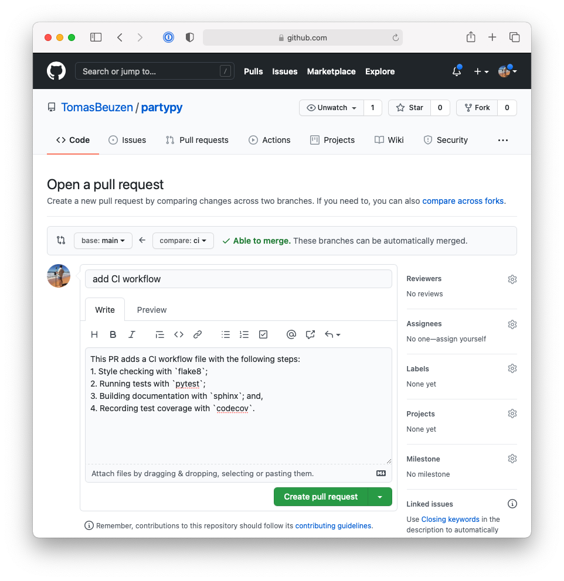
```

Making that pull request will automatically trigger our CI pipeline with GitHub Actions, as can be seen on the newly opened pull request page:

```{r 08-cicd-ci-job-fail, fig.cap = "Triggered GitHub Actions continuous integratino (CI) workflow showing failed checks.", out.width = "100%", fig.retina = 2, fig.align = "center", echo = FALSE, message = FALSE, warning = FALSE}
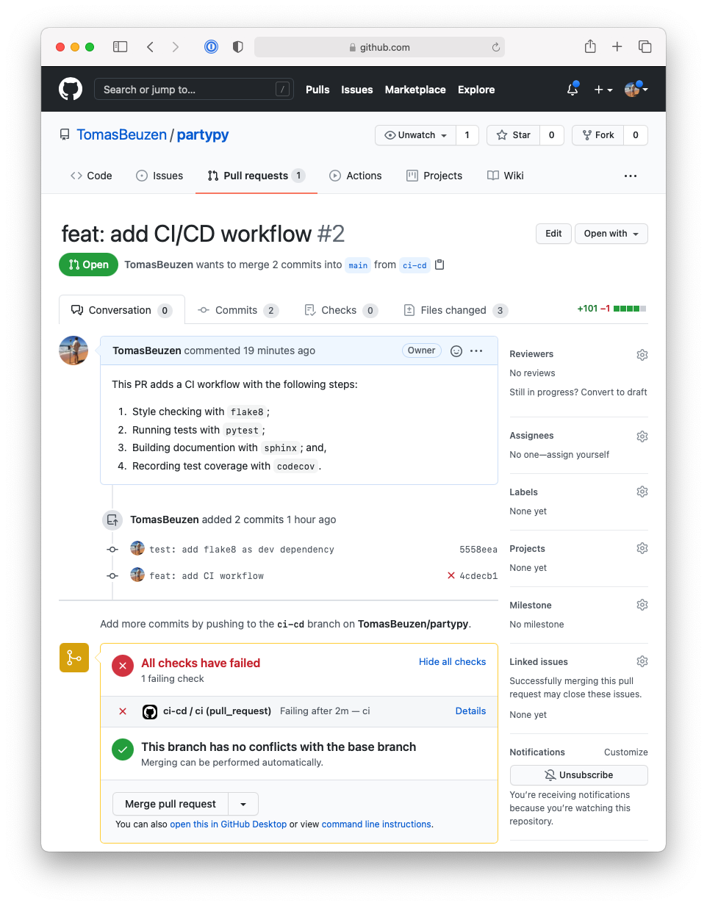
```

We expect our workflow to fail because we didn't fix our `flake8` style issues from earlier. We can click on the workflow to investigate further:

```{r 08-cicd-ci-job-flake8-fail, fig.cap = "Failing continuous integration (CI) workflow due to flake8 style check not passing.", out.width = "100%", fig.retina = 2, fig.align = "center", echo = FALSE, message = FALSE, warning = FALSE}
knitr::include_graphics("../images/cicd-ci-job-flake8-fail.png")
```

We can go back and fix those style violations locally and then commit and push those changes to GitHub, to trigger the CI workflow again. This time, we'd hope to see a passing workflow:

```{r 08-cicd-ci-job-pass, fig.cap = "Passing continuous integration (CI) workflow.", out.width = "100%", fig.retina = 2, fig.align = "center", echo = FALSE, message = FALSE, warning = FALSE}
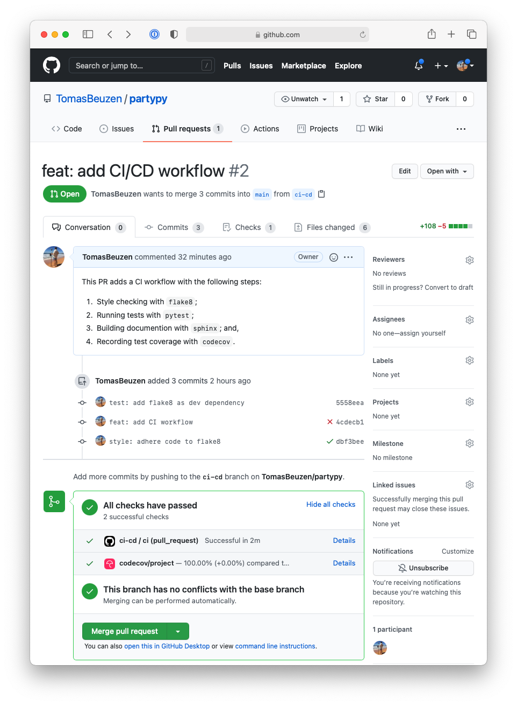
```

Excellent, we have now set up an automated CI pipeline for checking style, running tests, and building documentation, facilitating efficient code updating and collaboration while maintaining package standards and functionality. 

We won't merge that pull request just yet. In the next section we'll develop our CD pipeline and add it to the pull request.

## Continuous deployment

Whereas CI verifies that your updated code is working as expected, Continuous Deployment (CD) takes that updated code and deploys it into production. In the case of Python packaging, that typically means building and pushing an updated package version to PyPI. In the **Chapter 7: [Releasing and versioning]** we discussed how to version and release a Python package. Here, we are going to automate this process with a GitHub Actions workflow.

### Set up

We'll continue working on our "ci-cd" branch from earlier. Our aim here is to add a job to our existing workflow file that will trigger a deployment of our package each time updated code is pushed to the "main" branch of our repository. We only want this job to execute if:

1. the "ci" job before it passes - we don't want to deploy a new version of our package if it isn't passing its tests; and,
2. code is pushed to the "main" branch - we don't want to deploy a new version of our package when a pull request is opened, we only want to deploy a new version when a pull request is merged into the "main" branch or the "main" branch is modified directly.

We can set up a new job and add the two constraints above with the following syntax:

```yaml
name: ci-cd

on:
  push:
    branches:
      - main
  pull_request:
    branches:
      - main

jobs:
  ci:
    # ...
    # CI steps hidden
    # ...
  cd:
    # Only run this job if the "ci" job passes
    needs: ci
    # Only run this job if new work is pushed to "main"
    if: github.event_name == 'push' && github.ref == 'refs/heads/main'
```

Now we can setup our CD workflow. in GitHub Actions, each job runs in a fresh virtual environment so we need to set up our system for each new job. Following that, our CD workflow will effectively comprise all the steps we walked through manually in **Chapter 7: [Releasing and versioning]**:

1. Set up operating system;
2. Set up Python;
3. "Check out" repository so we can access its contents;
4. Install `poetry`;
5. Create a new version of `partypy`;
6. Use `poetry` to build source and wheel distributions for new version of `partypy`;
7. Upload new version to TestPyPI;
8. Test that new version installs successfully from TestPyPI; and,
10. Upload new version to PyPI.

Steps 1-4 are the same as we set up previously for our CI workflow:

```yaml
name: ci-cd

on:
  push:
    branches:
      - main
  pull_request:
    branches:
      - main

jobs:
  ci:
    # ...
    # CI steps hidden
    # ...
  cd:
    # Only run this job if the "ci" job passes
    needs: ci
    # Only run this job if the "main" branch changes
    if: github.event_name == 'push' && github.ref == 'refs/heads/main'
    # Step 1. Set up operating system
    runs-on: ubuntu-latest
    steps:
    # Step 2. Set up Python environment
    - name: Set up Python 3.9
      uses: actions/setup-python@v2
      with:
        python-version: 3.9
    # Step 3. Check-out repository so we can access its contents
    - name: Check-out repository
      uses: actions/checkout@v2
      with:
        fetch-depth: 0
    # Step 4. Install poetry
    - name: Install poetry
      uses: snok/install-poetry@v1
      with:
        version: 1.2.0a2
```

We'll discuss steps 5-10 in more detail in the sections below.

### Creating a new package version

As we went through in **Chapter 7: [Releasing and versioning]**, to create a new release of our package we typically do a few key things:

1. Bump the package version depending on whether we have a patch, minor, or major release;
2. Document what's changed in the new release in the *`CHANGELOG.md`*; and,
3. Create a new release on GitHub (or other hosting service, if you're using one).

We are going to use the [Python Semantic Release](https://python-semantic-release.readthedocs.io/en/latest/) (PSR) tool to help us automate these steps. Put simply, PSR is able to parse commit messages to determine what the next version of the package should be. The idea is to used a standardized commit message format and syntax which PSR can parse to determine how to increment the version number. The parser is customizable but follows the [Angular commit style](https://github.com/angular/angular.js/blob/master/DEVELOPERS.md#commit-message-format) by default, which we've actually been using throughout this book. In this style if a commit message is prefixed with "fix" or "perf" (performance) a patch version bump will be made. If a commit message is prefixed with "feat" (feature) a minor bump will be made. If a message contains "BREAKING CHANGE:" a major bump will occur. There are other commit message types too, such as "doc" and "style" which don't be default result in a version bump (but can be configured to do so if desired).

The PSR tool is not only able to automatically bump our package version based on commit messages, but it can also automatically update our *`CHANGELOG.md`* using the commits since the last release and make a new release of our source on GitHub. We'll add PSR as a step in our CD workflow shortly but first, we'll configure it from our *`pyproject.toml`* file by adding the following section:

```toml
[tool.semantic_release]
version_variable = "pyproject.toml:version" # tells PSR where to find and update package version
branch = "main"                             # branch of repo to generate releases from
changelog_file = "CHANGELOG.md"             # the file we want PSR to update with changes
build_command = false                       # don't build package (we'll do this later)
upload_to_pypi = false                      # don't upload to PyPI (we'll do this later)
upload_to_release = false                   # don't attach built distributions to GitHub release
```

We've added comments above to provide clarity on what each line is doing and you can read more about these different configuration options in the [PSR documentation](https://python-semantic-release.readthedocs.io/en/latest/configuration.html). As you can see, PSR is able to build and upload your package to PyPI automatically as well, but we chose to disable this functionality because in our CD workflow we are going to build our package ourselves and first upload to TestPyPI, make sure we can install it correctly from there, and only then will we upload to PyPI.

With PSR configured, we can now add it as a step to our CD workflow:

```yaml
    # Step 5. Use PSR to increment version
    - name: Python Semantic Release
      run: |
          pip install python-semantic-release --quiet
          git config user.name github-actions
          git config user.email github-actions@github.com
          semantic-release publish -v DEBUG
```

In the code above we first install the PSR tool with `pip`, we then need to configure the `git` credentials on the machine because PSR will be making commits to our repository and credentials (it will be changing files likes *`pyproject.toml`* and *`CHANGELOG.md`*) and credentials (name and email) are required for this, and finally, we use PSR with `semantic-release publish` to execute our versioning workflow (the optional `-v DEBUG` argument tells PSR to print information to the screen as it's executing).

We'll see PSR in action shortly, but let's first configure the rest of our workflow file.

### Build source and wheel distributions

With a new version of our package created, we now need to build new source and wheel distributions using the same `poetry build` command we've used throughout this book:

```yaml
    # Step 6. Build package distributions
    - name: Build source and wheel distributions
      run: poetry build
```

### Uploading to TestPyPI and PyPI

With our new package distributions built, we can publish our package to TestPyPI and try to install it, to make sure everything is working as expected. This step is not strictly necessary but it's a good idea because it can help catch any unexpected errors before releasing your new package publicly on PyPI.

Rather than write the code needed to do all this from scratch, we'll leverage the [gh-action-pypi-publish](https://github.com/pypa/gh-action-pypi-publish) action from the GitHub Actions marketplace. To use this action, we can add the following step to our CD workflow:

```yaml
    # Step 7. Publish to TestPyPI
    - name: Publish to TestPyPI
      uses: pypa/gh-action-pypi-publish@release/v1
      with:
        user: __token__
        password: ${{ secrets.TEST_PYPI_API_TOKEN }}
        repository_url: https://test.pypi.org/legacy/
        skip_existing: true
```

As you can see, this action relies on token authentication with TestPyPI (rather than the classic username and password authentication). To use the action, you'll need to log-in to [TestPyPI](https://test.pypi.org), [create an API token](https://pypi.org/help/#apitoken), and [add the token as a secret](https://docs.github.com/en/actions/reference/encrypted-secrets) called `TEST_PYPI_API_TOKEN` to your GitHub repository.

The above action will publish the new version of your package to TestPyPI. We now want to test that we can install the package correctly from TestPyPI using the same command we used back in **Chapter 3: [How to package a Python]**:

```yaml
    # Step 8. Test install from TestPyPI
    - name: Test install from TestPyPI
      run: |
          pip install \
          --index-url https://test.pypi.org/simple/ \
          --extra-index-url https://pypi.org/simple \
          partypy
```

We can now add the final step to our CD workflow which will be to publish our new package version to PyPI. This uses the same action as earlier, and will require you to obtain a token from PyPI and add the token as a called `PYPI_API_TOKEN` to your GitHub repository.

```yaml
    # Step 9. Publish to PyPI
    - name: Publish to PyPI
      uses: pypa/gh-action-pypi-publish@release/v1
      with:
        user: __token__
        password: ${{ secrets.PYPI_API_TOKEN }}
        skip_existing: true
```

### Testing the CD workflow

We've now set up our CD pipeline. It took a bit of time and a few new tools, but what we have now is an automated way to version and deploy our package, which will save a lot of time and effort in the future. You final `cd` job in *`ci-cd.yml`* workflow file should look like this:

```yaml
name: ci-cd

on:
  push:
    branches:
      - main
  pull_request:
    branches:
      - main

jobs:
  ci:
    # ...
    # CI steps hidden
    # ...
  cd:
    # Only run this job if the "ci" job passes
    needs: ci
    # Only run this job if the "main" branch changes
    if: github.event_name == 'push' && github.ref == 'refs/heads/main'
    # Step 1. Set up operating system
    runs-on: ubuntu-latest
    steps:
    # Step 2. Set up Python environment
    - name: Set up Python 3.9
      uses: actions/setup-python@v2
      with:
        python-version: 3.9
    # Step 3. Check-out repository so we can access its contents
    - name: Check-out repository
      uses: actions/checkout@v2
      with:
        fetch-depth: 0
    # Step 4. Install poetry
    - name: Install poetry
      uses: snok/install-poetry@v1
      with:
        version: 1.2.0a2
    # Step 5. Use PSR to increment version
    - name: Use Python Semantic Release to bump version and tag release
      run: |
          pip install python-semantic-release --quiet
          git config user.name github-actions
          git config user.email github-actions@github.com
          semantic-release publish -v DEBUG
    # Step 6. Build package distributions
    - name: Build source and wheel distributions
      run: poetry build
    # Step 7. Publish to TestPyPI
    - name: Publish to TestPyPI
      uses: pypa/gh-action-pypi-publish@release/v1
      with:
        user: __token__
        password: ${{ secrets.TEST_PYPI_API_TOKEN }}
        repository_url: https://test.pypi.org/legacy/
        skip_existing: true
    # Step 8. Test install from TestPyPI
    - name: Test install from TestPyPI
      run: |
          pip install \
          --index-url https://test.pypi.org/simple/ \
          --extra-index-url https://pypi.org/simple \
          partypy
    # Step 9. Publish to PyPI
    - name: Publish to PyPI
      uses: pypa/gh-action-pypi-publish@release/v1
      with:
        user: __token__
        password: ${{ secrets.PYPI_API_TOKEN }}
        skip_existing: true
 
```

Let's go ahead and commit our changes to version control and push to GitHub:

```{prompt} bash \$ auto
$ git add .github/workflows/ci-cd.yml pyproject.toml
$ git commit -m "feat: add CD workflow"
$ git push
```

Upon pushing this change, we have updated the pull request between the "ci-cd" branch and the "main" branch which triggers our CI/CD workflow. However, because this is a pull request, and we haven't made any changes directly to the "main" branch yet, the `cd` job of our workflow will not be executed:

```{r 08-cicd-cd-skipped, fig.cap = "The continuous deployment (CD) workflow won't be triggered until code is pushed or merged into the main branch.", out.width = "100%", fig.retina = 2, fig.align = "center", echo = FALSE, message = FALSE, warning = FALSE}
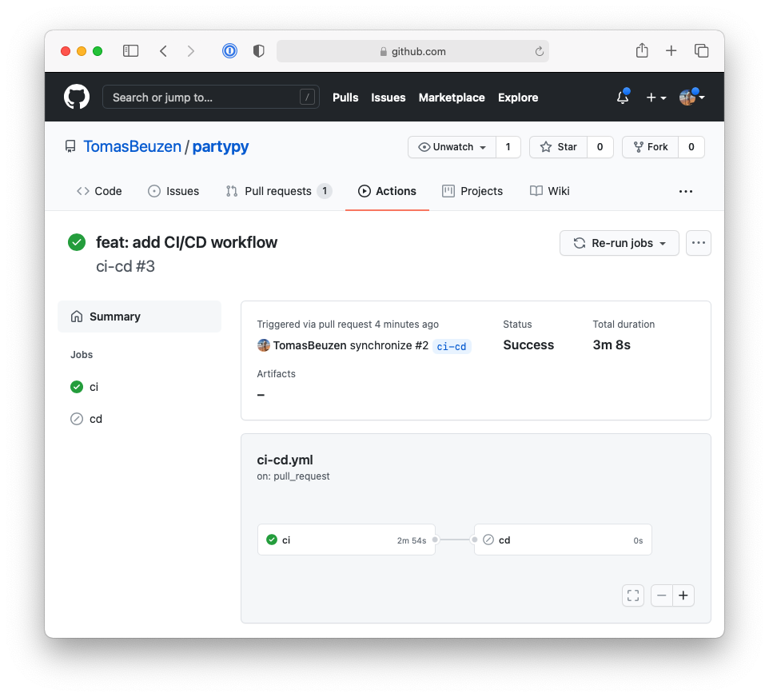
```

That part of the workflow will only be executed upon merging the pull request, which we'll do now. Once merged, the workflow file will be triggered (merging this pull request pushes the new code to "main"), so we can navigate to the "Action" tab of our GitHub repository and view the workflow. This time the `cd` job will be executed:

```{r 08-cicd-cd-triggered, fig.cap = "After merging the pull request, the continuous deployment (CD) workflow is triggered.", out.width = "100%", fig.retina = 2, fig.align = "center", echo = FALSE, message = FALSE, warning = FALSE}
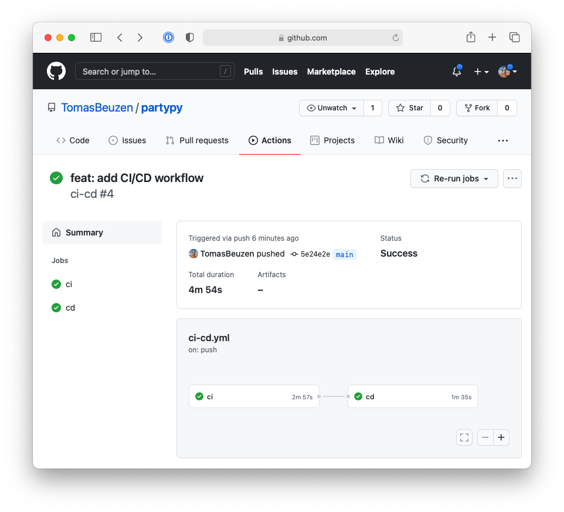
```

Investigating the workflow log, we can see that PSR parsed the commit messages since the previous release, and determined that our package should be bumped with a minor release from 0.2.0 to 0.3.0:

```{r 08-cicd-psr-log, fig.cap = "Python Semantic Release (PSR) log showing how commit messages were parsed in order to determine the next package version.", out.width = "100%", fig.retina = 2, fig.align = "center", echo = FALSE, message = FALSE, warning = FALSE}
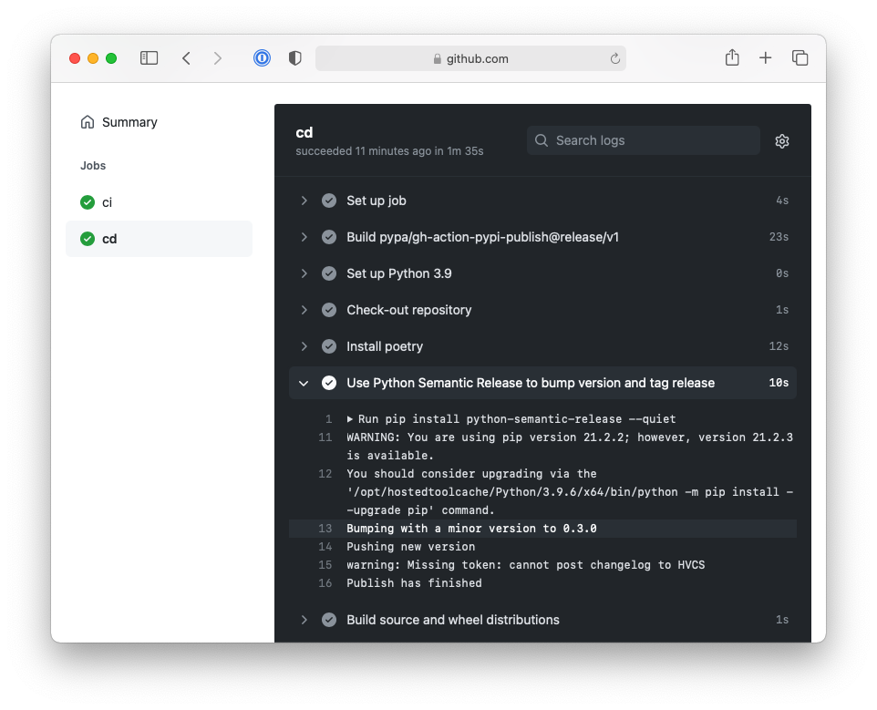
```

We can also see that a new version of our package was released to TestPyPI, successfully installed from TestPyPI, and finally released to PyPI:

```{r 08-cicd-pypi-deploy, fig.cap = "Continuous deployment of new package version to PyPI.", out.width = "100%", fig.retina = 2, fig.align = "center", echo = FALSE, message = FALSE, warning = FALSE}
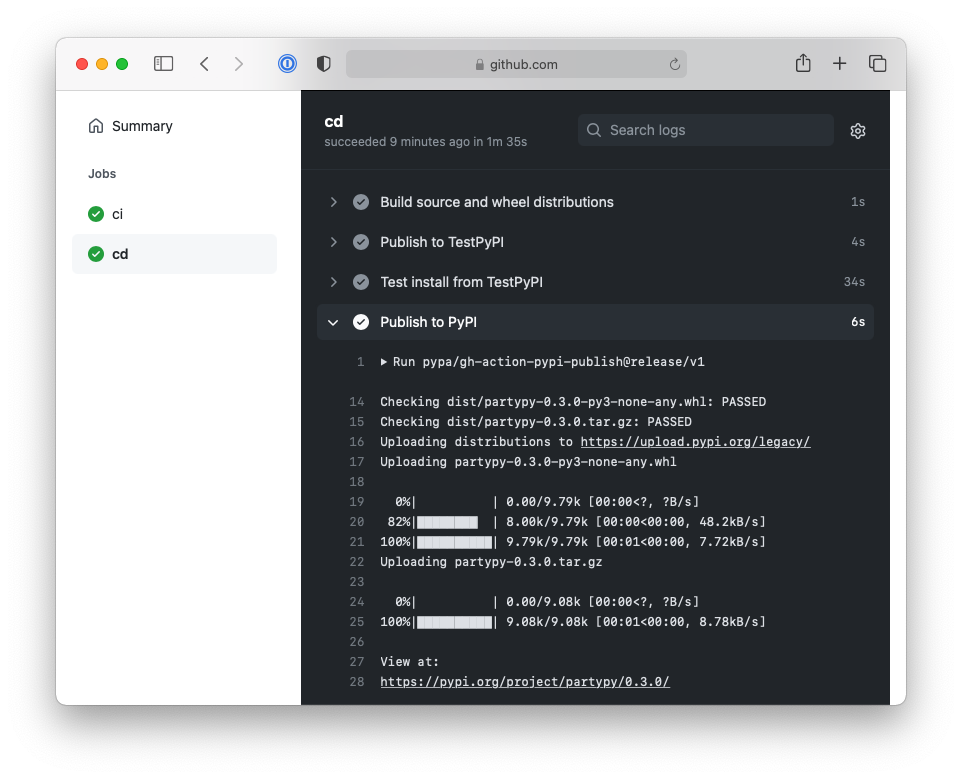
```

We can also see how PSR automatically updated our *`CHANGELOG.md`*:

```{r 08-cicd-psr-changelog, fig.cap = "Automatically updated CHANGELOG.", out.width = "100%", fig.retina = 2, fig.align = "center", echo = FALSE, message = FALSE, warning = FALSE}
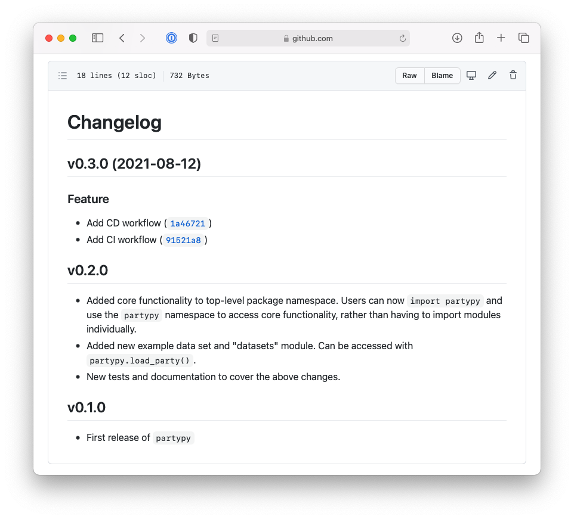
```

## An example of CI/CD in action

<!-- #region -->
To finish off this chapter, we'll go through the process of updating our `partypy` package one more time. We are going to add a brand new feature to our package; the option to add confidence intervals to the histogram plots output by `plotting.plot_simulation()`, like this:

```{r 08-altair-plot-2, fig.cap = "Histogram of simulation results with 95% confidence intervals.", out.width = "60%", fig.retina = 2, fig.align = "center", echo = FALSE, message = FALSE, warning = FALSE}
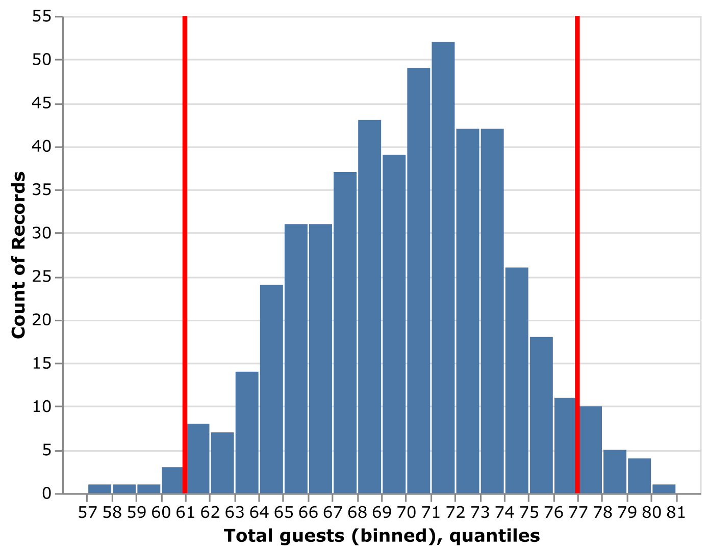
```

The general process we'll follow to make changes to our package is as follows:

1. Create a new development branch with a version control system;
2. Update package source, including Python code, tests, and documentation; and,
3. Push changes to GitHub to trigger CI/CD.

```{prompt} bash \$ auto
$ git checkout main
$ git pull
$ git checkout -b add-conf-int
```

```console
Switched to a new branch 'add-conf-int'
```

We will now update `src/partypy/plotting.py`. We won't go over the newly added code in detail, but we are adding a new helper function `_quantiles()` which will be used to calculate and draw confidence intervals if a user passes the optional argument `C` to the `plot_simulation()` function:

```python
import pandas as pd
import altair as alt

def _quantiles(results, C=0.95):
    """Calculate quantiles of simulation results.

    Parameters
    ----------
    results : pandas.DataFrame
        DataFrame of simulation results from `partpy.simulate_party()`
    C : float, optional
        Confidence level, between 0 and 1. By default, 0.95.
    """
    if not 0 < C < 1:
        raise ValueError("ci must be 0 < ci < 1.")
    lower_q = results.quantile(0.5 - C / 2).to_numpy()
    upper_q = results.quantile(0.5 + C / 2).to_numpy()
    return lower_q, upper_q

def plot_simulation(results, C=None):
    """Plot a histogram of simulation results.

    Parameters
    ----------
    results : pandas.DataFrame
        DataFrame of simulation results from `partpy.simulate_party()`
    C : float, optional
        Confidence level, between 0 and 1. If provided, confidence intervals
        will be displayed on chart. By default, 0.95.

    Returns
    -------
    altair.Chart
        Histogram of simulation results.

    Examples
    --------
    >>> from partypy.simulate import simulate_party
    >>> from partypy.plotting import plot_simulation
    >>> results = simulate([0.1, 0.5, 0.9])
    >>> plot_simulation(results)
    altair.Chart
    """

    histogram = (
        alt.Chart(results)
        .mark_bar()
        .encode(
            x=alt.X(
                "Total guests",
                bin=alt.Bin(maxbins=30),
                axis=alt.Axis(format=".0f"),
            ),
            y="count()",
            tooltip="count()",
        )
    )

    if C is not None:
        lower_q, upper_q = _quantiles(results, C)
        quantiles = (
            alt.Chart(
                pd.DataFrame({"quantiles": [lower_q, upper_q]})
            )
            .mark_rule(color="red", strokeWidth=3)
            .encode(x="quantiles:Q")
        )
        return histogram + quantiles
    else:
        return histogram

```

Let's now commit this source code change to local version control:

```{prompt} bash \$ auto
$ git add src/partypy/plotting.py
$ git commit -m "feat: add confidence interval option to plot_simulation"
```

We will now also add the following test to *`tests/test_partypy.py`* to cover the new code we wrote and commit the change to version controls:

```python
def test_plot_simulation_ci(test_data):
    results = simulate_party(test_data["p_0"])
    plot = plot_simulation(results, C=0.95)
    assert isinstance(plot, alt.LayerChart)
    assert plot.layer[0].mark == "bar"
    assert plot.layer[0].data["Total guests"].sum() == 0
    with raises(ValueError):
        plot_simulation(results, C=0)
```

```{prompt} bash \$ auto
$ git add tests/test_partypy.py
$ git commit -m "test: add tests for confidence interval option"
```

Finally, we'll update the *`docs/source/usage.ipynb`* documentation to include an example of using the new confidence interval argument in `plot_simulation()`:

```{r 08-documentation-notebook-run-4, fig.cap = "Updated usage documentation showing new confidence intervals feature.", out.width = "100%", fig.retina = 2, fig.align = "center", echo = FALSE, message = FALSE, warning = FALSE}
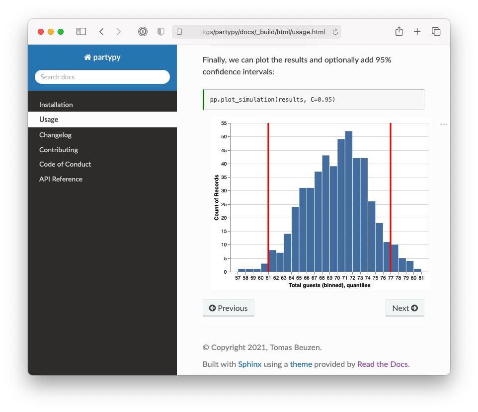
```

```{prompt} bash \$ auto
$ git add docs/source/usage.ipynb
$ git commit -m "docs: add usage example of confidence interval option"
$ git push
```

We've now made the desired changes to add the new "confidence interval plotting feature" to our package. To take advantage of our new CI/CD workflow, all we need to do now is open a pull request with the "main" branch, as we've done previously. This will trigger the CI workflow but not the CD workflow. If the CI passes and you're happy with changes, merge the pull request into "main" and watch as our CD workflow automatically releases a new version of the `partypy` package to PyPI!

```{r 08-cicd-example-new-release, fig.cap = "Continuous deployment workflow automatically released package version 0.4.0 to PyPI.", out.width = "100%", fig.retina = 2, fig.align = "center", echo = FALSE, message = FALSE, warning = FALSE}
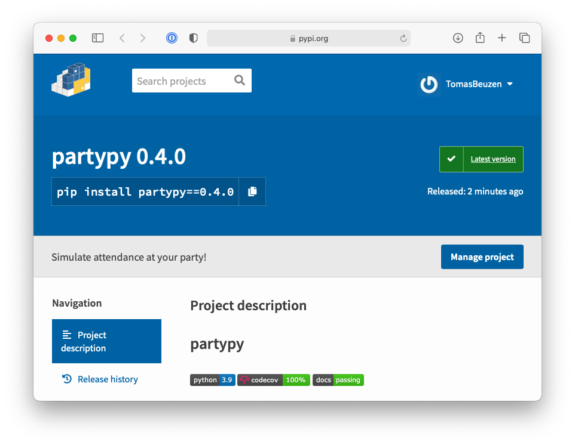
```

Overall, CI/CD is a great way to streamline your package development and open-source collaboration. In this chapter we've walked through a simple CI/CD workflow for a Python package using tools like `poetry`, GitHub Actions, and Python Semantic Release. These, and other, tools can be configured in many different ways to achieve almost any workflow imaginable!
<!-- #endregion -->

<!--chapter:end:08-ci-cd.Rmd-->


# Bibliography

<!-- #region -->
```{bibliography}
:style: unsrt
```
<!-- #endregion -->

<!--chapter:end:09-bibliography.Rmd-->


(A1:Packages-with-a-command-line-interface)=
# Packages with a command line interface


Many Python packages include a command line interface (CLI) - that is, functionality you can access directly from the command line, without having to start up a Python session. The `cookiecutter` tool we've used throughout this book is one such example. CLIs can help users more effectivaly interact with your software, are often easier to use with virtual machines, and can make it easier to automate processes via scripting. Luckily, it's quite easy to configure Python packages to include a CLI, especially if you're using the `poetry` package manager tool. In this chapter, we'll walk through setting up a very simple Python Package that includes a CLI.

## CLI package structure

<!-- #region -->
As we've seen throughout this book, Python packages follow a standard structure and you can quickly set this structure up using the [UBC-MDS cookiecutter template](https://github.com/UBC-MDS/cookiecutter-ubc-mds):

```{prompt} bash
cookiecutter https://github.com/UBC-MDS/cookiecutter-ubc-mds.git
```

With this command, you end up with a structure that looks something like this:

```md
pypkgs
├── .gitignore
├── .readthedocs.yml
├── CONDUCT.rst
├── CONTRIBUTING.rst
├── docs
├── pypkgs
│   ├── __init__.py
│   └── pypkgs.py
├── LICENSE
├── pyproject.toml
├── README.md
└── tests
    ├── __init__.py
    └── test_pypkgs.py
```

We will continue to build off the `pypkgs` package we've developed throughout this book, but the instructions below will generalise to any package. To create a basic CLI for our package, there's not too much more we have to do to this structure! First, we need to add a script that will contain our CLI code. Let's go ahead and do that now by adding a new Python module called `cli.py` to the `pypkgs` subdirectory now, so that our directory structure becomes:

```md
pypkgs
├── .gitignore
├── .readthedocs.yml
├── CONDUCT.rst
├── CONTRIBUTING.rst
├── docs
├── pypkgs
│   ├── __init__.py
│   ├── cli.py  #  <-- We added our script here!
│   └── pypkgs.py
├── LICENSE
├── pyproject.toml
├── README.md
└── tests
    ├── __init__.py
    └── test_pypkgs.py
```

>You can call your CLI script anything you like, and put it anywhere in your package directory that you like, but the set up shown above is  common.

While our CLI module is empty for now, let's go ahead and configure `poetry` to incorporate the CLI into our future package build. All we need to do is give our CLI an alias and point `poetry` to the location of the code we want to run when that alias is used at the CL. To do this, we need to add the following in the `pyproject.toml` file:

```{prompt} bash
[tool.poetry.scripts]
pypkgs = "pypkgs.cli:main"
```

This syntax points `poetry` to executable scripts that should be installed when your package is being installed. In our case, we are pointing the the `cli.py` module and the `main()` function within it (which doesn't exist yet but we'll create it shortly). You can read more about this configuration in the [`poetry` documentation](https://python-poetry.org/docs/pyproject/#scripts). The `pypkgs` on the left of the equals sign is the alias you will use to access your CLI, e.g., we will be able to type at the CL `pypkgs <args>`. You can call it anything you like, it doesn't have to be the same as your package name, but it should typically be short and sweet! In the next section we'll build up the syntax and code to actually create a working CLI.

>If you're using `Setuptools` isntead of `poetry` to develop your package, the CLI configuration can be a little more involved, check out [this documentation](https://python-packaging.readthedocs.io/en/latest/command-line-scripts.html#command-line-scripts) to learn more. 

<!-- #endregion -->

## CLI tools and code

There are many ways to set up your `cli.py` script, I'm going to show, what in my opinion, is the simplest here. Go ahead and open up `cli.py` in an editor of your choice. Let's first make sure that everything is working by creating a `main()` function (this could be called anything, but we'll call it main here and have specified that in `pyproject.toml`) in `cli.py` by adding the following text into the file:

```python
def main():
    print("Coming to you from the command line!")
```

Now, we can re-install our package and test it by using our previously specified CLI alias of `pypkgs`:

```{prompt} bash
poetry install
pypkgs
```

```console
Coming to you from the command line!
```

Great, looks like everything is working so far. But we are going to want to create more complicated CLIs than this, in particular, CLIs that can accept arguments! There are many tools available to help build Python CLI's, popular ones include:

- [`argparse`](https://docs.python.org/3/library/argparse.html) (part of the Python standard library)
- [`click`](https://click.palletsprojects.com/en/7.x/)
- [`docopt`](http://docopt.org/)
- [`fire`](https://google.github.io/python-fire/guide/)

All of these different packages share the same goal - to turn Python code into a CLI. Here, we'll be using `argparse` because it is part of the Python standard library and is easy and intuitive to use for simple CLIs. 

The goal of this chapter is not to teach the syntax of `argparse` (which the [official `argparse` documenation](https://docs.python.org/3/library/argparse.html#module-argparse) does an excellent job of already). Rather, here we wish to show how easy it is to incorporate a CLI into your Python package. We will leverage a simple CLI example from the [official `argparse` documenation](https://docs.python.org/3/library/argparse.html#module-argparse) that takes in a list of numbers and provides either the sum or the max of those numbers based on the command given.

To create this functionality, simply copy-paste the following code into `cli.py` and we'll then walk through it step-by-step:

```python
import argparse

def main():
    args = parse_args()
    print(args.accumulate(args.integers))

def parse_args():
    parser = argparse.ArgumentParser(description='Process some integers.')
    parser.add_argument('integers', metavar='N', type=int, nargs='+',
                        help='an integer for the accumulator')
    parser.add_argument('--sum', dest='accumulate', action='store_const',
                        const=sum, default=max,
                        help='sum the integers (default: find the max)')
    return parser.parse_args()

```

In the code above, the first thing we are doing is importing the `argparse` module which we will use to help parse CL arguments. We then have our `main()` function, which is the function that will be called when we execute our package CLI with the alias `pypks`. The way `poetry` and Python CLIs currently work, we can't pass argument directly to this function, so instead, we define another function `parse_args()` to parse any CL arguments, and this is called within `main()`. 

As for the `parse_args()` function, it contains a bunch of `argparse`-specific syntax for creating an object that can parse CL arguments. Briefly, the first line (`parser = ...`) sets up the parsing object which will hold all the information necessary to parse the command line into Python data types. We then add two passable arguments, the first is "integers", which must be of type `int` and can accept any arbitrary number of integers from the CL. The second argument is "--sum", this is an optional argument which returns the sum of the passed integers, otherwise the maximum of the passed integers is returned. In addition, all `argparse` object come with an optional help argument (specified with `-h` or `--help`), which will return a summary of all possible CL arguments and their help description (if provided). Check out the [documentation](https://docs.python.org/3/library/argparse.html#module-argparse) for a more comprehensive walkthrough of this example.

We can test out our brand new CL by re-installing our package and checking the help documentation:

```{prompt} bash
poetry install
pypkgs --help
```

```console
usage: pypkgs [-h] [--sum] N [N ...]

Process some integers.

positional arguments:
  N           an integer for the accumulator

optional arguments:
  -h, --help  show this help message and exit
  --sum       sum the integers (default: find the max)
```

It seems to be working! Let's see if we can calculate the maximum and the sum of a set of integers:

```{prompt} bash
pypkgs 1 2 3 4 5
```

```console
5
```
```{prompt} bash
pypkgs --sum 1 2 3 4 5
```

```console
16
```

Awesome! We've implemented a basic CLI here to show how this functionality can be accommodated in Python packages. You can check out a more complicated Python package CLI, called [`PyWebCat`](https://github.com/UNCG-DAISY/PyWebCAT), that I wrote to interface with some open-source coastal video footage, following the above guidelines and structure. I also encourage you to take a look at the CLIs of any larger, open-source Python packages you use (like [`cookiecutter`](https://github.com/cookiecutter/cookiecutter) for example) to better understand how to write effective CLIs.

<!--chapter:end:A1-cli.Rmd-->


(A2:Python-packaging-cheat-sheet)=
# Python packaging cheat sheet


```{figure} images/py_pkgs_cheatsheet.png
---
width: 100%
name: a2-cheat-sheet
alt: The Python packaging cheatsheet. [Download the cheat sheet here.](https://github.com/UBC-MDS/py-pkgs/blob/master/py-pkgs/images/raw/py_pkgs_cheatsheet.pdf)
---
The Python packaging cheatsheet. [Download the cheat sheet here.](https://github.com/UBC-MDS/py-pkgs/blob/master/py-pkgs/images/raw/py_pkgs_cheatsheet.pdf)
```

<!-- #region -->
Here we provide a cheat sheet guide for developing a Python package with the packaging tools discussed in this book, such as [poetry](https://python-poetry.org/), [cookiecutter](https://cookiecutter.readthedocs.io/), and [GitHub Actions](https://docs.github.com/en/actions). This cheat sheet should be used as a reference for those that know what they're doing and just need a quick look-up resource. If you're a beginner Python packager, it is recommended that you start from the beginning of this book.

[**Download the cheat sheet from GitHub here.**](https://github.com/UBC-MDS/py-pkgs/blob/master/py-pkgs/images/raw/py_pkgs_cheatsheet.pdf)

>While this cheat sheet specifically relies on [poetry](https://python-poetry.org/) as a Python package manager, builder, and publisher, the general packaging workflow shown is applicable to other packaging tools too.

<!-- #endregion -->

<!--chapter:end:A2-cheatsheet.Rmd-->

