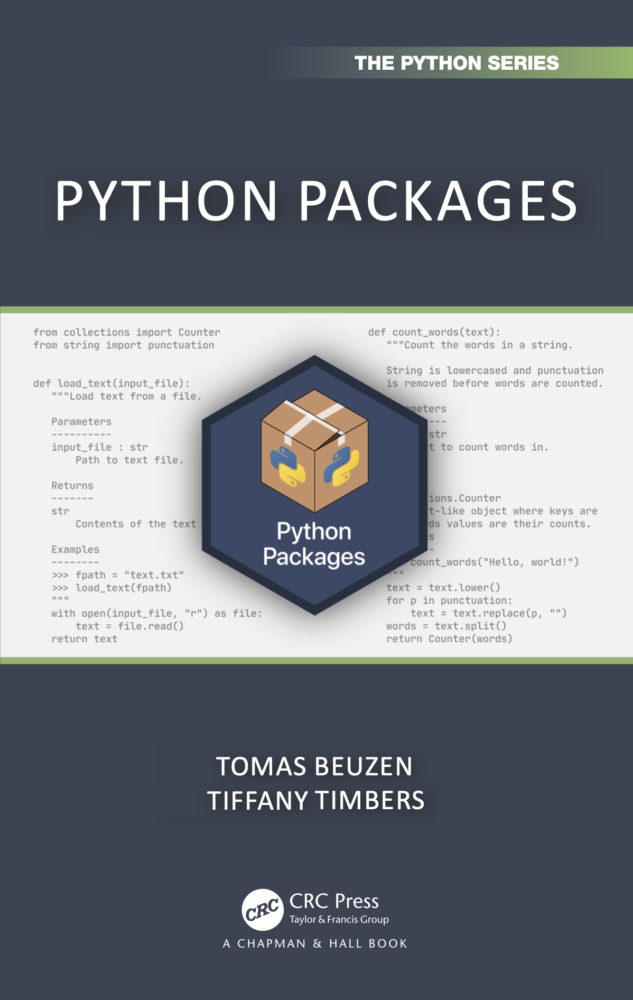

::: {.content-visible when-format="html"}

# Welcome to Python Packages! {.unnumbered .unlisted}

[**Tomas Beuzen**](https://www.tomasbeuzen.com/) & [**Tiffany Timbers**](http://tiffanytimbers.com)

Python packages are a core element of the Python programming language and are how you create organized, reusable, and shareable code in Python. *Python Packages* is an open source book that describes modern and efficient workflows for creating Python packages.

::: {.callout-tip}
You can purchase the book at [CRC Press](https://www.routledge.com/Python-Packages/Beuzen-Timbers/p/book/9781032029443) or on [Amazon](https://www.amazon.com/Python-Packages-Chapman-Hall-Crc/dp/1032029447).
:::

{width="400px"}

This work by Tomas Beuzen and Tiffany Timbers is licensed under a [Creative Commons Attribution-NonCommercial-ShareAlike 4.0 International License](https://creativecommons.org/licenses/by-nc-sa/4.0/).

:::
